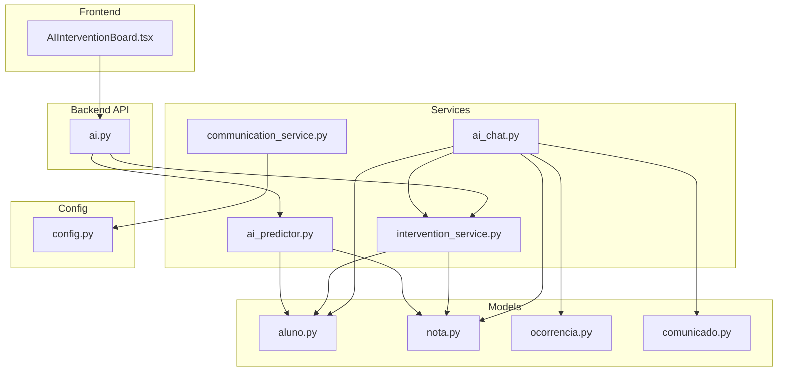
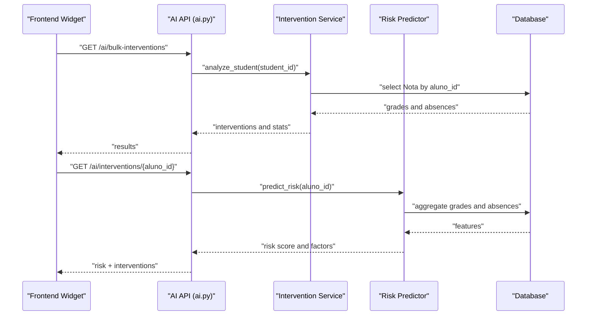
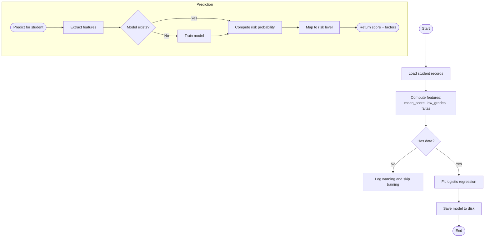
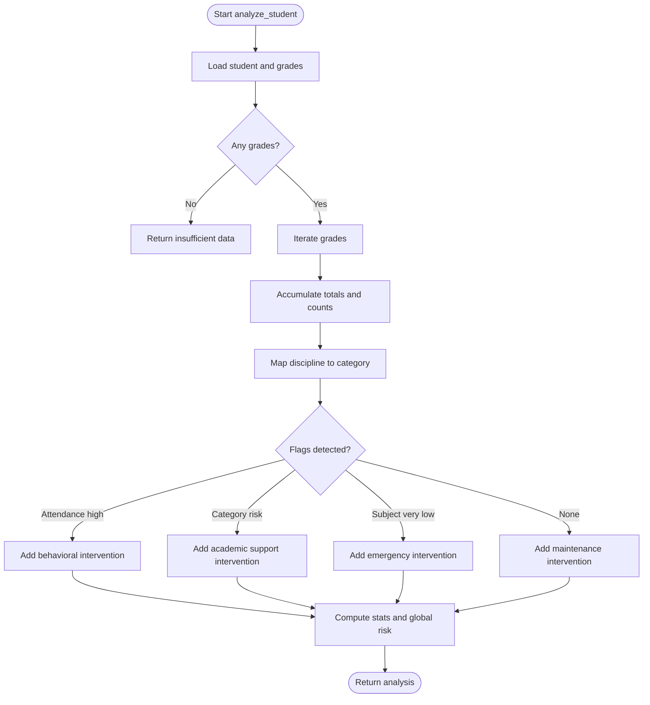
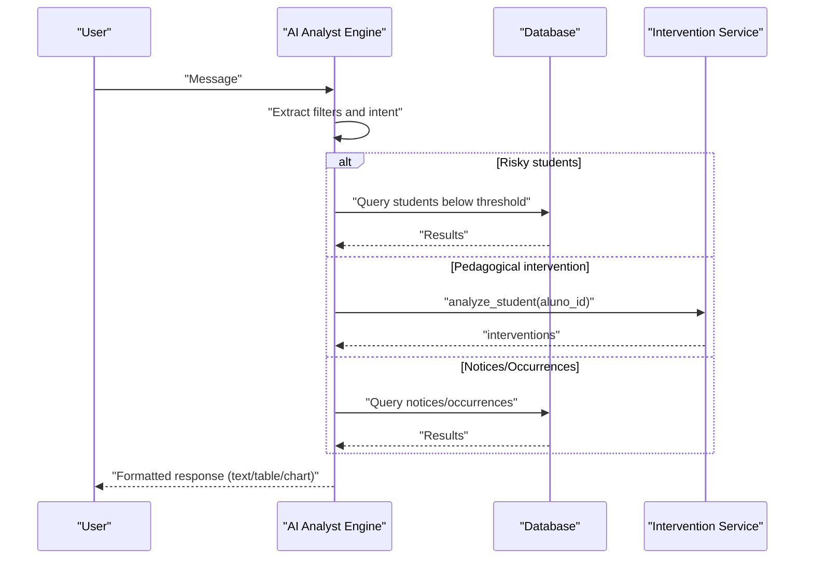
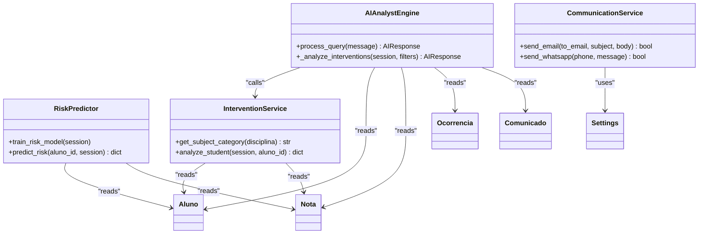
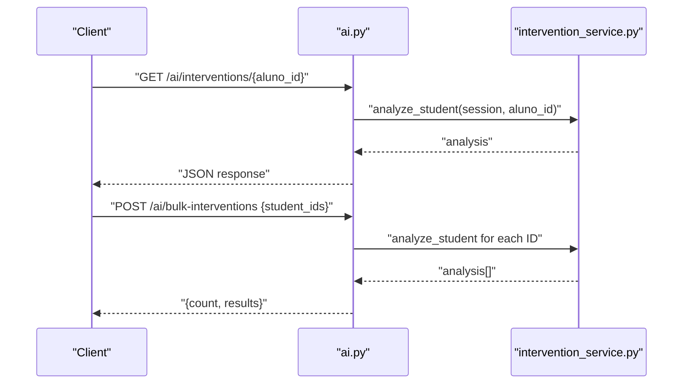
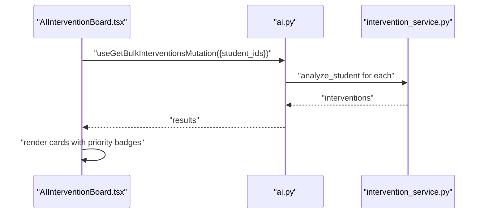
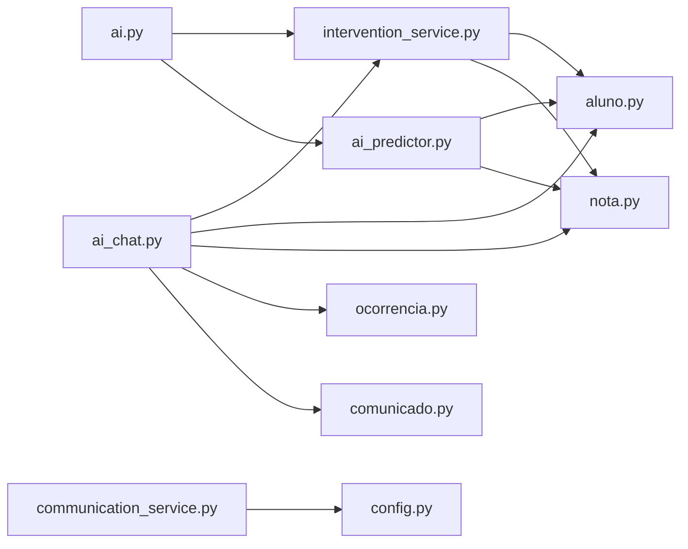
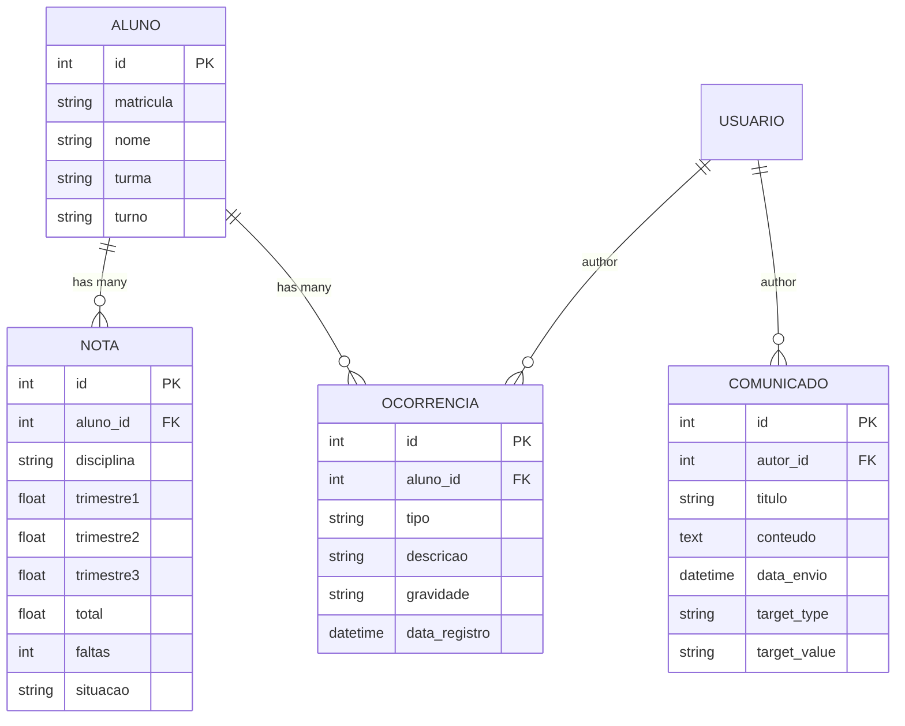

# AI-Powered Interventions

<cite>
**Referenced Files in This Document**
- [intervention_service.py](file://backend/app/services/intervention_service.py)
- [ai_predictor.py](file://backend/app/services/ai_predictor.py)
- [ai.py](file://backend/app/api/v1/ai.py)
- [ai_chat.py](file://backend/app/services/ai_chat.py)
- [communication_service.py](file://backend/app/services/communication_service.py)
- [config.py](file://backend/app/core/config.py)
- [aluno.py](file://backend/app/models/aluno.py)
- [nota.py](file://backend/app/models/nota.py)
- [ocorrencia.py](file://backend/app/models/ocorrencia.py)
- [comunicado.py](file://backend/app/models/comunicado.py)
- [AIInterventionBoard.tsx](file://frontend/src/features/dashboard/AIInterventionBoard.tsx)
- [test_intervention.py](file://backend/test_intervention.py)
</cite>

## Table of Contents
1. [Introduction](#introduction)
2. [Project Structure](#project-structure)
3. [Core Components](#core-components)
4. [Architecture Overview](#architecture-overview)
5. [Detailed Component Analysis](#detailed-component-analysis)
6. [Dependency Analysis](#dependency-analysis)
7. [Performance Considerations](#performance-considerations)
8. [Troubleshooting Guide](#troubleshooting-guide)
9. [Conclusion](#conclusion)
10. [Appendices](#appendices)

## Introduction
This document explains the AI-powered interventions subsystem of the platform. It covers how the system performs risk assessment, generates pedagogical recommendations, and integrates with external communication channels. It also documents the AI chat engine that interprets natural language queries into actionable analytics and intervention insights, and how these insights connect to student academic records, disciplinary history, and communication patterns. The goal is to make the AI features accessible to educators while providing developers with sufficient technical depth to customize algorithms, extend capabilities, and integrate external AI services.

## Project Structure
The AI interventions feature spans backend services, models, API endpoints, and a frontend dashboard widget. The backend orchestrates:
- Risk modeling and prediction
- Pedagogical intervention generation
- Natural language query processing and analytics
- Communication delivery (email and WhatsApp)
- Frontend dashboard rendering of AI-generated interventions

**Diagram sources**
- [AIInterventionBoard.tsx](file://frontend/src/features/dashboard/AIInterventionBoard.tsx)
- [ai.py](file://backend/app/api/v1/ai.py)
- [intervention_service.py](file://backend/app/services/intervention_service.py)
- [ai_predictor.py](file://backend/app/services/ai_predictor.py)
- [ai_chat.py](file://backend/app/services/ai_chat.py)
- [communication_service.py](file://backend/app/services/communication_service.py)
- [aluno.py](file://backend/app/models/aluno.py)
- [nota.py](file://backend/app/models/nota.py)
- [ocorrencia.py](file://backend/app/models/ocorrencia.py)
- [comunicado.py](file://backend/app/models/comunicado.py)
- [config.py](file://backend/app/core/config.py)

**Section sources**
- [AIInterventionBoard.tsx](file://frontend/src/features/dashboard/AIInterventionBoard.tsx)
- [ai.py](file://backend/app/api/v1/ai.py)
- [intervention_service.py](file://backend/app/services/intervention_service.py)
- [ai_predictor.py](file://backend/app/services/ai_predictor.py)
- [ai_chat.py](file://backend/app/services/ai_chat.py)
- [communication_service.py](file://backend/app/services/communication_service.py)
- [aluno.py](file://backend/app/models/aluno.py)
- [nota.py](file://backend/app/models/nota.py)
- [ocorrencia.py](file://backend/app/models/ocorrencia.py)
- [comunicado.py](file://backend/app/models/comunicado.py)
- [config.py](file://backend/app/core/config.py)

## Core Components
- PedagogicalInterventionService: Computes risk-based interventions from academic and attendance data, categorizes subjects, and produces prioritized recommendations.
- Risk predictor: Trains a logistic regression model to estimate failure risk and returns a risk score with factor breakdowns.
- AI Analyst Engine: Interprets natural language queries into analytics, charts, lists, and pedagogical intervention suggestions.
- Communication Service: Sends notifications via email and WhatsApp using configured external APIs.
- API endpoints: Expose single-student and bulk intervention generation, plus AI chat analytics.
- Frontend dashboard widget: Renders AI-generated interventions in a responsive grid with priority indicators.

**Section sources**
- [intervention_service.py](file://backend/app/services/intervention_service.py)
- [ai_predictor.py](file://backend/app/services/ai_predictor.py)
- [ai_chat.py](file://backend/app/services/ai_chat.py)
- [communication_service.py](file://backend/app/services/communication_service.py)
- [ai.py](file://backend/app/api/v1/ai.py)
- [AIInterventionBoard.tsx](file://frontend/src/features/dashboard/AIInterventionBoard.tsx)

## Architecture Overview
The AI interventions architecture combines deterministic heuristics with machine learning risk modeling and natural language understanding. Data flows from student records (academic scores, absences, statuses) into intervention logic and risk predictors, which feed both API endpoints and the AI chat engine. Results are surfaced to the frontend dashboard and can trigger automated communications.

**Diagram sources**
- [ai.py](file://backend/app/api/v1/ai.py)
- [intervention_service.py](file://backend/app/services/intervention_service.py)
- [ai_predictor.py](file://backend/app/services/ai_predictor.py)
- [aluno.py](file://backend/app/models/aluno.py)
- [nota.py](file://backend/app/models/nota.py)

## Detailed Component Analysis

### Risk Assessment Algorithms
The risk predictor trains a logistic regression model to classify students at risk of failure based on:
- Mean score across subjects
- Number of failing grades
- Total absences

Training and prediction logic:
- Training aggregates per-student features and labels a student as risky if they meet heuristic thresholds (e.g., multiple failing grades or excessive absences).
- Prediction computes a risk probability given the same features and returns a categorized risk level and contributing factors.

**Diagram sources**
- [ai_predictor.py](file://backend/app/services/ai_predictor.py)
- [aluno.py](file://backend/app/models/aluno.py)
- [nota.py](file://backend/app/models/nota.py)

**Section sources**
- [ai_predictor.py](file://backend/app/services/ai_predictor.py)

### Intervention Recommendations Engine
The intervention service analyzes a student’s academic record and attendance to produce:
- Subject category clustering (e.g., exact sciences, humanities, languages)
- Low-performing subjects and category-wise risk
- Attendance-based alerts
- Emergency, behavioral, academic, and maintenance recommendations
- Global risk classification and statistics

**Diagram sources**
- [intervention_service.py](file://backend/app/services/intervention_service.py)
- [aluno.py](file://backend/app/models/aluno.py)
- [nota.py](file://backend/app/models/nota.py)

**Section sources**
- [intervention_service.py](file://backend/app/services/intervention_service.py)

### Pedagogical Analysis Capabilities
The AI Analyst Engine interprets natural language queries into actionable analytics:
- Intent detection via regex patterns for charts, risk lists, counts, faults, best students, performance comparisons, hardest subjects, status distributions, notices, occurrences, student lookups, dropout radar, missing grades, and pedagogical interventions.
- Filters extraction for class, grade level, shift, trimester, and student name.
- SQL-backed analytics with joins across students, grades, notices, and occurrences.
- Responses formatted as text, tables, or charts with metadata for the frontend.

**Diagram sources**
- [ai_chat.py](file://backend/app/services/ai_chat.py)
- [intervention_service.py](file://backend/app/services/intervention_service.py)
- [aluno.py](file://backend/app/models/aluno.py)
- [nota.py](file://backend/app/models/nota.py)
- [ocorrencia.py](file://backend/app/models/ocorrencia.py)
- [comunicado.py](file://backend/app/models/comunicado.py)

**Section sources**
- [ai_chat.py](file://backend/app/services/ai_chat.py)

### Integration with External AI Services and Prompt Engineering
Current implementation uses local heuristics and ML models. To integrate external AI services:
- Define a unified interface for AI providers (e.g., OpenAI, Claude, Azure OpenAI) with standardized prompts and response parsing.
- Implement a provider-agnostic adapter that accepts structured inputs (student profile, historical data) and returns structured outputs (risk score, recommendations, action items).
- Apply prompt engineering patterns:
  - Role and persona definition for educators
  - Step-by-step reasoning blocks
  - Structured output schemas (JSON) for downstream processing
  - Safety guards against prompt injection and policy violations
- Add caching and fallback strategies to handle latency and outages.

[No sources needed since this section provides general guidance]

### Response Processing and Delivery
- Risk predictor returns a numeric score and categorical status with contributing factors.
- Intervention service returns prioritized actions with impact categories and descriptions.
- AI chat engine formats analytics into text, tables, or charts with chart configurations.
- Communication service supports email and WhatsApp delivery using configured credentials and endpoints.

**Diagram sources**
- [ai_predictor.py](file://backend/app/services/ai_predictor.py)
- [intervention_service.py](file://backend/app/services/intervention_service.py)
- [ai_chat.py](file://backend/app/services/ai_chat.py)
- [communication_service.py](file://backend/app/services/communication_service.py)
- [aluno.py](file://backend/app/models/aluno.py)
- [nota.py](file://backend/app/models/nota.py)
- [ocorrencia.py](file://backend/app/models/ocorrencia.py)
- [comunicado.py](file://backend/app/models/comunicado.py)
- [config.py](file://backend/app/core/config.py)

**Section sources**
- [ai_predictor.py](file://backend/app/services/ai_predictor.py)
- [intervention_service.py](file://backend/app/services/intervention_service.py)
- [ai_chat.py](file://backend/app/services/ai_chat.py)
- [communication_service.py](file://backend/app/services/communication_service.py)
- [config.py](file://backend/app/core/config.py)

### API Workflows and Examples
- Single student interventions: GET /ai/interventions/{aluno_id}
- Bulk interventions: POST /ai/bulk-interventions with student_ids array
- AI chat analytics: Natural language queries processed by AI Analyst Engine

Concrete examples from the codebase:
- Single student analysis endpoint returns interventions and stats for a given aluno_id.
- Bulk endpoint iterates student IDs, invokes the intervention service, and returns aggregated results.
- AI chat engine routes messages to specific analyzers and returns formatted responses.

**Diagram sources**
- [ai.py](file://backend/app/api/v1/ai.py)
- [intervention_service.py](file://backend/app/services/intervention_service.py)

**Section sources**
- [ai.py](file://backend/app/api/v1/ai.py)
- [test_intervention.py](file://backend/test_intervention.py)

### Frontend Integration and Visualization
The AI Intervention Board fetches bulk interventions and renders them as cards with:
- Priority indicators (high/medium/low)
- Titles and descriptions of recommended actions
- Student name and avatar
- Responsive grid layout

**Diagram sources**
- [AIInterventionBoard.tsx](file://frontend/src/features/dashboard/AIInterventionBoard.tsx)
- [ai.py](file://backend/app/api/v1/ai.py)
- [intervention_service.py](file://backend/app/services/intervention_service.py)

**Section sources**
- [AIInterventionBoard.tsx](file://frontend/src/features/dashboard/AIInterventionBoard.tsx)

## Dependency Analysis
- Data models: Aluno, Nota, Ocorrencia, Comunicado form the foundation for analytics and intervention logic.
- Services depend on SQLAlchemy ORM to query and aggregate data.
- API endpoints depend on services and enforce role-based access.
- Communication service depends on configuration settings for external API endpoints.

**Diagram sources**
- [ai.py](file://backend/app/api/v1/ai.py)
- [intervention_service.py](file://backend/app/services/intervention_service.py)
- [ai_predictor.py](file://backend/app/services/ai_predictor.py)
- [ai_chat.py](file://backend/app/services/ai_chat.py)
- [communication_service.py](file://backend/app/services/communication_service.py)
- [aluno.py](file://backend/app/models/aluno.py)
- [nota.py](file://backend/app/models/nota.py)
- [ocorrencia.py](file://backend/app/models/ocorrencia.py)
- [comunicado.py](file://backend/app/models/comunicado.py)
- [config.py](file://backend/app/core/config.py)

**Section sources**
- [ai.py](file://backend/app/api/v1/ai.py)
- [intervention_service.py](file://backend/app/services/intervention_service.py)
- [ai_predictor.py](file://backend/app/services/ai_predictor.py)
- [ai_chat.py](file://backend/app/services/ai_chat.py)
- [communication_service.py](file://backend/app/services/communication_service.py)
- [aluno.py](file://backend/app/models/aluno.py)
- [nota.py](file://backend/app/models/nota.py)
- [ocorrencia.py](file://backend/app/models/ocorrencia.py)
- [comunicado.py](file://backend/app/models/comunicado.py)
- [config.py](file://backend/app/core/config.py)

## Performance Considerations
- Minimize repeated scans by aggregating data per student during training and prediction.
- Use database indexes on frequently filtered columns (e.g., aluno_id, turma, turno).
- Cache trained models and invalidate on schema changes.
- Batch operations for bulk interventions to reduce round trips.
- Limit result sets for analytics to avoid heavy queries.

[No sources needed since this section provides general guidance]

## Troubleshooting Guide
Common issues and resolutions:
- Model not found: The risk predictor automatically trains a model if none exists. Verify training logs and data availability.
- Empty or insufficient data: Intervention service returns a “DADOS_INSUFICIENTES” status when no grades are present.
- Permission errors: API endpoints require JWT and appropriate roles (admin, coordenador, professor).
- Communication failures: Check SMTP and WhatsApp configuration settings and network connectivity.

**Section sources**
- [ai_predictor.py](file://backend/app/services/ai_predictor.py)
- [intervention_service.py](file://backend/app/services/intervention_service.py)
- [ai.py](file://backend/app/api/v1/ai.py)
- [communication_service.py](file://backend/app/services/communication_service.py)
- [config.py](file://backend/app/core/config.py)

## Conclusion
The AI-powered interventions subsystem combines local heuristics, a lightweight ML risk model, and a natural language analytics engine to deliver actionable insights for educators. By connecting academic records, attendance, and behavioral data, it enables early warning systems, personalized recommendations, and intervention tracking. The modular architecture allows straightforward extension to external AI services and robust integration with communication channels.

[No sources needed since this section summarizes without analyzing specific files]

## Appendices

### Data Relationships Overview

**Diagram sources**
- [aluno.py](file://backend/app/models/aluno.py)
- [nota.py](file://backend/app/models/nota.py)
- [ocorrencia.py](file://backend/app/models/ocorrencia.py)
- [comunicado.py](file://backend/app/models/comunicado.py)