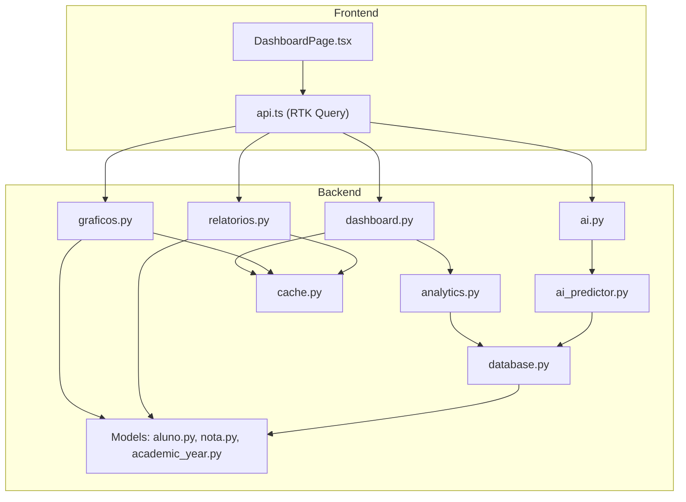
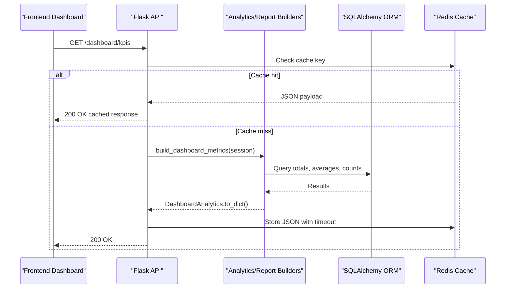
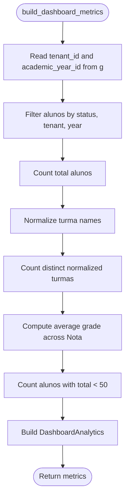
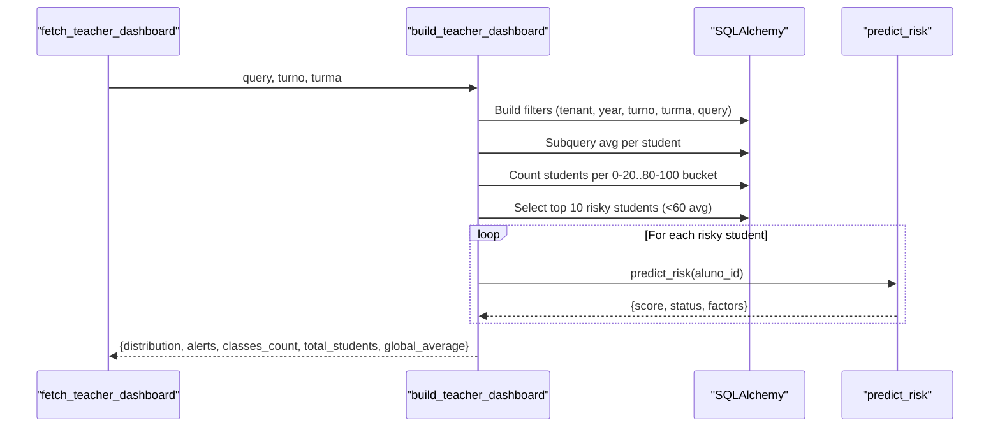
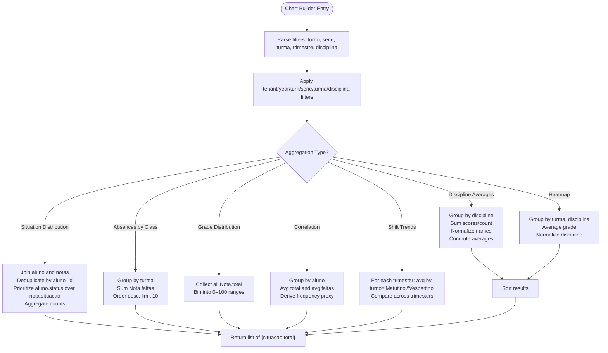
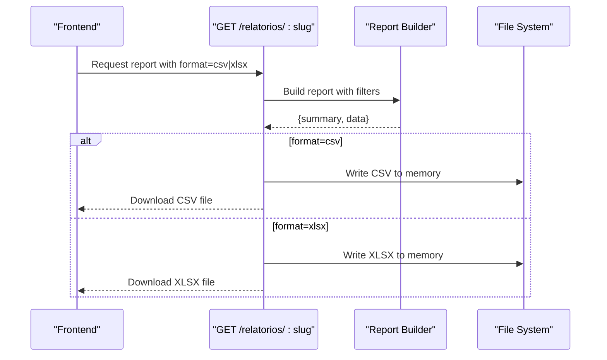
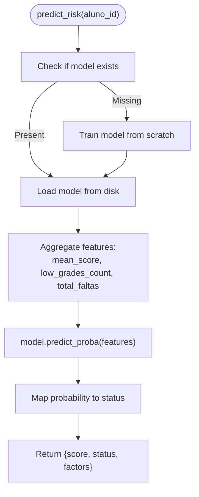
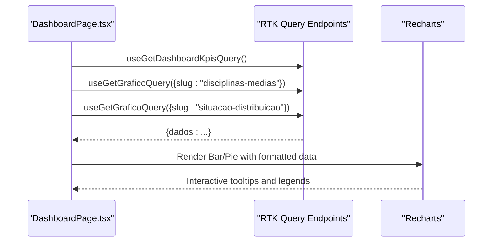
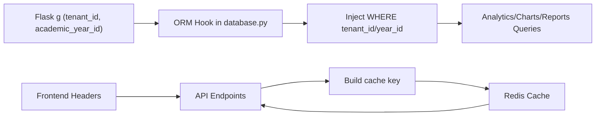

# Academic Analytics & Dashboard

<cite>
**Referenced Files in This Document**
- [analytics.py](file://backend/app/services/analytics.py)
- [dashboard.py](file://backend/app/api/v1/dashboard.py)
- [graficos.py](file://backend/app/api/v1/graficos.py)
- [relatorios.py](file://backend/app/api/v1/relatorios.py)
- [ai_predictor.py](file://backend/app/services/ai_predictor.py)
- [ai.py](file://backend/app/api/v1/ai.py)
- [cache.py](file://backend/app/core/cache.py)
- [database.py](file://backend/app/core/database.py)
- [aluno.py](file://backend/app/models/aluno.py)
- [nota.py](file://backend/app/models/nota.py)
- [academic_year.py](file://backend/app/models/academic_year.py)
- [DashboardPage.tsx](file://frontend/src/features/dashboard/DashboardPage.tsx)
- [api.ts](file://frontend/src/lib/api.ts)
</cite>

## Table of Contents
1. [Introduction](#introduction)
2. [Project Structure](#project-structure)
3. [Core Components](#core-components)
4. [Architecture Overview](#architecture-overview)
5. [Detailed Component Analysis](#detailed-component-analysis)
6. [Dependency Analysis](#dependency-analysis)
7. [Performance Considerations](#performance-considerations)
8. [Troubleshooting Guide](#troubleshooting-guide)
9. [Conclusion](#conclusion)
10. [Appendices](#appendices)

## Introduction
This document describes the academic analytics and dashboard system that powers data visualization and performance monitoring. It explains how analytics data is aggregated, how statistical calculations and trend analysis are performed, and how dashboards render charts and interactive visualizations. It also covers integrations with grade data, student demographics, and academic year contexts, along with caching, real-time updates, and extensibility for new metrics and reporting.

## Project Structure
The system is split into:
- Backend services and APIs for analytics, charts, reports, and AI-driven risk predictions
- Frontend dashboards and chart rendering using React and Recharts
- Shared models for students, grades, and academic years
- Caching and database layer supporting multi-tenant and academic-year scoping

**Diagram sources**
- [dashboard.py:11-36](file://backend/app/api/v1/dashboard.py#L11-L36)
- [graficos.py:36-59](file://backend/app/api/v1/graficos.py#L36-L59)
- [relatorios.py:457-538](file://backend/app/api/v1/relatorios.py#L457-L538)
- [ai.py:11-51](file://backend/app/api/v1/ai.py#L11-L51)
- [analytics.py:35-84](file://backend/app/services/analytics.py#L35-L84)
- [ai_predictor.py:68-120](file://backend/app/services/ai_predictor.py#L68-L120)
- [cache.py:10-57](file://backend/app/core/cache.py#L10-L57)
- [database.py:39-102](file://backend/app/core/database.py#L39-L102)
- [aluno.py:8-36](file://backend/app/models/aluno.py#L8-L36)
- [nota.py:9-24](file://backend/app/models/nota.py#L9-L24)
- [academic_year.py:6-16](file://backend/app/models/academic_year.py#L6-L16)
- [DashboardPage.tsx:46-334](file://frontend/src/features/dashboard/DashboardPage.tsx#L46-L334)
- [api.ts:409-739](file://frontend/src/lib/api.ts#L409-L739)

**Section sources**
- [dashboard.py:11-36](file://backend/app/api/v1/dashboard.py#L11-L36)
- [graficos.py:36-59](file://backend/app/api/v1/graficos.py#L36-L59)
- [relatorios.py:457-538](file://backend/app/api/v1/relatorios.py#L457-L538)
- [ai.py:11-51](file://backend/app/api/v1/ai.py#L11-L51)
- [analytics.py:35-84](file://backend/app/services/analytics.py#L35-L84)
- [ai_predictor.py:68-120](file://backend/app/services/ai_predictor.py#L68-L120)
- [cache.py:10-57](file://backend/app/core/cache.py#L10-L57)
- [database.py:39-102](file://backend/app/core/database.py#L39-L102)
- [aluno.py:8-36](file://backend/app/models/aluno.py#L8-L36)
- [nota.py:9-24](file://backend/app/models/nota.py#L9-L24)
- [academic_year.py:6-16](file://backend/app/models/academic_year.py#L6-L16)
- [DashboardPage.tsx:46-334](file://frontend/src/features/dashboard/DashboardPage.tsx#L46-L334)
- [api.ts:409-739](file://frontend/src/lib/api.ts#L409-L739)

## Core Components
- Dashboard analytics service computes KPIs and teacher-specific distributions and risk lists.
- Chart builders aggregate and normalize grade data across disciplines, classes, and periods.
- Report builders deliver structured summaries and tabular datasets for exports.
- AI predictor provides risk scores for students using a persisted model.
- Caching layer stores API responses keyed by tenant and academic year.
- Database layer enforces tenant and academic-year scoping via ORM hooks.
- Frontend dashboards consume APIs and render bar/pie charts and KPI cards.

**Section sources**
- [analytics.py:10-84](file://backend/app/services/analytics.py#L10-L84)
- [graficos.py:96-396](file://backend/app/api/v1/graficos.py#L96-L396)
- [relatorios.py:442-454](file://backend/app/api/v1/relatorios.py#L442-L454)
- [ai_predictor.py:68-120](file://backend/app/services/ai_predictor.py#L68-L120)
- [cache.py:10-57](file://backend/app/core/cache.py#L10-L57)
- [database.py:39-102](file://backend/app/core/database.py#L39-L102)
- [DashboardPage.tsx:46-334](file://frontend/src/features/dashboard/DashboardPage.tsx#L46-L334)
- [api.ts:424-498](file://frontend/src/lib/api.ts#L424-L498)

## Architecture Overview
The system follows a layered architecture:
- Presentation: React dashboard with RTK Query for API consumption
- API: Flask blueprints exposing endpoints for KPIs, charts, reports, and AI
- Services: Business logic for analytics, AI predictions, and data aggregation
- Persistence: SQLAlchemy models with tenant and academic-year scoping
- Caching: Redis-backed response caching with tenant-aware keys

**Diagram sources**
- [dashboard.py:14-22](file://backend/app/api/v1/dashboard.py#L14-L22)
- [analytics.py:35-84](file://backend/app/services/analytics.py#L35-L84)
- [cache.py:10-57](file://backend/app/core/cache.py#L10-L57)
- [database.py:118-130](file://backend/app/core/database.py#L118-L130)

## Detailed Component Analysis

### Dashboard Analytics Service
Responsibilities:
- Compute total students, active classes, school average grade, and at-risk student counts
- Support teacher dashboards with grade distribution buckets, risk alerts, and class statistics
- Apply tenant and academic-year filters consistently

Key behaviors:
- Uses SQLAlchemy functions for counts, averages, and grouped aggregations
- Normalizes class names for distinct counting
- Applies filters from Flask g (tenant and academic year) and optional query parameters

**Diagram sources**
- [analytics.py:35-84](file://backend/app/services/analytics.py#L35-L84)

**Section sources**
- [analytics.py:35-84](file://backend/app/services/analytics.py#L35-L84)

### Teacher Dashboard Builder
Responsibilities:
- Build performance distribution buckets by student average
- Fetch top risky students and enrich with AI risk predictions
- Provide class counts, total students, and global average filtered by turn, class, and query

Processing logic:
- Subqueries compute per-student averages
- Buckets are populated by range scans
- Risk alerts are ordered by average and capped at top 10
- AI risk prediction integrates via a trained model

**Diagram sources**
- [analytics.py:86-196](file://backend/app/services/analytics.py#L86-L196)
- [ai_predictor.py:68-120](file://backend/app/services/ai_predictor.py#L68-L120)

**Section sources**
- [analytics.py:86-196](file://backend/app/services/analytics.py#L86-L196)
- [ai_predictor.py:68-120](file://backend/app/services/ai_predictor.py#L68-L120)

### Chart Builders (Dynamic Graphs)
Responsibilities:
- Provide multiple chart types: discipline averages, class trends, situation distribution, absences, heatmap, Gaussian-like grade distribution, correlation between grades and attendance, and shift comparison across trimesters
- Normalize discipline names and apply tenant/year/turn/grade filters
- Return standardized arrays consumable by frontend charts

Examples of algorithms:
- Discipline averages: group by normalized discipline, sum scores and counts, compute averages, sort descending
- Situation distribution: deduplicate by student, prioritize administrative status over grade status, aggregate counts
- Absences by class: sum absences per class, limit top 10
- Heatmap: average grade by class and discipline, normalized discipline names
- Gaussian-like distribution: bin all grades into 0–100 by 10-point ranges
- Attendance-grade correlation: derive frequency proxy and pair with averages

**Diagram sources**
- [graficos.py:96-396](file://backend/app/api/v1/graficos.py#L96-L396)

**Section sources**
- [graficos.py:96-396](file://backend/app/api/v1/graficos.py#L96-L396)

### Reports and Export Capabilities
Responsibilities:
- Build curated reports such as worst-absent classes, best-performing classes, at-risk students, low-scoring disciplines, top students, performance heatmaps, attendance-grade correlation, class radar, dropout-risk radar, efficiency comparisons, and top movers
- Provide CSV/XLSX export for report data
- Enforce role-based access and sanitize parameters

Export pipeline:
- Validate presence of data list
- CSV: write header and rows to StringIO
- XLSX: write header and rows to BytesIO using openpyxl

**Diagram sources**
- [relatorios.py:457-538](file://backend/app/api/v1/relatorios.py#L457-L538)

**Section sources**
- [relatorios.py:442-454](file://backend/app/api/v1/relatorios.py#L442-L454)
- [relatorios.py:457-538](file://backend/app/api/v1/relatorios.py#L457-L538)

### AI Risk Prediction
Responsibilities:
- Train a logistic regression model on historical grades and absences to predict failure risk
- Persist model to disk and load on demand
- Predict risk for a given student and return score, status, and contributing factors

**Diagram sources**
- [ai_predictor.py:68-120](file://backend/app/services/ai_predictor.py#L68-L120)

**Section sources**
- [ai_predictor.py:12-120](file://backend/app/services/ai_predictor.py#L12-L120)
- [ai.py:11-51](file://backend/app/api/v1/ai.py#L11-L51)

### Frontend Dashboard Rendering
Responsibilities:
- Fetch KPIs and chart data via RTK Query
- Render KPI cards and charts (bar/pie) with Recharts
- Handle loading, errors, and empty states

**Diagram sources**
- [DashboardPage.tsx:46-334](file://frontend/src/features/dashboard/DashboardPage.tsx#L46-L334)
- [api.ts:424-498](file://frontend/src/lib/api.ts#L424-L498)

**Section sources**
- [DashboardPage.tsx:46-334](file://frontend/src/features/dashboard/DashboardPage.tsx#L46-L334)
- [api.ts:409-739](file://frontend/src/lib/api.ts#L409-L739)

## Dependency Analysis
- Tenant and academic-year scoping:
  - Database engine attaches an ORM execution hook that injects tenant_id and academic_year_id filters for eligible models
  - Analytics and chart/report builders rely on these filters to isolate data per tenant/year
- Caching:
  - Responses are cached in Redis keyed by tenant_id, academic_year_id, path, and query string
  - Cache keys are tenant-aware to prevent cross-tenant leakage
- Frontend integration:
  - RTK Query sets headers for tenant and academic year and handles re-authentication
  - Endpoints are tagged for cache invalidation and optimistic updates

**Diagram sources**
- [database.py:39-102](file://backend/app/core/database.py#L39-L102)
- [cache.py:10-57](file://backend/app/core/cache.py#L10-L57)
- [api.ts:336-357](file://frontend/src/lib/api.ts#L336-L357)

**Section sources**
- [database.py:39-102](file://backend/app/core/database.py#L39-L102)
- [cache.py:10-57](file://backend/app/core/cache.py#L10-L57)
- [api.ts:336-357](file://frontend/src/lib/api.ts#L336-L357)

## Performance Considerations
- Caching:
  - Use cache_response decorator with tenant-aware keys and short/medium timeouts for dashboards
  - Invalidate tenant cache when data changes to avoid stale views
- Query optimization:
  - Prefer grouped/aggregated queries and subqueries to minimize joins and iterations
  - Limit result sets (e.g., top 10/20) for charts and alerts
- Data normalization:
  - Normalize discipline/class names to reduce cardinality and improve grouping performance
- Frontend:
  - Memoize computed chart data to avoid unnecessary renders
  - Use skeleton loaders and error boundaries for responsive UX

[No sources needed since this section provides general guidance]

## Troubleshooting Guide
Common issues and resolutions:
- Access denied for students on dashboard endpoints:
  - Ensure role checks reject student access to dashboard endpoints
- Empty or missing chart data:
  - Verify tenant and academic-year headers are set in frontend
  - Confirm filters match available data (turn, serie, turma, disciplina)
- Cache not updating:
  - Clear tenant cache when data changes or when switching academic year
- AI model errors:
  - Ensure model file exists or allow automatic training on first use
  - Validate that student has grades and absences to compute features
- Export failures:
  - Confirm data list is non-empty and all entries are dictionaries with consistent keys

**Section sources**
- [dashboard.py:18-19](file://backend/app/api/v1/dashboard.py#L18-L19)
- [cache.py:58-65](file://backend/app/core/cache.py#L58-L65)
- [ai_predictor.py:72-75](file://backend/app/services/ai_predictor.py#L72-L75)
- [relatorios.py:483-504](file://backend/app/api/v1/relatorios.py#L483-L504)

## Conclusion
The system provides a robust foundation for academic analytics and dashboards, combining efficient SQL aggregation, tenant-aware scoping, and AI-driven risk insights. It supports multiple chart types, exportable reports, and a flexible frontend that renders interactive visualizations. Extensibility is straightforward through new chart builders, report builders, and metric additions aligned with the existing patterns.

[No sources needed since this section summarizes without analyzing specific files]

## Appendices

### Example Use Cases
- Grade distribution analysis:
  - Use discipline averages and Gaussian-like distribution to visualize grade spread
- Class performance metrics:
  - Compare class averages by shift and trimester; highlight worst-performing classes
- Academic progress tracking:
  - Track top movers between trimesters; monitor attendance-grade correlation

[No sources needed since this section provides general guidance]

### Extending Analytics Modules
- Add a new chart:
  - Define a builder function in graficos.py returning a list of records
  - Register the slug in GRAPH_BUILDERS
  - Consume via useGetGraficoQuery in frontend
- Add a new report:
  - Implement a builder in relatorios.py returning summary and data
  - Register the slug in REPORT_BUILDERS
  - Expose CSV/XLSX export in the same endpoint
- Integrate with external reporting systems:
  - Extend report builders to emit additional formats or push to external sinks
  - Respect role-based access and tenant scoping

[No sources needed since this section provides general guidance]