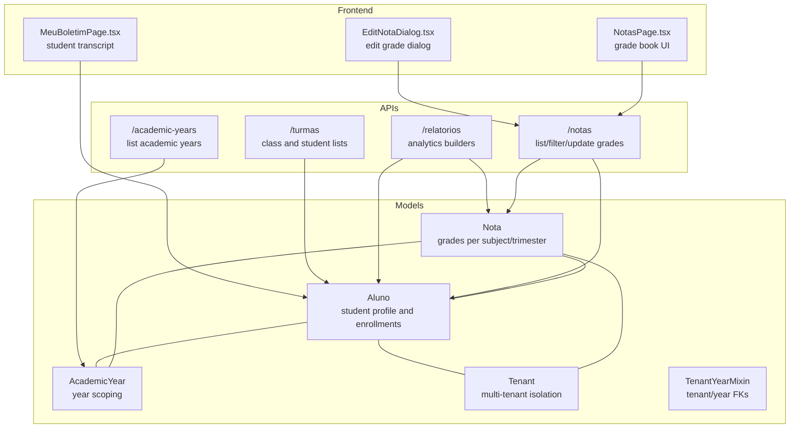
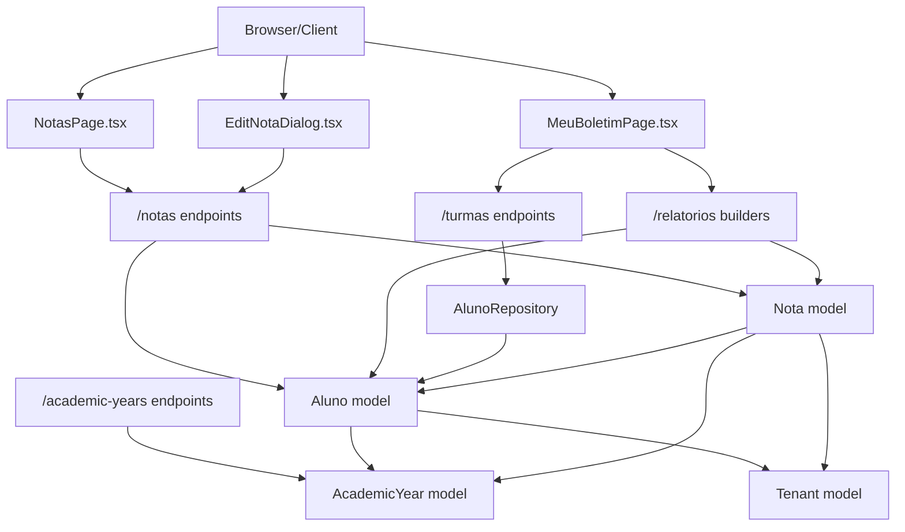
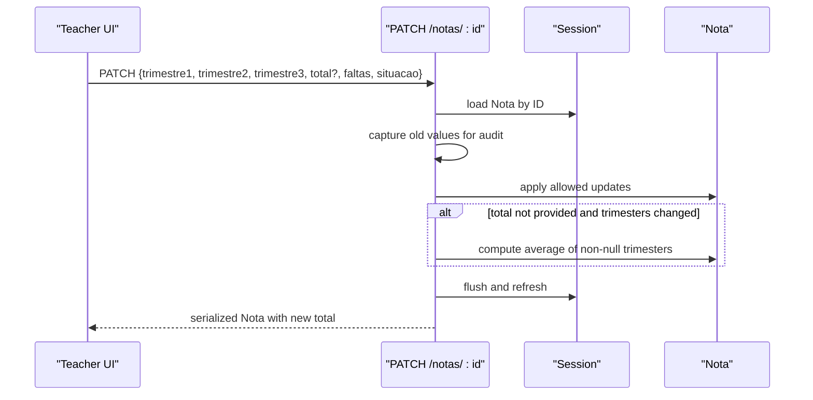
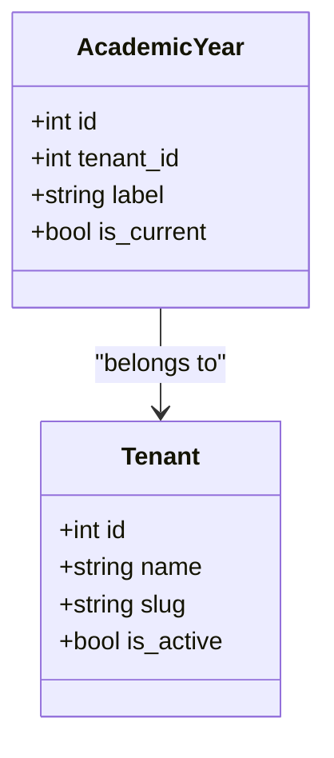
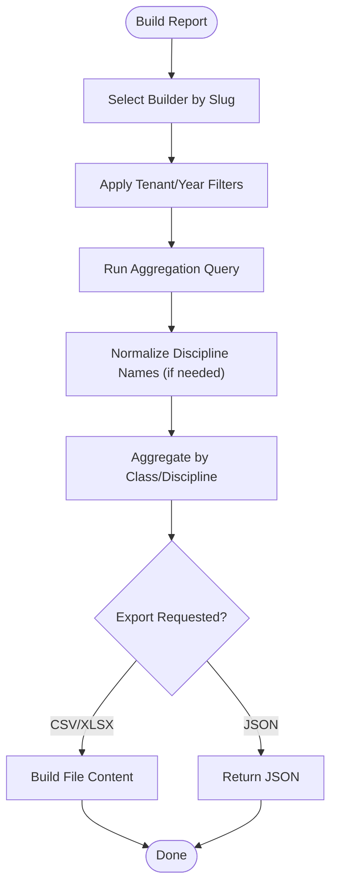
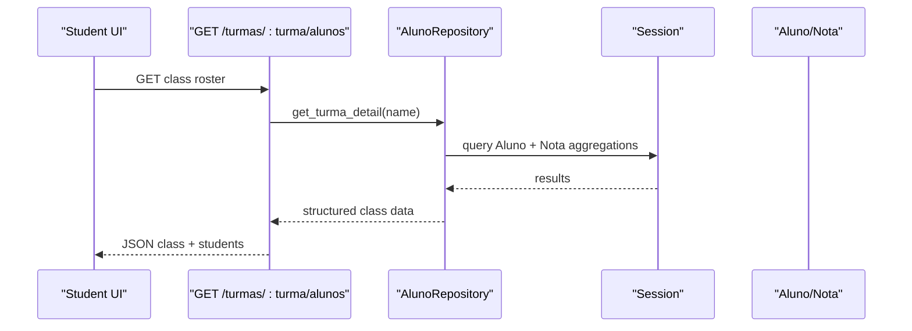
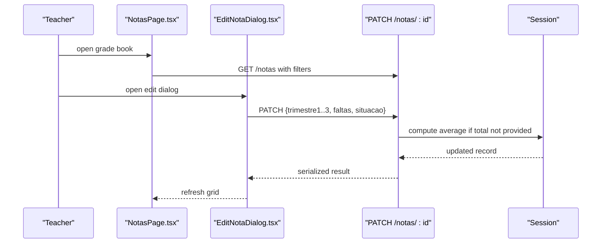
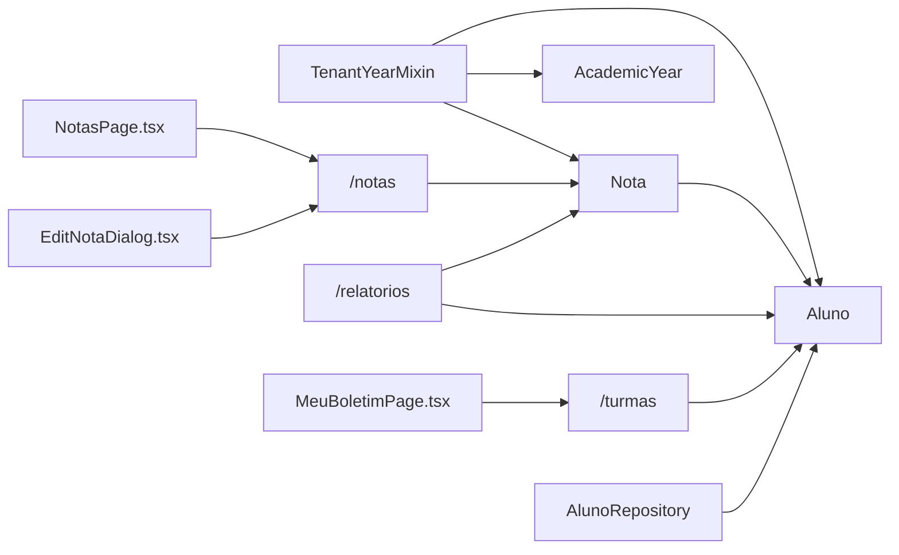

# Academic Management

<cite>
**Referenced Files in This Document**
- [backend/app/models/nota.py](file://backend/app/models/nota.py)
- [backend/app/models/aluno.py](file://backend/app/models/aluno.py)
- [backend/app/models/academic_year.py](file://backend/app/models/academic_year.py)
- [backend/app/models/tenant.py](file://backend/app/models/tenant.py)
- [backend/app/models/base_mixin.py](file://backend/app/models/base_mixin.py)
- [backend/app/api/v1/notas.py](file://backend/app/api/v1/notas.py)
- [backend/app/api/v1/academic_years.py](file://backend/app/api/v1/academic_years.py)
- [backend/app/api/v1/relatorios.py](file://backend/app/api/v1/relatorios.py)
- [backend/app/api/v1/turmas.py](file://backend/app/api/v1/turmas.py)
- [backend/app/repositories/aluno_repository.py](file://backend/app/repositories/aluno_repository.py)
- [frontend/src/features/notas/NotasPage.tsx](file://frontend/src/features/notas/NotasPage.tsx)
- [frontend/src/features/notas/EditNotaDialog.tsx](file://frontend/src/features/notas/EditNotaDialog.tsx)
- [frontend/src/features/alunos/MeuBoletimPage.tsx](file://frontend/src/features/alunos/MeuBoletimPage.tsx)
</cite>

## Table of Contents
1. [Introduction](#introduction)
2. [Project Structure](#project-structure)
3. [Core Components](#core-components)
4. [Architecture Overview](#architecture-overview)
5. [Detailed Component Analysis](#detailed-component-analysis)
6. [Dependency Analysis](#dependency-analysis)
7. [Performance Considerations](#performance-considerations)
8. [Troubleshooting Guide](#troubleshooting-guide)
9. [Conclusion](#conclusion)
10. [Appendices](#appendices)

## Introduction
This document explains the academic management capabilities centered on grade tracking and academic year handling. It covers how grades are recorded and calculated, how averages are computed, how reports are generated, and how academic years are managed. It also documents relationships with student records, class management, and teacher assignments, and provides practical examples from the codebase for grade book management, transcript generation, and academic analytics.

## Project Structure
The academic management system spans backend models, APIs, and frontend pages:
- Models define the grade record structure, student enrollment, academic year scoping, and tenant isolation.
- APIs expose grade listing, filtering, editing, academic year listing, and analytics reports.
- Frontend pages enable teachers to manage grades and students to view transcripts.

**Diagram sources**
- [backend/app/models/nota.py:1-24](file://backend/app/models/nota.py#L1-L24)
- [backend/app/models/aluno.py:1-36](file://backend/app/models/aluno.py#L1-L36)
- [backend/app/models/academic_year.py:1-16](file://backend/app/models/academic_year.py#L1-L16)
- [backend/app/models/tenant.py:1-22](file://backend/app/models/tenant.py#L1-L22)
- [backend/app/models/base_mixin.py:1-22](file://backend/app/models/base_mixin.py#L1-L22)
- [backend/app/api/v1/notas.py:1-190](file://backend/app/api/v1/notas.py#L1-L190)
- [backend/app/api/v1/academic_years.py:1-28](file://backend/app/api/v1/academic_years.py#L1-L28)
- [backend/app/api/v1/relatorios.py:1-538](file://backend/app/api/v1/relatorios.py#L1-L538)
- [backend/app/api/v1/turmas.py:1-42](file://backend/app/api/v1/turmas.py#L1-L42)
- [frontend/src/features/notas/NotasPage.tsx:1-405](file://frontend/src/features/notas/NotasPage.tsx#L1-L405)
- [frontend/src/features/notas/EditNotaDialog.tsx:1-183](file://frontend/src/features/notas/EditNotaDialog.tsx#L1-L183)
- [frontend/src/features/alunos/MeuBoletimPage.tsx:1-278](file://frontend/src/features/alunos/MeuBoletimPage.tsx#L1-L278)

**Section sources**
- [backend/app/models/nota.py:1-24](file://backend/app/models/nota.py#L1-L24)
- [backend/app/models/aluno.py:1-36](file://backend/app/models/aluno.py#L1-L36)
- [backend/app/models/academic_year.py:1-16](file://backend/app/models/academic_year.py#L1-L16)
- [backend/app/models/tenant.py:1-22](file://backend/app/models/tenant.py#L1-L22)
- [backend/app/models/base_mixin.py:1-22](file://backend/app/models/base_mixin.py#L1-L22)
- [backend/app/api/v1/notas.py:1-190](file://backend/app/api/v1/notas.py#L1-L190)
- [backend/app/api/v1/academic_years.py:1-28](file://backend/app/api/v1/academic_years.py#L1-L28)
- [backend/app/api/v1/relatorios.py:1-538](file://backend/app/api/v1/relatorios.py#L1-L538)
- [backend/app/api/v1/turmas.py:1-42](file://backend/app/api/v1/turmas.py#L1-L42)
- [frontend/src/features/notas/NotasPage.tsx:1-405](file://frontend/src/features/notas/NotasPage.tsx#L1-L405)
- [frontend/src/features/notas/EditNotaDialog.tsx:1-183](file://frontend/src/features/notas/EditNotaDialog.tsx#L1-L183)
- [frontend/src/features/alunos/MeuBoletimPage.tsx:1-278](file://frontend/src/features/alunos/MeuBoletimPage.tsx#L1-L278)

## Core Components
- Grade record model: stores subject, three trimester scores, total average, absences, and status.
- Student model: links grades to student profiles and includes personal and enrollment metadata.
- Academic year model: scopes data per school year within tenants.
- Tenant isolation: mixin adds tenant and academic year foreign keys to isolate data across organizations.
- Grade endpoints: list/filter grades, normalize disciplines, and auto-calculate totals when trimesters change.
- Report builders: compute class performance, risk students, discipline averages, attendance-grade correlation, and more.
- Class management: list classes and class rosters for teachers.
- Transcript UI: student-facing page to view grades, absences, and status.

**Section sources**
- [backend/app/models/nota.py:9-24](file://backend/app/models/nota.py#L9-L24)
- [backend/app/models/aluno.py:8-36](file://backend/app/models/aluno.py#L8-L36)
- [backend/app/models/academic_year.py:6-16](file://backend/app/models/academic_year.py#L6-L16)
- [backend/app/models/base_mixin.py:4-22](file://backend/app/models/base_mixin.py#L4-L22)
- [backend/app/api/v1/notas.py:12-190](file://backend/app/api/v1/notas.py#L12-L190)
- [backend/app/api/v1/relatorios.py:11-538](file://backend/app/api/v1/relatorios.py#L11-L538)
- [backend/app/api/v1/turmas.py:11-42](file://backend/app/api/v1/turmas.py#L11-L42)
- [frontend/src/features/notas/NotasPage.tsx:60-405](file://frontend/src/features/notas/NotasPage.tsx#L60-L405)
- [frontend/src/features/notas/EditNotaDialog.tsx:24-183](file://frontend/src/features/notas/EditNotaDialog.tsx#L24-L183)
- [frontend/src/features/alunos/MeuBoletimPage.tsx:49-278](file://frontend/src/features/alunos/MeuBoletimPage.tsx#L49-L278)

## Architecture Overview
The system follows a layered architecture:
- Data layer: SQLAlchemy models with tenant and academic year scoping.
- API layer: Flask blueprints exposing CRUD and analytics endpoints.
- Presentation layer: React pages for grade book, editing, and student transcript.
- Relationships: grades belong to students; students belong to classes and academic years; all scoped by tenant.

**Diagram sources**
- [backend/app/api/v1/notas.py:34-190](file://backend/app/api/v1/notas.py#L34-L190)
- [backend/app/api/v1/academic_years.py:7-28](file://backend/app/api/v1/academic_years.py#L7-L28)
- [backend/app/api/v1/relatorios.py:457-538](file://backend/app/api/v1/relatorios.py#L457-L538)
- [backend/app/api/v1/turmas.py:11-42](file://backend/app/api/v1/turmas.py#L11-L42)
- [backend/app/repositories/aluno_repository.py:8-105](file://backend/app/repositories/aluno_repository.py#L8-L105)
- [backend/app/models/nota.py:9-24](file://backend/app/models/nota.py#L9-L24)
- [backend/app/models/aluno.py:8-36](file://backend/app/models/aluno.py#L8-L36)
- [backend/app/models/academic_year.py:6-16](file://backend/app/models/academic_year.py#L6-L16)
- [backend/app/models/tenant.py:7-22](file://backend/app/models/tenant.py#L7-L22)
- [frontend/src/features/notas/NotasPage.tsx:60-405](file://frontend/src/features/notas/NotasPage.tsx#L60-L405)
- [frontend/src/features/notas/EditNotaDialog.tsx:24-183](file://frontend/src/features/notas/EditNotaDialog.tsx#L24-L183)
- [frontend/src/features/alunos/MeuBoletimPage.tsx:49-278](file://frontend/src/features/alunos/MeuBoletimPage.tsx#L49-L278)

## Detailed Component Analysis

### Grade Recording and Calculation
- Trimester-based grading: each record stores three trimester scores and a derived total average.
- Auto-calculation: when any trimester is updated and total is not explicitly sent, the API computes the average of available trimester values.
- Discipline normalization: discipline names are normalized to reduce variance (e.g., “INGLÊS” → “LÍNGUA INGLESA”).
- Filtering and pagination: supports filtering by class, shift, and discipline; paginates results.

**Diagram sources**
- [backend/app/api/v1/notas.py:124-187](file://backend/app/api/v1/notas.py#L124-L187)

**Section sources**
- [backend/app/models/nota.py:16-21](file://backend/app/models/nota.py#L16-L21)
- [backend/app/api/v1/notas.py:124-187](file://backend/app/api/v1/notas.py#L124-L187)
- [backend/app/api/v1/notas.py:42-75](file://backend/app/api/v1/notas.py#L42-L75)

### Academic Year Management
- Academic year model: identifies school year labels and marks the current year per tenant.
- Tenant scoping: all entities inherit tenant and academic year foreign keys via a shared mixin.
- Endpoint: list academic years for the current tenant, ordered by label descending.

**Diagram sources**
- [backend/app/models/academic_year.py:6-16](file://backend/app/models/academic_year.py#L6-L16)
- [backend/app/models/tenant.py:7-22](file://backend/app/models/tenant.py#L7-L22)

**Section sources**
- [backend/app/models/academic_year.py:6-16](file://backend/app/models/academic_year.py#L6-L16)
- [backend/app/models/base_mixin.py:4-22](file://backend/app/models/base_mixin.py#L4-L22)
- [backend/app/api/v1/academic_years.py:10-26](file://backend/app/api/v1/academic_years.py#L10-L26)

### Report Generation and Analytics
- Report builders: modular functions compute class rankings, risk students, discipline averages, heatmap, correlation between attendance and grades, comparative efficiency, and top movers.
- Filters: all builders accept optional filters for shift, grade level, class, and discipline.
- Export: reports can be exported to CSV or XLSX when requested.

**Diagram sources**
- [backend/app/api/v1/relatorios.py:457-538](file://backend/app/api/v1/relatorios.py#L457-L538)
- [backend/app/api/v1/relatorios.py:11-454](file://backend/app/api/v1/relatorios.py#L11-L454)

**Section sources**
- [backend/app/api/v1/relatorios.py:11-538](file://backend/app/api/v1/relatorios.py#L11-L538)

### Student Records and Transcript Generation
- Student model: holds personal and enrollment data and relationships to grades and users.
- Transcript UI: displays a student’s grades, absences, and status in a tabular format and allows downloading a PDF transcript.
- Average computation: repository queries compute student averages and associated absences.

**Diagram sources**
- [backend/app/api/v1/turmas.py:24-40](file://backend/app/api/v1/turmas.py#L24-L40)
- [backend/app/repositories/aluno_repository.py:76-105](file://backend/app/repositories/aluno_repository.py#L76-L105)

**Section sources**
- [backend/app/models/aluno.py:8-36](file://backend/app/models/aluno.py#L8-L36)
- [frontend/src/features/alunos/MeuBoletimPage.tsx:49-278](file://frontend/src/features/alunos/MeuBoletimPage.tsx#L49-L278)
- [backend/app/repositories/aluno_repository.py:76-105](file://backend/app/repositories/aluno_repository.py#L76-L105)

### Grade Book Management (Teacher Workflow)
- Listing and filtering: teachers filter by class, shift, and discipline; search by student name/class/discipline.
- Editing: teachers edit trimester scores and absence counts; leaving total blank triggers auto-calculation.
- Discipline normalization: ensures consistent subject names across the system.

**Diagram sources**
- [frontend/src/features/notas/NotasPage.tsx:60-405](file://frontend/src/features/notas/NotasPage.tsx#L60-L405)
- [frontend/src/features/notas/EditNotaDialog.tsx:24-183](file://frontend/src/features/notas/EditNotaDialog.tsx#L24-L183)
- [backend/app/api/v1/notas.py:77-122](file://backend/app/api/v1/notas.py#L77-L122)
- [backend/app/api/v1/notas.py:124-187](file://backend/app/api/v1/notas.py#L124-L187)

**Section sources**
- [frontend/src/features/notas/NotasPage.tsx:60-405](file://frontend/src/features/notas/NotasPage.tsx#L60-L405)
- [frontend/src/features/notas/EditNotaDialog.tsx:24-183](file://frontend/src/features/notas/EditNotaDialog.tsx#L24-L183)
- [backend/app/api/v1/notas.py:77-122](file://backend/app/api/v1/notas.py#L77-L122)
- [backend/app/api/v1/notas.py:124-187](file://backend/app/api/v1/notas.py#L124-L187)

### Academic Status Determination
- Status field: stored per grade record; supported values include approved, failed, recovery, APCC, and APR with Rec.
- UI rendering: student transcript normalizes status labels for display.

**Section sources**
- [backend/app/models/nota.py:21](file://backend/app/models/nota.py#L21)
- [frontend/src/features/notas/EditNotaDialog.tsx:159-167](file://frontend/src/features/notas/EditNotaDialog.tsx#L159-L167)
- [frontend/src/features/alunos/MeuBoletimPage.tsx:38-47](file://frontend/src/features/alunos/MeuBoletimPage.tsx#L38-L47)

## Dependency Analysis
- Cohesion: grade-related logic is cohesive within the Notas API and related models.
- Coupling: APIs depend on models and repositories; frontend depends on API endpoints.
- Isolation: TenantYearMixin ensures tenant and academic year scoping across models.
- External integrations: report exports rely on CSV and XLSX libraries.

**Diagram sources**
- [backend/app/models/base_mixin.py:4-22](file://backend/app/models/base_mixin.py#L4-L22)
- [backend/app/models/nota.py:9-24](file://backend/app/models/nota.py#L9-L24)
- [backend/app/models/aluno.py:8-36](file://backend/app/models/aluno.py#L8-L36)
- [backend/app/models/academic_year.py:6-16](file://backend/app/models/academic_year.py#L6-L16)
- [backend/app/api/v1/notas.py:34-190](file://backend/app/api/v1/notas.py#L34-L190)
- [backend/app/api/v1/relatorios.py:457-538](file://backend/app/api/v1/relatorios.py#L457-L538)
- [backend/app/api/v1/turmas.py:11-42](file://backend/app/api/v1/turmas.py#L11-L42)
- [backend/app/repositories/aluno_repository.py:8-105](file://backend/app/repositories/aluno_repository.py#L8-L105)
- [frontend/src/features/notas/NotasPage.tsx:60-405](file://frontend/src/features/notas/NotasPage.tsx#L60-L405)
- [frontend/src/features/notas/EditNotaDialog.tsx:24-183](file://frontend/src/features/notas/EditNotaDialog.tsx#L24-L183)
- [frontend/src/features/alunos/MeuBoletimPage.tsx:49-278](file://frontend/src/features/alunos/MeuBoletimPage.tsx#L49-L278)

**Section sources**
- [backend/app/models/base_mixin.py:4-22](file://backend/app/models/base_mixin.py#L4-L22)
- [backend/app/api/v1/notas.py:34-190](file://backend/app/api/v1/notas.py#L34-L190)
- [backend/app/api/v1/relatorios.py:457-538](file://backend/app/api/v1/relatorios.py#L457-L538)
- [backend/app/api/v1/turmas.py:11-42](file://backend/app/api/v1/turmas.py#L11-L42)
- [backend/app/repositories/aluno_repository.py:8-105](file://backend/app/repositories/aluno_repository.py#L8-L105)

## Performance Considerations
- Pagination: grade listing limits page size to prevent heavy payloads.
- Aggregation queries: analytics builders use grouped aggregations to compute averages and totals efficiently.
- Indexing: tenant and academic year foreign keys are indexed via the mixin to speed up scoping.
- Caching: after grade updates, tenant cache invalidation helps maintain consistency.

**Section sources**
- [backend/app/api/v1/notas.py:85-87](file://backend/app/api/v1/notas.py#L85-L87)
- [backend/app/api/v1/relatorios.py:477-535](file://backend/app/api/v1/relatorios.py#L477-L535)
- [backend/app/models/base_mixin.py:7-13](file://backend/app/models/base_mixin.py#L7-L13)
- [backend/app/api/v1/notas.py:183-186](file://backend/app/api/v1/notas.py#L183-L186)

## Troubleshooting Guide
- Access restrictions: grade editing requires admin role; student role access is denied.
- Missing or invalid fields: PATCH rejects updates without valid fields and returns errors.
- Auto-calculation expectations: sending total in the payload overrides auto-calculation; leaving it blank triggers average computation from trimesters.
- Export failures: CSV/XLSX export requires non-empty data and correct payload structure.

**Section sources**
- [backend/app/api/v1/notas.py:124-136](file://backend/app/api/v1/notas.py#L124-L136)
- [backend/app/api/v1/notas.py:129-131](file://backend/app/api/v1/notas.py#L129-L131)
- [backend/app/api/v1/relatorios.py:482-524](file://backend/app/api/v1/relatorios.py#L482-L524)

## Conclusion
The academic management system provides a robust foundation for grade tracking, trimester-based averaging, and analytics. It enforces tenant and academic year scoping, offers flexible filtering and export capabilities, and integrates teacher-grade book management with student transcript views. The modular report builders support common academic workflows such as identifying at-risk students, comparing class performance, and analyzing attendance trends.

## Appendices
- Example workflows:
  - Grade entry: teacher opens the grade book, applies filters, edits a single record, and saves; the system auto-calculates the total if not explicitly provided.
  - Bulk operations: use filters to narrow down a class and discipline, then iterate edits; the system preserves existing totals unless overridden.
  - Report generation: request analytics by shift, grade level, class, and discipline; optionally export to CSV or XLSX.
  - Transcript generation: students view their grades and can download a PDF transcript.

[No sources needed since this section provides general guidance]