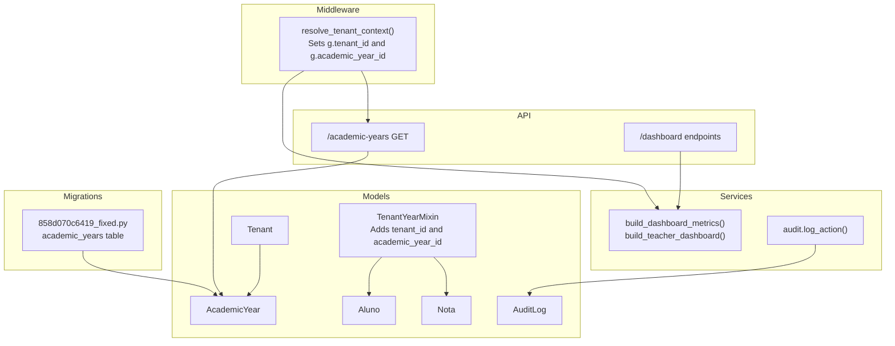
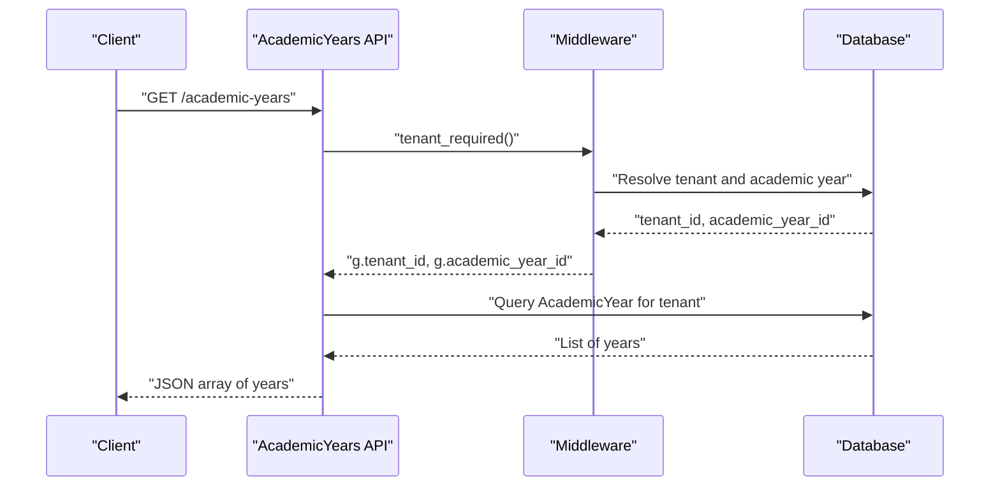
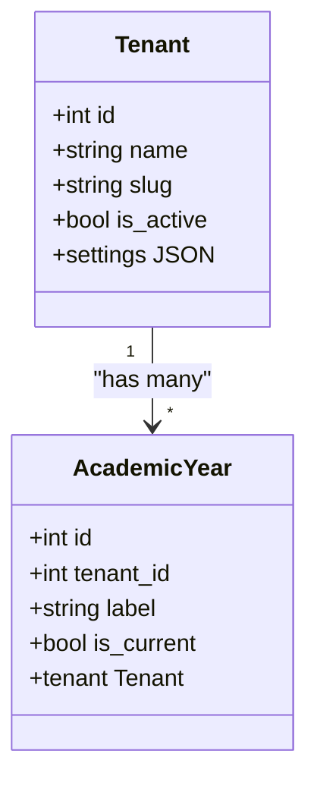
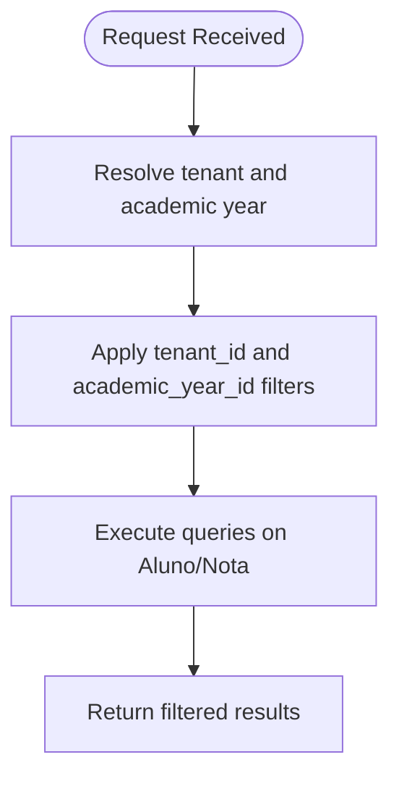
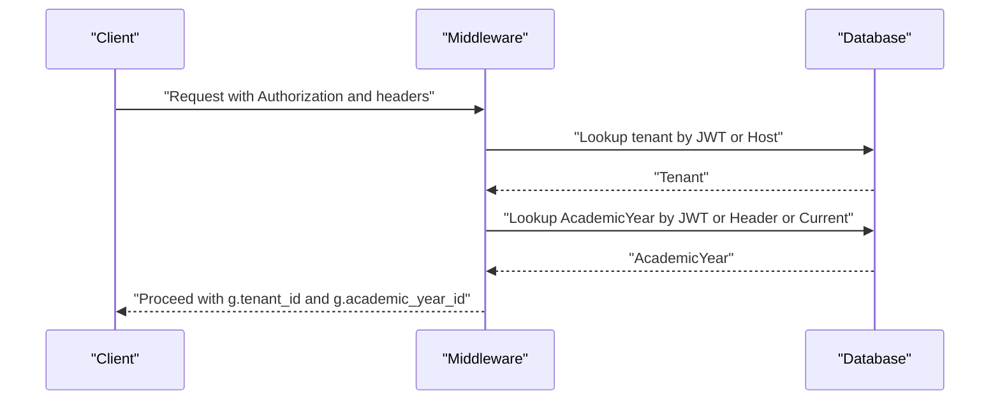
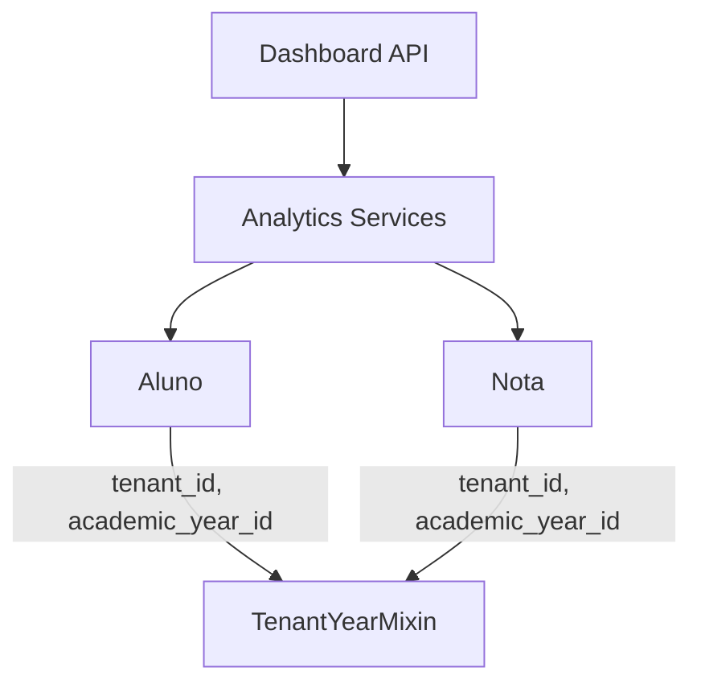
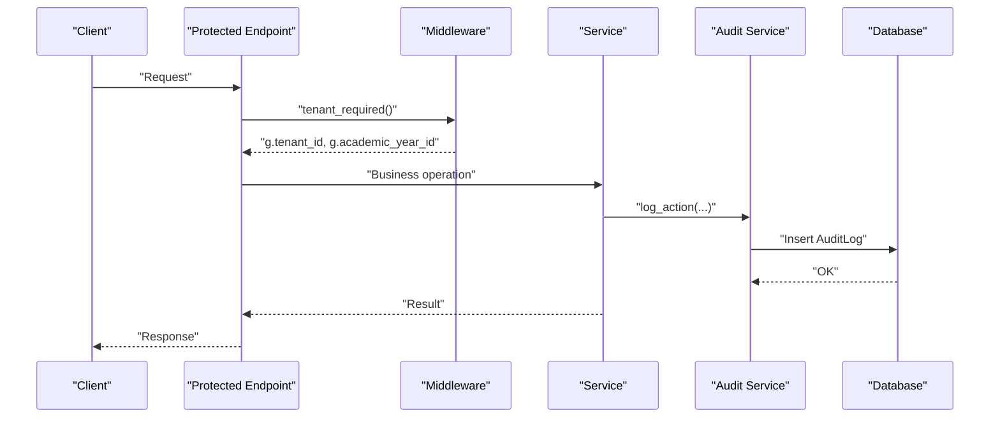
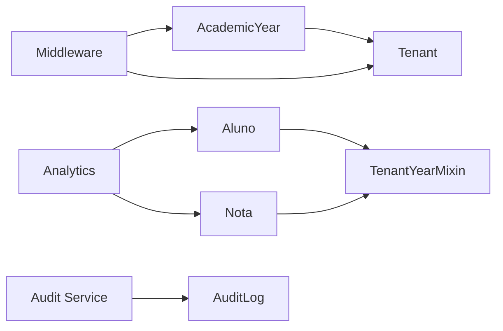

# Academic Year Management

<cite>
**Referenced Files in This Document**
- [academic_year.py](file://backend/app/models/academic_year.py)
- [academic_years.py](file://backend/app/api/v1/academic_years.py)
- [base_mixin.py](file://backend/app/models/base_mixin.py)
- [tenant.py](file://backend/app/models/tenant.py)
- [aluno.py](file://backend/app/models/aluno.py)
- [nota.py](file://backend/app/models/nota.py)
- [middleware.py](file://backend/app/core/middleware.py)
- [analytics.py](file://backend/app/services/analytics.py)
- [audit.py](file://backend/app/services/audit.py)
- [audit_log.py](file://backend/app/models/audit_log.py)
- [dashboard.py](file://backend/app/api/v1/dashboard.py)
- [security.py](file://backend/app/core/security.py)
- [858d070c6419_fixed.py](file://backend/migrations/versions/858d070c6419_fixed.py)
</cite>

## Table of Contents
1. [Introduction](#introduction)
2. [Project Structure](#project-structure)
3. [Core Components](#core-components)
4. [Architecture Overview](#architecture-overview)
5. [Detailed Component Analysis](#detailed-component-analysis)
6. [Dependency Analysis](#dependency-analysis)
7. [Performance Considerations](#performance-considerations)
8. [Troubleshooting Guide](#troubleshooting-guide)
9. [Conclusion](#conclusion)
10. [Appendices](#appendices)

## Introduction
This document explains the academic year management subsystem that organizes data by school year, enforces tenant and year isolation, and supports year-based analytics, reporting, and operational workflows. It covers the academic year lifecycle (creation, activation, and closure), year-based filtering and data segregation, year switching, integration with grade tracking and student enrollment, and audit logging for year-related operations. It also outlines multi-year analytics and year-end reporting considerations.

## Project Structure
The academic year management spans models, API endpoints, middleware, services, and migrations. The tenant and academic year models define isolation boundaries. Middleware resolves tenant and academic year context from JWT claims and headers. Analytics services and dashboards consume the current academic year context to compute year-filtered metrics. Audit logging captures actions across tenants and years.

**Diagram sources**
- [academic_year.py:6-15](file://backend/app/models/academic_year.py#L6-L15)
- [academic_years.py:10-25](file://backend/app/api/v1/academic_years.py#L10-L25)
- [base_mixin.py:4-22](file://backend/app/models/base_mixin.py#L4-L22)
- [tenant.py:7-21](file://backend/app/models/tenant.py#L7-L21)
- [aluno.py:8-35](file://backend/app/models/aluno.py#L8-L35)
- [nota.py:9-24](file://backend/app/models/nota.py#L9-L24)
- [middleware.py:6-109](file://backend/app/core/middleware.py#L6-L109)
- [analytics.py:35-84](file://backend/app/services/analytics.py#L35-L84)
- [audit.py:4-17](file://backend/app/services/audit.py#L4-L17)
- [audit_log.py:7-29](file://backend/app/models/audit_log.py#L7-L29)
- [858d070c6419_fixed.py:19-31](file://backend/migrations/versions/858d070c6419_fixed.py#L19-L31)

**Section sources**
- [academic_year.py:6-15](file://backend/app/models/academic_year.py#L6-L15)
- [academic_years.py:10-25](file://backend/app/api/v1/academic_years.py#L10-L25)
- [base_mixin.py:4-22](file://backend/app/models/base_mixin.py#L4-L22)
- [tenant.py:7-21](file://backend/app/models/tenant.py#L7-L21)
- [aluno.py:8-35](file://backend/app/models/aluno.py#L8-L35)
- [nota.py:9-24](file://backend/app/models/nota.py#L9-L24)
- [middleware.py:6-109](file://backend/app/core/middleware.py#L6-L109)
- [analytics.py:35-84](file://backend/app/services/analytics.py#L35-L84)
- [audit.py:4-17](file://backend/app/services/audit.py#L4-L17)
- [audit_log.py:7-29](file://backend/app/models/audit_log.py#L7-L29)
- [858d070c6419_fixed.py:19-31](file://backend/migrations/versions/858d070c6419_fixed.py#L19-L31)

## Core Components
- AcademicYear model: Defines year records with tenant linkage and a current flag.
- TenantYearMixin: Adds tenant_id and academic_year_id to entities, enabling tenant and year isolation.
- Middleware resolver: Extracts tenant and academic year context from JWT claims and headers, defaulting to the current academic year.
- Analytics services: Compute dashboard metrics and teacher dashboards using the current academic year context.
- Audit logging: Captures actions with optional year context via tenant/year-aware models.

Key implementation references:
- Academic year persistence and relationships: [academic_year.py:6-15](file://backend/app/models/academic_year.py#L6-L15)
- Tenant isolation and year isolation: [base_mixin.py:4-22](file://backend/app/models/base_mixin.py#L4-L22)
- Year resolution and context switching: [middleware.py:6-109](file://backend/app/core/middleware.py#L6-L109)
- Year-aware analytics: [analytics.py:35-84](file://backend/app/services/analytics.py#L35-L84)
- Audit logging: [audit.py:4-17](file://backend/app/services/audit.py#L4-L17), [audit_log.py:7-29](file://backend/app/models/audit_log.py#L7-L29)

**Section sources**
- [academic_year.py:6-15](file://backend/app/models/academic_year.py#L6-L15)
- [base_mixin.py:4-22](file://backend/app/models/base_mixin.py#L4-L22)
- [middleware.py:6-109](file://backend/app/core/middleware.py#L6-L109)
- [analytics.py:35-84](file://backend/app/services/analytics.py#L35-L84)
- [audit.py:4-17](file://backend/app/services/audit.py#L4-L17)
- [audit_log.py:7-29](file://backend/app/models/audit_log.py#L7-L29)

## Architecture Overview
The system enforces tenant and academic year isolation through shared model mixins and middleware. API endpoints and services rely on the current academic year context resolved in the request lifecycle. Dashboards and analytics are automatically year-filtered. Audit logs capture operations with user and target metadata.

**Diagram sources**
- [academic_years.py:10-25](file://backend/app/api/v1/academic_years.py#L10-L25)
- [middleware.py:6-109](file://backend/app/core/middleware.py#L6-L109)

**Section sources**
- [academic_years.py:10-25](file://backend/app/api/v1/academic_years.py#L10-L25)
- [middleware.py:6-109](file://backend/app/core/middleware.py#L6-L109)

## Detailed Component Analysis

### Academic Year Model and Lifecycle
- Creation: New academic year records are persisted under a tenant with a label and current flag.
- Activation: Exactly one academic year per tenant can be marked as current; the middleware defaults to the current year when none is explicitly set.
- Closure: To close a year, set the current flag to false on the current year and activate another year as current.

**Diagram sources**
- [academic_year.py:6-15](file://backend/app/models/academic_year.py#L6-L15)
- [tenant.py:7-21](file://backend/app/models/tenant.py#L7-L21)

**Section sources**
- [academic_year.py:6-15](file://backend/app/models/academic_year.py#L6-L15)
- [tenant.py:7-21](file://backend/app/models/tenant.py#L7-L21)

### Year-Based Filtering and Data Isolation
- TenantYearMixin adds tenant_id and academic_year_id to entities, ensuring all queries filter by tenant and year.
- Analytics services and dashboards automatically apply tenant and year filters when computing metrics.
- Student enrollment and grade tracking leverage the same isolation fields.

**Diagram sources**
- [base_mixin.py:4-22](file://backend/app/models/base_mixin.py#L4-L22)
- [analytics.py:35-84](file://backend/app/services/analytics.py#L35-L84)
- [aluno.py:8-35](file://backend/app/models/aluno.py#L8-L35)
- [nota.py:9-24](file://backend/app/models/nota.py#L9-L24)

**Section sources**
- [base_mixin.py:4-22](file://backend/app/models/base_mixin.py#L4-L22)
- [analytics.py:35-84](file://backend/app/services/analytics.py#L35-L84)
- [aluno.py:8-35](file://backend/app/models/aluno.py#L8-L35)
- [nota.py:9-24](file://backend/app/models/nota.py#L9-L24)

### Year Switching Functionality
- Context resolution: The middleware reads tenant and academic year from JWT claims and headers, falling back to the current academic year if unspecified.
- Super admin context switching: Only users with super admin role can switch tenants via headers; regular users are restricted to their JWT tenant.
- Year switching: Users can supply X-Academic-Year-ID header to override the current year for a request.

**Diagram sources**
- [middleware.py:6-109](file://backend/app/core/middleware.py#L6-L109)

**Section sources**
- [middleware.py:6-109](file://backend/app/core/middleware.py#L6-L109)

### Integration with Grade Tracking, Enrollment, and Reporting
- Student enrollment (Aluno) and grades (Nota) inherit tenant and year isolation from TenantYearMixin.
- Dashboard analytics automatically filter by tenant and year, aggregating counts, averages, and risk indicators.
- Report generation can reuse the same tenant and year filters applied in analytics.

**Diagram sources**
- [aluno.py:8-35](file://backend/app/models/aluno.py#L8-L35)
- [nota.py:9-24](file://backend/app/models/nota.py#L9-L24)
- [base_mixin.py:4-22](file://backend/app/models/base_mixin.py#L4-L22)
- [analytics.py:35-84](file://backend/app/services/analytics.py#L35-L84)
- [dashboard.py:14-33](file://backend/app/api/v1/dashboard.py#L14-L33)

**Section sources**
- [aluno.py:8-35](file://backend/app/models/aluno.py#L8-L35)
- [nota.py:9-24](file://backend/app/models/nota.py#L9-L24)
- [base_mixin.py:4-22](file://backend/app/models/base_mixin.py#L4-L22)
- [analytics.py:35-84](file://backend/app/services/analytics.py#L35-L84)
- [dashboard.py:14-33](file://backend/app/api/v1/dashboard.py#L14-L33)

### Year Rollover Procedures and Data Migration
- Year rollover: Create a new AcademicYear record for the upcoming year and mark it as current; deactivate the previous year.
- Data segregation: Existing entities (Aluno, Nota) remain unchanged; future writes and analytics will filter by the new academic_year_id.
- Historical preservation: Past year data remains queryable by selecting the appropriate academic_year_id.

Note: The migration script creates the academic_years table and indexes, establishing the foundation for year isolation.

**Section sources**
- [858d070c6419_fixed.py:19-31](file://backend/migrations/versions/858d070c6419_fixed.py#L19-L31)
- [academic_year.py:6-15](file://backend/app/models/academic_year.py#L6-L15)

### Multi-Year Analytics and Trend Analysis
- Year-aware queries: Analytics functions already filter by academic_year_id when present in the request context.
- Cross-year comparisons: Clients can iterate through years and compare metrics by building separate requests per year.
- Dashboard integration: The dashboard endpoints consume the current year context; cross-year dashboards would require explicit year selection in client-side logic.

**Section sources**
- [analytics.py:35-84](file://backend/app/services/analytics.py#L35-L84)
- [dashboard.py:14-33](file://backend/app/api/v1/dashboard.py#L14-L33)

### Year-End Reporting Requirements
- Year-end reporting relies on tenant and year filters applied consistently across analytics and dashboards.
- Reports can be generated by invoking analytics endpoints or by building custom queries that respect tenant and year boundaries.

**Section sources**
- [analytics.py:35-84](file://backend/app/services/analytics.py#L35-L84)
- [dashboard.py:14-33](file://backend/app/api/v1/dashboard.py#L14-L33)

### Implementation Details: Validation, Permissions, and Audit Logging
- Year validation: Middleware validates tenant presence and activity; academic year resolution falls back to current year if absent.
- Permission controls: Super admin role allows tenant context switching via headers; regular users are bound to JWT tenant.
- Audit logging: Actions are recorded with user identity, action type, target type/id, and details; services call the audit helper without committing the session.

**Diagram sources**
- [middleware.py:6-109](file://backend/app/core/middleware.py#L6-L109)
- [audit.py:4-17](file://backend/app/services/audit.py#L4-L17)
- [audit_log.py:7-29](file://backend/app/models/audit_log.py#L7-L29)

**Section sources**
- [middleware.py:6-109](file://backend/app/core/middleware.py#L6-L109)
- [audit.py:4-17](file://backend/app/services/audit.py#L4-L17)
- [audit_log.py:7-29](file://backend/app/models/audit_log.py#L7-L29)

## Dependency Analysis
The academic year system depends on tenant isolation, middleware context resolution, and model mixins. Analytics services depend on the current academic year context stored in the request global. Audit logging is decoupled and can be invoked by services.

**Diagram sources**
- [academic_year.py:6-15](file://backend/app/models/academic_year.py#L6-L15)
- [tenant.py:7-21](file://backend/app/models/tenant.py#L7-L21)
- [base_mixin.py:4-22](file://backend/app/models/base_mixin.py#L4-L22)
- [middleware.py:6-109](file://backend/app/core/middleware.py#L6-L109)
- [analytics.py:35-84](file://backend/app/services/analytics.py#L35-L84)
- [audit.py:4-17](file://backend/app/services/audit.py#L4-L17)
- [audit_log.py:7-29](file://backend/app/models/audit_log.py#L7-L29)

**Section sources**
- [academic_year.py:6-15](file://backend/app/models/academic_year.py#L6-L15)
- [tenant.py:7-21](file://backend/app/models/tenant.py#L7-L21)
- [base_mixin.py:4-22](file://backend/app/models/base_mixin.py#L4-L22)
- [middleware.py:6-109](file://backend/app/core/middleware.py#L6-L109)
- [analytics.py:35-84](file://backend/app/services/analytics.py#L35-L84)
- [audit.py:4-17](file://backend/app/services/audit.py#L4-L17)
- [audit_log.py:7-29](file://backend/app/models/audit_log.py#L7-L29)

## Performance Considerations
- Indexing: AcademicYear tenant_id is indexed; TenantYearMixin ensures tenant_id and academic_year_id are indexed on entities for efficient filtering.
- Caching: Dashboard endpoints use caching to reduce repeated computation for year-filtered metrics.
- Query patterns: Prefer filtering by tenant_id and academic_year_id early in queries to leverage indexes.

[No sources needed since this section provides general guidance]

## Troubleshooting Guide
- Tenant not identified: Middleware returns a 404 when tenant cannot be resolved; verify JWT claims, Host header, and tenant configuration.
- Access disabled: If tenant.is_active is false, middleware returns 403; contact administrators to enable the tenant.
- Year not set: If no academic year is provided, middleware defaults to the current year; ensure AcademicYear.is_current is set appropriately.
- Year switching: Only super admin can switch tenants via headers; regular users must use their JWT tenant context.
- Audit logs not recorded: Ensure services call the audit helper and that the database connection is valid.

**Section sources**
- [middleware.py:68-109](file://backend/app/core/middleware.py#L68-L109)
- [security.py:59-62](file://backend/app/core/security.py#L59-L62)

## Conclusion
The academic year management subsystem provides robust tenant and year isolation, automatic year context resolution, and year-aware analytics. It supports rollover, historical preservation, and audit logging while enabling multi-year analytics and year-end reporting. The design leverages shared model mixins, middleware context resolution, and centralized audit logging to maintain data integrity and traceability across academic years.

## Appendices

### Academic Year Configuration Examples
- Create a new academic year for a tenant and mark it as current.
- Activate a specific year by setting its current flag and deactivating others.
- Switch the current year via JWT claims or headers (subject to role restrictions).

**Section sources**
- [academic_year.py:6-15](file://backend/app/models/academic_year.py#L6-L15)
- [middleware.py:78-109](file://backend/app/core/middleware.py#L78-L109)

### Term Scheduling and Year-Specific Data Management
- Term scheduling is not modeled in the provided files; however, year-specific data management is achieved by filtering on academic_year_id across entities.

**Section sources**
- [base_mixin.py:4-22](file://backend/app/models/base_mixin.py#L4-L22)
- [analytics.py:35-84](file://backend/app/services/analytics.py#L35-L84)

### Year Validation, Permission Controls, and Audit Logging
- Year validation: Middleware validates tenant and academic year context.
- Permission controls: Super admin role enables tenant context switching; regular users are bound to JWT tenant.
- Audit logging: Services can log actions with user identity and target metadata.

**Section sources**
- [middleware.py:6-109](file://backend/app/core/middleware.py#L6-L109)
- [security.py:59-62](file://backend/app/core/security.py#L59-L62)
- [audit.py:4-17](file://backend/app/services/audit.py#L4-L17)
- [audit_log.py:7-29](file://backend/app/models/audit_log.py#L7-L29)