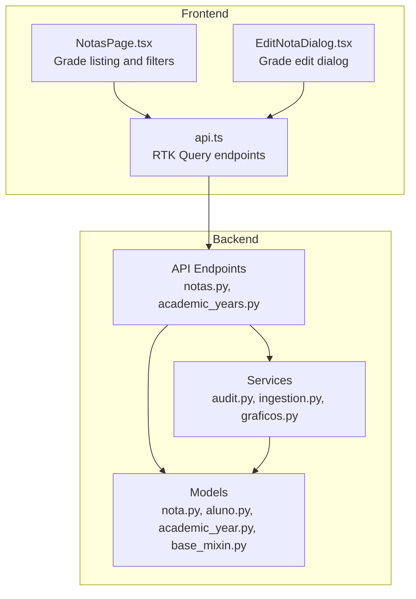
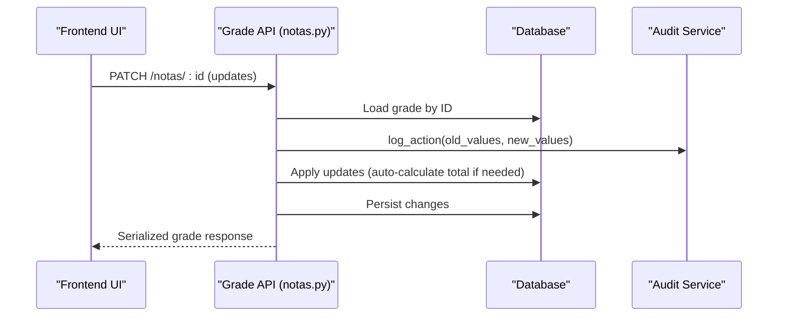
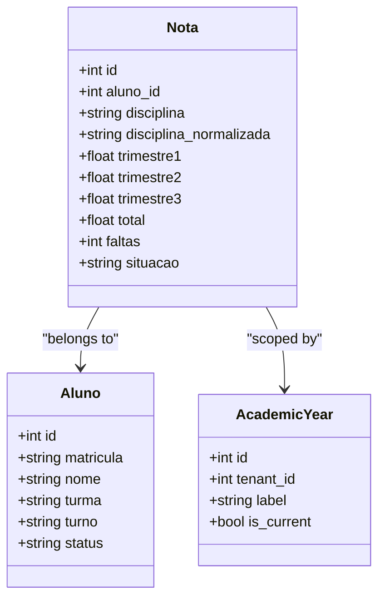
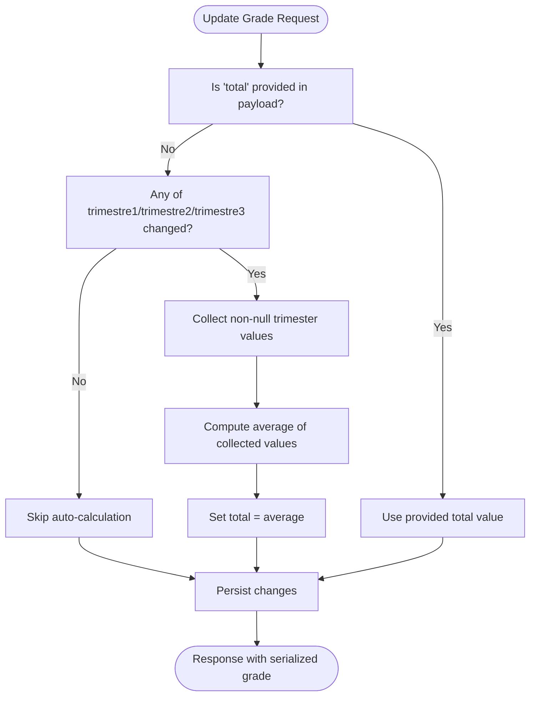
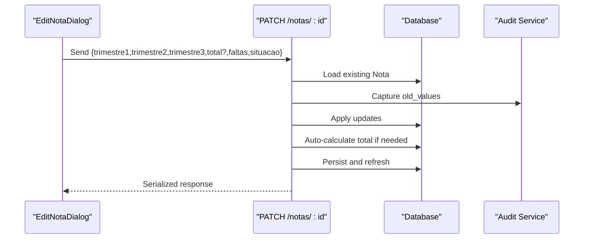
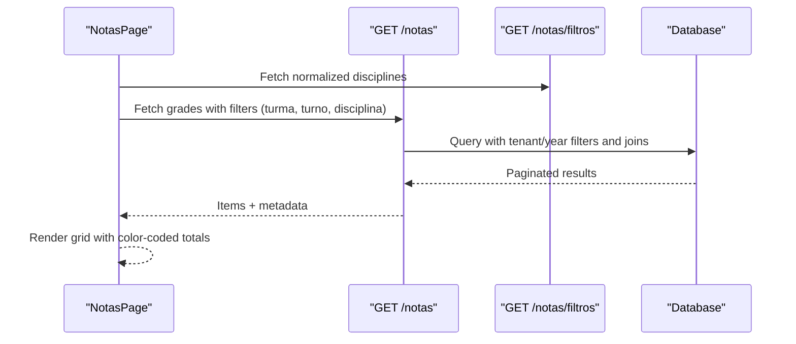
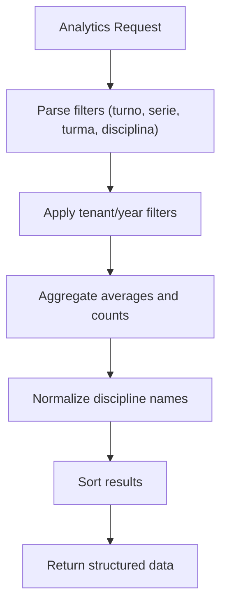
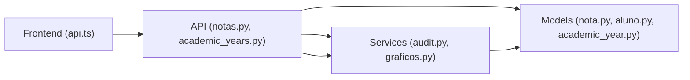

# Grade Tracking System

<cite>
**Referenced Files in This Document**
- [backend/app/models/nota.py](file://backend/app/models/nota.py)
- [backend/app/models/aluno.py](file://backend/app/models/aluno.py)
- [backend/app/models/academic_year.py](file://backend/app/models/academic_year.py)
- [backend/app/models/base_mixin.py](file://backend/app/models/base_mixin.py)
- [backend/app/api/v1/notas.py](file://backend/app/api/v1/notas.py)
- [backend/app/api/v1/academic_years.py](file://backend/app/api/v1/academic_years.py)
- [backend/app/api/v1/graficos.py](file://backend/app/api/v1/graficos.py)
- [backend/app/services/audit.py](file://backend/app/services/audit.py)
- [backend/app/services/ingestion.py](file://backend/app/services/ingestion.py)
- [frontend/src/features/notas/NotasPage.tsx](file://frontend/src/features/notas/NotasPage.tsx)
- [frontend/src/features/notas/EditNotaDialog.tsx](file://frontend/src/features/notas/EditNotaDialog.tsx)
- [frontend/src/lib/api.ts](file://frontend/src/lib/api.ts)
- [backend/app/templates/documents/bulletin.html](file://backend/app/templates/documents/bulletin.html)
</cite>

## Table of Contents
1. [Introduction](#introduction)
2. [Project Structure](#project-structure)
3. [Core Components](#core-components)
4. [Architecture Overview](#architecture-overview)
5. [Detailed Component Analysis](#detailed-component-analysis)
6. [Dependency Analysis](#dependency-analysis)
7. [Performance Considerations](#performance-considerations)
8. [Troubleshooting Guide](#troubleshooting-guide)
9. [Conclusion](#conclusion)

## Introduction
This document explains the grade tracking system used to record, manage, and calculate student grades across three trimesters. It covers the trimester-based grading structure, automatic total computation, grade validation rules, grade entry workflows, bulk operations, modification processes, and the relationships between grades, students, academic years, and disciplines. It also documents grade status determination, passing/failing criteria, grade normalization processes, and technical implementation details for persistence, validation, and audit trails.

## Project Structure
The grade tracking system spans backend Python services and frontend React components:
- Backend models define the data schema for grades, students, and academic year scoping.
- Backend API endpoints expose CRUD and filtering operations for grades.
- Frontend pages and dialogs provide user interfaces for viewing and editing grades.
- Services implement ingestion, normalization, analytics, and audit logging.

**Diagram sources**
- [backend/app/models/nota.py:9-24](file://backend/app/models/nota.py#L9-L24)
- [backend/app/models/aluno.py:8-36](file://backend/app/models/aluno.py#L8-L36)
- [backend/app/models/academic_year.py:6-16](file://backend/app/models/academic_year.py#L6-L16)
- [backend/app/models/base_mixin.py:4-22](file://backend/app/models/base_mixin.py#L4-L22)
- [backend/app/api/v1/notas.py:34-190](file://backend/app/api/v1/notas.py#L34-L190)
- [backend/app/api/v1/academic_years.py:7-28](file://backend/app/api/v1/academic_years.py#L7-L28)
- [frontend/src/features/notas/NotasPage.tsx:60-405](file://frontend/src/features/notas/NotasPage.tsx#L60-L405)
- [frontend/src/features/notas/EditNotaDialog.tsx:24-183](file://frontend/src/features/notas/EditNotaDialog.tsx#L24-L183)
- [frontend/src/lib/api.ts:503-521](file://frontend/src/lib/api.ts#L503-L521)

**Section sources**
- [backend/app/models/nota.py:9-24](file://backend/app/models/nota.py#L9-L24)
- [backend/app/models/aluno.py:8-36](file://backend/app/models/aluno.py#L8-L36)
- [backend/app/models/academic_year.py:6-16](file://backend/app/models/academic_year.py#L6-L16)
- [backend/app/models/base_mixin.py:4-22](file://backend/app/models/base_mixin.py#L4-L22)
- [backend/app/api/v1/notas.py:34-190](file://backend/app/api/v1/notas.py#L34-L190)
- [backend/app/api/v1/academic_years.py:7-28](file://backend/app/api/v1/academic_years.py#L7-L28)
- [frontend/src/features/notas/NotasPage.tsx:60-405](file://frontend/src/features/notas/NotasPage.tsx#L60-L405)
- [frontend/src/features/notas/EditNotaDialog.tsx:24-183](file://frontend/src/features/notas/EditNotaDialog.tsx#L24-L183)
- [frontend/src/lib/api.ts:503-521](file://frontend/src/lib/api.ts#L503-L521)

## Core Components
- Grade model (Nota): Stores discipline, three trimester scores, computed total, absences, and status. It links to a student and is scoped by tenant and academic year.
- Student model (Aluno): Contains student metadata and maintains a collection of grades.
- Academic year model (AcademicYear): Provides tenant-scoped academic year records with a current flag.
- Grade API: Lists grades with filters, updates grades with auto-calculation, and exposes discipline filters with normalization.
- Analytics API: Computes averages by trimester, discipline, and classroom, and supports grade distribution and correlation metrics.
- Frontend pages: Display grade lists, filters, and editing capabilities with real-time updates.

Key data fields and constraints:
- Trimester fields are numeric with two decimal places; missing grades are represented as null.
- Total is computed automatically when trimester fields change and total is not explicitly provided.
- Absences are integer counts; status is a string code.
- Tenant and academic year scoping ensures data isolation across organizations and school years.

**Section sources**
- [backend/app/models/nota.py:9-24](file://backend/app/models/nota.py#L9-L24)
- [backend/app/models/aluno.py:8-36](file://backend/app/models/aluno.py#L8-L36)
- [backend/app/models/academic_year.py:6-16](file://backend/app/models/academic_year.py#L6-L16)
- [backend/app/api/v1/notas.py:124-188](file://backend/app/api/v1/notas.py#L124-L188)
- [backend/app/api/v1/graficos.py:62-94](file://backend/app/api/v1/graficos.py#L62-L94)

## Architecture Overview
The system follows a layered architecture:
- Data layer: SQLAlchemy models with tenant and academic year mixins for isolation.
- Service layer: Business logic for ingestion, normalization, analytics, and audit logging.
- API layer: Flask endpoints exposing grade CRUD, filtering, and analytics.
- Presentation layer: React components with RTK Query for state management and UI rendering.

**Diagram sources**
- [backend/app/api/v1/notas.py:124-188](file://backend/app/api/v1/notas.py#L124-L188)
- [backend/app/services/audit.py:4-17](file://backend/app/services/audit.py#L4-L17)

**Section sources**
- [backend/app/api/v1/notas.py:34-190](file://backend/app/api/v1/notas.py#L34-L190)
- [backend/app/services/audit.py:4-17](file://backend/app/services/audit.py#L4-L17)

## Detailed Component Analysis

### Grade Model and Relationships
The grade model encapsulates:
- Identity and linkage: primary key, student foreign key, and relationships.
- Academic scoping: tenant and academic year foreign keys via mixin.
- Grading fields: discipline, normalized discipline, trimester1, trimester2, trimester3, total, absences, and status.
- Relationship to student: back-populated collection for cascading deletes.

**Diagram sources**
- [backend/app/models/nota.py:9-24](file://backend/app/models/nota.py#L9-L24)
- [backend/app/models/aluno.py:8-36](file://backend/app/models/aluno.py#L8-L36)
- [backend/app/models/academic_year.py:6-16](file://backend/app/models/academic_year.py#L6-L16)
- [backend/app/models/base_mixin.py:4-22](file://backend/app/models/base_mixin.py#L4-L22)

**Section sources**
- [backend/app/models/nota.py:9-24](file://backend/app/models/nota.py#L9-L24)
- [backend/app/models/aluno.py:8-36](file://backend/app/models/aluno.py#L8-L36)
- [backend/app/models/base_mixin.py:4-22](file://backend/app/models/base_mixin.py#L4-L22)

### Grade Calculation and Validation
Auto-calculation logic:
- When updating a grade, if total is not explicitly provided and any of the three trimester fields change, the system computes the average of non-null trimester values and assigns it to total.
- Missing grades (null) are excluded from the average; explicit zeros are not assumed.

Validation and normalization:
- Discipline normalization is applied during ingestion and filter building to ensure consistent grouping across variations (e.g., "INGLÊS" and "LÍNGUA INGLESA").
- Frontend edit dialog allows leaving total blank to trigger auto-calculation; clearing total sends a null value to the backend, which respects the auto-calculation rule.

**Diagram sources**
- [backend/app/api/v1/notas.py:157-166](file://backend/app/api/v1/notas.py#L157-L166)

**Section sources**
- [backend/app/api/v1/notas.py:157-166](file://backend/app/api/v1/notas.py#L157-L166)
- [backend/app/services/ingestion.py:555-634](file://backend/app/services/ingestion.py#L555-L634)
- [backend/app/api/v1/graficos.py:15-28](file://backend/app/api/v1/graficos.py#L15-L28)

### Grade Entry, Bulk Operations, and Modification Workflows
Grade entry and modification:
- Teachers/administrators use the edit dialog to update trimester scores, absences, and status. Leaving total blank triggers auto-calculation.
- The API validates permissions (admin-only edits) and applies updates atomically, capturing old values for audit trails.

Bulk operations:
- PDF upload endpoint supports batch ingestion of grades for a class and period. The ingestion service normalizes headers and disciplines, upserts student records and associated grades, and scopes them to the current tenant and academic year.

**Diagram sources**
- [frontend/src/features/notas/EditNotaDialog.tsx:59-93](file://frontend/src/features/notas/EditNotaDialog.tsx#L59-L93)
- [backend/app/api/v1/notas.py:124-188](file://backend/app/api/v1/notas.py#L124-L188)
- [backend/app/services/audit.py:4-17](file://backend/app/services/audit.py#L4-L17)

**Section sources**
- [frontend/src/features/notas/EditNotaDialog.tsx:24-183](file://frontend/src/features/notas/EditNotaDialog.tsx#L24-L183)
- [backend/app/api/v1/notas.py:124-188](file://backend/app/api/v1/notas.py#L124-L188)
- [frontend/src/lib/api.ts:510-517](file://frontend/src/lib/api.ts#L510-L517)
- [backend/app/services/ingestion.py:524-552](file://backend/app/services/ingestion.py#L524-L552)

### Grade Filtering, Listing, and Display
- The grade listing endpoint supports filtering by discipline, classroom, and shift, with pagination and tenant/year scoping.
- The discipline filter endpoint normalizes discipline names to ensure consistent dropdown options.
- The frontend displays grades in a grid with color-coded totals and handles empty states.

**Diagram sources**
- [frontend/src/features/notas/NotasPage.tsx:60-405](file://frontend/src/features/notas/NotasPage.tsx#L60-L405)
- [backend/app/api/v1/notas.py:37-123](file://backend/app/api/v1/notas.py#L37-L123)

**Section sources**
- [backend/app/api/v1/notas.py:37-123](file://backend/app/api/v1/notas.py#L37-L123)
- [frontend/src/features/notas/NotasPage.tsx:60-405](file://frontend/src/features/notas/NotasPage.tsx#L60-L405)
- [frontend/src/lib/api.ts:503-521](file://frontend/src/lib/api.ts#L503-L521)

### Grade Analytics and Reporting
Analytics endpoints compute:
- Average per trimester across selected filters.
- Average per discipline and per classroom with normalized discipline names.
- Distribution of academic statuses considering administrative status overrides.
- Attendance correlation and grade distributions across bands.

**Diagram sources**
- [backend/app/api/v1/graficos.py:39-94](file://backend/app/api/v1/graficos.py#L39-L94)

**Section sources**
- [backend/app/api/v1/graficos.py:62-94](file://backend/app/api/v1/graficos.py#L62-L94)
- [backend/app/api/v1/graficos.py:148-209](file://backend/app/api/v1/graficos.py#L148-L209)
- [backend/app/api/v1/graficos.py:271-291](file://backend/app/api/v1/graficos.py#L271-L291)

### Grade Status Determination and Passing/Failing Criteria
Status determination logic:
- Administrative status on the student record takes precedence over grade-based status.
- If no administrative status exists, grade-based status is derived from any recorded grade status codes, mapping to categories such as "Aprovado" or "Reprovado".

Passing/failing criteria:
- The bulletin template uses a threshold of 50 for determining passing/failing in rendered reports.

**Section sources**
- [backend/app/api/v1/graficos.py:148-209](file://backend/app/api/v1/graficos.py#L148-L209)
- [backend/app/templates/documents/bulletin.html:290-304](file://backend/app/templates/documents/bulletin.html#L290-L304)

### Grade Normalization Processes
Normalization ensures consistent grouping and reporting:
- During ingestion, discipline names are normalized and mapped to standardized forms.
- During analytics and filter building, discipline names are normalized to reduce variance in labels.

**Section sources**
- [backend/app/services/ingestion.py:555-634](file://backend/app/services/ingestion.py#L555-L634)
- [backend/app/api/v1/graficos.py:15-28](file://backend/app/api/v1/graficos.py#L15-L28)

### Persistence, Validation, and Audit Trails
Persistence:
- Grades are persisted with tenant and academic year scoping to isolate data across organizations and school years.
- The ingestion service upserts grades per student and discipline-normalized key.

Validation:
- The edit endpoint restricts modifications to administrators and validates allowed fields.
- Auto-calculation respects null values and excludes missing grades from averages.

Audit trails:
- Every update captures old and new values and logs the action with user identity and target details.

**Section sources**
- [backend/app/models/base_mixin.py:4-22](file://backend/app/models/base_mixin.py#L4-L22)
- [backend/app/api/v1/notas.py:124-188](file://backend/app/api/v1/notas.py#L124-L188)
- [backend/app/services/audit.py:4-17](file://backend/app/services/audit.py#L4-L17)
- [backend/app/services/ingestion.py:524-552](file://backend/app/services/ingestion.py#L524-L552)

## Dependency Analysis
The grade system exhibits clear separation of concerns:
- Models depend on the database layer and mixins for tenant/year scoping.
- API endpoints depend on models and services for business logic.
- Frontend depends on RTK Query endpoints for data fetching and mutation.
- Analytics and ingestion services depend on models and normalization utilities.

**Diagram sources**
- [frontend/src/lib/api.ts:503-521](file://frontend/src/lib/api.ts#L503-L521)
- [backend/app/api/v1/notas.py:34-190](file://backend/app/api/v1/notas.py#L34-L190)
- [backend/app/api/v1/academic_years.py:7-28](file://backend/app/api/v1/academic_years.py#L7-L28)
- [backend/app/models/nota.py:9-24](file://backend/app/models/nota.py#L9-L24)
- [backend/app/models/aluno.py:8-36](file://backend/app/models/aluno.py#L8-L36)
- [backend/app/models/academic_year.py:6-16](file://backend/app/models/academic_year.py#L6-L16)
- [backend/app/services/audit.py:4-17](file://backend/app/services/audit.py#L4-L17)
- [backend/app/api/v1/graficos.py:36-58](file://backend/app/api/v1/graficos.py#L36-L58)

**Section sources**
- [frontend/src/lib/api.ts:503-521](file://frontend/src/lib/api.ts#L503-L521)
- [backend/app/api/v1/notas.py:34-190](file://backend/app/api/v1/notas.py#L34-L190)
- [backend/app/models/nota.py:9-24](file://backend/app/models/nota.py#L9-L24)
- [backend/app/models/aluno.py:8-36](file://backend/app/models/aluno.py#L8-L36)
- [backend/app/models/academic_year.py:6-16](file://backend/app/models/academic_year.py#L6-L16)
- [backend/app/services/audit.py:4-17](file://backend/app/services/audit.py#L4-L17)
- [backend/app/api/v1/graficos.py:36-58](file://backend/app/api/v1/graficos.py#L36-L58)

## Performance Considerations
- Pagination and filtering: The listing endpoint supports pagination and tenant/year scoping to limit result sets.
- Aggregation queries: Analytics endpoints use grouped aggregations and normalized discipline names to minimize data skew and improve performance.
- Frontend caching: RTK Query tags enable selective cache invalidation after mutations.

## Troubleshooting Guide
Common scenarios:
- Grade not updating: Verify the requesting user has admin privileges and that only allowed fields are sent.
- Auto-calculation not triggering: Ensure total is not included in the payload when editing; leaving it blank or sending null will trigger auto-calculation.
- Missing grades in averages: Confirm that missing grades are stored as null; they are intentionally excluded from averages.
- Discipline discrepancies: Check normalized discipline names returned by the filters endpoint and ensure consistent labeling.

Audit and debugging:
- Use the audit logs endpoint to review actions performed on grades, including old and new values captured during updates.

**Section sources**
- [backend/app/api/v1/notas.py:124-188](file://backend/app/api/v1/notas.py#L124-L188)
- [frontend/src/features/notas/EditNotaDialog.tsx:59-93](file://frontend/src/features/notas/EditNotaDialog.tsx#L59-L93)
- [backend/app/services/audit.py:4-17](file://backend/app/services/audit.py#L4-L17)
- [frontend/src/lib/api.ts:660-663](file://frontend/src/lib/api.ts#L660-L663)

## Conclusion
The grade tracking system provides a robust, tenant- and year-scoped solution for managing student grades across three trimesters. It enforces clear validation rules, supports automatic total computation, and offers comprehensive analytics and audit capabilities. The frontend delivers intuitive grade listing and editing experiences, while the backend ensures data integrity and isolation across tenants and academic years.