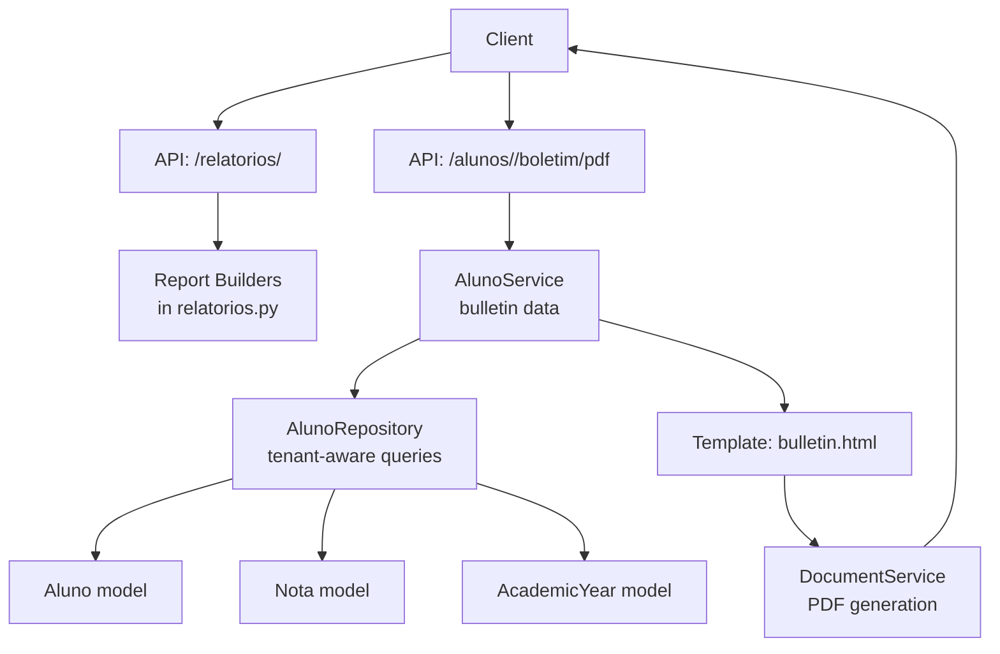
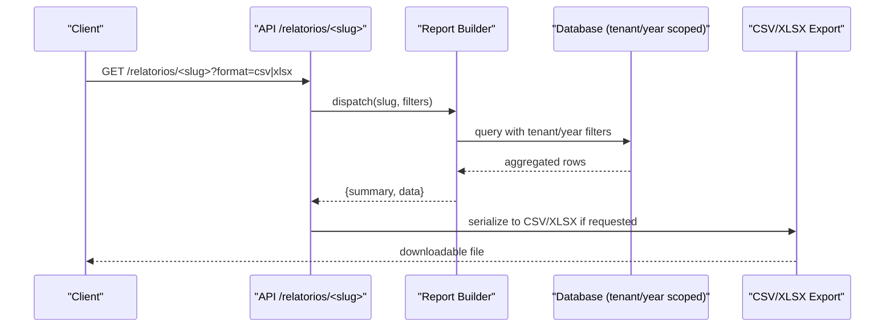
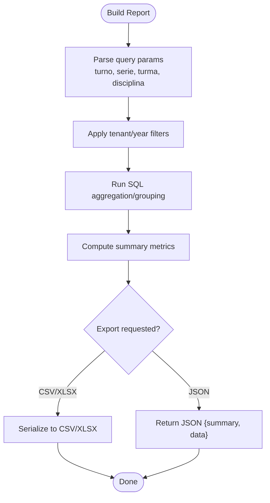
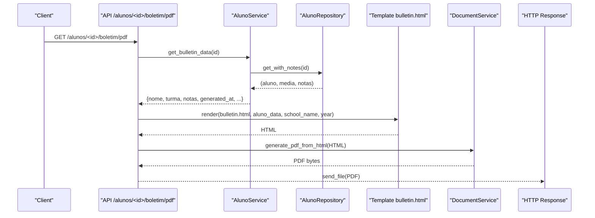
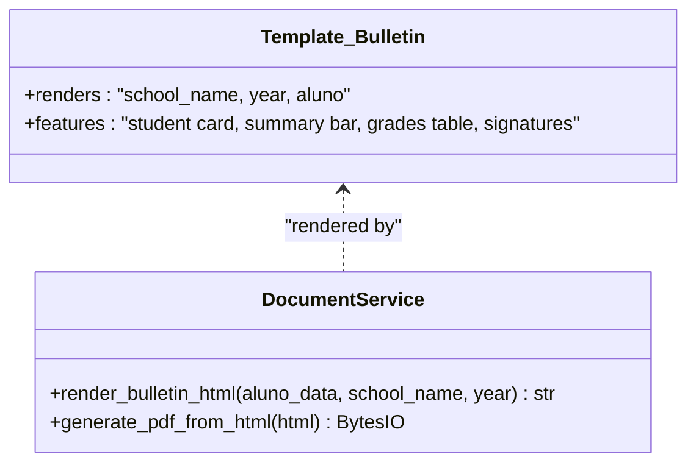
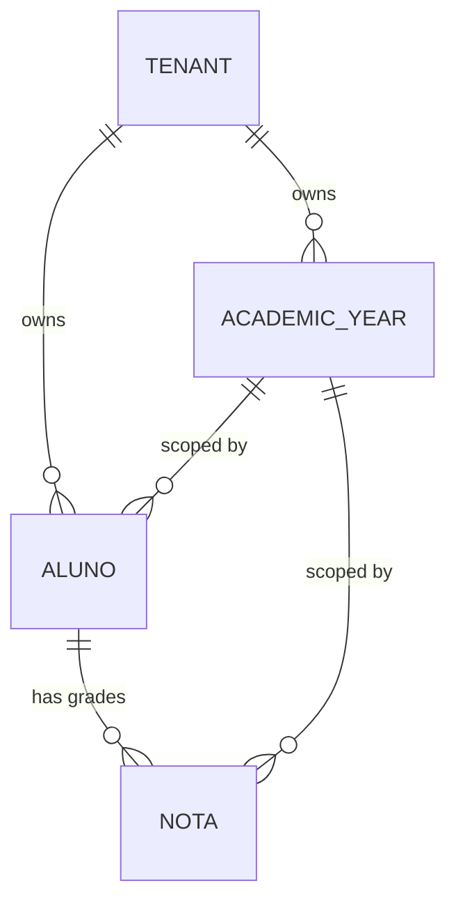
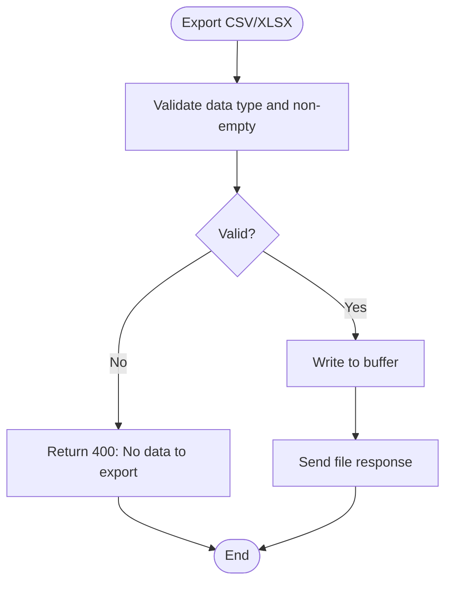
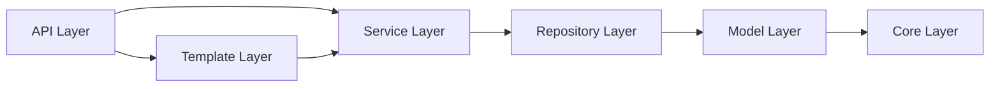

# Report Generation & Transcript System

<cite>
**Referenced Files in This Document**
- [relatorios.py](file://backend/app/api/v1/relatorios.py)
- [document_service.py](file://backend/app/services/document_service.py)
- [bulletin.html](file://backend/app/templates/documents/bulletin.html)
- [alunos.py](file://backend/app/api/v1/alunos.py)
- [aluno_service.py](file://backend/app/services/aluno_service.py)
- [aluno_repository.py](file://backend/app/repositories/aluno_repository.py)
- [aluno.py](file://backend/app/models/aluno.py)
- [nota.py](file://backend/app/models/nota.py)
- [academic_year.py](file://backend/app/models/academic_year.py)
- [base_mixin.py](file://backend/app/models/base_mixin.py)
- [database.py](file://backend/app/core/database.py)
- [comunicados.py](file://backend/app/api/v1/comunicados.py)
- [comunicado.py](file://backend/app/models/comunicado.py)
</cite>

## Table of Contents
1. [Introduction](#introduction)
2. [Project Structure](#project-structure)
3. [Core Components](#core-components)
4. [Architecture Overview](#architecture-overview)
5. [Detailed Component Analysis](#detailed-component-analysis)
6. [Dependency Analysis](#dependency-analysis)
7. [Performance Considerations](#performance-considerations)
8. [Troubleshooting Guide](#troubleshooting-guide)
9. [Conclusion](#conclusion)
10. [Appendices](#appendices)

## Introduction
This document explains the report generation and transcript system for academic reporting and document creation. It covers:
- Bulletin generation for individual students
- Transcript formatting and dynamic content injection via HTML templates
- PDF conversion workflows
- Report builders and filtering by academic context (tenant and academic year)
- Validation, quality checks, and error handling
- Distribution mechanisms (downloadable PDFs)
- Guidance for customizing templates and extending report types

## Project Structure
The report system spans API endpoints, services, repositories, models, and templates:
- API endpoints expose report builders and bulletin downloads
- Services orchestrate data retrieval and PDF generation
- Repositories encapsulate tenant-aware queries
- Models define student, grade, and academic year data
- Templates render transcripts with dynamic data
- Middleware ensures tenant and academic year scoping

**Diagram sources**
- [relatorios.py:457-538](file://backend/app/api/v1/relatorios.py#L457-L538)
- [alunos.py:111-148](file://backend/app/api/v1/alunos.py#L111-L148)
- [aluno_service.py:130-156](file://backend/app/services/aluno_service.py#L130-L156)
- [aluno_repository.py:76-105](file://backend/app/repositories/aluno_repository.py#L76-L105)
- [aluno.py:8-36](file://backend/app/models/aluno.py#L8-L36)
- [nota.py:9-24](file://backend/app/models/nota.py#L9-L24)
- [academic_year.py:6-16](file://backend/app/models/academic_year.py#L6-L16)
- [bulletin.html:1-345](file://backend/app/templates/documents/bulletin.html#L1-L345)
- [document_service.py:6-27](file://backend/app/services/document_service.py#L6-L27)

**Section sources**
- [relatorios.py:457-538](file://backend/app/api/v1/relatorios.py#L457-L538)
- [alunos.py:111-148](file://backend/app/api/v1/alunos.py#L111-L148)
- [aluno_service.py:130-156](file://backend/app/services/aluno_service.py#L130-L156)
- [aluno_repository.py:76-105](file://backend/app/repositories/aluno_repository.py#L76-L105)
- [aluno.py:8-36](file://backend/app/models/aluno.py#L8-L36)
- [nota.py:9-24](file://backend/app/models/nota.py#L9-L24)
- [academic_year.py:6-16](file://backend/app/models/academic_year.py#L6-L16)
- [bulletin.html:1-345](file://backend/app/templates/documents/bulletin.html#L1-L345)
- [document_service.py:6-27](file://backend/app/services/document_service.py#L6-L27)

## Core Components
- Report builders: Dynamic report builders keyed by slug, each returning summary metadata and tabular data, optionally exported to CSV/XLSX
- Bulletin generation: Endpoint to render a student’s transcript as a PDF using a Jinja2 template
- Document service: Converts rendered HTML to PDF in-memory
- Data retrieval: Tenant-aware queries that filter by tenant and academic year
- Academic context: Tenant and academic year are injected via Flask g and enforced by database hooks

Key capabilities:
- Filtering by turn, series/class, classroom, and subject
- Export formats: JSON (default), CSV, XLSX
- PDF delivery via HTTP response

**Section sources**
- [relatorios.py:11-37](file://backend/app/api/v1/relatorios.py#L11-L37)
- [relatorios.py:442-454](file://backend/app/api/v1/relatorios.py#L442-L454)
- [relatorios.py:460-538](file://backend/app/api/v1/relatorios.py#L460-L538)
- [alunos.py:111-148](file://backend/app/api/v1/alunos.py#L111-L148)
- [aluno_service.py:130-156](file://backend/app/services/aluno_service.py#L130-L156)
- [aluno_repository.py:76-105](file://backend/app/repositories/aluno_repository.py#L76-L105)
- [database.py:39-102](file://backend/app/core/database.py#L39-L102)

## Architecture Overview
The system enforces multi-tenancy and academic year scoping at the database level and exposes:
- Report builders via a slug-based endpoint with optional CSV/XLSX export
- Student bulletin PDF generation via a dedicated endpoint

**Diagram sources**
- [relatorios.py:460-538](file://backend/app/api/v1/relatorios.py#L460-L538)
- [relatorios.py:442-454](file://backend/app/api/v1/relatorios.py#L442-L454)
- [database.py:39-102](file://backend/app/core/database.py#L39-L102)

## Detailed Component Analysis

### Report Builders and Filters
- Filters applied across all builders: turn, series/class prefix, classroom, and subject
- Tenant and academic year are automatically included via Flask g and database hooks
- Builders return a summary object and a data array suitable for charts or tables
- Optional export to CSV/XLSX with validation of data shape

**Diagram sources**
- [relatorios.py:11-37](file://backend/app/api/v1/relatorios.py#L11-L37)
- [relatorios.py:460-538](file://backend/app/api/v1/relatorios.py#L460-L538)
- [database.py:39-102](file://backend/app/core/database.py#L39-L102)

**Section sources**
- [relatorios.py:11-37](file://backend/app/api/v1/relatorios.py#L11-L37)
- [relatorios.py:442-454](file://backend/app/api/v1/relatorios.py#L442-L454)
- [relatorios.py:460-538](file://backend/app/api/v1/relatorios.py#L460-L538)
- [database.py:39-102](file://backend/app/core/database.py#L39-L102)

### Bulletin PDF Generation
- Endpoint: GET /alunos/<id>/boletim/pdf
- Retrieves student details and grades, computes average, and injects into the bulletin template
- Renders HTML and converts to PDF in-memory
- Returns a downloadable PDF file

**Diagram sources**
- [alunos.py:111-148](file://backend/app/api/v1/alunos.py#L111-L148)
- [aluno_service.py:130-156](file://backend/app/services/aluno_service.py#L130-L156)
- [aluno_repository.py:76-105](file://backend/app/repositories/aluno_repository.py#L76-L105)
- [bulletin.html:1-345](file://backend/app/templates/documents/bulletin.html#L1-L345)
- [document_service.py:6-27](file://backend/app/services/document_service.py#L6-L27)

**Section sources**
- [alunos.py:111-148](file://backend/app/api/v1/alunos.py#L111-L148)
- [aluno_service.py:130-156](file://backend/app/services/aluno_service.py#L130-L156)
- [aluno_repository.py:76-105](file://backend/app/repositories/aluno_repository.py#L76-L105)
- [bulletin.html:1-345](file://backend/app/templates/documents/bulletin.html#L1-L345)
- [document_service.py:6-27](file://backend/app/services/document_service.py#L6-L27)

### HTML Template System and Dynamic Content Injection
- Template: bulletin.html renders student name, registration number, classroom, shift, and a grades table
- Dynamic content: Injected via Flask render_template with keys such as aluno, school_name, year
- Conditional rendering: Pass/fail badges and grade color coding based on computed values

**Diagram sources**
- [bulletin.html:1-345](file://backend/app/templates/documents/bulletin.html#L1-L345)
- [document_service.py:18-27](file://backend/app/services/document_service.py#L18-L27)

**Section sources**
- [bulletin.html:1-345](file://backend/app/templates/documents/bulletin.html#L1-L345)
- [document_service.py:18-27](file://backend/app/services/document_service.py#L18-L27)

### Data Models and Academic Year Context
- Aluno and Nota models include tenant_id and academic_year_id via TenantYearMixin
- AcademicYear stores the current academic year per tenant
- Database hooks enforce tenant and academic year filtering on queries

**Diagram sources**
- [base_mixin.py:4-22](file://backend/app/models/base_mixin.py#L4-L22)
- [aluno.py:8-36](file://backend/app/models/aluno.py#L8-L36)
- [nota.py:9-24](file://backend/app/models/nota.py#L9-L24)
- [academic_year.py:6-16](file://backend/app/models/academic_year.py#L6-L16)
- [database.py:39-102](file://backend/app/core/database.py#L39-L102)

**Section sources**
- [base_mixin.py:4-22](file://backend/app/models/base_mixin.py#L4-L22)
- [aluno.py:8-36](file://backend/app/models/aluno.py#L8-L36)
- [nota.py:9-24](file://backend/app/models/nota.py#L9-L24)
- [academic_year.py:6-16](file://backend/app/models/academic_year.py#L6-L16)
- [database.py:39-102](file://backend/app/core/database.py#L39-L102)

### Report Validation, Quality Checks, and Error Handling
- CSV/XLSX export validates that returned data is a non-empty list of dictionaries
- PDF generation raises an exception on conversion errors
- General report builder errors are caught and return a 500 response
- Role restrictions prevent unauthorized access to report endpoints

**Diagram sources**
- [relatorios.py:483-524](file://backend/app/api/v1/relatorios.py#L483-L524)

**Section sources**
- [relatorios.py:483-524](file://backend/app/api/v1/relatorios.py#L483-L524)
- [document_service.py:8-15](file://backend/app/services/document_service.py#L8-L15)
- [relatorios.py:533-535](file://backend/app/api/v1/relatorios.py#L533-L535)

### Report Distribution Mechanisms and Printing Options
- Digital delivery: CSV/XLSX exports and PDF downloads are served as HTTP responses
- Printing: PDFs can be printed directly from the browser or downloaded for local printing
- Distribution: The bulletin endpoint returns a downloadable PDF named after the student

**Section sources**
- [relatorios.py:493-524](file://backend/app/api/v1/relatorios.py#L493-L524)
- [alunos.py:139-145](file://backend/app/api/v1/alunos.py#L139-L145)

### Customization and Extending Report Types
- Add new report builders to the REPORT_BUILDERS registry
- Use the existing filter function to scope by tenant and academic year
- Extend the bulletin template or add new templates for different formats
- Integrate additional export formats by following the CSV/XLSX pattern

**Section sources**
- [relatorios.py:442-454](file://backend/app/api/v1/relatorios.py#L442-L454)
- [relatorios.py:11-37](file://backend/app/api/v1/relatorios.py#L11-L37)
- [bulletin.html:1-345](file://backend/app/templates/documents/bulletin.html#L1-L345)

## Dependency Analysis
The report system exhibits clear separation of concerns:
- API layer: request parsing, role checks, and response serialization
- Service layer: data shaping and template rendering
- Repository layer: tenant-aware queries
- Model layer: schema definitions with multi-tenant and academic year scoping
- Template layer: HTML rendering with dynamic content
- Core layer: database hooks enforcing tenant and academic year scoping

**Diagram sources**
- [relatorios.py:457-538](file://backend/app/api/v1/relatorios.py#L457-L538)
- [aluno_service.py:130-156](file://backend/app/services/aluno_service.py#L130-L156)
- [aluno_repository.py:76-105](file://backend/app/repositories/aluno_repository.py#L76-L105)
- [aluno.py:8-36](file://backend/app/models/aluno.py#L8-L36)
- [nota.py:9-24](file://backend/app/models/nota.py#L9-L24)
- [academic_year.py:6-16](file://backend/app/models/academic_year.py#L6-L16)
- [base_mixin.py:4-22](file://backend/app/models/base_mixin.py#L4-L22)
- [database.py:39-102](file://backend/app/core/database.py#L39-L102)
- [bulletin.html:1-345](file://backend/app/templates/documents/bulletin.html#L1-L345)

**Section sources**
- [relatorios.py:457-538](file://backend/app/api/v1/relatorios.py#L457-L538)
- [aluno_service.py:130-156](file://backend/app/services/aluno_service.py#L130-L156)
- [aluno_repository.py:76-105](file://backend/app/repositories/aluno_repository.py#L76-L105)
- [aluno.py:8-36](file://backend/app/models/aluno.py#L8-L36)
- [nota.py:9-24](file://backend/app/models/nota.py#L9-L24)
- [academic_year.py:6-16](file://backend/app/models/academic_year.py#L6-L16)
- [base_mixin.py:4-22](file://backend/app/models/base_mixin.py#L4-L22)
- [database.py:39-102](file://backend/app/core/database.py#L39-L102)
- [bulletin.html:1-345](file://backend/app/templates/documents/bulletin.html#L1-L345)

## Performance Considerations
- Aggregation queries use grouping and limits to control result sizes
- CSV/XLSX export serializes only the returned data list
- Tenant and academic year scoping is enforced at the database level to avoid scanning unrelated data
- Consider adding pagination and server-side charting for large datasets

## Troubleshooting Guide
Common issues and resolutions:
- Empty or missing data for export: Ensure the builder returns a non-empty list of dictionaries
- PDF generation failures: Verify template rendering and that no conversion errors occur
- Unauthorized access: Confirm JWT roles and that the endpoint is not restricted to students
- Incorrect academic context: Verify tenant and academic year are set in the request context

**Section sources**
- [relatorios.py:483-524](file://backend/app/api/v1/relatorios.py#L483-L524)
- [relatorios.py:533-535](file://backend/app/api/v1/relatorios.py#L533-L535)
- [document_service.py:8-15](file://backend/app/services/document_service.py#L8-L15)
- [alunos.py:463-464](file://backend/app/api/v1/alunos.py#L463-L464)

## Conclusion
The report generation and transcript system provides:
- Flexible report builders with tenant and academic year scoping
- CSV/XLSX export support and robust error handling
- A production-ready bulletin PDF pipeline using HTML templates
- Clear extension points for new report types and formats

## Appendices

### Report Builder Registry and Available Reports
- turmas-mais-faltas
- melhores-medias
- alunos-em-risco
- disciplinas-notas-baixas
- melhores-alunos
- performance-heatmap
- attendance-correlation
- class-radar
- radar-abandono
- comparativo-eficiencia
- top-movers

**Section sources**
- [relatorios.py:442-454](file://backend/app/api/v1/relatorios.py#L442-L454)

### Filtering Options
- turn: filter by shift
- serie: filter by class/grade prefix
- turma: filter by classroom
- disciplina: filter by subject

**Section sources**
- [relatorios.py:11-37](file://backend/app/api/v1/relatorios.py#L11-L37)

### Batch Report Generation
- Use the report builder endpoint with filters to retrieve data
- Export to CSV/XLSX for batch processing and further distribution

**Section sources**
- [relatorios.py:460-538](file://backend/app/api/v1/relatorios.py#L460-L538)

### Integration with Grade Data, Student Information, and Academic Year Context
- Student and grade data are retrieved via tenant-scoped queries
- Academic year context is enforced via database hooks and injected into templates

**Section sources**
- [aluno_repository.py:76-105](file://backend/app/repositories/aluno_repository.py#L76-L105)
- [database.py:39-102](file://backend/app/core/database.py#L39-L102)
- [bulletin.html:233-236](file://backend/app/templates/documents/bulletin.html#L233-L236)

### Report Distribution and Printing
- PDFs are returned as downloadable attachments
- Printing is supported via browser or local print workflows

**Section sources**
- [alunos.py:139-145](file://backend/app/api/v1/alunos.py#L139-L145)

### Customizing Templates and Extending Report Types
- Modify bulletin.html or add new templates
- Register new report builders in the registry and implement filtering logic

**Section sources**
- [bulletin.html:1-345](file://backend/app/templates/documents/bulletin.html#L1-L345)
- [relatorios.py:442-454](file://backend/app/api/v1/relatorios.py#L442-L454)