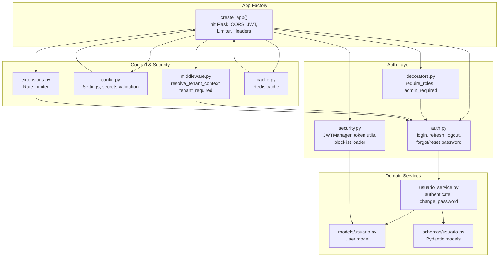
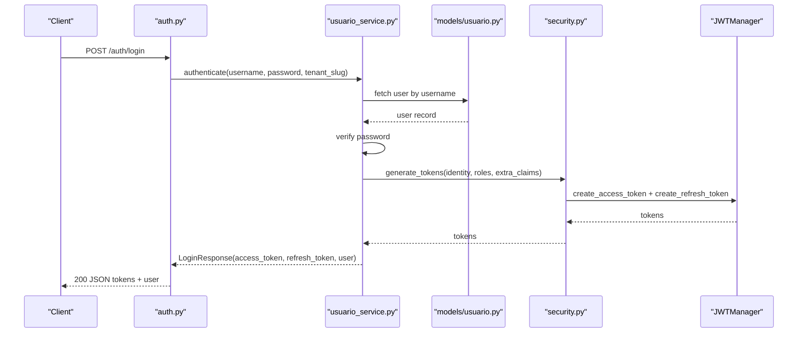
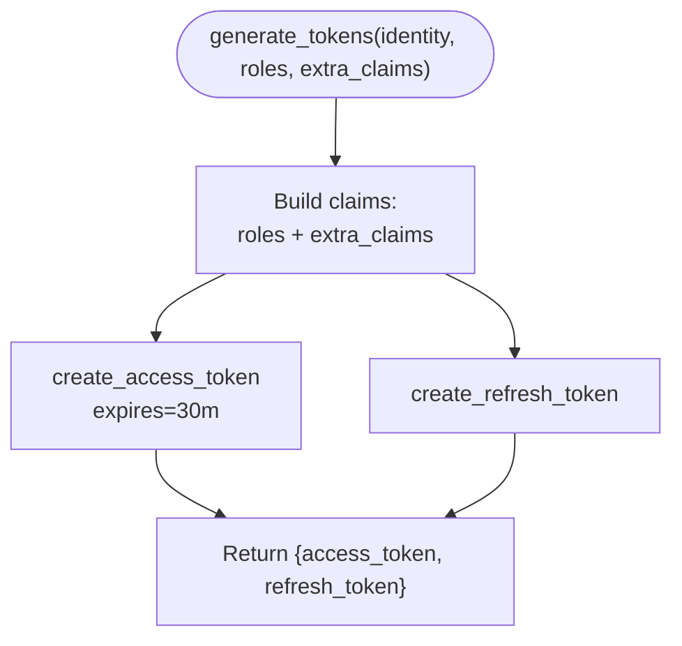
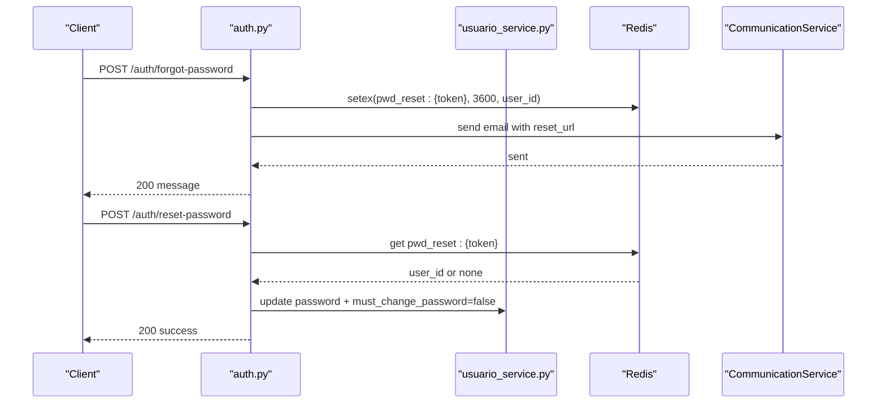
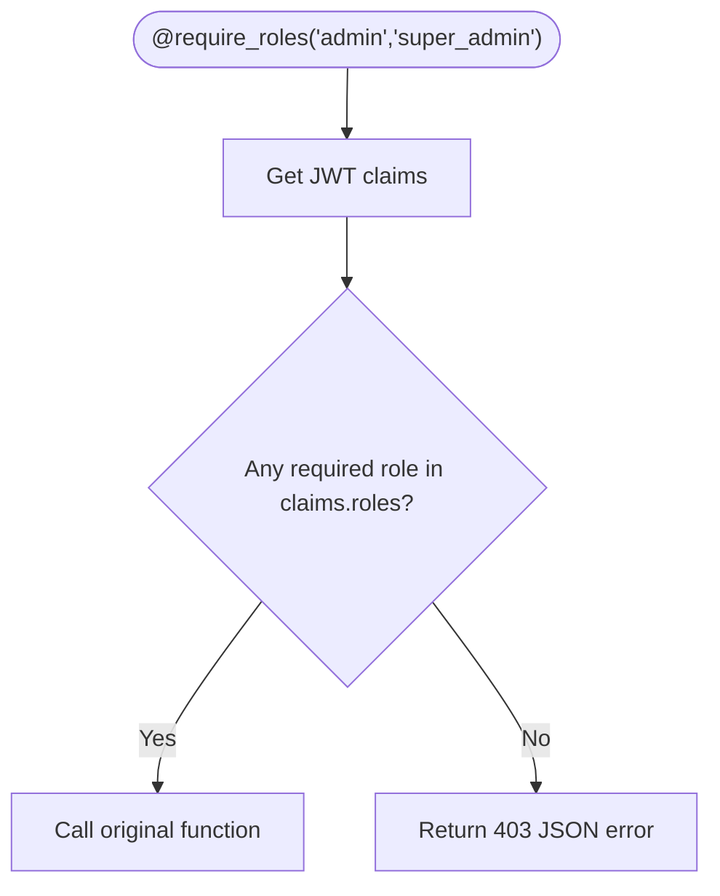
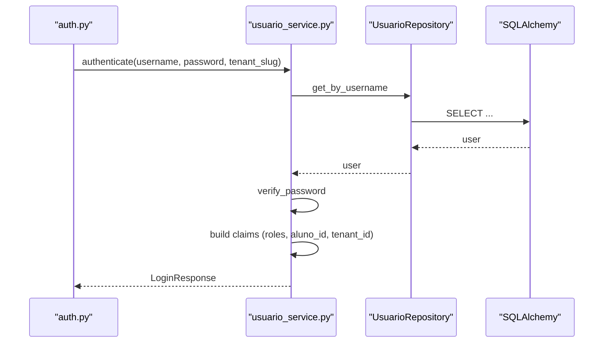
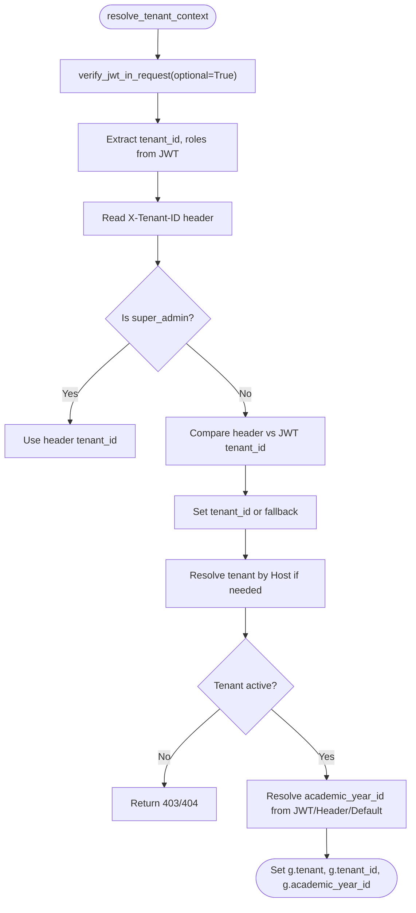
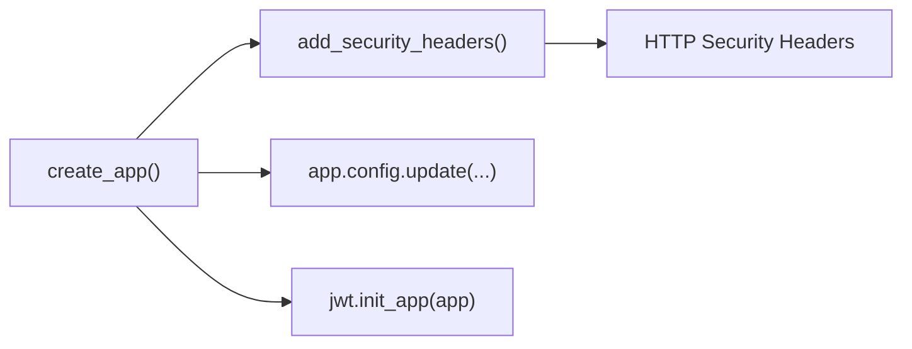
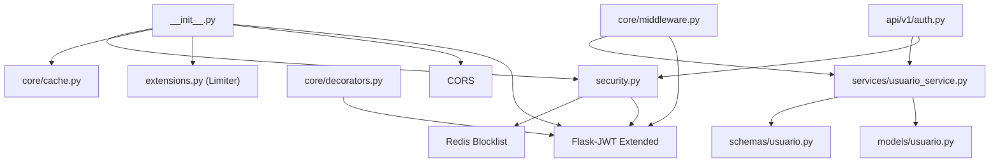

# Authentication & Authorization

<cite>
**Referenced Files in This Document**
- [backend/app/core/security.py](file://backend/app/core/security.py)
- [backend/app/core/decorators.py](file://backend/app/core/decorators.py)
- [backend/app/api/v1/auth.py](file://backend/app/api/v1/auth.py)
- [backend/app/services/usuario_service.py](file://backend/app/services/usuario_service.py)
- [backend/app/models/usuario.py](file://backend/app/models/usuario.py)
- [backend/app/schemas/usuario.py](file://backend/app/schemas/usuario.py)
- [backend/app/core/middleware.py](file://backend/app/core/middleware.py)
- [backend/app/core/config.py](file://backend/app/core/config.py)
- [backend/app/core/extensions.py](file://backend/app/core/extensions.py)
- [backend/app/core/cache.py](file://backend/app/core/cache.py)
- [backend/app/__init__.py](file://backend/app/__init__.py)
- [backend/tests/test_auth.py](file://backend/tests/test_auth.py)
</cite>

## Table of Contents
1. [Introduction](#introduction)
2. [Project Structure](#project-structure)
3. [Core Components](#core-components)
4. [Architecture Overview](#architecture-overview)
5. [Detailed Component Analysis](#detailed-component-analysis)
6. [Dependency Analysis](#dependency-analysis)
7. [Performance Considerations](#performance-considerations)
8. [Troubleshooting Guide](#troubleshooting-guide)
9. [Conclusion](#conclusion)

## Introduction
This document explains the JWT-based authentication and authorization system implemented in the backend. It covers the authentication flow, role-based access control (RBAC) using security decorators, token lifecycle and refresh mechanism, and security headers configuration. The content is designed for both security architects and developers, aligning with the codebase’s terminology (JWT tokens, RBAC roles, security decorators).

## Project Structure
The authentication and authorization logic is centered around:
- JWT setup and token utilities in the security module
- Authentication endpoints and password reset flows
- User service orchestrating authentication and token generation
- RBAC decorators enforcing role checks
- Tenant-aware middleware resolving context from JWT, headers, and host
- Application configuration and security headers
- Rate limiting and caching integrations

**Diagram sources**
- [backend/app/__init__.py:15-87](file://backend/app/__init__.py#L15-L87)
- [backend/app/api/v1/auth.py:15-166](file://backend/app/api/v1/auth.py#L15-L166)
- [backend/app/core/security.py:1-62](file://backend/app/core/security.py#L1-L62)
- [backend/app/core/decorators.py:1-30](file://backend/app/core/decorators.py#L1-L30)
- [backend/app/services/usuario_service.py:11-45](file://backend/app/services/usuario_service.py#L11-L45)
- [backend/app/models/usuario.py:8-30](file://backend/app/models/usuario.py#L8-L30)
- [backend/app/schemas/usuario.py:14-77](file://backend/app/schemas/usuario.py#L14-L77)
- [backend/app/core/middleware.py:6-125](file://backend/app/core/middleware.py#L6-L125)
- [backend/app/core/config.py:9-60](file://backend/app/core/config.py#L9-L60)
- [backend/app/core/extensions.py:1-8](file://backend/app/core/extensions.py#L1-L8)
- [backend/app/core/cache.py:1-65](file://backend/app/core/cache.py#L1-L65)

**Section sources**
- [backend/app/__init__.py:15-87](file://backend/app/__init__.py#L15-L87)
- [backend/app/api/v1/auth.py:15-166](file://backend/app/api/v1/auth.py#L15-L166)
- [backend/app/core/security.py:1-62](file://backend/app/core/security.py#L1-L62)
- [backend/app/core/decorators.py:1-30](file://backend/app/core/decorators.py#L1-L30)
- [backend/app/services/usuario_service.py:11-45](file://backend/app/services/usuario_service.py#L11-L45)
- [backend/app/models/usuario.py:8-30](file://backend/app/models/usuario.py#L8-L30)
- [backend/app/schemas/usuario.py:14-77](file://backend/app/schemas/usuario.py#L14-L77)
- [backend/app/core/middleware.py:6-125](file://backend/app/core/middleware.py#L6-L125)
- [backend/app/core/config.py:9-60](file://backend/app/core/config.py#L9-L60)
- [backend/app/core/extensions.py:1-8](file://backend/app/core/extensions.py#L1-L8)
- [backend/app/core/cache.py:1-65](file://backend/app/core/cache.py#L1-L65)

## Core Components
- JWT Manager and token utilities: initialize JWT, generate access/refresh tokens, and enforce token blocklist checks.
- Authentication endpoints: login, refresh, logout, change password, forgot password, and reset password.
- RBAC decorators: require_roles and admin_required to enforce role-based access.
- User service: orchestrates authentication, password verification, and token issuance with claims.
- Tenant-aware middleware: resolves tenant and academic year context from JWT, headers, and host.
- Configuration and security headers: application settings, secret validation, and hardened HTTP headers.

**Section sources**
- [backend/app/core/security.py:11-62](file://backend/app/core/security.py#L11-L62)
- [backend/app/api/v1/auth.py:27-166](file://backend/app/api/v1/auth.py#L27-L166)
- [backend/app/core/decorators.py:5-30](file://backend/app/core/decorators.py#L5-L30)
- [backend/app/services/usuario_service.py:15-45](file://backend/app/services/usuario_service.py#L15-L45)
- [backend/app/core/middleware.py:6-125](file://backend/app/core/middleware.py#L6-L125)
- [backend/app/core/config.py:9-60](file://backend/app/core/config.py#L9-L60)
- [backend/app/__init__.py:58-67](file://backend/app/__init__.py#L58-L67)

## Architecture Overview
The authentication and authorization architecture integrates Flask-JWT Extended with Redis-backed token blocklisting, tenant-aware context resolution, and rate limiting. The flow begins at the authentication endpoints, delegates to the user service for credential validation, and issues JWT tokens containing RBAC claims. Subsequent requests are validated by the JWT manager and optional blocklist check, while tenant and academic year context are resolved centrally.

**Diagram sources**
- [backend/app/api/v1/auth.py:27-42](file://backend/app/api/v1/auth.py#L27-L42)
- [backend/app/services/usuario_service.py:15-45](file://backend/app/services/usuario_service.py#L15-L45)
- [backend/app/models/usuario.py:8-30](file://backend/app/models/usuario.py#L8-L30)
- [backend/app/core/security.py:23-35](file://backend/app/core/security.py#L23-L35)

## Detailed Component Analysis

### JWT Setup and Token Utilities
- Initializes Flask-JWT Extended and bcrypt-based password hashing.
- Generates access and refresh tokens with a “roles” claim and optional extra claims (e.g., aluno_id, tenant_id).
- Implements token blocklist using Redis with JTI keys and TTL aligned to token expiry.
- Registers a blocklist loader to reject revoked tokens; fails closed if Redis is unavailable.

**Diagram sources**
- [backend/app/core/security.py:23-35](file://backend/app/core/security.py#L23-L35)

**Section sources**
- [backend/app/core/security.py:11-62](file://backend/app/core/security.py#L11-L62)

### Authentication Endpoints
- Login validates credentials via the user service and returns access/refresh tokens plus user data.
- Refresh endpoint regenerates tokens preserving roles and selected extra claims from the original token.
- Logout endpoint accepts a valid JWT (no-op at server side; client invalidates tokens).
- Change password endpoint requires JWT and updates the user’s password after verifying the current password.
- Forgot password generates a time-limited reset token stored in Redis and emails a reset link.
- Reset password validates the token, updates the user’s password, and clears the reset token.

**Diagram sources**
- [backend/app/api/v1/auth.py:80-121](file://backend/app/api/v1/auth.py#L80-L121)
- [backend/app/api/v1/auth.py:123-163](file://backend/app/api/v1/auth.py#L123-L163)

**Section sources**
- [backend/app/api/v1/auth.py:27-166](file://backend/app/api/v1/auth.py#L27-L166)

### Role-Based Access Control (RBAC) and Security Decorators
- require_roles enforces that the caller holds at least one of the required roles by inspecting the “roles” claim.
- admin_required is a shorthand for admin or super_admin roles.
- These decorators integrate with Flask-JWT Extended to read claims from the current token.

**Diagram sources**
- [backend/app/core/decorators.py:5-29](file://backend/app/core/decorators.py#L5-L29)

**Section sources**
- [backend/app/core/decorators.py:5-30](file://backend/app/core/decorators.py#L5-L30)

### User Service Orchestration
- authenticate verifies credentials, optionally validates tenant membership (except for super_admin), builds RBAC claims, and issues tokens.
- change_password validates current password and updates to a new hashed password.

**Diagram sources**
- [backend/app/services/usuario_service.py:15-45](file://backend/app/services/usuario_service.py#L15-L45)
- [backend/app/models/usuario.py:8-30](file://backend/app/models/usuario.py#L8-L30)

**Section sources**
- [backend/app/services/usuario_service.py:15-45](file://backend/app/services/usuario_service.py#L15-L45)
- [backend/app/models/usuario.py:8-30](file://backend/app/models/usuario.py#L8-L30)

### Tenant-Aware Context Resolution and Multi-Tenancy
- resolve_tenant_context extracts tenant_id and academic_year_id from JWT claims, headers, or host, with strict rules for super_admin context switching.
- tenant_required is a decorator that injects tenant and academic year into Flask’s g for downstream handlers.
- The middleware ensures inactive tenants are rejected and supports a development fallback.

**Diagram sources**
- [backend/app/core/middleware.py:6-125](file://backend/app/core/middleware.py#L6-L125)

**Section sources**
- [backend/app/core/middleware.py:6-125](file://backend/app/core/middleware.py#L6-L125)

### Security Headers and Configuration
- Application factory sets Flask and JWT secrets, initializes CORS, JWT, database, blueprints, and registers error handlers.
- Adds hardened security headers on every response, including HSTS in production.
- Settings enforce minimum secret lengths for production and load environment variables from .env.

**Diagram sources**
- [backend/app/__init__.py:15-87](file://backend/app/__init__.py#L15-L87)

**Section sources**
- [backend/app/__init__.py:18-67](file://backend/app/__init__.py#L18-L67)
- [backend/app/core/config.py:9-60](file://backend/app/core/config.py#L9-L60)

### Rate Limiting and Caching
- Flask-Limiter is initialized with Redis storage for rate limits; authentication endpoints apply stricter limits.
- Redis caching is available for API responses, keyed by tenant and academic year.

**Section sources**
- [backend/app/core/extensions.py:4-7](file://backend/app/core/extensions.py#L4-L7)
- [backend/app/api/v1/auth.py:28-81](file://backend/app/api/v1/auth.py#L28-L81)
- [backend/app/core/cache.py:8-65](file://backend/app/core/cache.py#L8-L65)

## Dependency Analysis
The following diagram shows key dependencies among authentication and authorization components:

**Diagram sources**
- [backend/app/core/security.py:11-62](file://backend/app/core/security.py#L11-L62)
- [backend/app/api/v1/auth.py:15-166](file://backend/app/api/v1/auth.py#L15-L166)
- [backend/app/services/usuario_service.py:11-45](file://backend/app/services/usuario_service.py#L11-L45)
- [backend/app/models/usuario.py:8-30](file://backend/app/models/usuario.py#L8-L30)
- [backend/app/schemas/usuario.py:14-77](file://backend/app/schemas/usuario.py#L14-L77)
- [backend/app/core/decorators.py:1-30](file://backend/app/core/decorators.py#L1-L30)
- [backend/app/core/middleware.py:6-125](file://backend/app/core/middleware.py#L6-L125)
- [backend/app/__init__.py:15-87](file://backend/app/__init__.py#L15-L87)
- [backend/app/core/extensions.py:1-8](file://backend/app/core/extensions.py#L1-L8)
- [backend/app/core/cache.py:1-65](file://backend/app/core/cache.py#L1-L65)

**Section sources**
- [backend/app/core/security.py:11-62](file://backend/app/core/security.py#L11-L62)
- [backend/app/api/v1/auth.py:15-166](file://backend/app/api/v1/auth.py#L15-L166)
- [backend/app/services/usuario_service.py:11-45](file://backend/app/services/usuario_service.py#L11-L45)
- [backend/app/models/usuario.py:8-30](file://backend/app/models/usuario.py#L8-L30)
- [backend/app/schemas/usuario.py:14-77](file://backend/app/schemas/usuario.py#L14-L77)
- [backend/app/core/decorators.py:1-30](file://backend/app/core/decorators.py#L1-L30)
- [backend/app/core/middleware.py:6-125](file://backend/app/core/middleware.py#L6-L125)
- [backend/app/__init__.py:15-87](file://backend/app/__init__.py#L15-L87)
- [backend/app/core/extensions.py:1-8](file://backend/app/core/extensions.py#L1-L8)
- [backend/app/core/cache.py:1-65](file://backend/app/core/cache.py#L1-L65)

## Performance Considerations
- Token blocklist checks use Redis with a single exists call per request; failures are handled by a closed policy to avoid revocation bypass during outages.
- Access tokens are short-lived (30 minutes) to minimize exposure windows; refresh tokens regenerate claims efficiently.
- Rate limiting is applied to authentication endpoints to mitigate brute-force attacks.
- Caching responses by tenant and academic year reduces repeated computation under multi-tenant loads.

[No sources needed since this section provides general guidance]

## Troubleshooting Guide
Common issues and resolutions:
- Unauthorized errors on login indicate invalid credentials or tenant mismatch for non-super_admin users.
- 403 “Acesso negado” responses mean the caller lacks the required RBAC roles.
- Token revoked errors occur when the JTI is present in the Redis blocklist; verify logout flow and Redis connectivity.
- Tenant context errors arise from missing or conflicting tenant_id in JWT versus headers; ensure super_admin privileges for header-based overrides.
- Forgotten password resets fail if the token is missing, expired, or the user is inactive.

**Section sources**
- [backend/app/services/usuario_service.py:17-28](file://backend/app/services/usuario_service.py#L17-L28)
- [backend/app/core/decorators.py:18-21](file://backend/app/core/decorators.py#L18-L21)
- [backend/app/core/security.py:44-61](file://backend/app/core/security.py#L44-L61)
- [backend/app/core/middleware.py:68-72](file://backend/app/core/middleware.py#L68-L72)
- [backend/app/api/v1/auth.py:134-157](file://backend/app/api/v1/auth.py#L134-L157)

## Conclusion
The system implements a robust JWT-based authentication and authorization framework with:
- Short-lived access tokens and refresh tokens with preserved claims
- RBAC enforcement via decorators
- Centralized tenant and academic year context resolution
- Hardened security headers and production-ready secret validation
- Rate limiting and Redis-backed token blocklisting for resilience

This foundation enables secure, scalable multi-tenant operations across the platform.