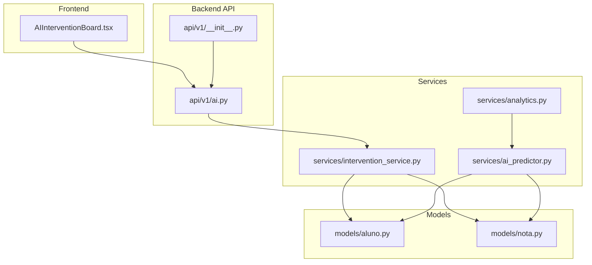
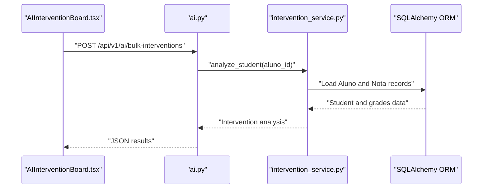
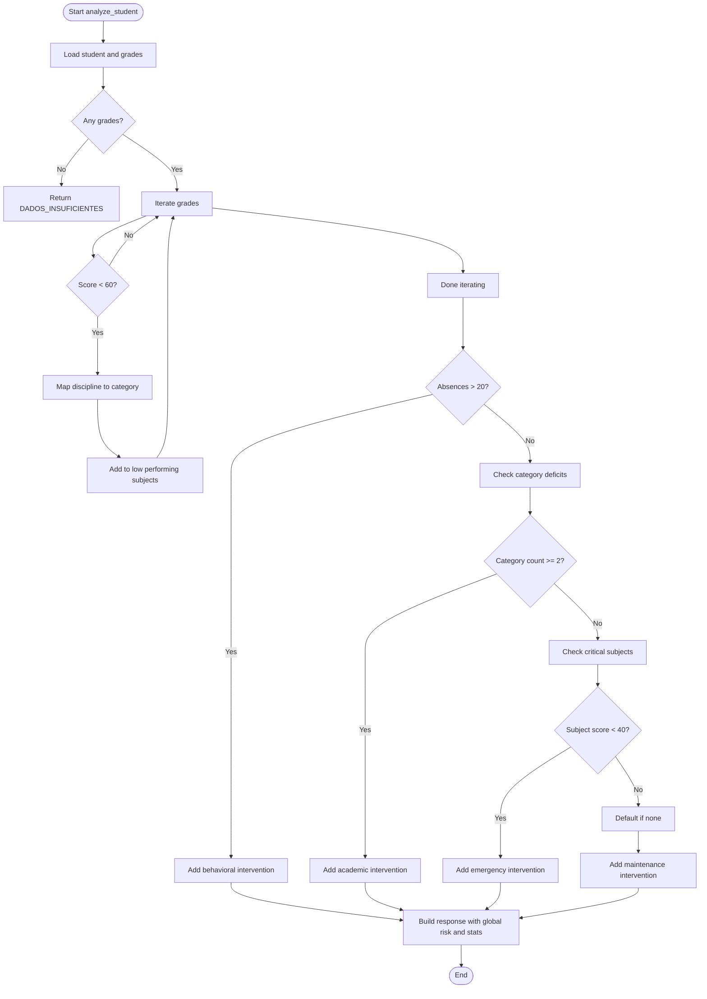
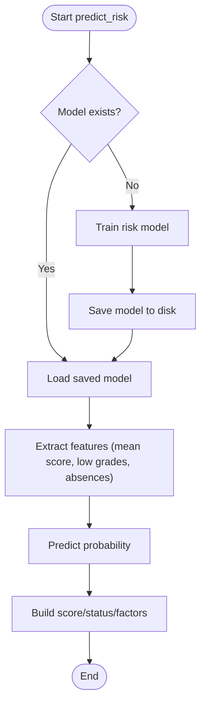
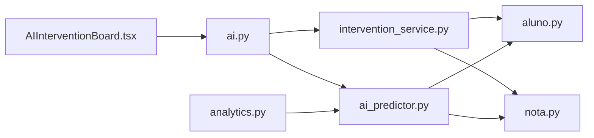

# AI Intervention API

<cite>
**Referenced Files in This Document**
- [ai.py](file://backend/app/api/v1/ai.py)
- [intervention_service.py](file://backend/app/services/intervention_service.py)
- [ai_predictor.py](file://backend/app/services/ai_predictor.py)
- [analytics.py](file://backend/app/services/analytics.py)
- [aluno.py](file://backend/app/models/aluno.py)
- [nota.py](file://backend/app/models/nota.py)
- [aluno.py](file://backend/app/schemas/aluno.py)
- [__init__.py](file://backend/app/api/v1/__init__.py)
- [AIInterventionBoard.tsx](file://frontend/src/features/dashboard/AIInterventionBoard.tsx)
- [test_intervention.py](file://backend/test_intervention.py)
</cite>

## Table of Contents
1. [Introduction](#introduction)
2. [Project Structure](#project-structure)
3. [Core Components](#core-components)
4. [Architecture Overview](#architecture-overview)
5. [Detailed Component Analysis](#detailed-component-analysis)
6. [Dependency Analysis](#dependency-analysis)
7. [Performance Considerations](#performance-considerations)
8. [Troubleshooting Guide](#troubleshooting-guide)
9. [Conclusion](#conclusion)
10. [Appendices](#appendices)

## Introduction
This document describes the AI-powered student intervention API, focusing on risk assessment algorithms, intervention recommendations, and pedagogical analysis services. It explains how student data is ingested, preprocessed, and analyzed to produce actionable recommendations. It also documents the API endpoints, request/response schemas, and the intervention workflow automation. Finally, it outlines ethical considerations, model transparency, and human oversight requirements for responsible AI-driven decisions.

## Project Structure
The AI intervention system spans backend API endpoints, services, models, and frontend dashboards:
- API endpoints expose student intervention analysis and bulk intervention generation.
- Services implement pedagogical analysis and risk prediction logic.
- Models define the data structures for students and grades.
- Frontend integrates AI insights into teacher dashboards.

**Diagram sources**
- [__init__.py:1-39](file://backend/app/api/v1/__init__.py#L1-L39)
- [ai.py:1-51](file://backend/app/api/v1/ai.py#L1-L51)
- [intervention_service.py:1-128](file://backend/app/services/intervention_service.py#L1-L128)
- [ai_predictor.py:1-120](file://backend/app/services/ai_predictor.py#L1-L120)
- [analytics.py:1-196](file://backend/app/services/analytics.py#L1-L196)
- [aluno.py:1-36](file://backend/app/models/aluno.py#L1-L36)
- [nota.py:1-24](file://backend/app/models/nota.py#L1-L24)
- [AIInterventionBoard.tsx:1-157](file://frontend/src/features/dashboard/AIInterventionBoard.tsx#L1-L157)

**Section sources**
- [__init__.py:1-39](file://backend/app/api/v1/__init__.py#L1-L39)
- [ai.py:1-51](file://backend/app/api/v1/ai.py#L1-L51)
- [intervention_service.py:1-128](file://backend/app/services/intervention_service.py#L1-L128)
- [ai_predictor.py:1-120](file://backend/app/services/ai_predictor.py#L1-L120)
- [analytics.py:1-196](file://backend/app/services/analytics.py#L1-L196)
- [aluno.py:1-36](file://backend/app/models/aluno.py#L1-L36)
- [nota.py:1-24](file://backend/app/models/nota.py#L1-L24)
- [AIInterventionBoard.tsx:1-157](file://frontend/src/features/dashboard/AIInterventionBoard.tsx#L1-L157)

## Core Components
- AI Intervention API endpoints:
  - GET /api/v1/ai/interventions/{aluno_id}: Returns pedagogical interventions for a specific student.
  - POST /api/v1/ai/bulk-interventions: Returns interventions for a list of student IDs.
- Intervention service:
  - Performs subject categorization, attendance risk detection, and generates targeted academic and behavioral interventions.
- Risk predictor:
  - Trains a logistic regression model to predict failure risk and returns a risk score and factors.
- Analytics:
  - Provides teacher dashboard insights and integrates risk predictions for high-risk students.
- Data models:
  - Student and grade entities used for analysis and recommendations.

**Section sources**
- [ai.py:11-51](file://backend/app/api/v1/ai.py#L11-L51)
- [intervention_service.py:8-128](file://backend/app/services/intervention_service.py#L8-L128)
- [ai_predictor.py:12-120](file://backend/app/services/ai_predictor.py#L12-L120)
- [analytics.py:86-196](file://backend/app/services/analytics.py#L86-L196)
- [aluno.py:8-36](file://backend/app/models/aluno.py#L8-L36)
- [nota.py:9-24](file://backend/app/models/nota.py#L9-L24)

## Architecture Overview
The AI intervention pipeline connects frontend dashboards to backend endpoints, services, and models. The frontend triggers bulk analysis, the API validates roles and sessions, the intervention service computes recommendations, and the risk predictor augments insights with a trained model.

**Diagram sources**
- [AIInterventionBoard.tsx:25-33](file://frontend/src/features/dashboard/AIInterventionBoard.tsx#L25-L33)
- [ai.py:27-51](file://backend/app/api/v1/ai.py#L27-L51)
- [intervention_service.py:27-124](file://backend/app/services/intervention_service.py#L27-L124)
- [aluno.py:8-36](file://backend/app/models/aluno.py#L8-L36)
- [nota.py:9-24](file://backend/app/models/nota.py#L9-L24)

## Detailed Component Analysis

### API Endpoints
- GET /api/v1/ai/interventions/{aluno_id}
  - Role requirements: admin, coordenador, professor
  - Behavior: Loads a student and their grades, runs pedagogical analysis, returns intervention recommendations.
  - Error handling: Logs internal errors and returns appropriate HTTP status codes.
- POST /api/v1/ai/bulk-interventions
  - Role requirements: admin, coordenador
  - Request body: JSON with student_ids array (max 100 IDs)
  - Behavior: Iterates over IDs, collects analyses, returns aggregated results with counts.

**Section sources**
- [ai.py:11-51](file://backend/app/api/v1/ai.py#L11-L51)

### Intervention Service
- Subject categorization:
  - Groups disciplines into clusters (Exatas, Humanas, Linguagens, Biologicas, Outros) for holistic risk assessment.
- Performance analysis:
  - Aggregates scores and absences; identifies low-performing subjects and category-wide deficits.
- Intervention generation:
  - Behavioral: attendance monitoring when absences exceed threshold.
  - Academic: reinforcement clusters when multiple subjects in a category are weak.
  - Emergency: critical alert for extremely low scores in specific subjects.
  - Maintenance: encouragement and extension activities for high-performing students.
- Output structure:
  - Includes student metadata, global risk level, intervention list, and stats.

**Diagram sources**
- [intervention_service.py:27-124](file://backend/app/services/intervention_service.py#L27-L124)

**Section sources**
- [intervention_service.py:8-128](file://backend/app/services/intervention_service.py#L8-L128)

### Risk Prediction Service
- Training:
  - Aggregates student grades and absences; defines heuristic target (two or more low grades OR more than 15 absences).
  - Uses scikit-learn logistic regression; saves model to disk.
- Prediction:
  - Loads model if present; otherwise trains a new one.
  - Computes mean score, low grades count, and absences; predicts failure probability.
  - Returns risk score, status (HIGH/MEDIUM/LOW), and factor breakdown.

**Diagram sources**
- [ai_predictor.py:12-120](file://backend/app/services/ai_predictor.py#L12-L120)

**Section sources**
- [ai_predictor.py:12-120](file://backend/app/services/ai_predictor.py#L12-L120)

### Analytics Integration
- Teacher dashboard:
  - Builds performance distribution and retrieves top risky students (average below threshold).
  - Calls risk predictor for each risky student to enrich alerts with AI risk scores.
- Risk alerts:
  - Combines heuristic thresholds with model predictions to surface actionable insights.

**Section sources**
- [analytics.py:86-196](file://backend/app/services/analytics.py#L86-L196)

### Data Models and Schemas
- Student model:
  - Contains personal and enrollment attributes, and a relationship to grades.
- Grade model:
  - Stores subject scores, absences, and normalized subject names.
- Student schemas:
  - Define request/response shapes for student and grade data.

**Section sources**
- [aluno.py:8-36](file://backend/app/models/aluno.py#L8-L36)
- [nota.py:9-24](file://backend/app/models/nota.py#L9-L24)
- [aluno.py:1-85](file://backend/app/schemas/aluno.py#L1-L85)

### Frontend Integration
- AI Intervention Board:
  - Triggers bulk intervention requests when student IDs change.
  - Renders intervention cards with priority indicators and descriptions.
  - Uses a mutation hook to fetch results and displays loading skeletons.

**Section sources**
- [AIInterventionBoard.tsx:19-33](file://frontend/src/features/dashboard/AIInterventionBoard.tsx#L19-L33)
- [AIInterventionBoard.tsx:80-152](file://frontend/src/features/dashboard/AIInterventionBoard.tsx#L80-L152)

## Dependency Analysis
- API depends on intervention service for analysis and on JWT for role-based access.
- Intervention service depends on SQLAlchemy ORM to load student and grade data.
- Risk predictor depends on scikit-learn and persists a model to disk.
- Analytics integrates risk predictor to enrich dashboard alerts.
- Frontend depends on API mutations to render AI insights.

**Diagram sources**
- [ai.py:1-51](file://backend/app/api/v1/ai.py#L1-L51)
- [intervention_service.py:1-128](file://backend/app/services/intervention_service.py#L1-L128)
- [ai_predictor.py:1-120](file://backend/app/services/ai_predictor.py#L1-L120)
- [analytics.py:1-196](file://backend/app/services/analytics.py#L1-L196)
- [aluno.py:1-36](file://backend/app/models/aluno.py#L1-L36)
- [nota.py:1-24](file://backend/app/models/nota.py#L1-L24)
- [AIInterventionBoard.tsx:1-157](file://frontend/src/features/dashboard/AIInterventionBoard.tsx#L1-L157)

**Section sources**
- [ai.py:1-51](file://backend/app/api/v1/ai.py#L1-L51)
- [intervention_service.py:1-128](file://backend/app/services/intervention_service.py#L1-L128)
- [ai_predictor.py:1-120](file://backend/app/services/ai_predictor.py#L1-L120)
- [analytics.py:1-196](file://backend/app/services/analytics.py#L1-L196)
- [aluno.py:1-36](file://backend/app/models/aluno.py#L1-L36)
- [nota.py:1-24](file://backend/app/models/nota.py#L1-L24)
- [AIInterventionBoard.tsx:1-157](file://frontend/src/features/dashboard/AIInterventionBoard.tsx#L1-L157)

## Performance Considerations
- Bulk processing:
  - Endpoint limits batch size to 100 student IDs to prevent overload.
- Caching:
  - Dashboard endpoints use caching to reduce repeated computation.
- Model persistence:
  - Risk model is persisted to disk to avoid retraining on each request.
- Data aggregation:
  - Pre-aggregates scores and absences to minimize downstream computations.

[No sources needed since this section provides general guidance]

## Troubleshooting Guide
- API errors:
  - Student not found: returns 404 with an error message.
  - Internal server errors: logged and returned as 500 with a generic message.
- Risk predictor failures:
  - If model training fails or prediction errors occur, returns a zero score with an error status.
- Intervention service failures:
  - Logs exceptions and returns a structured error response.

**Section sources**
- [ai.py:17-25](file://backend/app/api/v1/ai.py#L17-L25)
- [ai.py:48-50](file://backend/app/api/v1/ai.py#L48-L50)
- [ai_predictor.py:117-119](file://backend/app/services/ai_predictor.py#L117-L119)
- [intervention_service.py:122-124](file://backend/app/services/intervention_service.py#L122-L124)

## Conclusion
The AI Intervention API provides a robust framework for automated pedagogical analysis and intervention recommendations. It combines heuristic-based logic with a machine learning risk predictor to support teachers in identifying at-risk students and planning targeted actions. The system emphasizes role-based access, data-driven insights, and transparent outputs suitable for dashboard integration.

[No sources needed since this section summarizes without analyzing specific files]

## Appendices

### API Definitions

- GET /api/v1/ai/interventions/{aluno_id}
  - Roles: admin, coordenador, professor
  - Path parameters:
    - alumno_id (integer): student identifier
  - Responses:
    - 200 OK: Intervention analysis object
    - 404 Not Found: Error indicating student not found
    - 500 Internal Server Error: Generic error message

- POST /api/v1/ai/bulk-interventions
  - Roles: admin, coordenador
  - Request body:
    - student_ids (array of integers, max 100): list of student identifiers
  - Responses:
    - 200 OK: { count: integer, results: array of intervention analysis objects }
    - 400 Bad Request: Error indicating invalid input
    - 500 Internal Server Error: Generic error message

**Section sources**
- [ai.py:11-51](file://backend/app/api/v1/ai.py#L11-L51)

### Intervention Analysis Schema
- Input:
  - aluno_id (integer)
- Output:
  - aluno_nome (string)
  - aluno_id (integer)
  - turma (string)
  - global_risk (string: ALTO, MEDIO, BAIXO)
  - interventions (array of objects):
    - priority (string: HIGH, MEDIUM, LOW)
    - type (string: BEHAVIORAL, ACADEMIC, EMERGENCY, MAINTENANCE)
    - title (string)
    - description (string)
    - impact (string: EVASAO_ESCOLAR, RETENCAO_CONTEUDO, REPROVACAO, EXCELENCIA)
  - stats (object):
    - total_faltas (integer)
    - disciplinas_abaixo_media (integer)

**Section sources**
- [intervention_service.py:110-120](file://backend/app/services/intervention_service.py#L110-L120)

### Risk Prediction Schema
- Input:
  - aluno_id (integer)
- Output:
  - score (number: 0.0–1.0)
  - status (string: ALTO, MEDIO, BAIXO)
  - factors (object):
    - media_geral (number)
    - disciplinas_abaixo_60 (integer)
    - total_faltas (integer)

**Section sources**
- [ai_predictor.py:107-115](file://backend/app/services/ai_predictor.py#L107-L115)

### Example Workflows

- Student risk evaluation
  - Trigger: GET /api/v1/ai/interventions/{aluno_id}
  - Outcome: Returns global risk level and intervention list based on grades and attendance.

- Bulk intervention planning
  - Trigger: POST /api/v1/ai/bulk-interventions with student_ids
  - Outcome: Returns aggregated results for high-risk students, enabling dashboard overview.

- AI-assisted decision making
  - Trigger: Teacher dashboard queries risky students and risk predictor enrichment
  - Outcome: Combines heuristic thresholds with model scores to guide prioritization.

**Section sources**
- [ai.py:11-51](file://backend/app/api/v1/ai.py#L11-L51)
- [analytics.py:156-167](file://backend/app/services/analytics.py#L156-L167)

### Ethical Considerations, Transparency, and Human Oversight
- Ethical considerations:
  - Use AI insights to augment, not replace, professional judgment.
  - Ensure fairness by validating models across diverse demographics and contexts.
- Model transparency:
  - Expose risk factors (mean score, low grades, absences) to explain predictions.
  - Persist and version models to enable reproducibility and audits.
- Human oversight:
  - Require human review before implementing high-priority interventions.
  - Maintain logs of AI recommendations and human decisions for accountability.

[No sources needed since this section provides general guidance]