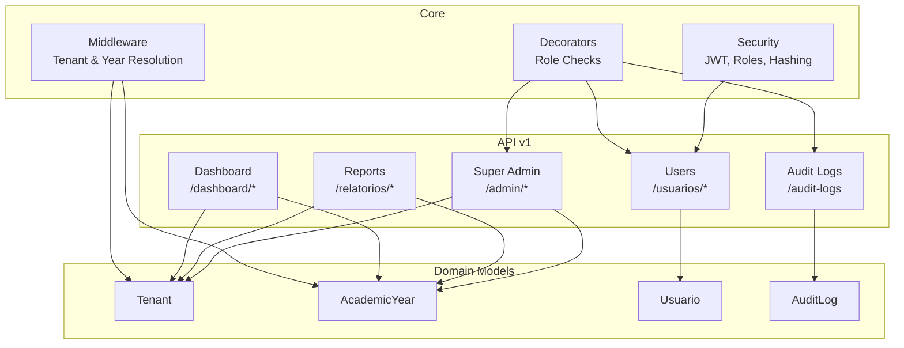
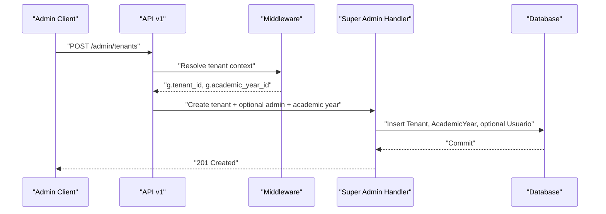
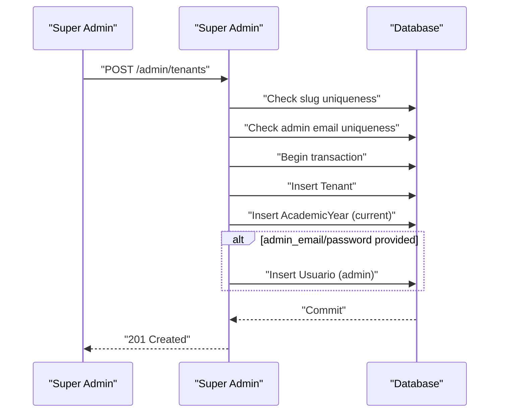
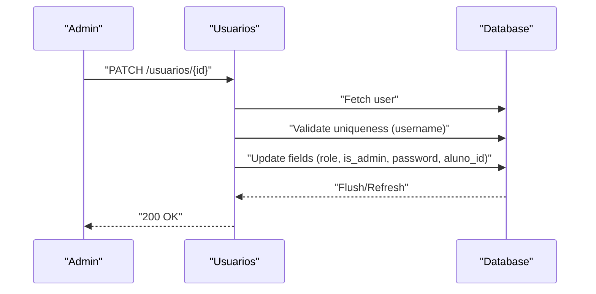
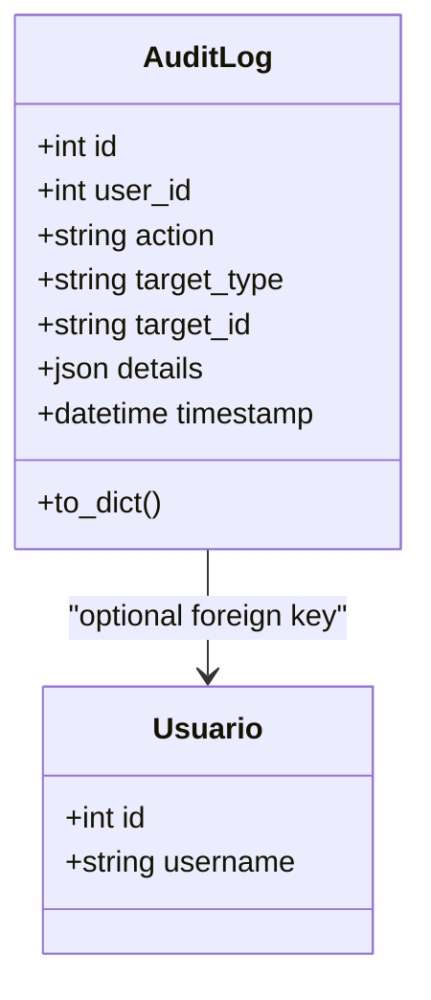
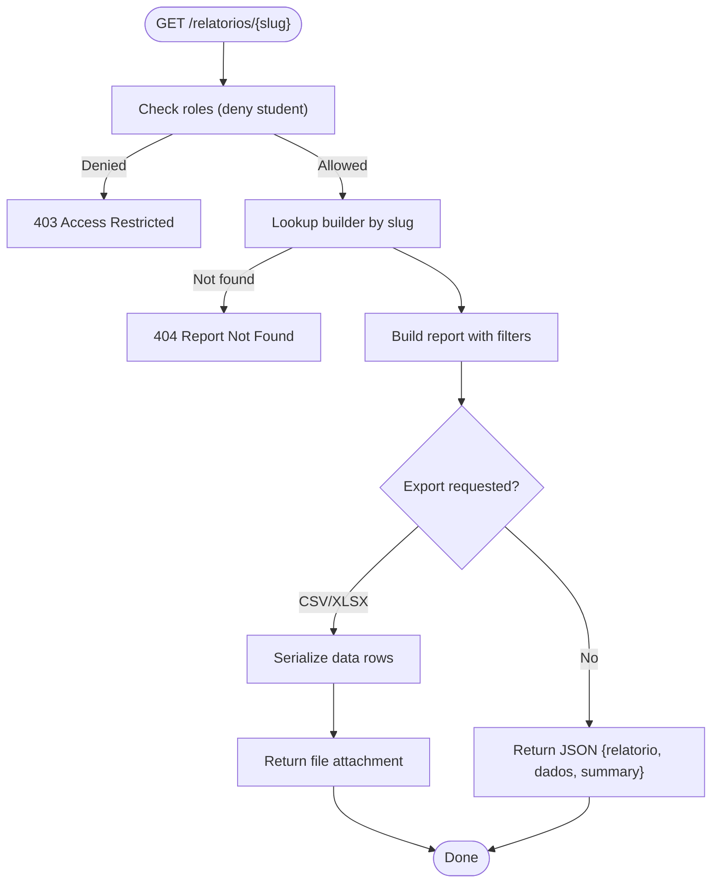
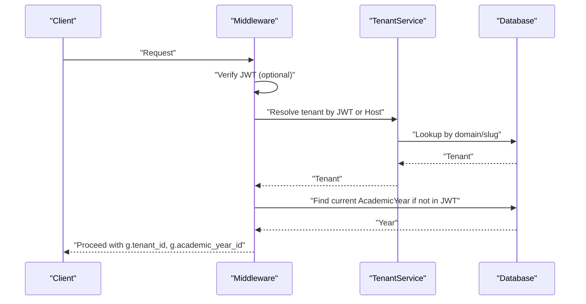
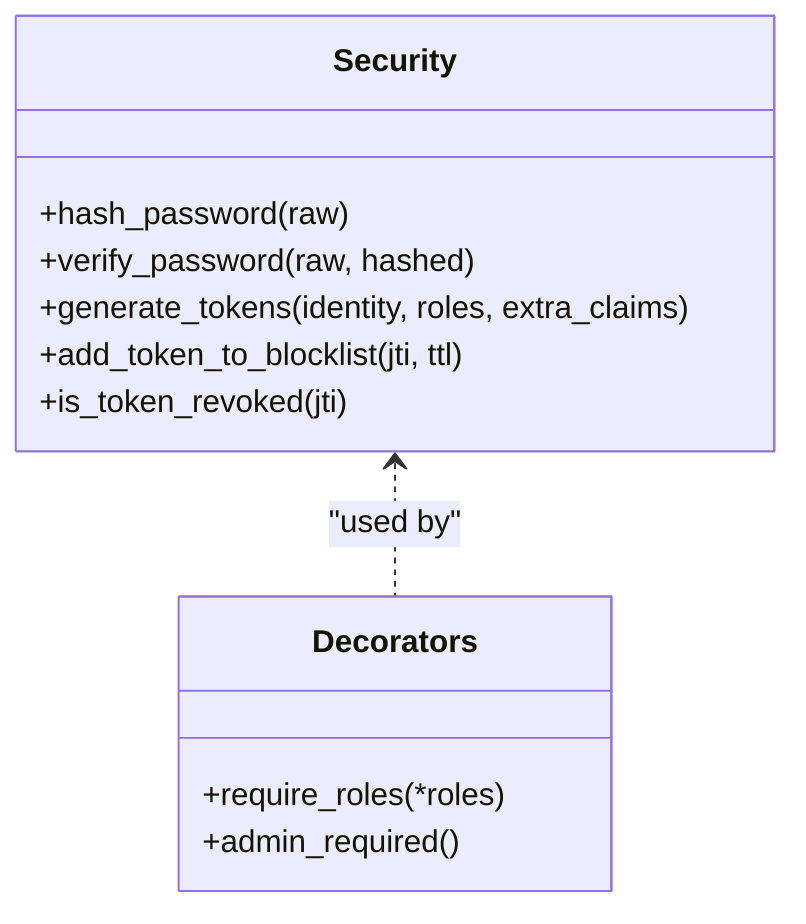
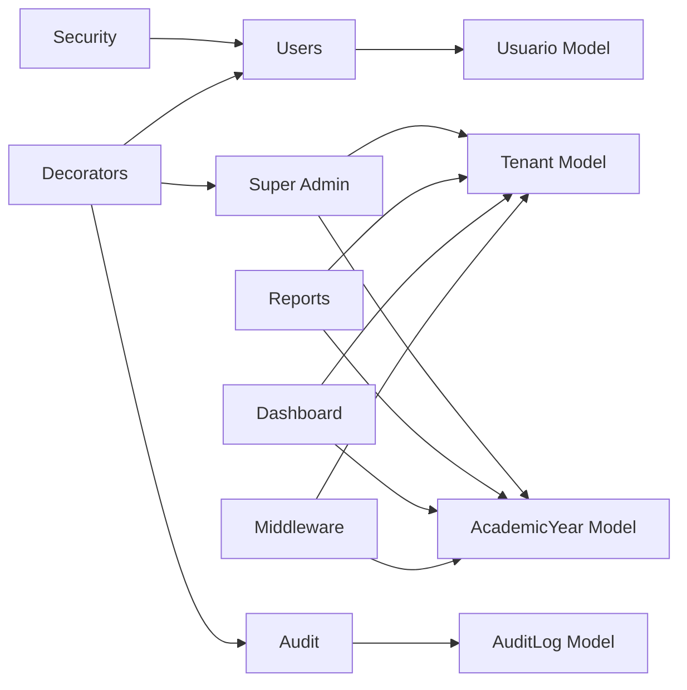

# Administrative API

<cite>
**Referenced Files in This Document**
- [super_admin.py](file://backend/app/api/v1/super_admin.py)
- [audit.py](file://backend/app/api/v1/audit.py)
- [usuarios.py](file://backend/app/api/v1/usuarios.py)
- [relatorios.py](file://backend/app/api/v1/relatorios.py)
- [audit_log.py](file://backend/app/models/audit_log.py)
- [tenant.py](file://backend/app/models/tenant.py)
- [usuario.py](file://backend/app/models/usuario.py)
- [security.py](file://backend/app/core/security.py)
- [decorators.py](file://backend/app/core/decorators.py)
- [tenant_service.py](file://backend/app/services/tenant_service.py)
- [academic_year.py](file://backend/app/models/academic_year.py)
- [dashboard.py](file://backend/app/api/v1/dashboard.py)
- [middleware.py](file://backend/app/core/middleware.py)
- [v1_init.py](file://backend/app/api/v1/__init__.py)
- [audit_service.py](file://backend/app/services/audit.py)
</cite>

## Table of Contents
1. [Introduction](#introduction)
2. [Project Structure](#project-structure)
3. [Core Components](#core-components)
4. [Architecture Overview](#architecture-overview)
5. [Detailed Component Analysis](#detailed-component-analysis)
6. [Dependency Analysis](#dependency-analysis)
7. [Performance Considerations](#performance-considerations)
8. [Troubleshooting Guide](#troubleshooting-guide)
9. [Conclusion](#conclusion)
10. [Appendices](#appendices)

## Introduction
This document describes the administrative and system management APIs for multi-tenant operation. It covers user management, system auditing, reporting generation, and tenant administration. It also explains role-based permissions, super admin privileges, tenant isolation, and system configuration endpoints. Examples illustrate user provisioning, audit trail analysis, and system maintenance operations, along with security controls and monitoring capabilities.

## Project Structure
The administrative API surface is organized under a versioned Flask blueprint. Administrative endpoints are grouped by responsibility:
- Super admin tenant lifecycle and academic year management
- User management for tenant administrators
- Audit logging for administrative actions
- Reporting and dashboard analytics
- Multi-tenant context resolution and enforcement

**Diagram sources**
- [v1_init.py:1-39](file://backend/app/api/v1/__init__.py#L1-L39)
- [super_admin.py:1-166](file://backend/app/api/v1/super_admin.py#L1-L166)
- [usuarios.py:1-304](file://backend/app/api/v1/usuarios.py#L1-L304)
- [audit.py:1-41](file://backend/app/api/v1/audit.py#L1-L41)
- [relatorios.py:1-538](file://backend/app/api/v1/relatorios.py#L1-L538)
- [dashboard.py:1-36](file://backend/app/api/v1/dashboard.py#L1-L36)
- [middleware.py:1-125](file://backend/app/core/middleware.py#L1-L125)
- [security.py:1-62](file://backend/app/core/security.py#L1-L62)
- [decorators.py:1-30](file://backend/app/core/decorators.py#L1-L30)
- [tenant.py:1-22](file://backend/app/models/tenant.py#L1-L22)
- [academic_year.py:1-16](file://backend/app/models/academic_year.py#L1-L16)
- [usuario.py:1-30](file://backend/app/models/usuario.py#L1-L30)
- [audit_log.py:1-29](file://backend/app/models/audit_log.py#L1-L29)

**Section sources**
- [v1_init.py:1-39](file://backend/app/api/v1/__init__.py#L1-L39)

## Core Components
- Super Admin Tenant Management: Create, list, update, delete tenants; add academic years; provision initial admin.
- User Management: List, create, update, delete users; upload profile photos; self-service profile retrieval.
- Audit Logging: Paginated audit log listing; structured entries with user, action, target, and details.
- Reporting: Tenant-aware analytics and dashboards; exportable CSV/XLSX reports.
- Multi-Tenant Context: JWT claims, Host header, and X-Headers for tenant/year resolution; enforced via middleware.
- Security: Role-based access control, password hashing, JWT token generation and revocation.

**Section sources**
- [super_admin.py:22-165](file://backend/app/api/v1/super_admin.py#L22-L165)
- [usuarios.py:50-303](file://backend/app/api/v1/usuarios.py#L50-L303)
- [audit.py:12-38](file://backend/app/api/v1/audit.py#L12-L38)
- [relatorios.py:457-537](file://backend/app/api/v1/relatorios.py#L457-L537)
- [middleware.py:6-125](file://backend/app/core/middleware.py#L6-L125)
- [security.py:15-62](file://backend/app/core/security.py#L15-L62)
- [decorators.py:5-30](file://backend/app/core/decorators.py#L5-L30)

## Architecture Overview
Administrative endpoints are protected by JWT and role checks. Tenant context is resolved centrally and injected into Flask's g for downstream queries. Super admin endpoints bypass tenant resolution to manage institutional infrastructure.

**Diagram sources**
- [v1_init.py:8-21](file://backend/app/api/v1/__init__.py#L8-L21)
- [middleware.py:6-125](file://backend/app/core/middleware.py#L6-L125)
- [super_admin.py:41-110](file://backend/app/api/v1/super_admin.py#L41-L110)

## Detailed Component Analysis

### Super Admin Tenant Administration
- Purpose: Provision tenants, configure domains, manage academic years, and optionally create an initial admin user.
- Authentication: Requires JWT and "super_admin" role.
- Endpoints:
  - GET /admin/tenants: List tenants with associated academic years.
  - POST /admin/tenants: Create tenant; optionally create admin user; initialize first academic year.
  - POST /admin/tenants/{tenant_id}/years: Add academic year; optionally mark as current.
  - PATCH /admin/tenants/{tenant_id}: Update tenant metadata.
  - DELETE /admin/tenants/{tenant_id}: Remove tenant (if safe to delete).
- Validation and safety:
  - Slug uniqueness check before write.
  - Admin email uniqueness across tenants.
  - Atomic transaction for tenant, academic year, and optional admin creation.
  - Safe defaults for academic year initialization.

**Diagram sources**
- [super_admin.py:41-110](file://backend/app/api/v1/super_admin.py#L41-L110)

**Section sources**
- [super_admin.py:22-165](file://backend/app/api/v1/super_admin.py#L22-L165)
- [tenant.py:7-22](file://backend/app/models/tenant.py#L7-L22)
- [academic_year.py:6-16](file://backend/app/models/academic_year.py#L6-L16)

### User Management
- Purpose: Manage users within a tenant context.
- Authentication: Requires JWT; admin or super_admin can manage users.
- Endpoints:
  - GET /usuarios: List users with filtering and pagination; includes linked student info.
  - POST /usuarios: Create user; validates uniqueness and optional student linkage.
  - PATCH /usuarios/{id}: Update user attributes; supports password change and role updates.
  - DELETE /usuarios/{id}: Remove user; prevents self-deletion.
  - POST /usuarios/me/photo: Upload profile photo with type and magic-byte checks.
  - GET /usuarios/me: Retrieve own profile with tenant and student context for current year.
- Permissions:
  - Admin-only endpoints guarded by role decorators.
  - Tenant isolation via request-scoped tenant_id from JWT or middleware.

**Diagram sources**
- [usuarios.py:143-200](file://backend/app/api/v1/usuarios.py#L143-L200)

**Section sources**
- [usuarios.py:50-303](file://backend/app/api/v1/usuarios.py#L50-L303)
- [decorators.py:5-30](file://backend/app/core/decorators.py#L5-L30)
- [usuario.py:8-30](file://backend/app/models/usuario.py#L8-L30)

### System Auditing
- Purpose: Record and retrieve administrative actions for compliance and monitoring.
- Authentication: Requires JWT; admin or super_admin can list logs.
- Endpoint:
  - GET /audit-logs: Paginated audit log listing ordered by timestamp.
- Data model:
  - AuditLog captures actor, action, target, details, and timestamp; nullable user for system-initiated actions.

**Diagram sources**
- [audit_log.py:7-29](file://backend/app/models/audit_log.py#L7-L29)
- [audit.py:12-38](file://backend/app/api/v1/audit.py#L12-L38)

**Section sources**
- [audit.py:12-38](file://backend/app/api/v1/audit.py#L12-L38)
- [audit_log.py:7-29](file://backend/app/models/audit_log.py#L7-L29)
- [audit_service.py:4-17](file://backend/app/services/audit.py#L4-L17)

### Reporting and Analytics
- Purpose: Generate tenant-aware reports and dashboards for performance, risk, and trends.
- Authentication: Requires JWT; students are blocked from accessing reports.
- Endpoints:
  - GET /relatorios/{slug}: Build report by slug; supports CSV/XLSX export.
- Filters:
  - Reports support filtering by shift, grade prefix, class, and subject.
- Dashboards:
  - KPI dashboard endpoint caches results and enforces role restrictions.
  - Teacher dashboard endpoint supports free-text and categorical filters.

**Diagram sources**
- [relatorios.py:460-537](file://backend/app/api/v1/relatorios.py#L460-L537)

**Section sources**
- [relatorios.py:457-537](file://backend/app/api/v1/relatorios.py#L457-L537)
- [dashboard.py:14-35](file://backend/app/api/v1/dashboard.py#L14-L35)

### Multi-Tenant Management and Academic Years
- Tenant resolution:
  - Priority: JWT claims -> X-Tenant-ID (super_admin only) -> Host domain -> fallback to default.
  - Enforced by middleware; blocks inactive tenants.
- Academic year resolution:
  - Priority: JWT claims -> X-Academic-Year-ID -> current year for tenant.
- Services:
  - TenantService resolves tenant by domain or slug.
  - Middleware sets g.tenant, g.tenant_id, g.academic_year_id.

**Diagram sources**
- [middleware.py:6-125](file://backend/app/core/middleware.py#L6-L125)
- [tenant_service.py:11-29](file://backend/app/services/tenant_service.py#L11-L29)
- [academic_year.py:6-16](file://backend/app/models/academic_year.py#L6-L16)

**Section sources**
- [middleware.py:6-125](file://backend/app/core/middleware.py#L6-L125)
- [tenant_service.py:11-29](file://backend/app/services/tenant_service.py#L11-L29)
- [academic_year.py:6-16](file://backend/app/models/academic_year.py#L6-L16)

### Security Controls and Permission Hierarchies
- Roles:
  - "super_admin": Full tenant and system administration; can context-switch tenants via headers.
  - "admin": Tenant-level administrative actions; user and audit access.
  - "aluno": Student role; restricted from reports and audit logs.
- JWT:
  - Token generation includes roles and optional tenant/year claims.
  - Revocation via Redis blocklist with fail-closed behavior.
- Decorators:
  - require_roles: Enforce any of the given roles.
  - admin_required: Shorthand for admin or super_admin.

**Diagram sources**
- [security.py:15-62](file://backend/app/core/security.py#L15-L62)
- [decorators.py:5-30](file://backend/app/core/decorators.py#L5-L30)

**Section sources**
- [security.py:15-62](file://backend/app/core/security.py#L15-L62)
- [decorators.py:5-30](file://backend/app/core/decorators.py#L5-L30)
- [v1_init.py:8-21](file://backend/app/api/v1/__init__.py#L8-L21)

## Dependency Analysis
Administrative endpoints depend on:
- Middleware for tenant and academic year resolution
- Role decorators for access control
- Domain models for persistence
- Security utilities for token management

**Diagram sources**
- [super_admin.py:1-166](file://backend/app/api/v1/super_admin.py#L1-L166)
- [usuarios.py:1-304](file://backend/app/api/v1/usuarios.py#L1-L304)
- [audit.py:1-41](file://backend/app/api/v1/audit.py#L1-L41)
- [relatorios.py:1-538](file://backend/app/api/v1/relatorios.py#L1-L538)
- [dashboard.py:1-36](file://backend/app/api/v1/dashboard.py#L1-L36)
- [middleware.py:1-125](file://backend/app/core/middleware.py#L1-L125)
- [security.py:1-62](file://backend/app/core/security.py#L1-L62)
- [decorators.py:1-30](file://backend/app/core/decorators.py#L1-L30)
- [tenant.py:1-22](file://backend/app/models/tenant.py#L1-L22)
- [academic_year.py:1-16](file://backend/app/models/academic_year.py#L1-L16)
- [usuario.py:1-30](file://backend/app/models/usuario.py#L1-L30)
- [audit_log.py:1-29](file://backend/app/models/audit_log.py#L1-L29)

**Section sources**
- [v1_init.py:1-39](file://backend/app/api/v1/__init__.py#L1-L39)

## Performance Considerations
- Pagination: Audit listing limits items per page to reduce load.
- Caching: Dashboard KPIs cached for 10 minutes; teacher dashboard cached for 5 minutes.
- Filtering: Reports apply tenant and academic-year filters to limit dataset size.
- Transactions: Tenant creation uses atomic transactions to avoid partial states.

[No sources needed since this section provides general guidance]

## Troubleshooting Guide
- Authentication failures:
  - Verify JWT presence and validity; ensure roles claim includes required role.
  - Confirm tenant context resolution succeeded and tenant is active.
- Authorization errors:
  - Super admin context switching requires explicit use of X-Tenant-ID.
  - Students cannot access reports or audit logs.
- Tenant not found:
  - Ensure Host header matches configured domain or slug; confirm tenant exists and is active.
- Report generation errors:
  - Validate filter parameters; ensure data exists for the selected tenant/year.
- Audit logs not appearing:
  - Confirm actions are logged via audit service; verify user context and target identifiers.

**Section sources**
- [middleware.py:68-109](file://backend/app/core/middleware.py#L68-L109)
- [decorators.py:5-30](file://backend/app/core/decorators.py#L5-L30)
- [relatorios.py:460-537](file://backend/app/api/v1/relatorios.py#L460-L537)
- [audit_service.py:4-17](file://backend/app/services/audit.py#L4-L17)

## Conclusion
The administrative API provides a robust, role-secured foundation for multi-tenant operations. Super admins can provision tenants and academic years, while tenant admins manage users and monitor activity through audit logs. Reporting and dashboard endpoints enable data-driven decisions with tenant and year scoping. Centralized middleware ensures consistent tenant and year context, and security utilities enforce strong authentication and authorization.

[No sources needed since this section summarizes without analyzing specific files]

## Appendices

### API Reference Summary

- Super Admin
  - GET /admin/tenants
  - POST /admin/tenants
  - POST /admin/tenants/{tenant_id}/years
  - PATCH /admin/tenants/{tenant_id}
  - DELETE /admin/tenants/{tenant_id}

- Users
  - GET /usuarios
  - POST /usuarios
  - PATCH /usuarios/{id}
  - DELETE /usuarios/{id}
  - POST /usuarios/me/photo
  - GET /usuarios/me

- Audit
  - GET /audit-logs

- Reports
  - GET /relatorios/{slug}?format=csv|xlsx&turno=&serie=&turma=&disciplina=

- Dashboard
  - GET /dashboard/kpis
  - GET /dashboard/professor?q=&turno=&turma=

**Section sources**
- [super_admin.py:22-165](file://backend/app/api/v1/super_admin.py#L22-L165)
- [usuarios.py:50-303](file://backend/app/api/v1/usuarios.py#L50-L303)
- [audit.py:12-38](file://backend/app/api/v1/audit.py#L12-L38)
- [relatorios.py:460-537](file://backend/app/api/v1/relatorios.py#L460-L537)
- [dashboard.py:14-35](file://backend/app/api/v1/dashboard.py#L14-L35)

### Data Schemas

- AuditLog
  - Fields: id, user_id, action, target_type, target_id, details, timestamp
  - Relationship: optional user reference

- Tenant
  - Fields: id, name, slug, domain, is_active, settings
  - Relationships: usuarios, alunos, academic_years

- Usuario
  - Fields: id, username, email, password_hash, role, is_admin, aluno_id, photo_url, must_change_password, is_active, tenant_id
  - Relationships: aluno, tenant

**Section sources**
- [audit_log.py:7-29](file://backend/app/models/audit_log.py#L7-L29)
- [tenant.py:7-22](file://backend/app/models/tenant.py#L7-L22)
- [usuario.py:8-30](file://backend/app/models/usuario.py#L8-L30)

### Examples

- User Provisioning
  - POST /admin/tenants with name, slug, optional admin_email, admin_password, initial_year
  - POST /usuarios with username, password, role, optional is_admin, aluno_id

- Audit Trail Analysis
  - GET /audit-logs?page=&per_page=
  - Review action, target, and details to reconstruct administrative changes

- System Maintenance Operations
  - POST /admin/tenants/{tenant_id}/years with label and set_current=true
  - PATCH /admin/tenants/{tenant_id} to toggle is_active or update domain

**Section sources**
- [super_admin.py:41-134](file://backend/app/api/v1/super_admin.py#L41-L134)
- [usuarios.py:104-141](file://backend/app/api/v1/usuarios.py#L104-L141)
- [audit.py:12-38](file://backend/app/api/v1/audit.py#L12-L38)
- [relatorios.py:460-537](file://backend/app/api/v1/relatorios.py#L460-L537)