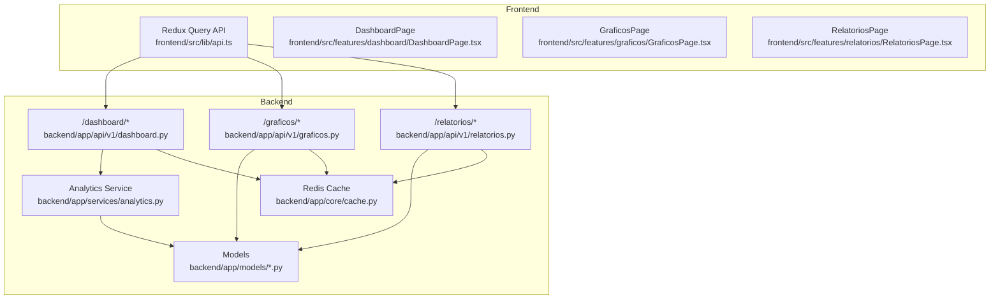
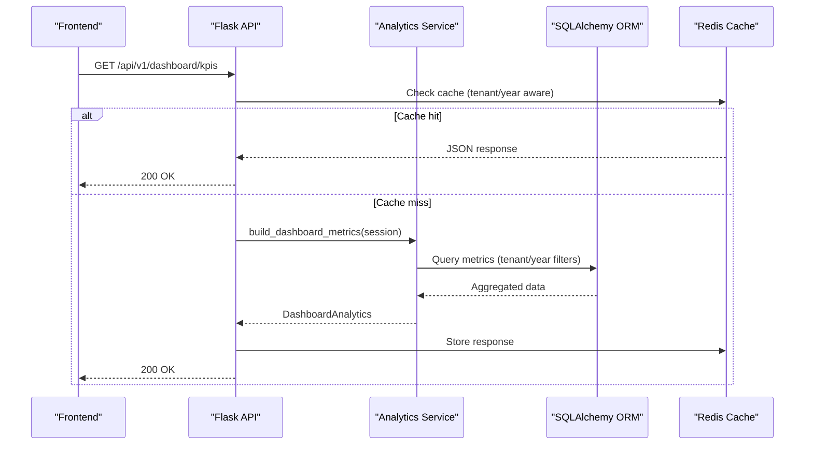
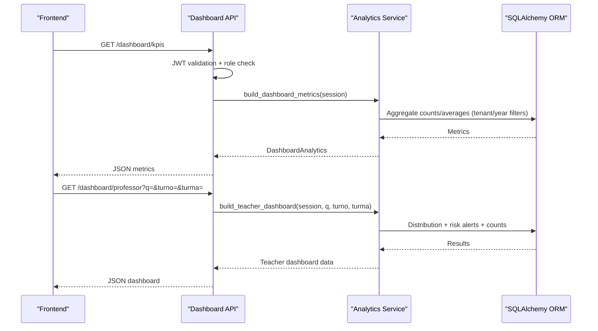
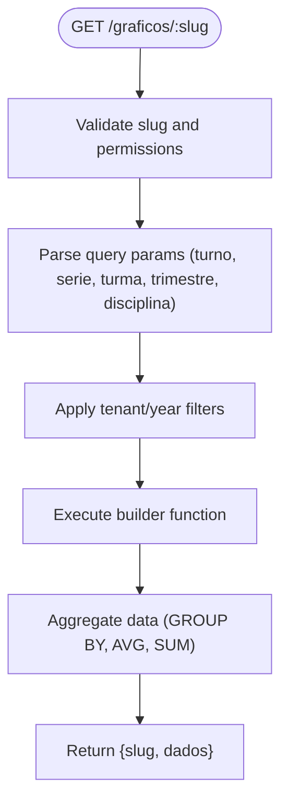
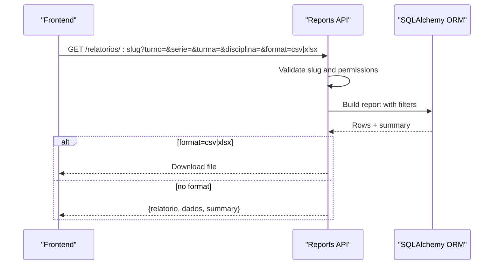
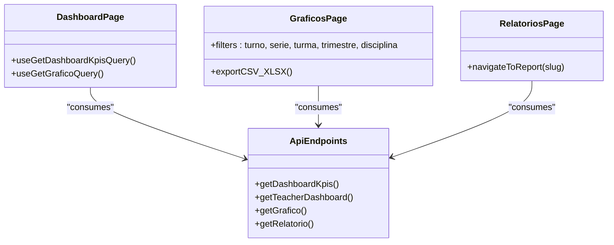
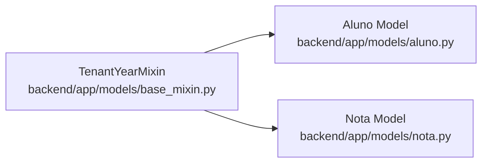

# Analytics & Dashboard API

<cite>
**Referenced Files in This Document**
- [backend/app/api/v1/dashboard.py](file://backend/app/api/v1/dashboard.py)
- [backend/app/api/v1/graficos.py](file://backend/app/api/v1/graficos.py)
- [backend/app/api/v1/relatorios.py](file://backend/app/api/v1/relatorios.py)
- [backend/app/services/analytics.py](file://backend/app/services/analytics.py)
- [backend/app/core/cache.py](file://backend/app/core/cache.py)
- [backend/app/core/config.py](file://backend/app/core/config.py)
- [backend/app/models/aluno.py](file://backend/app/models/aluno.py)
- [backend/app/models/nota.py](file://backend/app/models/nota.py)
- [backend/app/models/base_mixin.py](file://backend/app/models/base_mixin.py)
- [frontend/src/lib/api.ts](file://frontend/src/lib/api.ts)
- [frontend/src/features/dashboard/DashboardPage.tsx](file://frontend/src/features/dashboard/DashboardPage.tsx)
- [frontend/src/features/graficos/GraficosPage.tsx](file://frontend/src/features/graficos/GraficosPage.tsx)
- [frontend/src/features/graficos/config.ts](file://frontend/src/features/graficos/config.ts)
- [frontend/src/features/relatorios/RelatoriosPage.tsx](file://frontend/src/features/relatorios/RelatoriosPage.tsx)
- [frontend/src/features/relatorios/config.tsx](file://frontend/src/features/relatorios/config.tsx)
</cite>

## Table of Contents
1. [Introduction](#introduction)
2. [Project Structure](#project-structure)
3. [Core Components](#core-components)
4. [Architecture Overview](#architecture-overview)
5. [Detailed Component Analysis](#detailed-component-analysis)
6. [Dependency Analysis](#dependency-analysis)
7. [Performance Considerations](#performance-considerations)
8. [Troubleshooting Guide](#troubleshooting-guide)
9. [Conclusion](#conclusion)
10. [Appendices](#appendices)

## Introduction
This document describes the Analytics and Dashboard API, covering endpoints for KPI dashboards, dynamic chart rendering, performance metrics, and reporting interfaces. It explains chart configurations, filter parameters, data aggregation, dashboard customization, metric calculations, and data export capabilities. It also addresses data privacy, performance optimization for large datasets, and caching strategies for dashboard data.

## Project Structure
The analytics and dashboard system spans backend API endpoints, services, models, and frontend consumers:
- Backend API v1 exposes endpoints for dashboards, charts, and reports.
- Services encapsulate analytics computations and teacher-specific dashboards.
- Models define tenant and academic-year scoping for data isolation.
- Frontend integrates with Redux Query to consume analytics endpoints and render visualizations.

**Diagram sources**
- [backend/app/api/v1/dashboard.py:11-36](file://backend/app/api/v1/dashboard.py#L11-L36)
- [backend/app/api/v1/graficos.py:36-59](file://backend/app/api/v1/graficos.py#L36-L59)
- [backend/app/api/v1/relatorios.py:457-538](file://backend/app/api/v1/relatorios.py#L457-L538)
- [backend/app/services/analytics.py:35-84](file://backend/app/services/analytics.py#L35-L84)
- [backend/app/core/cache.py:10-56](file://backend/app/core/cache.py#L10-L56)
- [frontend/src/lib/api.ts:409-498](file://frontend/src/lib/api.ts#L409-L498)

**Section sources**
- [backend/app/api/v1/dashboard.py:11-36](file://backend/app/api/v1/dashboard.py#L11-L36)
- [backend/app/api/v1/graficos.py:36-59](file://backend/app/api/v1/graficos.py#L36-L59)
- [backend/app/api/v1/relatorios.py:457-538](file://backend/app/api/v1/relatorios.py#L457-L538)
- [frontend/src/lib/api.ts:409-498](file://frontend/src/lib/api.ts#L409-L498)

## Core Components
- Dashboard KPIs endpoint returns institution-wide metrics with caching.
- Teacher dashboard endpoint aggregates performance distributions and risk alerts.
- Dynamic chart builder supports multiple chart types with tenant-aware filters.
- Reporting engine produces predefined summaries and tabular data with export support.
- Tenant and academic-year scoping ensures data isolation across multi-tenant deployments.
- Frontend integrates with Redux Query to fetch and render analytics.

**Section sources**
- [backend/app/api/v1/dashboard.py:14-33](file://backend/app/api/v1/dashboard.py#L14-L33)
- [backend/app/services/analytics.py:86-196](file://backend/app/services/analytics.py#L86-L196)
- [backend/app/api/v1/graficos.py:386-396](file://backend/app/api/v1/graficos.py#L386-L396)
- [backend/app/api/v1/relatorios.py:442-454](file://backend/app/api/v1/relatorios.py#L442-L454)
- [backend/app/models/base_mixin.py:4-22](file://backend/app/models/base_mixin.py#L4-L22)
- [frontend/src/lib/api.ts:424-446](file://frontend/src/lib/api.ts#L424-L446)

## Architecture Overview
The analytics pipeline follows a layered architecture:
- API Layer: Flask blueprints expose endpoints for dashboards, charts, and reports.
- Service Layer: Analytics service computes KPIs and teacher dashboard data.
- Data Access: SQLAlchemy ORM queries models with tenant and academic-year filters.
- Caching: Redis caching decorates endpoints to reduce load.
- Frontend: Redux Query consumes endpoints and renders charts and tables.

**Diagram sources**
- [backend/app/api/v1/dashboard.py:16-22](file://backend/app/api/v1/dashboard.py#L16-L22)
- [backend/app/services/analytics.py:35-84](file://backend/app/services/analytics.py#L35-L84)
- [backend/app/core/cache.py:10-56](file://backend/app/core/cache.py#L10-L56)

## Detailed Component Analysis

### Dashboard Endpoints
- KPIs endpoint: Returns total students, active classes, overall average grade, and at-risk student count. Enforces role restrictions and caches responses by tenant and academic year.
- Teacher dashboard endpoint: Provides performance distribution buckets, risk alerts, class counts, and global averages filtered by optional query, shift, and class.

**Diagram sources**
- [backend/app/api/v1/dashboard.py:14-33](file://backend/app/api/v1/dashboard.py#L14-L33)
- [backend/app/services/analytics.py:35-84](file://backend/app/services/analytics.py#L35-L84)
- [backend/app/services/analytics.py:86-196](file://backend/app/services/analytics.py#L86-L196)

**Section sources**
- [backend/app/api/v1/dashboard.py:14-33](file://backend/app/api/v1/dashboard.py#L14-L33)
- [backend/app/services/analytics.py:10-33](file://backend/app/services/analytics.py#L10-L33)
- [backend/app/services/analytics.py:35-84](file://backend/app/services/analytics.py#L35-L84)
- [backend/app/services/analytics.py:86-196](file://backend/app/services/analytics.py#L86-L196)

### Dynamic Charts Builder
- Endpoint: GET /graficos/:slug with optional filters: turno, serie, turma, trimestre, disciplina.
- Supported chart slugs include discipline averages, class evolution, situation distribution, absences ranking, heatmap, trimester averages, Gaussian distribution, attendance-grade correlation, and shift comparison.
- Tenant and academic-year filters are applied consistently across queries.

**Diagram sources**
- [backend/app/api/v1/graficos.py:39-57](file://backend/app/api/v1/graficos.py#L39-L57)
- [backend/app/api/v1/graficos.py:75-93](file://backend/app/api/v1/graficos.py#L75-L93)
- [backend/app/api/v1/graficos.py:386-396](file://backend/app/api/v1/graficos.py#L386-L396)

**Section sources**
- [backend/app/api/v1/graficos.py:39-57](file://backend/app/api/v1/graficos.py#L39-L57)
- [backend/app/api/v1/graficos.py:75-93](file://backend/app/api/v1/graficos.py#L75-L93)
- [backend/app/api/v1/graficos.py:386-396](file://backend/app/api/v1/graficos.py#L386-L396)

### Reporting Engine
- Endpoint: GET /relatorios/:slug with filters: turno, serie, turma, disciplina.
- Supports predefined reports such as top classes, at-risk students, low-performing disciplines, best students, performance heatmap, attendance correlation, class radar, dropout risk radar, efficiency comparison, and top movers.
- Export to CSV/XLSX supported when requested.

**Diagram sources**
- [backend/app/api/v1/relatorios.py:460-535](file://backend/app/api/v1/relatorios.py#L460-L535)
- [backend/app/api/v1/relatorios.py:442-454](file://backend/app/api/v1/relatorios.py#L442-L454)

**Section sources**
- [backend/app/api/v1/relatorios.py:460-535](file://backend/app/api/v1/relatorios.py#L460-L535)
- [backend/app/api/v1/relatorios.py:442-454](file://backend/app/api/v1/relatorios.py#L442-L454)

### Frontend Integration
- Redux Query endpoints define typed requests for dashboards, charts, and reports.
- Dashboard page renders KPI cards and pie/bar visualizations.
- Charts page supports multiple chart types, filters, and export.
- Reports page lists predefined reports with filterable columns.

**Diagram sources**
- [frontend/src/lib/api.ts:424-446](file://frontend/src/lib/api.ts#L424-L446)
- [frontend/src/lib/api.ts:493-498](file://frontend/src/lib/api.ts#L493-L498)
- [frontend/src/lib/api.ts:487-492](file://frontend/src/lib/api.ts#L487-L492)
- [frontend/src/features/dashboard/DashboardPage.tsx:32-53](file://frontend/src/features/dashboard/DashboardPage.tsx#L32-L53)
- [frontend/src/features/graficos/GraficosPage.tsx:63-158](file://frontend/src/features/graficos/GraficosPage.tsx#L63-L158)
- [frontend/src/features/relatorios/RelatoriosPage.tsx:19-59](file://frontend/src/features/relatorios/RelatoriosPage.tsx#L19-L59)

**Section sources**
- [frontend/src/lib/api.ts:409-498](file://frontend/src/lib/api.ts#L409-L498)
- [frontend/src/features/dashboard/DashboardPage.tsx:32-53](file://frontend/src/features/dashboard/DashboardPage.tsx#L32-L53)
- [frontend/src/features/graficos/GraficosPage.tsx:63-158](file://frontend/src/features/graficos/GraficosPage.tsx#L63-L158)
- [frontend/src/features/relatorios/RelatoriosPage.tsx:19-59](file://frontend/src/features/relatorios/RelatoriosPage.tsx#L19-L59)

## Dependency Analysis
- Tenant and academic-year scoping: Models inherit a mixin that adds tenant_id and academic_year_id, ensuring queries are isolated per tenant and academic year.
- Filtering pipeline: Both chart builders and report builders apply tenant/year filters and optional filters (turno, serie, turma, disciplina).
- Caching: Redis caching is tenant-aware and caches successful responses for dashboard endpoints.

**Diagram sources**
- [backend/app/models/base_mixin.py:4-22](file://backend/app/models/base_mixin.py#L4-L22)
- [backend/app/models/aluno.py:8-35](file://backend/app/models/aluno.py#L8-L35)
- [backend/app/models/nota.py:9-24](file://backend/app/models/nota.py#L9-L24)

**Section sources**
- [backend/app/models/base_mixin.py:4-22](file://backend/app/models/base_mixin.py#L4-L22)
- [backend/app/models/aluno.py:8-35](file://backend/app/models/aluno.py#L8-L35)
- [backend/app/models/nota.py:9-24](file://backend/app/models/nota.py#L9-L24)

## Performance Considerations
- Caching: Use the cache_response decorator to cache dashboard endpoints by tenant and academic year. Configure Redis via environment variables.
- Query optimization: Prefer grouped aggregations and limit result sets (e.g., top N) for charts and reports.
- Pagination: For large datasets, paginate results and avoid exporting massive datasets unless necessary.
- Indexing: Ensure tenant_id and academic_year_id are indexed on relevant tables for fast filtering.
- Frontend throttling: Debounce filter changes and use minimal re-renders for charts.

[No sources needed since this section provides general guidance]

## Troubleshooting Guide
- Authentication errors: Ensure Authorization header with Bearer token is set and tenant/year headers are included when applicable.
- Role restrictions: Some endpoints restrict access to non-student roles; verify user roles.
- Cache failures: If Redis is unavailable, endpoints fall back to computing results without caching.
- Export errors: Verify data exists and is in the expected list-of-dictionaries format for CSV/XLSX exports.

**Section sources**
- [backend/app/api/v1/dashboard.py:18-19](file://backend/app/api/v1/dashboard.py#L18-L19)
- [backend/app/core/cache.py:18-36](file://backend/app/core/cache.py#L18-L36)
- [backend/app/api/v1/relatorios.py:482-504](file://backend/app/api/v1/relatorios.py#L482-L504)

## Conclusion
The Analytics and Dashboard API provides a robust foundation for visualizing educational data, enabling role-aware dashboards, customizable charts, and exportable reports. Tenant and academic-year scoping ensure data isolation, while caching and optimized queries support scalability. The frontend integrates seamlessly to deliver interactive visualizations and actionable insights.

[No sources needed since this section summarizes without analyzing specific files]

## Appendices

### API Definitions

- Dashboard KPIs
  - Method: GET
  - Path: /api/v1/dashboard/kpis
  - Auth: Required
  - Role restriction: Students denied
  - Cache: Yes (tenant/year aware)
  - Response: KPIs object

- Teacher Dashboard
  - Method: GET
  - Path: /api/v1/dashboard/professor
  - Auth: Required
  - Query params: q, turno, turma
  - Response: Dashboard data including distribution, alerts, counts, and averages

- Dynamic Charts
  - Method: GET
  - Path: /api/v1/graficos/:slug
  - Auth: Required
  - Query params: turno, serie, turma, trimestre, disciplina
  - Slugs: See supported chart slugs
  - Response: { slug, dados }

- Reports
  - Method: GET
  - Path: /api/v1/relatorios/:slug
  - Auth: Required
  - Query params: turno, serie, turma, disciplina, format (optional: csv|xlsx)
  - Slugs: See supported report slugs
  - Response: { relatorio, dados, summary } or file download

**Section sources**
- [backend/app/api/v1/dashboard.py:14-33](file://backend/app/api/v1/dashboard.py#L14-L33)
- [backend/app/api/v1/graficos.py:39-57](file://backend/app/api/v1/graficos.py#L39-L57)
- [backend/app/api/v1/relatorios.py:460-535](file://backend/app/api/v1/relatorios.py#L460-L535)

### Chart Configurations and Filters
- Chart types and supported filters:
  - Disciplinas-Médias: bar, supports turno, turma, trimestre
  - Médias-por-Trimestre: bar, supports turno, serie, turma, disciplina
  - Turmas-trimestre: line, supports turno, turma
  - Situação-Distribuição: pie, supports turno, turma
  - Faltas-por-Turma: bar, supports turno
  - Heatmap-Disciplinas: heatmap, supports turno, turma, trimestre
  - Gauss-Escola: area, supports turno, serie, disciplina
  - Correlação-Frequência: scatter, supports turno, serie
  - Evolução-Turnos: line, supports disciplina

**Section sources**
- [frontend/src/features/graficos/config.ts:28-116](file://frontend/src/features/graficos/config.ts#L28-L116)

### Report Configurations and Filters
- Report slugs and filters:
  - Turmas-Mais-Faltas: table, filters: turno, serie, disciplina
  - Alunos-em-Risco: table, filters: turno, serie, turma, disciplina
  - Disciplinas-Notas-Baixas: table, filters: turno, serie, turma
  - Melhores-Médias: table, filters: turno, serie, disciplina
  - Melhores-Alunos: table, filters: turno, serie, turma, disciplina
  - Performance-Heatmap: heatmap, filters: turno, serie, turma, disciplina
  - Attendance-Correlation: scatter, filters: turno, serie, turma, disciplina
  - Class-Radar: radar, filters: turno, serie, disciplina
  - Radar-Abandono: table, filters: turno, serie, turma, disciplina
  - Comparativo-Eficiencia: bar, filters: turno, serie, disciplina
  - Top-Movers: table, filters: turno, serie, turma, disciplina

**Section sources**
- [frontend/src/features/relatorios/config.tsx:67-271](file://frontend/src/features/relatorios/config.tsx#L67-L271)

### Data Privacy and Security
- Role-based access: Student role is restricted from dashboard endpoints.
- Tenant and academic-year scoping: All queries include tenant_id and academic_year_id filters.
- Headers: Frontend sends X-Tenant-ID and x-academic-year-id when available.

**Section sources**
- [backend/app/api/v1/dashboard.py:18-19](file://backend/app/api/v1/dashboard.py#L18-L19)
- [backend/app/api/v1/graficos.py:75-93](file://backend/app/api/v1/graficos.py#L75-L93)
- [backend/app/api/v1/relatorios.py:11-37](file://backend/app/api/v1/relatorios.py#L11-L37)
- [frontend/src/lib/api.ts:336-357](file://frontend/src/lib/api.ts#L336-L357)

### Caching Strategies
- Cache decorator: cache_response with configurable timeout and tenant/year-aware key prefix.
- Cache invalidation: Tenant-scoped invalidation utility available.
- Environment: Redis configured via settings.

**Section sources**
- [backend/app/core/cache.py:10-56](file://backend/app/core/cache.py#L10-L56)
- [backend/app/core/cache.py:58-65](file://backend/app/core/cache.py#L58-L65)
- [backend/app/core/config.py:9-18](file://backend/app/core/config.py#L9-L18)