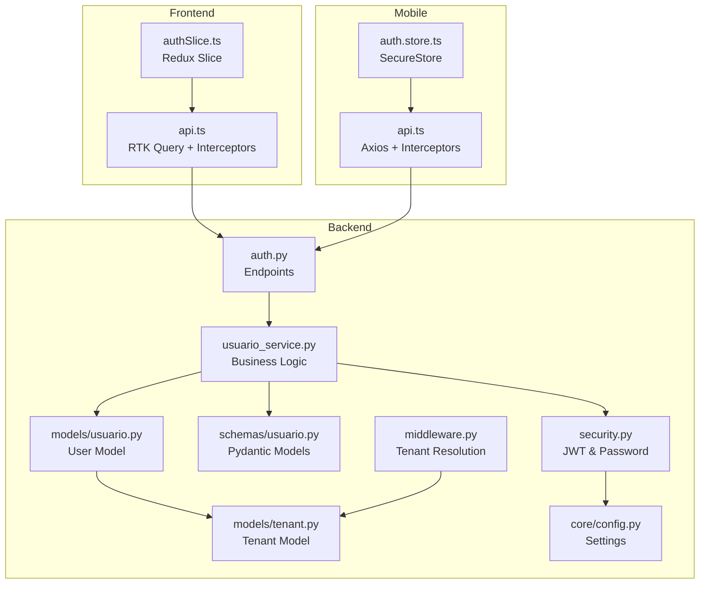
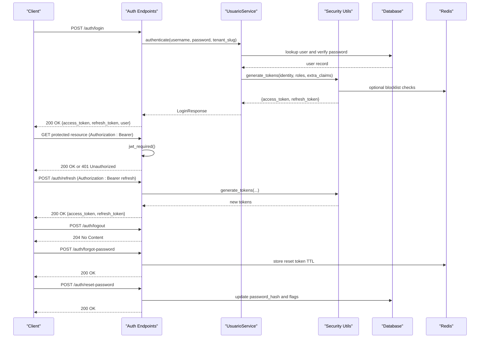
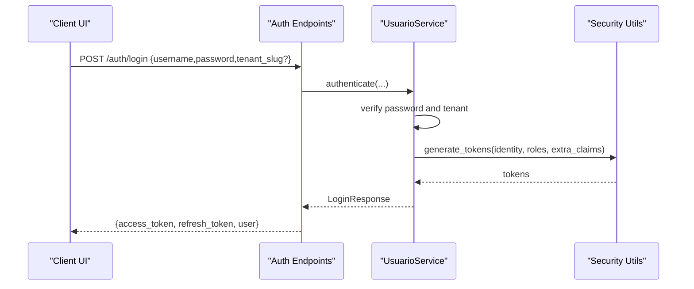
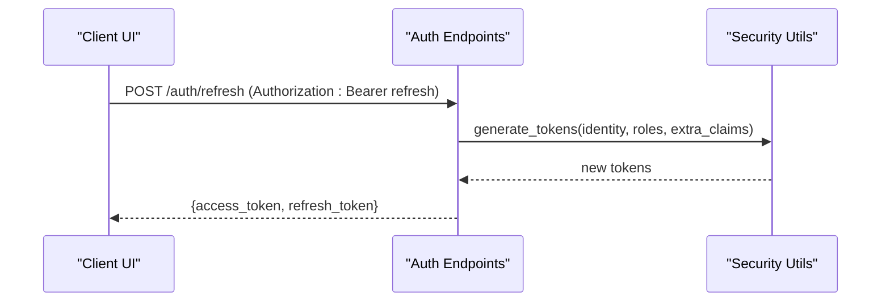
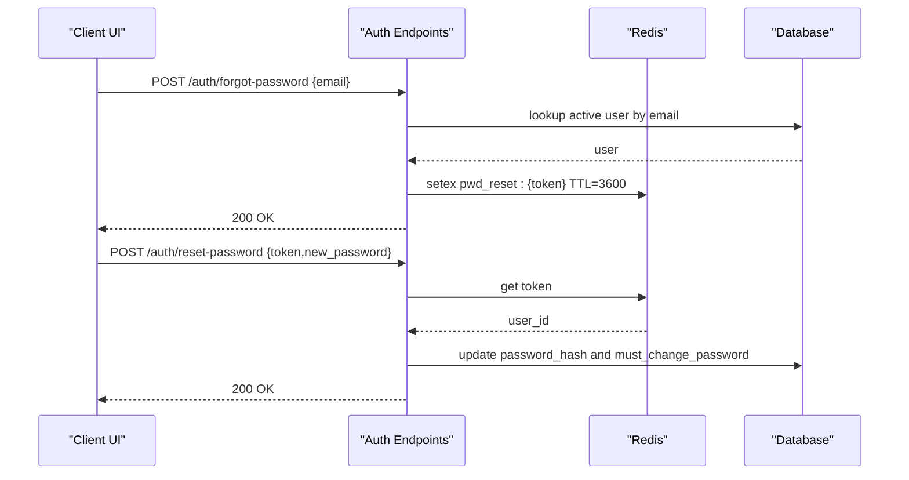
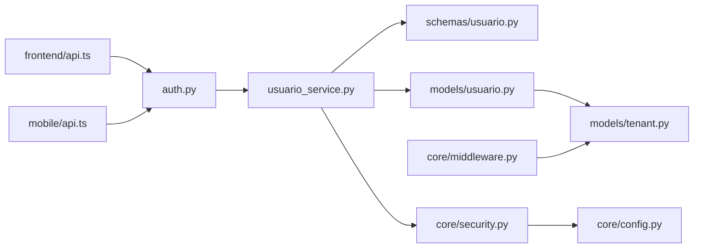

# Authentication API

<cite>
**Referenced Files in This Document**
- [backend/app/api/v1/auth.py](file://backend/app/api/v1/auth.py)
- [backend/app/core/security.py](file://backend/app/core/security.py)
- [backend/app/services/usuario_service.py](file://backend/app/services/usuario_service.py)
- [backend/app/schemas/usuario.py](file://backend/app/schemas/usuario.py)
- [backend/app/models/usuario.py](file://backend/app/models/usuario.py)
- [backend/app/models/tenant.py](file://backend/app/models/tenant.py)
- [backend/app/core/middleware.py](file://backend/app/core/middleware.py)
- [backend/app/core/config.py](file://backend/app/core/config.py)
- [frontend/src/lib/api.ts](file://frontend/src/lib/api.ts)
- [frontend/src/features/auth/authSlice.ts](file://frontend/src/features/auth/authSlice.ts)
- [mobile/lib/api.ts](file://mobile/lib/api.ts)
- [mobile/lib/auth.store.ts](file://mobile/lib/auth.store.ts)
- [backend/tests/test_auth.py](file://backend/tests/test_auth.py)
</cite>

## Table of Contents
1. [Introduction](#introduction)
2. [Project Structure](#project-structure)
3. [Core Components](#core-components)
4. [Architecture Overview](#architecture-overview)
5. [Detailed Component Analysis](#detailed-component-analysis)
6. [Dependency Analysis](#dependency-analysis)
7. [Performance Considerations](#performance-considerations)
8. [Troubleshooting Guide](#troubleshooting-guide)
9. [Conclusion](#conclusion)
10. [Appendices](#appendices)

## Introduction
This document provides comprehensive API documentation for the authentication system. It covers login, logout, password reset, and token refresh mechanisms, along with request/response schemas, JWT token structure, refresh token handling, role-based access control, tenant isolation, security headers, and practical authentication flows. It also addresses token expiration, refresh token rotation, and security best practices for API authentication.

## Project Structure
The authentication system spans backend endpoints, security utilities, services, schemas, and models, and integrates with frontend and mobile clients.

**Diagram sources**
- [backend/app/api/v1/auth.py:1-166](file://backend/app/api/v1/auth.py#L1-L166)
- [backend/app/core/security.py:1-62](file://backend/app/core/security.py#L1-L62)
- [backend/app/services/usuario_service.py:1-114](file://backend/app/services/usuario_service.py#L1-L114)
- [backend/app/schemas/usuario.py:1-77](file://backend/app/schemas/usuario.py#L1-L77)
- [backend/app/models/usuario.py:1-30](file://backend/app/models/usuario.py#L1-L30)
- [backend/app/models/tenant.py:1-22](file://backend/app/models/tenant.py#L1-L22)
- [backend/app/core/middleware.py:1-125](file://backend/app/core/middleware.py#L1-L125)
- [backend/app/core/config.py:1-60](file://backend/app/core/config.py#L1-L60)
- [frontend/src/lib/api.ts:1-790](file://frontend/src/lib/api.ts#L1-L790)
- [frontend/src/features/auth/authSlice.ts:1-50](file://frontend/src/features/auth/authSlice.ts#L1-L50)
- [mobile/lib/api.ts:1-108](file://mobile/lib/api.ts#L1-L108)
- [mobile/lib/auth.store.ts:1-65](file://mobile/lib/auth.store.ts#L1-L65)

**Section sources**
- [backend/app/api/v1/auth.py:1-166](file://backend/app/api/v1/auth.py#L1-L166)
- [backend/app/core/security.py:1-62](file://backend/app/core/security.py#L1-L62)
- [backend/app/services/usuario_service.py:1-114](file://backend/app/services/usuario_service.py#L1-L114)
- [backend/app/schemas/usuario.py:1-77](file://backend/app/schemas/usuario.py#L1-L77)
- [backend/app/models/usuario.py:1-30](file://backend/app/models/usuario.py#L1-L30)
- [backend/app/models/tenant.py:1-22](file://backend/app/models/tenant.py#L1-L22)
- [backend/app/core/middleware.py:1-125](file://backend/app/core/middleware.py#L1-L125)
- [backend/app/core/config.py:1-60](file://backend/app/core/config.py#L1-L60)
- [frontend/src/lib/api.ts:1-790](file://frontend/src/lib/api.ts#L1-L790)
- [frontend/src/features/auth/authSlice.ts:1-50](file://frontend/src/features/auth/authSlice.ts#L1-L50)
- [mobile/lib/api.ts:1-108](file://mobile/lib/api.ts#L1-L108)
- [mobile/lib/auth.store.ts:1-65](file://mobile/lib/auth.store.ts#L1-L65)

## Core Components
- Authentication endpoints: login, refresh, logout, change-password, forgot-password, reset-password, and tenant discovery.
- Token generation and validation: access and refresh tokens with role and tenant claims.
- User and tenant models with tenant isolation.
- Frontend and mobile clients handle bearer tokens, retry on 401, and persist credentials securely.

**Section sources**
- [backend/app/api/v1/auth.py:27-166](file://backend/app/api/v1/auth.py#L27-L166)
- [backend/app/core/security.py:23-35](file://backend/app/core/security.py#L23-L35)
- [backend/app/models/usuario.py:8-30](file://backend/app/models/usuario.py#L8-L30)
- [backend/app/models/tenant.py:7-22](file://backend/app/models/tenant.py#L7-L22)
- [frontend/src/lib/api.ts:336-407](file://frontend/src/lib/api.ts#L336-L407)
- [mobile/lib/api.ts:19-60](file://mobile/lib/api.ts#L19-L60)

## Architecture Overview
The authentication flow integrates endpoints, services, and middleware to enforce tenant isolation and RBAC. Clients send bearer tokens and optional headers for tenant/year context.

**Diagram sources**
- [backend/app/api/v1/auth.py:27-166](file://backend/app/api/v1/auth.py#L27-L166)
- [backend/app/services/usuario_service.py:15-45](file://backend/app/services/usuario_service.py#L15-L45)
- [backend/app/core/security.py:23-35](file://backend/app/core/security.py#L23-L35)
- [backend/app/core/security.py:38-61](file://backend/app/core/security.py#L38-L61)

## Detailed Component Analysis

### Endpoints and Schemas
- Login
  - Method: POST
  - Path: /api/v1/auth/login
  - Request: LoginRequest (username, password, tenant_slug)
  - Response: LoginResponse (access_token, refresh_token, user)
  - Rate limit: 10 per minute
  - Behavior: Validates credentials, optionally enforces tenant membership (except super_admin), generates tokens with roles and tenant claims, returns user profile.

- Refresh
  - Method: POST
  - Path: /api/v1/auth/refresh
  - Requires: refresh=True JWT
  - Claims preserved: roles, aluno_id, tenant_id, academic_year_id
  - Response: {access_token, refresh_token}

- Logout
  - Method: POST
  - Path: /api/v1/auth/logout
  - Requires: access JWT
  - Response: 204 No Content

- Change Password
  - Method: POST
  - Path: /api/v1/auth/change-password
  - Requires: access JWT
  - Request: ChangePasswordRequest (current_password, new_password)
  - Response: 204 No Content

- Forgot Password
  - Method: POST
  - Path: /api/v1/auth/forgot-password
  - Rate limit: 5 per hour
  - Behavior: Sends password reset email with a short-lived token link; always returns 200 to avoid leaking email existence.

- Reset Password
  - Method: POST
  - Path: /api/v1/auth/reset-password
  - Rate limit: 10 per hour
  - Request: {token, new_password}
  - Validation: minimum length, uppercase, digit
  - Behavior: Verifies token TTL, updates password_hash and clears must_change_password flag.

- List Public Tenants
  - Method: GET
  - Path: /api/v1/auth/tenants
  - Response: [{id, name, slug}]

**Section sources**
- [backend/app/api/v1/auth.py:27-166](file://backend/app/api/v1/auth.py#L27-L166)
- [backend/app/schemas/usuario.py:59-77](file://backend/app/schemas/usuario.py#L59-L77)

### JWT Token Structure
- Access token claims:
  - identity: user ID
  - additional_claims: roles (array), aluno_id, tenant_id, academic_year_id
  - expires_in: 30 minutes
- Refresh token claims:
  - identity: user ID
  - additional_claims: roles, aluno_id, tenant_id, academic_year_id
  - no fixed expiry; rotated on refresh
- Token blocklist:
  - JTI stored in Redis with TTL matching access token expiry
  - Closed-check behavior during Redis outages

**Section sources**
- [backend/app/core/security.py:23-35](file://backend/app/core/security.py#L23-L35)
- [backend/app/core/security.py:38-61](file://backend/app/core/security.py#L38-L61)

### Role-Based Access Control and Tenant Isolation
- Roles:
  - Stored in user record and included in JWT claims
  - Used to authorize access to resources
- Tenant isolation:
  - Users belong to a tenant via foreign key
  - Login validates tenant membership unless user has super_admin role
  - Middleware resolves tenant context from JWT claims, headers, or host; supports X-Tenant-ID for super_admin context switching
  - Academic year resolution follows similar precedence: JWT claim → header → default current year

**Section sources**
- [backend/app/models/usuario.py:15-25](file://backend/app/models/usuario.py#L15-L25)
- [backend/app/services/usuario_service.py:20-28](file://backend/app/services/usuario_service.py#L20-L28)
- [backend/app/core/middleware.py:23-109](file://backend/app/core/middleware.py#L23-L109)

### Security Headers
- Authorization: Bearer <access_token> (added by clients)
- X-Academic-Year-ID: numeric ID for academic year context
- X-Tenant-ID: numeric ID for tenant context (super_admin only)
- Frontend sets headers from Redux state; mobile sets headers from SecureStore

**Section sources**
- [frontend/src/lib/api.ts:336-357](file://frontend/src/lib/api.ts#L336-L357)
- [mobile/lib/api.ts:19-29](file://mobile/lib/api.ts#L19-L29)
- [backend/app/core/middleware.py:34-46](file://backend/app/core/middleware.py#L34-L46)

### Practical Authentication Flows

#### Login Flow

**Diagram sources**
- [backend/app/api/v1/auth.py:27-42](file://backend/app/api/v1/auth.py#L27-L42)
- [backend/app/services/usuario_service.py:15-45](file://backend/app/services/usuario_service.py#L15-L45)
- [backend/app/core/security.py:23-35](file://backend/app/core/security.py#L23-L35)

#### Token Refresh Flow

**Diagram sources**
- [backend/app/api/v1/auth.py:44-56](file://backend/app/api/v1/auth.py#L44-L56)
- [backend/app/core/security.py:23-35](file://backend/app/core/security.py#L23-L35)

#### Password Reset Flow

**Diagram sources**
- [backend/app/api/v1/auth.py:80-163](file://backend/app/api/v1/auth.py#L80-L163)

#### Session Management Patterns
- Frontend:
  - Stores {access_token, refresh_token, user} in Redux slice
  - Adds Authorization header automatically
  - On 401, attempts refresh with stored refresh token; on success, retries original request
- Mobile:
  - Stores tokens in SecureStore
  - Adds Authorization header automatically
  - On 401, attempts refresh; on failure, clears tokens and rejects

**Section sources**
- [frontend/src/features/auth/authSlice.ts:29-44](file://frontend/src/features/auth/authSlice.ts#L29-L44)
- [frontend/src/lib/api.ts:363-407](file://frontend/src/lib/api.ts#L363-L407)
- [mobile/lib/api.ts:19-60](file://mobile/lib/api.ts#L19-L60)
- [mobile/lib/auth.store.ts:33-43](file://mobile/lib/auth.store.ts#L33-L43)

### Error Responses and Validation
- Login:
  - 401 Unauthorized for invalid credentials or tenant mismatch
- Change Password:
  - 404 Not Found for missing user
  - 400 Bad Request for invalid current password
- Forgot Password:
  - Always returns 200 to avoid enumerating emails
- Reset Password:
  - 400 Bad Request for missing token/new_password or weak password
  - 400 Bad Request for invalid/expired token
  - 404 Not Found for missing user
- Tests confirm:
  - Successful login returns 200 with tokens and user
  - Failed login returns 401

**Section sources**
- [backend/app/services/usuario_service.py:17-18](file://backend/app/services/usuario_service.py#L17-L18)
- [backend/app/services/usuario_service.py:47-58](file://backend/app/services/usuario_service.py#L47-L58)
- [backend/app/api/v1/auth.py:134-157](file://backend/app/api/v1/auth.py#L134-L157)
- [backend/tests/test_auth.py:3-18](file://backend/tests/test_auth.py#L3-L18)

## Dependency Analysis

**Diagram sources**
- [backend/app/api/v1/auth.py:1-166](file://backend/app/api/v1/auth.py#L1-L166)
- [backend/app/services/usuario_service.py:1-114](file://backend/app/services/usuario_service.py#L1-L114)
- [backend/app/schemas/usuario.py:1-77](file://backend/app/schemas/usuario.py#L1-L77)
- [backend/app/models/usuario.py:1-30](file://backend/app/models/usuario.py#L1-L30)
- [backend/app/models/tenant.py:1-22](file://backend/app/models/tenant.py#L1-L22)
- [backend/app/core/security.py:1-62](file://backend/app/core/security.py#L1-L62)
- [backend/app/core/config.py:1-60](file://backend/app/core/config.py#L1-L60)
- [backend/app/core/middleware.py:1-125](file://backend/app/core/middleware.py#L1-L125)
- [frontend/src/lib/api.ts:1-790](file://frontend/src/lib/api.ts#L1-L790)
- [mobile/lib/api.ts:1-108](file://mobile/lib/api.ts#L1-L108)

**Section sources**
- [backend/app/api/v1/auth.py:1-166](file://backend/app/api/v1/auth.py#L1-L166)
- [backend/app/services/usuario_service.py:1-114](file://backend/app/services/usuario_service.py#L1-L114)
- [backend/app/core/security.py:1-62](file://backend/app/core/security.py#L1-L62)
- [backend/app/core/middleware.py:1-125](file://backend/app/core/middleware.py#L1-L125)
- [frontend/src/lib/api.ts:1-790](file://frontend/src/lib/api.ts#L1-L790)
- [mobile/lib/api.ts:1-108](file://mobile/lib/api.ts#L1-L108)

## Performance Considerations
- Token TTL: Access tokens expire in 30 minutes; refresh tokens rotate on each refresh.
- Rate limiting: Login (10/min), change-password (5/hr), forgot-password (5/hr), reset-password (10/hr).
- Redis blocklist: Efficient revocation checks with TTL; closed-fail behavior during outages.
- Client retries: Automatic refresh on 401 reduces user friction and server load.

[No sources needed since this section provides general guidance]

## Troubleshooting Guide
- 401 Unauthorized on protected endpoints:
  - Verify Authorization header with Bearer token
  - Ensure token is not expired or revoked
  - Confirm tenant context matches user’s tenant
- 400 Bad Request on reset-password:
  - Ensure token exists and is not expired
  - Verify new password meets strength requirements
- 403 Forbidden on tenant-resolved routes:
  - Confirm tenant is active
  - Check X-Tenant-ID header permissions (super_admin only)
- Frontend 401:
  - Confirm refresh flow executed and tokens updated
- Mobile 401:
  - Confirm refresh performed and SecureStore updated

**Section sources**
- [backend/app/core/security.py:44-61](file://backend/app/core/security.py#L44-L61)
- [backend/app/core/middleware.py:68-72](file://backend/app/core/middleware.py#L68-L72)
- [frontend/src/lib/api.ts:363-407](file://frontend/src/lib/api.ts#L363-L407)
- [mobile/lib/api.ts:31-60](file://mobile/lib/api.ts#L31-L60)

## Conclusion
The authentication system provides robust login, refresh, logout, and password reset flows with strong tenant isolation and RBAC. Tokens are short-lived with efficient refresh and revocation mechanisms. Clients integrate seamlessly with bearer tokens and automatic retry logic, while backend middleware ensures consistent tenant and academic year context.

[No sources needed since this section summarizes without analyzing specific files]

## Appendices

### Request/Response Schemas

- LoginRequest
  - Fields: username (string), password (string), tenant_slug (string, optional)
- LoginResponse
  - Fields: access_token (string), refresh_token (string), user (object)
- ChangePasswordRequest
  - Fields: current_password (string), new_password (string, min length 8, uppercase, digit)
- ResetPasswordRequest
  - Fields: token (string), new_password (string)
- User Profile (partial)
  - Fields: id (number), username (string), role (string), is_admin (boolean), aluno_id (number|null), photo_url (string|null), must_change_password (boolean), tenant_id (number|null), tenant_name (string|null), aluno (object|null)

**Section sources**
- [backend/app/schemas/usuario.py:59-77](file://backend/app/schemas/usuario.py#L59-L77)
- [backend/app/models/usuario.py:14-25](file://backend/app/models/usuario.py#L14-L25)

### Token Expiration and Rotation
- Access token: expires in 30 minutes; included in JWT payload
- Refresh token: no fixed expiry; rotated on each refresh
- Revocation: JTI stored in Redis with TTL equal to access token lifetime; closed-fail behavior during Redis outages

**Section sources**
- [backend/app/core/security.py:32-35](file://backend/app/core/security.py#L32-L35)
- [backend/app/core/security.py:38-61](file://backend/app/core/security.py#L38-L61)

### Security Best Practices
- Enforce HTTPS in production
- Use long, random secrets for SECRET_KEY and JWT_SECRET_KEY
- Store tokens securely (SecureStore on mobile, httpOnly cookies recommended for web)
- Limit rate of auth operations
- Validate and sanitize all inputs
- Use tenant-aware queries and middleware
- Rotate refresh tokens periodically in future enhancements

**Section sources**
- [backend/app/core/config.py:44-51](file://backend/app/core/config.py#L44-L51)