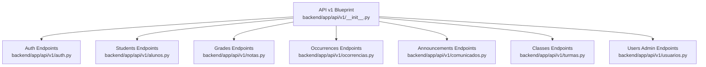
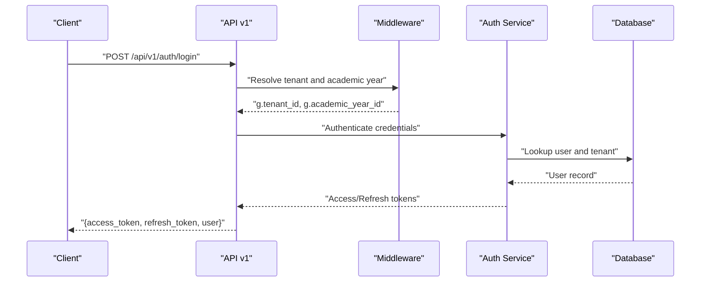
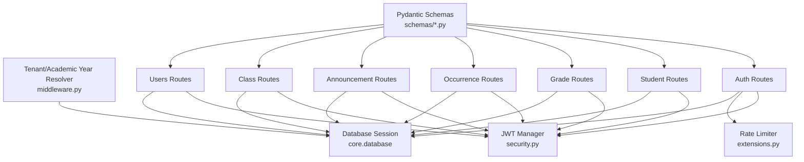

# Backend API Reference

<cite>
**Referenced Files in This Document**
- [backend/app/api/v1/__init__.py](file://backend/app/api/v1/__init__.py)
- [backend/app/api/v1/auth.py](file://backend/app/api/v1/auth.py)
- [backend/app/api/v1/alunos.py](file://backend/app/api/v1/alunos.py)
- [backend/app/api/v1/notas.py](file://backend/app/api/v1/notas.py)
- [backend/app/api/v1/ocorrencias.py](file://backend/app/api/v1/ocorrencias.py)
- [backend/app/api/v1/comunicados.py](file://backend/app/api/v1/comunicados.py)
- [backend/app/api/v1/turmas.py](file://backend/app/api/v1/turmas.py)
- [backend/app/api/v1/usuarios.py](file://backend/app/api/v1/usuarios.py)
- [backend/app/core/middleware.py](file://backend/app/core/middleware.py)
- [backend/app/core/security.py](file://backend/app/core/security.py)
- [backend/app/core/decorators.py](file://backend/app/core/decorators.py)
- [backend/app/core/extensions.py](file://backend/app/core/extensions.py)
- [backend/app/core/config.py](file://backend/app/core/config.py)
- [backend/app/schemas/usuario.py](file://backend/app/schemas/usuario.py)
- [backend/app/schemas/aluno.py](file://backend/app/schemas/aluno.py)
- [backend/app/schemas/ocorrencia.py](file://backend/app/schemas/ocorrencia.py)
- [backend/app/models/aluno.py](file://backend/app/models/aluno.py)
- [backend/app/models/nota.py](file://backend/app/models/nota.py)
</cite>

## Table of Contents
1. [Introduction](#introduction)
2. [Project Structure](#project-structure)
3. [Core Components](#core-components)
4. [Architecture Overview](#architecture-overview)
5. [Detailed Component Analysis](#detailed-component-analysis)
6. [Dependency Analysis](#dependency-analysis)
7. [Performance Considerations](#performance-considerations)
8. [Troubleshooting Guide](#troubleshooting-guide)
9. [Conclusion](#conclusion)
10. [Appendices](#appendices)

## Introduction
This document describes the ColaboraEdu REST API, focusing on public interfaces exposed under the v1 API version. It covers authentication, student management, grade tracking, occurrence reporting, communication portal, and administrative functions. It also documents error handling, rate limiting, security considerations, API versioning, backwards compatibility, and integration patterns with frontend clients.

## Project Structure
The API is organized as a Flask Blueprint-based application with a versioned v1 namespace. Each functional domain is implemented as a separate module under the v1 blueprint, which registers routes and applies shared middleware and authentication.

**Diagram sources**
- [backend/app/api/v1/__init__.py:1-39](file://backend/app/api/v1/__init__.py#L1-L39)
- [backend/app/api/v1/auth.py:15-166](file://backend/app/api/v1/auth.py#L15-L166)
- [backend/app/api/v1/alunos.py:12-148](file://backend/app/api/v1/alunos.py#L12-L148)
- [backend/app/api/v1/notas.py:34-190](file://backend/app/api/v1/notas.py#L34-L190)
- [backend/app/api/v1/ocorrencias.py:9-109](file://backend/app/api/v1/ocorrencias.py#L9-L109)
- [backend/app/api/v1/comunicados.py:8-175](file://backend/app/api/v1/comunicados.py#L8-L175)
- [backend/app/api/v1/turmas.py:11-42](file://backend/app/api/v1/turmas.py#L11-L42)
- [backend/app/api/v1/usuarios.py:47-304](file://backend/app/api/v1/usuarios.py#L47-L304)

**Section sources**
- [backend/app/api/v1/__init__.py:1-39](file://backend/app/api/v1/__init__.py#L1-L39)

## Core Components
- Authentication and Authorization
  - JWT-based access/refresh tokens with role-based access control.
  - Token blocklist persisted in Redis for logout and revocation.
  - Rate limiting applied to sensitive endpoints.
- Multitenancy and Academic Year Resolution
  - Tenant and academic year resolved from JWT claims, headers, or host.
  - Super admin can override tenant context via header.
- Request Validation
  - Pydantic schemas enforce request/response shapes and constraints.
- Pagination and Filtering
  - Consistent pagination with page/per_page and filtering across endpoints.

**Section sources**
- [backend/app/core/security.py:11-62](file://backend/app/core/security.py#L11-L62)
- [backend/app/core/middleware.py:6-125](file://backend/app/core/middleware.py#L6-L125)
- [backend/app/core/decorators.py:5-30](file://backend/app/core/decorators.py#L5-L30)
- [backend/app/core/extensions.py:1-8](file://backend/app/core/extensions.py#L1-L8)

## Architecture Overview
The API enforces tenant and academic-year context globally for protected routes. Authentication is mandatory for most endpoints, with explicit public endpoints for tenant discovery and login.

**Diagram sources**
- [backend/app/api/v1/__init__.py:8-21](file://backend/app/api/v1/__init__.py#L8-L21)
- [backend/app/api/v1/auth.py:27-42](file://backend/app/api/v1/auth.py#L27-L42)
- [backend/app/core/middleware.py:6-109](file://backend/app/core/middleware.py#L6-L109)

## Detailed Component Analysis

### Authentication Endpoints
- Public endpoints
  - GET /api/v1/auth/tenants
    - Description: List active tenants for tenant selection.
    - Authentication: Not required.
    - Response: Array of tenant objects with id, name, slug.
- Protected endpoints
  - POST /api/v1/auth/login
    - Description: Authenticate user and issue tokens.
    - Authentication: Not required.
    - Rate limit: 10 per minute.
    - Request: { username, password, tenant_slug? }
    - Response: { access_token, refresh_token, user }
  - POST /api/v1/auth/refresh
    - Description: Refresh access token using refresh token.
    - Authentication: JWT required (refresh).
    - Response: { access_token, refresh_token } with preserved claims.
  - POST /api/v1/auth/logout
    - Description: Logout; token is invalidated server-side.
    - Authentication: JWT required.
    - Response: 204 No Content.
  - POST /api/v1/auth/change-password
    - Description: Change current password.
    - Authentication: JWT required.
    - Rate limit: 5 per hour.
    - Request: { current_password, new_password }
    - Response: 204 No Content.
  - POST /api/v1/auth/forgot-password
    - Description: Send password reset link if account exists.
    - Authentication: Not required.
    - Rate limit: 5 per hour.
    - Request: { email }
    - Response: { message } (always 200).
  - POST /api/v1/auth/reset-password
    - Description: Reset password using token.
    - Authentication: Not required.
    - Rate limit: 10 per hour.
    - Request: { token, new_password }
    - Response: { message } or error.

Common request/response examples
- Successful login
  - Request: { "username": "...", "password": "...", "tenant_slug": "..." }
  - Response: { "access_token": "...", "refresh_token": "...", "user": { "id", "username", "role", "tenant_id", "aluno_id"?, ... } }
- Change password
  - Request: { "current_password": "...", "new_password": "..." }
  - Response: 204 No Content
- Reset password
  - Request: { "token": "...", "new_password": "..." }
  - Response: { "message": "..." }

Security and rate limiting
- Tokens are signed with a strong secret and short-lived access tokens.
- Token blocklist stored in Redis; checked on each protected request.
- Default rate limit 60 per minute; specific endpoints apply stricter limits.

**Section sources**
- [backend/app/api/v1/auth.py:18-166](file://backend/app/api/v1/auth.py#L18-L166)
- [backend/app/core/security.py:23-62](file://backend/app/core/security.py#L23-L62)
- [backend/app/core/extensions.py:4-7](file://backend/app/core/extensions.py#L4-L7)

### Student Management Endpoints
- GET /api/v1/alunos
  - Description: List students with pagination and optional filters.
  - Authentication: JWT required.
  - Roles: admin, super_admin, coordenador, diretor, orientador, professor.
  - Query params: page, per_page, turno, turma, q (text search).
  - Response: { items: [AlunoListSchema], meta: { page, per_page, total, pages } }
- GET /api/v1/alunos/{aluno_id}
  - Description: Retrieve student details.
  - Authentication: JWT required.
  - Authorization: Students can only access their own profile.
  - Response: AlunoDetailSchema or error.
- POST /api/v1/alunos
  - Description: Create a new student.
  - Authentication: JWT required.
  - Roles: admin, super_admin, coordenador, diretor, orientador.
  - Request: AlunoCreate
  - Response: AlunoDetailSchema (201).
- PATCH /api/v1/alunos/{aluno_id}
  - Description: Update student details.
  - Authentication: JWT required.
  - Roles: admin, super_admin, coordenador, diretor, orientador.
  - Request: AlunoUpdate
  - Response: AlunoDetailSchema or error.
- DELETE /api/v1/alunos/{aluno_id}
  - Description: Delete a student.
  - Authentication: JWT required.
  - Roles: admin, super_admin, coordenador, diretor.
  - Response: 204 No Content or error.
- GET /api/v1/alunos/{aluno_id}/boletim/pdf
  - Description: Download a PDF report for a student.
  - Authentication: JWT required.
  - Response: PDF stream or error.

Request/response schemas
- AlunoCreate: minimal required fields for creation.
- AlunoUpdate: partial fields allowed.
- AlunoListSchema: includes computed media and absences.
- AlunoDetailSchema: includes grades and computed media.

Notes
- PDF generation uses tenant and academic year context to render school/year labels.

**Section sources**
- [backend/app/api/v1/alunos.py:15-148](file://backend/app/api/v1/alunos.py#L15-L148)
- [backend/app/schemas/aluno.py:41-85](file://backend/app/schemas/aluno.py#L41-L85)
- [backend/app/models/aluno.py:8-36](file://backend/app/models/aluno.py#L8-L36)

### Grade Tracking Endpoints
- GET /api/v1/notas/filtros
  - Description: Get unique normalized disciplines for filters.
  - Authentication: JWT required.
  - Response: { disciplinas: [...] }.
- GET /api/v1/notas
  - Description: List grades with optional filters and pagination.
  - Authentication: JWT required.
  - Authorization: Students cannot list grades.
  - Query params: turma, turno, disciplina, page, per_page.
  - Response: { items: [NotaSchema], meta: { page, per_page, total } }.
- PATCH /api/v1/notas/{nota_id}
  - Description: Update grade fields (trimestre1–3, total, faltas, situacao).
  - Authentication: JWT required.
  - Roles: admin only.
  - Behavior: Auto-computes total when trimesters change; logs action; invalidates cache.
  - Response: Updated NotaSchema.

Grade normalization
- Disciplines are normalized to standard values (e.g., “INGLÊS” → “LÍNGUA INGLESA”).

**Section sources**
- [backend/app/api/v1/notas.py:37-190](file://backend/app/api/v1/notas.py#L37-L190)
- [backend/app/models/nota.py:9-24](file://backend/app/models/nota.py#L9-L24)

### Occurrence Reporting Endpoints
- GET /api/v1/ocorrencias
  - Description: List occurrences; visibility depends on role and ownership.
  - Authentication: JWT required.
  - Query param: aluno_id (staff may filter by student).
  - Response: Array of OcorrenciaSchema.
- POST /api/v1/ocorrencias
  - Description: Create an occurrence.
  - Authentication: JWT required.
  - Roles: admin, professor, coordenador, diretor, orientador.
  - Request: OcorrenciaCreate (requires aluno_id and optional notification flag).
  - Response: { message } (201).
- PATCH /api/v1/ocorrencias/{ocorrencia_id}
  - Description: Update occurrence details.
  - Authentication: JWT required.
  - Roles: admin, professor, coordenador, diretor, orientador.
  - Request: OcorrenciaUpdate.
  - Response: { message }.
- DELETE /api/v1/ocorrencias/{ocorrencia_id}
  - Description: Delete occurrence.
  - Authentication: JWT required.
  - Roles: admin, professor, coordenador, diretor, orientador.
  - Response: { message }.

**Section sources**
- [backend/app/api/v1/ocorrencias.py:12-109](file://backend/app/api/v1/ocorrencias.py#L12-L109)
- [backend/app/schemas/ocorrencia.py:13-36](file://backend/app/schemas/ocorrencia.py#L13-L36)

### Communication Portal Endpoints
- GET /api/v1/comunicados
  - Description: List announcements filtered by target audience.
  - Authentication: JWT required.
  - Query params: page, per_page.
  - Response: { items: [Comunicado], meta: { page, per_page, total } }, with is_read flag.
- POST /api/v1/comunicados
  - Description: Create an announcement.
  - Authentication: JWT required.
  - Roles: admin, super_admin, professor, coordenador, diretor, orientador.
  - Request: { titulo, conteudo, target_type?, target_value? }.
  - Response: { message } (201).
- PATCH /api/v1/comunicados/{comunicado_id}
  - Description: Update announcement (title/content/archive).
  - Authentication: JWT required.
  - Permissions: authors can edit their own; managers/admins can edit any.
  - Response: { message }.
- DELETE /api/v1/comunicados/{comunicado_id}
  - Description: Delete announcement.
  - Authentication: JWT required.
  - Permissions: managers/admins or author.
  - Response: { message }.
- POST /api/v1/comunicados/{comunicado_id}/read
  - Description: Mark announcement as read for the current user.
  - Authentication: JWT required.
  - Response: { message }.

**Section sources**
- [backend/app/api/v1/comunicados.py:11-175](file://backend/app/api/v1/comunicados.py#L11-L175)

### Class/Turma Endpoints
- GET /api/v1/turmas
  - Description: List classes.
  - Authentication: JWT required.
  - Roles: admin, super_admin, coordenador, diretor, orientador, professor.
  - Response: Turmas list.
- GET /api/v1/turmas/{turma_nome}/alunos
  - Description: List students in a class.
  - Authentication: JWT required.
  - Roles: admin, super_admin, coordenador, diretor, orientador, professor.
  - Response: { turma, alunos, total }.

**Section sources**
- [backend/app/api/v1/turmas.py:14-42](file://backend/app/api/v1/turmas.py#L14-L42)

### Users Administration Endpoints
- GET /api/v1/usuarios
  - Description: List users with optional search and role filter.
  - Authentication: JWT required.
  - Roles: admin or super_admin.
  - Response: { items: [UsuarioSchema], meta: { page, per_page, total } }.
- POST /api/v1/usuarios
  - Description: Create a user.
  - Authentication: JWT required.
  - Roles: admin or super_admin.
  - Request: { username, password, role?, is_admin?, aluno_id?, must_change_password? }.
  - Response: UsuarioSchema (201).
- PATCH /api/v1/usuarios/{usuario_id}
  - Description: Update user details.
  - Authentication: JWT required.
  - Roles: admin or super_admin.
  - Request: Partial fields (username, role, is_admin, must_change_password, password, aluno_id).
  - Response: UsuarioSchema.
- DELETE /api/v1/usuarios/{usuario_id}
  - Description: Delete a user.
  - Authentication: JWT required.
  - Roles: admin or super_admin.
  - Response: 204 No Content.
- POST /api/v1/usuarios/me/photo
  - Description: Upload profile photo.
  - Authentication: JWT required.
  - Request: multipart/form-data with file.
  - Response: { photo_url }.
- GET /api/v1/static/photos/{filename}
  - Description: Serve uploaded photos.
  - Authentication: Not required.
  - Response: Image file.
- GET /api/v1/usuarios/me
  - Description: Get current user profile.
  - Authentication: JWT required.
  - Response: UsuarioSchema.

**Section sources**
- [backend/app/api/v1/usuarios.py:50-304](file://backend/app/api/v1/usuarios.py#L50-L304)
- [backend/app/schemas/usuario.py:14-77](file://backend/app/schemas/usuario.py#L14-L77)

## Dependency Analysis
Key runtime dependencies and their roles:
- JWT Manager: Validates tokens and enforces blocklist checks.
- Middleware: Resolves tenant and academic year context; sets g.* for downstream services.
- Rate Limiter: Applies default and endpoint-specific limits.
- Pydantic Schemas: Define request/response contracts and validation rules.
- Database Session: Scoped sessions ensure transactional consistency.

**Diagram sources**
- [backend/app/core/security.py:11-62](file://backend/app/core/security.py#L11-L62)
- [backend/app/core/middleware.py:6-125](file://backend/app/core/middleware.py#L6-L125)
- [backend/app/core/extensions.py:1-8](file://backend/app/core/extensions.py#L1-L8)
- [backend/app/schemas/usuario.py:14-77](file://backend/app/schemas/usuario.py#L14-L77)
- [backend/app/schemas/aluno.py:41-85](file://backend/app/schemas/aluno.py#L41-L85)
- [backend/app/schemas/ocorrencia.py:13-36](file://backend/app/schemas/ocorrencia.py#L13-L36)

**Section sources**
- [backend/app/core/security.py:11-62](file://backend/app/core/security.py#L11-L62)
- [backend/app/core/middleware.py:6-125](file://backend/app/core/middleware.py#L6-L125)
- [backend/app/core/extensions.py:1-8](file://backend/app/core/extensions.py#L1-8)

## Performance Considerations
- Pagination limits: Enforced per endpoint to prevent heavy queries.
- Efficient joins: Eager loading of related entities where appropriate.
- Caching: Grade updates trigger cache invalidation for tenant-wide consistency.
- Rate limiting: Prevents abuse on sensitive endpoints.

[No sources needed since this section provides general guidance]

## Troubleshooting Guide
Common errors and resolutions
- 401 Unauthorized
  - Cause: Missing or invalid JWT.
  - Action: Re-authenticate using /auth/login and ensure Authorization header is present.
- 403 Forbidden
  - Cause: Insufficient roles or attempting unauthorized access (e.g., student listing grades).
  - Action: Verify JWT roles and endpoint permissions.
- 404 Not Found
  - Cause: Tenant not identified, inactive, or resource not found.
  - Action: Confirm tenant context and resource existence.
- 429 Too Many Requests
  - Cause: Rate limit exceeded.
  - Action: Back off and retry later; reduce request frequency.
- 500 Internal Server Error
  - Cause: Unexpected server error during processing.
  - Action: Retry; inspect server logs.

Security and compliance
- Token blocklist: After logout, tokens become invalid immediately.
- Password resets: Link-based reset with expiration; safe error messaging to avoid account enumeration.
- File uploads: Strict MIME/type checks and magic-byte verification.

**Section sources**
- [backend/app/core/security.py:38-62](file://backend/app/core/security.py#L38-L62)
- [backend/app/api/v1/auth.py:80-121](file://backend/app/api/v1/auth.py#L80-L121)
- [backend/app/api/v1/usuarios.py:220-263](file://backend/app/api/v1/usuarios.py#L220-L263)

## Conclusion
The ColaboraEdu v1 API provides a comprehensive, role-aware REST interface for managing students, grades, occurrences, communications, and users, with robust multitenancy and academic-year scoping. Strong authentication, rate limiting, and validation ensure reliability and security. Clients should integrate using JWT tokens, respect pagination and filtering, and handle tenant/academic-year context appropriately.

[No sources needed since this section summarizes without analyzing specific files]

## Appendices

### API Versioning and Backwards Compatibility
- Versioning: All endpoints are under /api/v1.
- Backwards compatibility: No breaking changes are introduced in v1; new features are additive.

**Section sources**
- [backend/app/api/v1/__init__.py:1-39](file://backend/app/api/v1/__init__.py#L1-L39)

### Integration Patterns with Frontend Applications
- Authentication flow
  - Discover tenants via /auth/tenants.
  - Login via /auth/login; store access/refresh tokens.
  - Use refresh endpoint to renew access tokens.
  - On logout, call /auth/logout to invalidate tokens.
- Data fetching
  - Use pagination and filters consistently across lists.
  - Respect role-based access; do not attempt restricted operations.
- Media and documents
  - Upload profile photos via /usuarios/me/photo.
  - Download reports via /alunos/{id}/boletim/pdf.

**Section sources**
- [backend/app/api/v1/auth.py:18-61](file://backend/app/api/v1/auth.py#L18-L61)
- [backend/app/api/v1/usuarios.py:220-263](file://backend/app/api/v1/usuarios.py#L220-L263)
- [backend/app/api/v1/alunos.py:111-145](file://backend/app/api/v1/alunos.py#L111-L145)

### Endpoint Catalog
- Authentication
  - GET /api/v1/auth/tenants
  - POST /api/v1/auth/login
  - POST /api/v1/auth/refresh
  - POST /api/v1/auth/logout
  - POST /api/v1/auth/change-password
  - POST /api/v1/auth/forgot-password
  - POST /api/v1/auth/reset-password
- Students
  - GET /api/v1/alunos
  - GET /api/v1/alunos/{aluno_id}
  - POST /api/v1/alunos
  - PATCH /api/v1/alunos/{aluno_id}
  - DELETE /api/v1/alunos/{aluno_id}
  - GET /api/v1/alunos/{aluno_id}/boletim/pdf
- Grades
  - GET /api/v1/notas/filtros
  - GET /api/v1/notas
  - PATCH /api/v1/notas/{nota_id}
- Occurrences
  - GET /api/v1/ocorrencias
  - POST /api/v1/ocorrencias
  - PATCH /api/v1/ocorrencias/{ocorrencia_id}
  - DELETE /api/v1/ocorrencias/{ocorrencia_id}
- Communications
  - GET /api/v1/comunicados
  - POST /api/v1/comunicados
  - PATCH /api/v1/comunicados/{comunicado_id}
  - DELETE /api/v1/comunicados/{comunicado_id}
  - POST /api/v1/comunicados/{comunicado_id}/read
- Classes
  - GET /api/v1/turmas
  - GET /api/v1/turmas/{turma_nome}/alunos
- Users (Admin)
  - GET /api/v1/usuarios
  - POST /api/v1/usuarios
  - PATCH /api/v1/usuarios/{usuario_id}
  - DELETE /api/v1/usuarios/{usuario_id}
  - POST /api/v1/usuarios/me/photo
  - GET /api/v1/static/photos/{filename}
  - GET /api/v1/usuarios/me

**Section sources**
- [backend/app/api/v1/auth.py:18-166](file://backend/app/api/v1/auth.py#L18-L166)
- [backend/app/api/v1/alunos.py:15-148](file://backend/app/api/v1/alunos.py#L15-L148)
- [backend/app/api/v1/notas.py:37-190](file://backend/app/api/v1/notas.py#L37-L190)
- [backend/app/api/v1/ocorrencias.py:12-109](file://backend/app/api/v1/ocorrencias.py#L12-L109)
- [backend/app/api/v1/comunicados.py:11-175](file://backend/app/api/v1/comunicados.py#L11-L175)
- [backend/app/api/v1/turmas.py:14-42](file://backend/app/api/v1/turmas.py#L14-L42)
- [backend/app/api/v1/usuarios.py:50-304](file://backend/app/api/v1/usuarios.py#L50-L304)