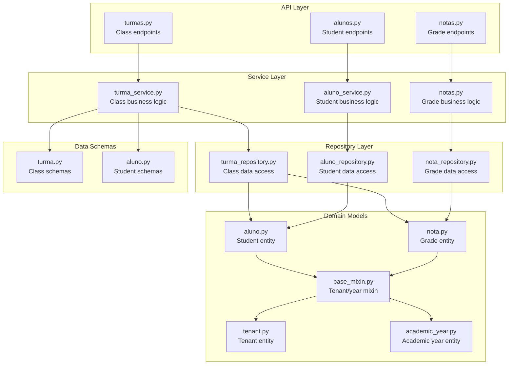
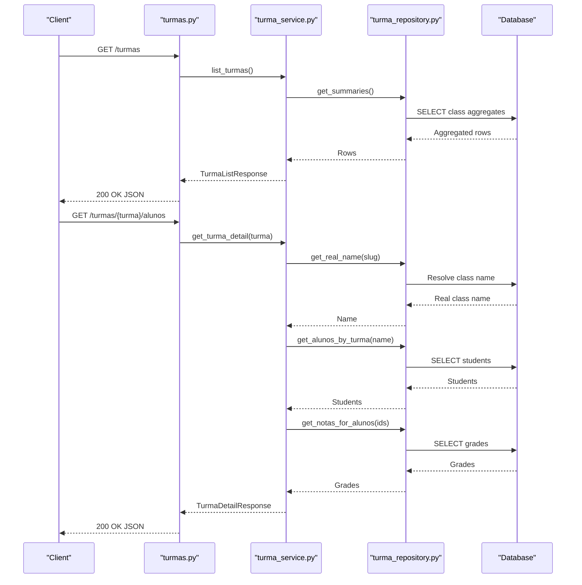
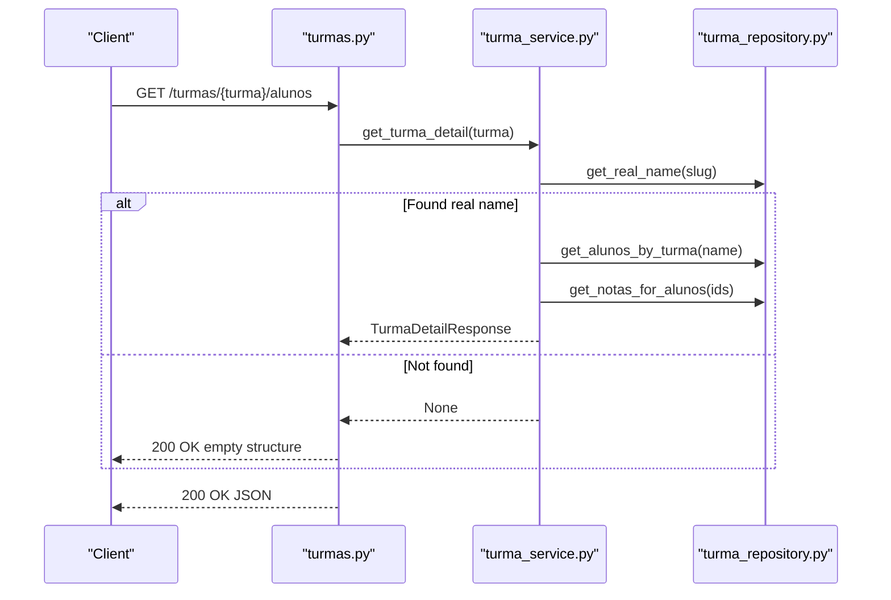
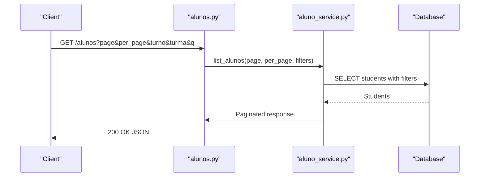
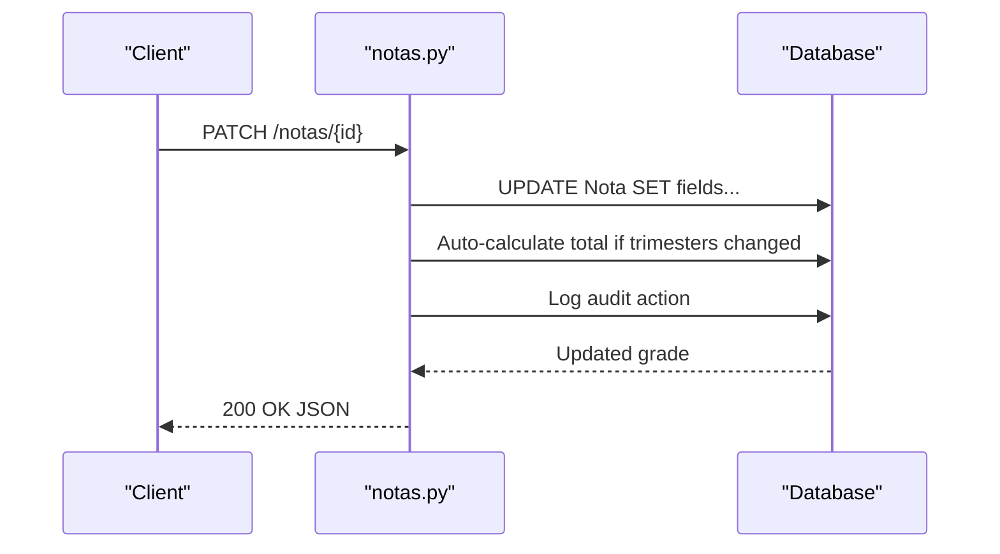
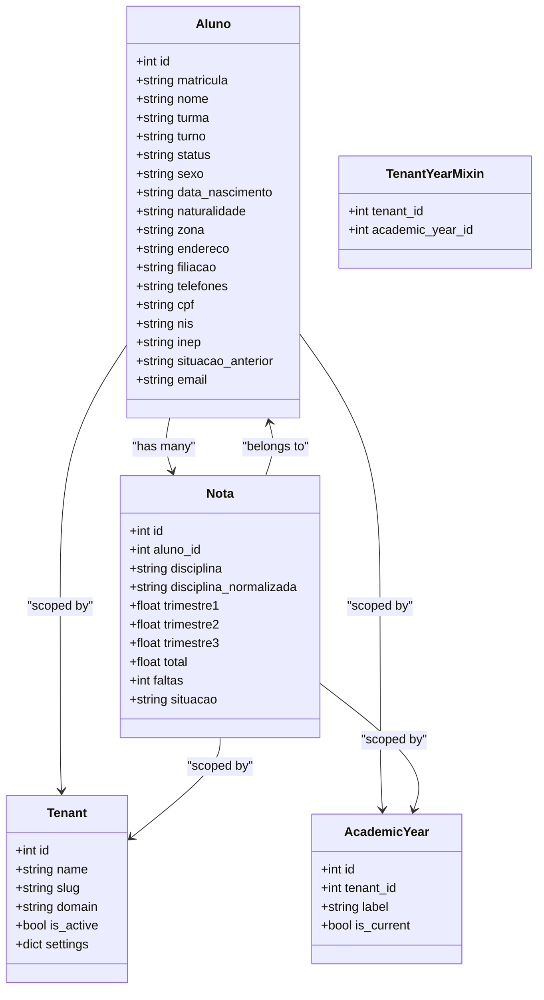
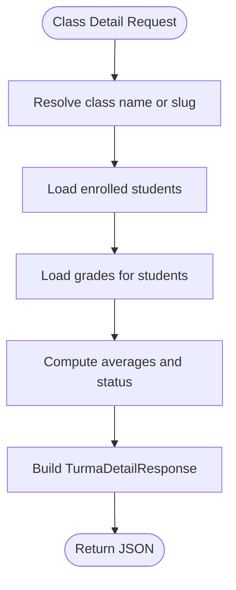
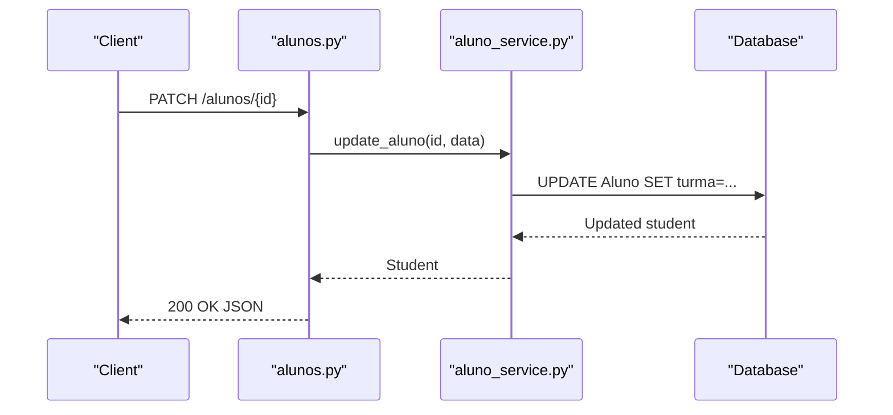
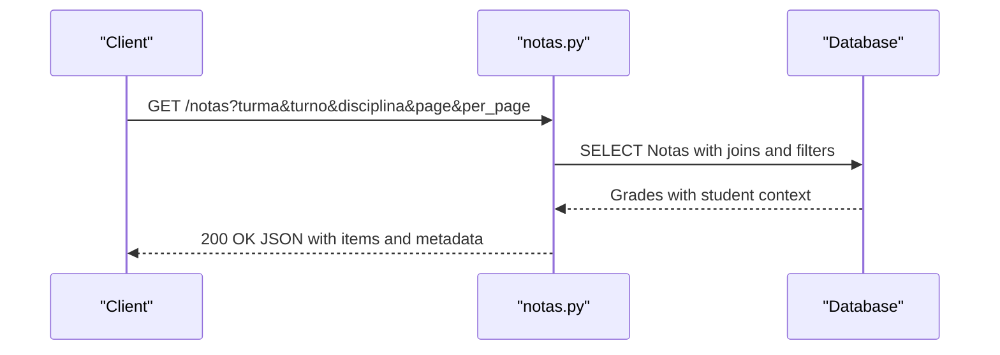
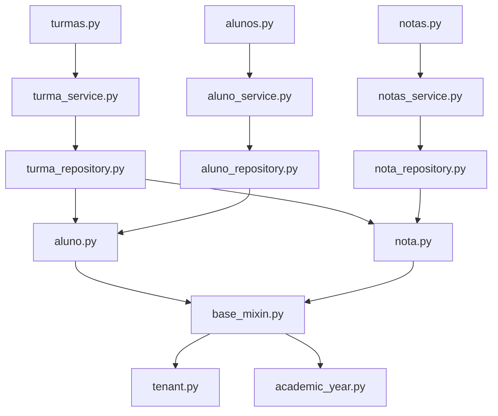

# Classroom Management API

<cite>
**Referenced Files in This Document**
- [turmas.py](file://backend/app/api/v1/turmas.py)
- [turma_service.py](file://backend/app/services/turma_service.py)
- [turma_repository.py](file://backend/app/repositories/turma_repository.py)
- [turma.py](file://backend/app/schemas/turma.py)
- [aluno.py](file://backend/app/models/aluno.py)
- [nota.py](file://backend/app/models/nota.py)
- [base_mixin.py](file://backend/app/models/base_mixin.py)
- [tenant.py](file://backend/app/models/tenant.py)
- [academic_year.py](file://backend/app/models/academic_year.py)
- [alunos.py](file://backend/app/api/v1/alunos.py)
- [notas.py](file://backend/app/api/v1/notas.py)
</cite>

## Table of Contents
1. [Introduction](#introduction)
2. [Project Structure](#project-structure)
3. [Core Components](#core-components)
4. [Architecture Overview](#architecture-overview)
5. [Detailed Component Analysis](#detailed-component-analysis)
6. [Dependency Analysis](#dependency-analysis)
7. [Performance Considerations](#performance-considerations)
8. [Troubleshooting Guide](#troubleshooting-guide)
9. [Conclusion](#conclusion)

## Introduction
This document describes the Classroom Management API focused on class creation, student enrollment, and class roster management. It explains class definitions, teacher assignments, enrollment records, class hierarchy, grade level associations, and class scheduling integration. It also covers class capacity limits, enrollment restrictions, and class transfer procedures, along with examples of class enrollment workflows, teacher-student relationships, and class-based reporting.

## Project Structure
The Classroom Management API is implemented in the backend Flask application under the `/api/v1` namespace. The relevant components are organized by concerns:
- API endpoints: define HTTP routes and request/response handling
- Services: encapsulate business logic for class and enrollment operations
- Repositories: handle data access and queries against the database
- Models: represent domain entities such as students, grades, and tenants
- Schemas: define request/response data structures using Pydantic

**Diagram sources**
- [turmas.py:1-42](file://backend/app/api/v1/turmas.py#L1-L42)
- [turma_service.py:1-128](file://backend/app/services/turma_service.py#L1-L128)
- [turma_repository.py:1-101](file://backend/app/repositories/turma_repository.py#L1-L101)
- [aluno.py:1-36](file://backend/app/models/aluno.py#L1-L36)
- [nota.py:1-24](file://backend/app/models/nota.py#L1-L24)
- [base_mixin.py:1-22](file://backend/app/models/base_mixin.py#L1-L22)
- [tenant.py:1-22](file://backend/app/models/tenant.py#L1-L22)
- [academic_year.py:1-16](file://backend/app/models/academic_year.py#L1-L16)
- [turma.py:1-41](file://backend/app/schemas/turma.py#L1-L41)
- [alunos.py:1-148](file://backend/app/api/v1/alunos.py#L1-L148)
- [notas.py:1-190](file://backend/app/api/v1/notas.py#L1-L190)

**Section sources**
- [turmas.py:1-42](file://backend/app/api/v1/turmas.py#L1-L42)
- [turma_service.py:1-128](file://backend/app/services/turma_service.py#L1-L128)
- [turma_repository.py:1-101](file://backend/app/repositories/turma_repository.py#L1-L101)
- [turma.py:1-41](file://backend/app/schemas/turma.py#L1-L41)
- [aluno.py:1-36](file://backend/app/models/aluno.py#L1-L36)
- [nota.py:1-24](file://backend/app/models/nota.py#L1-L24)
- [base_mixin.py:1-22](file://backend/app/models/base_mixin.py#L1-L22)
- [tenant.py:1-22](file://backend/app/models/tenant.py#L1-L22)
- [academic_year.py:1-16](file://backend/app/models/academic_year.py#L1-L16)
- [alunos.py:1-148](file://backend/app/api/v1/alunos.py#L1-L148)
- [notas.py:1-190](file://backend/app/api/v1/notas.py#L1-L190)

## Core Components
This section documents the primary components involved in classroom and course management.

- Class endpoints
  - List all classes with summary metrics
  - Retrieve a class detail with enrolled students and aggregated grades
- Student endpoints
  - List students with pagination and filters
  - Create, update, and delete students
  - Download student report cards
- Grade endpoints
  - Filter subjects for reporting
  - List grades with optional class/shift filters
  - Update individual grade records with audit logging

Key capabilities:
- Class hierarchy and grade level associations are derived from student records (class name and shift)
- Academic year and tenant scoping ensure multi-tenant and yearly isolation
- Class scheduling integration is implicit via shift (morning/afternoon/evening) stored with students

**Section sources**
- [turmas.py:14-41](file://backend/app/api/v1/turmas.py#L14-L41)
- [turma_service.py:31-102](file://backend/app/services/turma_service.py#L31-L102)
- [turma_repository.py:16-100](file://backend/app/repositories/turma_repository.py#L16-L100)
- [alunos.py:15-109](file://backend/app/api/v1/alunos.py#L15-L109)
- [notas.py:37-122](file://backend/app/api/v1/notas.py#L37-L122)

## Architecture Overview
The Classroom Management API follows a layered architecture:
- API layer: Flask blueprints expose endpoints secured by JWT and role-based access control
- Service layer: Business logic orchestrates repository calls and computes derived metrics
- Repository layer: SQLAlchemy queries aggregate data across student and grade entities
- Domain models: Represent persistence entities with tenant and academic year scoping
- Data schemas: Define structured input/output for requests and responses

**Diagram sources**
- [turmas.py:14-41](file://backend/app/api/v1/turmas.py#L14-L41)
- [turma_service.py:31-102](file://backend/app/services/turma_service.py#L31-L102)
- [turma_repository.py:16-100](file://backend/app/repositories/turma_repository.py#L16-L100)

## Detailed Component Analysis

### Class Endpoints
Endpoints for class listing and class rosters:
- GET /turmas: Returns a paginated list of classes with summary metrics (total students, average grade, average absences)
- GET /turmas/{turma}/alunos: Returns a class detail with enrolled students, their grades, and computed status

Access control requires authenticated users with roles including administrators, coordinators, directors, advisors, and teachers. The class name supports both literal and slug-based resolution.

**Diagram sources**
- [turmas.py:24-39](file://backend/app/api/v1/turmas.py#L24-L39)
- [turma_service.py:48-102](file://backend/app/services/turma_service.py#L48-L102)
- [turma_repository.py:56-100](file://backend/app/repositories/turma_repository.py#L56-L100)

**Section sources**
- [turmas.py:14-41](file://backend/app/api/v1/turmas.py#L14-L41)
- [turma_service.py:31-102](file://backend/app/services/turma_service.py#L31-L102)
- [turma_repository.py:16-100](file://backend/app/repositories/turma_repository.py#L16-L100)

### Student Endpoints
Endpoints for student management:
- GET /alunos: Lists students with pagination and optional filters (shift, class, search text)
- GET /alunos/{id}: Retrieves a student detail; students can access their own records only
- POST /alunos: Creates a new student record (requires administrator roles)
- PATCH /alunos/{id}: Updates a student record (administrator roles)
- DELETE /alunos/{id}: Deletes a student record (administrator roles)
- GET /alunos/{id}/boletim/pdf: Generates and downloads a report card PDF for a student

Student records include personal information and enrollment details (class, shift, status). Report generation integrates tenant and academic year context.

**Diagram sources**
- [alunos.py:15-41](file://backend/app/api/v1/alunos.py#L15-L41)

**Section sources**
- [alunos.py:15-148](file://backend/app/api/v1/alunos.py#L15-L148)

### Grade Endpoints
Endpoints for grade management:
- GET /notas/filtros: Returns unique subject names with normalization applied
- GET /notas: Lists grades with optional filters (class, shift, subject) and pagination
- PATCH /notas/{id}: Updates a single grade record; administrators only; recalculates totals when trimesters change

Grades are associated with students and scoped by tenant and academic year. Status calculation considers multiple grading schemes and defaults to a passing status when no data exists.

**Diagram sources**
- [notas.py:124-187](file://backend/app/api/v1/notas.py#L124-L187)

**Section sources**
- [notas.py:37-187](file://backend/app/api/v1/notas.py#L37-L187)

### Data Models and Schemas
Class definitions, teacher assignments, and enrollment records are represented through the following models and schemas:

- Class definition and enrollment
  - Classes are not a separate model; they are an aggregation of student records grouped by class name and shift
  - Enrollment records are student records containing class and shift fields
- Teacher assignments
  - Teachers are represented as users linked to student records; teacher-student relationships are implicit via shared class enrollment
- Grade level associations
  - Grade levels are inferred from class names; the system normalizes class names and supports slug-based lookup
- Class scheduling integration
  - Shift (morning/afternoon/evening) is stored with student records and used to compute class summaries

**Diagram sources**
- [aluno.py:8-35](file://backend/app/models/aluno.py#L8-L35)
- [nota.py:9-23](file://backend/app/models/nota.py#L9-L23)
- [tenant.py:7-21](file://backend/app/models/tenant.py#L7-L21)
- [academic_year.py:6-15](file://backend/app/models/academic_year.py#L6-L15)
- [base_mixin.py:4-21](file://backend/app/models/base_mixin.py#L4-L21)

**Section sources**
- [aluno.py:8-35](file://backend/app/models/aluno.py#L8-L35)
- [nota.py:9-23](file://backend/app/models/nota.py#L9-L23)
- [tenant.py:7-21](file://backend/app/models/tenant.py#L7-L21)
- [academic_year.py:6-15](file://backend/app/models/academic_year.py#L6-L15)
- [base_mixin.py:4-21](file://backend/app/models/base_mixin.py#L4-L21)

### Class Roster Management
Class roster management is implemented through:
- Listing classes with summary metrics (total students, average grade, average absences)
- Retrieving class details with enrolled students and their grades
- Computing derived status based on grade records

**Diagram sources**
- [turma_service.py:48-102](file://backend/app/services/turma_service.py#L48-L102)
- [turma_repository.py:81-100](file://backend/app/repositories/turma_repository.py#L81-L100)

**Section sources**
- [turma_service.py:31-102](file://backend/app/services/turma_service.py#L31-L102)
- [turma_repository.py:16-100](file://backend/app/repositories/turma_repository.py#L16-L100)

### Class Capacity Limits and Enrollment Restrictions
- Class capacity limits are not enforced by the API; the system returns class totals but does not prevent enrollment beyond capacity
- Enrollment restrictions are role-based; only authorized users can create, update, or delete student records
- Class transfers are supported by updating a student's class field; the system recomputes class aggregates accordingly

**Section sources**
- [alunos.py:63-97](file://backend/app/api/v1/alunos.py#L63-L97)
- [turma_service.py:31-46](file://backend/app/services/turma_service.py#L31-L46)

### Class Transfer Procedures
To transfer a student to another class:
- Update the student's class field via the student update endpoint
- The system will reflect the change in class listings and rosters upon subsequent requests

**Diagram sources**
- [alunos.py:80-97](file://backend/app/api/v1/alunos.py#L80-L97)

**Section sources**
- [alunos.py:80-97](file://backend/app/api/v1/alunos.py#L80-L97)

### Class-Based Reporting
Class-based reporting leverages:
- Subject filtering for reports
- Class and shift filters for grade lists
- Tenant and academic year scoping for accurate reporting across environments

**Diagram sources**
- [notas.py:77-122](file://backend/app/api/v1/notas.py#L77-L122)

**Section sources**
- [notas.py:37-122](file://backend/app/api/v1/notas.py#L37-L122)

## Dependency Analysis
The API depends on services and repositories to abstract data access and business logic. The repository layer enforces tenant and academic year scoping, ensuring data isolation across organizations and school years.

**Diagram sources**
- [turmas.py:1-42](file://backend/app/api/v1/turmas.py#L1-L42)
- [turma_service.py:1-18](file://backend/app/services/turma_service.py#L1-L18)
- [turma_repository.py:1-14](file://backend/app/repositories/turma_repository.py#L1-L14)
- [alunos.py:1-10](file://backend/app/api/v1/alunos.py#L1-L10)
- [aluno.py:1-36](file://backend/app/models/aluno.py#L1-L36)
- [nota.py:1-24](file://backend/app/models/nota.py#L1-L24)
- [base_mixin.py:1-22](file://backend/app/models/base_mixin.py#L1-L22)
- [tenant.py:1-22](file://backend/app/models/tenant.py#L1-L22)
- [academic_year.py:1-16](file://backend/app/models/academic_year.py#L1-L16)

**Section sources**
- [turma_repository.py:16-54](file://backend/app/repositories/turma_repository.py#L16-L54)
- [base_mixin.py:4-21](file://backend/app/models/base_mixin.py#L4-L21)
- [tenant.py:7-21](file://backend/app/models/tenant.py#L7-L21)
- [academic_year.py:6-15](file://backend/app/models/academic_year.py#L6-L15)

## Performance Considerations
- Aggregation queries for class summaries use grouping and averaging to minimize client-side computation
- Tenant and academic year filters are applied at query time to reduce result sets
- Slug-based class name resolution avoids repeated normalization overhead
- Caching invalidation occurs after grade updates to keep reports consistent

[No sources needed since this section provides general guidance]

## Troubleshooting Guide
Common issues and resolutions:
- Unauthorized access to class details: Ensure the requesting user has a valid JWT with appropriate roles
- Empty class details: When a class has no students, the API returns an empty structure with total set to zero
- Slug resolution failures: Class names can be resolved either by exact match or by normalized slug comparison
- Grade updates denied: Only administrators can modify grades; verify role claims
- Report generation errors: Confirm tenant and academic year context are present in the request context

**Section sources**
- [turmas.py:14-41](file://backend/app/api/v1/turmas.py#L14-L41)
- [turma_service.py:48-55](file://backend/app/services/turma_service.py#L48-L55)
- [notas.py:124-130](file://backend/app/api/v1/notas.py#L124-L130)

## Conclusion
The Classroom Management API provides robust support for class and student management through well-defined endpoints, strong tenant and academic year scoping, and clear data schemas. While class capacity limits and strict enrollment controls are not enforced by the API, the system offers flexible mechanisms for class transfers, comprehensive reporting, and secure access control. The architecture ensures maintainability and scalability across multi-tenant environments.