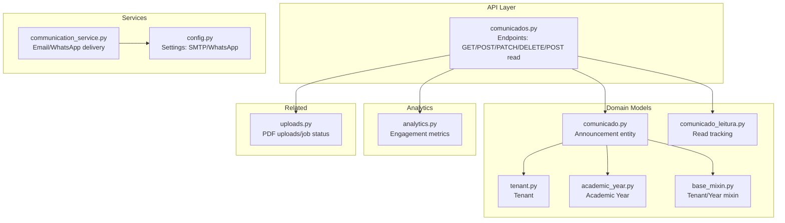
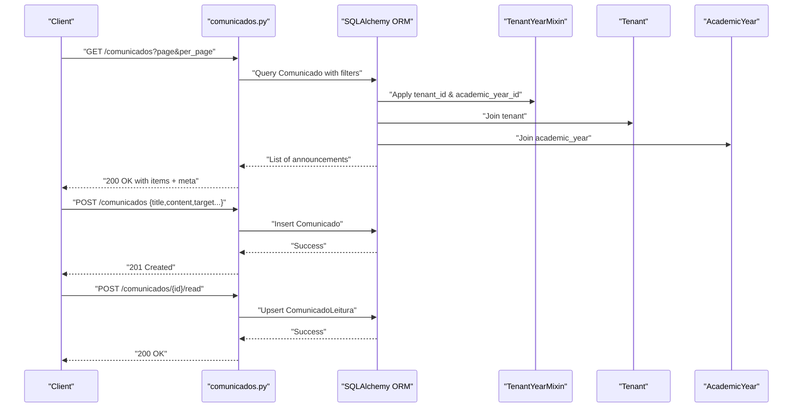
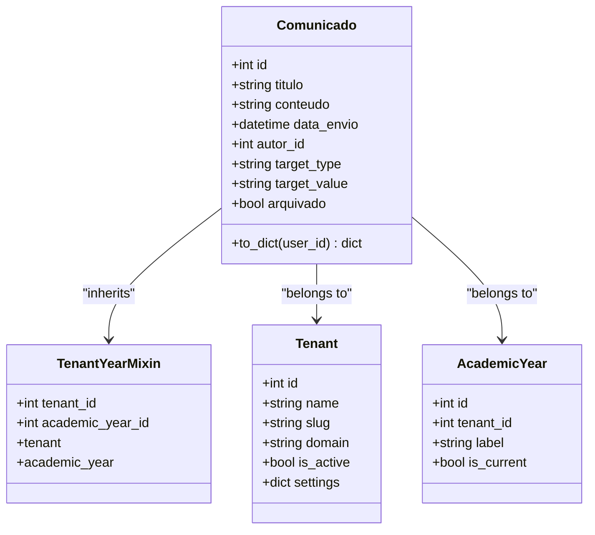
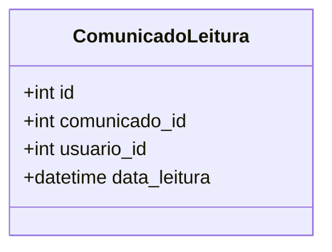
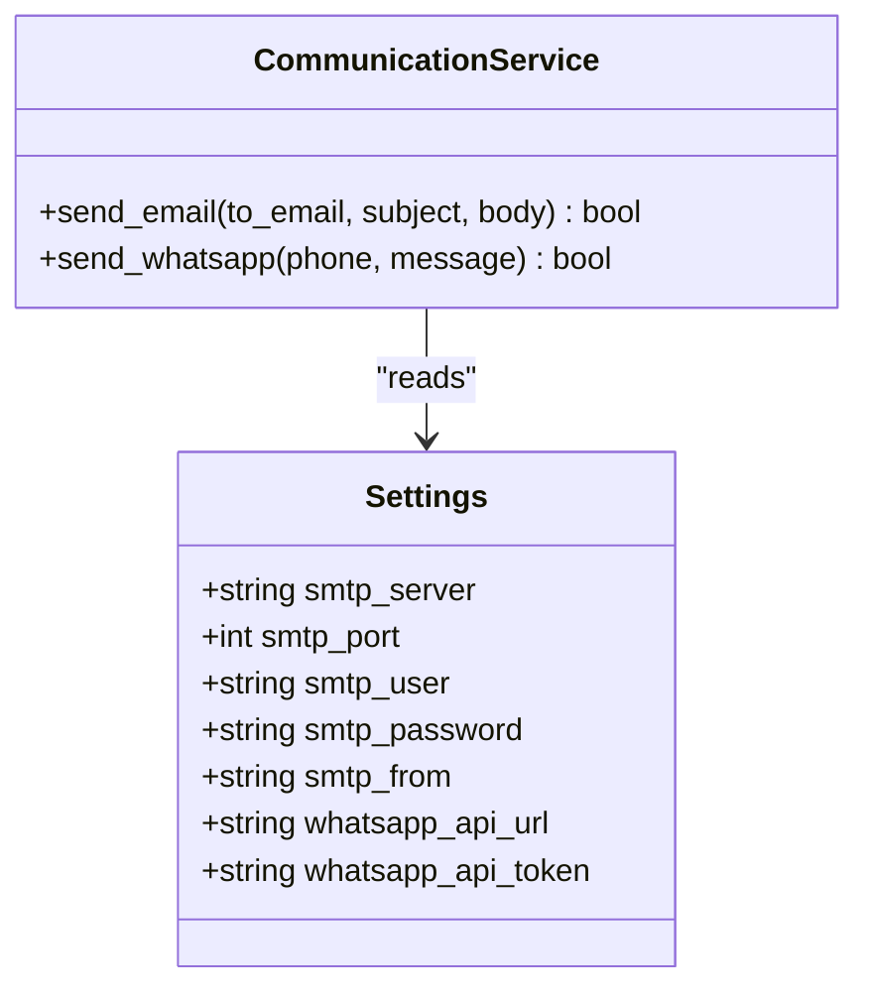
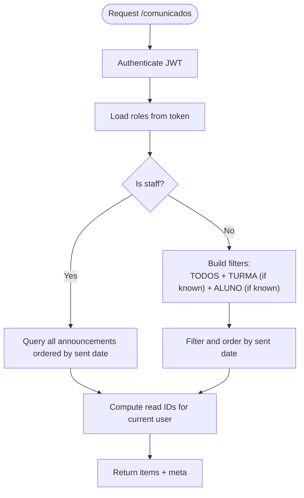
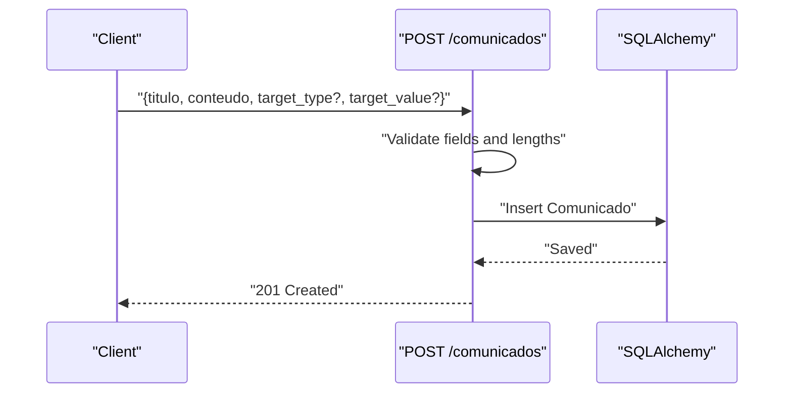
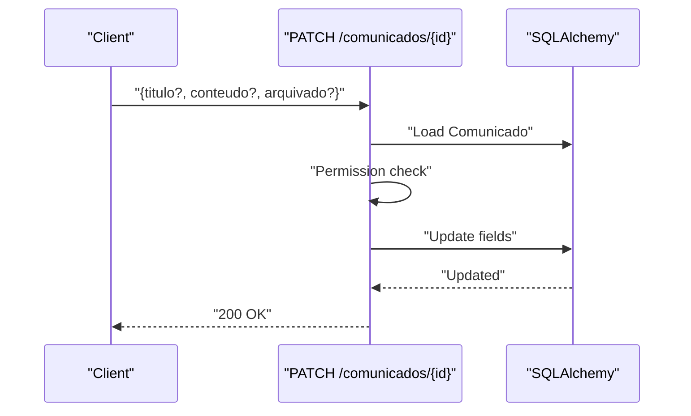
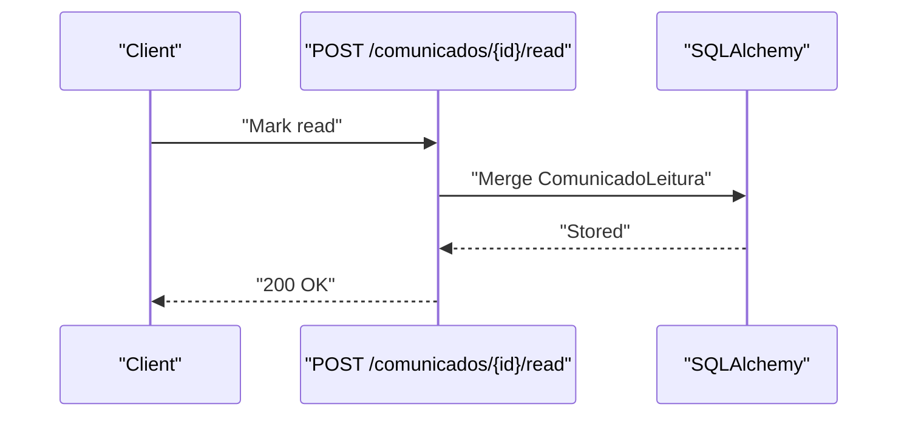
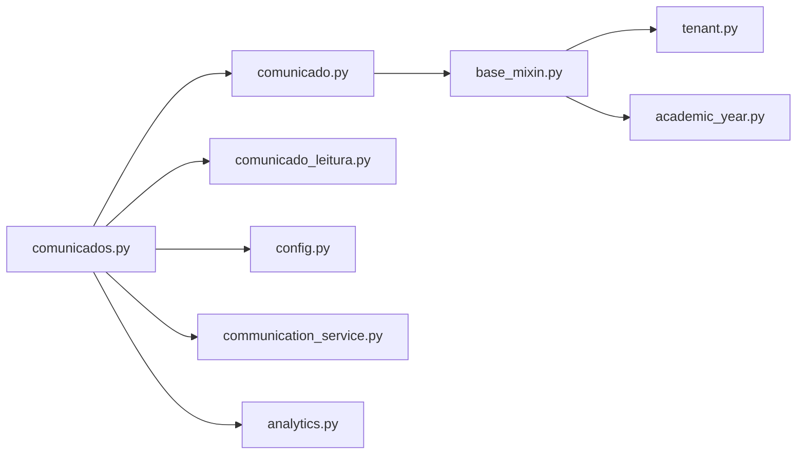

# Communication Portal API

<cite>
**Referenced Files in This Document**
- [comunicados.py](file://backend/app/api/v1/comunicados.py)
- [comunicado.py](file://backend/app/models/comunicado.py)
- [comunicado_leitura.py](file://backend/app/models/comunicado_leitura.py)
- [communication_service.py](file://backend/app/services/communication_service.py)
- [config.py](file://backend/app/core/config.py)
- [base_mixin.py](file://backend/app/models/base_mixin.py)
- [tenant.py](file://backend/app/models/tenant.py)
- [academic_year.py](file://backend/app/models/academic_year.py)
- [analytics.py](file://backend/app/services/analytics.py)
- [uploads.py](file://backend/app/api/v1/uploads.py)
</cite>

## Table of Contents
1. [Introduction](#introduction)
2. [Project Structure](#project-structure)
3. [Core Components](#core-components)
4. [Architecture Overview](#architecture-overview)
5. [Detailed Component Analysis](#detailed-component-analysis)
6. [Dependency Analysis](#dependency-analysis)
7. [Performance Considerations](#performance-considerations)
8. [Troubleshooting Guide](#troubleshooting-guide)
9. [Conclusion](#conclusion)
10. [Appendices](#appendices)

## Introduction
This document describes the Communication Portal API that powers announcement creation, distribution, and read tracking. It covers endpoint definitions, schemas, broadcast systems, audience targeting, delivery mechanisms, message formatting, attachments, analytics, and compliance considerations. The system supports multi-tenant and academic-year scoping, role-based access control, and optional email and WhatsApp delivery channels.

## Project Structure
The communication system spans API endpoints, ORM models, services, and configuration. Key areas:
- API: Announcement CRUD, listing, and read tracking endpoints
- Models: Announcement, read tracking, tenant/year scoping
- Services: Email and WhatsApp delivery
- Config: SMTP and WhatsApp integration settings
- Analytics: Read analytics and engagement insights
- Uploads: Related document handling (PDFs) for broader communications

**Diagram sources**
- [comunicados.py:1-175](file://backend/app/api/v1/comunicados.py#L1-L175)
- [comunicado.py:1-39](file://backend/app/models/comunicado.py#L1-L39)
- [comunicado_leitura.py:1-20](file://backend/app/models/comunicado_leitura.py#L1-L20)
- [base_mixin.py:1-22](file://backend/app/models/base_mixin.py#L1-L22)
- [tenant.py:1-22](file://backend/app/models/tenant.py#L1-L22)
- [academic_year.py:1-16](file://backend/app/models/academic_year.py#L1-L16)
- [communication_service.py:1-61](file://backend/app/services/communication_service.py#L1-L61)
- [config.py:1-60](file://backend/app/core/config.py#L1-L60)
- [analytics.py:1-196](file://backend/app/services/analytics.py#L1-L196)
- [uploads.py:1-84](file://backend/app/api/v1/uploads.py#L1-L84)

**Section sources**
- [comunicados.py:1-175](file://backend/app/api/v1/comunicados.py#L1-L175)
- [comunicado.py:1-39](file://backend/app/models/comunicado.py#L1-L39)
- [comunicado_leitura.py:1-20](file://backend/app/models/comunicado_leitura.py#L1-L20)
- [communication_service.py:1-61](file://backend/app/services/communication_service.py#L1-L61)
- [config.py:1-60](file://backend/app/core/config.py#L1-L60)
- [base_mixin.py:1-22](file://backend/app/models/base_mixin.py#L1-L22)
- [tenant.py:1-22](file://backend/app/models/tenant.py#L1-L22)
- [academic_year.py:1-16](file://backend/app/models/academic_year.py#L1-L16)
- [analytics.py:1-196](file://backend/app/services/analytics.py#L1-L196)
- [uploads.py:1-84](file://backend/app/api/v1/uploads.py#L1-L84)

## Core Components
- Announcement entity with title, content, author, target audience, archive flag, and timestamps
- Read tracking per user per announcement
- Role-based access control for creation, updates, and deletions
- Optional email and WhatsApp delivery channels
- Multi-tenant and academic-year scoping
- Read analytics and engagement reporting

**Section sources**
- [comunicado.py:8-39](file://backend/app/models/comunicado.py#L8-L39)
- [comunicado_leitura.py:7-20](file://backend/app/models/comunicado_leitura.py#L7-L20)
- [comunicados.py:71-175](file://backend/app/api/v1/comunicados.py#L71-L175)
- [communication_service.py:10-61](file://backend/app/services/communication_service.py#L10-L61)
- [base_mixin.py:4-22](file://backend/app/models/base_mixin.py#L4-L22)
- [tenant.py:7-22](file://backend/app/models/tenant.py#L7-L22)
- [academic_year.py:6-16](file://backend/app/models/academic_year.py#L6-L16)
- [analytics.py:1-196](file://backend/app/services/analytics.py#L1-L196)

## Architecture Overview
The API enforces JWT-based authentication and role checks. Requests are scoped to tenant and academic year via g context. Announcements support three target types: everyone, classroom, or individual student. Read tracking is persisted and returned alongside listings. Delivery channels (email/WhatsApp) are optional and configured via settings.

**Diagram sources**
- [comunicados.py:11-175](file://backend/app/api/v1/comunicados.py#L11-L175)
- [comunicado.py:8-39](file://backend/app/models/comunicado.py#L8-L39)
- [comunicado_leitura.py:7-20](file://backend/app/models/comunicado_leitura.py#L7-L20)
- [base_mixin.py:4-22](file://backend/app/models/base_mixin.py#L4-L22)
- [tenant.py:7-22](file://backend/app/models/tenant.py#L7-L22)
- [academic_year.py:6-16](file://backend/app/models/academic_year.py#L6-L16)

## Detailed Component Analysis

### Announcement Entity Model
- Fields: id, title, content, send date, author, target type/value, archived flag
- Target types: everyone, classroom, individual student
- Tenant and academic year scoping via mixin
- Serialization to dictionary with computed target label

**Diagram sources**
- [comunicado.py:8-39](file://backend/app/models/comunicado.py#L8-L39)
- [base_mixin.py:4-22](file://backend/app/models/base_mixin.py#L4-L22)
- [tenant.py:7-22](file://backend/app/models/tenant.py#L7-L22)
- [academic_year.py:6-16](file://backend/app/models/academic_year.py#L6-L16)

**Section sources**
- [comunicado.py:8-39](file://backend/app/models/comunicado.py#L8-L39)
- [base_mixin.py:4-22](file://backend/app/models/base_mixin.py#L4-L22)
- [tenant.py:7-22](file://backend/app/models/tenant.py#L7-L22)
- [academic_year.py:6-16](file://backend/app/models/academic_year.py#L6-L16)

### Read Tracking Model
- Tracks user reads per announcement with unique constraint on (announcement, user)
- Stores read timestamp

**Diagram sources**
- [comunicado_leitura.py:7-20](file://backend/app/models/comunicado_leitura.py#L7-L20)

**Section sources**
- [comunicado_leitura.py:7-20](file://backend/app/models/comunicado_leitura.py#L7-L20)

### Communication Delivery Service
- Email: Sends via Flask-Mail using configured SMTP settings
- WhatsApp: Sends via external API (e.g., Evolution/Z-API) using configured URL/token and instance
- Phone numbers are normalized by removing non-digit characters

**Diagram sources**
- [communication_service.py:10-61](file://backend/app/services/communication_service.py#L10-L61)
- [config.py:20-30](file://backend/app/core/config.py#L20-L30)

**Section sources**
- [communication_service.py:10-61](file://backend/app/services/communication_service.py#L10-L61)
- [config.py:20-30](file://backend/app/core/config.py#L20-L30)

### API Endpoints

#### GET /comunicados
- Pagination: page, per_page (validated and bounded)
- Access: authenticated
- Behavior:
  - Staff (admin, super_admin, teacher, coordinator, director, advisor): see all
  - Students: filtered by target type: everyone, classroom (if known), or individual
- Returns: items with read status computed from ComunicadoLeitura

**Diagram sources**
- [comunicados.py:11-69](file://backend/app/api/v1/comunicados.py#L11-L69)

**Section sources**
- [comunicados.py:11-69](file://backend/app/api/v1/comunicados.py#L11-L69)

#### POST /comunicados
- Authentication and roles: admin, super_admin, teacher, coordinator, director, advisor
- Validation: title and content required; length limits enforced
- Persistence: creates announcement with target_type/target_value, tenant_id, academic_year_id
- Response: success message

**Diagram sources**
- [comunicados.py:71-104](file://backend/app/api/v1/comunicados.py#L71-L104)

**Section sources**
- [comunicados.py:71-104](file://backend/app/api/v1/comunicados.py#L71-L104)

#### PATCH /comunicados/{id}
- Authentication and roles: admin, super_admin, coordinator, director, advisor (managers) or original author
- Validation: optional title/content length checks
- Persistence: update fields; archive flag supported
- Response: success message

**Diagram sources**
- [comunicados.py:106-142](file://backend/app/api/v1/comunicados.py#L106-L142)

**Section sources**
- [comunicados.py:106-142](file://backend/app/api/v1/comunicados.py#L106-L142)

#### DELETE /comunicados/{id}
- Authentication and roles: admin, super_admin, coordinator, director, advisor (managers) or original author
- Persistence: delete announcement
- Response: success message

**Section sources**
- [comunicados.py:144-163](file://backend/app/api/v1/comunicados.py#L144-L163)

#### POST /comunicados/{id}/read
- Authentication: required
- Persistence: upsert read record for user and announcement
- Response: success message

**Section sources**
- [comunicados.py:165-172](file://backend/app/api/v1/comunicados.py#L165-L172)

### Audience Targeting and Broadcast
- Target types:
  - Everyone: target_type = "TODOS"
  - Classroom: target_type = "TURMA", target_value = classroom slug
  - Individual: target_type = "ALUNO", target_value = student id
- Listing filters combine target conditions for non-staff users

**Section sources**
- [comunicado.py:20-24](file://backend/app/models/comunicado.py#L20-L24)
- [comunicados.py:38-44](file://backend/app/api/v1/comunicados.py#L38-L44)

### Read Receipt Tracking
- Upsert operation ensures one read record per user per announcement
- Read status included in list response items
- Analytics module can derive engagement metrics from read records

**Diagram sources**
- [comunicados.py:165-172](file://backend/app/api/v1/comunicados.py#L165-L172)
- [comunicado_leitura.py:7-20](file://backend/app/models/comunicado_leitura.py#L7-L20)

**Section sources**
- [comunicados.py:49-64](file://backend/app/api/v1/comunicados.py#L49-L64)
- [comunicado_leitura.py:7-20](file://backend/app/models/comunicado_leitura.py#L7-L20)

### Communication Preferences and Compliance
- Delivery channels:
  - Email: configured via SMTP settings
  - WhatsApp: configured via external API URL/token and instance
- Compliance considerations:
  - Production requires strong secrets for keys
  - Phone numbers are normalized before sending
  - Logs capture delivery attempts and failures

**Section sources**
- [config.py:20-30](file://backend/app/core/config.py#L20-L30)
- [communication_service.py:12-60](file://backend/app/services/communication_service.py#L12-L60)

### Message Formatting and Attachments
- Announcement content supports rich text via HTML-capable clients
- PDF document uploads are supported via separate endpoints for related communications
- Attachment handling is out-of-scope for announcements but available for documents

**Section sources**
- [uploads.py:16-56](file://backend/app/api/v1/uploads.py#L16-L56)

### Communication Analytics
- Engagement metrics can be derived from read records and announcement metadata
- Analytics service provides dashboard-style metrics and distributions
- Integration points for read tracking and performance buckets

**Section sources**
- [analytics.py:1-196](file://backend/app/services/analytics.py#L1-L196)

## Dependency Analysis
- API depends on models for persistence and tenant/year scoping
- Read tracking is decoupled and leverages unique constraints
- Delivery service depends on configuration for external integrations
- Analytics consumes domain models to compute insights

**Diagram sources**
- [comunicados.py:1-175](file://backend/app/api/v1/comunicados.py#L1-L175)
- [comunicado.py:1-39](file://backend/app/models/comunicado.py#L1-L39)
- [comunicado_leitura.py:1-20](file://backend/app/models/comunicado_leitura.py#L1-L20)
- [base_mixin.py:1-22](file://backend/app/models/base_mixin.py#L1-L22)
- [tenant.py:1-22](file://backend/app/models/tenant.py#L1-L22)
- [academic_year.py:1-16](file://backend/app/models/academic_year.py#L1-L16)
- [config.py:1-60](file://backend/app/core/config.py#L1-L60)
- [communication_service.py:1-61](file://backend/app/services/communication_service.py#L1-L61)
- [analytics.py:1-196](file://backend/app/services/analytics.py#L1-L196)

**Section sources**
- [comunicados.py:1-175](file://backend/app/api/v1/comunicados.py#L1-L175)
- [comunicado.py:1-39](file://backend/app/models/comunicado.py#L1-L39)
- [comunicado_leitura.py:1-20](file://backend/app/models/comunicado_leitura.py#L1-L20)
- [base_mixin.py:1-22](file://backend/app/models/base_mixin.py#L1-L22)
- [tenant.py:1-22](file://backend/app/models/tenant.py#L1-L22)
- [academic_year.py:1-16](file://backend/app/models/academic_year.py#L1-L16)
- [config.py:1-60](file://backend/app/core/config.py#L1-L60)
- [communication_service.py:1-61](file://backend/app/services/communication_service.py#L1-L61)
- [analytics.py:1-196](file://backend/app/services/analytics.py#L1-L196)

## Performance Considerations
- Pagination bounds prevent excessive loads
- Single query fetches read IDs for current user to minimize round-trips
- Unique constraint on read tracking prevents duplicates
- Tenant and academic-year filters leverage indexed foreign keys

[No sources needed since this section provides general guidance]

## Troubleshooting Guide
- Authentication errors: ensure valid JWT and appropriate roles
- Permission denied: verify authorship or manager/admin roles
- Validation errors: check field lengths and presence
- Delivery failures: review SMTP/WhatsApp settings and logs
- Read tracking inconsistencies: confirm unique constraint and upsert logic

**Section sources**
- [comunicados.py:71-175](file://backend/app/api/v1/comunicados.py#L71-L175)
- [communication_service.py:12-60](file://backend/app/services/communication_service.py#L12-L60)

## Conclusion
The Communication Portal API provides a robust foundation for announcements with role-aware distribution, precise audience targeting, and optional multi-channel delivery. Built-in read tracking enables analytics and compliance, while tenant and academic-year scoping ensures isolation across environments.

[No sources needed since this section summarizes without analyzing specific files]

## Appendices

### Endpoint Reference

- GET /comunicados
  - Query params: page, per_page
  - Response: items with read status, meta pagination
- POST /comunicados
  - Body: title, content, target_type, target_value
  - Response: success message
- PATCH /comunicados/{id}
  - Body: title, content, arquivado
  - Response: success message
- DELETE /comunicados/{id}
  - Response: success message
- POST /comunicados/{id}/read
  - Response: success message

**Section sources**
- [comunicados.py:11-175](file://backend/app/api/v1/comunicados.py#L11-L175)

### Schemas and Data Models

- Announcement
  - Fields: id, title, content, sent date, author, target type/value, archived
  - Target types: everyone, classroom, individual
- Read Tracking
  - Fields: id, announcement id, user id, read date
  - Constraint: unique (announcement id, user id)

**Section sources**
- [comunicado.py:8-39](file://backend/app/models/comunicado.py#L8-L39)
- [comunicado_leitura.py:7-20](file://backend/app/models/comunicado_leitura.py#L7-L20)

### Configuration Options

- SMTP
  - smtp_server, smtp_port, smtp_user, smtp_password, smtp_from
- WhatsApp
  - whatsapp_api_url, whatsapp_api_token, instance identifier
- Security
  - production requires strong secrets for keys

**Section sources**
- [config.py:20-34](file://backend/app/core/config.py#L20-L34)