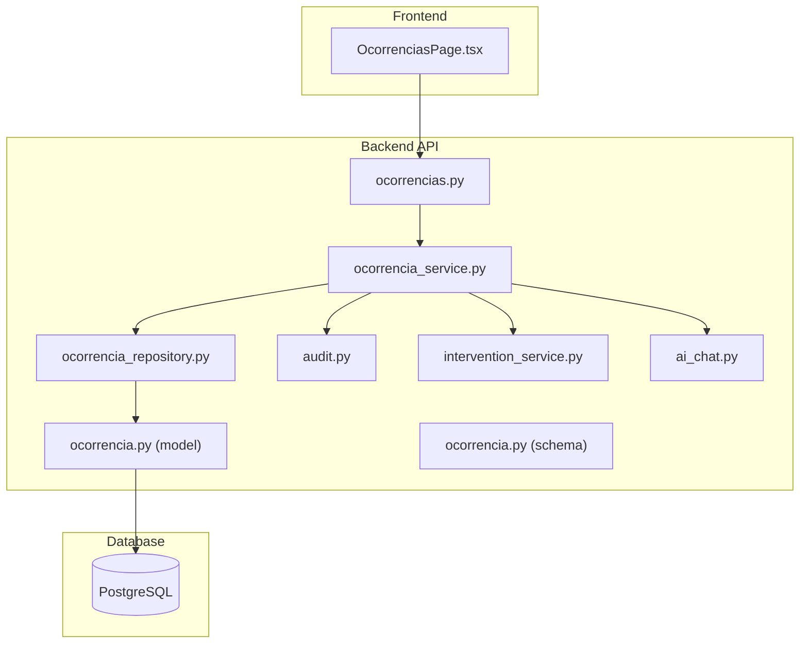
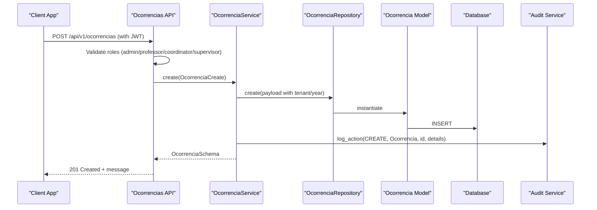
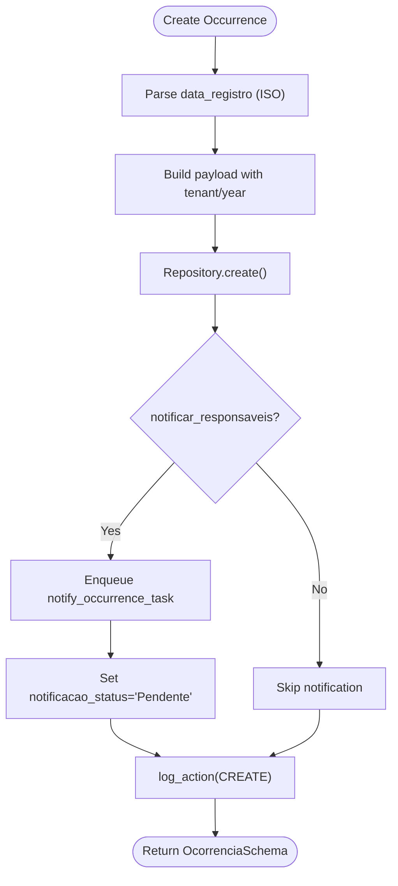

# Disciplinary System API

<cite>
**Referenced Files in This Document**
- [ocorrencias.py](file://backend/app/api/v1/ocorrencias.py)
- [ocorrencia.py](file://backend/app/models/ocorrencia.py)
- [ocorrencia.py](file://backend/app/schemas/ocorrencia.py)
- [ocorrencia_repository.py](file://backend/app/repositories/ocorrencia_repository.py)
- [ocorrencia_service.py](file://backend/app/services/ocorrencia_service.py)
- [50489374deb2_create_ocorrencias_table.py](file://backend/migrations/versions/50489374deb2_create_ocorrencias_table.py)
- [manual_ocorrencias.md](file://docs/manual_ocorrencias.md)
- [audit.py](file://backend/app/services/audit.py)
- [ai_chat.py](file://backend/app/services/ai_chat.py)
- [intervention_service.py](file://backend/app/services/intervention_service.py)
- [OcorrenciasPage.tsx](file://frontend/src/features/ocorrencias/OcorrenciasPage.tsx)
</cite>

## Table of Contents
1. [Introduction](#introduction)
2. [Project Structure](#project-structure)
3. [Core Components](#core-components)
4. [Architecture Overview](#architecture-overview)
5. [Detailed Component Analysis](#detailed-component-analysis)
6. [API Reference](#api-reference)
7. [Data Models and Schemas](#data-models-and-schemas)
8. [Privacy and Security Considerations](#privacy-and-security-considerations)
9. [Statistics and Reporting](#statistics-and-reporting)
10. [Integration with Student Support Services](#integration-with-student-support-services)
11. [Troubleshooting Guide](#troubleshooting-guide)
12. [Conclusion](#conclusion)

## Introduction
This document provides comprehensive API documentation for the Disciplinary Occurrence Management system within the ColaboraEdu platform. It covers incident reporting, severity classification, case management workflows, evidence handling, and investigation processes. The system supports occurrence categorization (warnings, commendations, suspensions, observations), severity levels (light, medium, serious, very serious), and integrates with student support services through behavioral intervention tracking.

## Project Structure
The disciplinary system is implemented as part of the backend Flask application with clear separation of concerns across API endpoints, services, repositories, models, and schemas. The frontend provides forms for creating and managing occurrences, while the backend enforces role-based access control and maintains audit trails.

**Diagram sources**
- [ocorrencias.py:1-109](file://backend/app/api/v1/ocorrencias.py#L1-L109)
- [ocorrencia_service.py:1-134](file://backend/app/services/ocorrencia_service.py#L1-L134)
- [ocorrencia_repository.py:1-27](file://backend/app/repositories/ocorrencia_repository.py#L1-L27)
- [ocorrencia.py:1-45](file://backend/app/models/ocorrencia.py#L1-L45)
- [ocorrencia.py:1-36](file://backend/app/schemas/ocorrencia.py#L1-L36)
- [audit.py:1-17](file://backend/app/services/audit.py#L1-L17)
- [intervention_service.py:1-128](file://backend/app/services/intervention_service.py#L1-L128)
- [ai_chat.py:389-414](file://backend/app/services/ai_chat.py#L389-L414)

**Section sources**
- [ocorrencias.py:1-109](file://backend/app/api/v1/ocorrencias.py#L1-L109)
- [ocorrencia_service.py:1-134](file://backend/app/services/ocorrencia_service.py#L1-L134)
- [ocorrencia_repository.py:1-27](file://backend/app/repositories/ocorrencia_repository.py#L1-L27)
- [ocorrencia.py:1-45](file://backend/app/models/ocorrencia.py#L1-L45)
- [ocorrencia.py:1-36](file://backend/app/schemas/ocorrencia.py#L1-L36)

## Core Components
- API Layer: Flask blueprint exposing CRUD endpoints for occurrences with JWT-based authentication and role-based authorization.
- Service Layer: Business logic for occurrence creation, updates, deletions, and notifications, including audit logging and tenant/year scoping.
- Repository Layer: Data access with multi-tenant and academic year filtering.
- Model Layer: SQLAlchemy ORM mapping for occurrence records with foreign keys to students and users.
- Schema Layer: Pydantic models for request/response validation and serialization.
- Audit Service: Centralized logging for all occurrence actions.
- Intervention Service: Behavioral intervention generation integrated with occurrence data.
- Frontend Forms: UI components for creating and managing occurrences with severity and resolution fields.

**Section sources**
- [ocorrencias.py:9-109](file://backend/app/api/v1/ocorrencias.py#L9-L109)
- [ocorrencia_service.py:9-134](file://backend/app/services/ocorrencia_service.py#L9-L134)
- [ocorrencia_repository.py:8-27](file://backend/app/repositories/ocorrencia_repository.py#L8-L27)
- [ocorrencia.py:9-45](file://backend/app/models/ocorrencia.py#L9-L45)
- [ocorrencia.py:5-36](file://backend/app/schemas/ocorrencia.py#L5-L36)
- [audit.py:4-17](file://backend/app/services/audit.py#L4-L17)
- [intervention_service.py:8-128](file://backend/app/services/intervention_service.py#L8-L128)
- [OcorrenciasPage.tsx:591-615](file://frontend/src/features/ocorrencias/OcorrenciasPage.tsx#L591-L615)

## Architecture Overview
The system follows a layered architecture with clear boundaries between presentation, business logic, data access, and persistence. JWT tokens carry user roles and identity, enabling fine-grained access control. Tenant and academic year context are injected via Flask g-context for multi-tenancy and year-specific filtering.

**Diagram sources**
- [ocorrencias.py:39-62](file://backend/app/api/v1/ocorrencias.py#L39-L62)
- [ocorrencia_service.py:36-91](file://backend/app/services/ocorrencia_service.py#L36-L91)
- [audit.py:4-17](file://backend/app/services/audit.py#L4-L17)

## Detailed Component Analysis

### API Endpoints
- GET /api/v1/ocorrencias: Lists occurrences with optional student filter. Implements role-based visibility and tenant/year scoping.
- POST /api/v1/ocorrencias: Creates a new occurrence with severity classification and optional parent notification.
- PATCH /api/v1/ocorrencias/{id}: Updates occurrence details (type, description, severity, action taken).
- DELETE /api/v1/ocorrencias/{id}: Removes an occurrence with audit logging.

Authorization roles include admin, professor, coordinator, director, and supervisor. Students can only view their own occurrences.

**Section sources**
- [ocorrencias.py:12-106](file://backend/app/api/v1/ocorrencias.py#L12-L106)

### Service Layer Logic
- Multi-tenant and academic year filtering via Flask g-context.
- Notification queue integration for parent notifications with status tracking.
- Audit trail recording for create, update, and delete operations.
- Flexible date parsing for occurrence registration timestamps.

**Diagram sources**
- [ocorrencia_service.py:36-91](file://backend/app/services/ocorrencia_service.py#L36-L91)
- [audit.py:4-17](file://backend/app/services/audit.py#L4-L17)

**Section sources**
- [ocorrencia_service.py:14-134](file://backend/app/services/ocorrencia_service.py#L14-L134)

### Repository and Model
- Repository applies tenant_id and academic_year_id filters when present.
- Model defines occurrence fields including type, description, severity, action taken, and notification status.
- Relationship mapping connects to student and user entities.

**Section sources**
- [ocorrencia_repository.py:12-27](file://backend/app/repositories/ocorrencia_repository.py#L12-L27)
- [ocorrencia.py:9-45](file://backend/app/models/ocorrencia.py#L9-L45)

### Frontend Forms and Evidence Handling
- The frontend form captures occurrence type, description, severity, action taken, and parental instructions.
- These fields map directly to the occurrence schema and are persisted through the API.

**Section sources**
- [OcorrenciasPage.tsx:591-615](file://frontend/src/features/ocorrencias/OcorrenciasPage.tsx#L591-L615)

## API Reference

### Authentication and Authorization
- All endpoints require a valid JWT bearer token.
- Roles: admin, professor, coordinator, director, supervisor (staff) can create/update/delete; students can only list their own occurrences.

**Section sources**
- [ocorrencias.py:12-37](file://backend/app/api/v1/ocorrencias.py#L12-L37)

### List Occurrences
- Method: GET
- Path: /api/v1/ocorrencias
- Query Parameters:
  - aluno_id (optional): Filter by student ID
- Response: Array of occurrence objects (see Data Models)

**Section sources**
- [ocorrencias.py:12-37](file://backend/app/api/v1/ocorrencias.py#L12-L37)

### Create Occurrence
- Method: POST
- Path: /api/v1/ocorrencias
- Request Body: OcorrenciaCreate
- Response: Success message

Fields include student ID, occurrence type, description, severity, optional action taken, and parental instructions. An option to notify parents triggers asynchronous processing.

**Section sources**
- [ocorrencias.py:39-62](file://backend/app/api/v1/ocorrencias.py#L39-L62)
- [ocorrencia.py:13-16](file://backend/app/schemas/ocorrencia.py#L13-L16)

### Update Occurrence
- Method: PATCH
- Path: /api/v1/ocorrencias/{id}
- Path Parameter: id (integer)
- Request Body: Partial OcorrenciaUpdate
- Response: Success message

Supported updates: type, description, parental observation, severity, and action taken.

**Section sources**
- [ocorrencias.py:64-87](file://backend/app/api/v1/ocorrencias.py#L64-L87)
- [ocorrencia.py:18-24](file://backend/app/schemas/ocorrencia.py#L18-L24)

### Delete Occurrence
- Method: DELETE
- Path: /api/v1/ocorrencias/{id}
- Path Parameter: id (integer)
- Response: Success message

**Section sources**
- [ocorrencias.py:89-106](file://backend/app/api/v1/ocorrencias.py#L89-L106)

## Data Models and Schemas

### Occurrence Record Schema
- Fields:
  - id: integer
  - aluno_id: integer (foreign key)
  - autor_id: integer (foreign key)
  - tipo: string (Advertência, Elogio, Suspensão, Observação)
  - descricao: text
  - observacao_pais: text (parental instructions)
  - gravidade: string (LEVE, MEDIA, GRAVE, GRAVISSIMA)
  - acao_tomada: text (disciplinary action taken)
  - data_registro: datetime
  - notificacao_status: string (Pendente, Enviado, Erro)
  - aluno_nome: string (display)
  - autor_nome: string (display)

**Section sources**
- [ocorrencia.py:25-35](file://backend/app/schemas/ocorrencia.py#L25-L35)
- [ocorrencia.py:14-28](file://backend/app/models/ocorrencia.py#L14-L28)

### Creation Schema (OcorrenciaCreate)
- Required: aluno_id, tipo, descricao
- Additional: observacao_pais, gravidade, acao_tomada, data_registro (ISO string), notificar_responsaveis (boolean)

**Section sources**
- [ocorrencia.py:13-16](file://backend/app/schemas/ocorrencia.py#L13-L16)

### Update Schema (OcorrenciaUpdate)
- Optional fields: tipo, descricao, observacao_pais, gravidade, acao_tomada

**Section sources**
- [ocorrencia.py:18-24](file://backend/app/schemas/ocorrencia.py#L18-L24)

### Database Schema
- Table: ocorrencias
- Columns: id, tipo, descricao, observacao_pais, gravidade, acao_tomada, data_registro, aluno_id, autor_id, notificacao_status
- Tenant and academic year columns inherited from TenantYearMixin

**Section sources**
- [ocorrencia.py:9-28](file://backend/app/models/ocorrencia.py#L9-L28)
- [50489374deb2_create_ocorrencias_table.py:21-28](file://backend/migrations/versions/50489374deb2_create_ocorrencias_table.py#L21-L28)

## Privacy and Security Considerations
- Role-based access control ensures only authorized staff can create, update, or delete occurrences.
- Audit logging tracks all actions with user identity, operation type, target, and details.
- Parental notifications are queued asynchronously with status tracking.
- Multi-tenancy and academic year scoping prevent cross-tenant data exposure.

**Section sources**
- [ocorrencias.py:24-37](file://backend/app/api/v1/ocorrencias.py#L24-L37)
- [audit.py:4-17](file://backend/app/services/audit.py#L4-L17)
- [ocorrencia_service.py:57-69](file://backend/app/services/ocorrencia_service.py#L57-L69)

## Statistics and Reporting
- Occurrence summaries by type can be generated programmatically for dashboards and reports.
- The system supports filtering by student, type, and date ranges for statistical analysis.
- Integration with AI chat enables automated summaries and visualizations of occurrence distributions.

**Section sources**
- [ai_chat.py:389-414](file://backend/app/services/ai_chat.py#L389-L414)
- [manual_ocorrencias.md:21-23](file://docs/manual_ocorrencias.md#L21-L23)

## Integration with Student Support Services
- Behavioral intervention service analyzes student performance and generates risk-based interventions.
- Disciplinary occurrences can inform intervention priorities (e.g., attendance monitoring, academic support).
- The system supports bulk intervention generation for cohort-level support planning.

**Section sources**
- [intervention_service.py:27-124](file://backend/app/services/intervention_service.py#L27-L124)

## Troubleshooting Guide
- Access Denied: Ensure the JWT token includes required roles (admin, professor, coordinator, director, supervisor).
- Occurrence Not Found: Verify occurrence ID and tenant context.
- Validation Errors: Confirm request body matches OcorrenciaCreate or OcorrenciaUpdate schema.
- Notification Failures: Check queue worker status and notificacao_status field updates.

**Section sources**
- [ocorrencias.py:44-45](file://backend/app/api/v1/ocorrencias.py#L44-L45)
- [ocorrencia_service.py:60-69](file://backend/app/services/ocorrencia_service.py#L60-L69)

## Conclusion
The Disciplinary Occurrence Management API provides a secure, auditable, and scalable foundation for managing student incidents. Its integration with behavioral interventions and reporting capabilities supports comprehensive student support workflows while maintaining strict privacy and access controls.