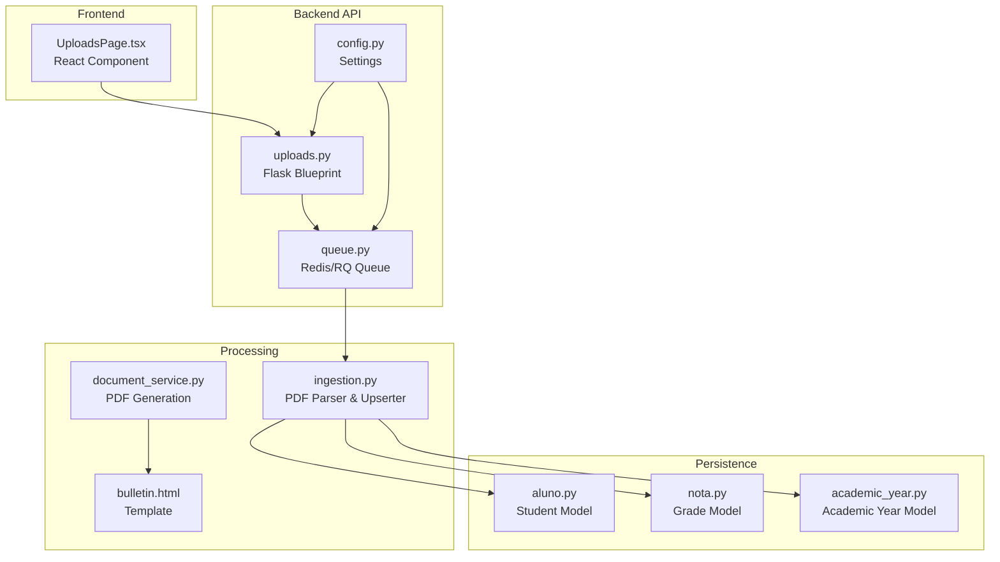
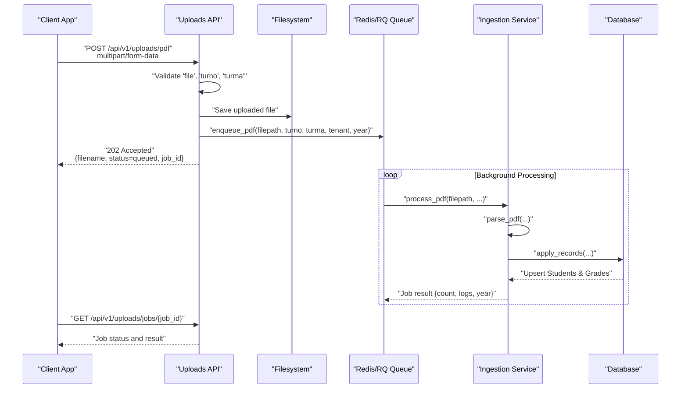
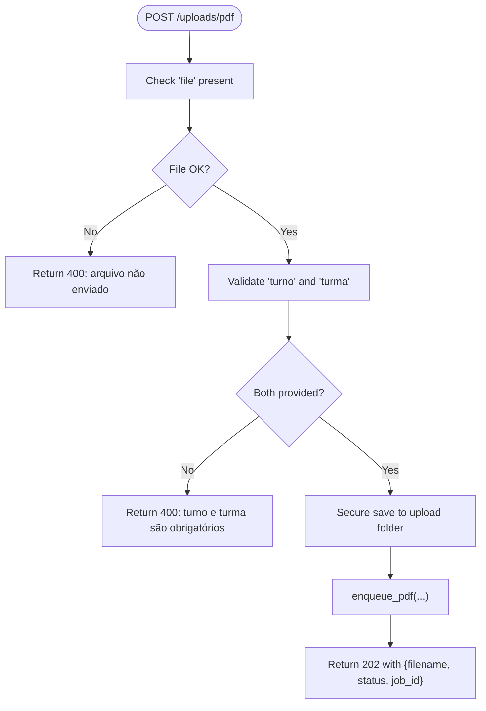
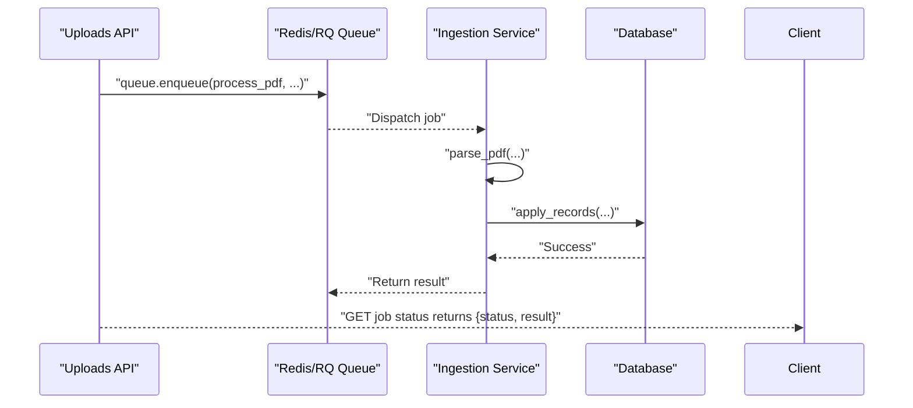
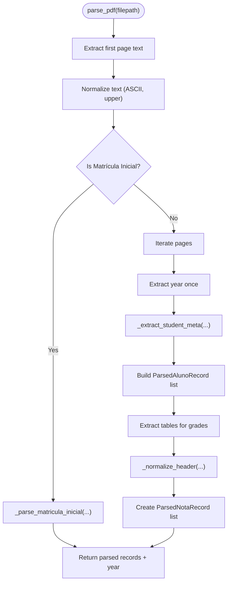
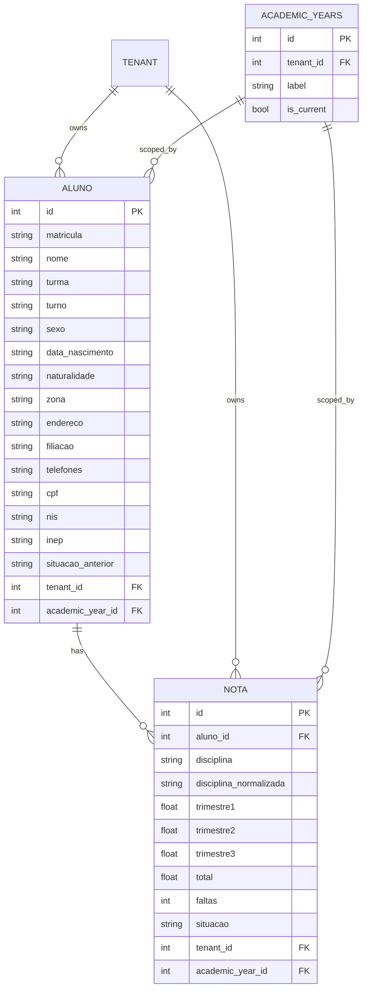
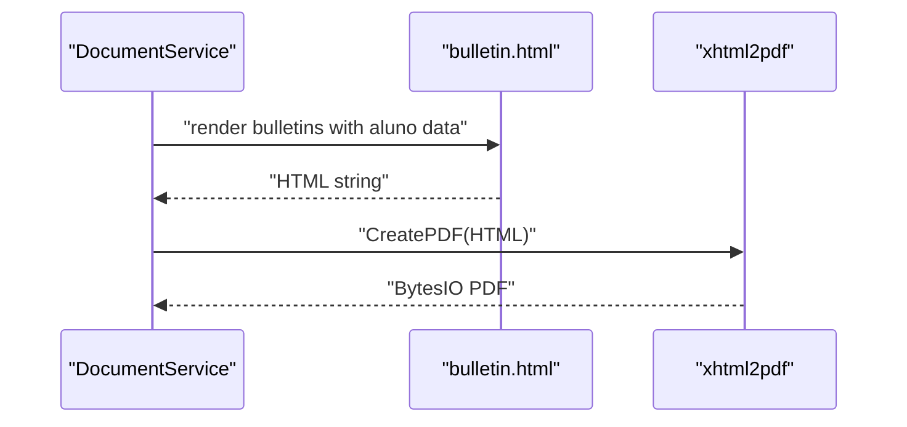
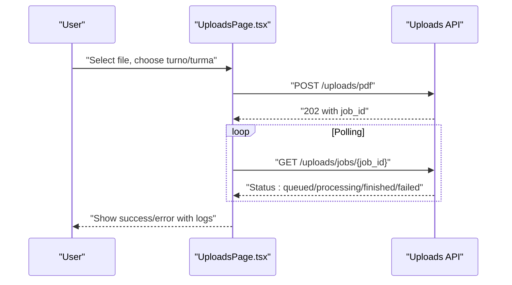
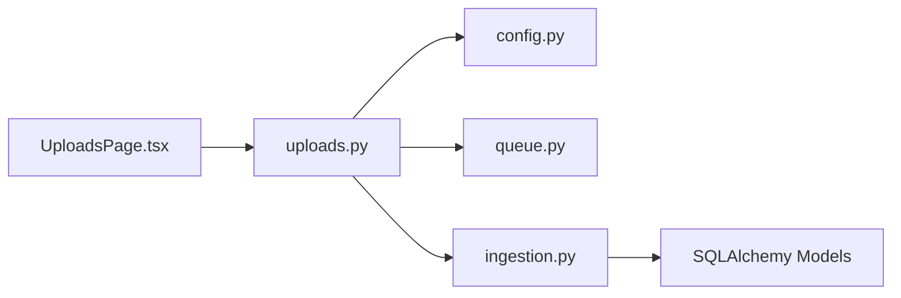

# Document Processing API

<cite>
**Referenced Files in This Document**
- [uploads.py](file://backend/app/api/v1/uploads.py)
- [ingestion.py](file://backend/app/services/ingestion.py)
- [document_service.py](file://backend/app/services/document_service.py)
- [queue.py](file://backend/app/core/queue.py)
- [config.py](file://backend/app/core/config.py)
- [bulletin.html](file://backend/app/templates/documents/bulletin.html)
- [aluno.py](file://backend/app/models/aluno.py)
- [nota.py](file://backend/app/models/nota.py)
- [academic_year.py](file://backend/app/models/academic_year.py)
- [UploadsPage.tsx](file://frontend/src/features/uploads/UploadsPage.tsx)
- [API.md](file://docs/API.md)
</cite>

## Table of Contents
1. [Introduction](#introduction)
2. [Project Structure](#project-structure)
3. [Core Components](#core-components)
4. [Architecture Overview](#architecture-overview)
5. [Detailed Component Analysis](#detailed-component-analysis)
6. [Dependency Analysis](#dependency-analysis)
7. [Performance Considerations](#performance-considerations)
8. [Troubleshooting Guide](#troubleshooting-guide)
9. [Conclusion](#conclusion)
10. [Appendices](#appendices)

## Introduction
This document describes the Document Processing API responsible for uploading, validating, extracting, and persisting academic report data from PDF documents. It covers the PDF upload handling, background job processing, asynchronous status polling, data extraction workflows, document validation, and error handling. It also documents schemas for file uploads, processing status, and extracted data, along with security considerations and supported formats.

## Project Structure
The document processing pipeline spans the backend API layer, ingestion service, database models, and the frontend upload interface. The key components are organized as follows:
- API Layer: Upload endpoints for PDF files and job status retrieval
- Ingestion Service: PDF parsing, data normalization, and persistence
- Background Queue: Redis/RQ-based job queue for asynchronous processing
- Database Models: Student and grade data persistence
- Frontend: Upload form with progress feedback and status polling
- Templates: HTML rendering for generated PDF reports

**Diagram sources**
- [uploads.py:13-78](file://backend/app/api/v1/uploads.py#L13-L78)
- [ingestion.py:72-121](file://backend/app/services/ingestion.py#L72-L121)
- [queue.py:1-12](file://backend/app/core/queue.py#L1-L12)
- [config.py:9-60](file://backend/app/core/config.py#L9-L60)
- [document_service.py:6-27](file://backend/app/services/document_service.py#L6-L27)
- [bulletin.html:1-345](file://backend/app/templates/documents/bulletin.html#L1-L345)
- [aluno.py:8-36](file://backend/app/models/aluno.py#L8-L36)
- [nota.py:9-24](file://backend/app/models/nota.py#L9-L24)
- [academic_year.py:6-16](file://backend/app/models/academic_year.py#L6-L16)
- [UploadsPage.tsx:22-209](file://frontend/src/features/uploads/UploadsPage.tsx#L22-L209)

**Section sources**
- [uploads.py:13-78](file://backend/app/api/v1/uploads.py#L13-L78)
- [ingestion.py:72-121](file://backend/app/services/ingestion.py#L72-L121)
- [queue.py:1-12](file://backend/app/core/queue.py#L1-L12)
- [config.py:9-60](file://backend/app/core/config.py#L9-L60)
- [UploadsPage.tsx:22-209](file://frontend/src/features/uploads/UploadsPage.tsx#L22-L209)

## Core Components
- Upload Endpoint: Accepts multipart/form-data with file, validates presence of required form fields, saves file securely, enqueues background processing, and returns job metadata.
- Ingestion Service: Parses PDFs, extracts student and grade data, normalizes formats, resolves academic year, and upserts records into the database.
- Background Queue: Uses Redis/RQ to schedule and execute long-running PDF processing jobs asynchronously.
- Data Models: Persist student profiles, grades, and academic years with tenant-aware scoping.
- Frontend Upload Page: Provides a form for selecting PDFs, specifying class period and classroom, and polling job status.

**Section sources**
- [uploads.py:16-56](file://backend/app/api/v1/uploads.py#L16-L56)
- [ingestion.py:86-121](file://backend/app/services/ingestion.py#L86-L121)
- [queue.py:1-12](file://backend/app/core/queue.py#L1-L12)
- [aluno.py:8-36](file://backend/app/models/aluno.py#L8-L36)
- [nota.py:9-24](file://backend/app/models/nota.py#L9-L24)
- [academic_year.py:6-16](file://backend/app/models/academic_year.py#L6-L16)
- [UploadsPage.tsx:22-209](file://frontend/src/features/uploads/UploadsPage.tsx#L22-L209)

## Architecture Overview
The system implements an asynchronous ingestion pipeline:
1. Client uploads a PDF via the upload endpoint.
2. The server validates inputs, persists the file, and enqueues a background job.
3. The worker processes the PDF, normalizes data, and updates the database.
4. Clients poll the job status endpoint until completion or failure.

**Diagram sources**
- [uploads.py:16-56](file://backend/app/api/v1/uploads.py#L16-L56)
- [ingestion.py:72-121](file://backend/app/services/ingestion.py#L72-L121)
- [queue.py:1-12](file://backend/app/core/queue.py#L1-L12)

## Detailed Component Analysis

### Upload Endpoint
- Purpose: Receive PDF uploads with class period and classroom context, validate inputs, save file, and enqueue background processing.
- Authentication: Requires JWT Bearer token.
- Request:
  - Method: POST
  - Path: /api/v1/uploads/pdf
  - Headers: Authorization: Bearer {token}
  - Content-Type: multipart/form-data
  - Fields:
    - file: PDF file (required)
    - turno: Class period (required)
    - turma: Classroom (required)
- Response:
  - 202 Accepted with JSON containing filename, status, job_id, and submitted metadata.
- Validation:
  - Rejects requests without file or missing turno/turma.
  - Sanitizes filenames to prevent path traversal.
  - Creates upload directory structure normalized from turno/turma segments.

**Diagram sources**
- [uploads.py:16-56](file://backend/app/api/v1/uploads.py#L16-L56)

**Section sources**
- [uploads.py:16-56](file://backend/app/api/v1/uploads.py#L16-L56)

### Background Job Processing
- Queue: Redis/RQ configured via settings.
- Job Enqueue:
  - enqueue_pdf schedules process_pdf with timeout and tenant/year context.
- Job Execution:
  - process_pdf orchestrates parsing, academic year resolution, and data application.
  - Returns structured result with processed count, logs, and year label.
- Job Status Retrieval:
  - GET /api/v1/uploads/jobs/{job_id} fetches job status and result if finished.

**Diagram sources**
- [ingestion.py:72-121](file://backend/app/services/ingestion.py#L72-L121)
- [queue.py:1-12](file://backend/app/core/queue.py#L1-L12)
- [uploads.py:58-76](file://backend/app/api/v1/uploads.py#L58-L76)

**Section sources**
- [ingestion.py:72-121](file://backend/app/services/ingestion.py#L72-L121)
- [queue.py:1-12](file://backend/app/core/queue.py#L1-L12)
- [uploads.py:58-76](file://backend/app/api/v1/uploads.py#L58-L76)

### PDF Parsing and Data Extraction
- Parsing Strategy:
  - Detects standard bulletin format and Matrícula Inicial/Final format.
  - Extracts student metadata (name, registration number, class, period).
  - Parses grade tables with normalized headers and numeric values.
- Normalization:
  - Turma names standardized (e.g., "6º A", "6/7 A" for EJA night).
  - Disciplina identifiers normalized to slug-like keys.
  - Numeric parsing handles percentages and comma decimals.
- Academic Year Resolution:
  - Extracts year from PDF when available; otherwise uses provided tenant/year context.
  - Creates AcademicYear if missing and marks as current.
- Upsert Logic:
  - Updates existing students by registration number or name fallback.
  - Ensures unique student-user linkage and cleans placeholders.

**Diagram sources**
- [ingestion.py:141-223](file://backend/app/services/ingestion.py#L141-L223)
- [ingestion.py:226-299](file://backend/app/services/ingestion.py#L226-L299)

**Section sources**
- [ingestion.py:141-223](file://backend/app/services/ingestion.py#L141-L223)
- [ingestion.py:226-299](file://backend/app/services/ingestion.py#L226-L299)

### Data Models and Persistence
- Student Model (Aluno):
  - Unique registration number per tenant.
  - Personal and contact details from Matrícula Inicial.
  - Academic year association and class/period normalization.
- Grade Model (Nota):
  - Per-discipline grades with trimesters and totals.
  - Tenant and academic year scoping.
- Academic Year Model:
  - Tenant-scoped academic years with current flag.

**Diagram sources**
- [aluno.py:8-36](file://backend/app/models/aluno.py#L8-L36)
- [nota.py:9-24](file://backend/app/models/nota.py#L9-L24)
- [academic_year.py:6-16](file://backend/app/models/academic_year.py#L6-L16)

**Section sources**
- [aluno.py:8-36](file://backend/app/models/aluno.py#L8-L36)
- [nota.py:9-24](file://backend/app/models/nota.py#L9-L24)
- [academic_year.py:6-16](file://backend/app/models/academic_year.py#L6-L16)

### Document Generation Pipeline
- HTML Template: Renders individual student report cards with grades and summary metrics.
- PDF Generation: Converts rendered HTML to PDF in memory using xhtml2pdf.
- Integration: Used by the document service to produce printable reports.

**Diagram sources**
- [document_service.py:6-27](file://backend/app/services/document_service.py#L6-L27)
- [bulletin.html:1-345](file://backend/app/templates/documents/bulletin.html#L1-L345)

**Section sources**
- [document_service.py:6-27](file://backend/app/services/document_service.py#L6-L27)
- [bulletin.html:1-345](file://backend/app/templates/documents/bulletin.html#L1-L345)

### Frontend Upload Experience
- Features:
  - Select PDF, choose class period and classroom.
  - Real-time feedback and progress indication.
  - Polling for job status with automatic updates.
- Behavior:
  - Submits form to upload endpoint and stores job_id.
  - Polls job status endpoint every 2 seconds while processing.
  - Displays success with processed count and warnings, or error messages.

**Diagram sources**
- [UploadsPage.tsx:22-209](file://frontend/src/features/uploads/UploadsPage.tsx#L22-L209)
- [uploads.py:58-76](file://backend/app/api/v1/uploads.py#L58-L76)

**Section sources**
- [UploadsPage.tsx:22-209](file://frontend/src/features/uploads/UploadsPage.tsx#L22-L209)
- [uploads.py:58-76](file://backend/app/api/v1/uploads.py#L58-L76)

## Dependency Analysis
- API depends on:
  - Core configuration for upload folder and Redis URL.
  - Queue module for job scheduling.
  - Ingestion service for processing logic.
- Ingestion service depends on:
  - PDF parsing library for text/table extraction.
  - Database session management and ORM models.
  - Academic year resolution and tenant scoping.
- Frontend depends on:
  - API endpoints for upload and job status.
  - React hooks for mutation and polling.

**Diagram sources**
- [uploads.py:9-10](file://backend/app/api/v1/uploads.py#L9-L10)
- [config.py:9-60](file://backend/app/core/config.py#L9-L60)
- [queue.py:1-12](file://backend/app/core/queue.py#L1-L12)
- [ingestion.py:16-18](file://backend/app/services/ingestion.py#L16-L18)
- [UploadsPage.tsx:18-34](file://frontend/src/features/uploads/UploadsPage.tsx#L18-L34)

**Section sources**
- [uploads.py:9-10](file://backend/app/api/v1/uploads.py#L9-L10)
- [config.py:9-60](file://backend/app/core/config.py#L9-L60)
- [queue.py:1-12](file://backend/app/core/queue.py#L1-L12)
- [ingestion.py:16-18](file://backend/app/services/ingestion.py#L16-L18)
- [UploadsPage.tsx:18-34](file://frontend/src/features/uploads/UploadsPage.tsx#L18-L34)

## Performance Considerations
- Asynchronous Processing: Long-running PDF parsing runs off the main request thread via Redis/RQ, preventing timeouts and blocking.
- Batch Upserts: Student and grade records are upserted in batches per job to minimize database round trips.
- Text Normalization: Pre-normalized text reduces repeated processing overhead.
- Memory Efficiency: PDF parsing reads incrementally; generated PDFs are streamed to reduce memory footprint.
- Scalability: Redis/RQ supports horizontal scaling of workers; consider multiple queues for priority handling.

[No sources needed since this section provides general guidance]

## Troubleshooting Guide
Common issues and resolutions:
- Upload Failures:
  - Missing file or invalid filename: Ensure multipart/form-data includes file and filename passes sanitization.
  - Missing turno/turma: Both are required; include valid values.
- Job Failures:
  - Job not found: Verify job_id correctness and that Redis/RQ is reachable.
  - Processing errors: Inspect job result logs for parsing hints (e.g., missing student metadata).
- Data Quality:
  - Empty records: PDF may lack expected student metadata; confirm standard format.
  - Ambiguous names: Name-based fallback prevents incorrect merges; ensure unique names or consistent IDs.
- Backend Errors:
  - 400 Bad Request: Validate request payload and headers.
  - 401/403: Confirm JWT validity and permissions.
  - 500 Internal Server Error: Check Redis connectivity and database availability.

**Section sources**
- [uploads.py:19-30](file://backend/app/api/v1/uploads.py#L19-L30)
- [uploads.py:58-76](file://backend/app/api/v1/uploads.py#L58-L76)
- [ingestion.py:86-121](file://backend/app/services/ingestion.py#L86-L121)

## Conclusion
The Document Processing API provides a robust, asynchronous pipeline for ingesting academic PDFs, extracting structured data, and persisting it into the database. With background job processing, tenant-aware scoping, and comprehensive validation, it supports scalable document ingestion workflows suitable for educational environments.

[No sources needed since this section summarizes without analyzing specific files]

## Appendices

### API Schemas and Examples

- Upload Request
  - Method: POST
  - Path: /api/v1/uploads/pdf
  - Headers: Authorization: Bearer {token}, Content-Type: multipart/form-data
  - Body:
    - file: PDF file
    - turno: string (required)
    - turma: string (required)
  - Example Response (202):
    - {
        "filename": "boletim_2024.pdf",
        "status": "queued",
        "job_id": "abc123",
        "turno": "Matutino",
        "turma": "6º A"
      }

- Job Status Request
  - Method: GET
  - Path: /api/v1/uploads/jobs/{job_id}
  - Response (example):
    - {
        "job_id": "abc123",
        "status": "finished",
        "result": {
          "count": 32,
          "logs": ["Página X: Aluno sem matrícula ignorado."],
          "year": "2024"
        },
        "enqueued_at": "2026-01-01T10:00:00Z",
        "started_at": "2026-01-01T10:00:05Z",
        "ended_at": "2026-01-01T10:05:00Z",
        "meta": {}
      }

- Extracted Data Models
  - Student Record:
    - matricula: string
    - nome: string
    - turma: string
    - turno: string
    - notas: array of Grade Records
    - personal info: sexo, data_nascimento, naturalidade, zona, endereco, filiacao, telefones, cpf, nis, inep, situacao_anterior
  - Grade Record:
    - disciplina: string
    - disciplina_normalizada: string
    - trimestre1: number
    - trimestre2: number
    - trimestre3: number
    - total: number
    - faltas: integer
    - situacao: string

- Supported Formats and Limits
  - Format: PDF (application/pdf)
  - Size Limitations: Not enforced in code; consider setting limits at ingress (e.g., reverse proxy or framework) to prevent resource exhaustion.
  - Security: Filename sanitization prevents path traversal; validate MIME type at ingress for production.

- Security Considerations
  - Authentication: JWT required for all protected endpoints.
  - Authorization: Role-based access (admin, coordinator) for upload operations.
  - Input Validation: Sanitized filenames and required form fields.
  - Data Privacy: Tenant scoping ensures isolation; ensure transport encryption (HTTPS) and secure storage.

**Section sources**
- [uploads.py:16-56](file://backend/app/api/v1/uploads.py#L16-L56)
- [uploads.py:58-76](file://backend/app/api/v1/uploads.py#L58-L76)
- [ingestion.py:21-52](file://backend/app/services/ingestion.py#L21-L52)
- [ingestion.py:524-553](file://backend/app/services/ingestion.py#L524-L553)
- [API.md:599-631](file://docs/API.md#L599-L631)