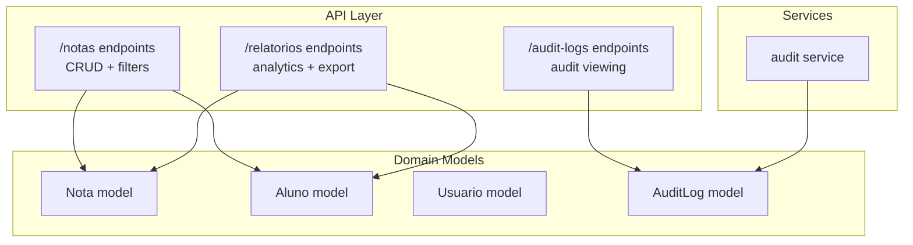
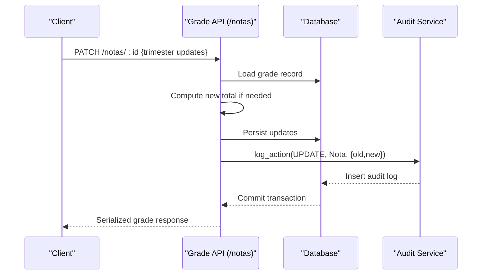
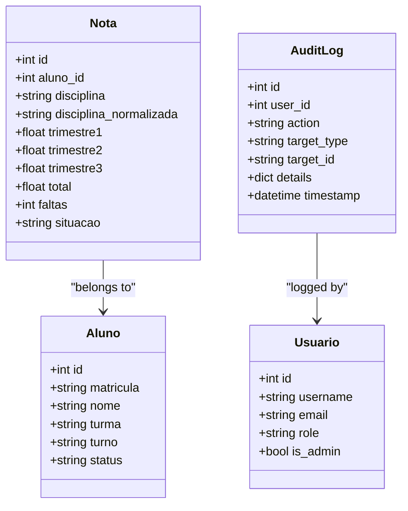
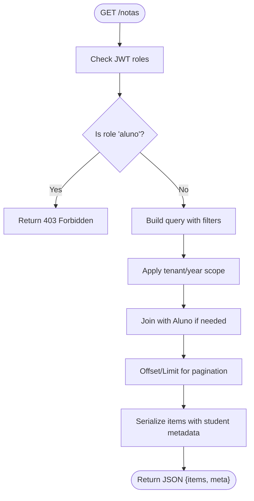
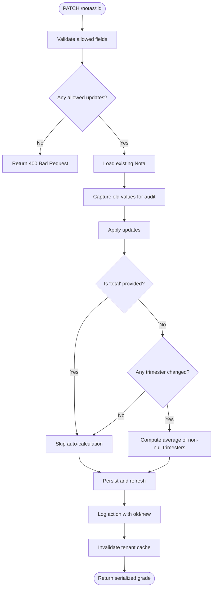
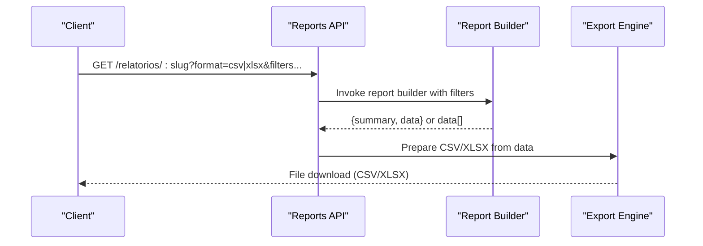
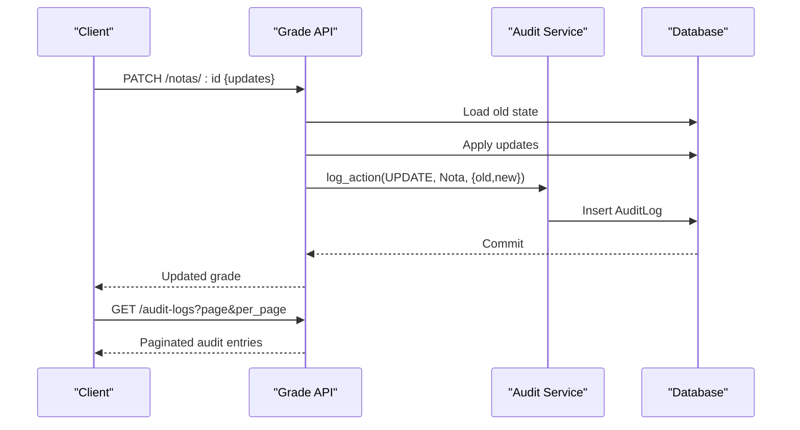
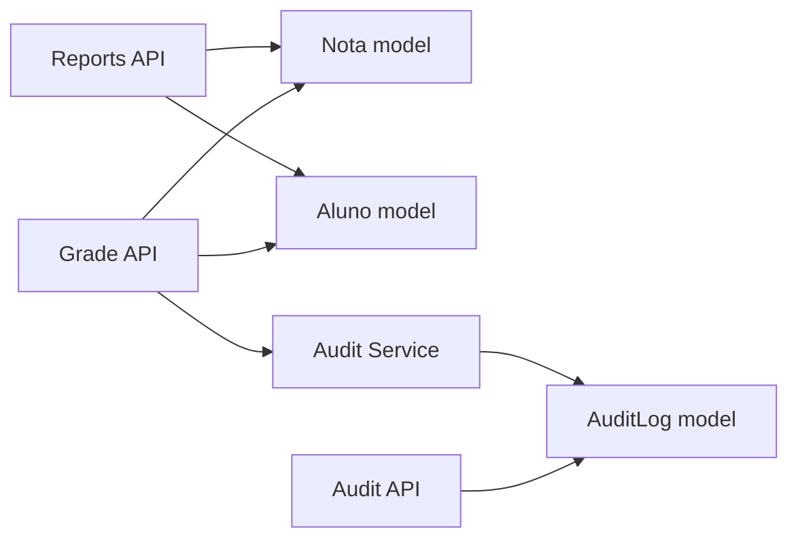

# Grade Tracking API

<cite>
**Referenced Files in This Document**
- [notas.py](file://backend/app/api/v1/notas.py)
- [relatorios.py](file://backend/app/api/v1/relatorios.py)
- [audit.py](file://backend/app/api/v1/audit.py)
- [audit_log.py](file://backend/app/models/audit_log.py)
- [nota.py](file://backend/app/models/nota.py)
- [aluno.py](file://backend/app/models/aluno.py)
- [usuario.py](file://backend/app/models/usuario.py)
- [aluno_schema.py](file://backend/app/schemas/aluno.py)
- [audit_service.py](file://backend/app/services/audit.py)
</cite>

## Table of Contents
1. [Introduction](#introduction)
2. [Project Structure](#project-structure)
3. [Core Components](#core-components)
4. [Architecture Overview](#architecture-overview)
5. [Detailed Component Analysis](#detailed-component-analysis)
6. [Dependency Analysis](#dependency-analysis)
7. [Performance Considerations](#performance-considerations)
8. [Troubleshooting Guide](#troubleshooting-guide)
9. [Conclusion](#conclusion)

## Introduction
This document provides comprehensive API documentation for grade management and academic tracking endpoints. It covers grade entry, modification, and retrieval operations, along with schemas for grade records, subject assignments, and grading scales. It explains grade calculation algorithms (weighted averages), gradebook synchronization, batch-grade update patterns, grade export functionality, academic performance calculations, validation rules, teacher permissions, and grade history tracking for audit purposes.

## Project Structure
The grade tracking functionality spans several backend modules:
- API endpoints for grade CRUD and filtering
- Models for grades and students
- Schemas for serialization
- Reporting endpoints for exports and analytics
- Audit logging for grade modifications

**Diagram sources**
- [notas.py:34-189](file://backend/app/api/v1/notas.py#L34-L189)
- [relatorios.py:457-537](file://backend/app/api/v1/relatorios.py#L457-L537)
- [audit.py:9-39](file://backend/app/api/v1/audit.py#L9-L39)
- [nota.py:9-24](file://backend/app/models/nota.py#L9-L24)
- [aluno.py:8-36](file://backend/app/models/aluno.py#L8-L36)
- [usuario.py:8-30](file://backend/app/models/usuario.py#L8-L30)
- [audit_log.py:7-28](file://backend/app/models/audit_log.py#L7-L28)
- [audit_service.py:4-16](file://backend/app/services/audit.py#L4-L16)

**Section sources**
- [notas.py:1-190](file://backend/app/api/v1/notas.py#L1-L190)
- [relatorios.py:1-538](file://backend/app/api/v1/relatorios.py#L1-L538)
- [audit.py:1-39](file://backend/app/api/v1/audit.py#L1-L39)
- [nota.py:1-24](file://backend/app/models/nota.py#L1-L24)
- [aluno.py:1-36](file://backend/app/models/aluno.py#L1-L36)
- [usuario.py:1-30](file://backend/app/models/usuario.py#L1-L30)
- [audit_log.py:1-28](file://backend/app/models/audit_log.py#L1-L28)
- [aluno_schema.py:4-17](file://backend/app/schemas/aluno.py#L4-L17)
- [audit_service.py:1-16](file://backend/app/services/audit.py#L1-L16)

## Core Components
- Grade record model: stores discipline, three trimester scores, computed total, absences, and status.
- Student model: links grades to student profiles with class and shift metadata.
- Grade API: GET filters, GET paginated list, PATCH update with auto-calculation and audit logging.
- Reporting API: analytics builders and CSV/XLSX export pipeline.
- Audit API: admin-only endpoint to list audit logs.

Key capabilities:
- Automatic total computation from trimesters when not explicitly provided.
- Tenant and academic year scoping via request context.
- Role-based access control restricting student users from grade queries.
- Audit trail capturing old/new values for modifications.

**Section sources**
- [notas.py:12-31](file://backend/app/api/v1/notas.py#L12-L31)
- [notas.py:77-122](file://backend/app/api/v1/notas.py#L77-L122)
- [notas.py:124-187](file://backend/app/api/v1/notas.py#L124-L187)
- [relatorios.py:442-454](file://backend/app/api/v1/relatorios.py#L442-L454)
- [audit.py:12-37](file://backend/app/api/v1/audit.py#L12-L37)
- [audit_service.py:4-16](file://backend/app/services/audit.py#L4-L16)

## Architecture Overview
The grade tracking API follows a layered architecture:
- API layer exposes endpoints for grade CRUD and reporting.
- Domain models encapsulate persistence and relationships.
- Services handle cross-cutting concerns like audit logging.
- Frontend integrates with grade lists and export flows.

**Diagram sources**
- [notas.py:124-187](file://backend/app/api/v1/notas.py#L124-L187)
- [audit_service.py:4-16](file://backend/app/services/audit.py#L4-L16)

## Detailed Component Analysis

### Grade Model and Schemas
The grade model defines the persistent structure for academic records, while Pydantic schemas support serialization and client-side typing.

**Diagram sources**
- [nota.py:9-24](file://backend/app/models/nota.py#L9-L24)
- [aluno.py:8-36](file://backend/app/models/aluno.py#L8-L36)
- [usuario.py:8-30](file://backend/app/models/usuario.py#L8-L30)
- [audit_log.py:7-28](file://backend/app/models/audit_log.py#L7-L28)

**Section sources**
- [nota.py:9-24](file://backend/app/models/nota.py#L9-L24)
- [aluno.py:8-36](file://backend/app/models/aluno.py#L8-L36)
- [aluno_schema.py:4-17](file://backend/app/schemas/aluno.py#L4-L17)
- [audit_log.py:7-28](file://backend/app/models/audit_log.py#L7-L28)

### Grade Retrieval and Filtering
- Endpoint: GET /notas
- Supports filtering by class, shift, and discipline.
- Paginates results with page/per_page parameters.
- Respects tenant and academic year scoping.
- Student role is blocked from accessing grade listings.

**Diagram sources**
- [notas.py:77-122](file://backend/app/api/v1/notas.py#L77-L122)

**Section sources**
- [notas.py:77-122](file://backend/app/api/v1/notas.py#L77-L122)

### Grade Calculation and Auto-total
- Allowed update fields include trimester scores, total, absences, and status.
- If total is not provided and any trimester is updated, the API computes the average of non-null trimesters.
- Null grades are excluded from averaging; missing grades are not treated as zeros.

**Diagram sources**
- [notas.py:124-187](file://backend/app/api/v1/notas.py#L124-L187)

**Section sources**
- [notas.py:124-187](file://backend/app/api/v1/notas.py#L124-L187)

### Grade Export Functionality
- Reports endpoint supports CSV and XLSX export for multiple built-in reports.
- Export is triggered by passing format=csv or format=xlsx.
- The reporting engine builds normalized datasets and streams downloadable files.

**Diagram sources**
- [relatorios.py:460-537](file://backend/app/api/v1/relatorios.py#L460-L537)

**Section sources**
- [relatorios.py:460-537](file://backend/app/api/v1/relatorios.py#L460-L537)

### Academic Performance Calculations
- Built-in reports compute averages, risk students, heatmap, attendance-grade correlation, class radar, and top movers.
- These leverage SQL aggregation functions and normalization for discipline names.

Examples of calculations:
- Average per class and school-wide averages.
- Risk identification using thresholds for grades and absences.
- Heatmaps aggregating discipline and class averages.

**Section sources**
- [relatorios.py:67-94](file://backend/app/api/v1/relatorios.py#L67-L94)
- [relatorios.py:97-130](file://backend/app/api/v1/relatorios.py#L97-L130)
- [relatorios.py:223-252](file://backend/app/api/v1/relatorios.py#L223-L252)
- [relatorios.py:255-290](file://backend/app/api/v1/relatorios.py#L255-L290)
- [relatorios.py:293-324](file://backend/app/api/v1/relatorios.py#L293-L324)
- [relatorios.py:327-368](file://backend/app/api/v1/relatorios.py#L327-L368)
- [relatorios.py:371-403](file://backend/app/api/v1/relatorios.py#L371-L403)
- [relatorios.py:406-439](file://backend/app/api/v1/relatorios.py#L406-L439)

### Grade Validation Rules and Permissions
- Role restrictions:
  - Students cannot list grades.
  - Only administrators can modify grades.
- Field validation:
  - Only allowed fields may be updated.
  - Updates are applied atomically; invalid fields are ignored.
- Data integrity:
  - Auto-calculation excludes null trimester values.
  - Tenant and academic year scoping enforced on queries.

**Section sources**
- [notas.py:79-81](file://backend/app/api/v1/notas.py#L79-L81)
- [notas.py:129-130](file://backend/app/api/v1/notas.py#L129-L130)
- [notas.py:133-136](file://backend/app/api/v1/notas.py#L133-L136)

### Grade History Tracking and Audit
- Every grade update logs an audit entry with old and new values.
- Audit logs include user identity, action type, target, and details snapshot.
- Admin-only endpoint to list audit logs with pagination.

**Diagram sources**
- [notas.py:145-179](file://backend/app/api/v1/notas.py#L145-L179)
- [audit_service.py:4-16](file://backend/app/services/audit.py#L4-L16)
- [audit.py:12-37](file://backend/app/api/v1/audit.py#L12-L37)
- [audit_log.py:20-28](file://backend/app/models/audit_log.py#L20-L28)

**Section sources**
- [notas.py:145-179](file://backend/app/api/v1/notas.py#L145-L179)
- [audit_service.py:4-16](file://backend/app/services/audit.py#L4-L16)
- [audit.py:12-37](file://backend/app/api/v1/audit.py#L12-L37)
- [audit_log.py:20-28](file://backend/app/models/audit_log.py#L20-L28)

## Dependency Analysis
- Grade API depends on:
  - Nota and Aluno models for persistence and joins.
  - Audit service for logging actions.
  - Tenant and academic year context for scoping.
- Report API depends on:
  - Nota and Aluno models for aggregations.
  - Export engine for CSV/XLSX generation.
- Audit API depends on:
  - AuditLog model for storage and retrieval.

**Diagram sources**
- [notas.py:7-9](file://backend/app/api/v1/notas.py#L7-L9)
- [relatorios.py:7-8](file://backend/app/api/v1/relatorios.py#L7-L8)
- [audit.py:1-7](file://backend/app/api/v1/audit.py#L1-L7)
- [audit_service.py:1-2](file://backend/app/services/audit.py#L1-L2)

**Section sources**
- [notas.py:7-9](file://backend/app/api/v1/notas.py#L7-L9)
- [relatorios.py:7-8](file://backend/app/api/v1/relatorios.py#L7-L8)
- [audit.py:1-7](file://backend/app/api/v1/audit.py#L1-L7)
- [audit_service.py:1-2](file://backend/app/services/audit.py#L1-L2)

## Performance Considerations
- Prefer filtered queries with tenant and academic year scoping to reduce dataset size.
- Use pagination (page/per_page) to avoid large payloads.
- Auto-calculation runs in-memory after loading the record; keep updates minimal to reduce CPU overhead.
- Export endpoints stream files; ensure appropriate limits to prevent memory spikes.
- Consider caching strategies for frequently accessed grade lists, with cache invalidation on updates.

## Troubleshooting Guide
Common issues and resolutions:
- Access denied when listing grades:
  - Ensure the caller has a role that is not "aluno".
- Unauthorized to update grades:
  - Only users with administrative privileges can modify grades.
- No updates applied:
  - Verify that allowed fields are included in the request payload.
- Unexpected nulls in totals:
  - Auto-calculation excludes null trimester values; ensure at least one non-null trimester is updated to trigger recalculation.
- Empty export:
  - Confirm that the report has data for the selected filters and that format is either csv or xlsx.
- Audit logs not visible:
  - Ensure the requester has administrative privileges and that the audit log table contains entries.

**Section sources**
- [notas.py:79-81](file://backend/app/api/v1/notas.py#L79-L81)
- [notas.py:129-130](file://backend/app/api/v1/notas.py#L129-L130)
- [notas.py:133-136](file://backend/app/api/v1/notas.py#L133-L136)
- [notas.py:157-166](file://backend/app/api/v1/notas.py#L157-L166)
- [relatorios.py:482-503](file://backend/app/api/v1/relatorios.py#L482-L503)
- [audit.py:12-37](file://backend/app/api/v1/audit.py#L12-L37)

## Conclusion
The Grade Tracking API provides robust endpoints for managing academic records, including secure CRUD operations, intelligent auto-calculation, comprehensive filtering, and export capabilities. With tenant and academic year scoping, strict role-based access controls, and detailed audit logging, the system ensures data integrity and transparency for grade management and reporting.