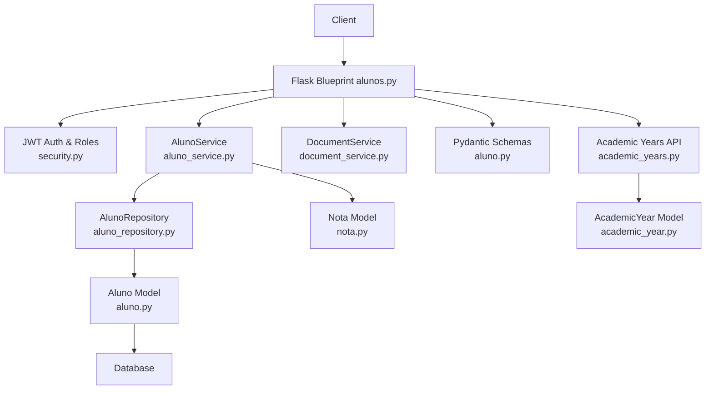
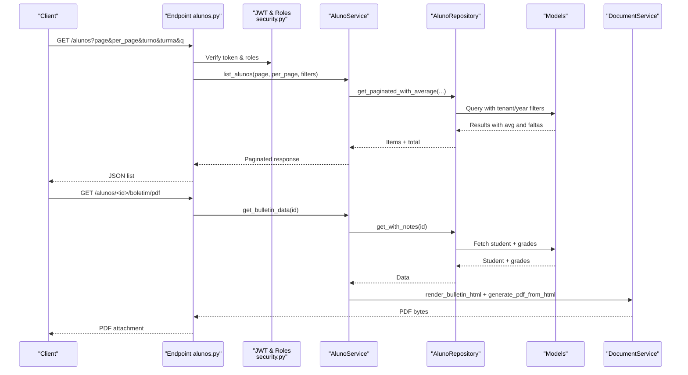
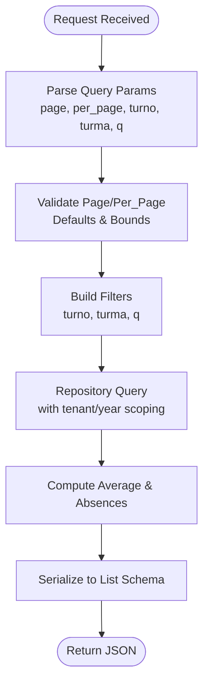
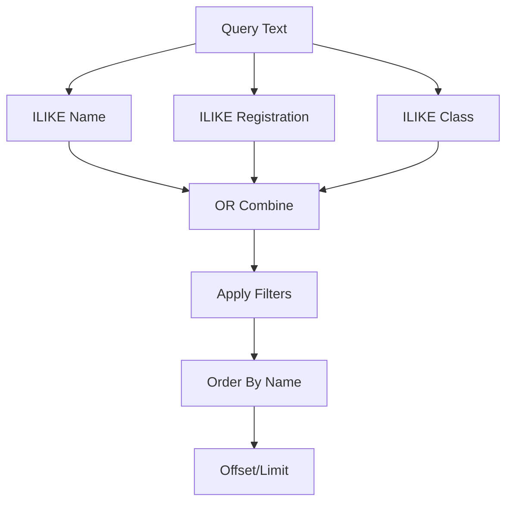
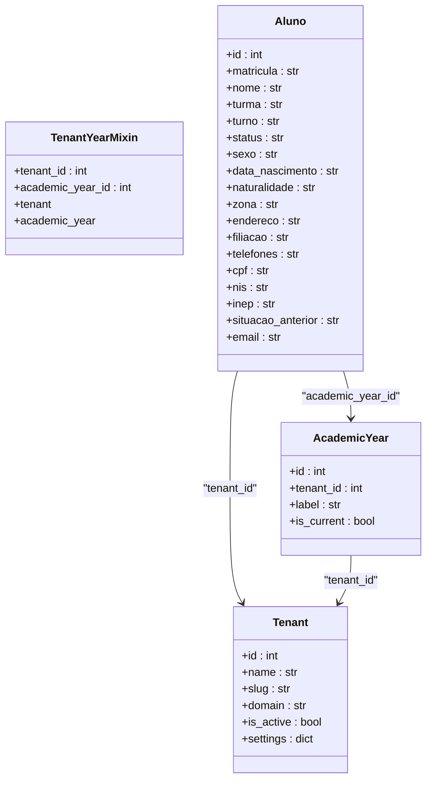
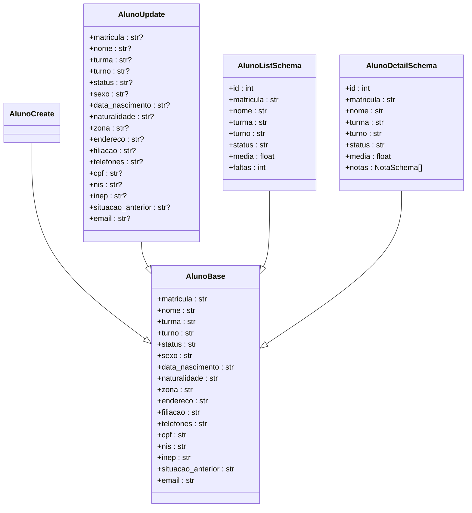
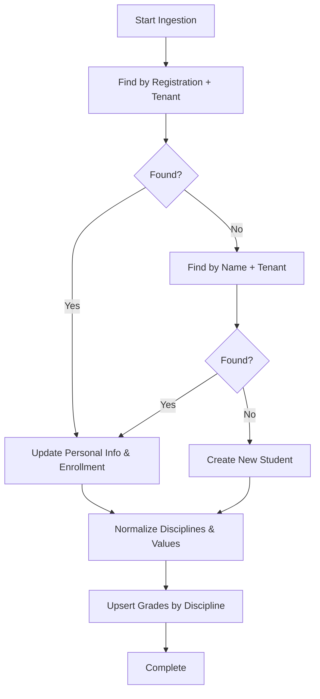
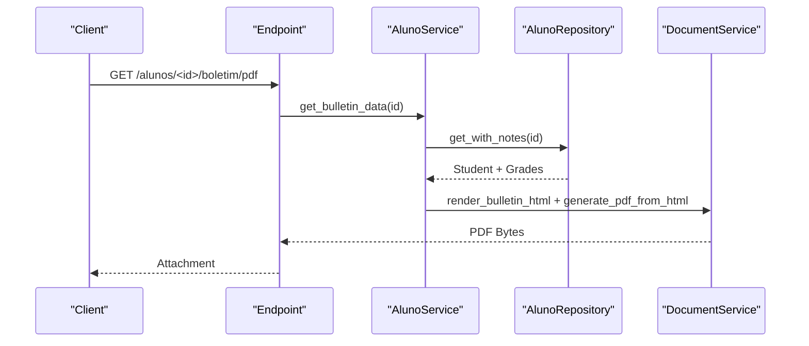
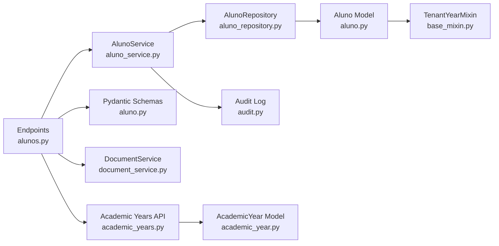

# Student Management API

<cite>
**Referenced Files in This Document**
- [alunos.py](file://backend/app/api/v1/alunos.py)
- [aluno.py](file://backend/app/models/aluno.py)
- [aluno.py](file://backend/app/schemas/aluno.py)
- [aluno_repository.py](file://backend/app/repositories/aluno_repository.py)
- [aluno_service.py](file://backend/app/services/aluno_service.py)
- [nota.py](file://backend/app/models/nota.py)
- [base_mixin.py](file://backend/app/models/base_mixin.py)
- [academic_years.py](file://backend/app/api/v1/academic_years.py)
- [academic_year.py](file://backend/app/models/academic_year.py)
- [ingestion.py](file://backend/app/services/ingestion.py)
- [document_service.py](file://backend/app/services/document_service.py)
- [security.py](file://backend/app/core/security.py)
- [audit.py](file://backend/app/services/audit.py)
- [tenant.py](file://backend/app/models/tenant.py)
</cite>

## Table of Contents
1. [Introduction](#introduction)
2. [Project Structure](#project-structure)
3. [Core Components](#core-components)
4. [Architecture Overview](#architecture-overview)
5. [Detailed Component Analysis](#detailed-component-analysis)
6. [Dependency Analysis](#dependency-analysis)
7. [Performance Considerations](#performance-considerations)
8. [Troubleshooting Guide](#troubleshooting-guide)
9. [Conclusion](#conclusion)
10. [Appendices](#appendices)

## Introduction
This document describes the Student Management API, focusing on CRUD operations for student profiles, enrollment data, and personal information. It explains request and response schemas, search and filtering, bulk ingestion, data validation rules, enrollment workflows, guardian information handling, student status management, data privacy considerations, export capabilities, and integration with academic systems.

## Project Structure
The student management API is implemented in the backend Flask application under the v1 API namespace. Key layers:
- API endpoints: request routing, JWT authentication, role-based access control, and response serialization
- Services: orchestrate business logic and audit logging
- Repositories: encapsulate database queries with tenant and academic year scoping
- Models: define persistence schema with tenant/year isolation
- Schemas: define Pydantic models for validation and serialization
- Utilities: document generation, ingestion, security, and audit logging

**Diagram sources**
- [alunos.py:12-148](file://backend/app/api/v1/alunos.py#L12-L148)
- [aluno_service.py:15-156](file://backend/app/services/aluno_service.py#L15-L156)
- [aluno_repository.py:8-105](file://backend/app/repositories/aluno_repository.py#L8-L105)
- [aluno.py:8-36](file://backend/app/models/aluno.py#L8-L36)
- [nota.py:9-24](file://backend/app/models/nota.py#L9-L24)
- [document_service.py:6-27](file://backend/app/services/document_service.py#L6-L27)
- [aluno.py:18-85](file://backend/app/schemas/aluno.py#L18-L85)
- [academic_years.py:7-28](file://backend/app/api/v1/academic_years.py#L7-L28)
- [academic_year.py:6-15](file://backend/app/models/academic_year.py#L6-L15)

**Section sources**
- [alunos.py:12-148](file://backend/app/api/v1/alunos.py#L12-L148)
- [aluno_service.py:15-156](file://backend/app/services/aluno_service.py#L15-L156)
- [aluno_repository.py:8-105](file://backend/app/repositories/aluno_repository.py#L8-L105)
- [aluno.py:8-36](file://backend/app/models/aluno.py#L8-L36)
- [aluno.py:18-85](file://backend/app/schemas/aluno.py#L18-L85)
- [nota.py:9-24](file://backend/app/models/nota.py#L9-L24)
- [academic_years.py:7-28](file://backend/app/api/v1/academic_years.py#L7-L28)
- [academic_year.py:6-15](file://backend/app/models/academic_year.py#L6-L15)
- [document_service.py:6-27](file://backend/app/services/document_service.py#L6-L27)

## Core Components
- API endpoints: list, retrieve, create, update, delete students; PDF bulletin export
- Service layer: orchestrates repository access, computes averages/faltas, logs actions
- Repository layer: paginated queries, joins with grades, tenant/year scoping
- Models: student entity with personal data and relationships; grade entity
- Schemas: validation and serialization for create/update and list/detail responses
- Academic year and tenant scoping: multi-tenant and academic year isolation
- Document generation: HTML rendering and PDF export for student bulletins
- Security and audit: JWT, role checks, and audit logging

**Section sources**
- [alunos.py:15-148](file://backend/app/api/v1/alunos.py#L15-L148)
- [aluno_service.py:20-156](file://backend/app/services/aluno_service.py#L20-L156)
- [aluno_repository.py:12-105](file://backend/app/repositories/aluno_repository.py#L12-L105)
- [aluno.py:8-36](file://backend/app/models/aluno.py#L8-L36)
- [aluno.py:18-85](file://backend/app/schemas/aluno.py#L18-L85)
- [nota.py:9-24](file://backend/app/models/nota.py#L9-L24)
- [base_mixin.py:4-22](file://backend/app/models/base_mixin.py#L4-L22)
- [document_service.py:6-27](file://backend/app/services/document_service.py#L6-L27)
- [audit.py:4-17](file://backend/app/services/audit.py#L4-L17)

## Architecture Overview
The API follows layered architecture:
- Authentication and authorization via JWT and role checks
- Request validation using Pydantic schemas
- Business logic in services with repository abstraction
- Tenant and academic year scoping enforced at query level
- Document generation pipeline for PDF exports

**Diagram sources**
- [alunos.py:15-148](file://backend/app/api/v1/alunos.py#L15-L148)
- [aluno_service.py:20-156](file://backend/app/services/aluno_service.py#L20-L156)
- [aluno_repository.py:12-105](file://backend/app/repositories/aluno_repository.py#L12-L105)
- [document_service.py:6-27](file://backend/app/services/document_service.py#L6-L27)
- [security.py:23-35](file://backend/app/core/security.py#L23-L35)

## Detailed Component Analysis

### API Endpoints and Workflows
- List students: supports pagination, filtering by shift/class/search term; returns items with computed average and absences
- Retrieve student: returns profile and grades with computed average; enforces role-based access for students
- Create student: validates payload using Pydantic; persists and logs action
- Update student: partial updates validated by Pydantic; logs action
- Delete student: removes student; logs action
- Download bulletin PDF: renders HTML from student data and exports to PDF

**Diagram sources**
- [alunos.py:18-42](file://backend/app/api/v1/alunos.py#L18-L42)
- [aluno_repository.py:12-74](file://backend/app/repositories/aluno_repository.py#L12-L74)
- [aluno_service.py:20-61](file://backend/app/services/aluno_service.py#L20-L61)

**Section sources**
- [alunos.py:15-109](file://backend/app/api/v1/alunos.py#L15-L109)
- [aluno_service.py:20-61](file://backend/app/services/aluno_service.py#L20-L61)
- [aluno_repository.py:12-74](file://backend/app/repositories/aluno_repository.py#L12-L74)

### Student Search and Filtering
- Search supports free-text matching across name, registration number, and class
- Filters include shift, class, and pagination parameters
- Results include computed average and total absences

**Diagram sources**
- [aluno_repository.py:42-57](file://backend/app/repositories/aluno_repository.py#L42-L57)
- [alunos.py:25-27](file://backend/app/api/v1/alunos.py#L25-L27)

**Section sources**
- [aluno_repository.py:42-57](file://backend/app/repositories/aluno_repository.py#L42-L57)
- [alunos.py:25-27](file://backend/app/api/v1/alunos.py#L25-L27)

### Student Enrollment and Academic Year Integration
- Academic year selection affects grade aggregation and student data scoping
- Tenant scoping ensures data isolation across institutions
- Enrollment data is linked to academic year and tenant via shared mixins

**Diagram sources**
- [base_mixin.py:4-22](file://backend/app/models/base_mixin.py#L4-L22)
- [aluno.py:8-36](file://backend/app/models/aluno.py#L8-L36)
- [academic_year.py:6-15](file://backend/app/models/academic_year.py#L6-L15)
- [tenant.py:7-22](file://backend/app/models/tenant.py#L7-L22)

**Section sources**
- [base_mixin.py:4-22](file://backend/app/models/base_mixin.py#L4-L22)
- [aluno.py:8-36](file://backend/app/models/aluno.py#L8-L36)
- [academic_year.py:6-15](file://backend/app/models/academic_year.py#L6-L15)
- [tenant.py:7-22](file://backend/app/models/tenant.py#L7-L22)
- [academic_years.py:10-25](file://backend/app/api/v1/academic_years.py#L10-L25)

### Data Validation and Schemas
- Create schema: allows full profile creation with personal data
- Update schema: allows partial updates across all fields
- List/detail schemas: include computed fields (average, absences, grades)
- Validation occurs via Pydantic with structured error responses

**Diagram sources**
- [aluno.py:18-85](file://backend/app/schemas/aluno.py#L18-L85)

**Section sources**
- [aluno.py:18-85](file://backend/app/schemas/aluno.py#L18-L85)
- [alunos.py:66-97](file://backend/app/api/v1/alunos.py#L66-L97)

### Student Status Management and Personal Information
- Status field supports special situations (e.g., transferred, withdrawn)
- Personal information includes sex, birth date, city, address, parents, phone, CPF, NIS, INEP, previous situation, and email
- Retrieval endpoint returns full profile including grades and computed metrics

**Section sources**
- [aluno.py:17-31](file://backend/app/models/aluno.py#L17-L31)
- [aluno.py:23-37](file://backend/app/schemas/aluno.py#L23-L37)
- [aluno_service.py:63-93](file://backend/app/services/aluno_service.py#L63-L93)

### Bulk Operations and Data Ingestion
- Ingestion service upserts students and grades from external sources
- Deduplication by registration number and fallback by name
- Normalization of discipline names and numeric parsing
- Updates academic year association during ingestion

**Diagram sources**
- [ingestion.py:447-521](file://backend/app/services/ingestion.py#L447-L521)
- [ingestion.py:524-553](file://backend/app/services/ingestion.py#L524-L553)

**Section sources**
- [ingestion.py:447-521](file://backend/app/services/ingestion.py#L447-L521)
- [ingestion.py:524-553](file://backend/app/services/ingestion.py#L524-L553)

### Data Export and PDF Generation
- Endpoint generates a PDF bulletin for a student
- Uses HTML template rendering and converts to PDF in memory
- Includes computed average and grades

**Diagram sources**
- [alunos.py:111-145](file://backend/app/api/v1/alunos.py#L111-L145)
- [aluno_service.py:130-154](file://backend/app/services/aluno_service.py#L130-L154)
- [document_service.py:18-27](file://backend/app/services/document_service.py#L18-L27)

**Section sources**
- [alunos.py:111-145](file://backend/app/api/v1/alunos.py#L111-L145)
- [aluno_service.py:130-154](file://backend/app/services/aluno_service.py#L130-L154)
- [document_service.py:6-27](file://backend/app/services/document_service.py#L6-L27)

### Role-Based Access Control and Security
- JWT required for all endpoints
- Role-based access: admins, coordinators, directors, advisors, teachers; students can only access their own profile
- Token revocation via Redis blocklist with fail-closed behavior

**Section sources**
- [alunos.py:17-51](file://backend/app/api/v1/alunos.py#L17-L51)
- [security.py:23-62](file://backend/app/core/security.py#L23-L62)

### Audit Logging
- All create/update/delete actions are logged with user, action, target, and details
- Logged without committing the transaction

**Section sources**
- [audit.py:4-17](file://backend/app/services/audit.py#L4-L17)
- [aluno_service.py:96-128](file://backend/app/services/aluno_service.py#L96-L128)

## Dependency Analysis
The API exhibits clean separation of concerns:
- Endpoints depend on service layer for business logic
- Services depend on repositories for data access
- Repositories depend on models and tenant/year mixins
- Schemas validate and serialize data
- Document and ingestion services support export and bulk operations
- Security and audit services provide cross-cutting concerns

**Diagram sources**
- [alunos.py:12-148](file://backend/app/api/v1/alunos.py#L12-L148)
- [aluno_service.py:15-156](file://backend/app/services/aluno_service.py#L15-L156)
- [aluno_repository.py:8-105](file://backend/app/repositories/aluno_repository.py#L8-L105)
- [aluno.py:8-36](file://backend/app/models/aluno.py#L8-L36)
- [base_mixin.py:4-22](file://backend/app/models/base_mixin.py#L4-L22)
- [audit.py:4-17](file://backend/app/services/audit.py#L4-L17)
- [aluno.py:18-85](file://backend/app/schemas/aluno.py#L18-L85)
- [document_service.py:6-27](file://backend/app/services/document_service.py#L6-L27)
- [academic_years.py:7-28](file://backend/app/api/v1/academic_years.py#L7-L28)
- [academic_year.py:6-15](file://backend/app/models/academic_year.py#L6-L15)

**Section sources**
- [alunos.py:12-148](file://backend/app/api/v1/alunos.py#L12-L148)
- [aluno_service.py:15-156](file://backend/app/services/aluno_service.py#L15-L156)
- [aluno_repository.py:8-105](file://backend/app/repositories/aluno_repository.py#L8-L105)
- [aluno.py:8-36](file://backend/app/models/aluno.py#L8-L36)
- [base_mixin.py:4-22](file://backend/app/models/base_mixin.py#L4-L22)
- [audit.py:4-17](file://backend/app/services/audit.py#L4-L17)
- [aluno.py:18-85](file://backend/app/schemas/aluno.py#L18-L85)
- [document_service.py:6-27](file://backend/app/services/document_service.py#L6-L27)
- [academic_years.py:7-28](file://backend/app/api/v1/academic_years.py#L7-L28)
- [academic_year.py:6-15](file://backend/app/models/academic_year.py#L6-L15)

## Performance Considerations
- Pagination limits: per_page capped at 200 to prevent excessive loads
- Efficient queries: single join with aggregation and indexed tenant/year filters
- Computed fields: average and absences computed server-side to reduce client work
- Bulk ingestion: batch upserts minimize round trips and handle deduplication

[No sources needed since this section provides general guidance]

## Troubleshooting Guide
Common issues and resolutions:
- Authentication failures: ensure valid JWT with required roles
- Authorization errors: students can only access their own profile; verify claims
- Validation errors: review Pydantic error messages for missing or invalid fields
- Resource not found: student ID may not exist or tenant/year mismatch
- PDF generation errors: verify template availability and rendered HTML validity

**Section sources**
- [alunos.py:46-51](file://backend/app/api/v1/alunos.py#L46-L51)
- [alunos.py:66-72](file://backend/app/api/v1/alunos.py#L66-L72)
- [alunos.py:58-61](file://backend/app/api/v1/alunos.py#L58-L61)
- [document_service.py:12-14](file://backend/app/services/document_service.py#L12-L14)

## Conclusion
The Student Management API provides a secure, tenant- and year-scoped solution for managing student profiles, enrollment data, and academic records. It offers robust validation, search, bulk ingestion, and export capabilities while enforcing role-based access and maintaining audit trails.

[No sources needed since this section summarizes without analyzing specific files]

## Appendices

### API Reference

- List Students
  - Method: GET
  - Path: /api/v1/alunos
  - Auth: JWT required
  - Roles: admin, super_admin, coordinator, director, advisor, teacher
  - Query params:
    - page: integer, default 1, min 1
    - per_page: integer, default 20, max 200
    - turno: string filter
    - turma: string filter
    - q: text search across name, registration, class
  - Response: paginated list with items containing id, registration, name, class, shift, status, average, absences

- Get Student Detail
  - Method: GET
  - Path: /api/v1/alunos/{id}
  - Auth: JWT required
  - Roles: admin, super_admin, coordinator, director, advisor, teacher, aluno (own profile only)
  - Path params:
    - id: integer student identifier
  - Response: student profile with grades and computed average

- Create Student
  - Method: POST
  - Path: /api/v1/alunos
  - Auth: JWT required
  - Roles: admin, super_admin, coordinator, director, advisor
  - Request body: AlunoCreate schema
  - Response: AlunoListSchema

- Update Student
  - Method: PATCH
  - Path: /api/v1/alunos/{id}
  - Auth: JWT required
  - Roles: admin, super_admin, coordinator, director, advisor
  - Path params:
    - id: integer student identifier
  - Request body: AlunoUpdate schema (partial)
  - Response: AlunoListSchema

- Delete Student
  - Method: DELETE
  - Path: /api/v1/alunos/{id}
  - Auth: JWT required
  - Roles: admin, super_admin, coordinator, director
  - Path params:
    - id: integer student identifier
  - Response: empty body, 204 on success

- Download Bulletin PDF
  - Method: GET
  - Path: /api/v1/alunos/{id}/boletim/pdf
  - Auth: JWT required
  - Roles: admin, super_admin, coordinator, director, advisor, aluno (own profile only)
  - Path params:
    - id: integer student identifier
  - Response: PDF attachment

**Section sources**
- [alunos.py:15-148](file://backend/app/api/v1/alunos.py#L15-L148)
- [aluno.py:59-85](file://backend/app/schemas/aluno.py#L59-L85)

### Data Privacy and Security
- Multi-tenant and academic year isolation via shared mixins
- JWT-based authentication with role enforcement
- Token blocklist with Redis for revocation
- Audit logging for all mutations
- GDPR-aligned DSAR patterns available in agent resources

**Section sources**
- [base_mixin.py:4-22](file://backend/app/models/base_mixin.py#L4-L22)
- [security.py:23-62](file://backend/app/core/security.py#L23-L62)
- [audit.py:4-17](file://backend/app/services/audit.py#L4-L17)