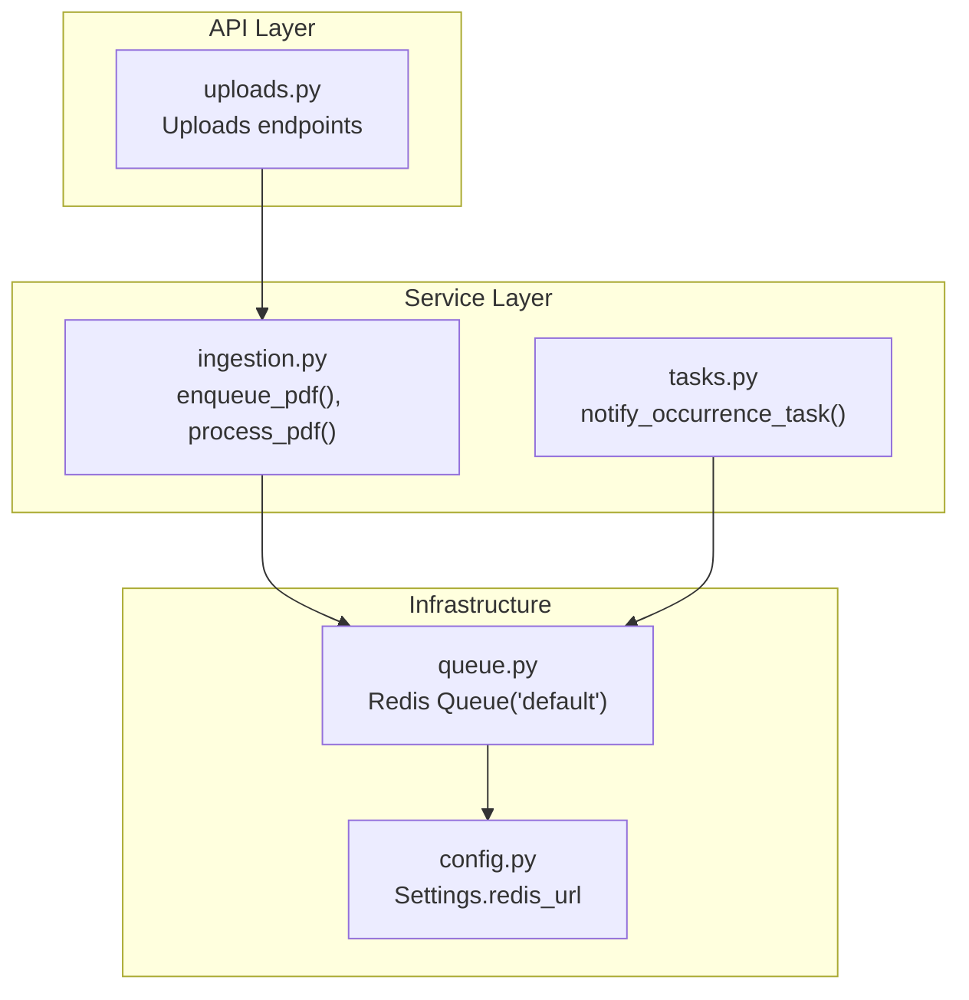
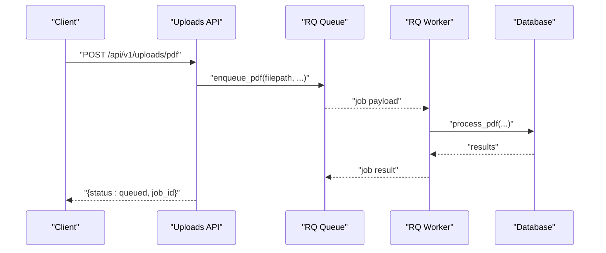
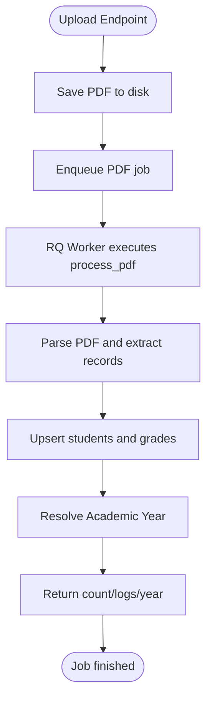
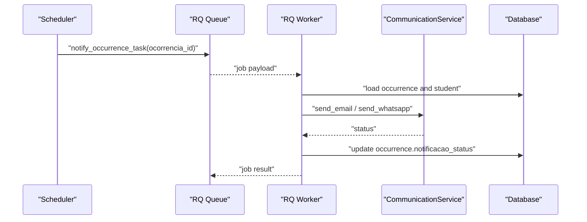
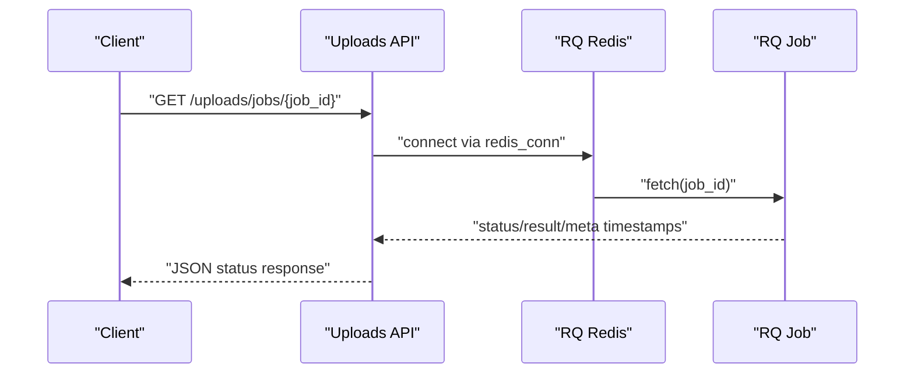
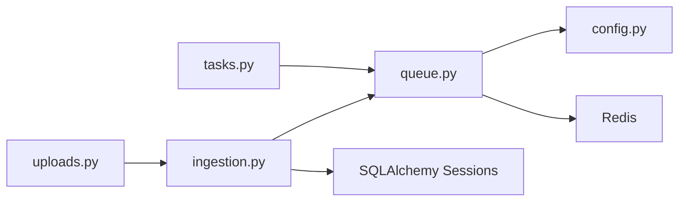

# Background Processing

<cite>
**Referenced Files in This Document**
- [backend/app/core/queue.py](file://backend/app/core/queue.py)
- [backend/app/core/config.py](file://backend/app/core/config.py)
- [backend/app/services/ingestion.py](file://backend/app/services/ingestion.py)
- [backend/app/api/v1/uploads.py](file://backend/app/api/v1/uploads.py)
- [backend/app/core/tasks.py](file://backend/app/core/tasks.py)
- [backend/app/services/document_service.py](file://backend/app/services/document_service.py)
- [frontend/src/features/uploads/UploadsPage.tsx](file://frontend/src/features/uploads/UploadsPage.tsx)
- [.agent/skills/postgres-best-practices/rules/lock-skip-locked.md](file://.agent/skills/postgres-best-practices/rules/lock-skip-locked.md)
</cite>

## Table of Contents
1. [Introduction](#introduction)
2. [Project Structure](#project-structure)
3. [Core Components](#core-components)
4. [Architecture Overview](#architecture-overview)
5. [Detailed Component Analysis](#detailed-component-analysis)
6. [Dependency Analysis](#dependency-analysis)
7. [Performance Considerations](#performance-considerations)
8. [Troubleshooting Guide](#troubleshooting-guide)
9. [Conclusion](#conclusion)

## Introduction
This document explains the background processing implementation centered on RQ workers in the platform. It covers how job queues are configured, how tasks are scheduled and executed asynchronously, and how the system handles PDF processing, notifications, and data transformations. The content targets both system architects and developers, providing conceptual overviews and technical details aligned with the codebase terminology (RQ workers, job queues, task execution).

## Project Structure
Background processing spans three layers:
- API layer: exposes endpoints to enqueue jobs and check status.
- Service layer: defines job functions and enqueues them into RQ.
- Infrastructure: Redis-backed RQ queue and configuration.

**Diagram sources**
- [backend/app/api/v1/uploads.py:1-84](file://backend/app/api/v1/uploads.py#L1-L84)
- [backend/app/services/ingestion.py:70-83](file://backend/app/services/ingestion.py#L70-L83)
- [backend/app/core/tasks.py:6-78](file://backend/app/core/tasks.py#L6-L78)
- [backend/app/core/queue.py:1-12](file://backend/app/core/queue.py#L1-L12)
- [backend/app/core/config.py:14-14](file://backend/app/core/config.py#L14-L14)

**Section sources**
- [backend/app/api/v1/uploads.py:1-84](file://backend/app/api/v1/uploads.py#L1-L84)
- [backend/app/services/ingestion.py:70-83](file://backend/app/services/ingestion.py#L70-L83)
- [backend/app/core/queue.py:1-12](file://backend/app/core/queue.py#L1-L12)
- [backend/app/core/config.py:14-14](file://backend/app/core/config.py#L14-L14)

## Core Components
- RQ Queue: A Redis-backed queue named “default” used to schedule background jobs.
- Job Enqueue Functions:
  - PDF ingestion job enqueued by the uploads API and processed asynchronously.
  - Notification job for occurrences enqueued elsewhere and executed by RQ workers.
- Job Execution:
  - PDF processing parses and applies records to the database.
  - Notifications send email and WhatsApp messages and update occurrence status.

Key responsibilities:
- Queue configuration and connection to Redis.
- Enqueueing jobs with timeouts and metadata.
- Executing jobs with robust logging and transactional updates.

**Section sources**
- [backend/app/core/queue.py:1-12](file://backend/app/core/queue.py#L1-L12)
- [backend/app/services/ingestion.py:70-83](file://backend/app/services/ingestion.py#L70-L83)
- [backend/app/core/tasks.py:6-78](file://backend/app/core/tasks.py#L6-L78)

## Architecture Overview
The background processing architecture uses RQ with Redis as the broker. Jobs are enqueued by API endpoints and processed by RQ workers. The system supports:
- Asynchronous PDF ingestion with progress reporting.
- Notification dispatching for occurrence events.
- Scalable task execution with configurable timeouts and retries.

**Diagram sources**
- [backend/app/api/v1/uploads.py:37-56](file://backend/app/api/v1/uploads.py#L37-L56)
- [backend/app/services/ingestion.py:70-83](file://backend/app/services/ingestion.py#L70-L83)
- [backend/app/core/queue.py:11-11](file://backend/app/core/queue.py#L11-L11)

## Detailed Component Analysis

### RQ Queue and Configuration
- Redis connection is created from application settings and reused across the app.
- A default RQ queue is instantiated for job scheduling.

Implementation highlights:
- Connection tuning for timeouts and retries.
- Centralized configuration via settings.

**Section sources**
- [backend/app/core/queue.py:1-12](file://backend/app/core/queue.py#L1-L12)
- [backend/app/core/config.py:14-14](file://backend/app/core/config.py#L14-L14)

### PDF Processing Pipeline
The PDF ingestion pipeline transforms uploaded PDFs into normalized academic records and persists them to the database.

**Diagram sources**
- [backend/app/api/v1/uploads.py:37-56](file://backend/app/api/v1/uploads.py#L37-L56)
- [backend/app/services/ingestion.py:86-121](file://backend/app/services/ingestion.py#L86-L121)
- [backend/app/services/ingestion.py:124-138](file://backend/app/services/ingestion.py#L124-L138)

Key behaviors:
- Enqueueing with a timeout to prevent long-running jobs.
- Parsing standardized and Matrícula Inicial formats.
- Upsert logic for students and grades with deduplication safeguards.
- Academic year resolution and labeling.

**Section sources**
- [backend/app/api/v1/uploads.py:37-56](file://backend/app/api/v1/uploads.py#L37-L56)
- [backend/app/services/ingestion.py:70-83](file://backend/app/services/ingestion.py#L70-L83)
- [backend/app/services/ingestion.py:86-121](file://backend/app/services/ingestion.py#L86-L121)
- [backend/app/services/ingestion.py:124-138](file://backend/app/services/ingestion.py#L124-L138)

### Notifications Task
Notifications are sent for occurrence events via email and WhatsApp, updating the occurrence’s status accordingly.

**Diagram sources**
- [backend/app/core/tasks.py:6-78](file://backend/app/core/tasks.py#L6-L78)

Operational details:
- Loads occurrence and related student data.
- Sends email and/or WhatsApp notifications.
- Updates occurrence status based on delivery outcomes.

**Section sources**
- [backend/app/core/tasks.py:6-78](file://backend/app/core/tasks.py#L6-L78)

### Job Monitoring and Status API
The uploads API exposes a job status endpoint to inspect RQ job state and results.

**Diagram sources**
- [backend/app/api/v1/uploads.py:58-76](file://backend/app/api/v1/uploads.py#L58-L76)
- [backend/app/core/queue.py:1-12](file://backend/app/core/queue.py#L1-L12)

**Section sources**
- [backend/app/api/v1/uploads.py:58-76](file://backend/app/api/v1/uploads.py#L58-L76)
- [backend/app/core/queue.py:1-12](file://backend/app/core/queue.py#L1-L12)

### PDF Generation Utility
While not an RQ job itself, the document service can generate PDFs from HTML for downstream use cases.

**Section sources**
- [backend/app/services/document_service.py:6-27](file://backend/app/services/document_service.py#L6-L27)

## Dependency Analysis
Background processing depends on:
- Redis for job persistence and distribution.
- RQ for queue abstraction and worker orchestration.
- SQLAlchemy sessions for transactional database updates.
- Flask endpoints for enqueueing and status polling.

**Diagram sources**
- [backend/app/api/v1/uploads.py:1-84](file://backend/app/api/v1/uploads.py#L1-L84)
- [backend/app/services/ingestion.py:70-83](file://backend/app/services/ingestion.py#L70-L83)
- [backend/app/core/queue.py:1-12](file://backend/app/core/queue.py#L1-L12)
- [backend/app/core/config.py:14-14](file://backend/app/core/config.py#L14-L14)
- [backend/app/core/tasks.py:1-78](file://backend/app/core/tasks.py#L1-L78)

**Section sources**
- [backend/app/api/v1/uploads.py:1-84](file://backend/app/api/v1/uploads.py#L1-L84)
- [backend/app/services/ingestion.py:70-83](file://backend/app/services/ingestion.py#L70-L83)
- [backend/app/core/queue.py:1-12](file://backend/app/core/queue.py#L1-L12)
- [backend/app/core/config.py:14-14](file://backend/app/core/config.py#L14-L14)
- [backend/app/core/tasks.py:1-78](file://backend/app/core/tasks.py#L1-L78)

## Performance Considerations
- Queue contention and concurrency:
  - When implementing custom queue backends, use SKIP LOCKED semantics to avoid worker contention and improve throughput.
- Worker scaling:
  - Scale RQ workers horizontally to handle increased job volume.
  - Ensure Redis availability and network latency are acceptable across workers.
- Job timeouts:
  - Set appropriate job timeouts to prevent resource exhaustion.
- Monitoring:
  - Track job enqueued_at, started_at, ended_at, and result metadata for SLA visibility.

[No sources needed since this section provides general guidance]

## Troubleshooting Guide
Common issues and remedies:
- Job not found:
  - Verify the job_id and Redis connectivity.
- Long queue times:
  - Increase worker instances or optimize job duration.
- Timeout failures:
  - Adjust job_timeout for long-running jobs.
- Notification failures:
  - Confirm email and WhatsApp credentials and endpoints.
- Frontend feedback:
  - Monitor job status transitions and surface user-friendly messages.

**Section sources**
- [backend/app/api/v1/uploads.py:58-76](file://backend/app/api/v1/uploads.py#L58-L76)
- [frontend/src/features/uploads/UploadsPage.tsx:38-70](file://frontend/src/features/uploads/UploadsPage.tsx#L38-L70)
- [backend/app/core/tasks.py:66-76](file://backend/app/core/tasks.py#L66-L76)

## Conclusion
The platform’s background processing leverages RQ with Redis to provide scalable, observable asynchronous task execution. PDF ingestion, notifications, and data transformations are encapsulated as RQ jobs with clear enqueue and monitoring patterns. Production deployments should focus on worker scaling, queue contention strategies, and robust monitoring to maintain reliability and responsiveness.