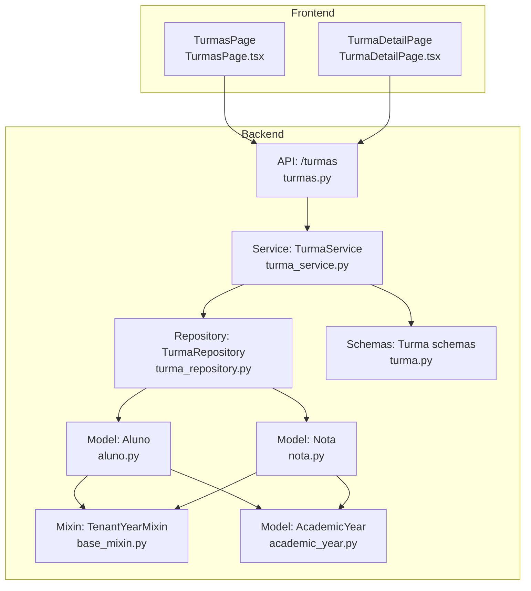
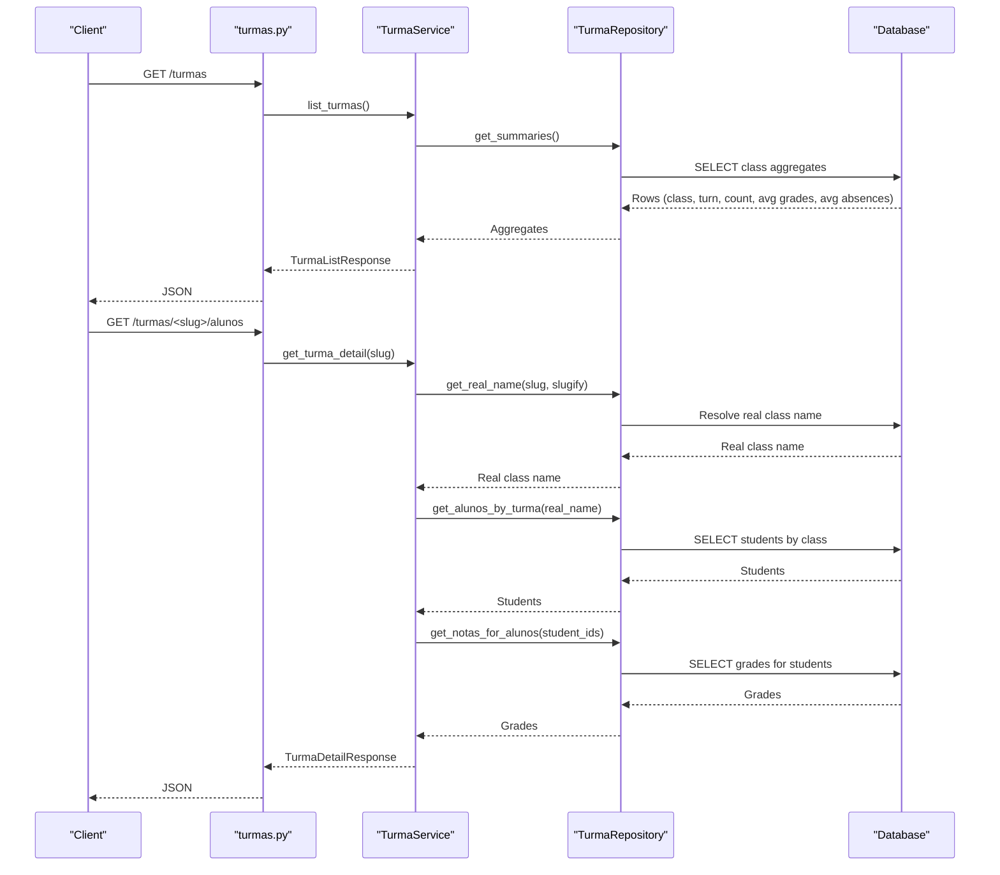
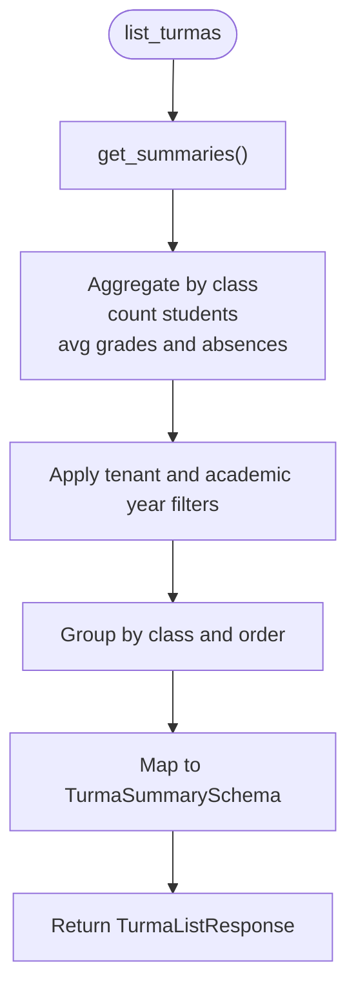
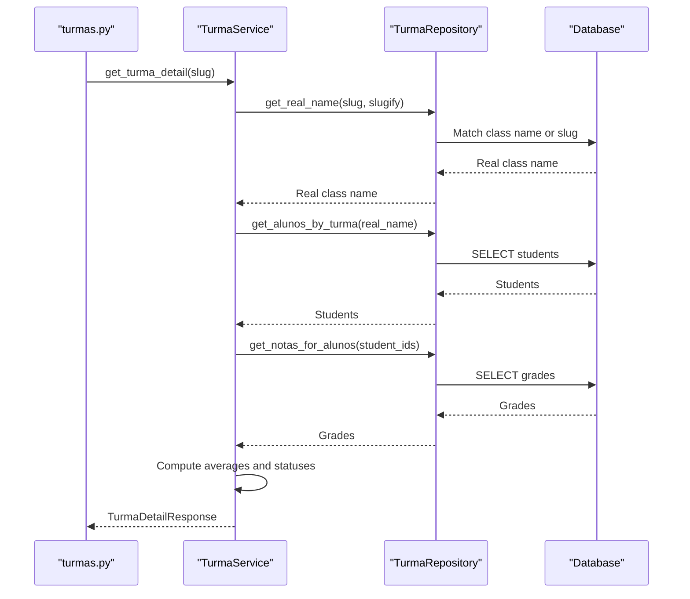
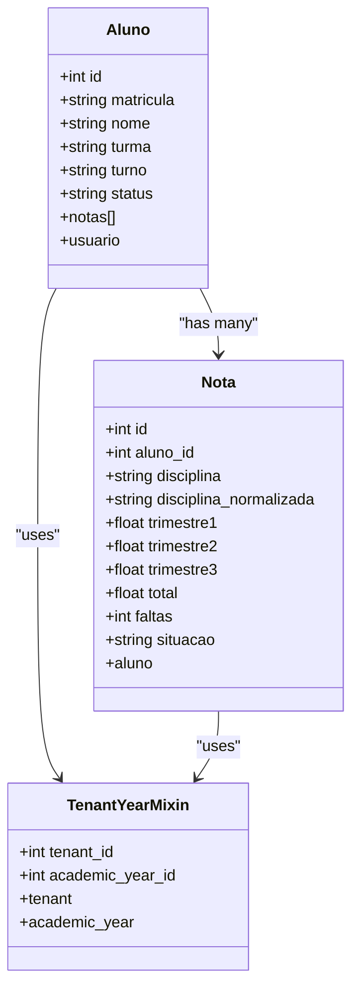
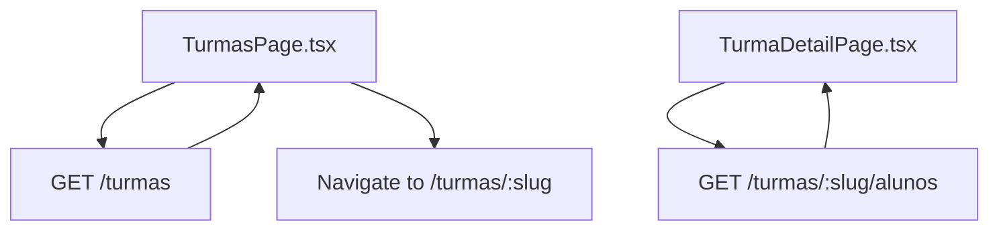
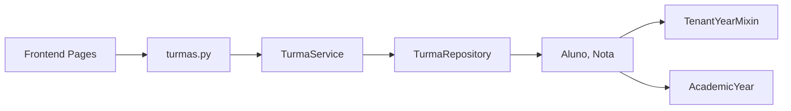

# Class & Course Management

<cite>
**Referenced Files in This Document**
- [backend/app/api/v1/turmas.py](file://backend/app/api/v1/turmas.py)
- [backend/app/services/turma_service.py](file://backend/app/services/turma_service.py)
- [backend/app/repositories/turma_repository.py](file://backend/app/repositories/turma_repository.py)
- [backend/app/schemas/turma.py](file://backend/app/schemas/turma.py)
- [backend/app/models/aluno.py](file://backend/app/models/aluno.py)
- [backend/app/models/nota.py](file://backend/app/models/nota.py)
- [backend/app/models/base_mixin.py](file://backend/app/models/base_mixin.py)
- [backend/app/models/academic_year.py](file://backend/app/models/academic_year.py)
- [backend/app/api/v1/academic_years.py](file://backend/app/api/v1/academic_years.py)
- [frontend/src/features/turmas/TurmasPage.tsx](file://frontend/src/features/turmas/TurmasPage.tsx)
- [frontend/src/features/turmas/TurmaDetailPage.tsx](file://frontend/src/features/turmas/TurmaDetailPage.tsx)
</cite>

## Table of Contents
1. [Introduction](#introduction)
2. [Project Structure](#project-structure)
3. [Core Components](#core-components)
4. [Architecture Overview](#architecture-overview)
5. [Detailed Component Analysis](#detailed-component-analysis)
6. [Dependency Analysis](#dependency-analysis)
7. [Performance Considerations](#performance-considerations)
8. [Troubleshooting Guide](#troubleshooting-guide)
9. [Conclusion](#conclusion)
10. [Appendices](#appendices)

## Introduction
This document explains the class and course management capabilities implemented in the platform. It focuses on how classrooms are organized, how students are enrolled and tracked, and how course-related academic data is aggregated and presented. The system centers around the concept of a "classroom" (turma) as an aggregation of students, with academic performance derived from grades stored per student. The backend exposes REST endpoints for listing classes and retrieving class rosters with academic summaries, while the frontend provides dashboards for browsing and inspecting class performance.

## Project Structure
The class and course management feature spans backend API, service, repository, and schema layers, plus frontend pages for browsing and viewing class details. The backend leverages SQLAlchemy models and a tenant-aware base mixin to isolate data per tenant and academic year. The frontend integrates with these APIs to present class lists and detailed class views.

**Diagram sources**
- [backend/app/api/v1/turmas.py:1-42](file://backend/app/api/v1/turmas.py#L1-L42)
- [backend/app/services/turma_service.py:1-128](file://backend/app/services/turma_service.py#L1-L128)
- [backend/app/repositories/turma_repository.py:1-101](file://backend/app/repositories/turma_repository.py#L1-L101)
- [backend/app/schemas/turma.py:1-41](file://backend/app/schemas/turma.py#L1-L41)
- [backend/app/models/aluno.py:1-36](file://backend/app/models/aluno.py#L1-L36)
- [backend/app/models/nota.py:1-24](file://backend/app/models/nota.py#L1-L24)
- [backend/app/models/base_mixin.py:1-22](file://backend/app/models/base_mixin.py#L1-L22)
- [backend/app/models/academic_year.py:1-16](file://backend/app/models/academic_year.py#L1-L16)
- [frontend/src/features/turmas/TurmasPage.tsx:1-254](file://frontend/src/features/turmas/TurmasPage.tsx#L1-L254)
- [frontend/src/features/turmas/TurmaDetailPage.tsx:1-150](file://frontend/src/features/turmas/TurmaDetailPage.tsx#L1-L150)

**Section sources**
- [backend/app/api/v1/turmas.py:1-42](file://backend/app/api/v1/turmas.py#L1-L42)
- [backend/app/services/turma_service.py:1-128](file://backend/app/services/turma_service.py#L1-L128)
- [backend/app/repositories/turma_repository.py:1-101](file://backend/app/repositories/turma_repository.py#L1-L101)
- [backend/app/schemas/turma.py:1-41](file://backend/app/schemas/turma.py#L1-L41)
- [backend/app/models/aluno.py:1-36](file://backend/app/models/aluno.py#L1-L36)
- [backend/app/models/nota.py:1-24](file://backend/app/models/nota.py#L1-L24)
- [backend/app/models/base_mixin.py:1-22](file://backend/app/models/base_mixin.py#L1-L22)
- [backend/app/models/academic_year.py:1-16](file://backend/app/models/academic_year.py#L1-L16)
- [frontend/src/features/turmas/TurmasPage.tsx:1-254](file://frontend/src/features/turmas/TurmasPage.tsx#L1-L254)
- [frontend/src/features/turmas/TurmaDetailPage.tsx:1-150](file://frontend/src/features/turmas/TurmaDetailPage.tsx#L1-L150)

## Core Components
- Class listing and summary: The backend aggregates class-level metrics (student count, average grade, average absences) from student records and grades.
- Class detail retrieval: For a given class, the backend returns all enrolled students, their grades per subject, and computed averages and statuses.
- Student enrollment: Students are associated with a class via the student record’s class field; enrollment is implicit through this association.
- Academic year and tenant isolation: All data is scoped to a tenant and academic year using a shared base mixin.
- Frontend dashboards: Users browse classes and drill down to see student-level details and performance indicators.

Key implementation references:
- Class listing endpoint and response: [backend/app/api/v1/turmas.py:14-22](file://backend/app/api/v1/turmas.py#L14-L22)
- Class detail endpoint and fallback response: [backend/app/api/v1/turmas.py:24-39](file://backend/app/api/v1/turmas.py#L24-L39)
- Service-level aggregation and computation: [backend/app/services/turma_service.py:31-127](file://backend/app/services/turma_service.py#L31-L127)
- Repository-level queries for summaries and student lists: [backend/app/repositories/turma_repository.py:16-100](file://backend/app/repositories/turma_repository.py#L16-L100)
- Schemas for responses: [backend/app/schemas/turma.py:4-41](file://backend/app/schemas/turma.py#L4-L41)
- Student and grade models: [backend/app/models/aluno.py:8-36](file://backend/app/models/aluno.py#L8-L36), [backend/app/models/nota.py:9-24](file://backend/app/models/nota.py#L9-L24)
- Tenant and academic year scoping: [backend/app/models/base_mixin.py:4-22](file://backend/app/models/base_mixin.py#L4-L22), [backend/app/models/academic_year.py:6-16](file://backend/app/models/academic_year.py#L6-L16)
- Frontend class list and detail pages: [frontend/src/features/turmas/TurmasPage.tsx:49-254](file://frontend/src/features/turmas/TurmasPage.tsx#L49-L254), [frontend/src/features/turmas/TurmaDetailPage.tsx:52-150](file://frontend/src/features/turmas/TurmaDetailPage.tsx#L52-L150)

**Section sources**
- [backend/app/api/v1/turmas.py:1-42](file://backend/app/api/v1/turmas.py#L1-L42)
- [backend/app/services/turma_service.py:1-128](file://backend/app/services/turma_service.py#L1-L128)
- [backend/app/repositories/turma_repository.py:1-101](file://backend/app/repositories/turma_repository.py#L1-L101)
- [backend/app/schemas/turma.py:1-41](file://backend/app/schemas/turma.py#L1-L41)
- [backend/app/models/aluno.py:1-36](file://backend/app/models/aluno.py#L1-L36)
- [backend/app/models/nota.py:1-24](file://backend/app/models/nota.py#L1-L24)
- [backend/app/models/base_mixin.py:1-22](file://backend/app/models/base_mixin.py#L1-L22)
- [backend/app/models/academic_year.py:1-16](file://backend/app/models/academic_year.py#L1-L16)
- [frontend/src/features/turmas/TurmasPage.tsx:1-254](file://frontend/src/features/turmas/TurmasPage.tsx#L1-L254)
- [frontend/src/features/turmas/TurmaDetailPage.tsx:1-150](file://frontend/src/features/turmas/TurmaDetailPage.tsx#L1-L150)

## Architecture Overview
The class and course management feature follows a layered architecture:
- API layer: Exposes endpoints for listing classes and retrieving class details.
- Service layer: Orchestrates data retrieval, computes derived metrics (averages, statuses), and maps to response schemas.
- Repository layer: Implements SQL queries to aggregate class-level data and fetch student-grade details.
- Model layer: Defines student, grade, and tenant/academic-year scoping models.
- Frontend layer: Renders class listings and detailed class views with performance indicators.

**Diagram sources**
- [backend/app/api/v1/turmas.py:14-39](file://backend/app/api/v1/turmas.py#L14-L39)
- [backend/app/services/turma_service.py:31-127](file://backend/app/services/turma_service.py#L31-L127)
- [backend/app/repositories/turma_repository.py:16-100](file://backend/app/repositories/turma_repository.py#L16-L100)

## Detailed Component Analysis

### Class Listing and Summary
- Purpose: Provide a high-level overview of all classes with counts, averages, and absence metrics.
- Implementation highlights:
  - Aggregation query groups by class and computes counts and averages across grades.
  - Tenant and academic year filters are applied to ensure isolation.
  - Slugs are generated for URLs to support human-readable links.
- Example references:
  - Aggregation query and grouping: [backend/app/repositories/turma_repository.py:25-54](file://backend/app/repositories/turma_repository.py#L25-L54)
  - Slug generation and normalization: [backend/app/services/turma_service.py:20-29](file://backend/app/services/turma_service.py#L20-L29)
  - Endpoint response: [backend/app/api/v1/turmas.py:14-22](file://backend/app/api/v1/turmas.py#L14-L22)
  - Response schema: [backend/app/schemas/turma.py:4-14](file://backend/app/schemas/turma.py#L4-L14)

**Diagram sources**
- [backend/app/repositories/turma_repository.py:16-54](file://backend/app/repositories/turma_repository.py#L16-L54)
- [backend/app/services/turma_service.py:31-46](file://backend/app/services/turma_service.py#L31-L46)
- [backend/app/schemas/turma.py:4-14](file://backend/app/schemas/turma.py#L4-L14)

**Section sources**
- [backend/app/repositories/turma_repository.py:16-54](file://backend/app/repositories/turma_repository.py#L16-L54)
- [backend/app/services/turma_service.py:31-46](file://backend/app/services/turma_service.py#L31-L46)
- [backend/app/api/v1/turmas.py:14-22](file://backend/app/api/v1/turmas.py#L14-L22)
- [backend/app/schemas/turma.py:4-14](file://backend/app/schemas/turma.py#L4-L14)

### Class Detail and Roster Management
- Purpose: Retrieve a specific class’s students, their grades per subject, and compute derived metrics (average and status).
- Implementation highlights:
  - Resolves a class name or slug to the canonical form using normalization and slug matching.
  - Fetches students and their grades, then aggregates per-student averages and statuses.
  - Returns a structured response suitable for the frontend detail page.
- Example references:
  - Name resolution and slug matching: [backend/app/services/turma_service.py:48-49](file://backend/app/services/turma_service.py#L48-L49), [backend/app/repositories/turma_repository.py:56-79](file://backend/app/repositories/turma_repository.py#L56-L79)
  - Student retrieval and grade aggregation: [backend/app/repositories/turma_repository.py:81-100](file://backend/app/repositories/turma_repository.py#L81-L100)
  - Average and status computation: [backend/app/services/turma_service.py:104-127](file://backend/app/services/turma_service.py#L104-L127)
  - Endpoint and fallback response: [backend/app/api/v1/turmas.py:24-39](file://backend/app/api/v1/turmas.py#L24-L39)
  - Response schema: [backend/app/schemas/turma.py:25-41](file://backend/app/schemas/turma.py#L25-L41)

**Diagram sources**
- [backend/app/api/v1/turmas.py:24-39](file://backend/app/api/v1/turmas.py#L24-L39)
- [backend/app/services/turma_service.py:48-127](file://backend/app/services/turma_service.py#L48-L127)
- [backend/app/repositories/turma_repository.py:56-100](file://backend/app/repositories/turma_repository.py#L56-L100)

**Section sources**
- [backend/app/api/v1/turmas.py:24-39](file://backend/app/api/v1/turmas.py#L24-L39)
- [backend/app/services/turma_service.py:48-127](file://backend/app/services/turma_service.py#L48-L127)
- [backend/app/repositories/turma_repository.py:56-100](file://backend/app/repositories/turma_repository.py#L56-L100)
- [backend/app/schemas/turma.py:25-41](file://backend/app/schemas/turma.py#L25-L41)

### Student Enrollment and Academic Tracking
- Enrollment mechanism: Students are considered enrolled in a class by virtue of their record containing a class identifier. There is no separate enrollment entity; enrollment is implicit through the student model’s class field.
- Academic tracking: Grades are stored per student per subject, enabling per-class aggregation and per-student reporting.
- Example references:
  - Student model with class and grade relationships: [backend/app/models/aluno.py:8-36](file://backend/app/models/aluno.py#L8-L36), [backend/app/models/nota.py:9-24](file://backend/app/models/nota.py#L9-L24)
  - Tenant and academic year scoping via mixin: [backend/app/models/base_mixin.py:4-22](file://backend/app/models/base_mixin.py#L4-L22)
  - Academic year model and current year flag: [backend/app/models/academic_year.py:6-16](file://backend/app/models/academic_year.py#L6-L16)

**Diagram sources**
- [backend/app/models/aluno.py:8-36](file://backend/app/models/aluno.py#L8-L36)
- [backend/app/models/nota.py:9-24](file://backend/app/models/nota.py#L9-L24)
- [backend/app/models/base_mixin.py:4-22](file://backend/app/models/base_mixin.py#L4-L22)

**Section sources**
- [backend/app/models/aluno.py:8-36](file://backend/app/models/aluno.py#L8-L36)
- [backend/app/models/nota.py:9-24](file://backend/app/models/nota.py#L9-L24)
- [backend/app/models/base_mixin.py:4-22](file://backend/app/models/base_mixin.py#L4-L22)
- [backend/app/models/academic_year.py:6-16](file://backend/app/models/academic_year.py#L6-L16)

### Frontend Dashboards and User Experience
- Class list page: Displays a grid of classes with performance indicators, filtering by class or shift, and navigation to class details.
- Class detail page: Presents a table of students with their averages, statuses, and subject grades.
- Example references:
  - Class list rendering and search: [frontend/src/features/turmas/TurmasPage.tsx:49-254](file://frontend/src/features/turmas/TurmasPage.tsx#L49-L254)
  - Class detail rendering and status formatting: [frontend/src/features/turmas/TurmaDetailPage.tsx:52-150](file://frontend/src/features/turmas/TurmaDetailPage.tsx#L52-L150)

**Diagram sources**
- [frontend/src/features/turmas/TurmasPage.tsx:49-254](file://frontend/src/features/turmas/TurmasPage.tsx#L49-L254)
- [frontend/src/features/turmas/TurmaDetailPage.tsx:52-150](file://frontend/src/features/turmas/TurmaDetailPage.tsx#L52-L150)
- [backend/app/api/v1/turmas.py:14-39](file://backend/app/api/v1/turmas.py#L14-L39)

**Section sources**
- [frontend/src/features/turmas/TurmasPage.tsx:49-254](file://frontend/src/features/turmas/TurmasPage.tsx#L49-L254)
- [frontend/src/features/turmas/TurmaDetailPage.tsx:52-150](file://frontend/src/features/turmas/TurmaDetailPage.tsx#L52-L150)
- [backend/app/api/v1/turmas.py:14-39](file://backend/app/api/v1/turmas.py#L14-L39)

## Dependency Analysis
The class and course management feature exhibits clear separation of concerns:
- API depends on Service for orchestration.
- Service depends on Repository for data access.
- Repository depends on Models for ORM mapping and on TenantYearMixin for scoping.
- Frontend depends on API endpoints for data fetching.

**Diagram sources**
- [backend/app/api/v1/turmas.py:1-42](file://backend/app/api/v1/turmas.py#L1-L42)
- [backend/app/services/turma_service.py:1-18](file://backend/app/services/turma_service.py#L1-L18)
- [backend/app/repositories/turma_repository.py:1-14](file://backend/app/repositories/turma_repository.py#L1-L14)
- [backend/app/models/aluno.py:1-36](file://backend/app/models/aluno.py#L1-L36)
- [backend/app/models/nota.py:1-24](file://backend/app/models/nota.py#L1-L24)
- [backend/app/models/base_mixin.py:1-22](file://backend/app/models/base_mixin.py#L1-L22)
- [backend/app/models/academic_year.py:1-16](file://backend/app/models/academic_year.py#L1-L16)
- [frontend/src/features/turmas/TurmasPage.tsx:1-254](file://frontend/src/features/turmas/TurmasPage.tsx#L1-L254)
- [frontend/src/features/turmas/TurmaDetailPage.tsx:1-150](file://frontend/src/features/turmas/TurmaDetailPage.tsx#L1-L150)

**Section sources**
- [backend/app/api/v1/turmas.py:1-42](file://backend/app/api/v1/turmas.py#L1-L42)
- [backend/app/services/turma_service.py:1-18](file://backend/app/services/turma_service.py#L1-L18)
- [backend/app/repositories/turma_repository.py:1-14](file://backend/app/repositories/turma_repository.py#L1-L14)
- [backend/app/models/aluno.py:1-36](file://backend/app/models/aluno.py#L1-L36)
- [backend/app/models/nota.py:1-24](file://backend/app/models/nota.py#L1-L24)
- [backend/app/models/base_mixin.py:1-22](file://backend/app/models/base_mixin.py#L1-L22)
- [backend/app/models/academic_year.py:1-16](file://backend/app/models/academic_year.py#L1-L16)
- [frontend/src/features/turmas/TurmasPage.tsx:1-254](file://frontend/src/features/turmas/TurmasPage.tsx#L1-L254)
- [frontend/src/features/turmas/TurmaDetailPage.tsx:1-150](file://frontend/src/features/turmas/TurmaDetailPage.tsx#L1-L150)

## Performance Considerations
- Aggregation efficiency: The repository performs grouped aggregations to compute class-level metrics, reducing client-side computation.
- Indexing and filtering: Tenant and academic year filters are applied early to limit result sets.
- Slug normalization: Reduces ambiguity in class name matching and improves lookup performance.
- Grade batching: Fetching grades in bulk per student minimizes round-trips.

Recommendations:
- Ensure indexes exist on class identifiers and tenant/academic year foreign keys.
- Consider caching class summaries periodically to reduce repeated heavy queries.
- Monitor query plans for large datasets and adjust grouping or pagination if needed.

[No sources needed since this section provides general guidance]

## Troubleshooting Guide
Common issues and resolutions:
- Empty class list or detail:
  - Verify tenant and academic year context are set correctly in the request context.
  - Confirm class names exist and are properly normalized; the system supports both exact matches and slug-based matches.
- Unexpected averages or statuses:
  - Check grade normalization and presence of missing values; the service computes averages only from available data and applies default statuses when none are present.
- Missing grades in class detail:
  - Ensure grades exist for the selected academic year and tenant; the repository joins grades with tenant and academic year filters.

References:
- Class name resolution and slug matching: [backend/app/repositories/turma_repository.py:56-79](file://backend/app/repositories/turma_repository.py#L56-L79), [backend/app/services/turma_service.py:48-49](file://backend/app/services/turma_service.py#L48-L49)
- Grade retrieval and filtering: [backend/app/repositories/turma_repository.py:94-100](file://backend/app/repositories/turma_repository.py#L94-L100)
- Status computation defaults: [backend/app/services/turma_service.py:110-113](file://backend/app/services/turma_service.py#L110-L113)

**Section sources**
- [backend/app/repositories/turma_repository.py:56-79](file://backend/app/repositories/turma_repository.py#L56-L79)
- [backend/app/repositories/turma_repository.py:94-100](file://backend/app/repositories/turma_repository.py#L94-L100)
- [backend/app/services/turma_service.py:110-113](file://backend/app/services/turma_service.py#L110-L113)

## Conclusion
The class and course management feature provides a robust foundation for classroom organization, student enrollment, and academic tracking. Classes are modeled as aggregations of students, with performance derived from grades. The backend offers efficient endpoints for browsing and drilling into class details, while the frontend presents intuitive dashboards for administrators and educators. Tenant and academic year scoping ensures data isolation, and the design supports extensibility for future enhancements such as teacher assignments and course catalogs.

[No sources needed since this section summarizes without analyzing specific files]

## Appendices

### Administrative and Developer Notes
- Administrative oversight:
  - Use class list and detail pages to monitor performance trends and identify at-risk students.
  - Leverage filtering by shift and class to focus on specific cohorts.
- Developer implementation tips:
  - Extend the existing repository and service layers to add new metrics or filters.
  - Respect tenant and academic year scoping when introducing new features.
  - Keep slug normalization consistent to avoid ambiguity in class identification.

[No sources needed since this section provides general guidance]