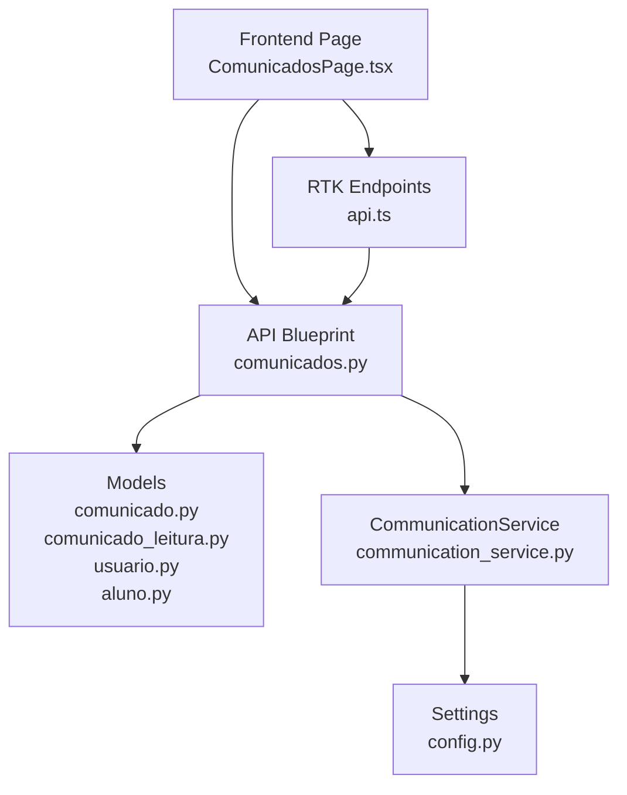
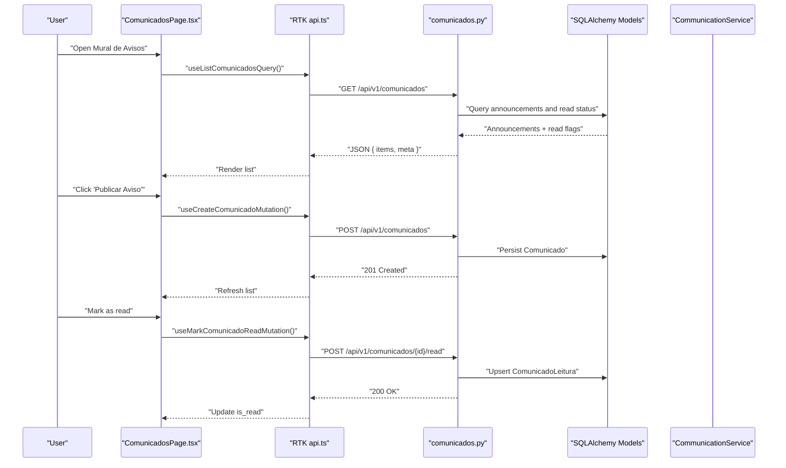
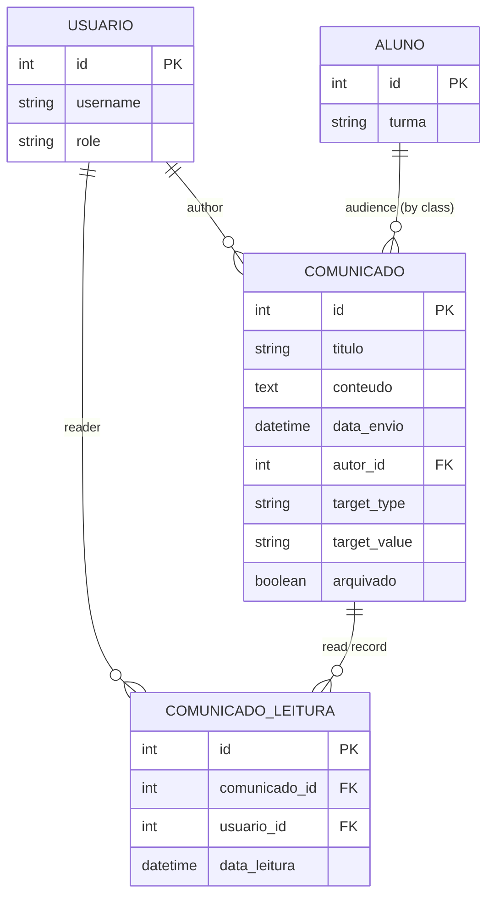
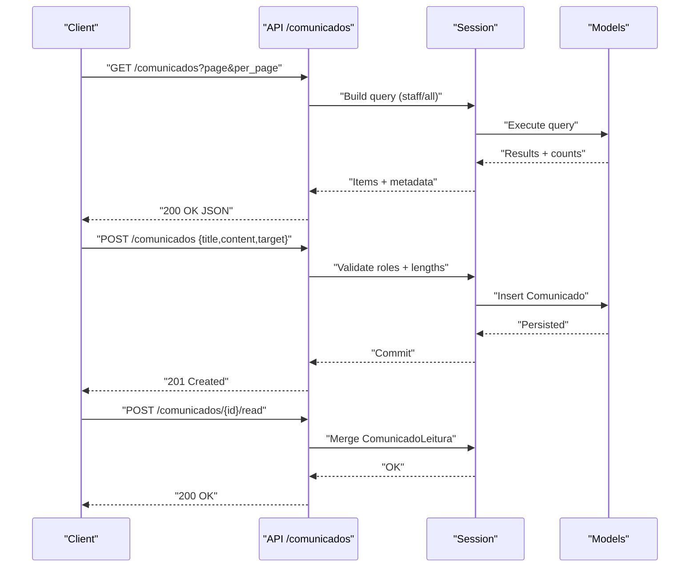
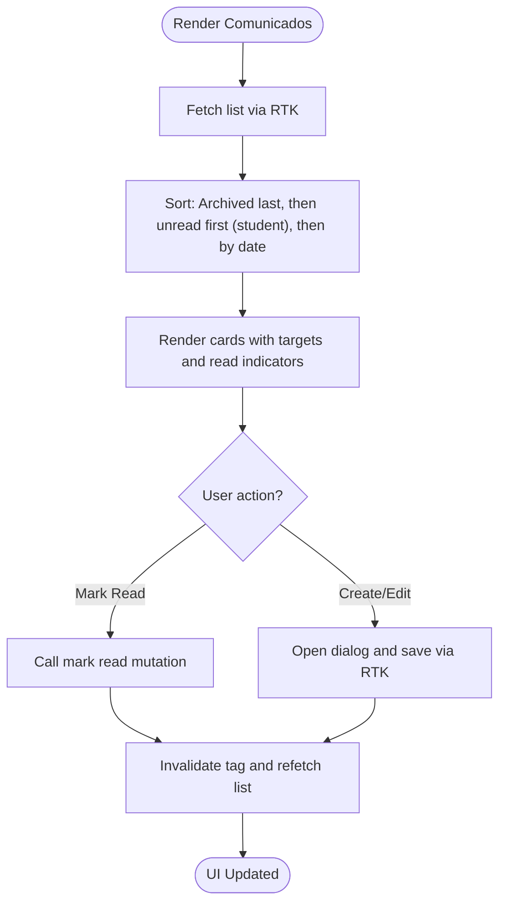
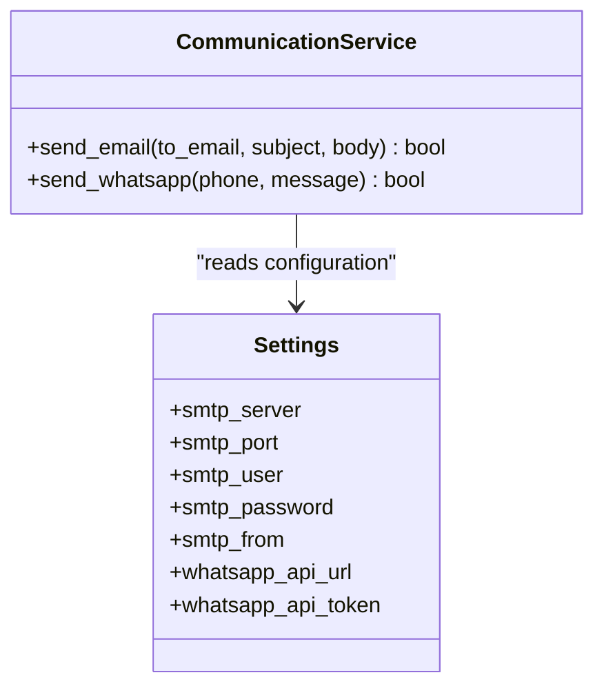
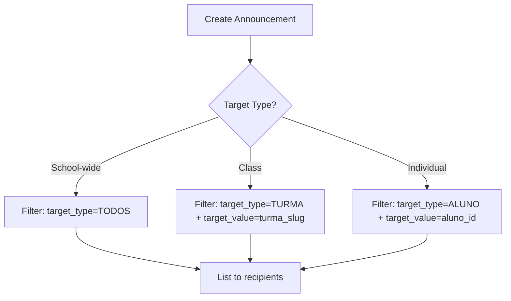
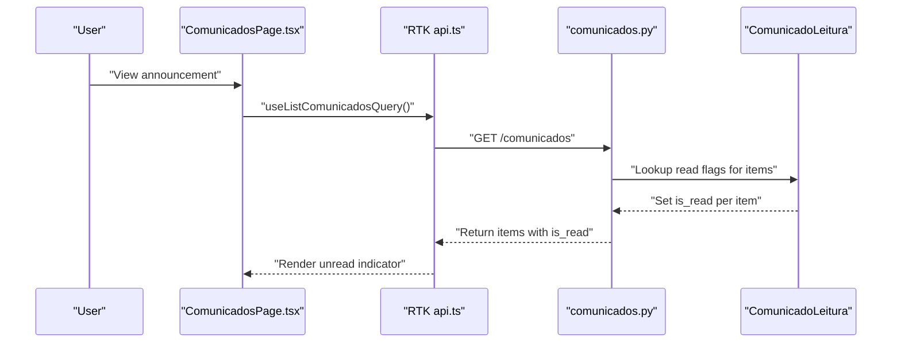
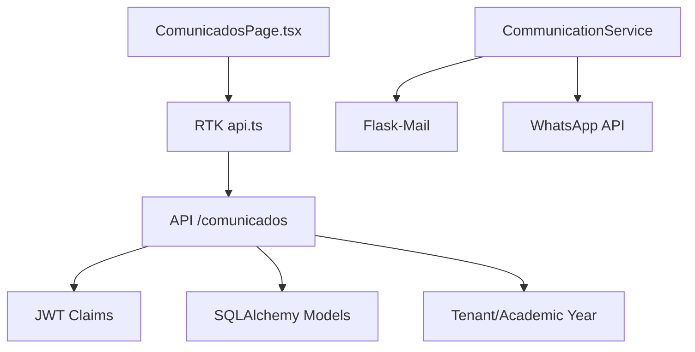

# Communication Portal

<cite>
**Referenced Files in This Document**
- [backend/app/api/v1/comunicados.py](file://backend/app/api/v1/comunicados.py)
- [backend/app/models/comunicado.py](file://backend/app/models/comunicado.py)
- [backend/app/models/comunicado_leitura.py](file://backend/app/models/comunicado_leitura.py)
- [backend/app/models/usuario.py](file://backend/app/models/usuario.py)
- [backend/app/models/aluno.py](file://backend/app/models/aluno.py)
- [backend/app/services/communication_service.py](file://backend/app/services/communication_service.py)
- [backend/app/core/config.py](file://backend/app/core/config.py)
- [frontend/src/features/comunicados/ComunicadosPage.tsx](file://frontend/src/features/comunicados/ComunicadosPage.tsx)
- [frontend/src/lib/api.ts](file://frontend/src/lib/api.ts)
</cite>

## Table of Contents
1. [Introduction](#introduction)
2. [Project Structure](#project-structure)
3. [Core Components](#core-components)
4. [Architecture Overview](#architecture-overview)
5. [Detailed Component Analysis](#detailed-component-analysis)
6. [Dependency Analysis](#dependency-analysis)
7. [Performance Considerations](#performance-considerations)
8. [Troubleshooting Guide](#troubleshooting-guide)
9. [Conclusion](#conclusion)
10. [Appendices](#appendices)

## Introduction
This document explains the Communication Portal’s announcement system end-to-end. It covers how announcements are created, targeted to audiences (school-wide, classes, or individual students), delivered, tracked for read status, and surfaced in the UI. It also documents the backend models, API endpoints, frontend components, and integration points with email and WhatsApp channels. Administrators will find practical guidance for managing announcements and understanding analytics indicators, while developers gain implementation details and extension points.

## Project Structure
The Communication Portal spans backend API endpoints, SQLAlchemy models, a service layer for channel delivery, and a React-based frontend page with RTK Query data fetching.

**Diagram sources**
- [frontend/src/features/comunicados/ComunicadosPage.tsx:1-485](file://frontend/src/features/comunicados/ComunicadosPage.tsx#L1-L485)
- [backend/app/api/v1/comunicados.py:1-175](file://backend/app/api/v1/comunicados.py#L1-L175)
- [backend/app/models/comunicado.py:1-39](file://backend/app/models/comunicado.py#L1-L39)
- [backend/app/models/comunicado_leitura.py:1-20](file://backend/app/models/comunicado_leitura.py#L1-L20)
- [backend/app/models/usuario.py:1-30](file://backend/app/models/usuario.py#L1-L30)
- [backend/app/models/aluno.py:1-36](file://backend/app/models/aluno.py#L1-L36)
- [backend/app/services/communication_service.py:1-61](file://backend/app/services/communication_service.py#L1-L61)
- [backend/app/core/config.py:1-60](file://backend/app/core/config.py#L1-L60)
- [frontend/src/lib/api.ts:585-621](file://frontend/src/lib/api.ts#L585-L621)

**Section sources**
- [backend/app/api/v1/comunicados.py:1-175](file://backend/app/api/v1/comunicados.py#L1-L175)
- [frontend/src/lib/api.ts:585-621](file://frontend/src/lib/api.ts#L585-L621)

## Core Components
- Announcement model: stores title, content, send timestamp, author, target scope, and archival flag.
- Read tracking model: records who read which announcement.
- API endpoints: list, create, update, delete, and mark read.
- Frontend page: renders announcements, supports creation/editing, and marks read.
- Communication service: integrates with SMTP and external WhatsApp APIs for delivery.

Key implementation references:
- Announcement model definition and serialization: [comunicado.py:8-39](file://backend/app/models/comunicado.py#L8-L39)
- Read tracking model: [comunicado_leitura.py:7-20](file://backend/app/models/comunicado_leitura.py#L7-L20)
- API listing and filtering by target audience: [comunicados.py:11-69](file://backend/app/api/v1/comunicados.py#L11-L69)
- API creation and permission checks: [comunicados.py:71-104](file://backend/app/api/v1/comunicados.py#L71-L104)
- API read marking: [comunicados.py:165-172](file://backend/app/api/v1/comunicados.py#L165-L172)
- Frontend announcement list and form: [ComunicadosPage.tsx:54-485](file://frontend/src/features/comunicados/ComunicadosPage.tsx#L54-L485)
- RTK endpoints for announcements: [api.ts:585-621](file://frontend/src/lib/api.ts#L585-621)
- Communication service and settings: [communication_service.py:10-61](file://backend/app/services/communication_service.py#L10-L61), [config.py:20-30](file://backend/app/core/config.py#L20-L30)

**Section sources**
- [backend/app/models/comunicado.py:8-39](file://backend/app/models/comunicado.py#L8-L39)
- [backend/app/models/comunicado_leitura.py:7-20](file://backend/app/models/comunicado_leitura.py#L7-L20)
- [backend/app/api/v1/comunicados.py:11-172](file://backend/app/api/v1/comunicados.py#L11-L172)
- [frontend/src/features/comunicados/ComunicadosPage.tsx:54-485](file://frontend/src/features/comunicados/ComunicadosPage.tsx#L54-L485)
- [frontend/src/lib/api.ts:585-621](file://frontend/src/lib/api.ts#L585-L621)
- [backend/app/services/communication_service.py:10-61](file://backend/app/services/communication_service.py#L10-L61)
- [backend/app/core/config.py:20-30](file://backend/app/core/config.py#L20-L30)

## Architecture Overview
The system follows a layered architecture:
- Presentation layer: React page renders announcements and handles user actions.
- Data access layer: RTK endpoints call backend routes.
- Business logic: Flask routes implement authorization, filtering, and persistence.
- Persistence: SQLAlchemy models represent announcements and read tracking.
- Delivery: CommunicationService sends emails and WhatsApp messages using configured settings.

**Diagram sources**
- [frontend/src/features/comunicados/ComunicadosPage.tsx:54-485](file://frontend/src/features/comunicados/ComunicadosPage.tsx#L54-L485)
- [frontend/src/lib/api.ts:585-621](file://frontend/src/lib/api.ts#L585-L621)
- [backend/app/api/v1/comunicados.py:11-172](file://backend/app/api/v1/comunicados.py#L11-L172)
- [backend/app/models/comunicado.py:8-39](file://backend/app/models/comunicado.py#L8-L39)
- [backend/app/models/comunicado_leitura.py:7-20](file://backend/app/models/comunicado_leitura.py#L7-L20)

## Detailed Component Analysis

### Announcement Model and Read Tracking
- Announcement fields include title, content, send timestamp, author, target scope, and archive flag. The target scope is represented by a type-value pair supporting school-wide, class-based, or student-specific distribution.
- Read tracking persists a unique record per user-announcement pair with a timestamp.

**Diagram sources**
- [backend/app/models/comunicado.py:8-39](file://backend/app/models/comunicado.py#L8-L39)
- [backend/app/models/comunicado_leitura.py:7-20](file://backend/app/models/comunicado_leitura.py#L7-L20)
- [backend/app/models/usuario.py:8-30](file://backend/app/models/usuario.py#L8-L30)
- [backend/app/models/aluno.py:8-36](file://backend/app/models/aluno.py#L8-L36)

**Section sources**
- [backend/app/models/comunicado.py:8-39](file://backend/app/models/comunicado.py#L8-L39)
- [backend/app/models/comunicado_leitura.py:7-20](file://backend/app/models/comunicado_leitura.py#L7-L20)
- [backend/app/models/usuario.py:8-30](file://backend/app/models/usuario.py#L8-L30)
- [backend/app/models/aluno.py:8-36](file://backend/app/models/aluno.py#L8-L36)

### API Workflows: Listing, Creation, Editing, Deletion, and Read Marking
- Listing: Filters announcements by target audience for students (school-wide, class, or personal) and includes read flags for the current user. Staff see all announcements ordered by send date.
- Creation: Requires staff roles and validates content length; sets tenant and academic year context.
- Editing/Deletion: Enforces ownership or manager privileges; admins/coords/directors can edit/delete any.
- Read marking: Upserts a read record for the current user and announcement.

**Diagram sources**
- [backend/app/api/v1/comunicados.py:11-172](file://backend/app/api/v1/comunicados.py#L11-L172)
- [backend/app/models/comunicado.py:8-39](file://backend/app/models/comunicado.py#L8-L39)
- [backend/app/models/comunicado_leitura.py:7-20](file://backend/app/models/comunicado_leitura.py#L7-L20)

**Section sources**
- [backend/app/api/v1/comunicados.py:11-172](file://backend/app/api/v1/comunicados.py#L11-L172)

### Frontend: Announcement List, Filtering, and Read Tracking
- The page lists announcements, sorts by archive status and send date, and highlights unread items for students.
- Supports creating/editing announcements with a dynamic target selector (school-wide, class).
- Marks read via a mutation that updates the UI state and triggers a refetch of the list.

**Diagram sources**
- [frontend/src/features/comunicados/ComunicadosPage.tsx:54-485](file://frontend/src/features/comunicados/ComunicadosPage.tsx#L54-L485)
- [frontend/src/lib/api.ts:585-621](file://frontend/src/lib/api.ts#L585-L621)

**Section sources**
- [frontend/src/features/comunicados/ComunicadosPage.tsx:54-485](file://frontend/src/features/comunicados/ComunicadosPage.tsx#L54-L485)
- [frontend/src/lib/api.ts:585-621](file://frontend/src/lib/api.ts#L585-L621)

### Delivery Mechanisms: Email and WhatsApp
- Email delivery uses Flask-Mail with configurable SMTP settings.
- WhatsApp delivery integrates with an external API (e.g., Evolution API) using a configured URL, token, and instance identifier.
- Both integrations are encapsulated in a single service class and rely on application settings.

**Diagram sources**
- [backend/app/services/communication_service.py:10-61](file://backend/app/services/communication_service.py#L10-L61)
- [backend/app/core/config.py:20-30](file://backend/app/core/config.py#L20-L30)

**Section sources**
- [backend/app/services/communication_service.py:10-61](file://backend/app/services/communication_service.py#L10-L61)
- [backend/app/core/config.py:20-30](file://backend/app/core/config.py#L20-L30)

### Audience Segmentation and Distribution
- Target types supported:
  - School-wide: broadcast to all users.
  - Class: filtered by class slug for students.
  - Individual: filtered by student ID for direct assignment.
- The frontend exposes a selector for “school-wide” and “class,” and dynamically populates class options from enrolled students.

**Diagram sources**
- [backend/app/api/v1/comunicados.py:38-44](file://backend/app/api/v1/comunicados.py#L38-L44)
- [frontend/src/features/comunicados/ComunicadosPage.tsx:80-87](file://frontend/src/features/comunicados/ComunicadosPage.tsx#L80-L87)

**Section sources**
- [backend/app/api/v1/comunicados.py:38-44](file://backend/app/api/v1/comunicados.py#L38-L44)
- [frontend/src/features/comunicados/ComunicadosPage.tsx:80-87](file://frontend/src/features/comunicados/ComunicadosPage.tsx#L80-L87)

### Analytics Tracking
- Read tracking is recorded per user-announcement pair with timestamps, enabling basic analytics such as:
  - Who has read an announcement.
  - Read rate per announcement.
  - Recency of reads.
- The API augments each announcement with an “is_read” flag for the current user, enabling UI-level analytics (e.g., unread badges).

**Diagram sources**
- [backend/app/api/v1/comunicados.py:49-69](file://backend/app/api/v1/comunicados.py#L49-L69)
- [backend/app/models/comunicado_leitura.py:7-20](file://backend/app/models/comunicado_leitura.py#L7-L20)
- [frontend/src/lib/api.ts:585-621](file://frontend/src/lib/api.ts#L585-L621)

**Section sources**
- [backend/app/api/v1/comunicados.py:49-69](file://backend/app/api/v1/comunicados.py#L49-L69)
- [backend/app/models/comunicado_leitura.py:7-20](file://backend/app/models/comunicado_leitura.py#L7-L20)

## Dependency Analysis
- Backend API depends on:
  - JWT claims for role-based access control.
  - SQLAlchemy models for queries and persistence.
  - Tenant and academic year context for multitenancy.
- Frontend depends on:
  - RTK endpoints for announcements.
  - Redux store for authentication and tenant/year context.
- CommunicationService depends on:
  - Flask-Mail for SMTP.
  - External API for WhatsApp.

**Diagram sources**
- [backend/app/api/v1/comunicados.py:11-172](file://backend/app/api/v1/comunicados.py#L11-L172)
- [frontend/src/lib/api.ts:585-621](file://frontend/src/lib/api.ts#L585-L621)
- [backend/app/services/communication_service.py:10-61](file://backend/app/services/communication_service.py#L10-L61)

**Section sources**
- [backend/app/api/v1/comunicados.py:11-172](file://backend/app/api/v1/comunicados.py#L11-L172)
- [frontend/src/lib/api.ts:585-621](file://frontend/src/lib/api.ts#L585-L621)
- [backend/app/services/communication_service.py:10-61](file://backend/app/services/communication_service.py#L10-L61)

## Performance Considerations
- Pagination: API enforces minimum page and maximum per-page limits to prevent heavy loads.
- Single-pass read flag resolution: The API collects announcement IDs and queries read flags in one operation to avoid N+1 queries.
- Sorting and filtering: Efficient SQL queries with OR filters for target audience.
- Frontend caching: RTK provides caching and tag-based invalidation to minimize redundant network calls.

Recommendations:
- Index target_type and target_value for faster filtering.
- Consider materialized views or summary tables for frequent analytics queries (read rates, per-class metrics).
- Batch read marking for bulk operations if needed.

**Section sources**
- [backend/app/api/v1/comunicados.py:18-23](file://backend/app/api/v1/comunicados.py#L18-L23)
- [backend/app/api/v1/comunicados.py:49-58](file://backend/app/api/v1/comunicados.py#L49-L58)

## Troubleshooting Guide
Common issues and resolutions:
- Access denied when creating/editing announcements:
  - Ensure the user has a permitted role (admin, professor, coordinator, director, advisor).
  - Verify ownership constraints for non-managers.
  - Reference: [comunicados.py:76-127](file://backend/app/api/v1/comunicados.py#L76-L127)
- No announcements visible for a student:
  - Confirm the target scope matches the student’s class or is school-wide.
  - Reference: [comunicados.py:38-44](file://backend/app/api/v1/comunicados.py#L38-L44)
- Read status not updating:
  - Ensure the “mark as read” mutation is called and the tag invalidation occurs.
  - Reference: [api.ts:592-597](file://frontend/src/lib/api.ts#L592-597)
- Email delivery failures:
  - Check SMTP settings and sender address.
  - Reference: [communication_service.py:18-30](file://backend/app/services/communication_service.py#L18-L30), [config.py:20-25](file://backend/app/core/config.py#L20-L25)
- WhatsApp delivery failures:
  - Verify API URL, token, and instance configuration.
  - Reference: [communication_service.py:33-60](file://backend/app/services/communication_service.py#L33-L60), [config.py:27-30](file://backend/app/core/config.py#L27-L30)

**Section sources**
- [backend/app/api/v1/comunicados.py:76-127](file://backend/app/api/v1/comunicados.py#L76-L127)
- [backend/app/api/v1/comunicados.py:38-44](file://backend/app/api/v1/comunicados.py#L38-L44)
- [frontend/src/lib/api.ts:592-597](file://frontend/src/lib/api.ts#L592-L597)
- [backend/app/services/communication_service.py:18-60](file://backend/app/services/communication_service.py#L18-L60)
- [backend/app/core/config.py:20-30](file://backend/app/core/config.py#L20-L30)

## Conclusion
The Communication Portal provides a robust foundation for announcements with flexible targeting, reliable read tracking, and extensible delivery channels. Administrators can manage broadcasts efficiently, while developers can extend delivery mechanisms and enhance analytics without disrupting core workflows.

## Appendices

### API Definitions: Announcements
- GET /api/v1/comunicados
  - Query params: page (default 1), per_page (default 20, max 100)
  - Response: items with read flags, meta pagination
- POST /api/v1/comunicados
  - Body: title, content, target_type, target_value
  - Permissions: staff roles
- PATCH /api/v1/comunicados/{id}
  - Body: partial fields (title, content, archived)
  - Permissions: manager or author
- DELETE /api/v1/comunicados/{id}
  - Permissions: manager or author
- POST /api/v1/comunicados/{id}/read
  - Body: none
  - Returns: success confirmation

**Section sources**
- [backend/app/api/v1/comunicados.py:11-172](file://backend/app/api/v1/comunicados.py#L11-L172)

### Frontend Hooks and Endpoints
- useListComunicadosQuery
- useCreateComunicadoMutation
- useUpdateComunicadoMutation
- useDeleteComunicadoMutation
- useMarkComunicadoReadMutation

**Section sources**
- [frontend/src/lib/api.ts:585-621](file://frontend/src/lib/api.ts#L585-L621)