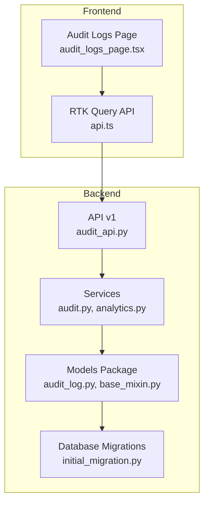
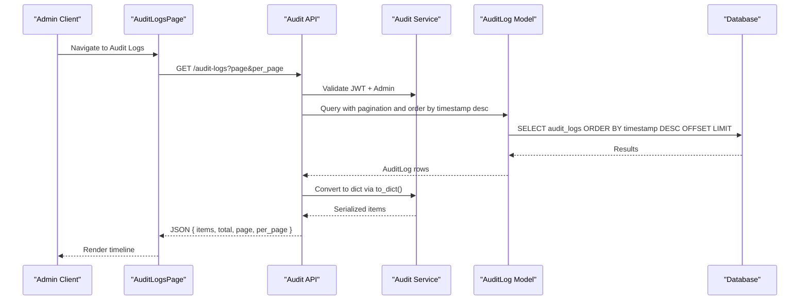
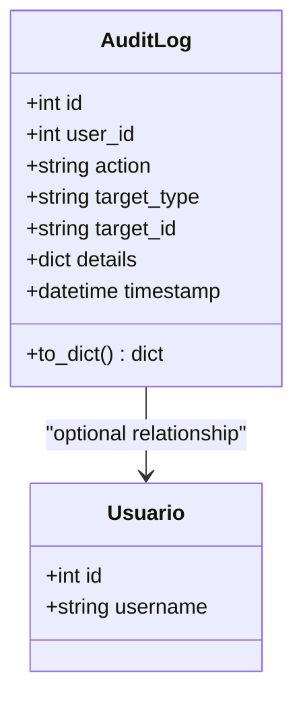
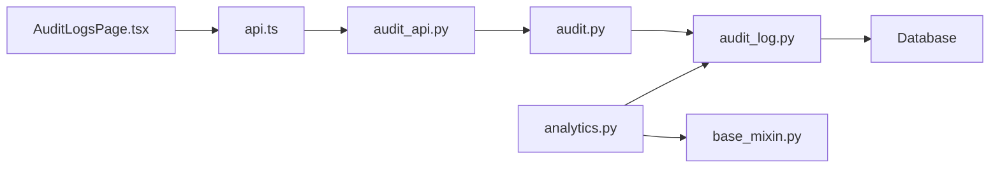
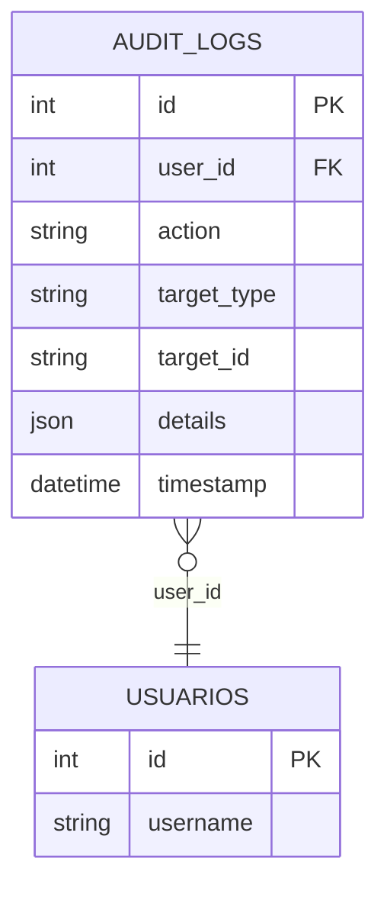

# Audit & Analytics Models

<cite>
**Referenced Files in This Document**
- [audit_log.py](file://backend/app/models/audit_log.py)
- [audit.py](file://backend/app/services/audit.py)
- [audit_api.py](file://backend/app/api/v1/audit.py)
- [audit_logs_page.tsx](file://frontend/src/features/usuarios/AuditLogsPage.tsx)
- [api.ts](file://frontend/src/lib/api.ts)
- [analytics.py](file://backend/app/services/analytics.py)
- [base_mixin.py](file://backend/app/models/base_mixin.py)
- [__init__.py](file://backend/app/models/__init__.py)
- [initial_migration.py](file://backend/migrations/versions/ddb44b2eb3a0_initial_migration.py)
</cite>

## Table of Contents
1. [Introduction](#introduction)
2. [Project Structure](#project-structure)
3. [Core Components](#core-components)
4. [Architecture Overview](#architecture-overview)
5. [Detailed Component Analysis](#detailed-component-analysis)
6. [Dependency Analysis](#dependency-analysis)
7. [Performance Considerations](#performance-considerations)
8. [Troubleshooting Guide](#troubleshooting-guide)
9. [Conclusion](#conclusion)
10. [Appendices](#appendices)

## Introduction
This document provides comprehensive data model documentation for audit and analytics tracking entities within the platform. It focuses on the AuditLog model for system activity tracking, detailing field specifications, timestamp precision, user identification, action categorization, and data change logging. It also covers audit log retention considerations, search and filtering capabilities, and integration with security monitoring. Additionally, it outlines examples of audit event recording, log analysis patterns, and compliance reporting approaches.

## Project Structure
The audit and analytics functionality spans backend SQLAlchemy models, service-layer logging, Flask API endpoints, and frontend UI components. The models are organized under the backend app models package, with dedicated services and API modules supporting audit logging and analytics computation.

**Diagram sources**
- [audit_log.py:1-29](file://backend/app/models/audit_log.py#L1-L29)
- [audit.py:1-17](file://backend/app/services/audit.py#L1-L17)
- [audit_api.py:1-41](file://backend/app/api/v1/audit.py#L1-L41)
- [audit_logs_page.tsx:1-209](file://frontend/src/features/usuarios/AuditLogsPage.tsx#L1-L209)
- [api.ts:660-663](file://frontend/src/lib/api.ts#L660-L663)
- [base_mixin.py:1-22](file://backend/app/models/base_mixin.py#L1-L22)
- [initial_migration.py:1-70](file://backend/migrations/versions/ddb44b2eb3a0_initial_migration.py#L1-L70)

**Section sources**
- [__init__.py:1-13](file://backend/app/models/__init__.py#L1-L13)

## Core Components
- AuditLog model: Defines the audit trail entity with fields for user identification, action type, target entity, optional target identifier, JSON details payload, and timestamp.
- Audit logging service: Provides a centralized function to record audit actions without committing the transaction.
- Audit API endpoint: Exposes a paginated GET endpoint for retrieving audit logs, secured and filtered for administrators.
- Frontend audit logs page: Renders audit events in a timeline UI, displaying action type, actor, target, and details.
- Analytics service: Computes dashboard KPIs and teacher-specific analytics, integrating tenant and academic year scoping.

**Section sources**
- [audit_log.py:7-29](file://backend/app/models/audit_log.py#L7-L29)
- [audit.py:4-16](file://backend/app/services/audit.py#L4-L16)
- [audit_api.py:12-37](file://backend/app/api/v1/audit.py#L12-L37)
- [audit_logs_page.tsx:29-209](file://frontend/src/features/usuarios/AuditLogsPage.tsx#L29-L209)
- [analytics.py:35-84](file://backend/app/services/analytics.py#L35-L84)

## Architecture Overview
The audit and analytics architecture follows a layered pattern:
- Data layer: SQLAlchemy model for AuditLog with foreign key to users and JSON details.
- Service layer: Centralized logging function invoked around business operations.
- API layer: Flask endpoint secured with JWT and admin permissions, returning paginated audit logs.
- Presentation layer: React UI consuming RTK Query to display audit timelines and summaries.

**Diagram sources**
- [audit_api.py:12-37](file://backend/app/api/v1/audit.py#L12-L37)
- [audit.py:4-16](file://backend/app/services/audit.py#L4-L16)
- [audit_log.py:20-28](file://backend/app/models/audit_log.py#L20-L28)

## Detailed Component Analysis

### AuditLog Model
The AuditLog model defines the audit trail schema:
- Identity: Auto-increment integer primary key.
- Actor: Optional foreign key to users; nullable to support system-initiated actions.
- Action: String field indicating the operation (e.g., CREATE, UPDATE, DELETE, LOGIN, EXPORT).
- Target: Entity type (e.g., Nota, Aluno, Usuario, Ocorrencia) and optional target identifier.
- Details: JSON payload capturing diffs or snapshots of changed data.
- Timestamp: DateTime with default set to current time.

**Diagram sources**
- [audit_log.py:7-29](file://backend/app/models/audit_log.py#L7-L29)

Field specifications and behavior:
- user_id: Integer foreign key to users; nullable to represent system actions.
- action: String up to 50 characters; typical values include CRUD operations and system events.
- target_type: String up to 50 characters; identifies the affected domain entity.
- target_id: String up to 50 characters; optional identifier of the specific target instance.
- details: JSON; optional structured payload (e.g., diffs or snapshots).
- timestamp: DateTime; default current time.

Timestamp precision:
- The model stores timestamps at the DateTime level. The API endpoint orders results by timestamp descending to support chronological views.

User identification:
- The model includes a relationship to the user entity. The serialization method maps missing user references to a system actor indicator.

Action categorization:
- Typical categories include create, update, delete, login, and export actions. The UI applies color-coded chips based on action keywords.

Data change logging:
- The details field is intended for storing change metadata (e.g., diffs or snapshots). The service layer accepts a details dictionary and persists it as JSON.

Retention considerations:
- The current model and API do not include built-in retention policies. Retention and archival strategies should be implemented at the database or external logging layer.

Search and filtering:
- The API supports pagination and sorts by timestamp. Additional filters (e.g., by user, action, target) are not present in the current endpoint.

Integration with security monitoring:
- The API requires JWT authentication and admin privileges. The model’s user_id field enables attribution of actions to specific users, facilitating correlation with security events.

Examples of audit event recording:
- Student enrollment lifecycle: CREATE, UPDATE, DELETE actions recorded with target_type "Aluno" and target_id referencing the student instance.
- Grade modification: UPDATE action recorded with target_type "Nota" and details containing grade changes.
- Occurrence management: CREATE, UPDATE, DELETE actions recorded with target_type "Ocorrencia".

Log analysis patterns:
- Timeline aggregation by action type and target entity.
- Filtering by actor (user/system) and time window.
- Drill-down into details for change analysis.

Compliance reporting patterns:
- Use action and timestamp to reconstruct event sequences.
- Export paginated results for periodic compliance reviews.

**Section sources**
- [audit_log.py:7-29](file://backend/app/models/audit_log.py#L7-L29)
- [audit.py:4-16](file://backend/app/services/audit.py#L4-L16)
- [audit_api.py:12-37](file://backend/app/api/v1/audit.py#L12-L37)
- [audit_logs_page.tsx:56-61](file://frontend/src/features/usuarios/AuditLogsPage.tsx#L56-L61)

### Audit Logging Service
The service provides a single function to create and enqueue audit log entries:
- Accepts user_id, action, target_type, optional target_id, and optional details.
- Constructs an AuditLog instance and adds it to the provided SQLAlchemy session.
- Does not commit the session, allowing callers to batch operations.

Operational notes:
- Callers must manage transaction boundaries and commit as appropriate.
- The function normalizes target_id to string when provided.

**Section sources**
- [audit.py:4-16](file://backend/app/services/audit.py#L4-L16)

### Audit API Endpoint
The API endpoint exposes a paginated audit log listing:
- Requires JWT authentication and admin role.
- Supports page and per_page query parameters with sensible defaults and limits.
- Returns items serialized via the model’s to_dict method, including computed user and target labels.

Pagination behavior:
- page defaults to 1 and is clamped to a minimum of 1.
- per_page defaults to 20 and is capped at 100.

Sorting and ordering:
- Results are ordered by timestamp descending to show most recent events first.

**Section sources**
- [audit_api.py:12-37](file://backend/app/api/v1/audit.py#L12-L37)

### Frontend Audit Logs Page
The frontend renders audit events in a responsive timeline:
- Uses RTK Query to fetch audit logs from the API.
- Displays action type with color-coded chips, relative timestamps, actor information, target entity, and details in a scrollable panel.
- Includes summary cards for recent events and critical actions.

UI highlights:
- Action color mapping based on action keywords.
- Relative time formatting and absolute timestamp display.
- Monospace details rendering for structured payloads.

**Section sources**
- [audit_logs_page.tsx:29-209](file://frontend/src/features/usuarios/AuditLogsPage.tsx#L29-L209)
- [api.ts:660-663](file://frontend/src/lib/api.ts#L660-L663)

### Analytics Service
The analytics service computes dashboard KPIs and teacher-specific analytics:
- DashboardAnalytics dataclass defines total students, total classes, overall average grade, and at-risk students.
- build_dashboard_metrics aggregates counts and averages with tenant and academic year scoping.
- build_teacher_dashboard computes performance distributions, risk alerts, class counts, and global statistics with optional filters.

Scoping and filtering:
- Uses TenantYearMixin fields to constrain queries by tenant_id and academic_year_id.
- Applies filters for query terms, shift, class, and active student status.

Risk alerts:
- Identifies at-risk students based on grade thresholds and integrates with AI predictor for risk scores.

**Section sources**
- [analytics.py:10-33](file://backend/app/services/analytics.py#L10-L33)
- [analytics.py:35-84](file://backend/app/services/analytics.py#L35-L84)
- [analytics.py:86-196](file://backend/app/services/analytics.py#L86-L196)
- [base_mixin.py:4-22](file://backend/app/models/base_mixin.py#L4-L22)

## Dependency Analysis
The audit and analytics components exhibit clear separation of concerns:
- Models depend on SQLAlchemy declarative base and define relationships.
- Services depend on models and SQLAlchemy sessions.
- API depends on services and enforces authentication and authorization.
- Frontend depends on RTK Query and consumes API endpoints.

**Diagram sources**
- [audit_logs_page.tsx:29-209](file://frontend/src/features/usuarios/AuditLogsPage.tsx#L29-L209)
- [api.ts:660-663](file://frontend/src/lib/api.ts#L660-L663)
- [audit_api.py:12-37](file://backend/app/api/v1/audit.py#L12-L37)
- [audit.py:4-16](file://backend/app/services/audit.py#L4-L16)
- [audit_log.py:7-29](file://backend/app/models/audit_log.py#L7-L29)
- [analytics.py:35-84](file://backend/app/services/analytics.py#L35-L84)
- [base_mixin.py:4-22](file://backend/app/models/base_mixin.py#L4-L22)

**Section sources**
- [__init__.py:8](file://backend/app/models/__init__.py#L8)

## Performance Considerations
- Pagination: The API caps per_page at 100 and uses offset/limit for efficient retrieval.
- Indexing: Consider adding indexes on user_id, target_type, and timestamp for frequent filtering and sorting.
- JSON details: Large details payloads increase storage and transfer overhead; consider archiving or compression strategies.
- Transaction batching: The service does not commit; batch multiple audit entries within a single transaction to reduce overhead.
- Frontend rendering: The UI renders a timeline; virtualization or lazy loading could improve performance for large datasets.

## Troubleshooting Guide
Common issues and resolutions:
- Authentication failures: Ensure JWT tokens are included and valid; the endpoint requires admin privileges.
- Empty results: Verify that the requested page range is valid and that audit events exist for the given tenant and academic year.
- Missing user context: When user_id is null, the serialized output indicates a system actor; confirm whether the action was initiated by a user or system process.
- Large details payloads: If details are very large, consider truncating or offloading to a separate storage mechanism.

**Section sources**
- [audit_api.py:12-37](file://backend/app/api/v1/audit.py#L12-L37)
- [audit_log.py:20-28](file://backend/app/models/audit_log.py#L20-L28)

## Conclusion
The audit and analytics subsystem provides a robust foundation for tracking system activities and generating actionable insights. The AuditLog model captures essential attributes for tracing actions, while the service and API layers enable secure, paginated retrieval. The analytics service leverages tenant and academic year scoping to deliver targeted dashboards. Extending the system with retention policies, advanced filtering, and enhanced security integrations will further strengthen compliance and operational visibility.

## Appendices

### Audit Log Data Model Schema

**Diagram sources**
- [audit_log.py:7-29](file://backend/app/models/audit_log.py#L7-L29)

### Audit Event Recording Examples
- Student enrollment: CREATE action with target_type "Aluno" and target_id referencing the student instance.
- Grade update: UPDATE action with target_type "Nota" and details containing grade changes.
- Occurrence deletion: DELETE action with target_type "Ocorrencia" and target_id referencing the occurrence instance.

**Section sources**
- [audit.py:4-16](file://backend/app/services/audit.py#L4-L16)

### Audit Log Retention Policies
- Current implementation: No built-in retention or archival logic.
- Recommended approach: Implement database-level retention or integrate with an external logging system to enforce time-based retention and immutability.

[No sources needed since this section provides general guidance]

### Search and Filtering Capabilities
- Current API: Pagination and timestamp ordering; no explicit filters for user, action, or target.
- Enhancement ideas: Add query parameters for user_id, action, target_type, target_id, and date ranges.

**Section sources**
- [audit_api.py:12-37](file://backend/app/api/v1/audit.py#L12-L37)

### Integration with Security Monitoring
- Access control: Admin-only endpoint with JWT requirement.
- Attribution: user_id links actions to specific users for correlation.
- Next steps: Enforce checksums, immutable storage, and real-time alerting for critical events.

[No sources needed since this section provides general guidance]