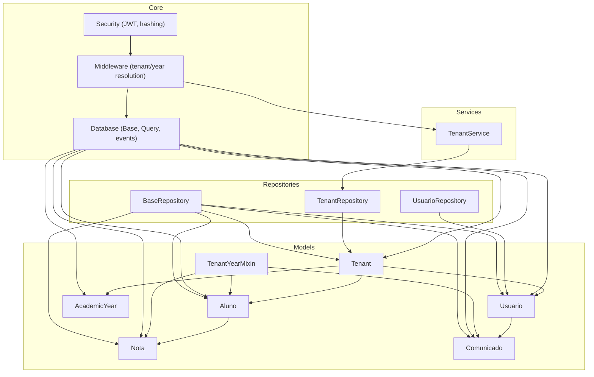
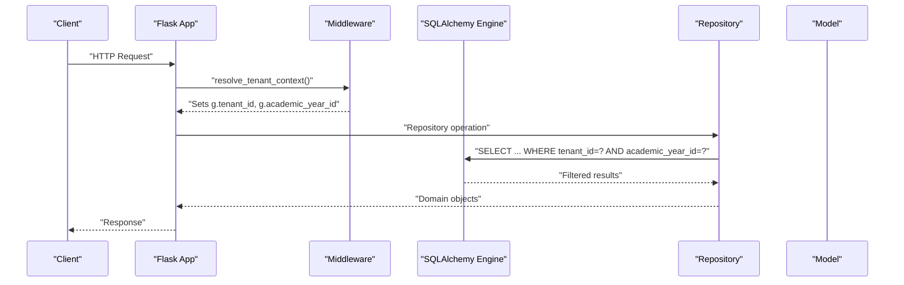
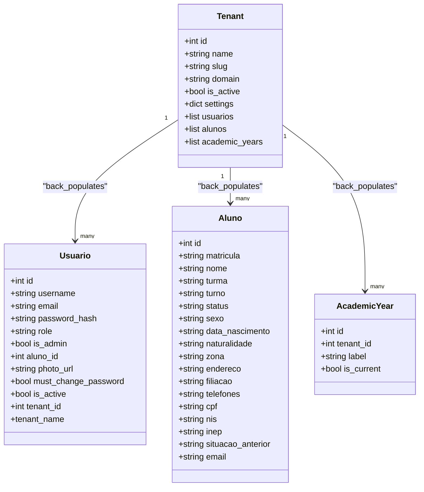
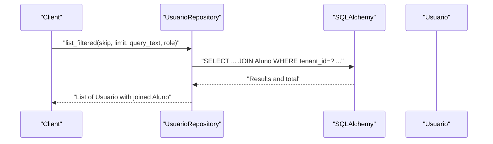
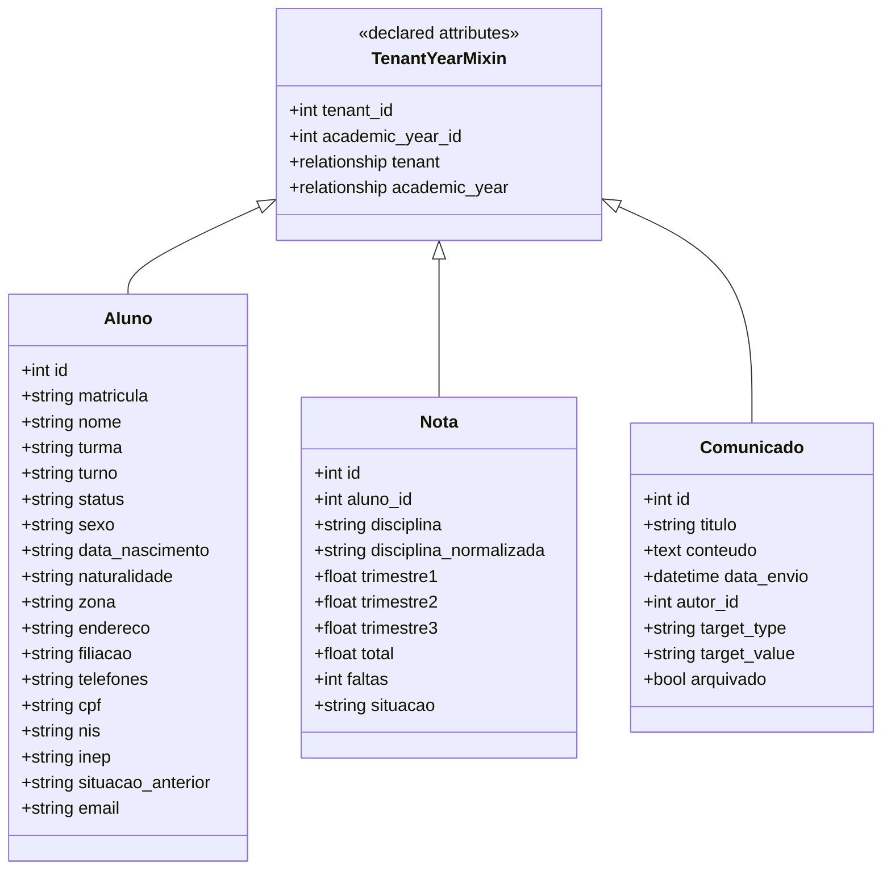
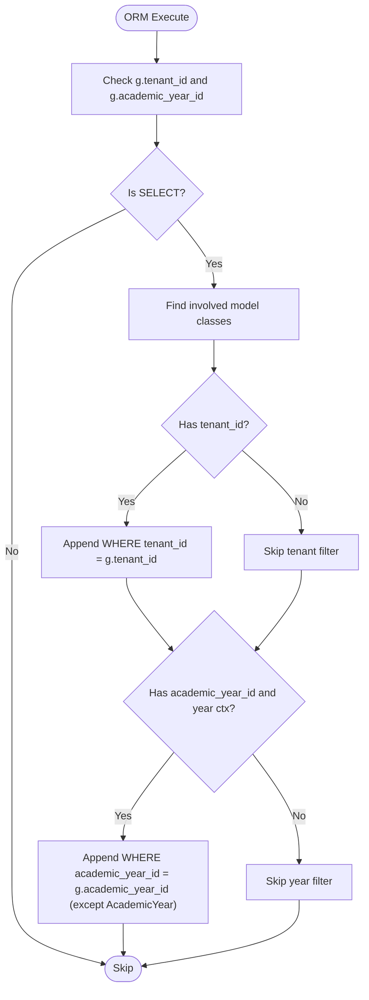
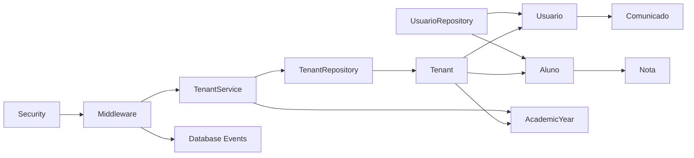

# Core Models

<cite>
**Referenced Files in This Document**
- [backend/app/models/tenant.py](file://backend/app/models/tenant.py)
- [backend/app/models/usuario.py](file://backend/app/models/usuario.py)
- [backend/app/models/base_mixin.py](file://backend/app/models/base_mixin.py)
- [backend/app/models/academic_year.py](file://backend/app/models/academic_year.py)
- [backend/app/models/aluno.py](file://backend/app/models/aluno.py)
- [backend/app/models/nota.py](file://backend/app/models/nota.py)
- [backend/app/models/comunicado.py](file://backend/app/models/comunicado.py)
- [backend/app/models/__init__.py](file://backend/app/models/__init__.py)
- [backend/app/core/database.py](file://backend/app/core/database.py)
- [backend/app/core/middleware.py](file://backend/app/core/middleware.py)
- [backend/app/core/security.py](file://backend/app/core/security.py)
- [backend/app/repositories/tenant_repository.py](file://backend/app/repositories/tenant_repository.py)
- [backend/app/repositories/usuario_repository.py](file://backend/app/repositories/usuario_repository.py)
- [backend/app/repositories/base.py](file://backend/app/repositories/base.py)
- [backend/app/services/tenant_service.py](file://backend/app/services/tenant_service.py)
- [backend/migrations/versions/a1b2c3d4e5f6_add_tenants.py](file://backend/migrations/versions/a1b2c3d4e5f6_add_tenants.py)
</cite>

## Table of Contents
1. [Introduction](#introduction)
2. [Project Structure](#project-structure)
3. [Core Components](#core-components)
4. [Architecture Overview](#architecture-overview)
5. [Detailed Component Analysis](#detailed-component-analysis)
6. [Dependency Analysis](#dependency-analysis)
7. [Performance Considerations](#performance-considerations)
8. [Troubleshooting Guide](#troubleshooting-guide)
9. [Conclusion](#conclusion)

## Introduction
This document describes the core foundational models that power multi-tenant isolation and user management in ColaboraEdu. It focuses on:
- Tenant: multi-tenant container with domain and slug resolution
- Usuario: user account with role-based access and optional student linkage
- Base mixins and tenant-aware models: shared tenant and academic-year scoping
It explains field definitions, data types, constraints, relationships, and indexing strategies. It also documents tenant-aware query filtering via SQLAlchemy events and middleware-driven tenant context resolution, along with practical instantiation, querying, and manipulation patterns.

## Project Structure
The core models live under backend/app/models and are complemented by database configuration, middleware, repositories, and migrations that enforce tenant and academic-year scoping.

**Diagram sources**
- [backend/app/models/tenant.py:1-22](file://backend/app/models/tenant.py#L1-L22)
- [backend/app/models/usuario.py:1-30](file://backend/app/models/usuario.py#L1-L30)
- [backend/app/models/academic_year.py:1-16](file://backend/app/models/academic_year.py#L1-L16)
- [backend/app/models/aluno.py:1-36](file://backend/app/models/aluno.py#L1-L36)
- [backend/app/models/nota.py:1-24](file://backend/app/models/nota.py#L1-L24)
- [backend/app/models/comunicado.py:1-39](file://backend/app/models/comunicado.py#L1-L39)
- [backend/app/models/base_mixin.py:1-22](file://backend/app/models/base_mixin.py#L1-L22)
- [backend/app/core/database.py:1-130](file://backend/app/core/database.py#L1-L130)
- [backend/app/core/middleware.py:1-125](file://backend/app/core/middleware.py#L1-L125)
- [backend/app/repositories/tenant_repository.py:1-21](file://backend/app/repositories/tenant_repository.py#L1-L21)
- [backend/app/repositories/usuario_repository.py:1-68](file://backend/app/repositories/usuario_repository.py#L1-L68)
- [backend/app/repositories/base.py:1-41](file://backend/app/repositories/base.py#L1-L41)
- [backend/app/services/tenant_service.py:1-29](file://backend/app/services/tenant_service.py#L1-L29)

**Section sources**
- [backend/app/models/__init__.py:1-13](file://backend/app/models/__init__.py#L1-L13)
- [backend/app/core/database.py:1-130](file://backend/app/core/database.py#L1-L130)
- [backend/app/core/middleware.py:1-125](file://backend/app/core/middleware.py#L1-L125)

## Core Components
This section documents the three core models and supporting constructs.

- Tenant
  - Purpose: Multi-tenant container with domain and slug-based identification, optional custom domain, activation flag, and JSON settings.
  - Fields and types:
    - id: integer, primary key, autoincrement
    - name: string, max length 255, not null
    - slug: string, max length 64, unique, not null
    - domain: string, max length 255, unique, nullable
    - is_active: boolean, default true
    - settings: JSON, nullable
  - Relationships:
    - usuarios: one-to-many back-populated from Usuario
    - alunos: one-to-many back-populated from Aluno
    - academic_years: one-to-many back-populated from AcademicYear, cascade delete-orphan
  - Indexing: implicit via unique constraints on slug and domain; explicit index on tenant_id in TenantYearMixin-backed models.

- Usuario
  - Purpose: User account with credentials, role, admin flag, optional student linkage, profile photo, password policy flag, and activity flag.
  - Fields and types:
    - id: integer, primary key, autoincrement
    - username: string, max length 80, unique, not null
    - email: string, max length 255, unique, nullable
    - password_hash: string, max length 255, not null
    - role: string, max length 32, default "professor"
    - is_admin: boolean, default false
    - aluno_id: integer, foreign key to alunos.id, nullable
    - photo_url: string, max length 255, nullable
    - must_change_password: boolean, default false
    - is_active: boolean, default true
    - tenant_id: integer, foreign key to tenants.id, nullable
  - Relationships:
    - aluno: one-to-one back-populated from Aluno
    - tenant: one-to-one back-populated from Tenant
  - Accessors:
    - tenant_name: property returning tenant.name if linked, else None

- TenantYearMixin
  - Purpose: Shared tenant and academic-year scoping for models requiring multi-tenant and academic-year isolation.
  - Declared attributes:
    - tenant_id: integer, foreign key to tenants.id, not null, indexed
    - academic_year_id: integer, foreign key to academic_years.id, not null, indexed
    - tenant: relationship to Tenant
    - academic_year: relationship to AcademicYear

- AcademicYear
  - Purpose: Academic year container per tenant with label and current-year flag.
  - Fields and types:
    - id: integer, primary key, autoincrement
    - tenant_id: integer, foreign key to tenants.id, not null, indexed
    - label: string, max length 32, not null (e.g., "2024")
    - is_current: boolean, default true
  - Relationships:
    - tenant: one-to-many back-populated from Tenant

- Related tenant-aware models (examples)
  - Aluno: inherits TenantYearMixin; includes personal and enrollment data; relationships to Nota and optional Usuario linkage.
  - Nota: inherits TenantYearMixin; grade records per student per discipline per trimester.
  - Comunicado: inherits TenantYearMixin; announcements authored by users; supports targeting strategies.

Validation and constraints
- Unique constraints:
  - Tenant.slug and Tenant.domain
  - Usuario.username and Usuario.email
  - Aluno.matricula (inherited from model definition)
- Foreign keys:
  - Usuario.tenant_id -> tenants.id
  - Usuario.aluno_id -> alunos.id
  - Aluno.tenant_id -> tenants.id
  - Nota.aluno_id -> alunos.id (with cascade delete)
  - AcademicYear.tenant_id -> tenants.id
  - Comunicado.autor_id -> usuarios.id
- Defaults:
  - Tenant.is_active defaults to true
  - Usuario.role defaults to "professor"
  - Usuario.is_admin defaults to false
  - Usuario.must_change_password defaults to false
  - Usuario.is_active defaults to true
  - AcademicYear.is_current defaults to true

**Section sources**
- [backend/app/models/tenant.py:1-22](file://backend/app/models/tenant.py#L1-L22)
- [backend/app/models/usuario.py:1-30](file://backend/app/models/usuario.py#L1-L30)
- [backend/app/models/base_mixin.py:1-22](file://backend/app/models/base_mixin.py#L1-L22)
- [backend/app/models/academic_year.py:1-16](file://backend/app/models/academic_year.py#L1-L16)
- [backend/app/models/aluno.py:1-36](file://backend/app/models/aluno.py#L1-L36)
- [backend/app/models/nota.py:1-24](file://backend/app/models/nota.py#L1-L24)
- [backend/app/models/comunicado.py:1-39](file://backend/app/models/comunicado.py#L1-L39)
- [backend/migrations/versions/a1b2c3d4e5f6_add_tenants.py:1-56](file://backend/migrations/versions/a1b2c3d4e5f6_add_tenants.py#L1-L56)

## Architecture Overview
ColaboraEdu enforces multi-tenant and academic-year isolation through:
- Middleware that resolves tenant and academic year from JWT claims, headers, or host, storing them in Flask’s g.
- SQLAlchemy event hook that automatically appends tenant_id and academic_year_id filters to SELECT statements when a tenant context exists.
- Tenant-aware models that embed tenant and academic-year scoping via TenantYearMixin.

**Diagram sources**
- [backend/app/core/middleware.py:1-125](file://backend/app/core/middleware.py#L1-L125)
- [backend/app/core/database.py:39-102](file://backend/app/core/database.py#L39-L102)
- [backend/app/repositories/base.py:1-41](file://backend/app/repositories/base.py#L1-L41)

**Section sources**
- [backend/app/core/database.py:1-130](file://backend/app/core/database.py#L1-L130)
- [backend/app/core/middleware.py:1-125](file://backend/app/core/middleware.py#L1-L125)

## Detailed Component Analysis

### Tenant Model
- Purpose: Central tenant entity enabling multi-tenant separation and branding.
- Key behaviors:
  - Domain and slug resolution for routing and branding.
  - Settings storage as JSON for tenant-specific configuration.
  - Relationships to users, students, and academic years.
- Typical operations:
  - Instantiate: create a new tenant with name, slug, optional domain, and settings.
  - Query: resolve by domain or slug using TenantRepository.
  - Manipulate: activate/deactivate via is_active; update settings via settings JSON.

**Diagram sources**
- [backend/app/models/tenant.py:1-22](file://backend/app/models/tenant.py#L1-L22)
- [backend/app/models/usuario.py:1-30](file://backend/app/models/usuario.py#L1-L30)
- [backend/app/models/academic_year.py:1-16](file://backend/app/models/academic_year.py#L1-L16)
- [backend/app/models/aluno.py:1-36](file://backend/app/models/aluno.py#L1-L36)

**Section sources**
- [backend/app/models/tenant.py:1-22](file://backend/app/models/tenant.py#L1-L22)
- [backend/app/repositories/tenant_repository.py:1-21](file://backend/app/repositories/tenant_repository.py#L1-L21)
- [backend/app/services/tenant_service.py:1-29](file://backend/app/services/tenant_service.py#L1-L29)

### Usuario Model
- Purpose: User account abstraction with role-based access control and optional linkage to a student record.
- Role-based access control:
  - role field defines functional role (e.g., professor).
  - is_admin flag indicates administrative privileges.
  - JWT claims include roles; middleware enforces context and allows header-based tenant switching only for super_admin.
- Typical operations:
  - Instantiate: create user with credentials, role, and optional tenant linkage.
  - Query: fetch by username; filter by role and text search across usernames and student names.
  - Manipulate: update profile, change password, toggle must_change_password, deactivate via is_active.

**Diagram sources**
- [backend/app/repositories/usuario_repository.py:1-68](file://backend/app/repositories/usuario_repository.py#L1-L68)
- [backend/app/core/database.py:39-102](file://backend/app/core/database.py#L39-L102)

**Section sources**
- [backend/app/models/usuario.py:1-30](file://backend/app/models/usuario.py#L1-L30)
- [backend/app/repositories/usuario_repository.py:1-68](file://backend/app/repositories/usuario_repository.py#L1-L68)
- [backend/app/core/security.py:1-62](file://backend/app/core/security.py#L1-L62)

### Base Mixins and Tenant-Aware Models
- TenantYearMixin:
  - Adds tenant_id and academic_year_id fields with foreign keys to tenants and academic_years.
  - Provides relationships and indexes for efficient filtering.
- Tenant-aware models:
  - Aluno, Nota, and Comunicado inherit TenantYearMixin, ensuring automatic tenant and academic-year scoping.
- Migration impact:
  - Adds tenant_id to usuarios and alunos and creates tenants table with unique constraints.

**Diagram sources**
- [backend/app/models/base_mixin.py:1-22](file://backend/app/models/base_mixin.py#L1-L22)
- [backend/app/models/aluno.py:1-36](file://backend/app/models/aluno.py#L1-L36)
- [backend/app/models/nota.py:1-24](file://backend/app/models/nota.py#L1-L24)
- [backend/app/models/comunicado.py:1-39](file://backend/app/models/comunicado.py#L1-L39)

**Section sources**
- [backend/app/models/base_mixin.py:1-22](file://backend/app/models/base_mixin.py#L1-L22)
- [backend/migrations/versions/a1b2c3d4e5f6_add_tenants.py:1-56](file://backend/migrations/versions/a1b2c3d4e5f6_add_tenants.py#L1-L56)

### Tenant-Aware Query Filtering
- Mechanism:
  - SQLAlchemy event listener on do_orm_execute intercepts SELECT statements.
  - If a tenant context exists (g.tenant_id), it appends WHERE tenant_id = X.
  - If academic year context exists (g.academic_year_id) and the model has academic_year_id, it appends WHERE academic_year_id = Y.
  - Special handling avoids filtering AcademicYear itself to allow listing/selecting years.
- Repository pattern:
  - BaseRepository provides generic CRUD; tenant filtering is enforced at the SQL level via events.
  - TenantRepository and UsuarioRepository demonstrate targeted queries with joins and counts.

**Diagram sources**
- [backend/app/core/database.py:39-102](file://backend/app/core/database.py#L39-L102)

**Section sources**
- [backend/app/core/database.py:1-130](file://backend/app/core/database.py#L1-L130)
- [backend/app/repositories/base.py:1-41](file://backend/app/repositories/base.py#L1-L41)

## Dependency Analysis
- Model dependencies:
  - Tenant is central; Usuario and Aluno both link to Tenant.
  - AcademicYear belongs to Tenant; Aluno and Nota belong to AcademicYear via TenantYearMixin.
  - Comunicado links to Usuario (author).
- Repository and service dependencies:
  - TenantRepository depends on Tenant.
  - UsuarioRepository depends on Usuario and Aluno; uses joinedload and outerjoin for filtering.
  - TenantService depends on TenantRepository and AcademicYear for current year resolution.
- Middleware and security:
  - Middleware sets tenant and academic-year context in g; security provides JWT utilities used by middleware.

**Diagram sources**
- [backend/app/models/tenant.py:1-22](file://backend/app/models/tenant.py#L1-L22)
- [backend/app/models/usuario.py:1-30](file://backend/app/models/usuario.py#L1-L30)
- [backend/app/models/academic_year.py:1-16](file://backend/app/models/academic_year.py#L1-L16)
- [backend/app/models/aluno.py:1-36](file://backend/app/models/aluno.py#L1-L36)
- [backend/app/models/nota.py:1-24](file://backend/app/models/nota.py#L1-L24)
- [backend/app/models/comunicado.py:1-39](file://backend/app/models/comunicado.py#L1-L39)
- [backend/app/repositories/tenant_repository.py:1-21](file://backend/app/repositories/tenant_repository.py#L1-L21)
- [backend/app/repositories/usuario_repository.py:1-68](file://backend/app/repositories/usuario_repository.py#L1-L68)
- [backend/app/services/tenant_service.py:1-29](file://backend/app/services/tenant_service.py#L1-L29)
- [backend/app/core/middleware.py:1-125](file://backend/app/core/middleware.py#L1-L125)
- [backend/app/core/database.py:39-102](file://backend/app/core/database.py#L39-L102)
- [backend/app/core/security.py:1-62](file://backend/app/core/security.py#L1-L62)

**Section sources**
- [backend/app/models/__init__.py:1-13](file://backend/app/models/__init__.py#L1-L13)
- [backend/app/repositories/base.py:1-41](file://backend/app/repositories/base.py#L1-L41)

## Performance Considerations
- Indexing:
  - tenant_id and academic_year_id are indexed via TenantYearMixin; ensure additional indexes on frequently filtered columns (e.g., username, email, matricula) as needed.
- Query patterns:
  - Prefer joinedloads and outerjoins for filtered listings to minimize round trips.
  - Use pagination (skip/limit) and counts to avoid large result sets.
- Event filtering:
  - The automatic tenant and year filters occur at the SQL level; ensure models consistently include tenant_id and academic_year_id to leverage the filters.
- Caching:
  - Consider caching tenant and academic-year metadata for hot paths; avoid caching tenant-scoped data without tenant context.

[No sources needed since this section provides general guidance]

## Troubleshooting Guide
- Tenant not resolved:
  - Verify JWT claims include tenant_id or that Host header matches a known domain; confirm middleware sets g.tenant_id and g.academic_year_id.
- Queries return empty:
  - Confirm tenant context is present; ensure models include tenant_id and academic_year_id; check that the event listener is active.
- Duplicate constraint errors:
  - Unique violations on username, email, slug, domain, or matricula indicate existing records; adjust inputs accordingly.
- Academic year switching:
  - Use X-Academic-Year-ID header or JWT claim to switch; ensure AcademicYear.is_current is set appropriately per tenant.

**Section sources**
- [backend/app/core/middleware.py:1-125](file://backend/app/core/middleware.py#L1-L125)
- [backend/app/core/database.py:39-102](file://backend/app/core/database.py#L39-L102)
- [backend/migrations/versions/a1b2c3d4e5f6_add_tenants.py:1-56](file://backend/migrations/versions/a1b2c3d4e5f6_add_tenants.py#L1-L56)

## Conclusion
The core models establish a robust, tenant- and year-aware foundation for ColaboraEdu. Tenant encapsulates multi-tenant boundaries, Usuario manages identities and roles, and TenantYearMixin ensures consistent isolation across data models. Middleware and SQLAlchemy events enforce tenant and academic-year scoping transparently, while repositories provide clean, tenant-aware query patterns. Together, these components support secure, scalable multi-tenant operations with clear separation of concerns.