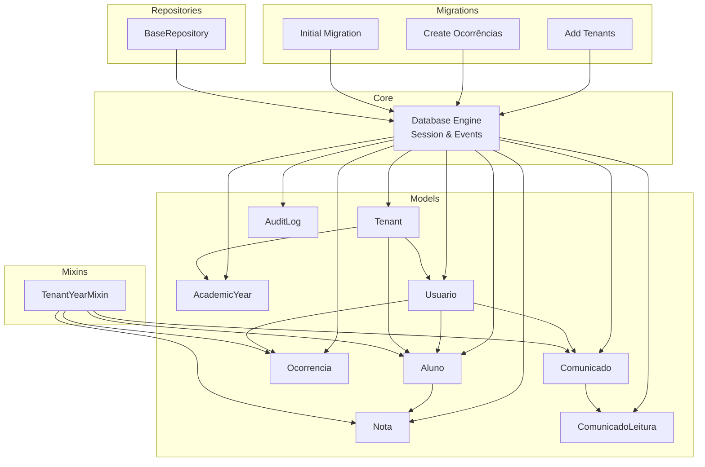
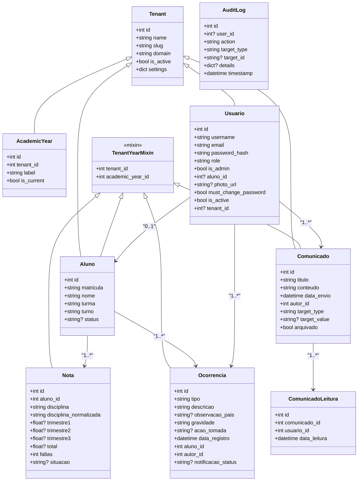
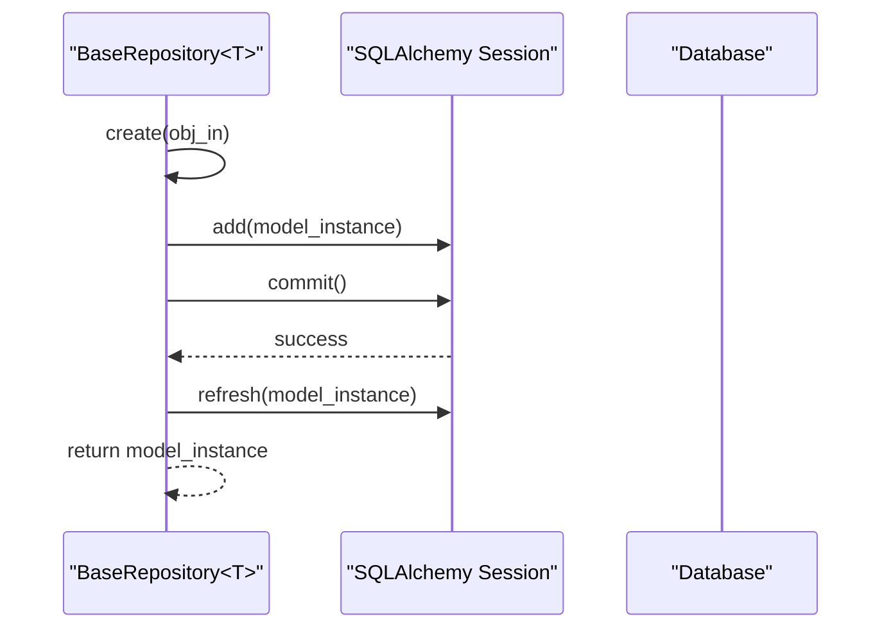
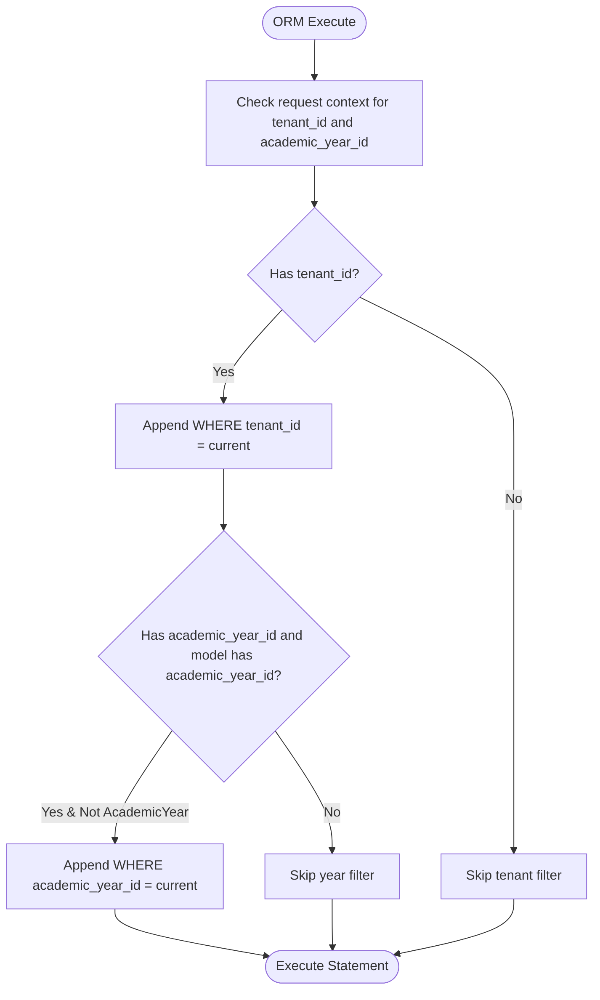
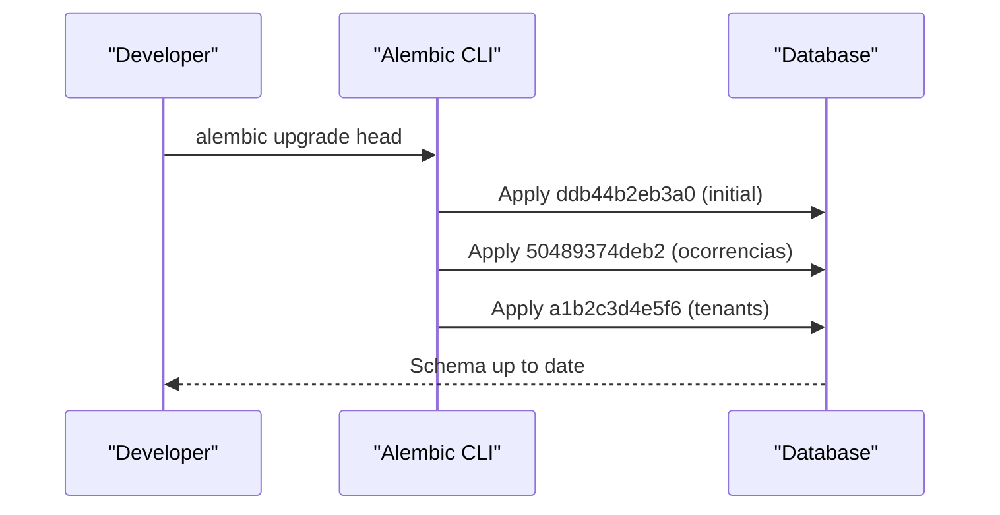
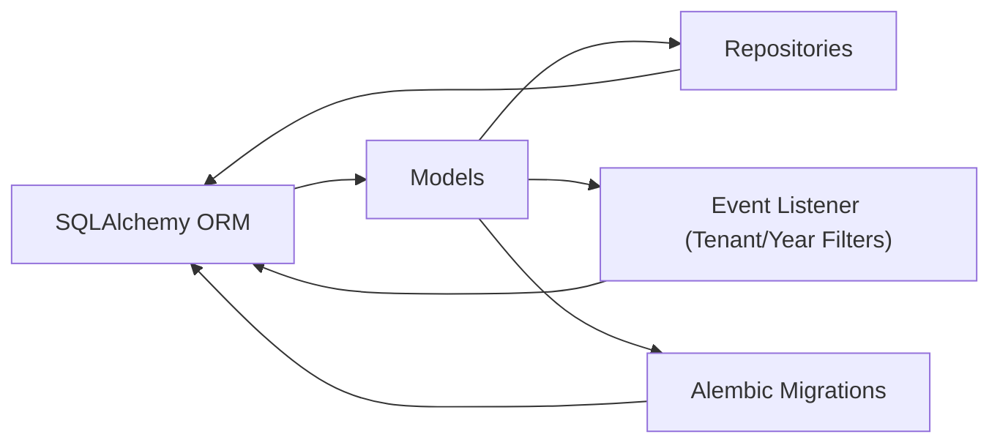

# Data Models & Database Design

<cite>
**Referenced Files in This Document**
- [models/__init__.py](file://backend/app/models/__init__.py)
- [models/base_mixin.py](file://backend/app/models/base_mixin.py)
- [models/tenant.py](file://backend/app/models/tenant.py)
- [models/aluno.py](file://backend/app/models/aluno.py)
- [models/usuario.py](file://backend/app/models/usuario.py)
- [models/academic_year.py](file://backend/app/models/academic_year.py)
- [models/nota.py](file://backend/app/models/nota.py)
- [models/ocorrencia.py](file://backend/app/models/ocorrencia.py)
- [models/comunicado.py](file://backend/app/models/comunicado.py)
- [models/comunicado_leitura.py](file://backend/app/models/comunicado_leitura.py)
- [models/audit_log.py](file://backend/app/models/audit_log.py)
- [core/database.py](file://backend/app/core/database.py)
- [repositories/base.py](file://backend/app/repositories/base.py)
- [migrations/versions/ddb44b2eb3a0_initial_migration.py](file://backend/migrations/versions/ddb44b2eb3a0_initial_migration.py)
- [migrations/versions/50489374deb2_create_ocorrencias_table.py](file://backend/migrations/versions/50489374deb2_create_ocorrencias_table.py)
- [migrations/versions/a1b2c3d4e5f6_add_tenants.py](file://backend/migrations/versions/a1b2c3d4e5f6_add_tenants.py)
</cite>

## Table of Contents
1. [Introduction](#introduction)
2. [Project Structure](#project-structure)
3. [Core Components](#core-components)
4. [Architecture Overview](#architecture-overview)
5. [Detailed Component Analysis](#detailed-component-analysis)
6. [Dependency Analysis](#dependency-analysis)
7. [Performance Considerations](#performance-considerations)
8. [Troubleshooting Guide](#troubleshooting-guide)
9. [Conclusion](#conclusion)
10. [Appendices](#appendices)

## Introduction
This document describes the ColaboraEdu database schema and data models. It focuses on entity definitions, relationships, constraints, and tenant-aware design patterns implemented via SQLAlchemy. It also documents repository access patterns, caching strategies, performance considerations, and the migration and versioning approach using Alembic.

## Project Structure
The data model layer is organized under backend/app/models with supporting components in backend/app/core and backend/app/repositories. Migrations live under backend/migrations/versions and are managed by Alembic.



**Diagram sources**
- [models/tenant.py:7-22](file://backend/app/models/tenant.py#L7-L22)
- [models/academic_year.py:6-16](file://backend/app/models/academic_year.py#L6-L16)
- [models/usuario.py:8-30](file://backend/app/models/usuario.py#L8-L30)
- [models/aluno.py:8-36](file://backend/app/models/aluno.py#L8-L36)
- [models/nota.py:9-24](file://backend/app/models/nota.py#L9-L24)
- [models/ocorrencia.py:9-45](file://backend/app/models/ocorrencia.py#L9-L45)
- [models/comunicado.py:8-39](file://backend/app/models/comunicado.py#L8-L39)
- [models/comunicado_leitura.py:7-20](file://backend/app/models/comunicado_leitura.py#L7-L20)
- [models/audit_log.py:7-29](file://backend/app/models/audit_log.py#L7-L29)
- [models/base_mixin.py:4-22](file://backend/app/models/base_mixin.py#L4-L22)
- [core/database.py:10-130](file://backend/app/core/database.py#L10-L130)
- [repositories/base.py:7-41](file://backend/app/repositories/base.py#L7-L41)
- [migrations/versions/ddb44b2eb3a0_initial_migration.py:21-70](file://backend/migrations/versions/ddb44b2eb3a0_initial_migration.py#L21-L70)
- [migrations/versions/50489374deb2_create_ocorrencias_table.py:21-54](file://backend/migrations/versions/50489374deb2_create_ocorrencias_table.py#L21-L54)
- [migrations/versions/a1b2c3d4e5f6_add_tenants.py:17-56](file://backend/migrations/versions/a1b2c3d4e5f6_add_tenants.py#L17-L56)

**Section sources**
- [models/__init__.py:1-13](file://backend/app/models/__init__.py#L1-L13)
- [core/database.py:10-130](file://backend/app/core/database.py#L10-L130)

## Core Components
This section summarizes the core entities and their key attributes, relationships, and constraints.

- Tenant
  - Fields: id (PK), name, slug (unique), domain (unique), is_active, settings (JSON)
  - Relationships: usuarios, alunos, academic_years (cascade delete-orphan)
  - Constraints: unique(slug), unique(domain)

- AcademicYear
  - Fields: id (PK), tenant_id (FK), label, is_current
  - Relationships: tenant
  - Constraints: FK(tenants.id), index(tenant_id)

- Aluno
  - Fields: id (PK), matricula (unique), nome, turma, turno, status (+ personal data fields)
  - Relationships: notas, usuario (one-to-one)
  - Constraints: unique(matricula)

- Usuario
  - Fields: id (PK), username (unique), email (unique), password_hash, role, is_admin, aluno_id (FK), photo_url, must_change_password, is_active, tenant_id (FK)
  - Relationships: aluno, tenant
  - Constraints: unique(username), unique(email), optional FK(alunos.id), optional FK(tenants.id)

- Nota
  - Fields: id (PK), aluno_id (FK), disciplina, disciplina_normalizada, trimestre1..3 (Numeric), total (Numeric), faltas (Integer), situacao
  - Relationships: aluno
  - Constraints: FK(alunos.id, ondelete=CASCADE)

- Ocorrencia
  - Fields: id (PK), tipo, descricao, observacao_pais, gravidade, acao_tomada, data_registro, aluno_id (FK), autor_id (FK), notificacao_status
  - Relationships: aluno, autor (Usuario)
  - Constraints: FK(alunos.id), FK(usuarios.id)

- Comunicado
  - Fields: id (PK), titulo, conteudo, data_envio, autor_id (FK), target_type, target_value, arquivado
  - Relationships: autor (Usuario)
  - Constraints: FK(usuarios.id)

- ComunicadoLeitura
  - Fields: id (PK), comunicado_id (FK), usuario_id (FK), data_leitura
  - Constraints: FK(comunicados.id), FK(usuarios.id), unique(comunicado_id, usuario_id)

- AuditLog
  - Fields: id (PK), user_id (nullable FK), action, target_type, target_id, details (JSON), timestamp
  - Relationships: usuario
  - Constraints: optional FK(usuarios.id)

**Section sources**
- [models/tenant.py:7-22](file://backend/app/models/tenant.py#L7-L22)
- [models/academic_year.py:6-16](file://backend/app/models/academic_year.py#L6-L16)
- [models/aluno.py:8-36](file://backend/app/models/aluno.py#L8-L36)
- [models/usuario.py:8-30](file://backend/app/models/usuario.py#L8-L30)
- [models/nota.py:9-24](file://backend/app/models/nota.py#L9-L24)
- [models/ocorrencia.py:9-45](file://backend/app/models/ocorrencia.py#L9-L45)
- [models/comunicado.py:8-39](file://backend/app/models/comunicado.py#L8-L39)
- [models/comunicado_leitura.py:7-20](file://backend/app/models/comunicado_leitura.py#L7-L20)
- [models/audit_log.py:7-29](file://backend/app/models/audit_log.py#L7-L29)

## Architecture Overview
ColaboraEdu uses a multi-tenant, academic-year-scoped design. The TenantYearMixin adds tenant_id and academic_year_id to applicable entities, enabling per-tenant and per-academic-year isolation. A global SQLAlchemy event listener filters queries by tenant and academic year during request execution. Repositories encapsulate CRUD operations generically.



**Diagram sources**
- [models/tenant.py:7-22](file://backend/app/models/tenant.py#L7-L22)
- [models/academic_year.py:6-16](file://backend/app/models/academic_year.py#L6-L16)
- [models/usuario.py:8-30](file://backend/app/models/usuario.py#L8-L30)
- [models/aluno.py:8-36](file://backend/app/models/aluno.py#L8-L36)
- [models/nota.py:9-24](file://backend/app/models/nota.py#L9-L24)
- [models/ocorrencia.py:9-45](file://backend/app/models/ocorrencia.py#L9-L45)
- [models/comunicado.py:8-39](file://backend/app/models/comunicado.py#L8-L39)
- [models/comunicado_leitura.py:7-20](file://backend/app/models/comunicado_leitura.py#L7-L20)
- [models/audit_log.py:7-29](file://backend/app/models/audit_log.py#L7-L29)
- [models/base_mixin.py:4-22](file://backend/app/models/base_mixin.py#L4-L22)

## Detailed Component Analysis

### Tenant Model
- Purpose: Root isolation unit for multi-tenant deployments.
- Keys and indexes: PK(id); unique constraints on slug and domain.
- Relationships: One-to-many with Usuario, Aluno, AcademicYear; AcademicYear cascade delete-orphan.
- Business rules: is_active flag; settings stored as JSON.

**Section sources**
- [models/tenant.py:7-22](file://backend/app/models/tenant.py#L7-L22)

### AcademicYear Model
- Purpose: Per-tenant academic year scoping.
- Keys and indexes: PK(id); FK(tenant_id) with index; label uniqueness implied by usage.
- Relationships: Many-to-one with Tenant; used by TenantYearMixin-enabled entities.

**Section sources**
- [models/academic_year.py:6-16](file://backend/app/models/academic_year.py#L6-L16)

### TenantYearMixin
- Purpose: Adds tenant_id and academic_year_id to models and establishes relationships to Tenant and AcademicYear.
- Behavior: Injects foreign keys and relationships dynamically; ensures tenant and year filters at query time.

**Section sources**
- [models/base_mixin.py:4-22](file://backend/app/models/base_mixin.py#L4-L22)

### Aluno Model
- Purpose: Student record with enrollment and demographic data.
- Keys and indexes: PK(id); unique(matricula).
- Relationships: One-to-many with Nota; one-to-one with Usuario; many-to-one with Tenant via mixin.
- Validation: String length constraints; optional fields for personal data.

**Section sources**
- [models/aluno.py:8-36](file://backend/app/models/aluno.py#L8-L36)

### Usuario Model
- Purpose: User account with role and optional student linkage.
- Keys and indexes: PK(id); unique(username), unique(email); optional FK to Tenant and Aluno.
- Relationships: Back-populated relationships to Tenant and Aluno; many-to-many via related entities.
- Validation: Role defaults; admin flag; optional profile fields.

**Section sources**
- [models/usuario.py:8-30](file://backend/app/models/usuario.py#L8-L30)

### Nota Model
- Purpose: Academic grades per discipline and trimester.
- Keys and indexes: PK(id); FK(alunos.id, ondelete=CASCADE).
- Data types: Numeric(5,2) for trimesters and total; Integer for absences; String for status.
- Relationships: Many-to-one with Aluno.

**Section sources**
- [models/nota.py:9-24](file://backend/app/models/nota.py#L9-L24)

### Ocorrencia Model
- Purpose: Behavioral/incident records with severity and notification status.
- Keys and indexes: PK(id); FK(alunos.id), FK(usuarios.id).
- Data types: String enums for tipo and gravidade; DateTime for timestamps; Text for descriptions.
- Relationships: Many-to-one with Aluno and Usuario; helper method to_dict for serialization.

**Section sources**
- [models/ocorrencia.py:9-45](file://backend/app/models/ocorrencia.py#L9-L45)

### Comunicado and ComunicadoLeitura Models
- Purpose: Announcement distribution and read tracking.
- Keys and indexes: PK(id); FK(usuarios.id) on Comunicado; composite unique on (comunicado_id, usuario_id) on ComunicadoLeitura.
- Data types: Text for content; DateTime for timestamps; String for targets.
- Relationships: Comunicado to ComunicadoLeitura; Comunicado to Usuario (author).

**Section sources**
- [models/comunicado.py:8-39](file://backend/app/models/comunicado.py#L8-L39)
- [models/comunicado_leitura.py:7-20](file://backend/app/models/comunicado_leitura.py#L7-L20)

### AuditLog Model
- Purpose: Audit trail for actions on key entities.
- Keys and indexes: PK(id); optional FK(usuarios.id).
- Data types: JSON for details; DateTime for timestamp.
- Relationships: Many-to-one with Usuario.

**Section sources**
- [models/audit_log.py:7-29](file://backend/app/models/audit_log.py#L7-L29)

### Data Access Patterns and Repository Layer
- BaseRepository<T>: Provides generic CRUD operations over a typed SQLAlchemy model.
- Usage pattern: Construct repository with a session and model type; call get/create/update/delete.
- Notes: Does not enforce tenant filters; rely on global query filtering in core/database.



**Diagram sources**
- [repositories/base.py:19-24](file://backend/app/repositories/base.py#L19-L24)

**Section sources**
- [repositories/base.py:7-41](file://backend/app/repositories/base.py#L7-L41)

### Tenant-Aware Query Filtering
- Mechanism: A SQLAlchemy event listener intercepts ORM execution and appends WHERE clauses for tenant_id and academic_year_id when present in the request context.
- Scope: Applies to SELECT statements; opt-out via execution option include_all_tenants.
- Year handling: Academic year filtering is applied unless the target class is AcademicYear itself.



**Diagram sources**
- [core/database.py:39-102](file://backend/app/core/database.py#L39-L102)

**Section sources**
- [core/database.py:10-130](file://backend/app/core/database.py#L10-L130)

### Data Lifecycle and Version Management with Alembic
- Initial migration: Creates alunos, notas, usuarios tables with primary keys, unique constraints, and foreign keys.
- Ocorrências migration: Adds ocorrencias table and related cleanup/downgrade steps for numeric precision adjustments.
- Tenants migration: Introduces tenants table and adds tenant_id to alunos and usuarios with foreign keys and unique constraints.



**Diagram sources**
- [migrations/versions/ddb44b2eb3a0_initial_migration.py:21-70](file://backend/migrations/versions/ddb44b2eb3a0_initial_migration.py#L21-L70)
- [migrations/versions/50489374deb2_create_ocorrencias_table.py:21-54](file://backend/migrations/versions/50489374deb2_create_ocorrencias_table.py#L21-L54)
- [migrations/versions/a1b2c3d4e5f6_add_tenants.py:17-56](file://backend/migrations/versions/a1b2c3d4e5f6_add_tenants.py#L17-L56)

**Section sources**
- [migrations/versions/ddb44b2eb3a0_initial_migration.py:21-70](file://backend/migrations/versions/ddb44b2eb3a0_initial_migration.py#L21-L70)
- [migrations/versions/50489374deb2_create_ocorrencias_table.py:21-54](file://backend/migrations/versions/50489374deb2_create_ocorrencias_table.py#L21-L54)
- [migrations/versions/a1b2c3d4e5f6_add_tenants.py:17-56](file://backend/migrations/versions/a1b2c3d4e5f6_add_tenants.py#L17-L56)

### Sample Data Patterns
- Tenant
  - name: "Escola Modelo", slug: "escola-modelo", domain: "modelo.colaboraedu.com", is_active: true, settings: {"features": ["notas", "ocorrencias"]}
- AcademicYear
  - tenant_id: 1, label: "2025", is_current: true
- Aluno
  - matricula: "2025001", nome: "João da Silva", turma: "5A", turno: "Manhã", status: null
- Usuario
  - username: "joao.prof", email: "joao.prof@escola.com", password_hash: "...", role: "professor", tenant_id: 1
- Nota
  - aluno_id: 1, disciplina: "Matemática", disciplina_normalizada: "matematica", trimestre1: 8.5, trimestre2: 9.0, trimestre3: null, total: 8.75, faltas: 2, situacao: "APROVADO"
- Ocorrencia
  - tipo: "Advertência", descricao: "Foi encontrado celular durante a aula", gravidade: "MEDIA", aluno_id: 1, autor_id: 1
- Comunicado
  - titulo: "Reunião dos Pais", conteudo: "A reunião será às 19h na sala 101", autor_id: 1, target_type: "TURMA", target_value: "5A"
- ComunicadoLeitura
  - comunicado_id: 1, usuario_id: 1, data_leitura: "2025-04-01T10:00:00Z"
- AuditLog
  - user_id: 1, action: "CREATE", target_type: "Nota", target_id: "1", details: {"before": null, "after": "..."}

[No sources needed since this section provides illustrative patterns]

## Dependency Analysis
- Cohesion: Models are cohesive by domain (students, users, grades, incidents, communications, audits).
- Coupling: Low to moderate; TenantYearMixin centralizes tenant/year concerns; repositories depend on SQLAlchemy sessions; migrations define schema evolution.
- External dependencies: SQLAlchemy ORM, Alembic, Flask g context for tenant/year injection.



**Diagram sources**
- [core/database.py:39-102](file://backend/app/core/database.py#L39-L102)
- [repositories/base.py:7-41](file://backend/app/repositories/base.py#L7-L41)
- [migrations/versions/a1b2c3d4e5f6_add_tenants.py:17-56](file://backend/migrations/versions/a1b2c3d4e5f6_add_tenants.py#L17-L56)

**Section sources**
- [core/database.py:10-130](file://backend/app/core/database.py#L10-L130)
- [repositories/base.py:7-41](file://backend/app/repositories/base.py#L7-L41)

## Performance Considerations
- Indexes: tenant_id and academic_year_id are indexed in TenantYearMixin-enabled models to support filtering.
- Query filtering: Global event listener adds WHERE clauses; avoid unnecessary selects and ensure appropriate filters are enabled.
- Numeric precision: Grades use Numeric(5,2) to prevent precision loss; align client-side validation accordingly.
- Relationships: Use lazy loading defaults; eager load when displaying lists to reduce N+1 queries.
- Caching: No explicit caching layer is defined in the models or repositories; consider adding Redis or in-memory caching for frequently accessed entities (e.g., tenants, academic years) and cache invalidation on write operations.

[No sources needed since this section provides general guidance]

## Troubleshooting Guide
- Tenant isolation not applied
  - Verify request context sets tenant_id and academic_year_id in Flask g.
  - Confirm the event listener is attached and not opted out via include_all_tenants.
- Unexpected cross-tenant data
  - Ensure TenantYearMixin is inherited by entities requiring isolation.
  - Check that FK constraints and unique constraints are present after migrations.
- Downgrade issues with numeric precision
  - Review downgrade steps for grade columns; ensure client expectations match precision.

**Section sources**
- [core/database.py:39-102](file://backend/app/core/database.py#L39-L102)
- [migrations/versions/50489374deb2_create_ocorrencias_table.py:31-54](file://backend/migrations/versions/50489374deb2_create_ocorrencias_table.py#L31-L54)

## Conclusion
The ColaboraEdu data model implements a robust multi-tenant, academic-year-scoped architecture. TenantYearMixin and a global query filter ensure tenant isolation, while repositories provide a clean CRUD interface. Alembic manages schema evolution across initial, occurrence, and tenant migrations. Align client-side validations with numeric precision and consider caching for performance-sensitive reads.

## Appendices

### Entity Relationship Diagram (ERD)
```mermaid
erDiagram
TENANTS {
int id PK
string name
string slug UK
string domain UK
bool is_active
json settings
}
ACADEMIC_YEARS {
int id PK
int tenant_id FK
string label
bool is_current
}
USUARIOS {
int id PK
string username UK
string email UK
string password_hash
string role
bool is_admin
int? aluno_id FK
string? photo_url
bool must_change_password
bool is_active
int? tenant_id FK
}
ALUNOS {
int id PK
string matricula UK
string nome
string turma
string turno
string? status
}
NOTAS {
int id PK
int aluno_id FK
string disciplina
string disciplina_normalizada
float? trimestre1
float? trimestre2
float? trimestre3
float? total
int faltas
string? situacao
}
OCORRENCIAS {
int id PK
string tipo
string descricao
string? observacao_pais
string gravidade
string? acao_tomada
datetime data_registro
int aluno_id FK
int autor_id FK
string? notificacao_status
}
COMUNICADOS {
int id PK
string titulo
string conteudo
datetime data_envio
int autor_id FK
string target_type
string? target_value
bool arquivado
}
COMUNICADOS_LEITURAS {
int id PK
int comunicado_id FK
int usuario_id FK
datetime data_leitura
}
AUDIT_LOGS {
int id PK
int? user_id FK
string action
string target_type
string? target_id
json? details
datetime timestamp
}
TENANTS ||--o{ ACADEMIC_YEARS : "owns"
TENANTS ||--o{ USUARIOS : "owns"
TENANTS ||--o{ ALUNOS : "owns"
ALUNOS ||--o{ NOTAS : "has"
ALUNOS ||--o{ OCORRENCIAS : "has"
USUARIOS ||--o{ OCORRENCIAS : "authored"
USUARIOS ||--o{ COMUNICADOS : "authored"
COMUNICADOS ||--o{ COMUNICADOS_LEITURAS : "read_by"
USUARIOS ||--o{ AUDIT_LOGS : "performed"
```

**Diagram sources**
- [models/tenant.py:7-22](file://backend/app/models/tenant.py#L7-L22)
- [models/academic_year.py:6-16](file://backend/app/models/academic_year.py#L6-L16)
- [models/usuario.py:8-30](file://backend/app/models/usuario.py#L8-L30)
- [models/aluno.py:8-36](file://backend/app/models/aluno.py#L8-L36)
- [models/nota.py:9-24](file://backend/app/models/nota.py#L9-L24)
- [models/ocorrencia.py:9-45](file://backend/app/models/ocorrencia.py#L9-L45)
- [models/comunicado.py:8-39](file://backend/app/models/comunicado.py#L8-L39)
- [models/comunicado_leitura.py:7-20](file://backend/app/models/comunicado_leitura.py#L7-L20)
- [models/audit_log.py:7-29](file://backend/app/models/audit_log.py#L7-L29)