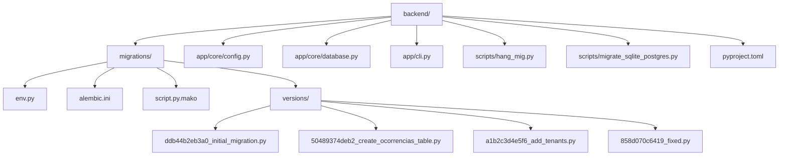
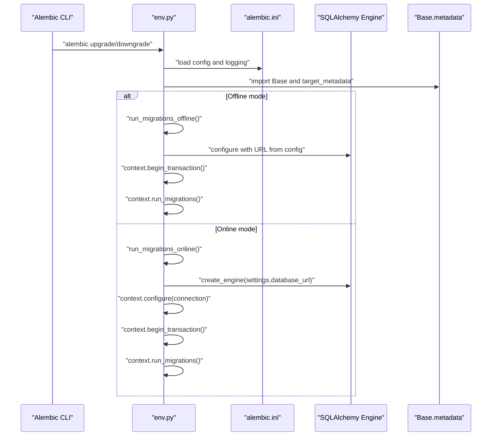
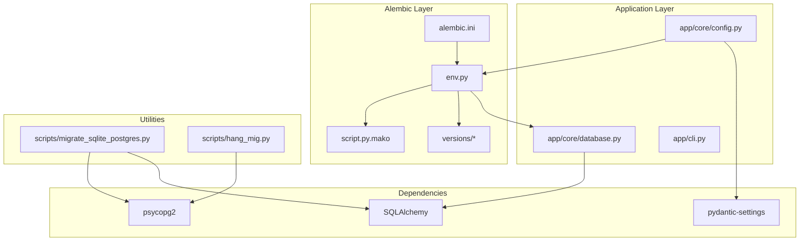
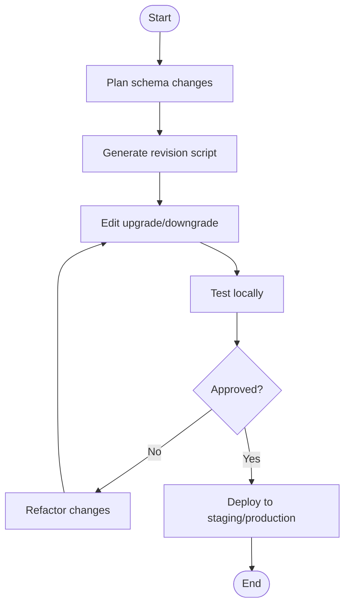

# Database Migrations

<cite>
**Referenced Files in This Document**
- [env.py](file://backend/migrations/env.py)
- [alembic.ini](file://backend/alembic.ini)
- [script.py.mako](file://backend/migrations/script.py.mako)
- [config.py](file://backend/app/core/config.py)
- [database.py](file://backend/app/core/database.py)
- [ddb44b2eb3a0_initial_migration.py](file://backend/migrations/versions/ddb44b2eb3a0_initial_migration.py)
- [50489374deb2_create_ocorrencias_table.py](file://backend/migrations/versions/50489374deb2_create_ocorrencias_table.py)
- [a1b2c3d4e5f6_add_tenants.py](file://backend/migrations/versions/a1b2c3d4e5f6_add_tenants.py)
- [858d070c6419_fixed.py](file://backend/migrations/versions/858d070c6419_fixed.py)
- [cli.py](file://backend/app/cli.py)
- [hang_mig.py](file://backend/scripts/hang_mig.py)
- [migrate_sqlite_postgres.py](file://backend/scripts/migrate_sqlite_postgres.py)
- [pyproject.toml](file://backend/pyproject.toml)
</cite>

## Table of Contents
1. [Introduction](#introduction)
2. [Project Structure](#project-structure)
3. [Core Components](#core-components)
4. [Architecture Overview](#architecture-overview)
5. [Detailed Component Analysis](#detailed-component-analysis)
6. [Dependency Analysis](#dependency-analysis)
7. [Performance Considerations](#performance-considerations)
8. [Troubleshooting Guide](#troubleshooting-guide)
9. [Conclusion](#conclusion)
10. [Appendices](#appendices)

## Introduction
This document explains the database migration system powered by Alembic in the backend. It covers migration file structure, version control patterns, automated execution, creation workflows, dependency management, rollback procedures, environment configuration, database connection handling, and testing strategies. Practical examples demonstrate creating new migrations, handling data transformations, and managing production deployments. It also addresses common issues, best practices for safe database changes, and rollback scenarios.

## Project Structure
The migration system is organized under the backend directory with Alembic configuration, environment hooks, and migration scripts. The Flask application integrates Alembic via environment configuration and exposes CLI commands for database lifecycle operations.

**Diagram sources**
- [env.py:1-89](file://backend/migrations/env.py#L1-L89)
- [alembic.ini:1-148](file://backend/alembic.ini#L1-L148)
- [script.py.mako:1-29](file://backend/migrations/script.py.mako#L1-L29)
- [ddb44b2eb3a0_initial_migration.py:1-70](file://backend/migrations/versions/ddb44b2eb3a0_initial_migration.py#L1-L70)
- [50489374deb2_create_ocorrencias_table.py:1-54](file://backend/migrations/versions/50489374deb2_create_ocorrencias_table.py#L1-L54)
- [a1b2c3d4e5f6_add_tenants.py:1-56](file://backend/migrations/versions/a1b2c3d4e5f6_add_tenants.py#L1-L56)
- [858d070c6419_fixed.py:1-125](file://backend/migrations/versions/858d070c6419_fixed.py#L1-L125)
- [config.py:1-60](file://backend/app/core/config.py#L1-L60)
- [database.py:1-130](file://backend/app/core/database.py#L1-L130)
- [cli.py:1-212](file://backend/app/cli.py#L1-L212)
- [hang_mig.py:1-35](file://backend/scripts/hang_mig.py#L1-L35)
- [migrate_sqlite_postgres.py:1-115](file://backend/scripts/migrate_sqlite_postgres.py#L1-L115)
- [pyproject.toml:1-65](file://backend/pyproject.toml#L1-L65)

**Section sources**
- [env.py:1-89](file://backend/migrations/env.py#L1-L89)
- [alembic.ini:1-148](file://backend/alembic.ini#L1-L148)
- [script.py.mako:1-29](file://backend/migrations/script.py.mako#L1-L29)

## Core Components
- Alembic configuration and environment:
  - Alembic configuration file defines script locations, path separators, and logging.
  - Environment script loads SQLAlchemy metadata, resolves logging configuration, and selects offline or online migration modes.
- Migration templates and scripts:
  - Template generates migration skeletons with upgrade and downgrade functions.
  - Individual migration files encode schema changes and data transformations.
- Application configuration and database engine:
  - Settings define the database URL used by Alembic in online mode.
  - SQLAlchemy engine and declarative base power ORM models and multi-tenant filtering.
- CLI integration:
  - Flask CLI commands initialize and drop schema, seed demo data, and manage administrative users.

**Section sources**
- [alembic.ini:1-148](file://backend/alembic.ini#L1-L148)
- [env.py:1-89](file://backend/migrations/env.py#L1-L89)
- [script.py.mako:1-29](file://backend/migrations/script.py.mako#L1-L29)
- [config.py:1-60](file://backend/app/core/config.py#L1-L60)
- [database.py:1-130](file://backend/app/core/database.py#L1-L130)
- [cli.py:1-212](file://backend/app/cli.py#L1-L212)

## Architecture Overview
The migration pipeline connects configuration, environment hooks, and model metadata to execute Alembic migrations either offline or online. The environment script reads Alembic configuration, sets up logging, and delegates to mode-specific runners that configure SQLAlchemy connections and run migrations within transactions.

**Diagram sources**
- [env.py:37-88](file://backend/migrations/env.py#L37-L88)
- [alembic.ini:84-87](file://backend/alembic.ini#L84-L87)
- [config.py:13-13](file://backend/app/core/config.py#L13-L13)

## Detailed Component Analysis

### Alembic Configuration and Environment
- Configuration file:
  - Defines script location, path separator, and logging levels.
  - Provides a default database URL for offline usage.
- Environment script:
  - Loads logging configuration from the Alembic INI file.
  - Imports application models and sets target metadata for autogenerate.
  - Supports offline mode using a URL and online mode using a SQLAlchemy engine created from application settings.

**Section sources**
- [alembic.ini:1-148](file://backend/alembic.ini#L1-L148)
- [env.py:1-89](file://backend/migrations/env.py#L1-L89)

### Migration Templates and Scripts
- Template:
  - Generates migration files with placeholders for upgrade and downgrade logic.
  - Includes revision identifiers and optional dependency declarations.
- Example migrations:
  - Initial migration creates foundational tables and constraints.
  - Subsequent migrations introduce multi-tenancy, academic years, and data transformations across related tables.

**Section sources**
- [script.py.mako:1-29](file://backend/migrations/script.py.mako#L1-L29)
- [ddb44b2eb3a0_initial_migration.py:1-70](file://backend/migrations/versions/ddb44b2eb3a0_initial_migration.py#L1-L70)
- [50489374deb2_create_ocorrencias_table.py:1-54](file://backend/migrations/versions/50489374deb2_create_ocorrencias_table.py#L1-L54)
- [a1b2c3d4e5f6_add_tenants.py:1-56](file://backend/migrations/versions/a1b2c3d4e5f6_add_tenants.py#L1-L56)
- [858d070c6419_fixed.py:1-125](file://backend/migrations/versions/858d070c6419_fixed.py#L1-L125)

### Application Settings and Database Engine
- Settings:
  - Provide the database URL used by Alembic in online mode.
- Database engine:
  - Creates the SQLAlchemy engine and session factory.
  - Implements multi-tenant filtering via ORM events to enforce tenant and academic-year scoping.

**Section sources**
- [config.py:13-13](file://backend/app/core/config.py#L13-L13)
- [database.py:36-102](file://backend/app/core/database.py#L36-L102)

### CLI Integration for Database Lifecycle
- Commands:
  - Initialize schema, drop schema, seed demo data, create super admin and admin users.
  - These commands rely on SQLAlchemy metadata and sessions to manage database state.

**Section sources**
- [cli.py:28-212](file://backend/app/cli.py#L28-L212)

### Data Migration Utilities
- SQLite to PostgreSQL migration script:
  - Connects to SQLite and PostgreSQL, truncates target tables, migrates rows, and resets sequences.
- Hanging migration script:
  - Demonstrates a long-running migration pattern with explicit role configuration and sleep for testing.

**Section sources**
- [migrate_sqlite_postgres.py:1-115](file://backend/scripts/migrate_sqlite_postgres.py#L1-L115)
- [hang_mig.py:1-35](file://backend/scripts/hang_mig.py#L1-L35)

## Dependency Analysis
The migration system depends on:
- Alembic for migration orchestration and script generation.
- SQLAlchemy for database connectivity and model metadata.
- Application settings for database URL resolution.
- Flask CLI for auxiliary database lifecycle operations.

**Diagram sources**
- [env.py:1-89](file://backend/migrations/env.py#L1-L89)
- [alembic.ini:1-148](file://backend/alembic.ini#L1-L148)
- [script.py.mako:1-29](file://backend/migrations/script.py.mako#L1-L29)
- [ddb44b2eb3a0_initial_migration.py:1-70](file://backend/migrations/versions/ddb44b2eb3a0_initial_migration.py#L1-L70)
- [a1b2c3d4e5f6_add_tenants.py:1-56](file://backend/migrations/versions/a1b2c3d4e5f6_add_tenants.py#L1-L56)
- [858d070c6419_fixed.py:1-125](file://backend/migrations/versions/858d070c6419_fixed.py#L1-L125)
- [config.py:1-60](file://backend/app/core/config.py#L1-L60)
- [database.py:1-130](file://backend/app/core/database.py#L1-L130)
- [cli.py:1-212](file://backend/app/cli.py#L1-L212)
- [migrate_sqlite_postgres.py:1-115](file://backend/scripts/migrate_sqlite_postgres.py#L1-L115)
- [hang_mig.py:1-35](file://backend/scripts/hang_mig.py#L1-L35)
- [pyproject.toml:15-40](file://backend/pyproject.toml#L15-L40)

**Section sources**
- [pyproject.toml:15-40](file://backend/pyproject.toml#L15-L40)
- [env.py:1-89](file://backend/migrations/env.py#L1-L89)
- [config.py:1-60](file://backend/app/core/config.py#L1-L60)
- [database.py:1-130](file://backend/app/core/database.py#L1-L130)

## Performance Considerations
- Use batch operations for large ALTER TABLE changes to minimize lock times.
- Prefer idempotent migrations and avoid expensive operations during production hours.
- Keep migrations small and incremental to reduce risk and improve testability.
- Use appropriate indexing after bulk data transformations.
- Monitor long-running migrations and consider maintenance windows.

## Troubleshooting Guide
Common issues and resolutions:
- Logging misconfiguration:
  - Ensure the Alembic INI file is present and readable; the environment script falls back to the project root INI if the migrations INI is missing.
- Database URL mismatches:
  - Confirm the DATABASE_URL environment variable aligns with the configured database backend.
- Transaction failures:
  - Review migration scripts for unsupported operations on the target database; use batch_alter_table for safer schema changes.
- Model metadata not discovered:
  - Verify that models are imported before Alembic runs so target_metadata includes all relevant tables.
- Data integrity errors:
  - Validate foreign keys and constraints before applying migrations; seed default records when introducing new required references.

**Section sources**
- [env.py:14-22](file://backend/migrations/env.py#L14-L22)
- [alembic.ini:84-87](file://backend/alembic.ini#L84-L87)
- [a1b2c3d4e5f6_add_tenants.py:32-40](file://backend/migrations/versions/a1b2c3d4e5f6_add_tenants.py#L32-L40)
- [858d070c6419_fixed.py:33-37](file://backend/migrations/versions/858d070c6419_fixed.py#L33-L37)

## Conclusion
The Alembic-based migration system integrates tightly with the Flask application’s configuration and database engine. It supports both offline and online execution modes, leverages SQLAlchemy metadata for autogenerate, and provides practical CLI commands for development and administration. By following the patterns demonstrated in existing migrations—such as adding multi-tenancy, academic years, and data transformations—you can safely evolve the schema and data while maintaining backward compatibility and enabling controlled rollbacks.

## Appendices

### Migration Creation Workflow
Steps to create a new migration:
1. Define schema changes in models or prepare raw SQL.
2. Generate a revision script using the Alembic template.
3. Implement upgrade and downgrade logic in the generated file.
4. Test locally with a separate database or containerized Postgres.
5. Commit the migration file and coordinate deployment.

[No sources needed since this diagram shows conceptual workflow, not actual code structure]

### Automated Migration Execution
- Alembic CLI:
  - Use standard Alembic commands to upgrade/downgrade to specific revisions.
- Online vs offline:
  - Online mode uses the application’s database URL; offline mode uses the URL from Alembic configuration.
- Environment selection:
  - The environment script detects mode and configures the runtime accordingly.

**Section sources**
- [env.py:37-88](file://backend/migrations/env.py#L37-L88)
- [alembic.ini:84-87](file://backend/alembic.ini#L84-L87)

### Dependency Management in Migrations
- Use depends_on to declare cross-table dependencies within a single migration file.
- Maintain clear revision chains to ensure deterministic ordering across environments.

**Section sources**
- [script.py.mako:14-18](file://backend/migrations/script.py.mako#L14-L18)
- [50489374deb2_create_ocorrencias_table.py:16-18](file://backend/migrations/versions/50489374deb2_create_ocorrencias_table.py#L16-L18)

### Rollback Procedures
- Implement downgrade functions for reversible schema changes.
- For complex transformations, consider partial rollbacks or compensating actions.
- Always back up the database before production rollbacks.

**Section sources**
- [script.py.mako:21-28](file://backend/migrations/script.py.mako#L21-L28)
- [858d070c6419_fixed.py:121-124](file://backend/migrations/versions/858d070c6419_fixed.py#L121-L124)

### Environment Configuration and Database Connections
- Alembic INI:
  - Controls script location, path separator, and logging.
- Settings:
  - Provide the database URL used by Alembic in online mode.
- Engine:
  - Created from application settings; used for online migrations and ORM operations.

**Section sources**
- [alembic.ini:8-87](file://backend/alembic.ini#L8-L87)
- [config.py:13-13](file://backend/app/core/config.py#L13-L13)
- [database.py:36-36](file://backend/app/core/database.py#L36-L36)

### Migration Testing Strategies
- Local testing:
  - Use a separate test database or containerized Postgres.
- Idempotency checks:
  - Re-running migrations should not cause errors.
- Data validation:
  - Verify referential integrity and constraints after migrations.

**Section sources**
- [cli.py:42-102](file://backend/app/cli.py#L42-L102)
- [migrate_sqlite_postgres.py:34-111](file://backend/scripts/migrate_sqlite_postgres.py#L34-L111)

### Production Deployment Examples
- Multi-tenancy and academic year isolation:
  - Introduce tenants and academic years, populate defaults, and add foreign keys to existing tables.
- Data transformations:
  - Normalize columns, rename fields, and backfill values with careful attention to constraints.

**Section sources**
- [a1b2c3d4e5f6_add_tenants.py:17-41](file://backend/migrations/versions/a1b2c3d4e5f6_add_tenants.py#L17-L41)
- [858d070c6419_fixed.py:19-118](file://backend/migrations/versions/858d070c6419_fixed.py#L19-L118)

### Best Practices for Safe Database Changes
- Keep migrations small and focused.
- Always write a downgrade path.
- Test in staging before production.
- Use batch operations for large schema changes.
- Seed minimal required data for new constraints.
- Document the rationale and impact of each migration.

**Section sources**
- [script.py.mako:21-28](file://backend/migrations/script.py.mako#L21-L28)
- [a1b2c3d4e5f6_add_tenants.py:32-40](file://backend/migrations/versions/a1b2c3d4e5f6_add_tenants.py#L32-L40)
- [858d070c6419_fixed.py:33-37](file://backend/migrations/versions/858d070c6419_fixed.py#L33-L37)