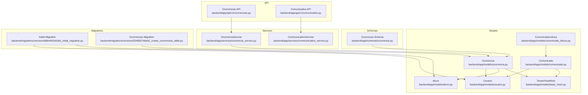
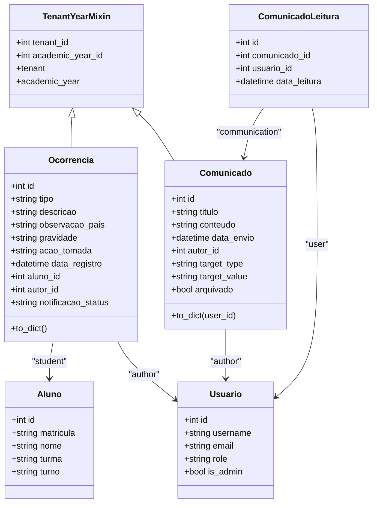
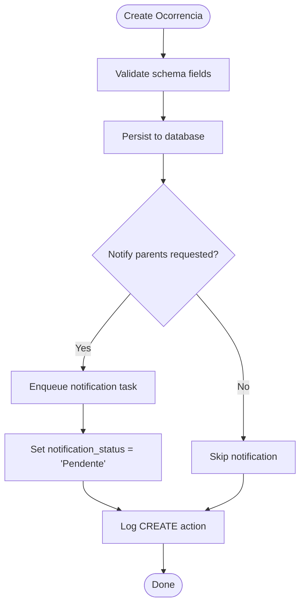
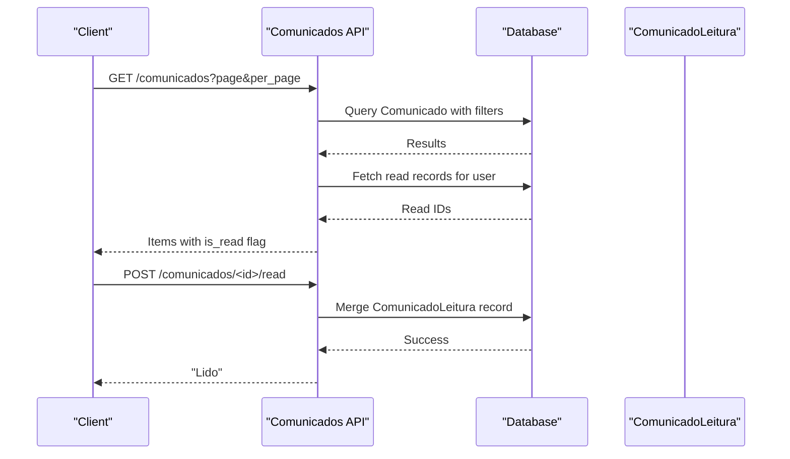
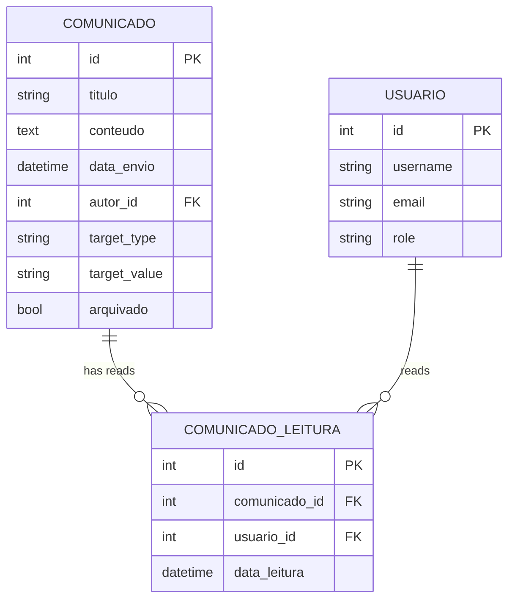
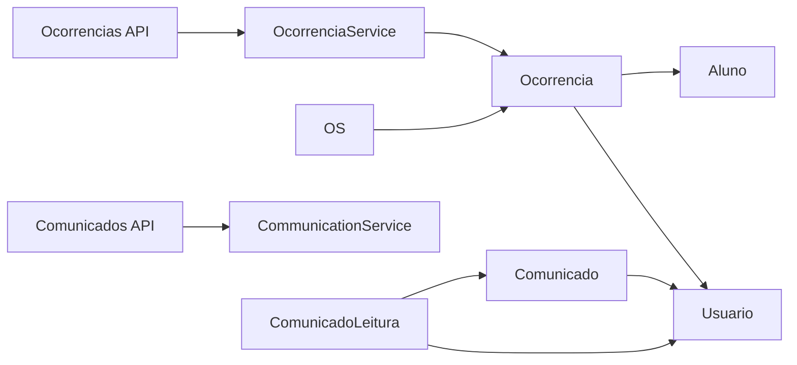

# Disciplinary & Communication Models

<cite>
**Referenced Files in This Document**
- [ocorrencia.py](file://backend/app/models/ocorrencia.py)
- [comunicado.py](file://backend/app/models/comunicado.py)
- [comunicado_leitura.py](file://backend/app/models/comunicado_leitura.py)
- [base_mixin.py](file://backend/app/models/base_mixin.py)
- [ocorrencia.py](file://backend/app/schemas/ocorrencia.py)
- [ocorrencias.py](file://backend/app/api/v1/ocorrencias.py)
- [comunicados.py](file://backend/app/api/v1/comunicados.py)
- [ocorrencia_service.py](file://backend/app/services/ocorrencia_service.py)
- [communication_service.py](file://backend/app/services/communication_service.py)
- [aluno.py](file://backend/app/models/aluno.py)
- [usuario.py](file://backend/app/models/usuario.py)
- [50489374deb2_create_ocorrencias_table.py](file://backend/migrations/versions/50489374deb2_create_ocorrencias_table.py)
- [ddb44b2eb3a0_initial_migration.py](file://backend/migrations/versions/ddb44b2eb3a0_initial_migration.py)
</cite>

## Table of Contents
1. [Introduction](#introduction)
2. [Project Structure](#project-structure)
3. [Core Components](#core-components)
4. [Architecture Overview](#architecture-overview)
5. [Detailed Component Analysis](#detailed-component-analysis)
6. [Dependency Analysis](#dependency-analysis)
7. [Performance Considerations](#performance-considerations)
8. [Troubleshooting Guide](#troubleshooting-guide)
9. [Conclusion](#conclusion)

## Introduction
This document provides comprehensive data model documentation for the disciplinary and communication management entities in the platform. It focuses on:
- Ocorrencia: incident reporting model with severity levels, categories, timestamps, and resolution status
- Comunicado: announcement system with target audiences, publication dates, and content management
- ComunicadoLeitura: read tracking and engagement metrics

It also documents field definitions, business rules for incident classification, audience targeting logic, audit trail requirements, relationship patterns, data validation constraints, and reporting implications.

## Project Structure
The relevant models and supporting components are organized under the backend application:
- Models: disciplinary and communication entities and shared tenant/year scoping
- Schemas: Pydantic models for request/response validation
- APIs: HTTP endpoints for CRUD operations and read tracking
- Services: business logic for notifications and audit logging
- Migrations: database schema creation and evolution

**Diagram sources**
- [ocorrencia.py:1-45](file://backend/app/models/ocorrencia.py#L1-L45)
- [comunicado.py:1-39](file://backend/app/models/comunicado.py#L1-L39)
- [comunicado_leitura.py:1-20](file://backend/app/models/comunicado_leitura.py#L1-L20)
- [base_mixin.py:1-22](file://backend/app/models/base_mixin.py#L1-L22)
- [aluno.py:1-36](file://backend/app/models/aluno.py#L1-L36)
- [usuario.py:1-30](file://backend/app/models/usuario.py#L1-L30)
- [ocorrencia.py:1-36](file://backend/app/schemas/ocorrencia.py#L1-L36)
- [ocorrencias.py:1-109](file://backend/app/api/v1/ocorrencias.py#L1-L109)
- [comunicados.py:1-175](file://backend/app/api/v1/comunicados.py#L1-L175)
- [ocorrencia_service.py:1-134](file://backend/app/services/ocorrencia_service.py#L1-L134)
- [communication_service.py:1-61](file://backend/app/services/communication_service.py#L1-L61)
- [ddb44b2eb3a0_initial_migration.py:1-70](file://backend/migrations/versions/ddb44b2eb3a0_initial_migration.py#L1-L70)
- [50489374deb2_create_ocorrencias_table.py:1-54](file://backend/migrations/versions/50489374deb2_create_ocorrencias_table.py#L1-L54)

**Section sources**
- [ocorrencia.py:1-45](file://backend/app/models/ocorrencia.py#L1-L45)
- [comunicado.py:1-39](file://backend/app/models/comunicado.py#L1-L39)
- [comunicado_leitura.py:1-20](file://backend/app/models/comunicado_leitura.py#L1-L20)
- [base_mixin.py:1-22](file://backend/app/models/base_mixin.py#L1-L22)
- [ocorrencia.py:1-36](file://backend/app/schemas/ocorrencia.py#L1-L36)
- [ocorrencias.py:1-109](file://backend/app/api/v1/ocorrencias.py#L1-L109)
- [comunicados.py:1-175](file://backend/app/api/v1/comunicados.py#L1-L175)
- [ocorrencia_service.py:1-134](file://backend/app/services/ocorrencia_service.py#L1-L134)
- [communication_service.py:1-61](file://backend/app/services/communication_service.py#L1-L61)
- [aluno.py:1-36](file://backend/app/models/aluno.py#L1-L36)
- [usuario.py:1-30](file://backend/app/models/usuario.py#L1-L30)
- [ddb44b2eb3a0_initial_migration.py:1-70](file://backend/migrations/versions/ddb44b2eb3a0_initial_migration.py#L1-L70)
- [50489374deb2_create_ocorrencias_table.py:1-54](file://backend/migrations/versions/50489374deb2_create_ocorrencias_table.py#L1-L54)

## Core Components
This section defines the three primary models and their core attributes, relationships, and constraints.

- Ocorrencia
  - Purpose: Record disciplinary or commendatory incidents for students
  - Key fields:
    - type: Category such as “Advertência” or “Elogio”
    - description: Incident narrative
    - observation_for_parents: Optional note for parents
    - severity: Enumerated level (LEVE, MEDIA, GRAVE, GRAVISSIMA)
    - taken_action: Optional action taken
    - registration_date: Timestamp of record creation
    - student_id: Foreign key to Aluno
    - author_id: Foreign key to Usuario
    - notification_status: Optional status for notification delivery (Pendente, Enviado, Erro)
  - Relationships:
    - One-to-many with Aluno (student)
    - One-to-many with Usuario (author)
  - Tenant and Academic Year scoping via TenantYearMixin

- Comunicado
  - Purpose: Announcement system for internal communication
  - Key fields:
    - title: Subject line
    - content: Body text
    - send_date: Publication timestamp
    - author_id: Foreign key to Usuario
    - target_type: Audience scope (“TODOS”, “TURMA”, “ALUNO”)
    - target_value: Audience identifier (e.g., class slug or student id)
    - archived: Archive flag
  - Relationships:
    - One-to-many with Usuario (author)
  - Tenant and Academic Year scoping via TenantYearMixin

- ComunicadoLeitura
  - Purpose: Track read events and compute engagement metrics
  - Key fields:
    - communication_id: Foreign key to Comunicado
    - user_id: Foreign key to Usuario
    - read_date: Timestamp of read event
  - Constraints:
    - Unique constraint on (communication_id, user_id)

**Section sources**
- [ocorrencia.py:9-28](file://backend/app/models/ocorrencia.py#L9-L28)
- [comunicado.py:8-24](file://backend/app/models/comunicado.py#L8-L24)
- [comunicado_leitura.py:7-19](file://backend/app/models/comunicado_leitura.py#L7-L19)
- [base_mixin.py:4-21](file://backend/app/models/base_mixin.py#L4-L21)

## Architecture Overview
The system integrates models, schemas, APIs, services, and migrations to support disciplined incident management and targeted communications.

**Diagram sources**
- [ocorrencia.py:9-45](file://backend/app/models/ocorrencia.py#L9-L45)
- [comunicado.py:8-39](file://backend/app/models/comunicado.py#L8-L39)
- [comunicado_leitura.py:7-20](file://backend/app/models/comunicado_leitura.py#L7-L20)
- [base_mixin.py:4-21](file://backend/app/models/base_mixin.py#L4-L21)
- [aluno.py:8-36](file://backend/app/models/aluno.py#L8-L36)
- [usuario.py:8-30](file://backend/app/models/usuario.py#L8-L30)

## Detailed Component Analysis

### Ocorrencia Model
- Field definitions and constraints
  - type: Non-empty string up to 50 characters
  - description: Non-empty text
  - observation_for_parents: Optional text
  - severity: Enumerated values with default “LEVE”
  - taken_action: Optional text
  - registration_date: Defaults to UTC now
  - student_id: Required foreign key to Aluno
  - author_id: Required foreign key to Usuario
  - notification_status: Optional status string
- Business rules
  - Severity levels: LEVE, MEDIA, GRAVE, GRAVISSIMA
  - Optional notification trigger via service; status transitions to “Pendente” when queued
- Relationships
  - One-to-many with Aluno and Usuario
  - Tenant and Academic Year scoping via TenantYearMixin
- Validation and serialization
  - Pydantic schema supports create/update operations and display fields
  - to_dict() provides normalized presentation with computed names and timestamps

**Diagram sources**
- [ocorrencia_service.py:36-90](file://backend/app/services/ocorrencia_service.py#L36-L90)
- [ocorrencia.py:13-16](file://backend/app/schemas/ocorrencia.py#L13-L16)

**Section sources**
- [ocorrencia.py:9-45](file://backend/app/models/ocorrencia.py#L9-L45)
- [ocorrencia.py:1-36](file://backend/app/schemas/ocorrencia.py#L1-L36)
- [ocorrencia_service.py:36-90](file://backend/app/services/ocorrencia_service.py#L36-L90)
- [base_mixin.py:4-21](file://backend/app/models/base_mixin.py#L4-L21)

### Comunicado Model
- Field definitions and constraints
  - title: Non-empty string up to 200 characters
  - content: Non-empty text up to 50000 characters
  - send_date: Defaults to current time
  - author_id: Required foreign key to Usuario
  - target_type: Enumerated (“TODOS”, “TURMA”, “ALUNO”), defaults to “TODOS”
  - target_value: Optional identifier string
  - archived: Boolean flag
- Audience targeting logic
  - “TODOS”: visible to all users
  - “TURMA”: matches by class slug stored in target_value
  - “ALUNO”: matches by student id stored in target_value
  - Staff members see all; students see announcements matching their class or personal target
- Validation and permissions
  - Creation requires staff roles
  - Updates require author or manager roles
  - Deletion requires author or manager roles
- Relationships
  - One-to-many with Usuario (author)
  - One-to-many with ComunicadoLeitura (read tracking)
  - Tenant and Academic Year scoping via TenantYearMixin

**Diagram sources**
- [comunicados.py:11-69](file://backend/app/api/v1/comunicados.py#L11-L69)
- [comunicados.py:165-172](file://backend/app/api/v1/comunicados.py#L165-L172)
- [comunicado_leitura.py:7-19](file://backend/app/models/comunicado_leitura.py#L7-L19)

**Section sources**
- [comunicado.py:8-39](file://backend/app/models/comunicado.py#L8-L39)
- [comunicados.py:11-175](file://backend/app/api/v1/comunicados.py#L11-L175)
- [base_mixin.py:4-21](file://backend/app/models/base_mixin.py#L4-L21)

### ComunicadoLeitura Model
- Purpose: Track who read which announcement and when
- Fields
  - communication_id: Foreign key to Comunicado with CASCADE
  - user_id: Foreign key to Usuario with CASCADE
  - read_date: Defaults to current time
- Constraints
  - Unique constraint on (communication_id, user_id) ensures single read per user per announcement
- Reporting implications
  - Enables read/unread indicators and engagement analytics

**Diagram sources**
- [comunicado.py:8-39](file://backend/app/models/comunicado.py#L8-L39)
- [comunicado_leitura.py:7-19](file://backend/app/models/comunicado_leitura.py#L7-L19)
- [usuario.py:8-30](file://backend/app/models/usuario.py#L8-L30)

**Section sources**
- [comunicado_leitura.py:7-20](file://backend/app/models/comunicado_leitura.py#L7-L20)

### Supporting Entities and Mixins
- TenantYearMixin
  - Adds tenant_id and academic_year_id to models for multitenancy and academic year scoping
  - Provides relationships to Tenant and AcademicYear
- Aluno
  - Student entity with enrollment, name, class, shift, and optional demographic data
- Usuario
  - User entity with credentials, roles, and optional student association

**Section sources**
- [base_mixin.py:4-21](file://backend/app/models/base_mixin.py#L4-L21)
- [aluno.py:8-36](file://backend/app/models/aluno.py#L8-L36)
- [usuario.py:8-30](file://backend/app/models/usuario.py#L8-L30)

## Dependency Analysis
- Model dependencies
  - Ocorrencia depends on Aluno and Usuario via foreign keys
  - Comunicado depends on Usuario
  - ComunicadoLeitura depends on Comunicado and Usuario
  - All models scoped by TenantYearMixin
- API dependencies
  - Ocorrencias API uses OcorrenciaService and Pydantic schemas
  - Comunicados API uses ComunicadoLeitura for read tracking
- Service dependencies
  - OcorrenciaService persists and audits changes
  - CommunicationService sends email and WhatsApp notifications

**Diagram sources**
- [ocorrencia.py:9-28](file://backend/app/models/ocorrencia.py#L9-L28)
- [comunicado.py:8-18](file://backend/app/models/comunicado.py#L8-L18)
- [comunicado_leitura.py:7-13](file://backend/app/models/comunicado_leitura.py#L7-L13)
- [ocorrencias.py:1-109](file://backend/app/api/v1/ocorrencias.py#L1-L109)
- [comunicados.py:1-175](file://backend/app/api/v1/comunicados.py#L1-L175)
- [ocorrencia_service.py:1-134](file://backend/app/services/ocorrencia_service.py#L1-L134)
- [communication_service.py:1-61](file://backend/app/services/communication_service.py#L1-L61)

**Section sources**
- [ocorrencia.py:9-28](file://backend/app/models/ocorrencia.py#L9-L28)
- [comunicado.py:8-18](file://backend/app/models/comunicado.py#L8-L18)
- [comunicado_leitura.py:7-13](file://backend/app/models/comunicado_leitura.py#L7-L13)
- [ocorrencias.py:1-109](file://backend/app/api/v1/ocorrencias.py#L1-L109)
- [comunicados.py:1-175](file://backend/app/api/v1/comunicados.py#L1-L175)
- [ocorrencia_service.py:1-134](file://backend/app/services/ocorrencia_service.py#L1-L134)
- [communication_service.py:1-61](file://backend/app/services/communication_service.py#L1-L61)

## Performance Considerations
- Indexing
  - TenantYearMixin adds indexed tenant_id and academic_year_id to models, improving filtered queries
- Query patterns
  - Comunicados API fetches read IDs in bulk to minimize round-trips
  - Pagination parameters are validated and bounded to prevent excessive loads
- Data volume
  - Content fields are large-text types; consider partitioning or archiving older records for scalability
- Notifications
  - Notification queuing avoids blocking write operations; monitor queue backlog

[No sources needed since this section provides general guidance]

## Troubleshooting Guide
- Incident creation errors
  - Verify severity values conform to supported levels
  - Ensure student and author IDs reference existing records
- Communication visibility issues
  - Confirm target_type and target_value match user’s class or student id
  - Check archived flag for hidden announcements
- Read tracking anomalies
  - Ensure unique constraint prevents duplicate read entries
  - Validate foreign keys to Comunicado and Usuario
- Audit logs
  - OcorrenciaService logs create/update/delete actions; review logs for discrepancies

**Section sources**
- [ocorrencia_service.py:70-108](file://backend/app/services/ocorrencia_service.py#L70-L108)
- [comunicados.py:11-175](file://backend/app/api/v1/comunicados.py#L11-L175)
- [comunicado_leitura.py:7-19](file://backend/app/models/comunicado_leitura.py#L7-L19)

## Conclusion
The disciplinary and communication models provide a robust foundation for managing student incidents and internal announcements. They incorporate multitenancy and academic year scoping, enforce validation constraints, and support targeted distribution with read tracking. The service layer centralizes business logic, including optional notifications and audit logging, enabling maintainable and extensible operations.