# Repository Pattern Implementation

<cite>
**Referenced Files in This Document**
- [base.py](file://backend/app/repositories/base.py)
- [aluno_repository.py](file://backend/app/repositories/aluno_repository.py)
- [turma_repository.py](file://backend/app/repositories/turma_repository.py)
- [ocorrencia_repository.py](file://backend/app/repositories/ocorrencia_repository.py)
- [usuario_repository.py](file://backend/app/repositories/usuario_repository.py)
- [tenant_repository.py](file://backend/app/repositories/tenant_repository.py)
- [database.py](file://backend/app/core/database.py)
- [base_mixin.py](file://backend/app/models/base_mixin.py)
- [aluno.py](file://backend/app/models/aluno.py)
- [nota.py](file://backend/app/models/nota.py)
- [ocorrencia.py](file://backend/app/models/ocorrencia.py)
- [usuario.py](file://backend/app/models/usuario.py)
- [tenant.py](file://backend/app/models/tenant.py)
</cite>

## Table of Contents
1. [Introduction](#introduction)
2. [Project Structure](#project-structure)
3. [Core Components](#core-components)
4. [Architecture Overview](#architecture-overview)
5. [Detailed Component Analysis](#detailed-component-analysis)
6. [Dependency Analysis](#dependency-analysis)
7. [Performance Considerations](#performance-considerations)
8. [Troubleshooting Guide](#troubleshooting-guide)
9. [Conclusion](#conclusion)

## Introduction
This document explains the repository pattern implementation in the backend’s data access layer. It covers the generic BaseRepository for common CRUD operations, tenant-aware filtering via SQLAlchemy events, and specialized repositories for each domain model. It also documents query composition, data transformation patterns, and how repositories integrate with services and middleware.

## Project Structure
The data access layer follows a layered architecture:
- Core database and tenant filtering live in the core module.
- Domain models define entities and tenant/year mixins.
- Repositories encapsulate persistence logic per model.
- Services orchestrate business workflows and depend on repositories.

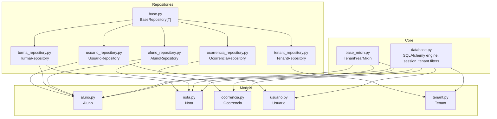

**Diagram sources**
- [database.py:1-130](file://backend/app/core/database.py#L1-L130)
- [base_mixin.py:1-22](file://backend/app/models/base_mixin.py#L1-L22)
- [base.py:1-41](file://backend/app/repositories/base.py#L1-L41)
- [aluno_repository.py:1-105](file://backend/app/repositories/aluno_repository.py#L1-L105)
- [turma_repository.py:1-101](file://backend/app/repositories/turma_repository.py#L1-L101)
- [ocorrencia_repository.py:1-27](file://backend/app/repositories/ocorrencia_repository.py#L1-L27)
- [usuario_repository.py:1-68](file://backend/app/repositories/usuario_repository.py#L1-L68)
- [tenant_repository.py:1-21](file://backend/app/repositories/tenant_repository.py#L1-L21)
- [aluno.py:1-36](file://backend/app/models/aluno.py#L1-L36)
- [nota.py:1-24](file://backend/app/models/nota.py#L1-L24)
- [ocorrencia.py:1-45](file://backend/app/models/ocorrencia.py#L1-L45)
- [usuario.py:1-30](file://backend/app/models/usuario.py#L1-L30)
- [tenant.py:1-22](file://backend/app/models/tenant.py#L1-L22)

**Section sources**
- [database.py:1-130](file://backend/app/core/database.py#L1-L130)
- [base_mixin.py:1-22](file://backend/app/models/base_mixin.py#L1-L22)
- [base.py:1-41](file://backend/app/repositories/base.py#L1-L41)

## Core Components
- BaseRepository[T]: Provides generic CRUD operations and leverages the SQLAlchemy session to persist changes. It supports type-safe operations through a generic type variable.
- Tenant-aware filtering: Implemented via a session event hook that appends tenant_id and academic_year_id conditions to SELECT statements automatically, based on Flask’s request context.

Key capabilities:
- Retrieve by ID, fetch paginated lists, create, update, and delete records.
- Automatic tenant and academic year scoping for queries through the session event hook.

**Section sources**
- [base.py:7-41](file://backend/app/repositories/base.py#L7-L41)
- [database.py:39-102](file://backend/app/core/database.py#L39-L102)

## Architecture Overview
The system enforces multitenancy and academic-year scoping at the SQL level during query execution. Repositories compose queries using SQLAlchemy’s ORM, while the core database module ensures tenant boundaries are respected.

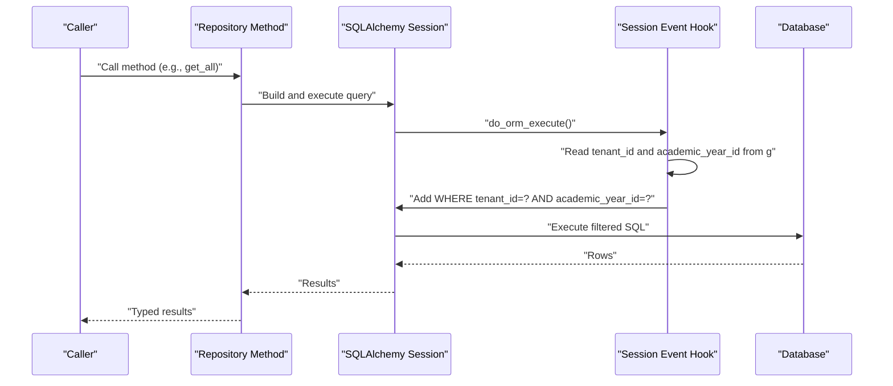

**Diagram sources**
- [database.py:39-102](file://backend/app/core/database.py#L39-L102)
- [base.py:12-17](file://backend/app/repositories/base.py#L12-L17)

## Detailed Component Analysis

### BaseRepository[T]
- Purpose: Generic CRUD for any SQLAlchemy-mapped model.
- Methods:
  - get(id): Load by primary key.
  - get_all(skip, limit): Paginated retrieval.
  - create(obj_in): Instantiate model and commit.
  - update(db_obj, obj_in): Bulk field updates and commit.
  - delete(id): Soft-deleted via ORM delete and commit.
- Notes:
  - Uses SQLAlchemy session for persistence.
  - Returns refreshed instances after create/update.

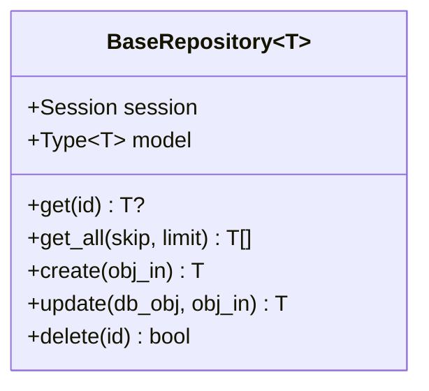

**Diagram sources**
- [base.py:7-41](file://backend/app/repositories/base.py#L7-L41)

**Section sources**
- [base.py:7-41](file://backend/app/repositories/base.py#L7-L41)

### Tenant-aware Filtering
- Mechanism: A session event hook inspects every SELECT statement and appends tenant and academic-year filters based on Flask’s request context.
- Behavior:
  - Skips filtering when tenant context is absent.
  - Applies tenant_id and academic_year_id conditions to matching models.
  - Allows opt-out via execution option for special queries.

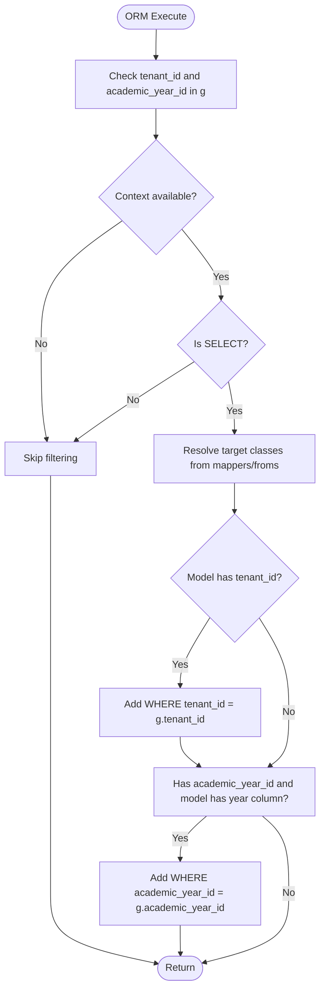

**Diagram sources**
- [database.py:39-102](file://backend/app/core/database.py#L39-L102)

**Section sources**
- [database.py:39-102](file://backend/app/core/database.py#L39-L102)

### AlunoRepository
- Specialized queries:
  - Paginated aggregation with averages and absences, applying filters for shift, class, and text search.
  - Fetch student with aggregated grades and subject grades, enforcing tenant/year checks.
- Data transformation:
  - Returns tuples combining entities and computed aggregates.
  - Uses outer joins to include students without grades.

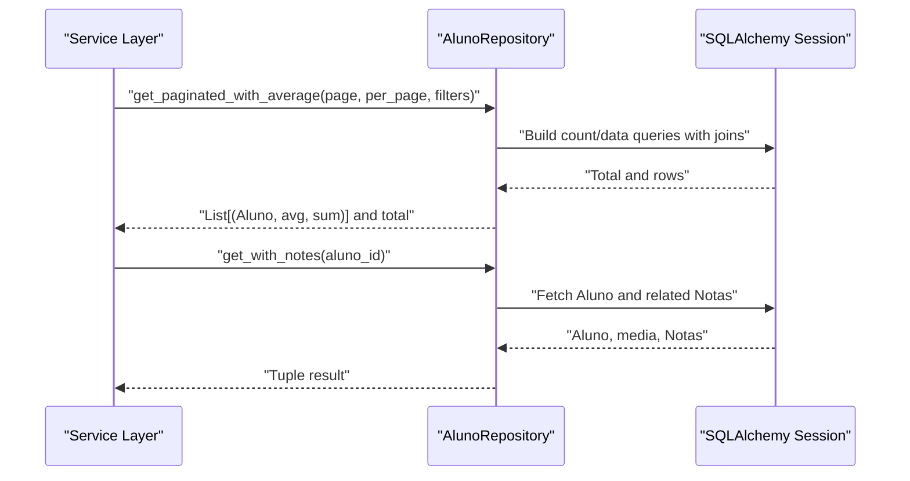

**Diagram sources**
- [aluno_repository.py:12-74](file://backend/app/repositories/aluno_repository.py#L12-L74)
- [aluno_repository.py:76-104](file://backend/app/repositories/aluno_repository.py#L76-L104)

**Section sources**
- [aluno_repository.py:8-105](file://backend/app/repositories/aluno_repository.py#L8-L105)

### TurmaRepository
- Specialized queries:
  - Class summaries aggregating counts, averages, and average absences.
  - Name resolution supporting exact and slug-based matches.
  - Student retrieval by class with tenant/year constraints.
  - Batch grade retrieval for a list of student IDs.
- Notes:
  - Uses explicit tenant/year filters in joins and queries.
  - Employs execution option to bypass automatic tenant filtering for controlled scenarios.

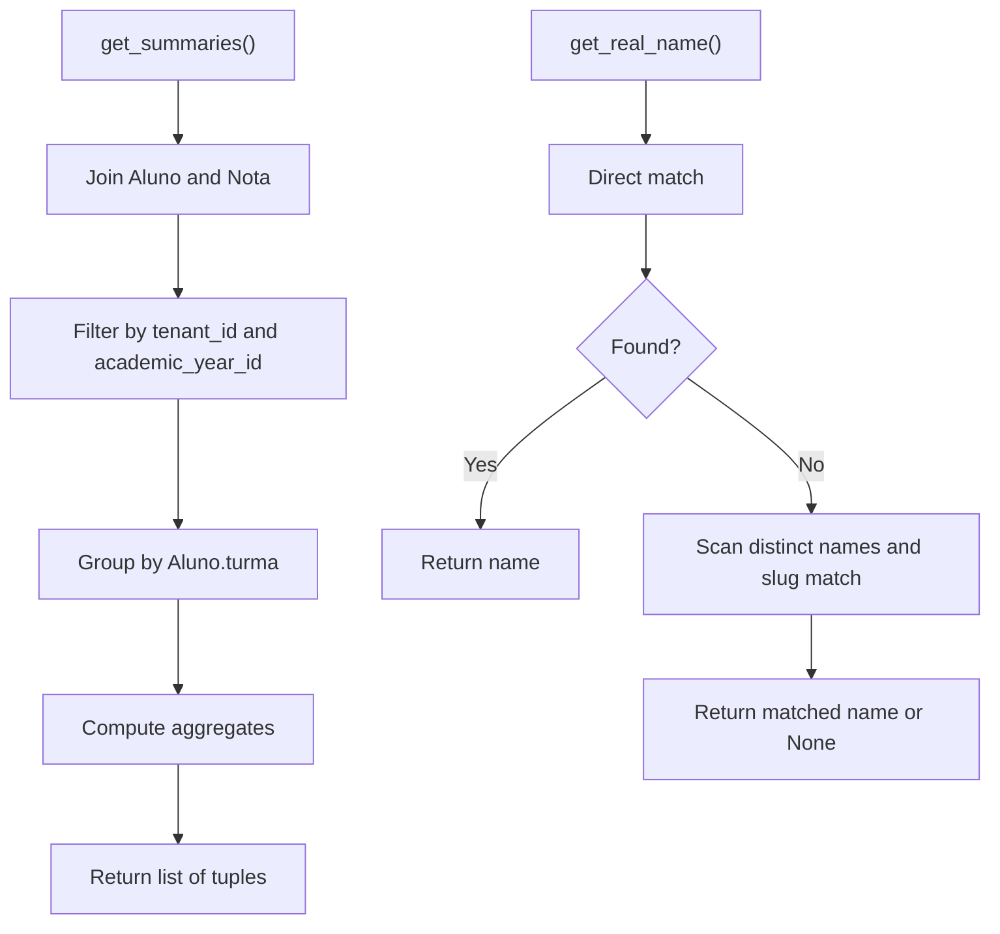

**Diagram sources**
- [turma_repository.py:16-54](file://backend/app/repositories/turma_repository.py#L16-L54)
- [turma_repository.py:56-79](file://backend/app/repositories/turma_repository.py#L56-L79)

**Section sources**
- [turma_repository.py:8-101](file://backend/app/repositories/turma_repository.py#L8-L101)

### OcorrenciaRepository
- Specialized queries:
  - Lists occurrences ordered by registration date, optionally filtered by student and tenant/year scopes.
- Notes:
  - Inherits generic CRUD from BaseRepository and adds filtering logic.

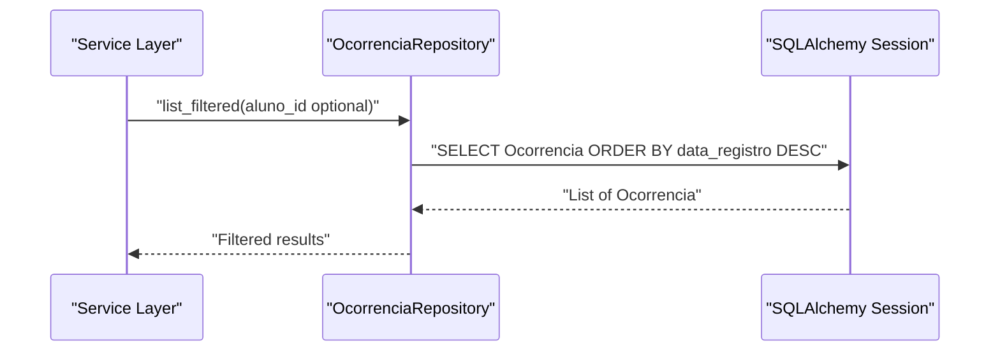

**Diagram sources**
- [ocorrencia_repository.py:12-26](file://backend/app/repositories/ocorrencia_repository.py#L12-L26)

**Section sources**
- [ocorrencia_repository.py:8-27](file://backend/app/repositories/ocorrencia_repository.py#L8-L27)

### UsuarioRepository
- Specialized queries:
  - Username lookup and existence checks with optional exclusion by ID.
  - Filtered listing with joined loading of related student profile and pagination-aware counting.
- Notes:
  - Uses joined loading to reduce N+1 queries when accessing related student info.

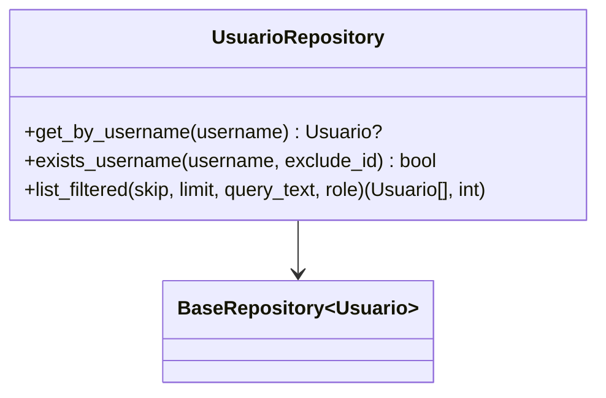

**Diagram sources**
- [usuario_repository.py:8-68](file://backend/app/repositories/usuario_repository.py#L8-L68)
- [base.py:7-41](file://backend/app/repositories/base.py#L7-L41)

**Section sources**
- [usuario_repository.py:8-68](file://backend/app/repositories/usuario_repository.py#L8-L68)

### TenantRepository
- Specialized queries:
  - Domain and slug lookups for tenant discovery.
- Notes:
  - Straightforward read-only repository leveraging BaseRepository.

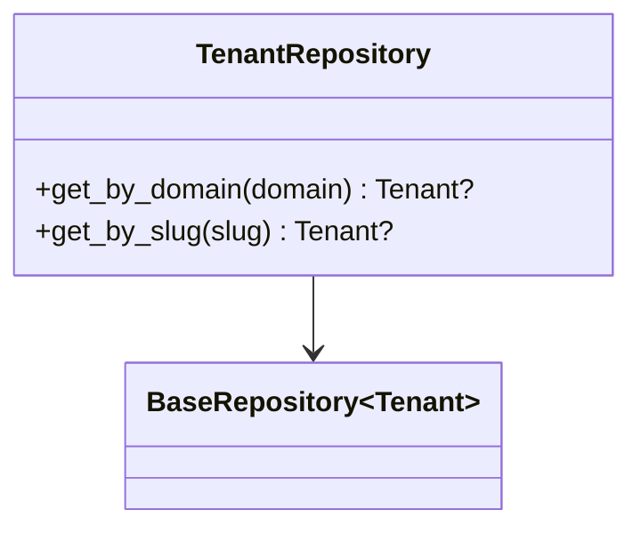

**Diagram sources**
- [tenant_repository.py:8-21](file://backend/app/repositories/tenant_repository.py#L8-L21)
- [base.py:7-41](file://backend/app/repositories/base.py#L7-L41)

**Section sources**
- [tenant_repository.py:8-21](file://backend/app/repositories/tenant_repository.py#L8-L21)

### Model Layer and Tenant Scoping
- TenantYearMixin: Adds tenant_id and academic_year_id columns plus relationships to Tenant and AcademicYear, enabling consistent tenant and year scoping across entities.
- Models:
  - Aluno and Nota inherit tenant/year scoping.
  - Ocorrencia inherits tenant/year scoping and exposes a serialization helper.
  - Usuario and Tenant do not inherit the mixin; they rely on explicit tenant filters in repositories or dedicated tenant-scoped models.

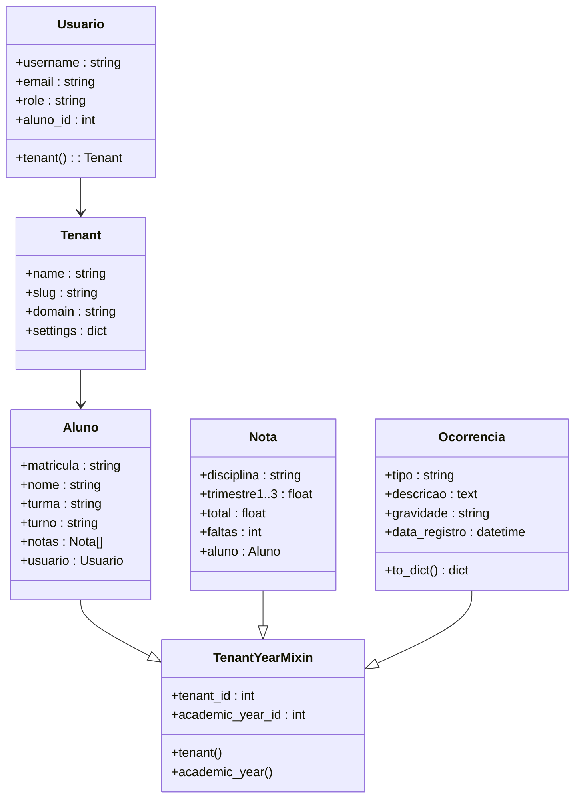

**Diagram sources**
- [base_mixin.py:4-22](file://backend/app/models/base_mixin.py#L4-L22)
- [aluno.py:8-36](file://backend/app/models/aluno.py#L8-L36)
- [nota.py:9-24](file://backend/app/models/nota.py#L9-L24)
- [ocorrencia.py:9-45](file://backend/app/models/ocorrencia.py#L9-L45)
- [usuario.py:8-30](file://backend/app/models/usuario.py#L8-L30)
- [tenant.py:7-22](file://backend/app/models/tenant.py#L7-L22)

**Section sources**
- [base_mixin.py:4-22](file://backend/app/models/base_mixin.py#L4-L22)
- [aluno.py:8-36](file://backend/app/models/aluno.py#L8-L36)
- [nota.py:9-24](file://backend/app/models/nota.py#L9-L24)
- [ocorrencia.py:9-45](file://backend/app/models/ocorrencia.py#L9-L45)
- [usuario.py:8-30](file://backend/app/models/usuario.py#L8-L30)
- [tenant.py:7-22](file://backend/app/models/tenant.py#L7-L22)

## Dependency Analysis
- Repositories depend on:
  - SQLAlchemy session for persistence and query execution.
  - Models for typed operations and relationships.
  - TenantYearMixin for tenant and academic-year scoping.
- Core database module depends on:
  - Flask’s request context (g) to enforce tenant filters.
  - SQLAlchemy events to intercept query execution.

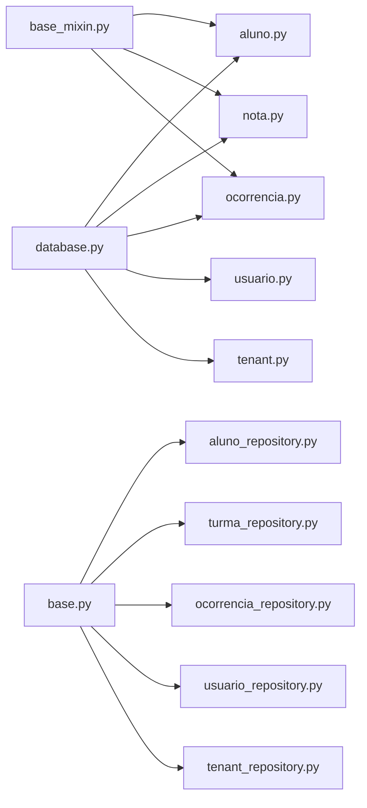

**Diagram sources**
- [database.py:1-130](file://backend/app/core/database.py#L1-L130)
- [base_mixin.py:1-22](file://backend/app/models/base_mixin.py#L1-L22)
- [base.py:1-41](file://backend/app/repositories/base.py#L1-L41)
- [aluno_repository.py:1-105](file://backend/app/repositories/aluno_repository.py#L1-L105)
- [turma_repository.py:1-101](file://backend/app/repositories/turma_repository.py#L1-L101)
- [ocorrencia_repository.py:1-27](file://backend/app/repositories/ocorrencia_repository.py#L1-L27)
- [usuario_repository.py:1-68](file://backend/app/repositories/usuario_repository.py#L1-L68)
- [tenant_repository.py:1-21](file://backend/app/repositories/tenant_repository.py#L1-L21)
- [aluno.py:1-36](file://backend/app/models/aluno.py#L1-L36)
- [nota.py:1-24](file://backend/app/models/nota.py#L1-L24)
- [ocorrencia.py:1-45](file://backend/app/models/ocorrencia.py#L1-L45)
- [usuario.py:1-30](file://backend/app/models/usuario.py#L1-L30)
- [tenant.py:1-22](file://backend/app/models/tenant.py#L1-L22)

**Section sources**
- [database.py:1-130](file://backend/app/core/database.py#L1-L130)
- [base.py:1-41](file://backend/app/repositories/base.py#L1-L41)

## Performance Considerations
- Aggregation queries:
  - Prefer grouping and aggregation in a single pass; avoid multiple round-trips.
  - Use outer joins to include entities without related data when computing totals.
- Pagination:
  - Always compute total count before slicing to support accurate pagination metadata.
- Filtering:
  - Apply tenant and academic-year filters early in the query chain to minimize result sets.
- Loading strategies:
  - Use joined loads for frequently accessed related entities to prevent N+1 queries.
- Execution options:
  - Use execution option to bypass automatic tenant filtering for queries that intentionally require cross-tenant access.

[No sources needed since this section provides general guidance]

## Troubleshooting Guide
- Tenant filters not applied:
  - Ensure Flask request context provides tenant_id and academic_year_id.
  - Verify the session event hook executes for SELECT statements.
- Unexpected cross-tenant data:
  - Confirm models include tenant_id and academic_year_id columns via TenantYearMixin.
  - Review explicit filters in repositories for special cases.
- Slow aggregation queries:
  - Add appropriate indexes on tenant_id and academic_year_id.
  - Use grouped queries and avoid unnecessary joins.
- Transaction errors:
  - Wrap batch operations in a session scope to ensure atomicity and rollback on failure.

**Section sources**
- [database.py:39-102](file://backend/app/core/database.py#L39-L102)

## Conclusion
The repository pattern in this codebase centralizes persistence logic behind typed repositories, while tenant and academic-year scoping is enforced at the database level via a session event hook. Specialized repositories encapsulate domain-specific queries, transformations, and performance-conscious patterns, integrating cleanly with the service layer for maintainable, scalable data access.