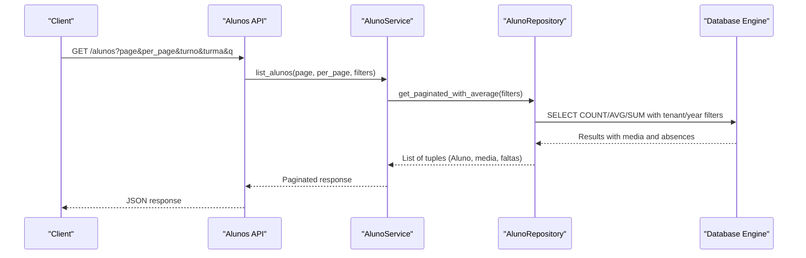
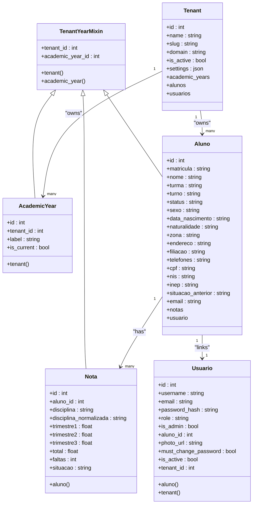
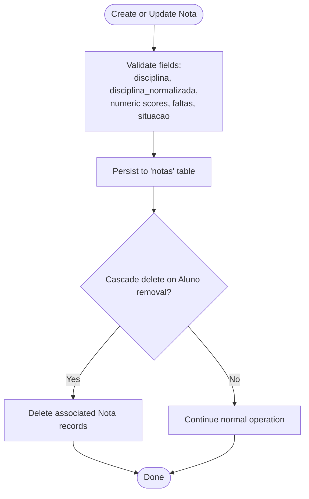
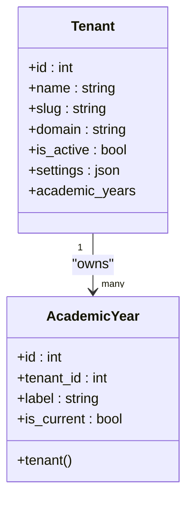
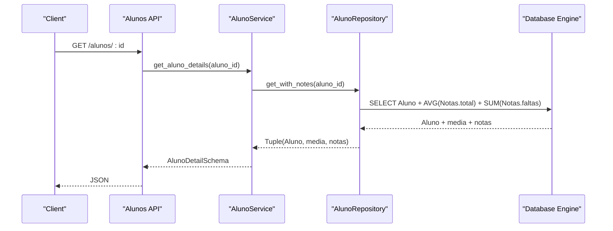
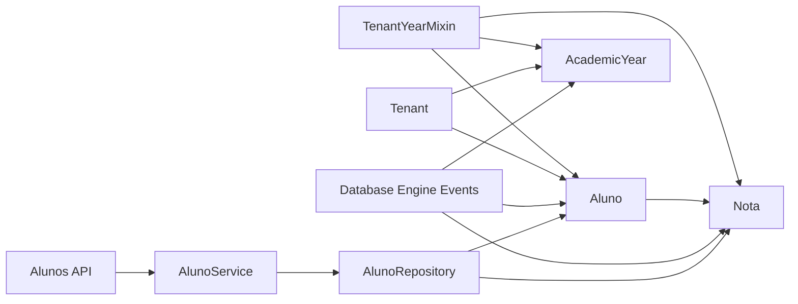

# Student & Academic Models

<cite>
**Referenced Files in This Document**
- [aluno.py](file://backend/app/models/aluno.py)
- [nota.py](file://backend/app/models/nota.py)
- [academic_year.py](file://backend/app/models/academic_year.py)
- [base_mixin.py](file://backend/app/models/base_mixin.py)
- [tenant.py](file://backend/app/models/tenant.py)
- [usuario.py](file://backend/app/models/usuario.py)
- [aluno_repository.py](file://backend/app/repositories/aluno_repository.py)
- [aluno_service.py](file://backend/app/services/aluno_service.py)
- [alunos.py](file://backend/app/api/v1/alunos.py)
- [aluno.py (schema)](file://backend/app/schemas/aluno.py)
- [database.py](file://backend/app/core/database.py)
- [initial_migration.py](file://backend/migrations/versions/ddb44b2eb3a0_initial_migration.py)
</cite>

## Table of Contents
1. [Introduction](#introduction)
2. [Project Structure](#project-structure)
3. [Core Components](#core-components)
4. [Architecture Overview](#architecture-overview)
5. [Detailed Component Analysis](#detailed-component-analysis)
6. [Dependency Analysis](#dependency-analysis)
7. [Performance Considerations](#performance-considerations)
8. [Troubleshooting Guide](#troubleshooting-guide)
9. [Conclusion](#conclusion)

## Introduction
This document provides a comprehensive data model specification for student and academic management entities in the platform. It focuses on three core models:
- Aluno: student record with personal and enrollment information
- Nota: grade tracking per subject and evaluation periods
- AcademicYear: academic year management for year-based data organization

It documents field specifications, validation rules, business logic constraints, relationships, data integrity constraints, cascading operations, and query optimization patterns. The goal is to enable developers and stakeholders to understand how student and academic data are modeled, stored, and accessed consistently across the backend.

## Project Structure
The relevant models and supporting components are organized as follows:
- Models define the database schema and relationships
- Schemas define Pydantic models for API input/output validation
- Repositories encapsulate query logic and pagination
- Services orchestrate business operations and data shaping
- API endpoints expose CRUD and report generation
- Database layer enforces tenant and academic year scoping via SQLAlchemy events
- Migrations define the initial schema

```mermaid
graph TB
subgraph "Models"
A["Aluno<br/>backend/app/models/aluno.py"]
N["Nota<br/>backend/app/models/nota.py"]
Y["AcademicYear<br/>backend/app/models/academic_year.py"]
T["Tenant<br/>backend/app/models/tenant.py"]
U["Usuario<br/>backend/app/models/usuario.py"]
M["TenantYearMixin<br/>backend/app/models/base_mixin.py"]
end
subgraph "Schemas"
S1["Aluno Schema<br/>backend/app/schemas/aluno.py"]
end
subgraph "Repositories"
R["AlunoRepository<br/>backend/app/repositories/aluno_repository.py"]
end
subgraph "Services"
SV["AlunoService<br/>backend/app/services/aluno_service.py"]
end
subgraph "API"
API["Alunos API<br/>backend/app/api/v1/alunos.py"]
end
subgraph "Database"
DB["Database Engine & Events<br/>backend/app/core/database.py"]
MIG["Initial Migration<br/>backend/migrations/versions/ddb44b2eb3a0_initial_migration.py"]
end
A --- N
A --- U
T --- A
T --- Y
M --- A
M --- N
M --- Y
S1 --- API
R --- A
R --- N
SV --- R
API --- SV
DB --- A
DB --- N
DB --- Y
DB --- T
MIG --- A
MIG --- N
```

**Diagram sources**
- [aluno.py:1-36](file://backend/app/models/aluno.py#L1-L36)
- [nota.py:1-24](file://backend/app/models/nota.py#L1-L24)
- [academic_year.py:1-16](file://backend/app/models/academic_year.py#L1-L16)
- [tenant.py:1-22](file://backend/app/models/tenant.py#L1-L22)
- [usuario.py:1-30](file://backend/app/models/usuario.py#L1-L30)
- [base_mixin.py:1-22](file://backend/app/models/base_mixin.py#L1-L22)
- [aluno.py (schema):1-85](file://backend/app/schemas/aluno.py#L1-L85)
- [aluno_repository.py:1-105](file://backend/app/repositories/aluno_repository.py#L1-L105)
- [aluno_service.py:1-156](file://backend/app/services/aluno_service.py#L1-L156)
- [alunos.py:1-148](file://backend/app/api/v1/alunos.py#L1-L148)
- [database.py:1-130](file://backend/app/core/database.py#L1-L130)
- [initial_migration.py:1-70](file://backend/migrations/versions/ddb44b2eb3a0_initial_migration.py#L1-L70)

**Section sources**
- [aluno.py:1-36](file://backend/app/models/aluno.py#L1-L36)
- [nota.py:1-24](file://backend/app/models/nota.py#L1-L24)
- [academic_year.py:1-16](file://backend/app/models/academic_year.py#L1-L16)
- [base_mixin.py:1-22](file://backend/app/models/base_mixin.py#L1-L22)
- [aluno.py (schema):1-85](file://backend/app/schemas/aluno.py#L1-L85)
- [aluno_repository.py:1-105](file://backend/app/repositories/aluno_repository.py#L1-L105)
- [aluno_service.py:1-156](file://backend/app/services/aluno_service.py#L1-L156)
- [alunos.py:1-148](file://backend/app/api/v1/alunos.py#L1-L148)
- [database.py:1-130](file://backend/app/core/database.py#L1-L130)
- [initial_migration.py:1-70](file://backend/migrations/versions/ddb44b2eb3a0_initial_migration.py#L1-L70)

## Core Components
This section defines the three primary models and their essential characteristics.

### Aluno (Student)
- Purpose: Stores student enrollment and basic personal information
- Primary keys: id
- Unique constraints: matricula
- Tenant scoping: tenant_id via TenantYearMixin
- Academic year scoping: academic_year_id via TenantYearMixin
- Relationships:
  - One-to-many with Nota (grades)
  - One-to-one with Usuario (user account linked to student)
- Business constraints:
  - matricula must be unique and non-empty
  - nome, turma, turno are required
  - status is optional
  - Personal fields (sexo, data_nascimento, naturalidade, zona, endereco, filiacao, telefones, cpf, nis, inep, situacao_anterior, email) are optional

Validation and input/output:
- Pydantic schema supports creation and updates with optional fields
- API endpoints enforce role-based access and input validation

Cascading and integrity:
- Deleting an Aluno deletes associated Nota entries (cascade)
- Deleting an Aluno does not orphan Usuario (no cascade on aluno_id)

**Section sources**
- [aluno.py:1-36](file://backend/app/models/aluno.py#L1-L36)
- [aluno.py (schema):18-80](file://backend/app/schemas/aluno.py#L18-L80)
- [alunos.py:63-98](file://backend/app/api/v1/alunos.py#L63-L98)
- [initial_migration.py:24-32](file://backend/migrations/versions/ddb44b2eb3a0_initial_migration.py#L24-L32)

### Nota (Grade)
- Purpose: Tracks subject-specific grades across evaluation periods and absences
- Primary keys: id
- Foreign keys: aluno_id → Aluno.id (on delete CASCADE)
- Tenant scoping: tenant_id via TenantYearMixin
- Academic year scoping: academic_year_id via TenantYearMixin
- Fields:
  - disciplina: subject name
  - disciplina_normalizada: normalized subject name
  - trimestre1, trimestre2, trimestre3: numeric scores (nullable)
  - total: computed or entered score (nullable)
  - faltas: integer number of absences (default 0)
  - situacao: status string (nullable)
- Business constraints:
  - Scores are numeric with precision/scale suitable for decimal grades
  - faltas defaults to 0 when not provided
  - situacao indicates pass/fail or pending status
- Integrity:
  - Cascade delete ensures grade cleanup when a student is removed

**Section sources**
- [nota.py:1-24](file://backend/app/models/nota.py#L1-L24)
- [base_mixin.py:1-22](file://backend/app/models/base_mixin.py#L1-L22)
- [initial_migration.py:33-46](file://backend/migrations/versions/ddb44b2eb3a0_initial_migration.py#L33-L46)

### AcademicYear (Academic Year)
- Purpose: Manages academic year records for multi-year data organization
- Primary keys: id
- Foreign keys: tenant_id → Tenant.id
- Index: tenant_id for efficient filtering
- Fields:
  - label: year identifier (e.g., "2024")
  - is_current: boolean flag indicating active year
- Relationships:
  - Many-to-one with Tenant
  - Cascade delete for orphaned year records

**Section sources**
- [academic_year.py:1-16](file://backend/app/models/academic_year.py#L1-L16)
- [base_mixin.py:1-22](file://backend/app/models/base_mixin.py#L1-L22)

## Architecture Overview
The system enforces tenant and academic year scoping at the database level using SQLAlchemy events. This ensures that queries automatically filter by the current tenant and academic year when available. Repositories and services build on top of this foundation to provide paginated listings, averages, and detailed views.



**Diagram sources**
- [alunos.py:15-42](file://backend/app/api/v1/alunos.py#L15-L42)
- [aluno_service.py:20-61](file://backend/app/services/aluno_service.py#L20-L61)
- [aluno_repository.py:12-74](file://backend/app/repositories/aluno_repository.py#L12-L74)
- [database.py:39-102](file://backend/app/core/database.py#L39-L102)

## Detailed Component Analysis

### Aluno Model Analysis
- Data model definition and relationships
- Personal and enrollment fields
- Tenant and academic year scoping via TenantYearMixin
- Relationship mappings to Nota and Usuario



**Diagram sources**
- [aluno.py:1-36](file://backend/app/models/aluno.py#L1-L36)
- [nota.py:1-24](file://backend/app/models/nota.py#L1-L24)
- [academic_year.py:1-16](file://backend/app/models/academic_year.py#L1-L16)
- [tenant.py:1-22](file://backend/app/models/tenant.py#L1-L22)
- [usuario.py:1-30](file://backend/app/models/usuario.py#L1-L30)
- [base_mixin.py:1-22](file://backend/app/models/base_mixin.py#L1-L22)

**Section sources**
- [aluno.py:1-36](file://backend/app/models/aluno.py#L1-L36)
- [base_mixin.py:1-22](file://backend/app/models/base_mixin.py#L1-L22)
- [tenant.py:1-22](file://backend/app/models/tenant.py#L1-L22)
- [usuario.py:1-30](file://backend/app/models/usuario.py#L1-L30)

### Nota Model Analysis
- Subject-specific grade tracking
- Evaluation periods and totals
- Absences and status fields
- Foreign key constraint with cascade delete



**Diagram sources**
- [nota.py:1-24](file://backend/app/models/nota.py#L1-L24)
- [initial_migration.py:33-46](file://backend/migrations/versions/ddb44b2eb3a0_initial_migration.py#L33-L46)

**Section sources**
- [nota.py:1-24](file://backend/app/models/nota.py#L1-L24)
- [initial_migration.py:33-46](file://backend/migrations/versions/ddb44b2eb3a0_initial_migration.py#L33-L46)

### AcademicYear Model Analysis
- Academic year management per tenant
- Current year flag for active period
- Index on tenant_id for efficient filtering



**Diagram sources**
- [academic_year.py:1-16](file://backend/app/models/academic_year.py#L1-L16)
- [tenant.py:1-22](file://backend/app/models/tenant.py#L1-L22)

**Section sources**
- [academic_year.py:1-16](file://backend/app/models/academic_year.py#L1-L16)
- [tenant.py:1-22](file://backend/app/models/tenant.py#L1-L22)

### Data Retrieval and Aggregation
- Paginated listing with average and absence aggregation
- Filtering by tenant and academic year
- Detailed view with subject grades and computed averages



**Diagram sources**
- [alunos.py:43-61](file://backend/app/api/v1/alunos.py#L43-L61)
- [aluno_service.py:63-93](file://backend/app/services/aluno_service.py#L63-L93)
- [aluno_repository.py:76-104](file://backend/app/repositories/aluno_repository.py#L76-L104)

**Section sources**
- [aluno_repository.py:12-104](file://backend/app/repositories/aluno_repository.py#L12-L104)
- [aluno_service.py:20-93](file://backend/app/services/aluno_service.py#L20-L93)
- [alunos.py:15-61](file://backend/app/api/v1/alunos.py#L15-L61)

## Dependency Analysis
- TenantYearMixin centralizes tenant_id and academic_year_id fields and relationships across models
- Database engine applies tenant and academic year filters automatically during query execution
- Repositories encapsulate multi-tenant and multi-year query logic
- Services orchestrate data shaping and pagination
- API endpoints validate inputs and enforce roles



**Diagram sources**
- [base_mixin.py:1-22](file://backend/app/models/base_mixin.py#L1-L22)
- [aluno.py:1-36](file://backend/app/models/aluno.py#L1-L36)
- [nota.py:1-24](file://backend/app/models/nota.py#L1-L24)
- [academic_year.py:1-16](file://backend/app/models/academic_year.py#L1-L16)
- [tenant.py:1-22](file://backend/app/models/tenant.py#L1-L22)
- [database.py:39-102](file://backend/app/core/database.py#L39-L102)
- [aluno_repository.py:1-105](file://backend/app/repositories/aluno_repository.py#L1-L105)
- [aluno_service.py:1-156](file://backend/app/services/aluno_service.py#L1-L156)
- [alunos.py:1-148](file://backend/app/api/v1/alunos.py#L1-L148)

**Section sources**
- [base_mixin.py:1-22](file://backend/app/models/base_mixin.py#L1-L22)
- [database.py:39-102](file://backend/app/core/database.py#L39-L102)
- [aluno_repository.py:1-105](file://backend/app/repositories/aluno_repository.py#L1-L105)
- [aluno_service.py:1-156](file://backend/app/services/aluno_service.py#L1-L156)
- [alunos.py:1-148](file://backend/app/api/v1/alunos.py#L1-L148)

## Performance Considerations
- Automatic tenant and academic year filtering reduces accidental cross-tenant queries and improves security
- Index on tenant_id in AcademicYear optimizes joins and filtering
- Outer join with grouping in repository queries aggregates media and absences efficiently
- Pagination limits reduce memory footprint for large datasets
- Numeric precision/scale for scores balances accuracy and storage efficiency

[No sources needed since this section provides general guidance]

## Troubleshooting Guide
Common issues and resolutions:
- Access denied for students viewing own records: ensure JWT claims include alumno role and aluno_id; API enforces claim checks
- Empty or incorrect averages: verify Nota records exist and tenant/year filters match current context
- Deletion anomalies: cascade delete removes grades when a student is deleted; confirm foreign key constraints are intact
- Multi-tenant contamination: rely on automatic filtering; ensure tenant_id and academic_year_id are set in request context

**Section sources**
- [alunos.py:43-61](file://backend/app/api/v1/alunos.py#L43-L61)
- [aluno_repository.py:76-104](file://backend/app/repositories/aluno_repository.py#L76-L104)
- [database.py:39-102](file://backend/app/core/database.py#L39-L102)

## Conclusion
The data model establishes a clear, secure, and scalable foundation for student and academic data management. Tenant and academic year scoping are enforced at the database level, while repositories and services provide robust query and aggregation capabilities. The schema’s constraints and relationships ensure data integrity, and cascading operations maintain referential consistency. Together, these components support accurate reporting, efficient pagination, and secure access across tenants and academic years.