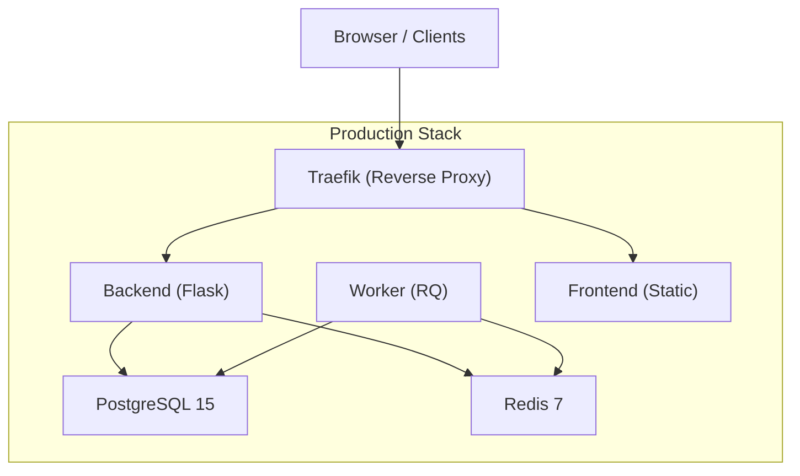
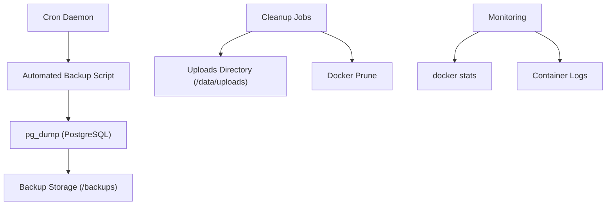
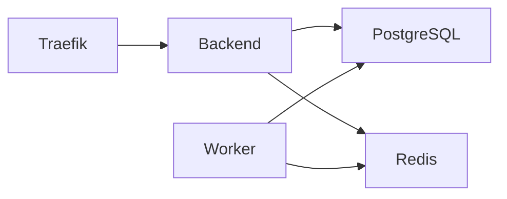

# Backup & Maintenance

<cite>
**Referenced Files in This Document**
- [docker-compose.yml](file://docker-compose.yml)
- [docker-compose.prod.yml](file://docker-compose.prod.yml)
- [deploy-to-hetzner.md](file://deploy-to-hetzner.md)
- [DEPLOYMENT.md](file://docs/DEPLOYMENT.md)
- [setup-hetzner.sh](file://scripts/setup-hetzner.sh)
- [entrypoint.sh](file://backend/entrypoint.sh)
- [config.py](file://backend/app/core/config.py)
- [uploads.py](file://backend/app/api/v1/uploads.py)
- [implementation-playbook.md](file://.agent/skills/database-migrations-sql-migrations/resources/implementation-playbook.md)
- [SKILL.md](file://.agent/skills/linux-shell-scripting/SKILL.md)
</cite>

## Table of Contents
1. [Introduction](#introduction)
2. [Project Structure](#project-structure)
3. [Core Components](#core-components)
4. [Architecture Overview](#architecture-overview)
5. [Detailed Component Analysis](#detailed-component-analysis)
6. [Dependency Analysis](#dependency-analysis)
7. [Performance Considerations](#performance-considerations)
8. [Troubleshooting Guide](#troubleshooting-guide)
9. [Conclusion](#conclusion)
10. [Appendices](#appendices)

## Introduction
This document provides comprehensive guidance for backup procedures and system maintenance operations tailored to the platform’s Dockerized architecture. It covers automated backup strategies using cron, manual backup and restore procedures for PostgreSQL, cleanup operations for old files and unused containers, backup scheduling best practices, retention policies, disaster recovery procedures, maintenance tasks such as log rotation, container cleanup, upload file management, and system resource monitoring. The content references actual repository files to ensure accuracy and practical applicability.

## Project Structure
The platform runs PostgreSQL and Redis as managed services, with the backend and worker relying on these for persistence and job queues. Production deployments leverage Traefik as a reverse proxy with automatic TLS certificates. Uploads are stored under a configurable folder mounted into the backend container.

**Diagram sources**
- [docker-compose.prod.yml:25-142](file://docker-compose.prod.yml#L25-L142)

**Section sources**
- [docker-compose.prod.yml:1-173](file://docker-compose.prod.yml#L1-L173)
- [docker-compose.yml:1-103](file://docker-compose.yml#L1-L103)

## Core Components
- PostgreSQL service: Persistent relational database with health checks and mounted volume for durability.
- Redis service: In-memory cache and job queue for asynchronous tasks.
- Backend service: Flask application exposing API endpoints and managing uploads.
- Worker service: RQ worker consuming jobs from Redis.
- Frontend service: Static assets served behind Traefik.
- Uploads: Stored under a configurable path inside the backend container; exposed via mounted volume for external management.

Key operational paths:
- Backup and restore use PostgreSQL’s native dump/restore utilities.
- Cron-based automation executes periodic backups.
- Cleanup tasks target old uploads and stale Docker artifacts.
- Monitoring leverages Docker stats and container logs.

**Section sources**
- [docker-compose.prod.yml:25-142](file://docker-compose.prod.yml#L25-L142)
- [config.py:16](file://backend/app/core/config.py#L16)
- [uploads.py:32](file://backend/app/api/v1/uploads.py#L32)

## Architecture Overview
The backup and maintenance architecture integrates cron-driven automation, Docker Compose orchestration, and PostgreSQL-native tooling. Traefik handles ingress and TLS; backend and worker depend on healthy PostgreSQL and Redis services.

**Diagram sources**
- [DEPLOYMENT.md:295-331](file://docs/DEPLOYMENT.md#L295-L331)
- [docker-compose.prod.yml:25-142](file://docker-compose.prod.yml#L25-L142)

## Detailed Component Analysis

### Automated Backup Strategy with Cron
- Schedule a daily backup at 2 AM using cron to execute pg_dump inside the PostgreSQL container and compress output.
- Store backups in a centralized directory for offsite retention.
- Use environment variables from the production compose file to connect to the database.

Backup schedule best practices:
- Choose off-peak hours (e.g., early morning).
- Include database name and user from environment variables.
- Compress backups to reduce storage and transfer time.
- Validate backup integrity by attempting a dry-run restore on a staging environment periodically.

Retention policy recommendations:
- Keep last 14 daily backups for short-term recovery.
- Keep weekly backups for 8 weeks.
- Keep monthly backups for 12 months.
- Archive or rotate older backups to external storage.

Disaster recovery procedure:
- Identify the latest successful backup.
- Restore to a temporary PostgreSQL instance.
- Validate schema and sample data.
- Promote restored instance to production after verifying application connectivity.

**Section sources**
- [DEPLOYMENT.md:295-304](file://docs/DEPLOYMENT.md#L295-L304)
- [docker-compose.prod.yml:28-31](file://docker-compose.prod.yml#L28-L31)

### Manual Backup and Restore Procedures
Manual backup:
- Connect to the PostgreSQL container and run pg_dump with credentials from environment variables.
- Redirect output to a compressed file for safekeeping.

Manual restore:
- Stop the backend and worker services to avoid writes.
- Drop and recreate the target database if necessary.
- Restore using the appropriate PostgreSQL utility.
- Restart services and verify application health.

Operational tips:
- Always capture a pre-restore snapshot before destructive operations.
- Validate restore by checking recent records and running basic queries.
- Monitor logs for startup errors after restore.

**Section sources**
- [deploy-to-hetzner.md:88](file://deploy-to-hetzner.md#L88)
- [docker-compose.prod.yml:28-31](file://docker-compose.prod.yml#L28-L31)

### Cleanup Operations for Old Files and Unused Containers
- Remove old uploads: Use find with mtime to delete files older than a configured threshold (e.g., 90 days) inside the backend container.
- Clean Docker images and volumes: Use docker image prune to remove unused images; prune volumes as needed.
- Remove stopped containers and dangling images periodically.

Cleanup best practices:
- Schedule cleanup during low-traffic windows.
- Confirm retention policies before deletion.
- Back up critical data before mass deletions.

**Section sources**
- [DEPLOYMENT.md:322-331](file://docs/DEPLOYMENT.md#L322-L331)

### Upload File Management
- Uploads are stored under a configurable folder inside the backend container.
- The upload endpoint validates presence of required form fields and securely saves files to a normalized path derived from turn and class segments.
- Jobs are enqueued asynchronously for processing.

Maintenance tasks:
- Periodically clean old PDFs based on mtime.
- Monitor disk usage in the uploads directory.
- Enforce file size limits and sanitize filenames to prevent path traversal.

**Section sources**
- [config.py:16](file://backend/app/core/config.py#L16)
- [uploads.py:16-56](file://backend/app/api/v1/uploads.py#L16-L56)

### System Resource Monitoring
- Use docker stats to observe CPU, memory, and network consumption across containers.
- Tail logs for backend and worker to detect runtime anomalies.
- Health checks are embedded in the compose files for PostgreSQL and Redis.

Monitoring commands:
- Container status and logs.
- API health endpoint verification.
- Disk usage and inode availability checks.

**Section sources**
- [DEPLOYMENT.md:306-320](file://docs/DEPLOYMENT.md#L306-L320)
- [docker-compose.prod.yml:36-54](file://docker-compose.prod.yml#L36-L54)

### Container Lifecycle and Initialization
- Entrypoint script waits for database readiness, runs migrations, and starts the main process.
- Production compose sets restart policies and environment variables for secrets and URLs.

Operational insights:
- Entrypoint failures often indicate missing migrations or misconfigured database URLs.
- Use health checks to confirm service readiness before traffic routing.

**Section sources**
- [entrypoint.sh:4-20](file://backend/entrypoint.sh#L4-L20)
- [docker-compose.prod.yml:61-72](file://docker-compose.prod.yml#L61-L72)

### Database Migration and Rollback Patterns
- Use pg_dump to create a pre-rollback snapshot before executing migration rollbacks.
- Maintain explicit rollback scripts per migration version and validate against the schema migrations table.

Safety practices:
- Verify current migration version matches expectations.
- Create snapshots before destructive operations.
- Test rollback procedures in a staging environment.

**Section sources**
- [implementation-playbook.md:327-360](file://.agent/skills/database-migrations-sql-migrations/resources/implementation-playbook.md#L327-L360)

### Linux Shell Scripting for Maintenance
- Example scripts demonstrate backup rotation and database backup using compression.
- These patterns can be adapted for cron automation and retention enforcement.

Practical usage:
- Parameterize backup directories and retention counts.
- Integrate with monitoring to send alerts on failure.

**Section sources**
- [SKILL.md:60-119](file://.agent/skills/linux-shell-scripting/SKILL.md#L60-L119)

## Dependency Analysis
The backend and worker depend on PostgreSQL and Redis health. Traefik depends on backend availability. Uploads are persisted via mounted volumes.

**Diagram sources**
- [docker-compose.prod.yml:108-142](file://docker-compose.prod.yml#L108-L142)

**Section sources**
- [docker-compose.prod.yml:108-142](file://docker-compose.prod.yml#L108-L142)

## Performance Considerations
- Schedule backups during off-peak hours to minimize impact on application performance.
- Use compression to reduce I/O and storage overhead.
- Monitor disk usage and set alerts to prevent out-of-space conditions.
- Regularly prune unused Docker artifacts to maintain system responsiveness.

[No sources needed since this section provides general guidance]

## Troubleshooting Guide
Common issues and remedies:
- Containers failing to start: inspect logs, verify environment variables, and ensure database health.
- Database connection errors: check service status, credentials, and network connectivity.
- Backup failures: validate cron permissions, backup directory write access, and pg_dump connectivity.

Useful commands:
- View service status and logs.
- Execute health checks for backend and database.
- Restart services after applying fixes.

**Section sources**
- [DEPLOYMENT.md:335-357](file://docs/DEPLOYMENT.md#L335-L357)
- [deploy-to-hetzner.md:86-89](file://deploy-to-hetzner.md#L86-L89)

## Conclusion
By combining cron-driven backups, robust retention policies, and disciplined cleanup routines, the platform can achieve reliable data protection and operational hygiene. Integrating health checks, monitoring, and migration safety practices further strengthens disaster recovery readiness and day-to-day stability.

[No sources needed since this section summarizes without analyzing specific files]

## Appendices

### Appendix A: Backup and Restore Commands
- Automated backup via cron:
  - See [docs/DEPLOYMENT.md:295-304](file://docs/DEPLOYMENT.md#L295-L304)
- Manual backup:
  - See [deploy-to-hetzner.md](file://deploy-to-hetzner.md#L88)
- Manual restore:
  - Stop services, restore database, then restart services and verify.

**Section sources**
- [DEPLOYMENT.md:295-304](file://docs/DEPLOYMENT.md#L295-L304)
- [deploy-to-hetzner.md:88](file://deploy-to-hetzner.md#L88)

### Appendix B: Cleanup and Maintenance Tasks
- Clean old uploads:
  - See [docs/DEPLOYMENT.md:322-331](file://docs/DEPLOYMENT.md#L322-L331)
- Docker cleanup:
  - Remove unused images and volumes regularly.

**Section sources**
- [DEPLOYMENT.md:322-331](file://docs/DEPLOYMENT.md#L322-L331)

### Appendix C: Monitoring and Verification
- Health checks and stats:
  - See [docs/DEPLOYMENT.md:306-320](file://docs/DEPLOYMENT.md#L306-L320)
- Production compose health checks:
  - PostgreSQL and Redis health checks defined in [docker-compose.prod.yml:36-54](file://docker-compose.prod.yml#L36-L54)

**Section sources**
- [DEPLOYMENT.md:306-320](file://docs/DEPLOYMENT.md#L306-L320)
- [docker-compose.prod.yml:36-54](file://docker-compose.prod.yml#L36-L54)