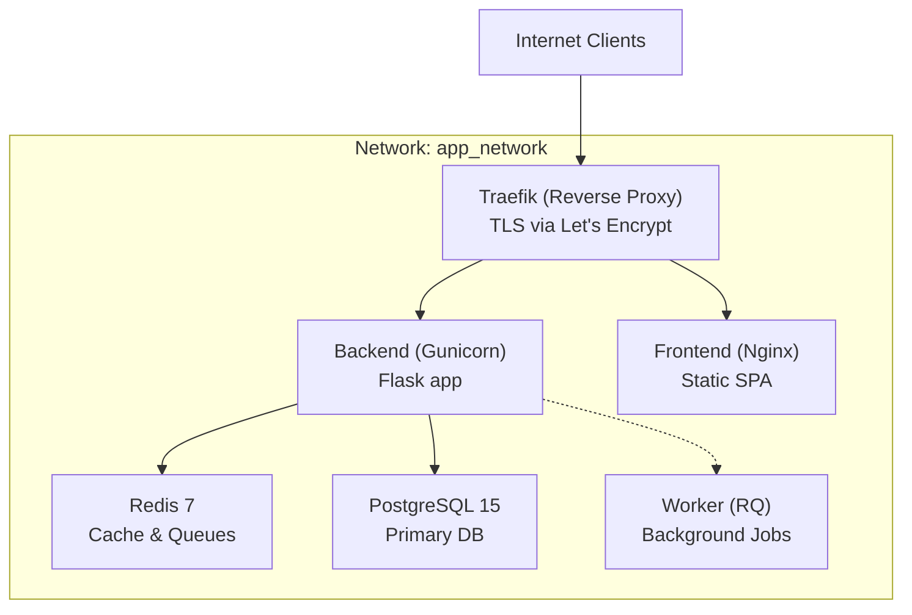
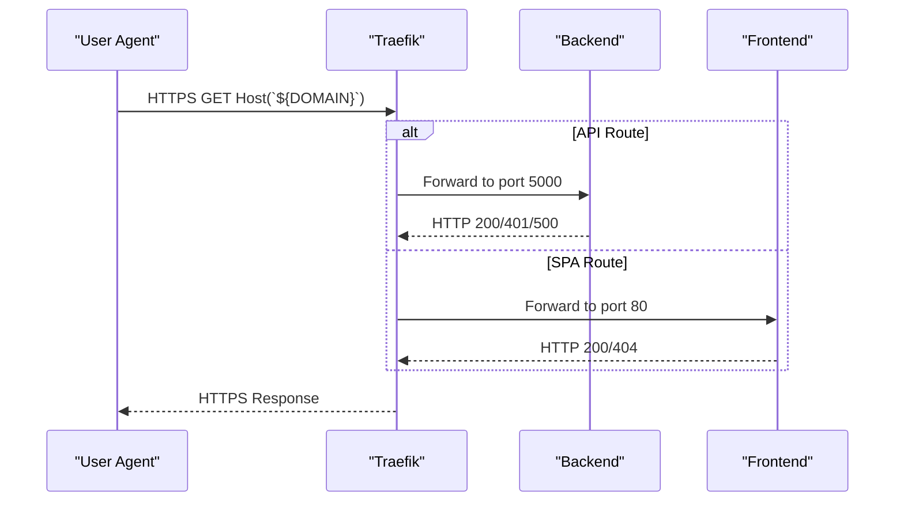
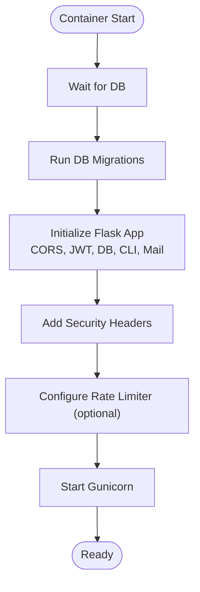
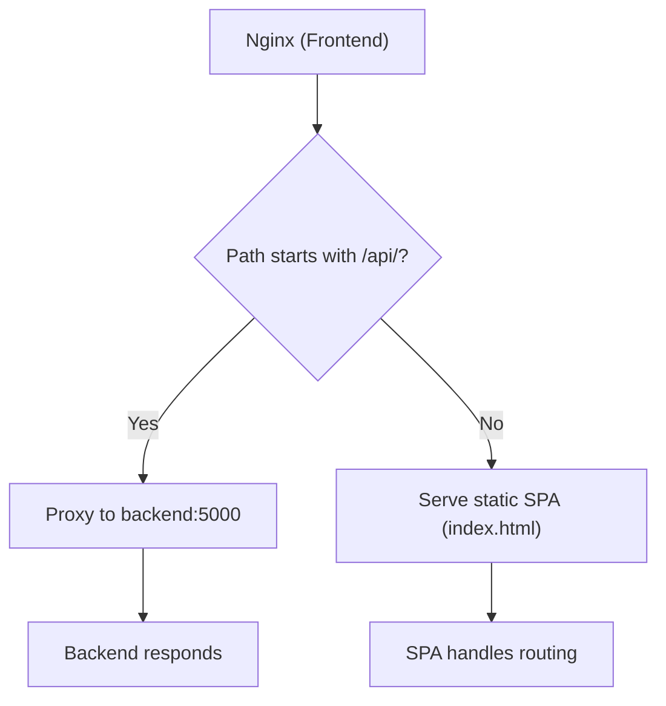
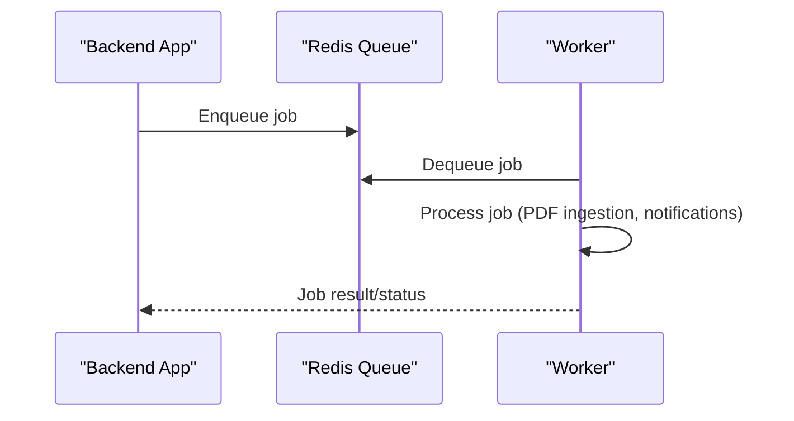
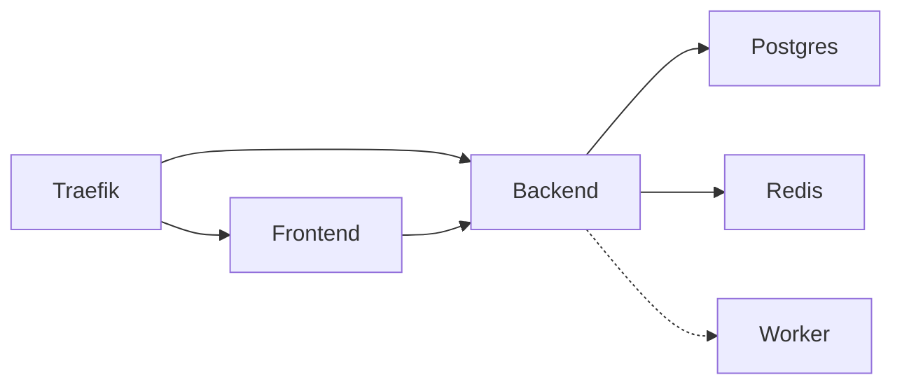

# Deployment & Operations

<cite>
**Referenced Files in This Document**
- [docker-compose.yml](file://docker-compose.yml)
- [docker-compose.prod.yml](file://docker-compose.prod.yml)
- [backend/Dockerfile](file://backend/Dockerfile)
- [frontend/Dockerfile](file://frontend/Dockerfile)
- [frontend/Dockerfile.prod](file://frontend/Dockerfile.prod)
- [backend/entrypoint.sh](file://backend/entrypoint.sh)
- [backend/pyproject.toml](file://backend/pyproject.toml)
- [frontend/nginx.conf](file://frontend/nginx.conf)
- [letsencrypt/acme.json](file://letsencrypt/acme.json)
- [scripts/setup-hetzner.sh](file://scripts/setup-hetzner.sh)
- [docs/DEPLOYMENT.md](file://docs/DEPLOYMENT.md)
- [docs/ARCHITECTURE.md](file://docs/ARCHITECTURE.md)
- [deploy-to-hetzner.md](file://deploy-to-hetzner.md)
- [backend/app/core/config.py](file://backend/app/core/config.py)
- [backend/app/__init__.py](file://backend/app/__init__.py)
</cite>

## Table of Contents
1. [Introduction](#introduction)
2. [Project Structure](#project-structure)
3. [Core Components](#core-components)
4. [Architecture Overview](#architecture-overview)
5. [Detailed Component Analysis](#detailed-component-analysis)
6. [Dependency Analysis](#dependency-analysis)
7. [Performance Considerations](#performance-considerations)
8. [Troubleshooting Guide](#troubleshooting-guide)
9. [Conclusion](#conclusion)
10. [Appendices](#appendices)

## Introduction
This document provides a comprehensive guide to deploying and operating the platform in production. It focuses on containerization with Docker and Docker Compose, Traefik reverse proxy configuration, automated SSL/TLS via Let's Encrypt, infrastructure requirements, environment configuration, monitoring, and maintenance procedures. It is designed for DevOps engineers and operators who need both conceptual overviews and precise technical details for automation and repeatable deployments.

## Project Structure
The deployment stack is orchestrated with Docker Compose. Two primary compose files define environments:
- Development stack: local orchestration with explicit ports and mounted volumes for rapid iteration.
- Production stack: Traefik-managed routing with automatic HTTPS, persistent volumes, and production-grade runtime configuration.

Key elements:
- Traefik handles ingress, routing, and TLS certificate provisioning/resolution.
- Backend runs under Gunicorn with multiple workers and threads.
- Frontend is served by a static Nginx container optimized for production.
- Redis provides caching and job queues; PostgreSQL stores application data.
- Workers process background jobs via Redis Queue (RQ).



**Diagram sources**
- [docker-compose.prod.yml:1-173](file://docker-compose.prod.yml#L1-L173)
- [frontend/Dockerfile.prod:1-16](file://frontend/Dockerfile.prod#L1-L16)
- [backend/Dockerfile:1-34](file://backend/Dockerfile#L1-L34)

**Section sources**
- [docker-compose.prod.yml:1-173](file://docker-compose.prod.yml#L1-L173)
- [docs/DEPLOYMENT.md:88-127](file://docs/DEPLOYMENT.md#L88-L127)

## Core Components
- Traefik: Reverse proxy and load balancer with automatic certificate management via ACME HTTP challenge and storage persistence.
- Backend: Python/Flask application packaged with Gunicorn, configured via environment variables and entrypoint initialization.
- Frontend: Nginx static site serving the built SPA with API proxying to backend.
- Worker: RQ worker consuming jobs from Redis.
- Redis: Caching and job queue with password protection and persistence.
- PostgreSQL: Primary relational database with health checks and persistent volumes.

Operational highlights:
- Environment variables drive configuration for domains, secrets, databases, Redis, SMTP, and optional WhatsApp integration.
- Health checks ensure dependent services are ready before application startup.
- Persistent volumes protect data for Postgres, Redis, and Traefik certificates.

**Section sources**
- [docker-compose.prod.yml:1-173](file://docker-compose.prod.yml#L1-L173)
- [backend/entrypoint.sh:1-21](file://backend/entrypoint.sh#L1-L21)
- [backend/app/core/config.py:1-60](file://backend/app/core/config.py#L1-L60)
- [frontend/nginx.conf:1-33](file://frontend/nginx.conf#L1-L33)

## Architecture Overview
Production traffic flows through Traefik, which terminates TLS and forwards requests to backend and frontend services. Backend serves REST APIs and static assets, while frontend serves the SPA. Redis and PostgreSQL back the application state and asynchronous processing.

```mermaid
graph TB
subgraph "Ingress"
Client["Browser / Mobile App"] --> Traefik["Traefik"]
end
subgraph "Routing"
Traefik --> |Host(`${DOMAIN}`) + PathPrefix(`/api`) → HTTPS| Backend["Backend (Gunicorn)"]
Traefik --> |Host(`${DOMAIN}`) → HTTPS| Frontend["Frontend (Nginx)"]
end
subgraph "Data & Queue"
Backend --> Redis["Redis"]
Backend --> Postgres["PostgreSQL"]
Backend -.-> Worker["Worker (RQ)"]
end
```

**Diagram sources**
- [docker-compose.prod.yml:94-163](file://docker-compose.prod.yml#L94-L163)
- [frontend/nginx.conf:5-18](file://frontend/nginx.conf#L5-L18)

**Section sources**
- [docs/ARCHITECTURE.md:22-70](file://docs/ARCHITECTURE.md#L22-L70)
- [docs/DEPLOYMENT.md:88-127](file://docs/DEPLOYMENT.md#L88-L127)

## Detailed Component Analysis

### Traefik Reverse Proxy and TLS Automation
Traefik is configured as a Docker service with:
- Docker provider enabled for dynamic service discovery.
- Two entrypoints: web (HTTP) and websecure (HTTPS).
- ACME HTTP challenge with storage in a named volume for certificates.
- Automatic HTTPS redirection for HTTP routers.
- Router and service labels on backend and frontend for routing.



**Diagram sources**
- [docker-compose.prod.yml:2-23](file://docker-compose.prod.yml#L2-L23)
- [docker-compose.prod.yml:94-105](file://docker-compose.prod.yml#L94-L105)
- [docker-compose.prod.yml:149-160](file://docker-compose.prod.yml#L149-L160)

Operational notes:
- ACME account and certificate material are stored in a persistent volume mapped to Traefik’s expected path.
- Initial certificate issuance occurs on first HTTP access; Traefik logs indicate progress.
- Ensure DNS resolves to the server IP before expecting successful certificate acquisition.

**Section sources**
- [docker-compose.prod.yml:2-23](file://docker-compose.prod.yml#L2-L23)
- [docker-compose.prod.yml:10-14](file://docker-compose.prod.yml#L10-L14)
- [letsencrypt/acme.json:1-25](file://letsencrypt/acme.json#L1-L25)
- [docs/DEPLOYMENT.md:359-370](file://docs/DEPLOYMENT.md#L359-L370)

### Backend Containerization and Startup
Backend image:
- Built from a slim Python base with system dependencies for PostgreSQL and PDF processing.
- Entrypoint script performs database wait, Alembic migrations, and starts Gunicorn.
- Application factory configures CORS, rate limiting, security headers, and database migration integration.

Runtime:
- Gunicorn with multiple workers and threads, bound to 0.0.0.0:5000.
- Environment variables supply secrets, database URLs, Redis connection, SMTP, and optional WhatsApp integration.
- Health checks on Postgres and Redis ensure readiness.



**Diagram sources**
- [backend/Dockerfile:1-34](file://backend/Dockerfile#L1-L34)
- [backend/entrypoint.sh:1-21](file://backend/entrypoint.sh#L1-L21)
- [backend/app/__init__.py:15-87](file://backend/app/__init__.py#L15-L87)

**Section sources**
- [backend/Dockerfile:1-34](file://backend/Dockerfile#L1-L34)
- [backend/entrypoint.sh:1-21](file://backend/entrypoint.sh#L1-L21)
- [backend/app/core/config.py:1-60](file://backend/app/core/config.py#L1-L60)
- [backend/app/__init__.py:15-87](file://backend/app/__init__.py#L15-L87)

### Frontend Static Serving and API Proxy
Frontend image:
- Multi-stage build: Node stage installs dependencies and builds the app; Nginx stage serves static assets.
- Nginx configuration proxies API requests to backend and serves SPA fallback.

Behavior:
- API requests under /api/ are proxied to backend service.
- SPA routes are served by returning index.html for client-side routing.



**Diagram sources**
- [frontend/Dockerfile.prod:1-16](file://frontend/Dockerfile.prod#L1-L16)
- [frontend/nginx.conf:5-25](file://frontend/nginx.conf#L5-L25)

**Section sources**
- [frontend/Dockerfile.prod:1-16](file://frontend/Dockerfile.prod#L1-L16)
- [frontend/nginx.conf:1-33](file://frontend/nginx.conf#L1-L33)

### Worker Jobs and Background Processing
Worker:
- RQ worker consumes jobs from Redis queue.
- Environment variables mirror backend for secrets and database connectivity.
- Restart policy ensures resilience.



**Diagram sources**
- [docker-compose.prod.yml:114-142](file://docker-compose.prod.yml#L114-L142)

**Section sources**
- [docker-compose.prod.yml:114-142](file://docker-compose.prod.yml#L114-L142)

### Infrastructure Requirements and Scaling
- Minimum recommended: Docker Engine and Compose, 2 GB RAM, 10 GB disk.
- Production stack includes health checks, restart policies, and persistent volumes.
- Horizontal scaling:
  - Backend: multiple instances behind Traefik (stateless via JWT and shared Redis).
  - Workers: multiple RQ workers share the Redis queue.
  - Database: consider read replicas for reporting workloads.
  - Redis: consider Sentinel or cluster for HA.

**Section sources**
- [docs/DEPLOYMENT.md:16-28](file://docs/DEPLOYMENT.md#L16-L28)
- [docs/ARCHITECTURE.md:328-335](file://docs/ARCHITECTURE.md#L328-L335)

## Dependency Analysis
Compose services and their relationships:



**Diagram sources**
- [docker-compose.prod.yml:1-173](file://docker-compose.prod.yml#L1-L173)

Development vs production differences:
- Development compose exposes ports and mounts volumes for live reload and debugging.
- Production compose removes ports, adds restart policies, and configures Traefik labels and TLS.

**Section sources**
- [docker-compose.yml:1-103](file://docker-compose.yml#L1-L103)
- [docker-compose.prod.yml:1-173](file://docker-compose.prod.yml#L1-L173)

## Performance Considerations
- Backend: Gunicorn with multiple workers and threads; adjust based on CPU cores and workload.
- Frontend: Nginx static serving with efficient proxying; ensure appropriate timeouts and buffer sizes.
- Database: connection pooling and pagination reduce contention; consider read replicas for heavy reports.
- Cache: Redis for hot queries and session-like data; monitor memory pressure.
- Background jobs: tune worker count and job prioritization; monitor queue length.

[No sources needed since this section provides general guidance]

## Troubleshooting Guide
Common production issues and resolutions:
- Containers failing to start: inspect logs and rebuild; verify environment variables and volume permissions.
- Database connectivity: confirm Postgres health and credentials; test connectivity from backend container.
- SSL/TLS failures: verify DNS resolution, Traefik ACME logs, and certificate storage volume.
- Backend 401 errors: Redis availability is critical; Traefik will route to healthy instances.
- Worker not processing jobs: check queue length and worker logs; restart worker if stuck.
- Migration errors: review migration status and apply upgrades; as a last resort, reinitialize database.

Operational commands:
- View service status and logs.
- Health check endpoint for API.
- Resource usage via stats.
- Automated backup scheduling via cron.

**Section sources**
- [docs/DEPLOYMENT.md:335-407](file://docs/DEPLOYMENT.md#L335-L407)
- [docs/DEPLOYMENT.md:306-331](file://docs/DEPLOYMENT.md#L306-L331)

## Conclusion
The production deployment leverages Docker Compose to orchestrate Traefik, backend, frontend, Redis, and PostgreSQL. Traefik provides secure ingress with automatic TLS via Let's Encrypt, while Gunicorn runs the backend with robust configuration. The stack is designed for horizontal scaling, with clear separation of concerns and operational tooling for monitoring and maintenance.

[No sources needed since this section summarizes without analyzing specific files]

## Appendices

### Production Setup Process
Step-by-step production deployment:
- Prepare environment variables (.env) with required secrets and domain.
- Point DNS to server IP.
- Start services with production compose file.
- Wait for Traefik to obtain certificate; monitor logs.
- Initialize database and seed admin user.
- Verify health endpoint and service status.

**Section sources**
- [docs/DEPLOYMENT.md:98-127](file://docs/DEPLOYMENT.md#L98-L127)
- [docs/DEPLOYMENT.md:204-237](file://docs/DEPLOYMENT.md#L204-L237)

### Environment Configuration Reference
Essential environment variables:
- Domain and ACME contact email for Traefik.
- PostgreSQL credentials and database name.
- Redis password and persistence settings.
- Flask secrets, JWT keys, and production flag.
- SMTP settings for password reset emails.
- Optional WhatsApp integration.

**Section sources**
- [docs/DEPLOYMENT.md:148-201](file://docs/DEPLOYMENT.md#L148-L201)
- [backend/app/core/config.py:9-35](file://backend/app/core/config.py#L9-L35)

### Monitoring and Maintenance Procedures
- Monitor service status, logs, and resource usage.
- Health check via HTTPS endpoint.
- Automated backups via cron to compressed SQL dumps.
- Cleanup old uploads and prune unused images periodically.

**Section sources**
- [docs/DEPLOYMENT.md:306-331](file://docs/DEPLOYMENT.md#L306-L331)
- [docs/DEPLOYMENT.md:279-305](file://docs/DEPLOYMENT.md#L279-L305)

### Hetzner Deployment Example
- Server preparation, firewall rules, and secure SSH access.
- File transfer and environment setup.
- Stack deployment with Docker Compose.
- Post-installation verification and troubleshooting tips.

**Section sources**
- [deploy-to-hetzner.md:1-93](file://deploy-to-hetzner.md#L1-L93)