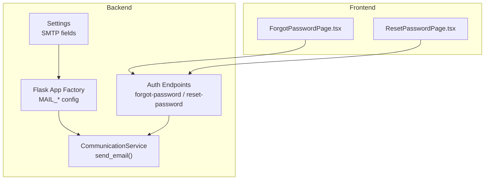
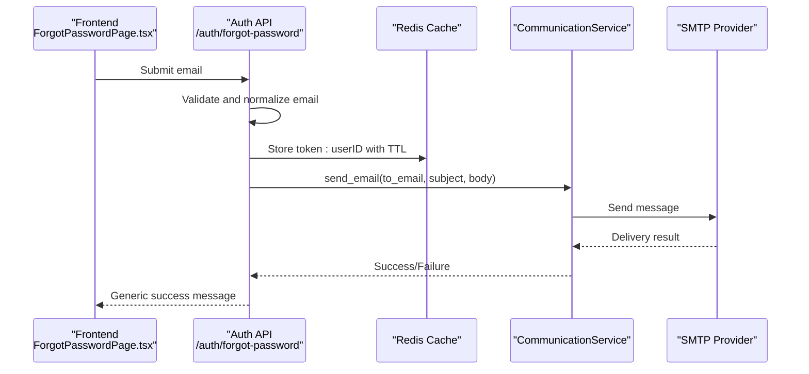
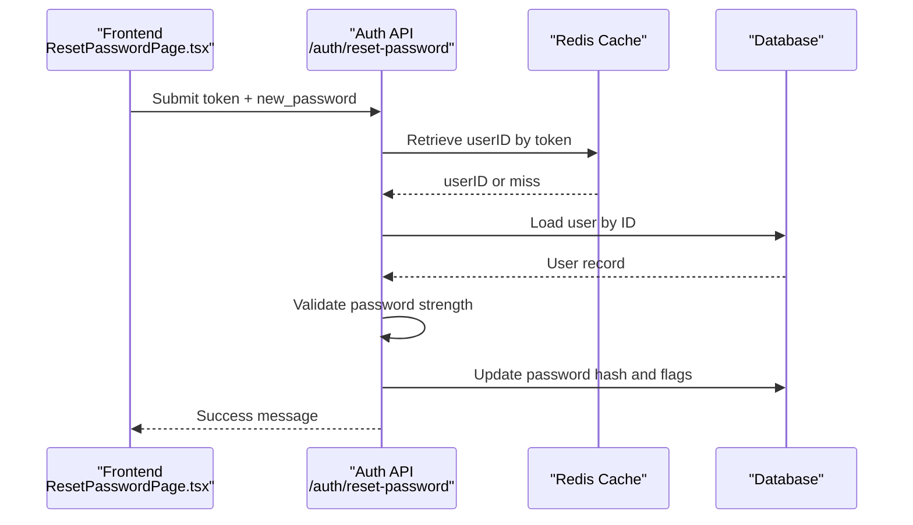
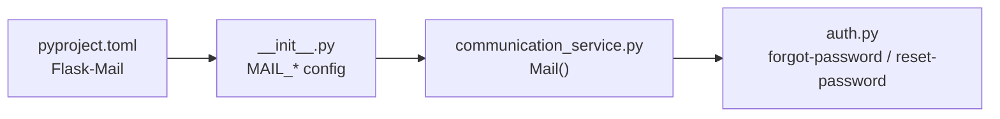

# Email & SMTP Configuration

<cite>
**Referenced Files in This Document**
- [config.py](file://backend/app/core/config.py)
- [__init__.py](file://backend/app/__init__.py)
- [communication_service.py](file://backend/app/services/communication_service.py)
- [auth.py](file://backend/app/api/v1/auth.py)
- [ForgotPasswordPage.tsx](file://frontend/src/features/auth/ForgotPasswordPage.tsx)
- [ResetPasswordPage.tsx](file://frontend/src/features/auth/ResetPasswordPage.tsx)
- [pyproject.toml](file://backend/pyproject.toml)
- [SKILL.md](file://.agent/skills/smtp-penetration-testing/SKILL.md)
</cite>

## Table of Contents
1. [Introduction](#introduction)
2. [Project Structure](#project-structure)
3. [Core Components](#core-components)
4. [Architecture Overview](#architecture-overview)
5. [Detailed Component Analysis](#detailed-component-analysis)
6. [Dependency Analysis](#dependency-analysis)
7. [Performance Considerations](#performance-considerations)
8. [Troubleshooting Guide](#troubleshooting-guide)
9. [Conclusion](#conclusion)
10. [Appendices](#appendices)

## Introduction
This document explains how email and SMTP are configured and used in the platform, focusing on:
- SMTP configuration for Gmail with App Password authentication
- Custom SMTP servers
- Password reset functionality and email delivery
- Email template system and notification delivery mechanisms
- Security considerations and troubleshooting

It consolidates backend configuration, service implementation, and frontend flows to help operators set up reliable email delivery and monitor delivery status effectively.

## Project Structure
The email and SMTP functionality spans backend configuration, a communication service, and frontend pages for password reset. The backend initializes Flask-Mail with settings from environment variables and exposes endpoints to trigger password reset emails.

**Diagram sources**
- [config.py:9-31](file://backend/app/core/config.py#L9-L31)
- [__init__.py:15-38](file://backend/app/__init__.py#L15-L38)
- [communication_service.py:10-31](file://backend/app/services/communication_service.py#L10-L31)
- [auth.py:80-163](file://backend/app/api/v1/auth.py#L80-L163)
- [ForgotPasswordPage.tsx:17-33](file://frontend/src/features/auth/ForgotPasswordPage.tsx#L17-L33)
- [ResetPasswordPage.tsx:16-54](file://frontend/src/features/auth/ResetPasswordPage.tsx#L16-L54)

**Section sources**
- [config.py:9-31](file://backend/app/core/config.py#L9-L31)
- [__init__.py:15-38](file://backend/app/__init__.py#L15-L38)
- [pyproject.toml:37-37](file://backend/pyproject.toml#L37-L37)

## Core Components
- Settings: Defines SMTP server, port, credentials, and sender address. These are loaded from environment variables.
- Flask App Factory: Translates Settings into Flask-Mail configuration keys.
- CommunicationService: Encapsulates sending emails via Flask-Mail and logs outcomes.
- Auth Endpoints: Implement password reset flow, generating a short-lived token, storing it in Redis, and sending a reset email.
- Frontend Pages: Trigger forgot-password and handle reset-password with user feedback.

Key responsibilities:
- SMTP configuration: centralized in Settings and applied in the app factory.
- Email sending: encapsulated in CommunicationService with minimal error handling.
- Password reset: generates a token, stores it in Redis with TTL, and sends a templated email.

**Section sources**
- [config.py:20-25](file://backend/app/core/config.py#L20-L25)
- [__init__.py:25-32](file://backend/app/__init__.py#L25-L32)
- [communication_service.py:10-31](file://backend/app/services/communication_service.py#L10-L31)
- [auth.py:80-163](file://backend/app/api/v1/auth.py#L80-L163)
- [ForgotPasswordPage.tsx:17-33](file://frontend/src/features/auth/ForgotPasswordPage.tsx#L17-L33)
- [ResetPasswordPage.tsx:16-54](file://frontend/src/features/auth/ResetPasswordPage.tsx#L16-L54)

## Architecture Overview
The email pipeline integrates frontend, backend, and external SMTP providers.

**Diagram sources**
- [ForgotPasswordPage.tsx:24-33](file://frontend/src/features/auth/ForgotPasswordPage.tsx#L24-L33)
- [auth.py:80-121](file://backend/app/api/v1/auth.py#L80-L121)
- [communication_service.py:12-30](file://backend/app/services/communication_service.py#L12-L30)

## Detailed Component Analysis

### SMTP Configuration and Providers
- Gmail with App Password
  - Use smtp.gmail.com on port 587 with TLS enabled.
  - Set MAIL_USERNAME to your Gmail address and MAIL_PASSWORD to an App Password generated in your Google Account.
  - Configure sender address via MAIL_DEFAULT_SENDER.
- Custom SMTP
  - Set MAIL_SERVER, MAIL_PORT, MAIL_USERNAME, MAIL_PASSWORD, and MAIL_DEFAULT_SENDER to match your provider’s SMTP settings.
  - Ensure TLS is enabled (MAIL_USE_TLS=True).
- SendGrid
  - The repository does not include a dedicated SendGrid integration module. To integrate SendGrid, you would typically:
    - Use SendGrid’s Python library or HTTP API.
    - Replace the Flask-Mail-based send_email() with a SendGrid client.
    - Manage API keys securely via environment variables.
  - This document focuses on the existing SMTP stack; SendGrid integration would require extending the communication layer accordingly.

Security considerations:
- Prefer TLS-enabled connections (port 587 or 465).
- Use least-privilege credentials (App Passwords for Gmail).
- Avoid exposing credentials in logs or client-side code.

**Section sources**
- [config.py:20-25](file://backend/app/core/config.py#L20-L25)
- [__init__.py:25-32](file://backend/app/__init__.py#L25-L32)
- [SKILL.md:489-499](file://.agent/skills/smtp-penetration-testing/SKILL.md#L489-L499)

### Password Reset Flow and Email Delivery
- Frontend triggers forgot-password with an email address.
- Backend validates the email, generates a secure token, stores it in Redis with TTL, constructs a reset URL, and sends an email via CommunicationService.
- The frontend displays a generic success message regardless of whether the email exists, preventing information leakage.

**Diagram sources**
- [ForgotPasswordPage.tsx:24-33](file://frontend/src/features/auth/ForgotPasswordPage.tsx#L24-L33)
- [auth.py:80-121](file://backend/app/api/v1/auth.py#L80-L121)
- [auth.py:123-163](file://backend/app/api/v1/auth.py#L123-L163)

**Section sources**
- [ForgotPasswordPage.tsx:17-33](file://frontend/src/features/auth/ForgotPasswordPage.tsx#L17-L33)
- [ResetPasswordPage.tsx:16-54](file://frontend/src/features/auth/ResetPasswordPage.tsx#L16-L54)
- [auth.py:80-163](file://backend/app/api/v1/auth.py#L80-L163)

### Email Template System and Notification Delivery
- The current implementation composes a plain-text email body in the auth endpoint and sends it via Flask-Mail.
- There is no dedicated HTML template engine or prebuilt templates for password reset emails in the repository snapshot.
- The platform includes a static HTML template for PDF document generation, but it is unrelated to password reset emails.

Recommendations:
- For branded, responsive reset emails, introduce a templating engine (e.g., Jinja2) and store HTML templates under a dedicated folder.
- Render subject and body from templates and pass dynamic context (brand name, reset URL).
- Centralize template rendering in CommunicationService to keep endpoints clean.

**Section sources**
- [auth.py:107-119](file://backend/app/api/v1/auth.py#L107-L119)
- [communication_service.py:12-30](file://backend/app/services/communication_service.py#L12-L30)

## Dependency Analysis
- Flask-Mail is declared as a dependency and used by CommunicationService.
- Settings drive Flask-Mail configuration in the app factory.
- Auth endpoints depend on CommunicationService and Redis for token lifecycle.

**Diagram sources**
- [pyproject.toml:37-37](file://backend/pyproject.toml#L37-L37)
- [__init__.py:25-32](file://backend/app/__init__.py#L25-L32)
- [communication_service.py:3-8](file://backend/app/services/communication_service.py#L3-L8)
- [auth.py:80-163](file://backend/app/api/v1/auth.py#L80-L163)

**Section sources**
- [pyproject.toml:37-37](file://backend/pyproject.toml#L37-L37)
- [__init__.py:25-32](file://backend/app/__init__.py#L25-L32)
- [communication_service.py:3-8](file://backend/app/services/communication_service.py#L3-L8)
- [auth.py:80-163](file://backend/app/api/v1/auth.py#L80-L163)

## Performance Considerations
- Asynchronous delivery: Flask-Mail performs synchronous SMTP operations. For high volume, consider offloading to a job queue (e.g., Redis/RQ) and background workers.
- Rate limiting: The auth endpoints already apply rate limits to prevent abuse.
- Caching: Redis is used for token storage; ensure low-latency Redis deployment near the application.

## Troubleshooting Guide
Common issues and resolutions:
- Connection refused or blocked port
  - Port 25 may be blocked by ISPs. Use 587 (with STARTTLS) or 465 (SSL). Verify with network scanning tools.
- Authentication failures
  - Confirm MAIL_USERNAME and MAIL_PASSWORD are correct. For Gmail, ensure App Password is used and 2FA is enabled.
- TLS handshake errors
  - Ensure MAIL_USE_TLS is True and the provider supports STARTTLS on the chosen port.
- Email not delivered
  - Check sender address alignment with provider domain policies. Review provider’s sending reputation and DMARC/SPF/DKIM records.
- Token expiration or invalid link
  - Tokens expire after one hour. Ensure client opens the link promptly and that Redis is reachable.

Security hardening references:
- Disable open relay, disable user enumeration commands, enforce TLS, implement SPF/DKIM/DMARC, and apply rate limiting.

**Section sources**
- [SKILL.md:478-499](file://.agent/skills/smtp-penetration-testing/SKILL.md#L478-L499)
- [auth.py:103-104](file://backend/app/api/v1/auth.py#L103-L104)

## Conclusion
The platform provides a straightforward SMTP-based email system with a clear separation of concerns:
- Settings define SMTP parameters.
- The app factory configures Flask-Mail.
- CommunicationService encapsulates sending logic.
- Auth endpoints orchestrate password reset tokens and emails.

To expand capabilities, consider adding:
- Dedicated HTML templates and a templating engine.
- A SendGrid integration module for API-based delivery.
- Background jobs for asynchronous email processing.
- Enhanced delivery monitoring and retry logic.

## Appendices

### Setup Instructions by Provider

- Gmail (App Password)
  - Enable 2-Factor Authentication on your Google account.
  - Generate an App Password for “Mail”.
  - Set:
    - MAIL_SERVER=smtp.gmail.com
    - MAIL_PORT=587
    - MAIL_USE_TLS=True
    - MAIL_USERNAME=your.email@gmail.com
    - MAIL_PASSWORD=your-gmail-app-password
    - MAIL_DEFAULT_SENDER=your.email@gmail.com
  - Ensure sender address matches MAIL_USERNAME.

- Custom SMTP
  - Set:
    - MAIL_SERVER=your.smtp.server
    - MAIL_PORT=587
    - MAIL_USE_TLS=True
    - MAIL_USERNAME=your-smtp-user
    - MAIL_PASSWORD=your-smtp-password
    - MAIL_DEFAULT_SENDER=notifications@yourdomain.com

- SendGrid (API-based)
  - Install the SendGrid Python library and configure credentials via environment variables.
  - Replace Flask-Mail usage in CommunicationService with SendGrid client.
  - Manage API keys securely and rotate periodically.

### Security Considerations
- Use App Passwords for Gmail; avoid using your primary password.
- Store SMTP credentials and API keys in environment variables only.
- Monitor provider-side sending limits and adjust retry/backoff policies.
- Harden SMTP servers against enumeration and open relay as outlined in the penetration testing guide.

### Testing Procedures
- Unit/integration tests
  - Mock Flask-Mail and Redis to validate token creation, email composition, and delivery outcomes.
- End-to-end tests
  - Use a sandbox SMTP server or provider sandbox to verify end-to-end flows without real deliveries.
- Manual verification
  - Send test emails to personal addresses and confirm receipt in inbox and spam folders.

### Monitoring Email Delivery Status
- Logging
  - Inspect application logs for success and failure messages emitted by CommunicationService.
- Delivery metrics
  - Track Redis TTL usage for tokens and retry counts for failed sends.
- Provider dashboards
  - Use provider analytics to monitor bounces, blocks, and deliverability trends.