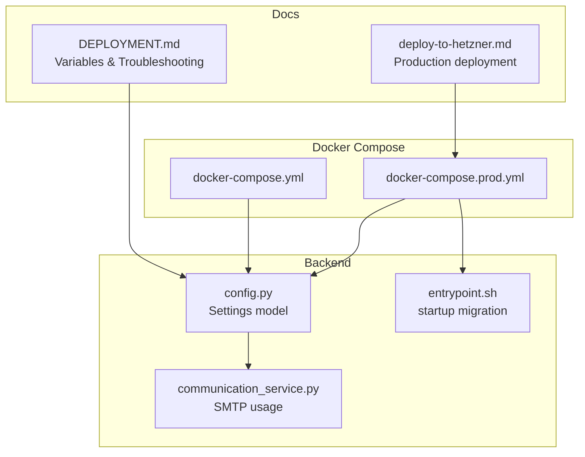
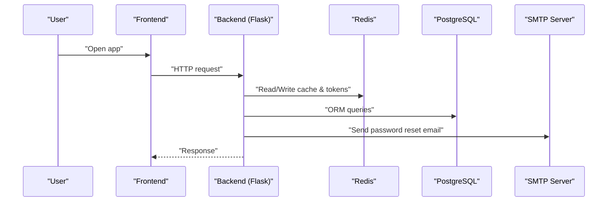
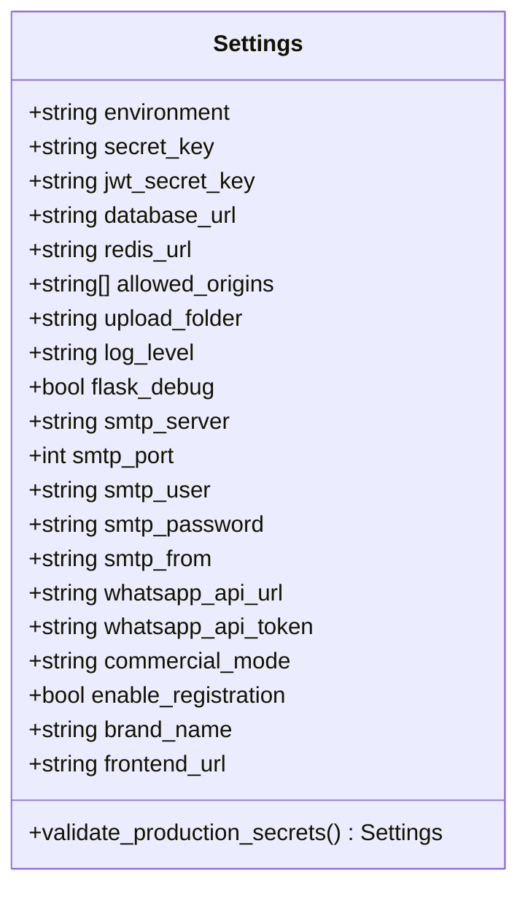
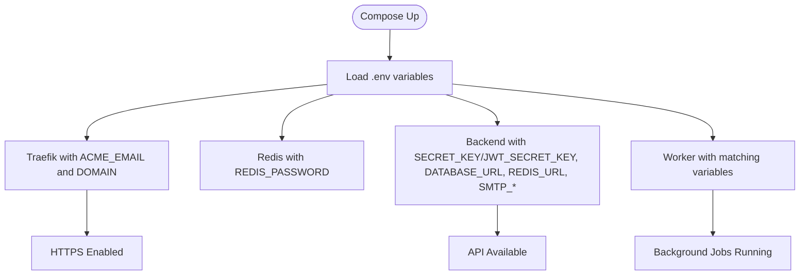
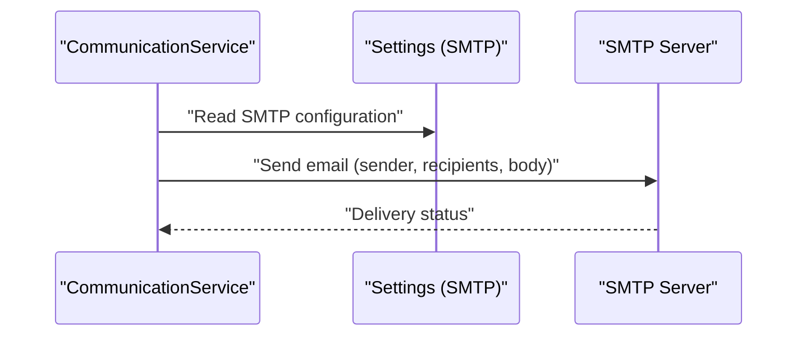
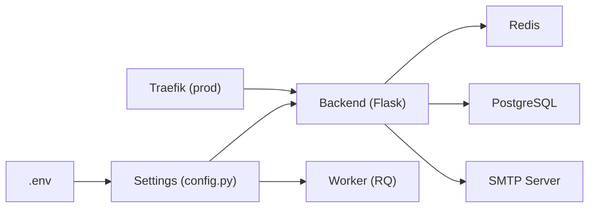

# Environment Configuration

<cite>
**Referenced Files in This Document**
- [config.py](file://backend/app/core/config.py)
- [docker-compose.yml](file://docker-compose.yml)
- [docker-compose.prod.yml](file://docker-compose.prod.yml)
- [DEPLOYMENT.md](file://docs/DEPLOYMENT.md)
- [deploy-to-hetzner.md](file://deploy-to-hetzner.md)
- [communication_service.py](file://backend/app/services/communication_service.py)
- [entrypoint.sh](file://backend/entrypoint.sh)
- [pyproject.toml](file://backend/pyproject.toml)
</cite>

## Table of Contents
1. [Introduction](#introduction)
2. [Project Structure](#project-structure)
3. [Core Components](#core-components)
4. [Architecture Overview](#architecture-overview)
5. [Detailed Component Analysis](#detailed-component-analysis)
6. [Dependency Analysis](#dependency-analysis)
7. [Performance Considerations](#performance-considerations)
8. [Troubleshooting Guide](#troubleshooting-guide)
9. [Conclusion](#conclusion)

## Introduction
This document provides comprehensive guidance for configuring environment variables and system setup for the ColaboraEdu platform. It covers required and optional environment variables across infrastructure, database, Redis, Flask application, SMTP email services, and optional WhatsApp integration. It also includes configuration examples for popular email providers, security best practices for generating strong secrets, validation steps, and troubleshooting tips tailored to the provided Docker Compose configurations.

## Project Structure
The environment configuration spans several key areas:
- Application configuration model defines environment variables consumed by the Flask backend
- Docker Compose files define required environment variables for production and development
- Deployment documentation enumerates required variables and validation steps
- Communication service consumes SMTP settings to send emails

**Diagram sources**
- [docker-compose.yml:1-103](file://docker-compose.yml#L1-L103)
- [docker-compose.prod.yml:1-173](file://docker-compose.prod.yml#L1-L173)
- [config.py:9-60](file://backend/app/core/config.py#L9-L60)
- [communication_service.py:1-60](file://backend/app/services/communication_service.py#L1-L60)
- [entrypoint.sh:1-21](file://backend/entrypoint.sh#L1-L21)
- [DEPLOYMENT.md:148-202](file://docs/DEPLOYMENT.md#L148-L202)
- [deploy-to-hetzner.md:1-93](file://deploy-to-hetzner.md#L1-L93)

**Section sources**
- [docker-compose.yml:1-103](file://docker-compose.yml#L1-L103)
- [docker-compose.prod.yml:1-173](file://docker-compose.prod.yml#L1-L173)
- [config.py:9-60](file://backend/app/core/config.py#L9-L60)
- [DEPLOYMENT.md:148-202](file://docs/DEPLOYMENT.md#L148-L202)

## Core Components
This section enumerates all environment variables used by the system, categorized by domain, with their purpose and requirements.

- Infrastructure and Traefik
  - DOMAIN: Public domain without scheme (required in production)
  - ACME_EMAIL: Email for Let's Encrypt certificate (required in production)
  - ALLOWED_ORIGINS: JSON array of CORS origins (optional; defaults to ["https://{DOMAIN}"] in production)
  - FRONTEND_URL: Public frontend URL (optional; defaults to "https://{DOMAIN}" in production)
  - BRAND_NAME: Platform branding (optional; defaults to "ColaboraEdu")

- Database (PostgreSQL)
  - POSTGRES_USER: Database user (required)
  - POSTGRES_PASSWORD: Database password (required)
  - POSTGRES_DB: Database name (required)

- Redis
  - REDIS_PASSWORD: Redis password (required; used to bind Redis with requirepass)

- Flask Application
  - FLASK_ENV: Environment mode (required; "production" or "development")
  - SECRET_KEY: Flask secret key (required; minimum length enforced in production)
  - JWT_SECRET_KEY: JWT secret key (required; minimum length enforced in production)
  - LOG_LEVEL: Logging level (optional; defaults to INFO)
  - FLASK_DEBUG: Debug flag (optional; defaults to False)
  - UPLOAD_FOLDER: Upload storage path (optional; defaults to "../data/uploads")

- SMTP (Email)
  - SMTP_SERVER: SMTP server hostname (required for password reset)
  - SMTP_PORT: SMTP port (required; default 587)
  - SMTP_USER: SMTP username (required)
  - SMTP_PASSWORD: SMTP password (required)
  - SMTP_FROM: Sender address used in emails (required)

- Optional WhatsApp Integration
  - WHATSAPP_API_URL: Evolution API base URL (optional)
  - WHATSAPP_API_TOKEN: API token for Evolution API (optional)

- Additional Optional Settings
  - ENABLE_REGISTRATION: Whether registration is enabled (optional)
  - COMMERCIAL_MODE: "saas" or "dedicated" (optional)

Notes:
- The Settings model loads variables from a .env file and enforces minimum length for SECRET_KEY and JWT_SECRET_KEY in production.
- The production Docker Compose sets FLASK_ENV to "production" and passes required variables to backend and worker services.

**Section sources**
- [config.py:9-51](file://backend/app/core/config.py#L9-L51)
- [docker-compose.prod.yml:61-81](file://docker-compose.prod.yml#L61-L81)
- [docker-compose.yml:28-34](file://docker-compose.yml#L28-L34)
- [DEPLOYMENT.md:148-202](file://docs/DEPLOYMENT.md#L148-L202)

## Architecture Overview
The environment configuration integrates across services and layers:

**Diagram sources**
- [docker-compose.prod.yml:56-142](file://docker-compose.prod.yml#L56-L142)
- [config.py:9-51](file://backend/app/core/config.py#L9-L51)
- [communication_service.py:10-30](file://backend/app/services/communication_service.py#L10-L30)

## Detailed Component Analysis

### Environment Variable Model and Validation
The Settings class centralizes configuration loading and validation:
- Loads from .env with case-insensitive aliases mapped to environment variable names
- Enforces production security for SECRET_KEY and JWT_SECRET_KEY
- Provides defaults for development-friendly values

**Diagram sources**
- [config.py:9-51](file://backend/app/core/config.py#L9-L51)

**Section sources**
- [config.py:9-51](file://backend/app/core/config.py#L9-L51)

### Production Docker Compose Variables
Production variables are defined in docker-compose.prod.yml:
- Traefik: DOMAIN and ACME_EMAIL for TLS certificates
- Redis: REDIS_PASSWORD passed to Redis server and used in REDIS_URL
- Backend: FLASK_ENV, SECRET_KEY, JWT_SECRET_KEY, DATABASE_URL, REDIS_URL, SMTP_* variables, FRONTEND_URL, BRAND_NAME, ALLOWED_ORIGINS, WHATSAPP_* variables
- Worker: mirrors backend variables for background processing

**Diagram sources**
- [docker-compose.prod.yml:1-173](file://docker-compose.prod.yml#L1-L173)

**Section sources**
- [docker-compose.prod.yml:1-173](file://docker-compose.prod.yml#L1-L173)

### Development Docker Compose Variables
Development variables are defined in docker-compose.yml:
- Uses local Redis and PostgreSQL without passwords
- Sets FLASK_DEBUG and default CORS origins
- Mounts data volume for uploads

**Section sources**
- [docker-compose.yml:1-103](file://docker-compose.yml#L1-L103)

### SMTP Configuration and Email Sending
The communication service uses SMTP settings to send emails:
- Requires SMTP_SERVER, SMTP_PORT, SMTP_USER, SMTP_PASSWORD, SMTP_FROM
- Sends password reset emails and notifications

**Diagram sources**
- [communication_service.py:10-30](file://backend/app/services/communication_service.py#L10-L30)
- [config.py:20-25](file://backend/app/core/config.py#L20-L25)

**Section sources**
- [communication_service.py:10-30](file://backend/app/services/communication_service.py#L10-L30)
- [config.py:20-25](file://backend/app/core/config.py#L20-L25)

### WhatsApp Integration (Optional)
WhatsApp integration is optional and uses external API settings:
- WHATSAPP_API_URL and WHATSAPP_API_TOKEN are read from settings
- The service cleans phone numbers and posts to the configured endpoint

**Section sources**
- [config.py:27-29](file://backend/app/core/config.py#L27-L29)
- [communication_service.py:32-60](file://backend/app/services/communication_service.py#L32-L60)

## Dependency Analysis
Environment variables propagate through the system as follows:

**Diagram sources**
- [config.py:9-51](file://backend/app/core/config.py#L9-L51)
- [docker-compose.prod.yml:56-142](file://docker-compose.prod.yml#L56-L142)

**Section sources**
- [config.py:9-51](file://backend/app/core/config.py#L9-L51)
- [docker-compose.prod.yml:56-142](file://docker-compose.prod.yml#L56-L142)

## Performance Considerations
- Use production-grade secrets (minimum 32 characters) to avoid validation overhead and security risks
- Ensure Redis and PostgreSQL are reachable and healthy before starting services
- Configure CORS origins narrowly to reduce cross-origin request overhead
- Use HTTPS in production to avoid mixed-content issues and improve trust

## Troubleshooting Guide

### Common Configuration Errors and Fixes
- Production secrets too short or unset
  - Symptom: Startup validation error for SECRET_KEY or JWT_SECRET_KEY
  - Fix: Generate strong secrets (minimum 32 characters) and set in .env
  - Reference: [config.py:44-51](file://backend/app/core/config.py#L44-L51)

- Missing SMTP configuration
  - Symptom: Password reset emails fail
  - Fix: Set SMTP_SERVER, SMTP_PORT, SMTP_USER, SMTP_PASSWORD, SMTP_FROM
  - Reference: [config.py:20-25](file://backend/app/core/config.py#L20-L25), [communication_service.py:10-30](file://backend/app/services/communication_service.py#L10-L30)

- Redis connectivity issues
  - Symptom: Backend returns 401 or Redis errors
  - Fix: Confirm REDIS_PASSWORD matches server requirepass and REDIS_URL includes password
  - Reference: [docker-compose.prod.yml:42-54](file://docker-compose.prod.yml#L42-L54), [docker-compose.prod.yml:68-68](file://docker-compose.prod.yml#L68-L68)

- Database connection failures
  - Symptom: Health checks fail or migrations cannot run
  - Fix: Verify POSTGRES_USER, POSTGRES_PASSWORD, POSTGRES_DB and DATABASE_URL
  - Reference: [docker-compose.prod.yml:25-40](file://docker-compose.prod.yml#L25-L40), [docker-compose.prod.yml:67-67](file://docker-compose.prod.yml#L67-L67)

- Domain and TLS issues
  - Symptom: HTTPS not working or certificate errors
  - Fix: Ensure DOMAIN points to server IP and ACME_EMAIL is valid
  - Reference: [docker-compose.prod.yml:2-15](file://docker-compose.prod.yml#L2-L15), [deploy-to-hetzner.md:46-56](file://deploy-to-hetzner.md#L46-L56)

- CORS and frontend issues
  - Symptom: Frontend blocked by CORS
  - Fix: Set ALLOWED_ORIGINS to include frontend URL
  - Reference: [docker-compose.prod.yml:69-69](file://docker-compose.prod.yml#L69-L69), [config.py:15-15](file://backend/app/core/config.py#L15-L15)

### Validation Steps
- Verify environment variables are loaded:
  - Production: Check backend logs for successful startup and validation
  - Reference: [entrypoint.sh:13-13](file://backend/entrypoint.sh#L13-L13)
- Test SMTP:
  - Use the shell command from deployment guide to inspect settings
  - Reference: [DEPLOYMENT.md:269-275](file://docs/DEPLOYMENT.md#L269-L275)
- Health checks:
  - Use curl to verify HTTPS and API health endpoints
  - Reference: [DEPLOYMENT.md:315-316](file://docs/DEPLOYMENT.md#L315-L316)

**Section sources**
- [config.py:44-51](file://backend/app/core/config.py#L44-L51)
- [docker-compose.prod.yml:2-15](file://docker-compose.prod.yml#L2-L15)
- [docker-compose.prod.yml:25-40](file://docker-compose.prod.yml#L25-L40)
- [docker-compose.prod.yml:42-54](file://docker-compose.prod.yml#L42-L54)
- [docker-compose.prod.yml:67-69](file://docker-compose.prod.yml#L67-L69)
- [entrypoint.sh:13-13](file://backend/entrypoint.sh#L13-L13)
- [DEPLOYMENT.md:269-275](file://docs/DEPLOYMENT.md#L269-L275)
- [DEPLOYMENT.md:315-316](file://docs/DEPLOYMENT.md#L315-L316)

## Conclusion
This guide consolidates all environment variables and configuration requirements for ColaboraEdu across development and production. By following the documented categories, examples, and validation steps, you can confidently set up secure and reliable environments. Ensure secrets meet production requirements, verify connectivity to Redis and PostgreSQL, and test SMTP and HTTPS before going live.