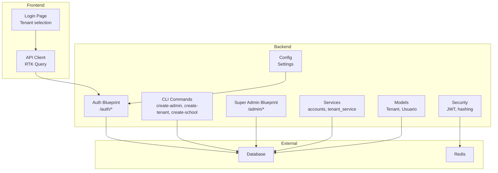
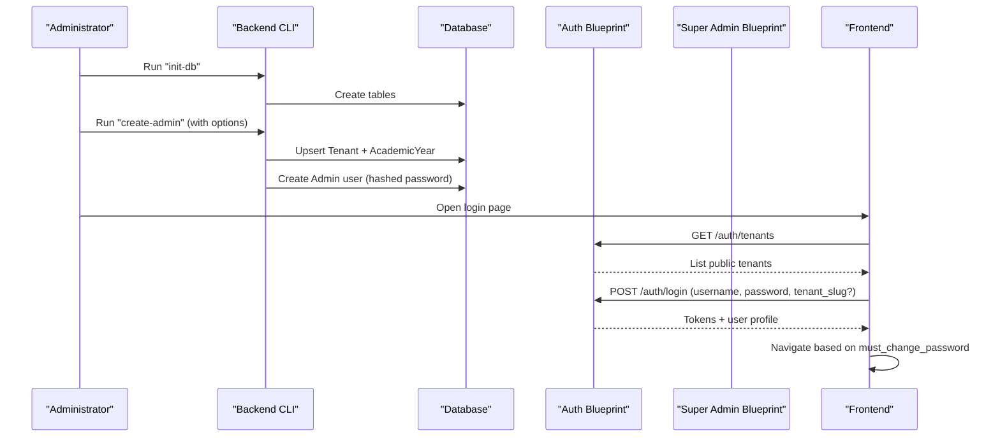
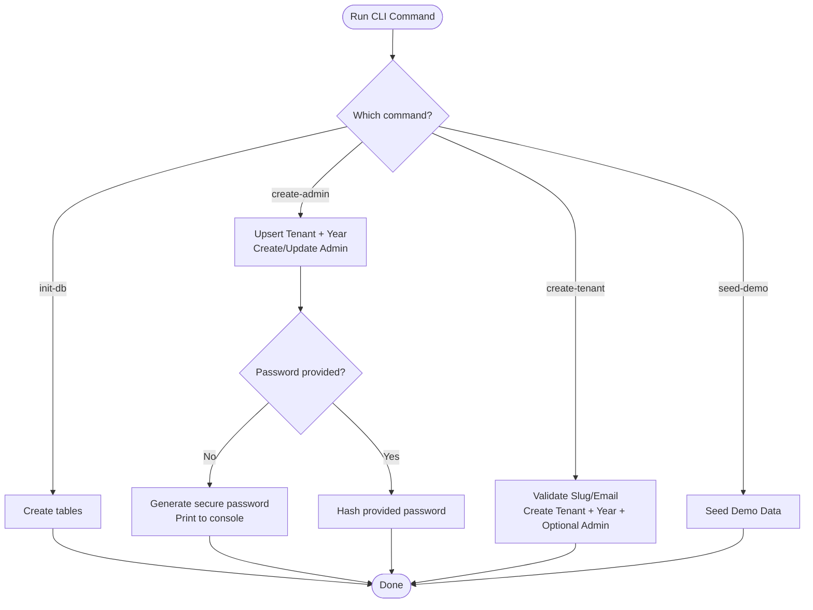
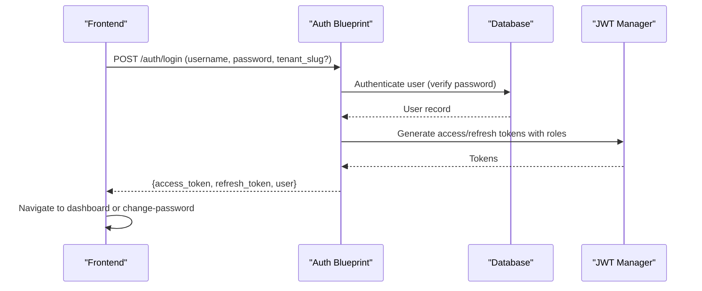
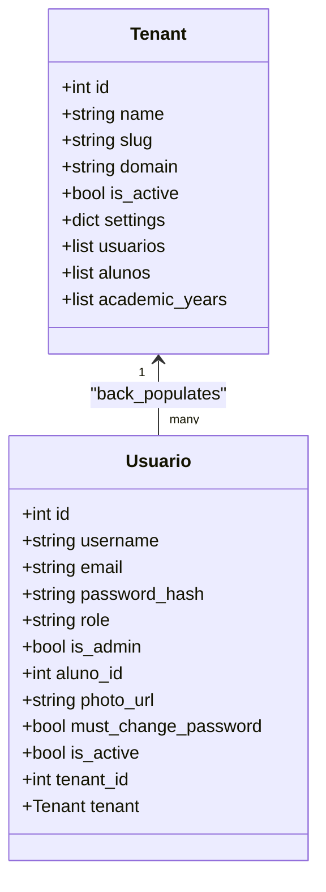
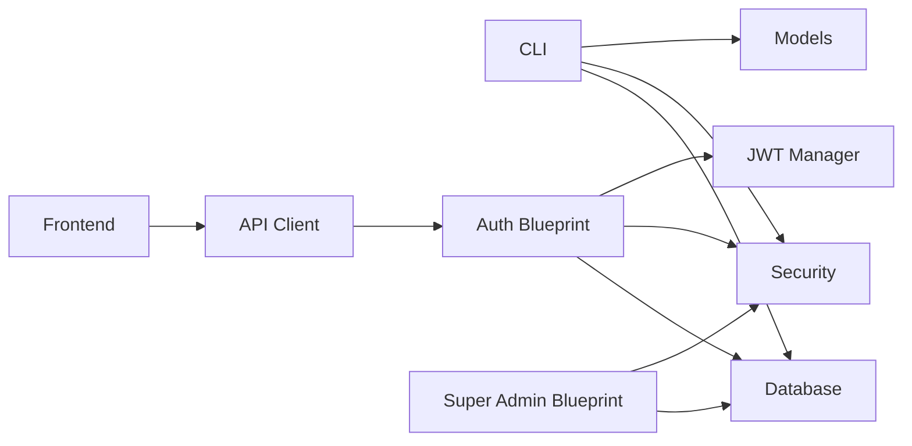

# Initial System Setup

<cite>
**Referenced Files in This Document**
- [backend/app/cli.py](file://backend/app/cli.py)
- [backend/app/api/v1/super_admin.py](file://backend/app/api/v1/super_admin.py)
- [backend/app/api/v1/auth.py](file://backend/app/api/v1/auth.py)
- [backend/app/models/tenant.py](file://backend/app/models/tenant.py)
- [backend/app/models/usuario.py](file://backend/app/models/usuario.py)
- [backend/app/services/accounts.py](file://backend/app/services/accounts.py)
- [backend/app/services/tenant_service.py](file://backend/app/services/tenant_service.py)
- [backend/app/core/security.py](file://backend/app/core/security.py)
- [backend/app/core/config.py](file://backend/app/core/config.py)
- [backend/README.md](file://backend/README.md)
- [README.md](file://README.md)
- [frontend/src/features/auth/LoginPage.tsx](file://frontend/src/features/auth/LoginPage.tsx)
- [frontend/src/lib/api.ts](file://frontend/src/lib/api.ts)
</cite>

## Table of Contents
1. [Introduction](#introduction)
2. [Project Structure](#project-structure)
3. [Core Components](#core-components)
4. [Architecture Overview](#architecture-overview)
5. [Detailed Component Analysis](#detailed-component-analysis)
6. [Dependency Analysis](#dependency-analysis)
7. [Performance Considerations](#performance-considerations)
8. [Troubleshooting Guide](#troubleshooting-guide)
9. [Conclusion](#conclusion)
10. [Appendices](#appendices)

## Introduction
This document provides a comprehensive guide for initializing the system and completing administrative setup. It covers creating the first super-admin user, establishing the initial school tenant, and setting up school administrators. It also documents the command-line interface tools for system initialization, including the create-admin, create-tenant, and create-school commands, along with step-by-step instructions for the initial login process, post-installation verification, and basic system configuration. Examples of CLI commands with various parameter combinations, security considerations for initial admin credentials, and verification steps are included to ensure proper system initialization.

## Project Structure
The system consists of:
- Backend Flask application exposing REST APIs and CLI commands for initialization and maintenance.
- Frontend React application that authenticates against the backend and lists available tenants.
- Multi-tenant architecture supporting multiple schools with isolated data.

**Diagram sources**
- [backend/app/cli.py:28-212](file://backend/app/cli.py#L28-L212)
- [backend/app/api/v1/auth.py:15-166](file://backend/app/api/v1/auth.py#L15-L166)
- [backend/app/api/v1/super_admin.py:8-166](file://backend/app/api/v1/super_admin.py#L8-L166)
- [backend/app/models/tenant.py:7-22](file://backend/app/models/tenant.py#L7-L22)
- [backend/app/models/usuario.py:8-30](file://backend/app/models/usuario.py#L8-L30)
- [backend/app/services/accounts.py:29-58](file://backend/app/services/accounts.py#L29-L58)
- [backend/app/services/tenant_service.py:11-22](file://backend/app/services/tenant_service.py#L11-L22)
- [backend/app/core/security.py:23-35](file://backend/app/core/security.py#L23-L35)
- [backend/app/core/config.py:9-60](file://backend/app/core/config.py#L9-L60)
- [frontend/src/features/auth/LoginPage.tsx:31-164](file://frontend/src/features/auth/LoginPage.tsx#L31-L164)
- [frontend/src/lib/api.ts:414-423](file://frontend/src/lib/api.ts#L414-L423)

**Section sources**
- [README.md:86-133](file://README.md#L86-L133)
- [backend/README.md:11-21](file://backend/README.md#L11-L21)

## Core Components
- CLI initialization commands:
  - create-admin: Creates an admin user and ensures a default tenant/year exist.
  - create-tenant: Creates a new tenant and optional admin user.
  - create-school: Alias for create-tenant.
  - init-db: Initializes database schema.
  - seed-demo: Seeds demo data including a default tenant and academic year.
- Authentication and authorization:
  - JWT-based login with refresh token support.
  - Role-based access control including super_admin and admin roles.
- Multi-tenancy:
  - Tenant model with slug/domain isolation.
  - Tenant resolution by host or slug fallback.
- User provisioning:
  - Automatic creation of student users linked to academic records.

**Section sources**
- [backend/app/cli.py:28-212](file://backend/app/cli.py#L28-L212)
- [backend/app/api/v1/auth.py:27-61](file://backend/app/api/v1/auth.py#L27-L61)
- [backend/app/api/v1/super_admin.py:41-110](file://backend/app/api/v1/super_admin.py#L41-L110)
- [backend/app/models/tenant.py:7-22](file://backend/app/models/tenant.py#L7-L22)
- [backend/app/models/usuario.py:8-30](file://backend/app/models/usuario.py#L8-L30)
- [backend/app/services/accounts.py:29-58](file://backend/app/services/accounts.py#L29-L58)
- [backend/app/services/tenant_service.py:11-22](file://backend/app/services/tenant_service.py#L11-L22)
- [backend/app/core/security.py:23-35](file://backend/app/core/security.py#L23-L35)

## Architecture Overview
The initialization flow integrates CLI commands, authentication endpoints, and tenant management. The frontend supports tenant selection and login.

**Diagram sources**
- [backend/app/cli.py:29-177](file://backend/app/cli.py#L29-L177)
- [backend/app/api/v1/auth.py:18-42](file://backend/app/api/v1/auth.py#L18-L42)
- [backend/app/api/v1/super_admin.py:22-110](file://backend/app/api/v1/super_admin.py#L22-L110)
- [frontend/src/features/auth/LoginPage.tsx:106-127](file://frontend/src/features/auth/LoginPage.tsx#L106-L127)

## Detailed Component Analysis

### CLI Initialization Commands
- init-db
  - Purpose: Create database tables using SQLAlchemy metadata.
  - Behavior: Creates all tables defined in the metadata.
  - Typical usage: After migrating schema, initialize tables.
- create-admin
  - Purpose: Create an admin user and ensure a default tenant/year exist.
  - Options:
    - --username: Admin username (default: admin).
    - --password: Admin password (auto-generated if omitted).
    - --tenant-slug: Target tenant slug (default: default).
    - --tenant-name: Tenant display name (default: Escola ColaboraEdu).
  - Behavior:
    - Ensures tenant exists (creates if missing).
    - Ensures current academic year exists (creates if missing).
    - Creates or updates admin user with hashed password and must_change_password flag.
    - Auto-generated passwords are printed securely.
- create-tenant (alias: create-school)
  - Purpose: Create a new tenant and optional admin user.
  - Options:
    - --name: Tenant display name.
    - --slug: Unique tenant slug.
    - --domain: Optional domain for multi-tenancy routing.
    - --admin-email: Optional admin email.
    - --admin-password: Optional admin password.
  - Behavior:
    - Validates uniqueness of slug and admin email.
    - Creates tenant, current academic year, and optionally admin user.
    - Returns tenant ID on success.
- seed-demo
  - Purpose: Populate database with demo data for local development.
  - Behavior:
    - Creates default tenant and academic year if missing.
    - Seeds students, enrollments, and sample grades.
    - Also seeds admin/admin credentials for demo login.

**Diagram sources**
- [backend/app/cli.py:29-177](file://backend/app/cli.py#L29-L177)

**Section sources**
- [backend/app/cli.py:28-212](file://backend/app/cli.py#L28-L212)

### Authentication and Authorization
- Login endpoint (/auth/login)
  - Accepts username, password, and optional tenant_slug.
  - Returns access_token, refresh_token, and user profile including must_change_password.
- Refresh token (/auth/refresh)
  - Uses JWT claims to regenerate tokens with the same roles and tenant context.
- Password reset flow
  - Forgot password generates a time-limited token stored in Redis.
  - Reset password validates token and updates user’s password.
- Role-based access control
  - Super admin endpoints under /admin require "super_admin" role.
  - Admin endpoints require "admin" role.

**Diagram sources**
- [backend/app/api/v1/auth.py:27-61](file://backend/app/api/v1/auth.py#L27-L61)
- [backend/app/core/security.py:23-35](file://backend/app/core/security.py#L23-L35)

**Section sources**
- [backend/app/api/v1/auth.py:18-166](file://backend/app/api/v1/auth.py#L18-L166)
- [backend/app/core/security.py:15-62](file://backend/app/core/security.py#L15-L62)

### Multi-Tenant Management
- Tenant model
  - Fields: name, slug (unique), domain (unique), is_active, settings.
  - Relationships: usuarios, alunos, academic_years.
- Tenant resolution
  - Resolve by host domain or fallback to default tenant.
- Super admin tenant endpoints
  - List/create/update/delete tenants.
  - Add academic years with optional current flag.

**Diagram sources**
- [backend/app/models/tenant.py:7-22](file://backend/app/models/tenant.py#L7-L22)
- [backend/app/models/usuario.py:8-30](file://backend/app/models/usuario.py#L8-L30)

**Section sources**
- [backend/app/models/tenant.py:7-22](file://backend/app/models/tenant.py#L7-L22)
- [backend/app/models/usuario.py:8-30](file://backend/app/models/usuario.py#L8-L30)
- [backend/app/services/tenant_service.py:11-22](file://backend/app/services/tenant_service.py#L11-L22)
- [backend/app/api/v1/super_admin.py:41-110](file://backend/app/api/v1/super_admin.py#L41-L110)

### Student User Provisioning
- Automatic student account creation
  - Builds username from student name and registration number.
  - Creates user with must_change_password flag and links to tenant.
  - Ensures uniqueness across academic years.

**Section sources**
- [backend/app/services/accounts.py:29-58](file://backend/app/services/accounts.py#L29-L58)

## Dependency Analysis
- CLI depends on:
  - Database engine and session_scope for schema creation and data writes.
  - Security module for password hashing.
  - Models for Tenant, AcademicYear, and Usuario.
- Auth blueprint depends on:
  - JWT manager for token generation/refresh.
  - User service for authentication logic.
  - Redis for token blocklist and password reset tokens.
- Super admin blueprint depends on:
  - Tenant and AcademicYear models.
  - Security module for password hashing.
- Frontend depends on:
  - API client for login and tenant listing.
  - Stores tenant and academic year context via headers.

**Diagram sources**
- [backend/app/cli.py:8-11](file://backend/app/cli.py#L8-L11)
- [backend/app/api/v1/auth.py:9-12](file://backend/app/api/v1/auth.py#L9-L12)
- [backend/app/api/v1/super_admin.py:3-6](file://backend/app/api/v1/super_admin.py#L3-L6)
- [backend/app/core/security.py:5-12](file://backend/app/core/security.py#L5-L12)
- [frontend/src/lib/api.ts:336-357](file://frontend/src/lib/api.ts#L336-L357)

**Section sources**
- [backend/app/cli.py:8-11](file://backend/app/cli.py#L8-L11)
- [backend/app/api/v1/auth.py:9-12](file://backend/app/api/v1/auth.py#L9-L12)
- [backend/app/api/v1/super_admin.py:3-6](file://backend/app/api/v1/super_admin.py#L3-L6)
- [backend/app/core/security.py:5-12](file://backend/app/core/security.py#L5-L12)
- [frontend/src/lib/api.ts:336-357](file://frontend/src/lib/api.ts#L336-L357)

## Performance Considerations
- Token refresh is lightweight and uses cached claims; avoid excessive refresh calls.
- Tenant resolution prefers domain lookup and falls back to slug; ensure DNS/domain configuration for production.
- Password hashing uses bcrypt; consider CPU/memory cost tuning in production settings.
- Redis blocklist and reset tokens improve security and reduce repeated checks.

[No sources needed since this section provides general guidance]

## Troubleshooting Guide
- Cannot log in after initialization
  - Verify tenant_slug is correct; frontend lists available tenants.
  - Check must_change_password flag; user may be redirected to change-password on first login.
- Admin credentials not working
  - Confirm the create-admin command executed successfully and note any auto-generated password.
  - Ensure database tables are initialized (init-db).
- Tenant not appearing in login
  - Use create-tenant to create the tenant and confirm slug/domain.
  - Ensure tenant is_active is true.
- Password reset not received
  - Verify SMTP settings and Redis availability.
  - Check that the email address is registered and active.

**Section sources**
- [backend/app/api/v1/auth.py:80-121](file://backend/app/api/v1/auth.py#L80-L121)
- [backend/app/api/v1/auth.py:123-163](file://backend/app/api/v1/auth.py#L123-L163)
- [frontend/src/features/auth/LoginPage.tsx:106-127](file://frontend/src/features/auth/LoginPage.tsx#L106-L127)
- [backend/app/cli.py:104-177](file://backend/app/cli.py#L104-L177)

## Conclusion
The system provides robust CLI tools for initial setup, secure authentication with role-based access control, and multi-tenant support. By following the documented steps—initializing the database, creating the admin user, and configuring tenants—you can establish a secure and functional platform. Use the verification steps and troubleshooting tips to ensure a smooth deployment.

[No sources needed since this section summarizes without analyzing specific files]

## Appendices

### Step-by-Step Initial Setup Instructions
- Initialize the database
  - Run the initialization command to create tables.
- Create the first admin user
  - Use the create-admin command with desired username and password options.
  - If no password is provided, a secure random password is generated and printed.
- Create the initial school tenant
  - Use the create-tenant command with name, slug, and optional admin credentials.
  - Alternatively, use the create-school alias.
- Configure academic year
  - The system creates the current academic year automatically when creating a tenant.
- Initial login
  - Open the frontend login page.
  - Select the appropriate tenant from the list and enter credentials.
  - If must_change_password is true, change the password immediately.
- Post-installation verification
  - Confirm that the tenant appears in the tenant list.
  - Verify that the admin user can access protected endpoints.
  - Test password reset flow if applicable.

**Section sources**
- [README.md:103-110](file://README.md#L103-L110)
- [backend/app/cli.py:29-177](file://backend/app/cli.py#L29-L177)
- [backend/app/api/v1/auth.py:18-42](file://backend/app/api/v1/auth.py#L18-L42)
- [frontend/src/features/auth/LoginPage.tsx:106-127](file://frontend/src/features/auth/LoginPage.tsx#L106-L127)

### CLI Command Examples
- Initialize database
  - flask --app app init-db
- Create default admin user
  - flask --app app create-admin
  - flask --app app create-admin --username admin --password MySecurePass123
- Create tenant with admin
  - flask --app app create-tenant --name "Escola Exemplo" --slug "exemplo" --admin-email admin@exemplo.edu --admin-password SecurePass456
- Create tenant alias
  - flask --app app create-school --name "Escola Nova" --slug "nova-escola" --domain "nova-escola.app.com"

**Section sources**
- [README.md:238-259](file://README.md#L238-L259)
- [backend/app/cli.py:132-177](file://backend/app/cli.py#L132-L177)

### Security Considerations for Initial Admin Credentials
- Always specify a strong password for the admin user; avoid defaults in production.
- If using auto-generated passwords, store them securely and rotate promptly.
- Ensure SECRET_KEY and JWT_SECRET_KEY meet production requirements.
- Configure SMTP and Redis for password reset and token management.
- Enforce must_change_password for new admin users to mitigate risks.

**Section sources**
- [backend/app/cli.py:104-177](file://backend/app/cli.py#L104-L177)
- [backend/app/core/config.py:44-51](file://backend/app/core/config.py#L44-L51)
- [backend/app/api/v1/auth.py:80-121](file://backend/app/api/v1/auth.py#L80-L121)

### Verification Steps
- Confirm database initialization
  - Check that tables exist after running init-db.
- Confirm admin user creation
  - Verify the admin user exists with hashed password and admin role.
- Confirm tenant creation
  - Verify tenant exists with unique slug/domain and current academic year.
- Test login flow
  - Log in via frontend with correct tenant_slug and credentials.
  - Ensure redirection to dashboard or change-password as expected.

**Section sources**
- [backend/app/cli.py:29-177](file://backend/app/cli.py#L29-L177)
- [backend/app/api/v1/auth.py:27-42](file://backend/app/api/v1/auth.py#L27-L42)
- [frontend/src/lib/api.ts:421-423](file://frontend/src/lib/api.ts#L421-L423)