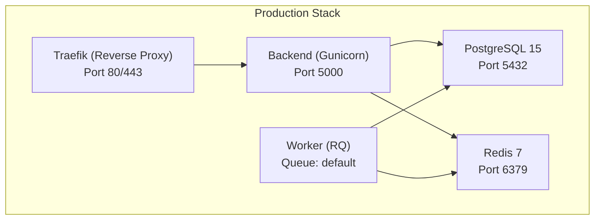
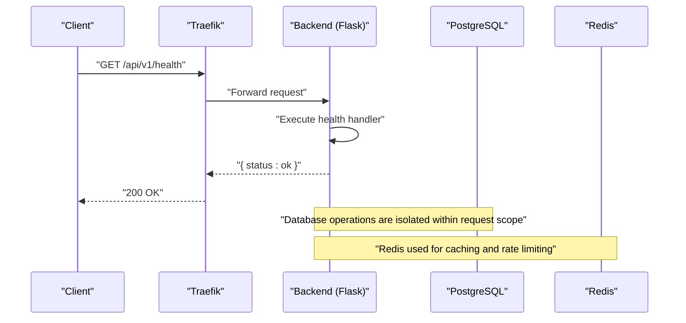
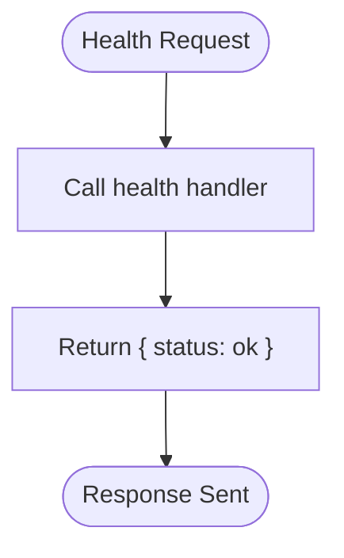
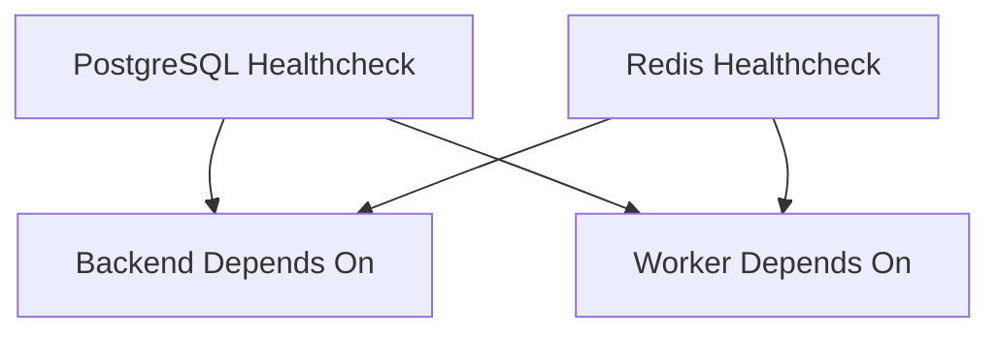
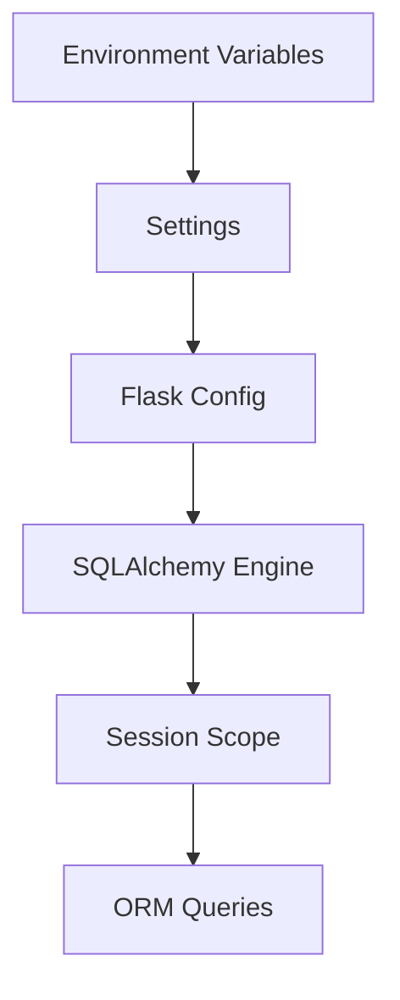
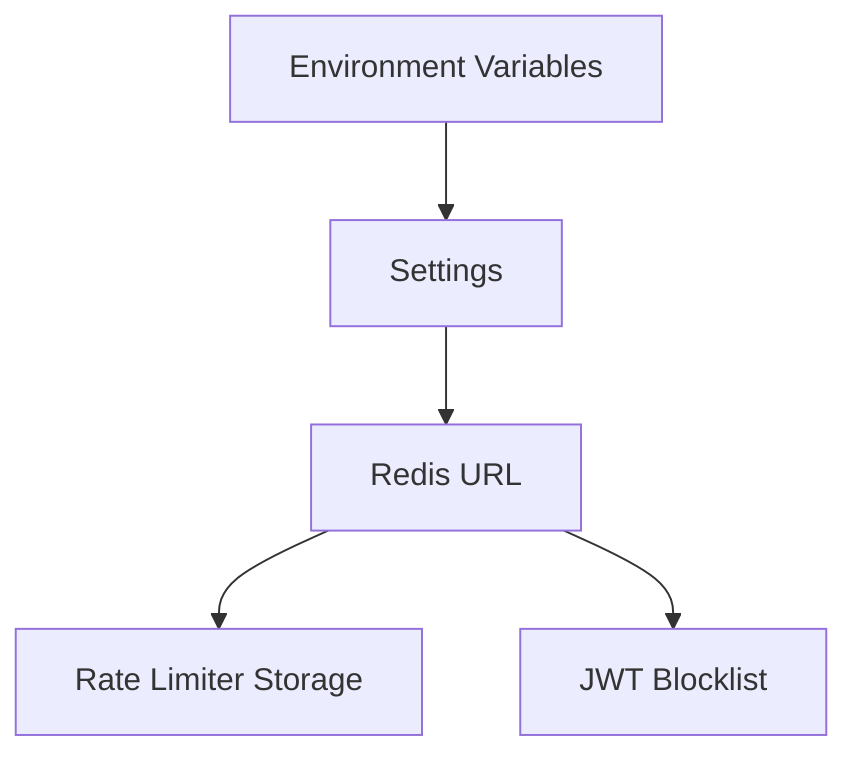
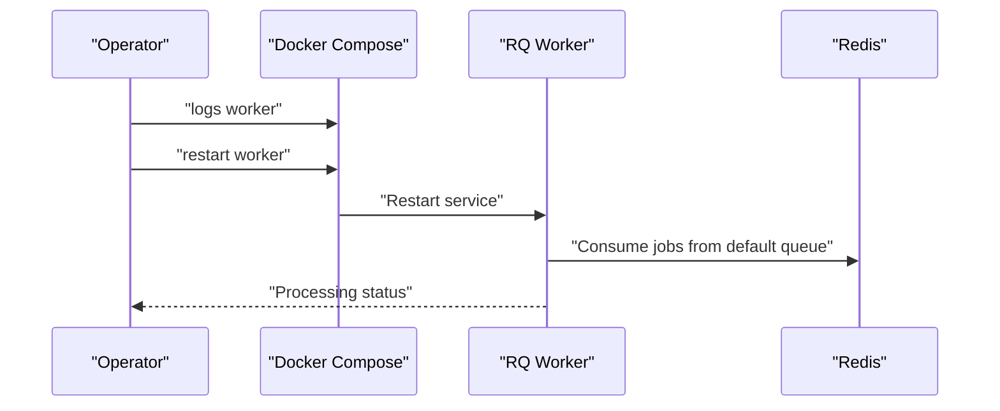
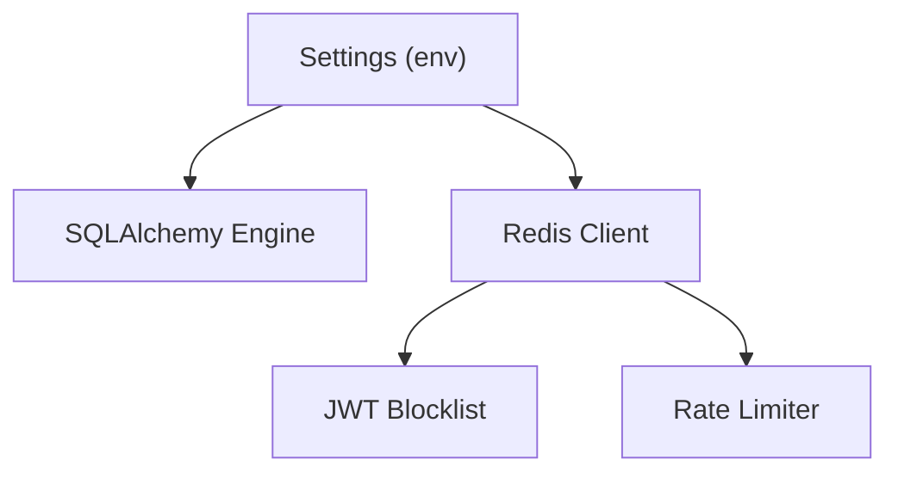

# Monitoring & Troubleshooting

<cite>
**Referenced Files in This Document**
- [backend/app/__init__.py](file://backend/app/__init__.py)
- [backend/app/core/config.py](file://backend/app/core/config.py)
- [backend/app/core/database.py](file://backend/app/core/database.py)
- [backend/app/core/cache.py](file://backend/app/core/cache.py)
- [backend/app/core/extensions.py](file://backend/app/core/extensions.py)
- [backend/app/api/v1/auth.py](file://backend/app/api/v1/auth.py)
- [backend/entrypoint.sh](file://backend/entrypoint.sh)
- [backend/Dockerfile](file://backend/Dockerfile)
- [docker-compose.yml](file://docker-compose.yml)
- [docker-compose.prod.yml](file://docker-compose.prod.yml)
- [backend/tests/test_health.py](file://backend/tests/test_health.py)
- [docs/DEPLOYMENT.md](file://docs/DEPLOYMENT.md)
- [docs/API.md](file://docs/API.md)
- [backend/pyproject.toml](file://backend/pyproject.toml)
- [backend/app/wsgi.py](file://backend/app/wsgi.py)
</cite>

## Table of Contents
1. [Introduction](#introduction)
2. [Project Structure](#project-structure)
3. [Core Components](#core-components)
4. [Architecture Overview](#architecture-overview)
5. [Detailed Component Analysis](#detailed-component-analysis)
6. [Dependency Analysis](#dependency-analysis)
7. [Performance Considerations](#performance-considerations)
8. [Troubleshooting Guide](#troubleshooting-guide)
9. [Conclusion](#conclusion)
10. [Appendices](#appendices)

## Introduction
This document provides comprehensive monitoring and troubleshooting procedures for the system. It covers health check endpoints, container status monitoring, log analysis techniques, performance monitoring approaches, and systematic troubleshooting for common issues such as container startup failures, database connectivity problems, SSL certificate issues, Redis connectivity problems, and background worker failures. It also includes diagnostic commands, log analysis patterns, escalation procedures, monitoring tools integration, alerting mechanisms, and preventive maintenance strategies to ensure system reliability.

## Project Structure
The system is composed of:
- A Flask backend with a health endpoint and rate limiting
- A PostgreSQL database with managed migrations
- A Redis cache/queue used for rate limiting and token blocklisting
- A Gunicorn server in production and a development server in local environments
- An RQ worker for asynchronous job processing
- Optional Traefik reverse proxy with automatic TLS certificates in production
- Docker Compose configurations for local and production deployments

**Diagram sources**
- [docker-compose.prod.yml:1-173](file://docker-compose.prod.yml#L1-L173)
- [backend/Dockerfile:1-34](file://backend/Dockerfile#L1-L34)

**Section sources**
- [docker-compose.prod.yml:1-173](file://docker-compose.prod.yml#L1-L173)
- [docker-compose.yml:1-103](file://docker-compose.yml#L1-L103)
- [backend/Dockerfile:1-34](file://backend/Dockerfile#L1-L34)

## Core Components
- Health endpoint: A simple GET endpoint returning a readiness status.
- Container orchestration: Docker Compose manages services with health checks and dependencies.
- Logging: Application-level logging via a structured logging library; container logs for runtime visibility.
- Database: SQLAlchemy engine and session management with tenant-aware query filtering.
- Cache and rate limiting: Redis-backed caching and rate limiting integration.
- Background jobs: RQ worker consuming jobs from Redis queues.
- Reverse proxy and TLS: Traefik handles routing and automatic certificate provisioning.

**Section sources**
- [backend/app/__init__.py:81-83](file://backend/app/__init__.py#L81-L83)
- [docker-compose.yml:14-18](file://docker-compose.yml#L14-L18)
- [docker-compose.prod.yml:36-40](file://docker-compose.prod.yml#L36-L40)
- [backend/app/core/database.py:36-130](file://backend/app/core/database.py#L36-L130)
- [backend/app/core/cache.py:1-65](file://backend/app/core/cache.py#L1-L65)
- [backend/app/core/extensions.py:1-8](file://backend/app/core/extensions.py#L1-L8)
- [docker-compose.prod.yml:114-142](file://docker-compose.prod.yml#L114-L142)

## Architecture Overview
The system exposes a health endpoint and integrates with supporting infrastructure:
- Health endpoint: Returns a simple readiness status for quick checks.
- Database connectivity: Managed via SQLAlchemy with environment-driven connection URLs.
- Redis connectivity: Used for caching, token blocklisting, and rate limiting.
- Asynchronous processing: RQ worker consumes jobs from Redis queues.
- Production deployment: Gunicorn with configurable workers and threads; Traefik handles TLS termination.

**Diagram sources**
- [backend/app/__init__.py:81-83](file://backend/app/__init__.py#L81-L83)
- [docker-compose.prod.yml:94-100](file://docker-compose.prod.yml#L94-L100)

**Section sources**
- [backend/app/__init__.py:81-83](file://backend/app/__init__.py#L81-L83)
- [backend/app/core/database.py:36-130](file://backend/app/core/database.py#L36-L130)
- [backend/app/core/cache.py:1-65](file://backend/app/core/cache.py#L1-L65)
- [docker-compose.prod.yml:94-100](file://docker-compose.prod.yml#L94-L100)

## Detailed Component Analysis

### Health Endpoint
- Purpose: Provides a lightweight readiness check for the backend service.
- Endpoint: GET /health
- Behavior: Returns a simple JSON object indicating the service is operational.
- Usage: Ideal for Kubernetes-style probes or simple curl checks.

**Diagram sources**
- [backend/app/__init__.py:81-83](file://backend/app/__init__.py#L81-L83)

**Section sources**
- [backend/app/__init__.py:81-83](file://backend/app/__init__.py#L81-L83)
- [backend/tests/test_health.py:1-10](file://backend/tests/test_health.py#L1-L10)

### Container Status Monitoring
- Local compose: Services define health checks for PostgreSQL and Redis.
- Production compose: Traefik, PostgreSQL, Redis, Backend, Worker, and Frontend are orchestrated with health checks and dependencies.
- Dependencies: Backend and Worker depend on PostgreSQL and Redis being healthy.

**Diagram sources**
- [docker-compose.yml:14-18](file://docker-compose.yml#L14-L18)
- [docker-compose.yml:74-78](file://docker-compose.yml#L74-L78)
- [docker-compose.prod.yml:108-112](file://docker-compose.prod.yml#L108-L112)
- [docker-compose.prod.yml:138-142](file://docker-compose.prod.yml#L138-L142)

**Section sources**
- [docker-compose.yml:14-18](file://docker-compose.yml#L14-L18)
- [docker-compose.yml:74-78](file://docker-compose.yml#L74-L78)
- [docker-compose.prod.yml:108-112](file://docker-compose.prod.yml#L108-L112)
- [docker-compose.prod.yml:138-142](file://docker-compose.prod.yml#L138-L142)

### Log Analysis Techniques
- Container logs: Use Docker Compose to stream logs for real-time inspection.
- Backend logs: Structured logging is used; inspect container logs for errors and warnings.
- Traefik logs: Review for TLS certificate acquisition and routing issues.
- Worker logs: Inspect job processing and queue status.

Diagnostic commands:
- View all service logs: docker-compose -f docker-compose.prod.yml logs -f
- Tail Traefik logs: docker-compose -f docker-compose.prod.yml logs -f traefik
- Tail backend logs: docker-compose -f docker-compose.prod.yml logs -f backend
- Tail worker logs: docker-compose -f docker-compose.prod.yml logs -f worker

**Section sources**
- [docs/DEPLOYMENT.md:312-320](file://docs/DEPLOYMENT.md#L312-L320)

### Performance Monitoring Approaches
- Resource usage: Use docker stats to monitor CPU and memory consumption.
- Backend metrics: Enable access/error logs in Gunicorn for throughput and latency insights.
- Database performance: Monitor PostgreSQL resource usage and slow queries.
- Redis performance: Track memory usage and command latency.

Recommended commands:
- Container stats: docker stats
- Backend access logs: Ensure access-logfile and error-logfile are enabled in Gunicorn configuration
- Database stats: Use psql to run EXPLAIN ANALYZE on slow queries

**Section sources**
- [docs/DEPLOYMENT.md:318-320](file://docs/DEPLOYMENT.md#L318-L320)
- [docker-compose.prod.yml:84-93](file://docker-compose.prod.yml#L84-L93)

### Database Connectivity Monitoring
- Connection URL: Managed via environment variables and injected into the Flask app configuration.
- Engine creation: SQLAlchemy engine is created from the configured URL.
- Session management: Scoped sessions with commit/rollback semantics.

**Diagram sources**
- [backend/app/core/config.py:13-24](file://backend/app/core/config.py#L13-L24)
- [backend/app/core/database.py:36-130](file://backend/app/core/database.py#L36-L130)

**Section sources**
- [backend/app/core/config.py:13-24](file://backend/app/core/config.py#L13-L24)
- [backend/app/core/database.py:36-130](file://backend/app/core/database.py#L36-L130)

### Redis Connectivity Monitoring
- Redis URL: Managed via environment variables and injected into the Flask app configuration.
- Rate limiting storage: Redis is used as the storage backend for rate limiting.
- Token blocklisting: Redis is used to store revoked tokens for JWT.

**Diagram sources**
- [backend/app/core/config.py:14-17](file://backend/app/core/config.py#L14-L17)
- [backend/app/core/extensions.py:4-7](file://backend/app/core/extensions.py#L4-L7)
- [backend/app/api/v1/auth.py:86-121](file://backend/app/api/v1/auth.py#L86-L121)

**Section sources**
- [backend/app/core/config.py:14-17](file://backend/app/core/config.py#L14-L17)
- [backend/app/core/extensions.py:4-7](file://backend/app/core/extensions.py#L4-L7)
- [backend/app/api/v1/auth.py:86-121](file://backend/app/api/v1/auth.py#L86-L121)

### Background Worker Failures
- Worker command: RQ worker consumes jobs from the default queue.
- Queue inspection: Use Redis CLI to inspect queue length and status.
- Restart worker: Restart the worker service after investigating logs.

**Diagram sources**
- [docker-compose.prod.yml:114-142](file://docker-compose.prod.yml#L114-L142)
- [docs/DEPLOYMENT.md:384-391](file://docs/DEPLOYMENT.md#L384-L391)

**Section sources**
- [docker-compose.prod.yml:114-142](file://docker-compose.prod.yml#L114-L142)
- [docs/DEPLOYMENT.md:384-391](file://docs/DEPLOYMENT.md#L384-L391)

## Dependency Analysis
The backend depends on:
- Database: SQLAlchemy engine and scoped sessions
- Cache/Rate limiting: Redis client and rate limiter initialization
- Authentication: JWT blocklist stored in Redis
- Environment configuration: Pydantic settings loaded from environment variables

**Diagram sources**
- [backend/app/core/config.py:9-56](file://backend/app/core/config.py#L9-L56)
- [backend/app/core/database.py:36-130](file://backend/app/core/database.py#L36-L130)
- [backend/app/core/cache.py:1-65](file://backend/app/core/cache.py#L1-L65)
- [backend/app/core/extensions.py:1-8](file://backend/app/core/extensions.py#L1-L8)
- [backend/app/api/v1/auth.py:86-121](file://backend/app/api/v1/auth.py#L86-L121)

**Section sources**
- [backend/app/core/config.py:9-56](file://backend/app/core/config.py#L9-L56)
- [backend/app/core/database.py:36-130](file://backend/app/core/database.py#L36-L130)
- [backend/app/core/cache.py:1-65](file://backend/app/core/cache.py#L1-L65)
- [backend/app/core/extensions.py:1-8](file://backend/app/core/extensions.py#L1-L8)
- [backend/app/api/v1/auth.py:86-121](file://backend/app/api/v1/auth.py#L86-L121)

## Performance Considerations
- Gunicorn configuration: Adjust workers and threads for optimal concurrency.
- Access logging: Enable access logs to capture request latencies and throughput.
- Database tuning: Monitor slow queries and optimize indexes.
- Redis tuning: Monitor memory usage and consider persistence settings.

[No sources needed since this section provides general guidance]

## Troubleshooting Guide

### Container Startup Failures
Symptoms:
- Services not becoming healthy or failing to start.

Actions:
- Inspect logs for all services.
- Rebuild and restart services.
- Verify environment variables and volume mounts.

Diagnostic commands:
- docker-compose -f docker-compose.prod.yml logs
- docker-compose -f docker-compose.prod.yml down
- docker-compose -f docker-compose.prod.yml up -d --build

**Section sources**
- [docs/DEPLOYMENT.md:339-343](file://docs/DEPLOYMENT.md#L339-L343)

### Database Connectivity Problems
Symptoms:
- Backend cannot connect to PostgreSQL.
- Migration or query failures.

Actions:
- Check PostgreSQL service status.
- Test connectivity from the backend container.
- Verify DATABASE_URL environment variable.

Diagnostic commands:
- docker-compose -f docker-compose.prod.yml ps postgres
- docker-compose -f docker-compose.prod.yml exec postgres psql -U ${POSTGRES_USER} -d ${POSTGRES_DB} -c "SELECT 1"
- docker-compose -f docker-compose.prod.yml exec backend env | grep DATABASE

**Section sources**
- [docs/DEPLOYMENT.md:345-357](file://docs/DEPLOYMENT.md#L345-L357)

### SSL Certificate Issues
Symptoms:
- TLS not working or certificate errors.

Actions:
- Verify DNS resolution to the server.
- Check Traefik logs for ACME certificate acquisition.
- Allow time for certificate issuance after first request.

Diagnostic commands:
- dig +short your-domain.com
- docker-compose -f docker-compose.prod.yml logs traefik | grep -i acme

**Section sources**
- [docs/DEPLOYMENT.md:359-370](file://docs/DEPLOYMENT.md#L359-L370)

### Redis Connectivity Problems
Symptoms:
- Backend returns 401 on all requests (fail-closed mode).
- Worker not processing jobs.

Actions:
- Check Redis service status and logs.
- Restart Redis if unhealthy.
- Inspect queue length and worker logs.

Diagnostic commands:
- docker-compose -f docker-compose.prod.yml ps redis
- docker-compose -f docker-compose.prod.yml logs redis
- docker-compose -f docker-compose.prod.yml restart redis
- docker-compose -f docker-compose.prod.yml logs worker
- docker-compose -f docker-compose.prod.yml restart worker
- docker-compose -f docker-compose.prod.yml exec redis redis-cli -a ${REDIS_PASSWORD} llen rq:queue:default

**Section sources**
- [docs/DEPLOYMENT.md:372-391](file://docs/DEPLOYMENT.md#L372-L391)

### Background Worker Failures
Symptoms:
- Jobs remain queued and not processed.

Actions:
- Inspect worker logs for errors.
- Restart the worker service.
- Verify Redis connectivity and queue length.

Diagnostic commands:
- docker-compose -f docker-compose.prod.yml logs worker
- docker-compose -f docker-compose.prod.yml restart worker
- docker-compose -f docker-compose.prod.yml exec redis redis-cli -a ${REDIS_PASSWORD} llen rq:queue:default

**Section sources**
- [docs/DEPLOYMENT.md:382-391](file://docs/DEPLOYMENT.md#L382-L391)

### Migration Errors
Symptoms:
- Database schema inconsistencies after updates.

Actions:
- Check migration status.
- Apply pending migrations.
- As a last resort, reinitialize the database.

Diagnostic commands:
- docker-compose -f docker-compose.prod.yml exec backend flask --app app db current
- docker-compose -f docker-compose.prod.yml exec backend flask --app app db upgrade
- docker-compose -f docker-compose.prod.yml exec backend flask --app app init-db

**Section sources**
- [docs/DEPLOYMENT.md:393-407](file://docs/DEPLOYMENT.md#L393-L407)

### Rate Limiting and Authentication Failures
Symptoms:
- Too many 429 responses or 401 errors.

Actions:
- Verify Redis availability for rate limiting and JWT blocklist.
- Check rate limit configuration and keys.
- Confirm JWT secret keys and Redis credentials.

Diagnostic commands:
- docker-compose -f docker-compose.prod.yml ps redis
- docker-compose -f docker-compose.prod.yml logs redis
- Review rate limiter configuration in the backend

**Section sources**
- [backend/app/core/extensions.py:4-7](file://backend/app/core/extensions.py#L4-L7)
- [backend/app/api/v1/auth.py:27-42](file://backend/app/api/v1/auth.py#L27-L42)
- [docs/DEPLOYMENT.md:372-381](file://docs/DEPLOYMENT.md#L372-L381)

### Health Checks and Readiness
- Use the health endpoint to verify service readiness.
- In production, ensure Traefik forwards traffic only to healthy instances.

Diagnostic commands:
- curl https://your-domain.com/api/v1/health

**Section sources**
- [backend/app/__init__.py:81-83](file://backend/app/__init__.py#L81-L83)
- [docs/API.md:1-20](file://docs/API.md#L1-L20)

## Conclusion
This guide consolidates monitoring and troubleshooting practices for the system. By leveraging health checks, container health statuses, structured logs, and targeted diagnostic commands, operators can quickly identify and resolve common issues. Integrating monitoring tools, establishing alerting mechanisms, and following preventive maintenance strategies ensures sustained system reliability.

[No sources needed since this section summarizes without analyzing specific files]

## Appendices

### Monitoring Tools Integration
- Metrics: Export Prometheus metrics or integrate with existing monitoring stacks.
- Logs: Centralize container logs using a log aggregation platform.
- Alerts: Configure alerts for service downtime, high error rates, and resource exhaustion.

[No sources needed since this section provides general guidance]

### Alerting Mechanisms
- Health endpoint failures
- Database connection timeouts
- Redis unavailability
- Worker queue backlog exceeding thresholds
- High rate limit violations

[No sources needed since this section provides general guidance]

### Preventive Maintenance Strategies
- Regular backups of PostgreSQL
- Rotation of secrets and keys
- Scheduled updates and patching
- Capacity planning for CPU, memory, and disk
- Security hardening and firewall rules

[No sources needed since this section provides general guidance]