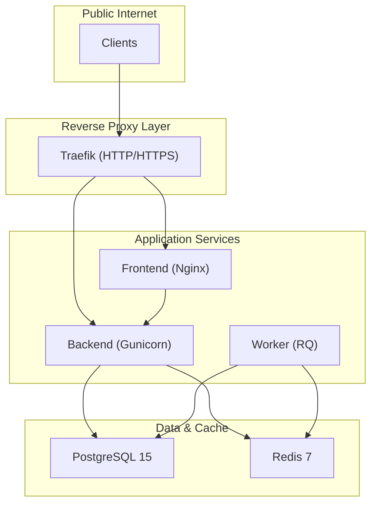
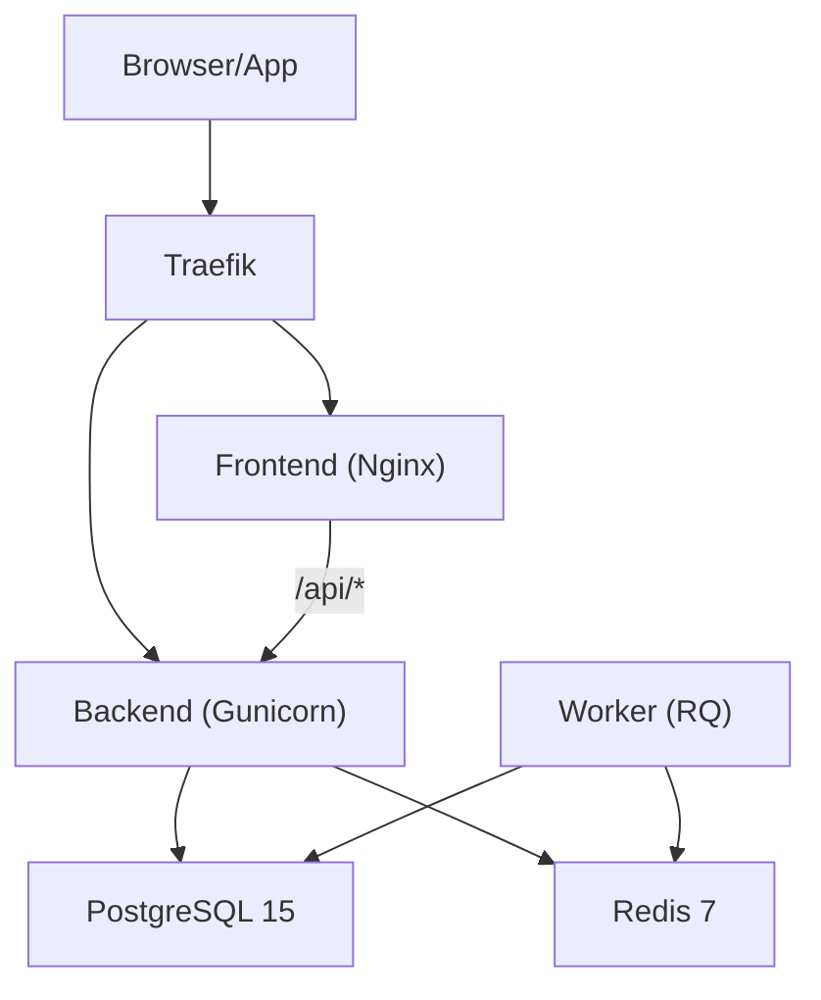
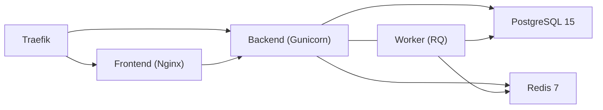

# Production Deployment

<cite>
**Referenced Files in This Document**
- [docker-compose.prod.yml](file://docker-compose.prod.yml)
- [docker-compose.yml](file://docker-compose.yml)
- [backend/Dockerfile](file://backend/Dockerfile)
- [frontend/Dockerfile.prod](file://frontend/Dockerfile.prod)
- [backend/entrypoint.sh](file://backend/entrypoint.sh)
- [backend/pyproject.toml](file://backend/pyproject.toml)
- [backend/app/core/config.py](file://backend/app/core/config.py)
- [frontend/nginx.conf](file://frontend/nginx.conf)
- [docs/DEPLOYMENT.md](file://docs/DEPLOYMENT.md)
- [deploy-to-hetzner.md](file://deploy-to-hetzner.md)
</cite>

## Table of Contents
1. [Introduction](#introduction)
2. [Project Structure](#project-structure)
3. [Core Components](#core-components)
4. [Architecture Overview](#architecture-overview)
5. [Detailed Component Analysis](#detailed-component-analysis)
6. [Dependency Analysis](#dependency-analysis)
7. [Performance Considerations](#performance-considerations)
8. [Troubleshooting Guide](#troubleshooting-guide)
9. [Conclusion](#conclusion)
10. [Appendices](#appendices)

## Introduction
This document provides a comprehensive guide for deploying the platform in production using Docker and Traefik reverse proxy. It explains the production Docker Compose configuration, Traefik reverse proxy setup with automatic SSL certificates, PostgreSQL and Redis configuration, and Gunicorn worker setup. It also documents the step-by-step deployment process, environment variable configuration, DNS setup, SSL certificate acquisition, and initial system initialization. Practical examples of production deployment commands, container orchestration, and service health verification are included. Finally, it addresses production-specific configurations such as security headers, CORS settings, and performance optimizations.

## Project Structure
The production stack is orchestrated by a single Docker Compose file that defines Traefik, PostgreSQL, Redis, the backend service, the RQ worker, and the frontend. The backend is served by Gunicorn behind Traefik, while the frontend is served by Nginx in production.

**Diagram sources**
- [docker-compose.prod.yml:1-173](file://docker-compose.prod.yml#L1-L173)

**Section sources**
- [docker-compose.prod.yml:1-173](file://docker-compose.prod.yml#L1-L173)
- [docker-compose.yml:1-103](file://docker-compose.yml#L1-L103)

## Core Components
- Traefik reverse proxy with automatic ACME HTTP challenge for Let's Encrypt TLS certificates.
- PostgreSQL 15 with persistent volume and health checks.
- Redis 7 with password authentication, persistence, and health checks.
- Backend service built with Gunicorn (2 workers, 4 threads) exposing API under /api.
- Worker service running RQ with Redis as the broker.
- Frontend service built with Nginx serving static SPA content and proxying /api to backend.

Key production runtime characteristics:
- Backend binds to 0.0.0.0:5000 and is exposed via Traefik labels.
- Worker connects to Redis with password and listens to the default queue.
- Frontend proxies /api to backend and serves SPA routes.

**Section sources**
- [docker-compose.prod.yml:56-163](file://docker-compose.prod.yml#L56-L163)
- [backend/Dockerfile:1-34](file://backend/Dockerfile#L1-L34)
- [frontend/Dockerfile.prod:1-16](file://frontend/Dockerfile.prod#L1-L16)

## Architecture Overview
The production architecture uses Traefik as the ingress controller. Requests are routed to the frontend for static assets and to the backend for API traffic. TLS termination is handled by Traefik with automatic certificate provisioning via ACME HTTP challenge. Backend and worker services communicate with PostgreSQL and Redis, which are isolated in their own containers.

**Diagram sources**
- [docker-compose.prod.yml:2-163](file://docker-compose.prod.yml#L2-L163)
- [frontend/nginx.conf:1-33](file://frontend/nginx.conf#L1-L33)

## Detailed Component Analysis

### Traefik Reverse Proxy (Automatic SSL)
- Entrypoints: web (:80) and websecure (:443).
- ACME HTTP challenge enabled with a certificate resolver using the web entrypoint.
- Certificates stored in a named volume for persistence across deployments.
- Automatic HTTPS redirection middleware applied to HTTP routers for both frontend and backend.
- Domain routing configured via Traefik labels on backend and frontend services.

Operational notes:
- ACME certificates are requested on first HTTP access to the domain.
- Ensure DNS A record points to the server IP before startup.
- Review Traefik logs for ACME status and certificate events.

**Section sources**
- [docker-compose.prod.yml:2-21](file://docker-compose.prod.yml#L2-L21)
- [docker-compose.prod.yml:94-105](file://docker-compose.prod.yml#L94-L105)
- [docker-compose.prod.yml:149-160](file://docker-compose.prod.yml#L149-L160)

### Backend Service (Gunicorn Workers)
- Built from backend/Dockerfile with system dependencies and Python packages.
- Entrypoint runs database migrations automatically before starting the app.
- Gunicorn configured with 2 workers and 4 threads, gthread worker class, bind to 0.0.0.0:5000.
- Environment variables include database URL, Redis URL, CORS allowed origins, SMTP settings, and branding.
- Health depends on PostgreSQL and Redis health checks.

Runtime behavior:
- On startup, waits briefly for DB, runs migrations, then starts Gunicorn.
- Access/error logs are forwarded to stdout/stderr for container logging.

**Section sources**
- [backend/Dockerfile:1-34](file://backend/Dockerfile#L1-L34)
- [backend/entrypoint.sh:1-21](file://backend/entrypoint.sh#L1-L21)
- [docker-compose.prod.yml:56-93](file://docker-compose.prod.yml#L56-L93)

### Worker Service (RQ)
- Runs RQ worker against the default Redis queue.
- Shares the same environment as the backend (database, Redis, secrets).
- Depends on healthy Redis and PostgreSQL.

**Section sources**
- [docker-compose.prod.yml:114-142](file://docker-compose.prod.yml#L114-L142)

### Frontend Service (Nginx)
- Multi-stage build: Node stage builds the app, Nginx stage serves static files.
- Custom Nginx configuration proxies /api to backend and serves SPA routes.
- Exposes port 80 inside the container; Traefik handles TLS termination.

**Section sources**
- [frontend/Dockerfile.prod:1-16](file://frontend/Dockerfile.prod#L1-L16)
- [frontend/nginx.conf:1-33](file://frontend/nginx.conf#L1-L33)

### Database and Cache (PostgreSQL and Redis)
- PostgreSQL 15 with persistent volume and healthcheck using pg_isready.
- Redis 7 with requirepass, appendonly enabled, and healthcheck using redis-cli ping.
- Both services are part of the same Docker network and are referenced by other services by service name.

**Section sources**
- [docker-compose.prod.yml:25-40](file://docker-compose.prod.yml#L25-L40)
- [docker-compose.prod.yml:42-54](file://docker-compose.prod.yml#L42-L54)

### Configuration Loading and Validation
- Application settings are loaded via Pydantic settings with environment file support.
- In production, secret keys must meet minimum length requirements.
- CORS allowed origins defaults to the configured DOMAIN and can be overridden.

**Section sources**
- [backend/app/core/config.py:1-60](file://backend/app/core/config.py#L1-L60)

## Dependency Analysis
The production stack defines explicit dependencies among services. The backend and worker depend on PostgreSQL and Redis health. The frontend depends on the backend for API proxying.

**Diagram sources**
- [docker-compose.prod.yml:108-142](file://docker-compose.prod.yml#L108-L142)

**Section sources**
- [docker-compose.prod.yml:108-142](file://docker-compose.prod.yml#L108-L142)

## Performance Considerations
- Gunicorn configuration: 2 workers with 4 threads using gthread worker class. Adjust based on CPU cores and workload characteristics.
- Use persistent volumes for PostgreSQL and Redis to avoid data loss and improve reliability.
- Enable Traefik access logs for monitoring and performance insights.
- Consider scaling backend replicas behind Traefik if CPU-bound requests increase.
- Ensure adequate swap and memory limits for PostgreSQL and Redis in production environments.

[No sources needed since this section provides general guidance]

## Troubleshooting Guide
Common production issues and remedies:
- Containers not starting: inspect logs for Traefik, backend, and worker; rebuild and restart services.
- Database connection failures: verify PostgreSQL health, credentials, and network connectivity.
- SSL/TLS not working: confirm DNS A record points to server, check Traefik ACME logs, and allow time for certificate issuance.
- Backend returns 401 frequently: Redis availability is critical; Traefik closed behavior treats tokens as revoked when Redis is down.
- Worker not processing jobs: check worker logs, Redis queue length, and Redis password configuration.
- Migration errors: verify Alembic migration status and apply upgrades if pending.

Verification commands:
- View service status and logs.
- Perform health checks against the API endpoint.
- Confirm Traefik certificate provisioning.

**Section sources**
- [docs/DEPLOYMENT.md:335-407](file://docs/DEPLOYMENT.md#L335-L407)
- [deploy-to-hetzner.md:84-92](file://deploy-to-hetzner.md#L84-L92)

## Conclusion
The production deployment leverages Traefik for secure ingress with automatic TLS, Gunicorn for robust Python WSGI serving, and RQ for asynchronous job processing. PostgreSQL and Redis provide reliable data and caching layers. By following the documented environment configuration, DNS setup, and deployment steps, teams can achieve a secure, scalable, and maintainable production environment.

[No sources needed since this section summarizes without analyzing specific files]

## Appendices

### Step-by-Step Production Deployment
- Prepare environment:
  - Copy environment template to .env and fill required variables (DOMAIN, ACME_EMAIL, database credentials, Redis password, Flask secrets, SMTP settings).
- DNS setup:
  - Point the configured DOMAIN to the server’s public IP address.
- Initial deployment:
  - Start services in detached mode with build.
  - Allow Traefik a few minutes to obtain the certificate.
- Initialize system:
  - Run database initialization and create the initial super-admin user.
- Verify:
  - Check service status and logs.
  - Perform a health check against the API endpoint.

Example commands:
- Start services: [docker-compose.prod.yml](file://docker-compose.prod.yml#L64)
- View logs: [docker-compose.prod.yml:70-71](file://docker-compose.prod.yml#L70-L71)
- Health check: [docs/DEPLOYMENT.md](file://docs/DEPLOYMENT.md#L126)

**Section sources**
- [docs/DEPLOYMENT.md:88-127](file://docs/DEPLOYMENT.md#L88-L127)
- [deploy-to-hetzner.md:59-81](file://deploy-to-hetzner.md#L59-L81)

### Environment Variables Reference
- Infrastructure and Traefik:
  - DOMAIN: Public domain without scheme.
  - ACME_EMAIL: Email for Let's Encrypt notifications.
- PostgreSQL:
  - POSTGRES_USER, POSTGRES_PASSWORD, POSTGRES_DB.
- Redis:
  - REDIS_PASSWORD.
- Backend:
  - SECRET_KEY, JWT_SECRET_KEY, FLASK_ENV=production, FRONTEND_URL, BRAND_NAME, ALLOWED_ORIGINS, COMMERCIAL_MODE.
- SMTP:
  - SMTP_SERVER, SMTP_PORT, SMTP_USER, SMTP_PASSWORD, SMTP_FROM.
- Optional:
  - WHATSAPP_API_URL, WHATSAPP_API_TOKEN.

Validation:
- Production enforces minimum length for SECRET_KEY and JWT_SECRET_KEY.

**Section sources**
- [docs/DEPLOYMENT.md:148-201](file://docs/DEPLOYMENT.md#L148-L201)
- [backend/app/core/config.py:44-51](file://backend/app/core/config.py#L44-L51)

### Security Headers and CORS
- CORS:
  - ALLOWED_ORIGINS defaults to HTTPS with the configured DOMAIN.
  - Ensure only trusted domains are permitted.
- Security headers:
  - Traefik does not inject HTTP security headers by default; consider adding headers at the application level or via a gateway/proxy with header injection capabilities.
- Additional production hardening:
  - Enforce HTTPS-only cookies, HSTS, and CSRF protections at the application layer.
  - Use secrets managers for sensitive values and avoid committing .env files.

**Section sources**
- [docs/DEPLOYMENT.md:411-425](file://docs/DEPLOYMENT.md#L411-L425)
- [backend/app/core/config.py](file://backend/app/core/config.py#L15)

### Container Orchestration and Health Verification
- Health checks:
  - PostgreSQL: healthcheck using pg_isready.
  - Redis: healthcheck using redis-cli ping.
- Startup dependencies:
  - Backend waits for database and Redis readiness.
  - Worker waits for Redis and database readiness.
- Monitoring:
  - Use docker stats and Traefik access logs for resource and traffic insights.

**Section sources**
- [docker-compose.prod.yml:36-54](file://docker-compose.prod.yml#L36-L54)
- [docker-compose.prod.yml:108-142](file://docker-compose.prod.yml#L108-L142)

### Initial System Initialization
- Initialize database and create the first super-admin user.
- After login, create the first tenant and additional administrators as needed.

**Section sources**
- [docs/DEPLOYMENT.md:204-237](file://docs/DEPLOYMENT.md#L204-L237)

### Backup and Maintenance
- Database backups:
  - Manual dump and cron-based automated backups.
- Cleanup:
  - Remove old images and stale uploads periodically.

**Section sources**
- [docs/DEPLOYMENT.md:279-332](file://docs/DEPLOYMENT.md#L279-L332)