# Development Guidelines

<cite>
**Referenced Files in This Document**
- [CONTRIBUTING.md](file://CONTRIBUTING.md)
- [README.md](file://README.md)
- [development-plan.md](file://development-plan.md)
- [docs/ARCHITECTURE.md](file://docs/ARCHITECTURE.md)
- [docs/DEPLOYMENT.md](file://docs/DEPLOYMENT.md)
- [CHANGELOG.md](file://CHANGELOG.md)
- [backend/pyproject.toml](file://backend/pyproject.toml)
- [frontend/package.json](file://frontend/package.json)
- [backend/tests/conftest.py](file://backend/tests/conftest.py)
- [backend/tests/test_auth.py](file://backend/tests/test_auth.py)
- [backend/tests/test_health.py](file://backend/tests/test_health.py)
- [backend/tests/test_ingestion.py](file://backend/tests/test_ingestion.py)
</cite>

## Table of Contents
1. [Introduction](#introduction)
2. [Project Structure](#project-structure)
3. [Core Components](#core-components)
4. [Architecture Overview](#architecture-overview)
5. [Detailed Component Analysis](#detailed-component-analysis)
6. [Dependency Analysis](#dependency-analysis)
7. [Performance Considerations](#performance-considerations)
8. [Troubleshooting Guide](#troubleshooting-guide)
9. [Conclusion](#conclusion)
10. [Appendices](#appendices)

## Introduction
This document defines the development guidelines for contributing to the project. It covers environment setup, branch management, code style conventions, commit message standards, pull request workflows, review processes, security practices, database migrations, testing expectations, and release procedures. The guidelines emphasize consistent practices across the backend (Python/Flask), frontend (TypeScript/React), and shared documentation, aligning with the project’s multi-tenant architecture and production-grade deployment.

## Project Structure
The repository follows a multi-package structure:
- backend: Flask REST API with layered architecture (core, api, services, models, schemas, repositories)
- frontend: React SPA with Redux Toolkit and RTK Query
- mobile: React Native/Expo app
- docs: Architecture, deployment, and roadmap documentation
- scripts and docker-compose files for local and production environments

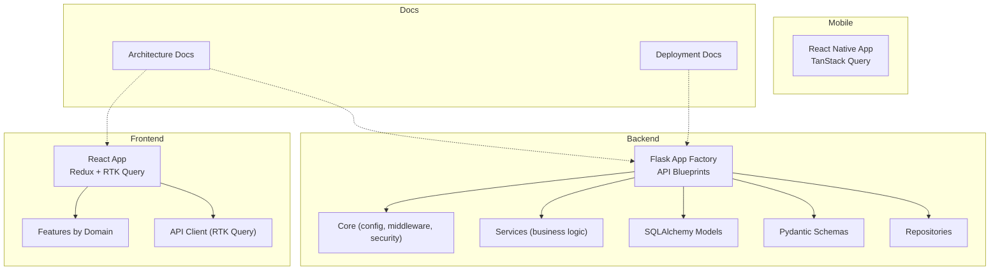

**Diagram sources**
- [docs/ARCHITECTURE.md:139-205](file://docs/ARCHITECTURE.md#L139-L205)
- [README.md:195-232](file://README.md#L195-L232)

**Section sources**
- [README.md:195-232](file://README.md#L195-L232)
- [docs/ARCHITECTURE.md:139-205](file://docs/ARCHITECTURE.md#L139-L205)

## Core Components
- Environment setup: Docker-first development with optional manual setup for backend and frontend.
- Branching: feature/*, fix/*, hotfix/* with main as production branch; develop as optional integration branch.
- Code style: Python via ruff/black; TypeScript via ESLint; type hints and Pydantic validation enforced.
- Security: JWT with refresh, RBAC, rate limiting, fail-closed Redis blocklist, secure headers, and safe password handling.
- Migrations: Alembic-managed SQLAlchemy migrations; never modify applied migrations.
- Testing: Backend pytest suite; frontend type-checking; integration tests for critical flows.
- Releases: Semantic versioning with CHANGELOG.md entries and release notes.

**Section sources**
- [CONTRIBUTING.md:12-68](file://CONTRIBUTING.md#L12-L68)
- [CONTRIBUTING.md:71-180](file://CONTRIBUTING.md#L71-L180)
- [docs/ARCHITECTURE.md:103-136](file://docs/ARCHITECTURE.md#L103-L136)
- [docs/DEPLOYMENT.md:31-84](file://docs/DEPLOYMENT.md#L31-L84)
- [CHANGELOG.md:1-462](file://CHANGELOG.md#L1-L462)

## Architecture Overview
The system is a multi-tenant SaaS platform with:
- Frontend web (React/MUI) and mobile (React Native/Expo)
- Reverse proxy (Traefik) with automatic TLS
- Backend (Flask) with JWT auth, Redis blocklist, rate limiting, and background jobs
- PostgreSQL for data and Redis for cache/jobs/blocklist
- Alembic migrations and Gunicorn in production

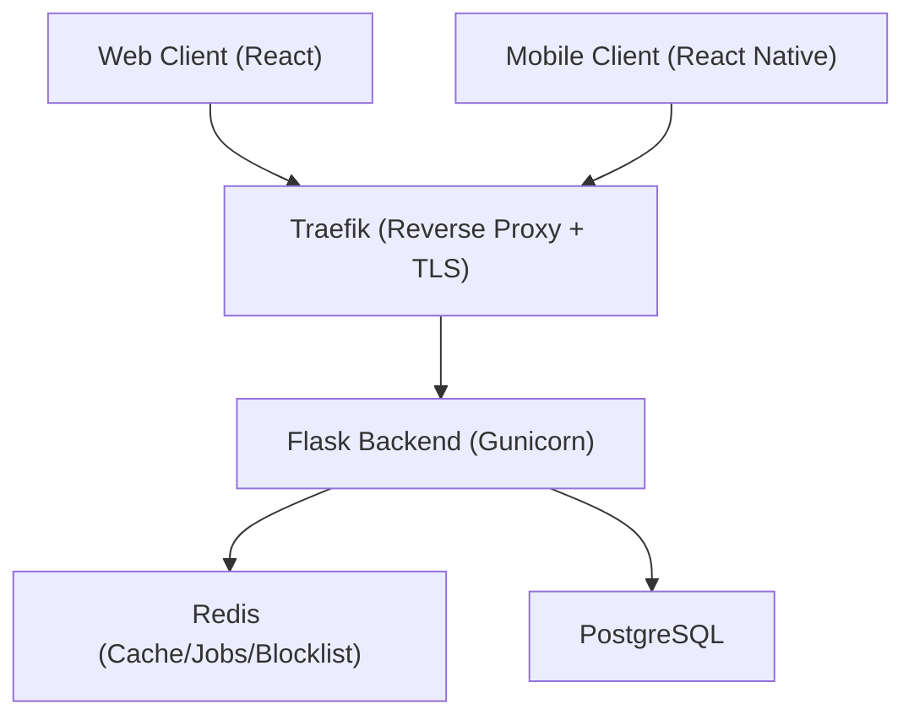

**Diagram sources**
- [docs/ARCHITECTURE.md:22-70](file://docs/ARCHITECTURE.md#L22-L70)
- [docs/DEPLOYMENT.md:88-127](file://docs/DEPLOYMENT.md#L88-L127)

**Section sources**
- [docs/ARCHITECTURE.md:22-70](file://docs/ARCHITECTURE.md#L22-L70)
- [docs/DEPLOYMENT.md:88-127](file://docs/DEPLOYMENT.md#L88-L127)

## Detailed Component Analysis

### Development Environment Setup
- Docker-based development: compose up with backend initialization and demo data seeding.
- Manual setup: Python virtual environment, pip editable install, Flask run with debug; Node.js for frontend; optional Redis worker for background jobs.
- Environment variables: copy .env.example and fill required keys for production-like behavior.

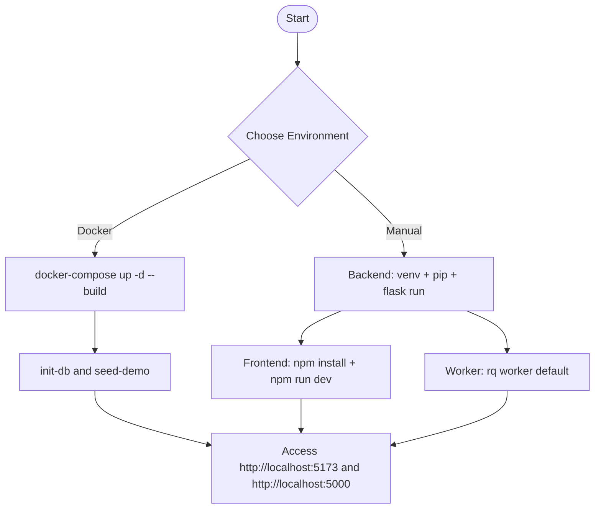

**Diagram sources**
- [README.md:86-132](file://README.md#L86-L132)
- [docs/DEPLOYMENT.md:31-84](file://docs/DEPLOYMENT.md#L31-L84)

**Section sources**
- [README.md:86-132](file://README.md#L86-L132)
- [docs/DEPLOYMENT.md:31-84](file://docs/DEPLOYMENT.md#L31-L84)

### Branch Management Strategy
- main: production-ready code
- develop: optional integration branch
- feature/*: new features
- fix/*: bug fixes
- hotfix/*: urgent production fixes

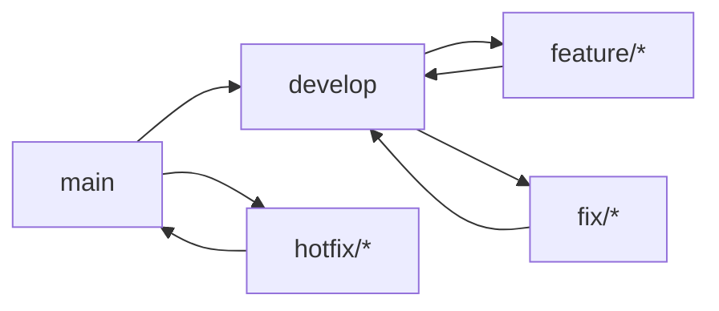

**Diagram sources**
- [CONTRIBUTING.md:51-68](file://CONTRIBUTING.md#L51-L68)

**Section sources**
- [CONTRIBUTING.md:51-68](file://CONTRIBUTING.md#L51-L68)

### Code Style Conventions
- Backend (Python)
  - Formatting: ruff/black
  - Type hints: required for public APIs
  - Validation: Pydantic v2 schemas
  - Error handling: avoid exposing internal errors; centralized handling
  - Security: rate limits on unauthenticated endpoints
- Frontend (TypeScript/React)
  - Functional components with hooks
  - State: prefer local state; Redux for cross-screen shared state
  - API calls: RTK Query only
  - Types: avoid any without justification
  - UI: MUI components exclusively

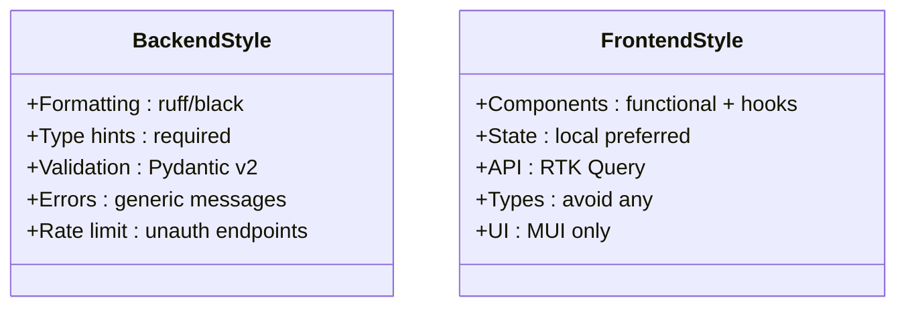

**Diagram sources**
- [CONTRIBUTING.md:73-118](file://CONTRIBUTING.md#L73-L118)

**Section sources**
- [CONTRIBUTING.md:73-118](file://CONTRIBUTING.md#L73-L118)

### Commit Message Standards
- Use imperative mood and concise descriptions
- Examples: feat:, fix:, chore:, docs:, refactor:
- Preferred languages: Portuguese or English

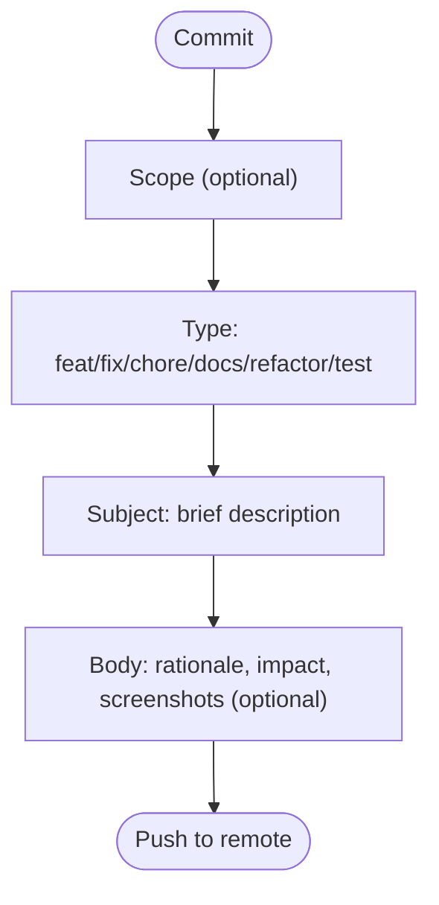

**Diagram sources**
- [CONTRIBUTING.md:120-130](file://CONTRIBUTING.md#L120-L130)

**Section sources**
- [CONTRIBUTING.md:120-130](file://CONTRIBUTING.md#L120-L130)

### Pull Request Workflows
- Ensure tests pass locally (pytest for backend; type-check for frontend)
- Open PR against main (or develop if present)
- Describe changes, include screenshots for UI changes, reference related issues
- Checklist includes: follows style, no secrets, migrations tested, tests passing, TypeScript clean, CHANGELOG updated if relevant

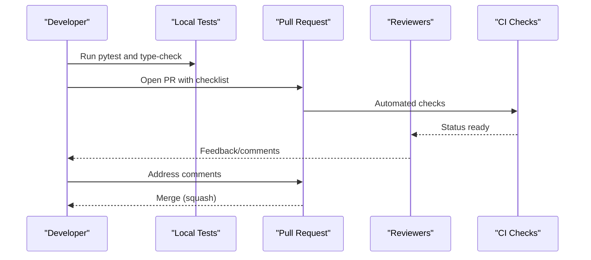

**Diagram sources**
- [CONTRIBUTING.md:183-200](file://CONTRIBUTING.md#L183-L200)

**Section sources**
- [CONTRIBUTING.md:183-200](file://CONTRIBUTING.md#L183-L200)

### Review Processes
- Automated checks: backend tests, frontend type-check
- Human review: maintainers verify adherence to style, security, and architecture
- Merge strategy: squash merges recommended to keep history linear

**Section sources**
- [CONTRIBUTING.md:183-200](file://CONTRIBUTING.md#L183-L200)

### Security Practices
- Never commit secrets; validate user inputs with Pydantic
- Use ORM to prevent SQL injection
- Enforce JWT auth and role checks on endpoints
- Public endpoints must be whitelisted
- Rate limiting on sensitive endpoints
- Fail-closed Redis blocklist for JWT invalidation

**Section sources**
- [CONTRIBUTING.md:134-144](file://CONTRIBUTING.md#L134-L144)
- [docs/ARCHITECTURE.md:103-136](file://docs/ARCHITECTURE.md#L103-L136)

### Database Migrations
- Generate migrations with Alembic when changing models
- Review generated files and ensure downgrade correctness
- Apply migrations in development and production

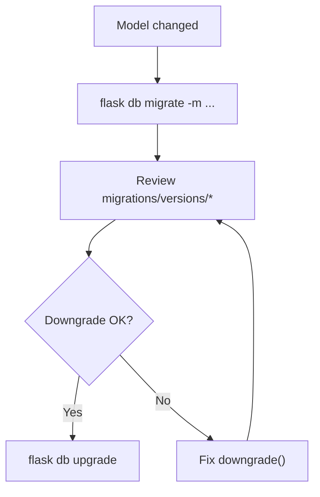

**Diagram sources**
- [CONTRIBUTING.md:147-163](file://CONTRIBUTING.md#L147-L163)

**Section sources**
- [CONTRIBUTING.md:147-163](file://CONTRIBUTING.md#L147-L163)

### Testing Expectations
- Backend: pytest with fixtures for DB, app, auth
- Frontend: type-check via TypeScript
- Integration tests: cover critical flows (e.g., ingestion pipeline)
- Test coverage and linting configured in tooling

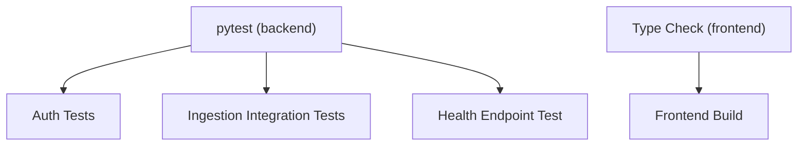

**Diagram sources**
- [backend/tests/conftest.py:1-78](file://backend/tests/conftest.py#L1-L78)
- [backend/tests/test_auth.py:1-48](file://backend/tests/test_auth.py#L1-L48)
- [backend/tests/test_health.py:1-10](file://backend/tests/test_health.py#L1-L10)
- [backend/tests/test_ingestion.py:1-129](file://backend/tests/test_ingestion.py#L1-L129)
- [backend/pyproject.toml:44-51](file://backend/pyproject.toml#L44-L51)
- [frontend/package.json:6-11](file://frontend/package.json#L6-L11)

**Section sources**
- [backend/tests/conftest.py:1-78](file://backend/tests/conftest.py#L1-L78)
- [backend/tests/test_auth.py:1-48](file://backend/tests/test_auth.py#L1-L48)
- [backend/tests/test_health.py:1-10](file://backend/tests/test_health.py#L1-L10)
- [backend/tests/test_ingestion.py:1-129](file://backend/tests/test_ingestion.py#L1-L129)
- [backend/pyproject.toml:44-51](file://backend/pyproject.toml#L44-L51)
- [frontend/package.json:6-11](file://frontend/package.json#L6-L11)

### Release Procedures
- Versioning: semantic versioning with CHANGELOG.md entries
- Release notes: summarize changes, files updated, and next steps
- Production deployment: docker-compose.prod.yml with Traefik, Redis, PostgreSQL, Gunicorn, and worker
- Post-release: verify health endpoint, initialize DB and admin, and confirm TLS certificate issuance

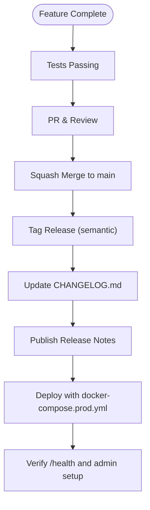

**Diagram sources**
- [CHANGELOG.md:1-462](file://CHANGELOG.md#L1-L462)
- [docs/RELEASE_NOTES_0.2.0.md:1-176](file://docs/RELEASE_NOTES_0.2.0.md#L1-L176)
- [docs/DEPLOYMENT.md:88-144](file://docs/DEPLOYMENT.md#L88-L144)

**Section sources**
- [CHANGELOG.md:1-462](file://CHANGELOG.md#L1-L462)
- [docs/RELEASE_NOTES_0.2.0.md:1-176](file://docs/RELEASE_NOTES_0.2.0.md#L1-L176)
- [docs/DEPLOYMENT.md:88-144](file://docs/DEPLOYMENT.md#L88-L144)

### Practical Contribution Examples
- Feature branch workflow: create feature/importacao-csv, implement, open PR against main
- Fix branch workflow: create fix/calculo-media-notas, add tests, open PR
- Hotfix branch workflow: create hotfix/urgent-bug, apply minimal fix, merge to main
- PR checklist: style, secrets, migrations, tests, type-check, CHANGELOG update

**Section sources**
- [CONTRIBUTING.md:51-68](file://CONTRIBUTING.md#L51-L68)
- [CONTRIBUTING.md:183-200](file://CONTRIBUTING.md#L183-L200)

### Community Collaboration Patterns
- Use issues to track problems and enhancements
- Reference issues in commit messages and PR descriptions
- Keep PRs focused and small for faster reviews
- Respect branch protection rules and required checks

**Section sources**
- [CONTRIBUTING.md:183-200](file://CONTRIBUTING.md#L183-L200)

## Dependency Analysis
- Backend tooling: pytest, ruff, mypy, httpx for testing and linting
- Frontend tooling: ESLint, TypeScript, Vite, React, MUI
- Runtime dependencies: Flask, SQLAlchemy, Pydantic, Flask-JWT-Extended, Flask-Limiter, Redis, PostgreSQL, Gunicorn

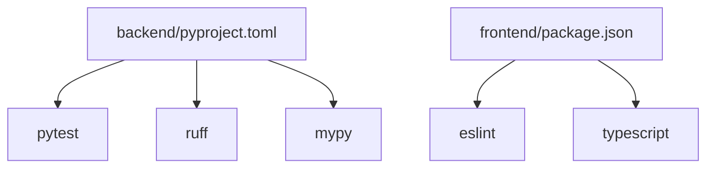

**Diagram sources**
- [backend/pyproject.toml:44-51](file://backend/pyproject.toml#L44-L51)
- [frontend/package.json:33-46](file://frontend/package.json#L33-L46)

**Section sources**
- [backend/pyproject.toml:44-51](file://backend/pyproject.toml#L44-L51)
- [frontend/package.json:33-46](file://frontend/package.json#L33-L46)

## Performance Considerations
- Backend: connection pooling, pagination, Redis caching, background jobs via RQ
- Frontend: code splitting, RTK Query caching, sourcemaps disabled in production
- Scalability: horizontal scaling via stateless backend instances, shared Redis queues, read replicas for heavy reports

**Section sources**
- [docs/ARCHITECTURE.md:313-335](file://docs/ARCHITECTURE.md#L313-L335)

## Troubleshooting Guide
- Development: docker-compose logs, health checks, environment variable verification
- Production: Traefik logs for TLS, Redis connectivity for JWT blocklist, database connectivity, worker queue status
- Common issues: Redis down (fail-closed), migration status, DNS/ACME certificate acquisition

**Section sources**
- [docs/DEPLOYMENT.md:335-407](file://docs/DEPLOYMENT.md#L335-L407)

## Conclusion
These guidelines establish a consistent, secure, and scalable development process across the backend, frontend, and documentation. Contributors should follow branch strategies, commit standards, PR workflows, and security practices outlined here to ensure high-quality contributions aligned with the multi-tenant architecture and production-grade deployment targets.

## Appendices
- Development plan highlights multi-tenancy, temporal isolation, responsive design, and contextual AI—guiding feature priorities and quality checkpoints.

**Section sources**
- [development-plan.md:1-91](file://development-plan.md#L1-L91)