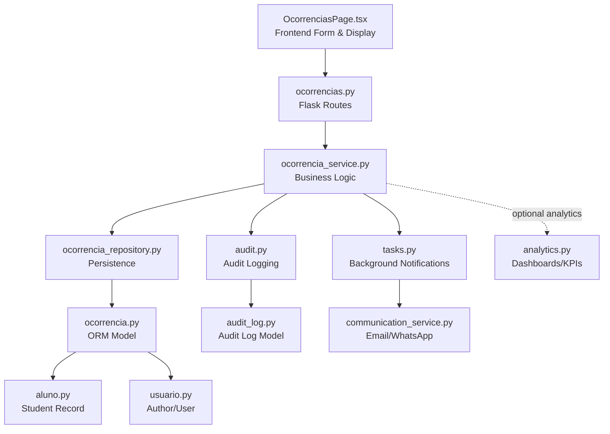
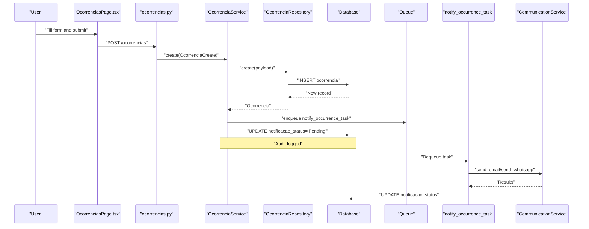
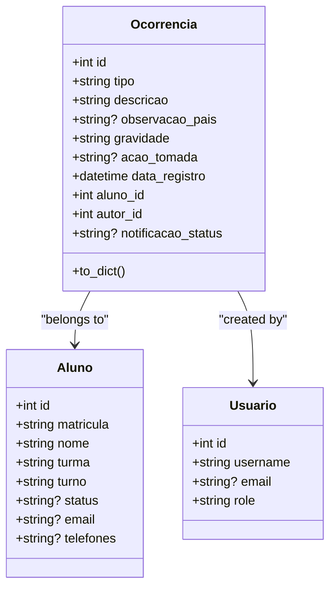
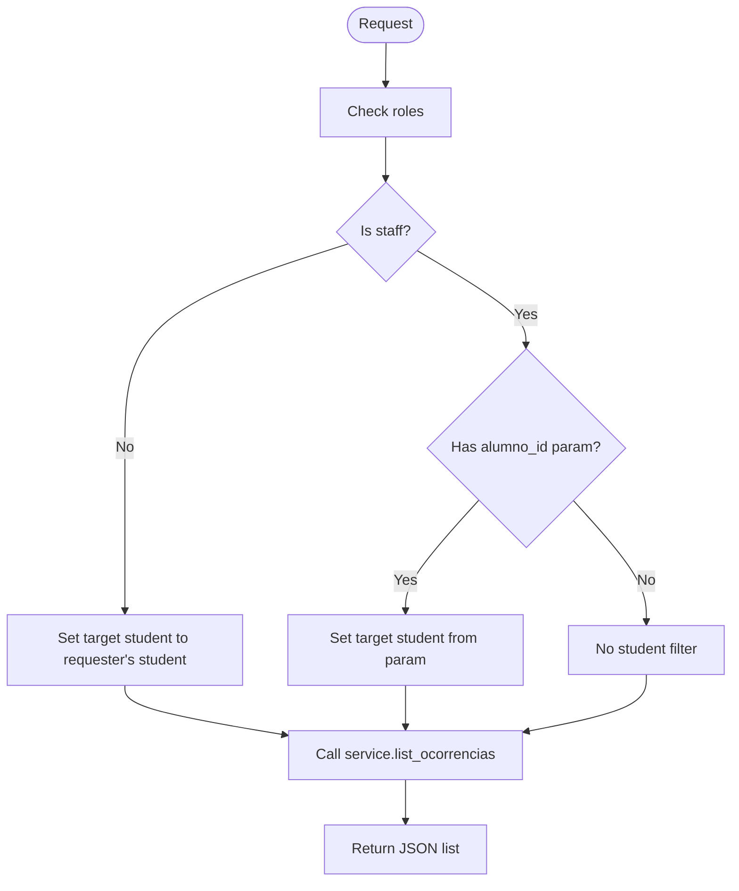
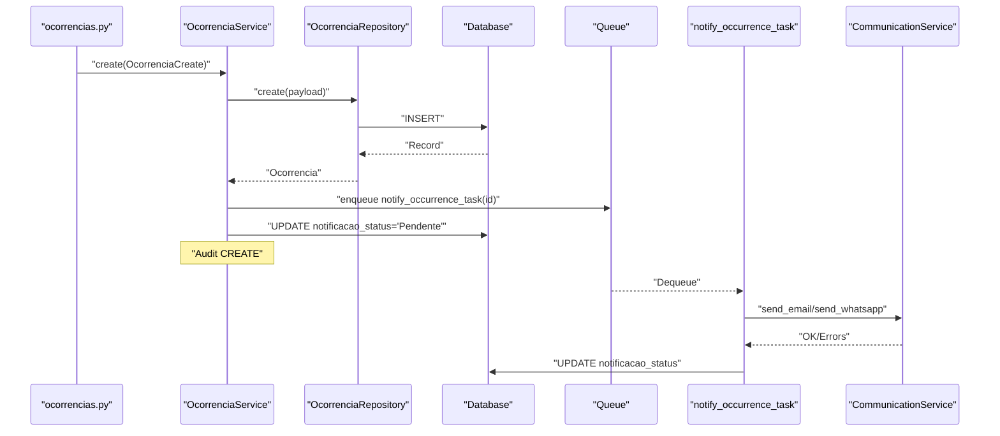
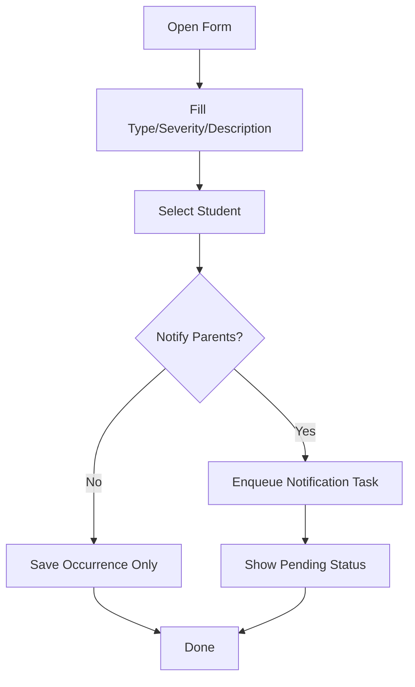
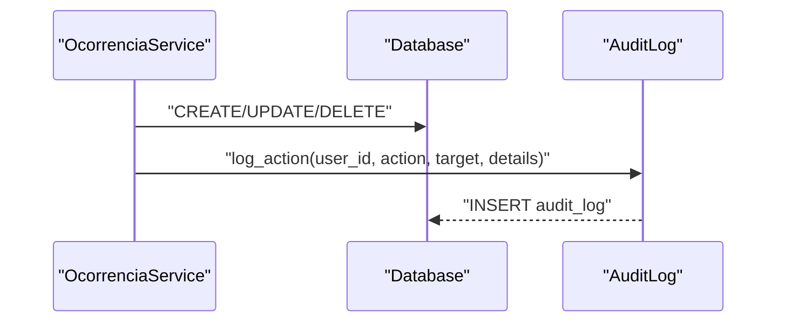
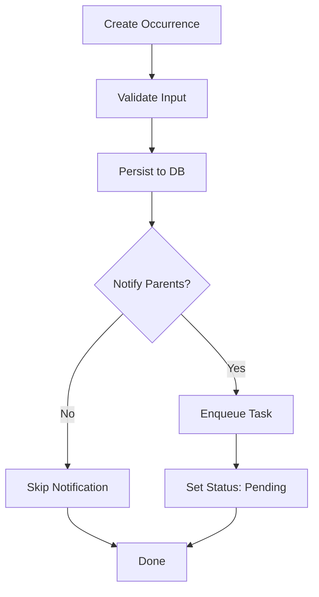
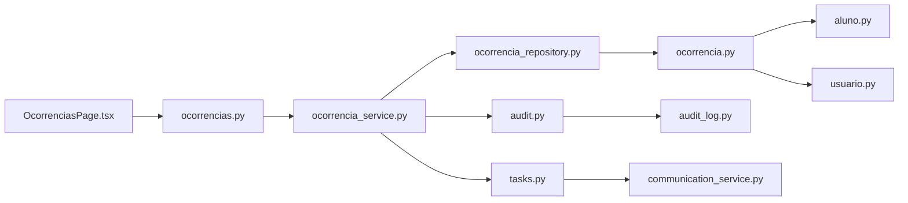

# Disciplinary System

<cite>
**Referenced Files in This Document**
- [ocorrencia.py](file://backend/app/models/ocorrencia.py)
- [ocorrencias.py](file://backend/app/api/v1/ocorrencias.py)
- [ocorrencia_service.py](file://backend/app/services/ocorrencia_service.py)
- [ocorrencia_repository.py](file://backend/app/repositories/ocorrencia_repository.py)
- [ocorrencia.py](file://backend/app/schemas/ocorrencia.py)
- [OcorrenciasPage.tsx](file://frontend/src/features/ocorrencias/OcorrenciasPage.tsx)
- [tasks.py](file://backend/app/core/tasks.py)
- [communication_service.py](file://backend/app/services/communication_service.py)
- [audit.py](file://backend/app/services/audit.py)
- [audit_log.py](file://backend/app/models/audit_log.py)
- [aluno.py](file://backend/app/models/aluno.py)
- [usuario.py](file://backend/app/models/usuario.py)
- [analytics.py](file://backend/app/services/analytics.py)
- [50489374deb2_create_ocorrencias_table.py](file://backend/migrations/versions/50489374deb2_create_ocorrencias_table.py)
</cite>

## Table of Contents
1. [Introduction](#introduction)
2. [Project Structure](#project-structure)
3. [Core Components](#core-components)
4. [Architecture Overview](#architecture-overview)
5. [Detailed Component Analysis](#detailed-component-analysis)
6. [Dependency Analysis](#dependency-analysis)
7. [Performance Considerations](#performance-considerations)
8. [Troubleshooting Guide](#troubleshooting-guide)
9. [Conclusion](#conclusion)
10. [Appendices](#appendices)

## Introduction
This document explains the disciplinary system that captures, classifies, tracks, and communicates student conduct incidents. It covers:
- Incident reporting and creation
- Severity classification and occurrence types
- Historical tracking and audit
- Administrative workflows and stakeholder communication
- Integration with student records and academic impact
- Trend analysis and policy compliance

The system is implemented with a clear separation of concerns: API endpoints authorize and route operations, services encapsulate business logic, repositories handle persistence, and background tasks manage notifications. Frontend provides a guided form and visualization of occurrences.

## Project Structure
The disciplinary system spans backend models, APIs, services, repositories, and frontend pages, plus supporting infrastructure for notifications and audit.

**Diagram sources**
- [OcorrenciasPage.tsx:1-658](file://frontend/src/features/ocorrencias/OcorrenciasPage.tsx#L1-L658)
- [ocorrencias.py:1-109](file://backend/app/api/v1/ocorrencias.py#L1-L109)
- [ocorrencia_service.py:1-134](file://backend/app/services/ocorrencia_service.py#L1-L134)
- [ocorrencia_repository.py:1-27](file://backend/app/repositories/ocorrencia_repository.py#L1-L27)
- [ocorrencia.py:1-45](file://backend/app/models/ocorrencia.py#L1-L45)
- [audit.py:1-17](file://backend/app/services/audit.py#L1-L17)
- [audit_log.py:1-29](file://backend/app/models/audit_log.py#L1-L29)
- [tasks.py:1-78](file://backend/app/core/tasks.py#L1-L78)
- [communication_service.py:1-61](file://backend/app/services/communication_service.py#L1-L61)
- [aluno.py:1-36](file://backend/app/models/aluno.py#L1-L36)
- [usuario.py:1-30](file://backend/app/models/usuario.py#L1-L30)
- [analytics.py:1-196](file://backend/app/services/analytics.py#L1-L196)

**Section sources**
- [ocorrencia.py:1-45](file://backend/app/models/ocorrencia.py#L1-L45)
- [ocorrencias.py:1-109](file://backend/app/api/v1/ocorrencias.py#L1-L109)
- [ocorrencia_service.py:1-134](file://backend/app/services/ocorrencia_service.py#L1-L134)
- [ocorrencia_repository.py:1-27](file://backend/app/repositories/ocorrencia_repository.py#L1-L27)
- [OcorrenciasPage.tsx:1-658](file://frontend/src/features/ocorrencias/OcorrenciasPage.tsx#L1-L658)
- [tasks.py:1-78](file://backend/app/core/tasks.py#L1-L78)
- [communication_service.py:1-61](file://backend/app/services/communication_service.py#L1-L61)
- [audit.py:1-17](file://backend/app/services/audit.py#L1-L17)
- [audit_log.py:1-29](file://backend/app/models/audit_log.py#L1-L29)
- [aluno.py:1-36](file://backend/app/models/aluno.py#L1-L36)
- [usuario.py:1-30](file://backend/app/models/usuario.py#L1-L30)
- [analytics.py:1-196](file://backend/app/services/analytics.py#L1-L196)

## Core Components
- Occurrence model defines fields for type, description, severity, actions taken, timestamps, and notification status, with foreign keys to student and author.
- API endpoints expose listing, creation, updates, and deletion with role-based authorization.
- Service layer validates inputs, persists records, optionally enqueues notifications, and logs audits.
- Repository applies tenant and academic-year scoping and supports filtered queries.
- Background task sends email and/or WhatsApp notifications and updates status.
- Frontend provides a guided form for creating/editing occurrences, severity/type chips, and notification status indicators.

Key capabilities:
- Occurrence types: e.g., warning, praise, lateness, suspension, other.
- Severity levels: e.g., light, medium, serious, very serious.
- Historical tracking: persisted model, audit logs, and notification status.
- Stakeholder communication: email and WhatsApp via configurable integrations.
- Academic context: integrates with student records and can be correlated with grade analytics.

**Section sources**
- [ocorrencia.py:9-45](file://backend/app/models/ocorrencia.py#L9-L45)
- [ocorrencias.py:12-109](file://backend/app/api/v1/ocorrencias.py#L12-L109)
- [ocorrencia_service.py:36-90](file://backend/app/services/ocorrencia_service.py#L36-L90)
- [ocorrencia_repository.py:12-27](file://backend/app/repositories/ocorrencia_repository.py#L12-L27)
- [OcorrenciasPage.tsx:58-71](file://frontend/src/features/ocorrencias/OcorrenciasPage.tsx#L58-L71)
- [tasks.py:6-77](file://backend/app/core/tasks.py#L6-L77)
- [audit.py:4-16](file://backend/app/services/audit.py#L4-L16)

## Architecture Overview
The system follows layered architecture:
- Presentation: React frontend renders forms and lists occurrences.
- API: Flask routes validate roles and delegate to services.
- Services: Orchestrate persistence, notifications, and auditing.
- Persistence: SQLAlchemy ORM models and repositories.
- Infrastructure: Background task queue and communication service.

**Diagram sources**
- [OcorrenciasPage.tsx:137-164](file://frontend/src/features/ocorrencias/OcorrenciasPage.tsx#L137-L164)
- [ocorrencias.py:39-63](file://backend/app/api/v1/ocorrencias.py#L39-L63)
- [ocorrencia_service.py:36-90](file://backend/app/services/ocorrencia_service.py#L36-L90)
- [ocorrencia_repository.py:8-27](file://backend/app/repositories/ocorrencia_repository.py#L8-L27)
- [tasks.py:6-77](file://backend/app/core/tasks.py#L6-L77)
- [communication_service.py:10-61](file://backend/app/services/communication_service.py#L10-L61)
- [audit.py:4-16](file://backend/app/services/audit.py#L4-L16)

## Detailed Component Analysis

### Data Model and Fields
The occurrence model stores:
- Identity and metadata: id, timestamps, tenant and academic-year scoping.
- Classification: type, severity.
- Description and resolution: description, action taken, observation for parents.
- Relationships: student and author.
- Notification status: pending, sent, error variants.

**Diagram sources**
- [ocorrencia.py:9-45](file://backend/app/models/ocorrencia.py#L9-L45)
- [aluno.py:8-36](file://backend/app/models/aluno.py#L8-L36)
- [usuario.py:8-30](file://backend/app/models/usuario.py#L8-L30)

**Section sources**
- [ocorrencia.py:9-45](file://backend/app/models/ocorrencia.py#L9-L45)
- [aluno.py:8-36](file://backend/app/models/aluno.py#L8-L36)
- [usuario.py:8-30](file://backend/app/models/usuario.py#L8-L30)

### API Endpoints and Authorization
- GET /ocorrencias: Lists occurrences with role-aware filtering and optional student scope.
- POST /ocorrencias: Creates an occurrence with role checks and schema validation.
- PATCH /ocorrencias/:id: Updates an occurrence with role checks.
- DELETE /ocorrencias/:id: Deletes an occurrence with role checks.

Authorization roles include admin, professor, coordinator, director, advisor.

**Diagram sources**
- [ocorrencias.py:12-38](file://backend/app/api/v1/ocorrencias.py#L12-L38)

**Section sources**
- [ocorrencias.py:12-109](file://backend/app/api/v1/ocorrencias.py#L12-L109)

### Service Layer: Creation, Escalation, and Auditing
- Creation: Validates and normalizes date, persists occurrence, optionally enqueues notification, sets pending status, and logs audit.
- Update: Applies partial updates and logs audit.
- Delete: Removes occurrence and logs audit.
- Notification escalation: Enqueues background task; task sends email and/or WhatsApp; updates status accordingly.

**Diagram sources**
- [ocorrencia_service.py:36-90](file://backend/app/services/ocorrencia_service.py#L36-L90)
- [tasks.py:6-77](file://backend/app/core/tasks.py#L6-L77)
- [communication_service.py:10-61](file://backend/app/services/communication_service.py#L10-L61)
- [audit.py:4-16](file://backend/app/services/audit.py#L4-L16)

**Section sources**
- [ocorrencia_service.py:36-134](file://backend/app/services/ocorrencia_service.py#L36-L134)
- [tasks.py:6-77](file://backend/app/core/tasks.py#L6-L77)
- [communication_service.py:10-61](file://backend/app/services/communication_service.py#L10-L61)
- [audit.py:4-16](file://backend/app/services/audit.py#L4-L16)

### Frontend: Forms, Type/Severity Chips, and Notification Status
- Type configuration: maps occurrence types to icons, colors, and labels.
- Severity configuration: maps severity levels to colors and labels.
- Form fields: student selection, date, type, severity, description, action taken, observation for parents, and optional notification toggle.
- Display: cards with severity chips, action notes, registration date, notification status chip, and resolution indicator.

**Diagram sources**
- [OcorrenciasPage.tsx:58-71](file://frontend/src/features/ocorrencias/OcorrenciasPage.tsx#L58-L71)
- [OcorrenciasPage.tsx:137-164](file://frontend/src/features/ocorrencias/OcorrenciasPage.tsx#L137-L164)
- [OcorrenciasPage.tsx:413-423](file://frontend/src/features/ocorrencias/OcorrenciasPage.tsx#L413-L423)

**Section sources**
- [OcorrenciasPage.tsx:58-71](file://frontend/src/features/ocorrencias/OcorrenciasPage.tsx#L58-L71)
- [OcorrenciasPage.tsx:137-164](file://frontend/src/features/ocorrencias/OcorrenciasPage.tsx#L137-L164)
- [OcorrenciasPage.tsx:413-423](file://frontend/src/features/ocorrencias/OcorrenciasPage.tsx#L413-L423)

### Historical Tracking and Audit
- Audit logging: each create/update/delete writes an audit log entry with user, action, target, and details.
- Occurrence history: listing ordered by most recent registration; repository applies tenant and academic-year scoping.

**Diagram sources**
- [audit.py:4-16](file://backend/app/services/audit.py#L4-L16)
- [audit_log.py:7-29](file://backend/app/models/audit_log.py#L7-L29)
- [ocorrencia_service.py:71-108](file://backend/app/services/ocorrencia_service.py#L71-L108)

**Section sources**
- [audit.py:4-16](file://backend/app/services/audit.py#L4-L16)
- [audit_log.py:7-29](file://backend/app/models/audit_log.py#L7-L29)
- [ocorrencia_repository.py:12-27](file://backend/app/repositories/ocorrencia_repository.py#L12-L27)

### Administrative Workflows and Escalation
- Creation workflow: form submission → validation → persistence → optional notification enqueue → audit.
- Update workflow: fetch existing → partial update → audit.
- Deletion workflow: remove → audit.
- Notification escalation: background task attempts email and WhatsApp; updates status to sent, error, or failure.

**Diagram sources**
- [ocorrencia_service.py:36-90](file://backend/app/services/ocorrencia_service.py#L36-L90)
- [tasks.py:6-77](file://backend/app/core/tasks.py#L6-L77)

**Section sources**
- [ocorrencia_service.py:36-134](file://backend/app/services/ocorrencia_service.py#L36-L134)
- [tasks.py:6-77](file://backend/app/core/tasks.py#L6-L77)

### Reporting Mechanisms and Policy Compliance
- Notification channels: email and WhatsApp via configured integrations.
- Status tracking: pending, sent, error variants help track compliance.
- Audit trail: supports policy and regulatory compliance by recording who did what and when.

**Section sources**
- [communication_service.py:10-61](file://backend/app/services/communication_service.py#L10-L61)
- [tasks.py:6-77](file://backend/app/core/tasks.py#L6-L77)
- [audit.py:4-16](file://backend/app/services/audit.py#L4-L16)

### Academic Impact and Integration with Student Records
- Occurrences are associated with a student and author, enabling correlation with academic records.
- Analytics services demonstrate how student data is aggregated; disciplinary data can be joined similarly for risk or trend analysis.

**Section sources**
- [aluno.py:8-36](file://backend/app/models/aluno.py#L8-L36)
- [analytics.py:35-84](file://backend/app/services/analytics.py#L35-L84)

## Dependency Analysis
- API depends on JWT identity and roles, delegates to service.
- Service depends on repository, optional queue, and audit.
- Repository depends on SQLAlchemy and tenant/year scoping.
- Model depends on base mixin for tenant and academic-year fields.
- Background task depends on communication service and updates occurrence status.
- Frontend depends on API hooks for CRUD operations.

**Diagram sources**
- [ocorrencias.py:1-109](file://backend/app/api/v1/ocorrencias.py#L1-L109)
- [ocorrencia_service.py:1-134](file://backend/app/services/ocorrencia_service.py#L1-L134)
- [ocorrencia_repository.py:1-27](file://backend/app/repositories/ocorrencia_repository.py#L1-L27)
- [ocorrencia.py:1-45](file://backend/app/models/ocorrencia.py#L1-L45)
- [audit.py:1-17](file://backend/app/services/audit.py#L1-L17)
- [audit_log.py:1-29](file://backend/app/models/audit_log.py#L1-L29)
- [tasks.py:1-78](file://backend/app/core/tasks.py#L1-L78)
- [communication_service.py:1-61](file://backend/app/services/communication_service.py#L1-L61)
- [OcorrenciasPage.tsx:1-658](file://frontend/src/features/ocorrencias/OcorrenciasPage.tsx#L1-L658)
- [aluno.py:1-36](file://backend/app/models/aluno.py#L1-L36)
- [usuario.py:1-30](file://backend/app/models/usuario.py#L1-L30)

**Section sources**
- [ocorrencias.py:1-109](file://backend/app/api/v1/ocorrencias.py#L1-L109)
- [ocorrencia_service.py:1-134](file://backend/app/services/ocorrencia_service.py#L1-L134)
- [ocorrencia_repository.py:1-27](file://backend/app/repositories/ocorrencia_repository.py#L1-L27)
- [ocorrencia.py:1-45](file://backend/app/models/ocorrencia.py#L1-L45)
- [audit.py:1-17](file://backend/app/services/audit.py#L1-L17)
- [audit_log.py:1-29](file://backend/app/models/audit_log.py#L1-L29)
- [tasks.py:1-78](file://backend/app/core/tasks.py#L1-L78)
- [communication_service.py:1-61](file://backend/app/services/communication_service.py#L1-L61)
- [OcorrenciasPage.tsx:1-658](file://frontend/src/features/ocorrencias/OcorrenciasPage.tsx#L1-L658)
- [aluno.py:1-36](file://backend/app/models/aluno.py#L1-L36)
- [usuario.py:1-30](file://backend/app/models/usuario.py#L1-L30)

## Performance Considerations
- Filtering and sorting: repository orders by newest and applies tenant/year filters; consider indexing on tenant_id, academic_year_id, aluno_id, and data_registro for large datasets.
- Background notifications: offload email/WhatsApp to a queue to avoid blocking API responses.
- Audit writes: minimal overhead; ensure audit table is indexed on relevant columns for reporting.
- Frontend pagination: use server-side pagination for large occurrence lists to reduce payload sizes.

[No sources needed since this section provides general guidance]

## Troubleshooting Guide
- Access denied: ensure requesting user has required roles (admin, professor, coordinator, director, advisor).
- Notification failures: check email/WhatsApp credentials and endpoints; review occurrence notificacao_status for “Erro” or “Falha”.
- Missing student data: verify student has email/phones configured; otherwise notifications will not be sent.
- Audit gaps: confirm audit logging is invoked on create/update/delete; verify audit_log table exists and is writable.

**Section sources**
- [ocorrencias.py:44-95](file://backend/app/api/v1/ocorrencias.py#L44-L95)
- [tasks.py:65-77](file://backend/app/core/tasks.py#L65-L77)
- [communication_service.py:32-60](file://backend/app/services/communication_service.py#L32-L60)
- [audit.py:4-16](file://backend/app/services/audit.py#L4-L16)

## Conclusion
The disciplinary system provides a robust foundation for capturing and managing student conduct incidents. It supports clear classification, historical tracking, timely communication with stakeholders, and compliance through audit logs. The modular design enables customization of occurrence types, severity levels, and escalation workflows while maintaining strong ties to student records and academic analytics.

[No sources needed since this section summarizes without analyzing specific files]

## Appendices

### Migration and Schema Notes
- Occurrences table migration exists and can be reviewed for schema changes and rollback procedures.

**Section sources**
- [50489374deb2_create_ocorrencias_table.py:21-54](file://backend/migrations/versions/50489374deb2_create_ocorrencias_table.py#L21-L54)

### Example References
- Occurrence creation flow: [OcorrenciasPage.tsx:137-164](file://frontend/src/features/ocorrencias/OcorrenciasPage.tsx#L137-L164), [ocorrencias.py:39-63](file://backend/app/api/v1/ocorrencias.py#L39-L63), [ocorrencia_service.py:36-90](file://backend/app/services/ocorrencia_service.py#L36-L90)
- Escalation workflow: [ocorrencia_service.py:60-69](file://backend/app/services/ocorrencia_service.py#L60-L69), [tasks.py:6-77](file://backend/app/core/tasks.py#L6-L77)
- Historical tracking: [ocorrencia_repository.py:12-27](file://backend/app/repositories/ocorrencia_repository.py#L12-L27), [audit.py:4-16](file://backend/app/services/audit.py#L4-L16)