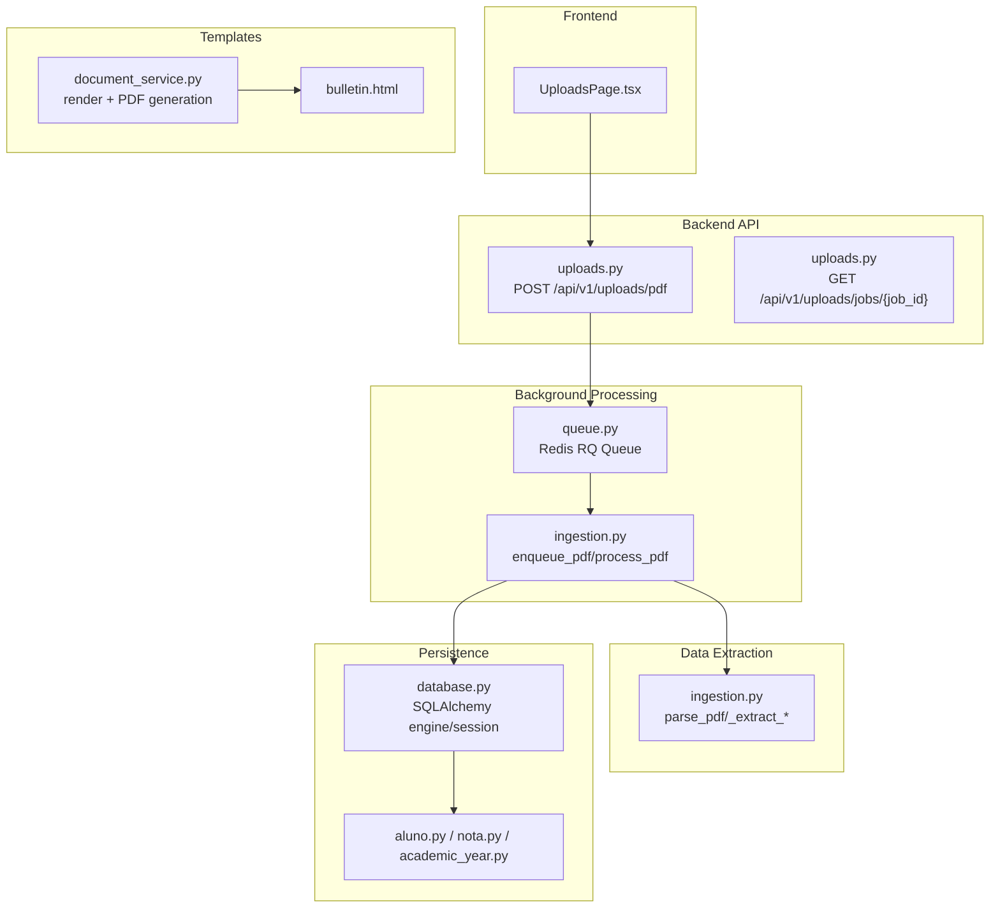
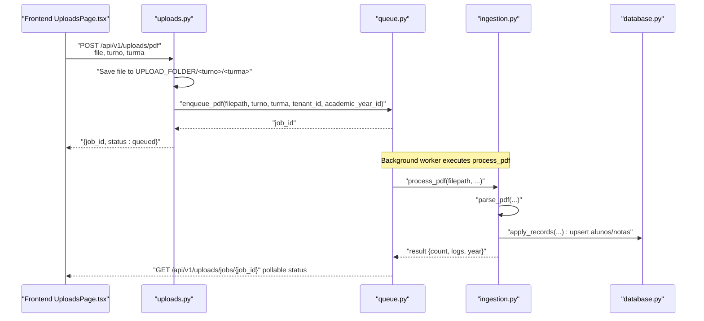
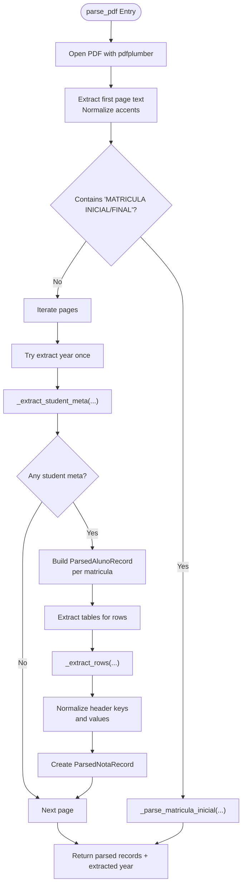
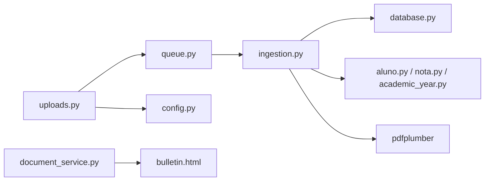
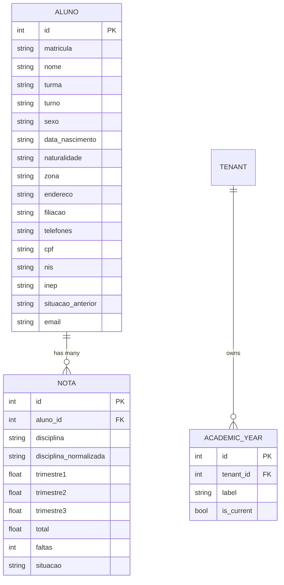

# Document Processing

<cite>
**Referenced Files in This Document**
- [uploads.py](file://backend/app/api/v1/uploads.py)
- [ingestion.py](file://backend/app/services/ingestion.py)
- [document_service.py](file://backend/app/services/document_service.py)
- [queue.py](file://backend/app/core/queue.py)
- [config.py](file://backend/app/core/config.py)
- [database.py](file://backend/app/core/database.py)
- [bulletin.html](file://backend/app/templates/documents/bulletin.html)
- [aluno.py](file://backend/app/models/aluno.py)
- [nota.py](file://backend/app/models/nota.py)
- [academic_year.py](file://backend/app/models/academic_year.py)
- [test_ingestion.py](file://backend/tests/test_ingestion.py)
- [UploadsPage.tsx](file://frontend/src/features/uploads/UploadsPage.tsx)
</cite>

## Table of Contents
1. [Introduction](#introduction)
2. [Project Structure](#project-structure)
3. [Core Components](#core-components)
4. [Architecture Overview](#architecture-overview)
5. [Detailed Component Analysis](#detailed-component-analysis)
6. [Dependency Analysis](#dependency-analysis)
7. [Performance Considerations](#performance-considerations)
8. [Troubleshooting Guide](#troubleshooting-guide)
9. [Conclusion](#conclusion)
10. [Appendices](#appendices)

## Introduction
This document explains the document processing section with a focus on the PDF ingestion pipeline, data extraction algorithms, and automated processing workflows. It covers how uploaded PDFs are stored, enqueued for background processing, parsed into structured records, validated, and persisted into the database. It also documents the integration with storage systems, background workers, and data transformation, including practical examples from the codebase and guidance for administrators and developers extending the pipeline.

## Project Structure
The document processing capability spans the API layer, service layer, background job infrastructure, persistence layer, and templates. The frontend provides a user interface to trigger ingestion and monitor progress.

**Diagram sources**
- [uploads.py:16-78](file://backend/app/api/v1/uploads.py#L16-L78)
- [queue.py:1-12](file://backend/app/core/queue.py#L1-L12)
- [ingestion.py:72-121](file://backend/app/services/ingestion.py#L72-L121)
- [database.py:36-129](file://backend/app/core/database.py#L36-L129)
- [aluno.py:8-36](file://backend/app/models/aluno.py#L8-L36)
- [nota.py:9-24](file://backend/app/models/nota.py#L9-L24)
- [academic_year.py:6-16](file://backend/app/models/academic_year.py#L6-L16)
- [document_service.py:6-27](file://backend/app/services/document_service.py#L6-L27)
- [bulletin.html:1-345](file://backend/app/templates/documents/bulletin.html#L1-L345)
- [UploadsPage.tsx:22-209](file://frontend/src/features/uploads/UploadsPage.tsx#L22-L209)

**Section sources**
- [uploads.py:1-84](file://backend/app/api/v1/uploads.py#L1-L84)
- [queue.py:1-12](file://backend/app/core/queue.py#L1-L12)
- [ingestion.py:1-635](file://backend/app/services/ingestion.py#L1-L635)
- [database.py:1-130](file://backend/app/core/database.py#L1-L130)
- [aluno.py:1-36](file://backend/app/models/aluno.py#L1-L36)
- [nota.py:1-24](file://backend/app/models/nota.py#L1-L24)
- [academic_year.py:1-16](file://backend/app/models/academic_year.py#L1-L16)
- [document_service.py:1-27](file://backend/app/services/document_service.py#L1-L27)
- [bulletin.html:1-345](file://backend/app/templates/documents/bulletin.html#L1-L345)
- [UploadsPage.tsx:1-209](file://frontend/src/features/uploads/UploadsPage.tsx#L1-L209)

## Core Components
- Upload endpoint: Validates form inputs, saves the PDF under a tenant-aware folder structure, and enqueues a background job.
- Background job: Parses the PDF, normalizes data, resolves academic year, upserts students and grades, and returns processing results.
- Persistence: Uses SQLAlchemy with tenant and academic year scoping; ensures multi-tenant isolation and per-year filtering.
- Templates and PDF generation: Renders HTML bulletins and converts them to PDF for downstream use.

Key implementation references:
- Upload endpoint and job status: [uploads.py:16-78](file://backend/app/api/v1/uploads.py#L16-L78)
- Background queue and job scheduling: [queue.py:1-12](file://backend/app/core/queue.py#L1-L12)
- PDF parsing and application logic: [ingestion.py:72-121](file://backend/app/services/ingestion.py#L72-L121)
- Student and grade models: [aluno.py:8-36](file://backend/app/models/aluno.py#L8-L36), [nota.py:9-24](file://backend/app/models/nota.py#L9-L24)
- Academic year model: [academic_year.py:6-16](file://backend/app/models/academic_year.py#L6-L16)
- Template-driven PDF generation: [document_service.py:6-27](file://backend/app/services/document_service.py#L6-L27), [bulletin.html:1-345](file://backend/app/templates/documents/bulletin.html#L1-L345)
- Frontend upload UI and polling: [UploadsPage.tsx:22-209](file://frontend/src/features/uploads/UploadsPage.tsx#L22-L209)

**Section sources**
- [uploads.py:16-78](file://backend/app/api/v1/uploads.py#L16-L78)
- [queue.py:1-12](file://backend/app/core/queue.py#L1-L12)
- [ingestion.py:72-121](file://backend/app/services/ingestion.py#L72-L121)
- [aluno.py:8-36](file://backend/app/models/aluno.py#L8-L36)
- [nota.py:9-24](file://backend/app/models/nota.py#L9-L24)
- [academic_year.py:6-16](file://backend/app/models/academic_year.py#L6-L16)
- [document_service.py:6-27](file://backend/app/services/document_service.py#L6-L27)
- [bulletin.html:1-345](file://backend/app/templates/documents/bulletin.html#L1-L345)
- [UploadsPage.tsx:22-209](file://frontend/src/features/uploads/UploadsPage.tsx#L22-L209)

## Architecture Overview
The ingestion pipeline follows a request-response pattern with asynchronous background processing:

**Diagram sources**
- [uploads.py:16-78](file://backend/app/api/v1/uploads.py#L16-L78)
- [queue.py:1-12](file://backend/app/core/queue.py#L1-L12)
- [ingestion.py:72-121](file://backend/app/services/ingestion.py#L72-L121)
- [database.py:118-129](file://backend/app/core/database.py#L118-L129)
- [UploadsPage.tsx:30-70](file://frontend/src/features/uploads/UploadsPage.tsx#L30-L70)

## Detailed Component Analysis

### Upload Endpoint and File Handling
- Validates presence of file and required form fields (turno, turma).
- Normalizes segments for safe filesystem paths.
- Saves file under a tenant-aware directory structure derived from UPLOAD_FOLDER.
- Enqueues a background job with tenant and academic year context.

Concrete references:
- Validation and save: [uploads.py:18-35](file://backend/app/api/v1/uploads.py#L18-L35)
- Enqueue job with context: [uploads.py:38-44](file://backend/app/api/v1/uploads.py#L38-L44)
- Job status retrieval: [uploads.py:58-76](file://backend/app/api/v1/uploads.py#L58-L76)
- Upload directory configuration: [config.py](file://backend/app/core/config.py#L16)

Operational notes:
- The endpoint returns HTTP 202 Accepted with job metadata to support asynchronous processing.
- The frontend polls the job status endpoint to reflect progress and completion.

**Section sources**
- [uploads.py:16-78](file://backend/app/api/v1/uploads.py#L16-L78)
- [config.py](file://backend/app/core/config.py#L16)

### Background Job Processing and Queue
- Redis-backed RQ queue is configured with a default queue.
- The upload endpoint enqueues a job targeting the PDF processing function.
- The job fetches its status via the jobs API.

Concrete references:
- Queue initialization: [queue.py:1-12](file://backend/app/core/queue.py#L1-L12)
- Enqueue call site: [uploads.py:38-44](file://backend/app/api/v1/uploads.py#L38-L44)
- Job status endpoint: [uploads.py:58-76](file://backend/app/api/v1/uploads.py#L58-L76)

Operational notes:
- Jobs are persisted in Redis; ensure Redis availability and appropriate timeouts.
- The job carries metadata and result for UI feedback.

**Section sources**
- [queue.py:1-12](file://backend/app/core/queue.py#L1-L12)
- [uploads.py:38-76](file://backend/app/api/v1/uploads.py#L38-L76)

### PDF Parsing and Data Extraction
The parser supports two formats: standard bulletin and Matrícula Inicial/Final. It extracts student metadata, normalizes headers, and builds normalized discipline records.

Key algorithms and flows:
- Detects format by scanning the first page text for known markers.
- Extracts student blocks or rows depending on format.
- Normalizes discipline names and headers to a canonical slug.
- Resolves academic year from PDF content or uses provided tenant context.

Concrete references:
- Enqueue and processing entry: [ingestion.py:72-121](file://backend/app/services/ingestion.py#L72-L121)
- Standard bulletin parsing loop: [ingestion.py:141-223](file://backend/app/services/ingestion.py#L141-L223)
- Matrícula Inicial/Final parsing: [ingestion.py:226-299](file://backend/app/services/ingestion.py#L226-L299)
- Header normalization and slugification: [ingestion.py:555-605](file://backend/app/services/ingestion.py#L555-L605)
- Discipline normalization: [ingestion.py:592-594](file://backend/app/services/ingestion.py#L592-L594)
- Numeric parsing helpers: [ingestion.py:608-627](file://backend/app/services/ingestion.py#L608-L627)

**Diagram sources**
- [ingestion.py:141-223](file://backend/app/services/ingestion.py#L141-L223)
- [ingestion.py:226-299](file://backend/app/services/ingestion.py#L226-L299)
- [ingestion.py:426-442](file://backend/app/services/ingestion.py#L426-L442)
- [ingestion.py:555-605](file://backend/app/services/ingestion.py#L555-L605)

**Section sources**
- [ingestion.py:72-223](file://backend/app/services/ingestion.py#L72-L223)
- [ingestion.py:226-299](file://backend/app/services/ingestion.py#L226-L299)
- [ingestion.py:426-442](file://backend/app/services/ingestion.py#L426-L442)
- [ingestion.py:555-627](file://backend/app/services/ingestion.py#L555-L627)

### Upsert Logic and Data Transformation
- Upserts students by matricula and falls back to name matching to prevent duplicates across formats.
- Updates personal info and class attributes when present.
- Upserts grades per normalized discipline, ensuring deduplication and updates.
- Ensures a user account is associated with each student.

Concrete references:
- Student upsert: [ingestion.py:447-521](file://backend/app/services/ingestion.py#L447-L521)
- Grade upsert: [ingestion.py:524-553](file://backend/app/services/ingestion.py#L524-L553)
- Ensure student user: [ingestion.py](file://backend/app/services/ingestion.py#L491)

Validation and deduplication:
- Academic year resolution and creation if missing: [ingestion.py:93-111](file://backend/app/services/ingestion.py#L93-L111)
- Session-scoped transaction handling: [ingestion.py:124-138](file://backend/app/services/ingestion.py#L124-L138)

**Section sources**
- [ingestion.py:447-553](file://backend/app/services/ingestion.py#L447-L553)
- [ingestion.py:93-111](file://backend/app/services/ingestion.py#L93-L111)
- [ingestion.py:124-138](file://backend/app/services/ingestion.py#L124-L138)

### Persistence Layer and Multi-Tenant Scoping
- Tenant and academic year filters are injected into ORM queries via an event hook.
- Sessions are scoped per request and automatically committed or rolled back.
- Models define tenant and year-aware relationships.

Concrete references:
- ORM event hook and tenant/year filtering: [database.py:39-101](file://backend/app/core/database.py#L39-L101)
- Session context manager: [database.py:118-129](file://backend/app/core/database.py#L118-L129)
- Student model: [aluno.py:8-36](file://backend/app/models/aluno.py#L8-L36)
- Grade model: [nota.py:9-24](file://backend/app/models/nota.py#L9-L24)
- Academic year model: [academic_year.py:6-16](file://backend/app/models/academic_year.py#L6-L16)

**Section sources**
- [database.py:39-101](file://backend/app/core/database.py#L39-L101)
- [database.py:118-129](file://backend/app/core/database.py#L118-L129)
- [aluno.py:8-36](file://backend/app/models/aluno.py#L8-L36)
- [nota.py:9-24](file://backend/app/models/nota.py#L9-L24)
- [academic_year.py:6-16](file://backend/app/models/academic_year.py#L6-L16)

### Template-Based PDF Generation
- HTML template renders individual student bulletins with computed averages and statuses.
- Service converts rendered HTML to PDF in-memory for distribution.

Concrete references:
- PDF generation service: [document_service.py:6-27](file://backend/app/services/document_service.py#L6-L27)
- HTML template: [bulletin.html:1-345](file://backend/app/templates/documents/bulletin.html#L1-L345)

**Section sources**
- [document_service.py:6-27](file://backend/app/services/document_service.py#L6-L27)
- [bulletin.html:1-345](file://backend/app/templates/documents/bulletin.html#L1-L345)

### Frontend Integration and User Experience
- Provides a form to select file, turno, and turma.
- Polls job status periodically and displays success/error messages.
- Shows helpful guidance about folder organization and post-processing visibility.

Concrete references:
- Upload form and polling: [UploadsPage.tsx:22-209](file://frontend/src/features/uploads/UploadsPage.tsx#L22-L209)

**Section sources**
- [UploadsPage.tsx:22-209](file://frontend/src/features/uploads/UploadsPage.tsx#L22-L209)

## Dependency Analysis
The ingestion pipeline exhibits clear separation of concerns with explicit dependencies:

**Diagram sources**
- [uploads.py:1-84](file://backend/app/api/v1/uploads.py#L1-L84)
- [queue.py:1-12](file://backend/app/core/queue.py#L1-L12)
- [ingestion.py:1-635](file://backend/app/services/ingestion.py#L1-L635)
- [database.py:1-130](file://backend/app/core/database.py#L1-L130)
- [aluno.py:1-36](file://backend/app/models/aluno.py#L1-L36)
- [nota.py:1-24](file://backend/app/models/nota.py#L1-L24)
- [academic_year.py:1-16](file://backend/app/models/academic_year.py#L1-L16)
- [document_service.py:1-27](file://backend/app/services/document_service.py#L1-L27)
- [bulletin.html:1-345](file://backend/app/templates/documents/bulletin.html#L1-L345)

**Section sources**
- [uploads.py:1-84](file://backend/app/api/v1/uploads.py#L1-L84)
- [queue.py:1-12](file://backend/app/core/queue.py#L1-L12)
- [ingestion.py:1-635](file://backend/app/services/ingestion.py#L1-L635)
- [database.py:1-130](file://backend/app/core/database.py#L1-L130)
- [aluno.py:1-36](file://backend/app/models/aluno.py#L1-L36)
- [nota.py:1-24](file://backend/app/models/nota.py#L1-L24)
- [academic_year.py:1-16](file://backend/app/models/academic_year.py#L1-L16)
- [document_service.py:1-27](file://backend/app/services/document_service.py#L1-L27)
- [bulletin.html:1-345](file://backend/app/templates/documents/bulletin.html#L1-L345)

## Performance Considerations
- PDF parsing: Iterates pages and tables; ensure PDFs are optimized and avoid unnecessary blank pages.
- Background processing: Use RQ workers scaled according to workload; configure job timeouts appropriately.
- Database writes: Batch-like behavior via per-record upserts; consider tuning PostgreSQL settings for concurrent inserts.
- Tenant and year filtering: Event-based filtering adds minimal overhead; keep tenant/year context consistent across requests.
- Storage: Store uploads on fast disks; consider local SSDs or mounted volumes for high throughput.

[No sources needed since this section provides general guidance]

## Troubleshooting Guide
Common issues and remedies:
- Missing or invalid inputs: The upload endpoint returns 400 if file or turno/turma are absent. Verify frontend selections and network requests.
- Job not found: The job status endpoint returns 404 if the job ID is invalid or expired; ensure polling starts immediately after enqueue.
- Empty or malformed PDF: The parser warns and returns zero processed records; confirm PDF contains expected student metadata and tables.
- Academic year mismatch: If year is not found, a new AcademicYear is created for the tenant; verify tenant context and labels.
- Duplicate student names: Name-based fallback prevents unsafe merges; ensure matricula is present for reliable linking.
- Redis connectivity: If jobs remain stuck, check Redis availability and connection settings.

Concrete references:
- Upload validation and save: [uploads.py:18-35](file://backend/app/api/v1/uploads.py#L18-L35)
- Job status API: [uploads.py:58-76](file://backend/app/api/v1/uploads.py#L58-L76)
- Parsing warnings and counts: [ingestion.py:114-121](file://backend/app/services/ingestion.py#L114-L121)
- Academic year creation: [ingestion.py:93-111](file://backend/app/services/ingestion.py#L93-L111)
- Name ambiguity warning: [ingestion.py:463-467](file://backend/app/services/ingestion.py#L463-L467)
- Redis configuration: [queue.py:5-11](file://backend/app/core/queue.py#L5-L11)

**Section sources**
- [uploads.py:18-76](file://backend/app/api/v1/uploads.py#L18-L76)
- [ingestion.py:93-121](file://backend/app/services/ingestion.py#L93-L121)
- [ingestion.py:463-467](file://backend/app/services/ingestion.py#L463-L467)
- [queue.py:5-11](file://backend/app/core/queue.py#L5-L11)

## Conclusion
The document processing pipeline integrates a robust upload workflow, resilient background processing, precise data extraction, and tenant-aware persistence. Administrators can monitor and operate the system using the provided endpoints and UI, while developers can extend parsing rules, add new formats, or integrate additional transformations without disrupting core flows.

[No sources needed since this section summarizes without analyzing specific files]

## Appendices

### API Definitions
- POST /api/v1/uploads/pdf
  - Headers: Authorization (JWT), Content-Type: multipart/form-data
  - Form fields: file (required), turno (required), turma (required)
  - Response: 202 Accepted with {filename, status, job_id, turno, turma}
- GET /api/v1/uploads/jobs/{job_id}
  - Response: {job_id, status, result, enqueued_at, started_at, ended_at, meta}

**Section sources**
- [uploads.py:16-78](file://backend/app/api/v1/uploads.py#L16-L78)

### Data Models Overview

**Diagram sources**
- [aluno.py:8-36](file://backend/app/models/aluno.py#L8-L36)
- [nota.py:9-24](file://backend/app/models/nota.py#L9-L24)
- [academic_year.py:6-16](file://backend/app/models/academic_year.py#L6-L16)