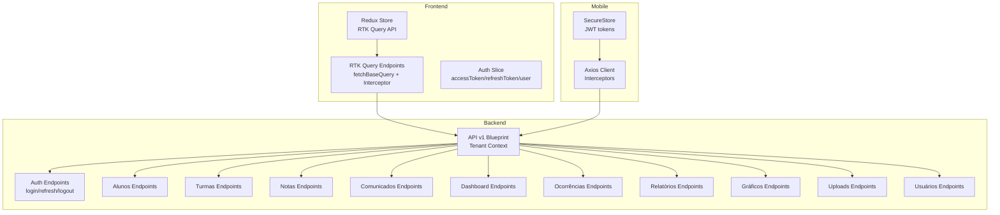
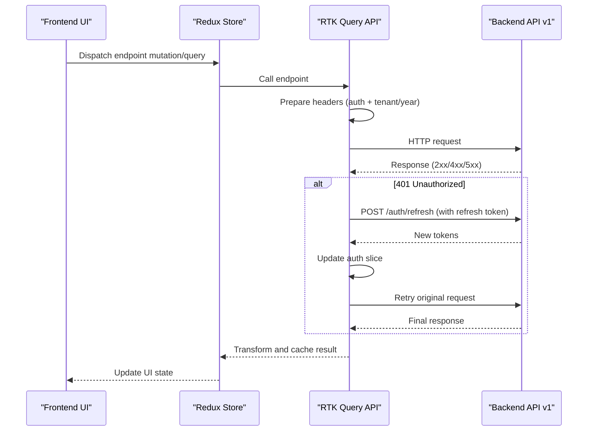
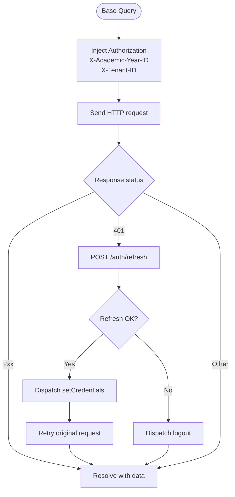
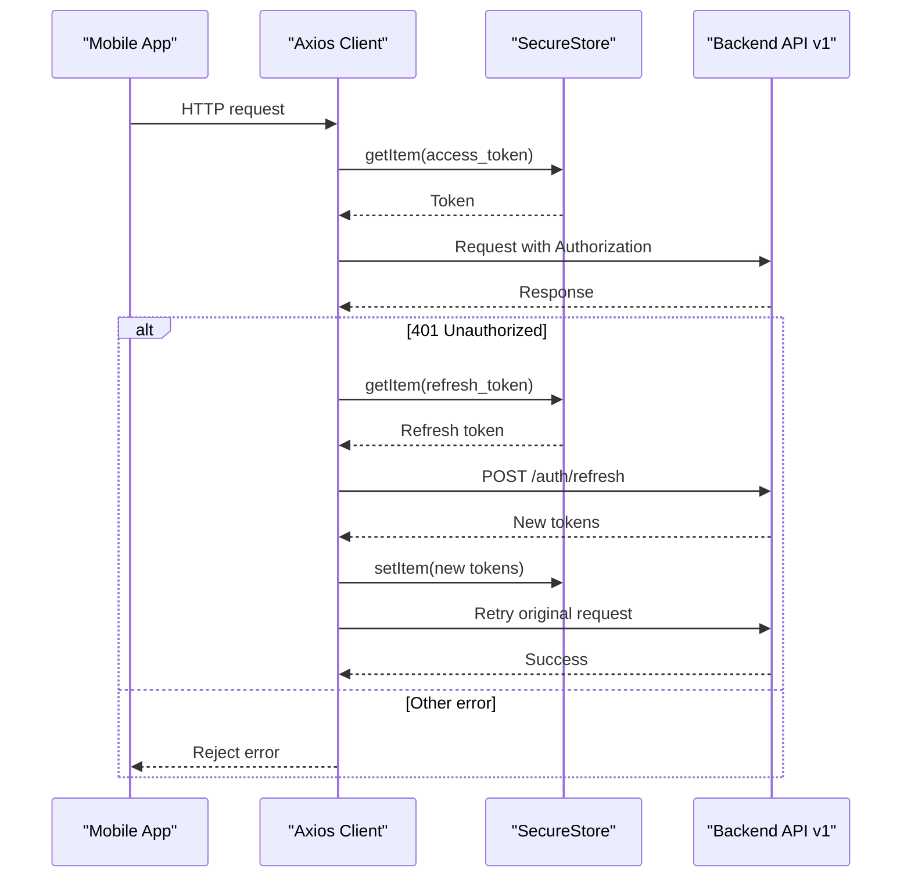
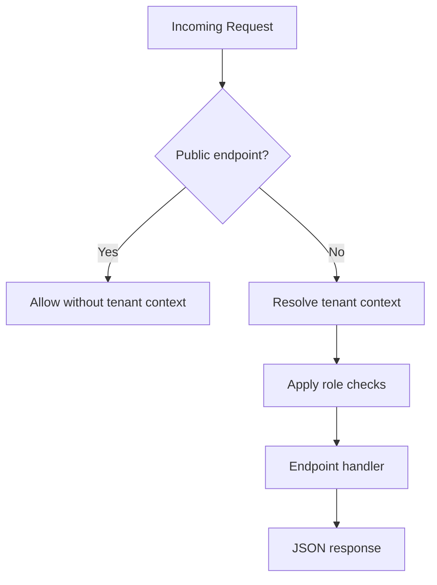
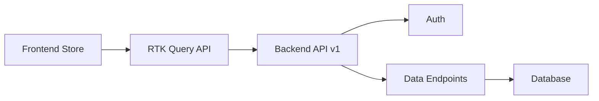

# API Integration and Data Fetching

<cite>
**Referenced Files in This Document**
- [frontend/src/lib/api.ts](file://frontend/src/lib/api.ts)
- [mobile/lib/api.ts](file://mobile/lib/api.ts)
- [backend/app/api/v1/__init__.py](file://backend/app/api/v1/__init__.py)
- [backend/app/api/v1/auth.py](file://backend/app/api/v1/auth.py)
- [backend/app/api/v1/alunos.py](file://backend/app/api/v1/alunos.py)
- [backend/app/api/v1/turmas.py](file://backend/app/api/v1/turmas.py)
- [backend/app/api/v1/notas.py](file://backend/app/api/v1/notas.py)
- [backend/app/api/v1/comunicados.py](file://backend/app/api/v1/comunicados.py)
- [backend/app/api/v1/dashboard.py](file://backend/app/api/v1/dashboard.py)
- [backend/app/api/v1/ocorrencias.py](file://backend/app/api/v1/ocorrencias.py)
- [backend/app/api/v1/relatorios.py](file://backend/app/api/v1/relatorios.py)
- [backend/app/api/v1/graficos.py](file://backend/app/api/v1/graficos.py)
- [backend/app/api/v1/uploads.py](file://backend/app/api/v1/uploads.py)
- [backend/app/api/v1/usuarios.py](file://backend/app/api/v1/usuarios.py)
- [frontend/src/features/auth/authSlice.ts](file://frontend/src/features/auth/authSlice.ts)
- [frontend/src/app/store.ts](file://frontend/src/app/store.ts)
</cite>

## Table of Contents
1. [Introduction](#introduction)
2. [Project Structure](#project-structure)
3. [Core Components](#core-components)
4. [Architecture Overview](#architecture-overview)
5. [Detailed Component Analysis](#detailed-component-analysis)
6. [Dependency Analysis](#dependency-analysis)
7. [Performance Considerations](#performance-considerations)
8. [Troubleshooting Guide](#troubleshooting-guide)
9. [Conclusion](#conclusion)
10. [Appendices](#appendices)

## Introduction
This document explains the API integration layer and data fetching patterns across the frontend, mobile, and backend. It covers client configuration, request/response handling, authentication token management, interceptors, response transformation, pagination, real-time updates, loading/error handling, optimistic updates, organization of API calls, caching, and retry mechanisms. The goal is to provide a practical guide for building robust, maintainable data flows that integrate seamlessly with the backend’s Flask/JWT endpoints.

## Project Structure
The API integration spans three primary layers:
- Frontend (React + RTK Query): Centralized API client with automatic token injection, retry on 401, and tag-based caching invalidation.
- Mobile (Expo + Axios): Centralized client with request/response interceptors for JWT and refresh token handling.
- Backend (Flask + JWT): Versioned API blueprints with role-based access control, pagination, and tenant-aware context.

**Diagram sources**
- [frontend/src/lib/api.ts:409-739](file://frontend/src/lib/api.ts#L409-L739)
- [frontend/src/app/store.ts:7-17](file://frontend/src/app/store.ts#L7-L17)
- [frontend/src/features/auth/authSlice.ts:25-46](file://frontend/src/features/auth/authSlice.ts#L25-L46)
- [mobile/lib/api.ts:11-60](file://mobile/lib/api.ts#L11-L60)
- [backend/app/api/v1/__init__.py:8-21](file://backend/app/api/v1/__init__.py#L8-L21)

**Section sources**
- [frontend/src/lib/api.ts:1-790](file://frontend/src/lib/api.ts#L1-L790)
- [frontend/src/app/store.ts:1-21](file://frontend/src/app/store.ts#L1-L21)
- [frontend/src/features/auth/authSlice.ts:1-50](file://frontend/src/features/auth/authSlice.ts#L1-L50)
- [mobile/lib/api.ts:1-108](file://mobile/lib/api.ts#L1-L108)
- [backend/app/api/v1/__init__.py:1-39](file://backend/app/api/v1/__init__.py#L1-L39)

## Core Components
- Frontend RTK Query API:
  - Base query with automatic Bearer token injection via headers.
  - Automatic 401 handling with refresh flow and fallback logout.
  - Tag-based caching and invalidation for precise cache updates.
  - Strongly typed endpoints for all major resources.
- Mobile Axios Client:
  - Centralized client with request interceptor injecting JWT.
  - Response interceptor handling 401 with refresh token flow.
  - Secure token storage and automatic retry after refresh.
- Backend API v1:
  - Tenant-aware request context resolution.
  - Role-based access control and pagination helpers.
  - Tenant and academic year headers injected by clients.

Key capabilities:
- Authentication: login, refresh, logout, change/reset password.
- Data CRUD: alunos, turmas, notas, comunicados, ocorrências, usuários.
- Analytics: dashboard KPIs, teacher dashboard, reports, charts.
- Uploads: PDF upload with job polling for processing status.

**Section sources**
- [frontend/src/lib/api.ts:336-407](file://frontend/src/lib/api.ts#L336-L407)
- [frontend/src/lib/api.ts:409-739](file://frontend/src/lib/api.ts#L409-L739)
- [mobile/lib/api.ts:11-60](file://mobile/lib/api.ts#L11-L60)
- [backend/app/api/v1/__init__.py:8-21](file://backend/app/api/v1/__init__.py#L8-L21)

## Architecture Overview
The frontend integrates via RTK Query with a base query wrapper that injects tokens and retries on 401. The mobile app uses Axios with interceptors for the same. The backend enforces tenant context and roles, and exposes versioned endpoints under a single blueprint.

**Diagram sources**
- [frontend/src/lib/api.ts:363-407](file://frontend/src/lib/api.ts#L363-L407)
- [frontend/src/lib/api.ts:409-739](file://frontend/src/lib/api.ts#L409-L739)
- [backend/app/api/v1/auth.py:44-56](file://backend/app/api/v1/auth.py#L44-L56)

## Detailed Component Analysis

### Frontend API Client (RTK Query)
- Base configuration:
  - Base URL from environment variable.
  - Header injection for access token, academic year ID, and tenant ID.
- Reauthentication:
  - On 401, attempts refresh via POST /auth/refresh.
  - On success, dispatches credentials update and retries original request.
  - On failure, dispatches logout.
- Endpoints:
  - Strongly typed mutations/queries for login, dashboard, alunos, turmas, notas, uploads, relatórios, gráficos, comunicados, ocorrências, usuários, and AI features.
  - Pagination support via query params sanitized by a helper.
  - Tag-based caching and invalidation for precise cache updates.

**Diagram sources**
- [frontend/src/lib/api.ts:336-407](file://frontend/src/lib/api.ts#L336-L407)

**Section sources**
- [frontend/src/lib/api.ts:7-14](file://frontend/src/lib/api.ts#L7-L14)
- [frontend/src/lib/api.ts:331-334](file://frontend/src/lib/api.ts#L331-L334)
- [frontend/src/lib/api.ts:336-407](file://frontend/src/lib/api.ts#L336-L407)
- [frontend/src/lib/api.ts:409-739](file://frontend/src/lib/api.ts#L409-L739)
- [frontend/src/app/store.ts:7-17](file://frontend/src/app/store.ts#L7-L17)
- [frontend/src/features/auth/authSlice.ts:25-46](file://frontend/src/features/auth/authSlice.ts#L25-L46)

### Mobile API Client (Axios)
- Centralized client with base URL and JSON headers.
- Request interceptor attaches Bearer token from secure storage.
- Response interceptor:
  - On 401 and first occurrence, attempts refresh.
  - On success, persists new tokens and retries original request.
  - On failure, clears tokens and rejects error.
- Exposed APIs:
  - Auth: login, me.
  - Alunos: list, get.
  - Dashboard: summary.

**Diagram sources**
- [mobile/lib/api.ts:19-60](file://mobile/lib/api.ts#L19-L60)

**Section sources**
- [mobile/lib/api.ts:11-60](file://mobile/lib/api.ts#L11-L60)
- [mobile/lib/api.ts:76-80](file://mobile/lib/api.ts#L76-L80)
- [mobile/lib/api.ts:91-95](file://mobile/lib/api.ts#L91-L95)
- [mobile/lib/api.ts:105-107](file://mobile/lib/api.ts#L105-L107)

### Backend API v1 (Flask + JWT)
- Tenant context resolution for protected endpoints.
- Public endpoints bypass tenant resolution (login, public tenants, forgot/reset password).
- Role-based access control enforced per endpoint.
- Pagination helpers and tenant/academic-year filtering across queries.

**Diagram sources**
- [backend/app/api/v1/__init__.py:8-21](file://backend/app/api/v1/__init__.py#L8-L21)

**Section sources**
- [backend/app/api/v1/__init__.py:8-21](file://backend/app/api/v1/__init__.py#L8-L21)
- [backend/app/api/v1/auth.py:18-56](file://backend/app/api/v1/auth.py#L18-L56)
- [backend/app/api/v1/alunos.py:15-41](file://backend/app/api/v1/alunos.py#L15-L41)
- [backend/app/api/v1/turmas.py:14-39](file://backend/app/api/v1/turmas.py#L14-L39)
- [backend/app/api/v1/notas.py:77-122](file://backend/app/api/v1/notas.py#L77-L122)
- [backend/app/api/v1/comunicados.py:11-69](file://backend/app/api/v1/comunicados.py#L11-L69)
- [backend/app/api/v1/dashboard.py:14-33](file://backend/app/api/v1/dashboard.py#L14-L33)
- [backend/app/api/v1/ocorrencias.py:12-37](file://backend/app/api/v1/ocorrencias.py#L12-L37)
- [backend/app/api/v1/relatorios.py:460-535](file://backend/app/api/v1/relatorios.py#L460-L535)
- [backend/app/api/v1/graficos.py:39-57](file://backend/app/api/v1/graficos.py#L39-L57)
- [backend/app/api/v1/uploads.py:16-76](file://backend/app/api/v1/uploads.py#L16-L76)
- [backend/app/api/v1/usuarios.py:50-102](file://backend/app/api/v1/usuarios.py#L50-L102)

### Authentication Token Management
- Frontend:
  - Access token injected into headers; refresh token used to obtain new access token on 401.
  - Credentials stored in Redux state; logout clears tokens.
- Mobile:
  - Tokens persisted in SecureStore; interceptors manage injection and refresh.
  - On refresh failure, tokens are cleared and app should route to login.

Best practices:
- Always store refresh tokens securely.
- Use short-lived access tokens and refresh proactively when nearing expiry.
- Invalidate stale tokens on logout and device compromise scenarios.

**Section sources**
- [frontend/src/lib/api.ts:363-407](file://frontend/src/lib/api.ts#L363-L407)
- [frontend/src/features/auth/authSlice.ts:25-46](file://frontend/src/features/auth/authSlice.ts#L25-L46)
- [mobile/lib/api.ts:31-60](file://mobile/lib/api.ts#L31-L60)

### Request Interceptors and Response Transformation
- Frontend:
  - prepareHeaders injects Authorization, academic year, and tenant ID.
  - baseQueryWithReauth wraps fetchBaseQuery to handle 401 and retry.
- Mobile:
  - Request interceptor adds Authorization header.
  - Response interceptor transforms errors and retries on 401.

Transformation examples:
- Frontend: sanitizeParams removes undefined/null/empty values from query params.
- Backend: endpoints return normalized JSON; charts/reports return structured datasets.

**Section sources**
- [frontend/src/lib/api.ts:336-357](file://frontend/src/lib/api.ts#L336-L357)
- [frontend/src/lib/api.ts:331-334](file://frontend/src/lib/api.ts#L331-L334)
- [mobile/lib/api.ts:19-60](file://mobile/lib/api.ts#L19-L60)

### Pagination Handling
- Frontend:
  - list endpoints accept page/per_page and sanitize params.
  - Meta includes page, per_page, total; TurmaAlunosResponse includes pages.
- Backend:
  - Enforces minimum/maximum page sizes and applies tenant/academic filters.
  - Uses SQLAlchemy offsets and limits; counts total for metadata.

Recommendations:
- Default small per_page for quick loads; increase gradually for admin views.
- Use keepUnusedDataFor judiciously to balance freshness and memory.

**Section sources**
- [frontend/src/lib/api.ts:176-192](file://frontend/src/lib/api.ts#L176-L192)
- [frontend/src/lib/api.ts:503-508](file://frontend/src/lib/api.ts#L503-L508)
- [backend/app/api/v1/alunos.py:15-41](file://backend/app/api/v1/alunos.py#L15-L41)
- [backend/app/api/v1/notas.py:77-122](file://backend/app/api/v1/notas.py#L77-L122)
- [backend/app/api/v1/comunicados.py:11-69](file://backend/app/api/v1/comunicados.py#L11-L69)

### Real-Time Data Updates
- Frontend:
  - Tag-based caching invalidation triggers refetches (e.g., uploads, alunos, turmas, dashboard, notas).
  - getJobStatus uses keepUnusedDataFor: 0 to poll for completion.
- Backend:
  - Uploads enqueue jobs; clients poll /uploads/jobs/{job_id} until completion.

Guidelines:
- Invalidate tags after mutations that affect related data.
- Use polling sparingly; consider WebSocket/Server-Sent Events for live streams.

**Section sources**
- [frontend/src/lib/api.ts:485-502](file://frontend/src/lib/api.ts#L485-L502)
- [frontend/src/lib/api.ts:686-686](file://frontend/src/lib/api.ts#L686-L686)
- [backend/app/api/v1/uploads.py:58-76](file://backend/app/api/v1/uploads.py#L58-L76)

### Loading States, Error Boundaries, and Optimistic Updates
- Loading:
  - RTK Query provides isLoading/isFetching flags; use them to render spinners or skeletons.
- Errors:
  - RTK Query surfaces error state; handle gracefully with notifications and retry prompts.
- Optimistic updates:
  - For PATCH/POST, temporarily update UI with expected result; rollback on error and refetch.

Note: Implement these patterns in UI components using the provided hooks and state from the API client.

[No sources needed since this section provides general guidance]

### Examples of GET/POST/PUT/DELETE Operations
- GET:
  - Dashboard KPIs, teacher dashboard, alunos list/detail, turmas, notas list/filtros, relatórios, gráficos, comunicados list, ocorrências list, me, tenants.
- POST:
  - Auth login, refresh, change-password, forgot-password, reset-password, upload PDF, mark comunicado read, create/update/delete comunicados/ocorrências, create/update/delete alunos/usuarios, chat.
- PATCH:
  - Update nota, update usuario, update aluno, mark comunicado read.
- DELETE:
  - Delete usuario, delete aluno, delete comunicado, delete ocorrência.

**Section sources**
- [frontend/src/lib/api.ts:413-739](file://frontend/src/lib/api.ts#L413-L739)
- [backend/app/api/v1/auth.py:27-56](file://backend/app/api/v1/auth.py#L27-L56)
- [backend/app/api/v1/notas.py:124-187](file://backend/app/api/v1/notas.py#L124-L187)
- [backend/app/api/v1/comunicados.py:71-142](file://backend/app/api/v1/comunicados.py#L71-L142)
- [backend/app/api/v1/ocorrencias.py:39-106](file://backend/app/api/v1/ocorrencias.py#L39-L106)
- [backend/app/api/v1/usuarios.py:104-218](file://backend/app/api/v1/usuarios.py#L104-L218)
- [backend/app/api/v1/alunos.py:63-109](file://backend/app/api/v1/alunos.py#L63-L109)

### Guidelines for Organizing API Calls
- Group endpoints by domain (auth, alunos, turmas, notas, relatórios, gráficos, uploads, comunicados, ocorrências, usuarios, dashboard).
- Use strongly typed endpoints to reduce runtime errors.
- Centralize shared logic (headers, interceptors, sanitization) in a single client module.
- Keep environment-specific base URLs configurable.

**Section sources**
- [frontend/src/lib/api.ts:409-739](file://frontend/src/lib/api.ts#L409-L739)
- [mobile/lib/api.ts:8-17](file://mobile/lib/api.ts#L8-L17)

### Managing Request Caching
- Frontend:
  - Tag-based caching with providesTags/invalidatesTags.
  - keepUnusedDataFor controls cache retention.
- Backend:
  - cache_response decorator for dashboard endpoints.
  - Tenant and academic-year scoping for cached data.

Recommendations:
- Invalidate caches after mutations that change data.
- Use tags to scope invalidations to affected resources.

**Section sources**
- [frontend/src/lib/api.ts:412-412](file://frontend/src/lib/api.ts#L412-L412)
- [frontend/src/lib/api.ts:485-502](file://frontend/src/lib/api.ts#L485-L502)
- [backend/app/api/v1/dashboard.py:16-26](file://backend/app/api/v1/dashboard.py#L16-L26)

### Implementing Retry Mechanisms
- Frontend:
  - baseQueryWithReauth retries on 401 using refresh token.
- Mobile:
  - Response interceptor retries once on 401 with refreshed token.

Guidelines:
- Limit retry attempts and backoff.
- Distinguish transient vs permanent failures.
- Clear tokens on repeated refresh failures.

**Section sources**
- [frontend/src/lib/api.ts:363-407](file://frontend/src/lib/api.ts#L363-L407)
- [mobile/lib/api.ts:31-60](file://mobile/lib/api.ts#L31-L60)

## Dependency Analysis
- Frontend depends on:
  - Redux store for state.
  - RTK Query API for HTTP and caching.
  - Auth slice for tokens.
- Backend depends on:
  - JWT for authentication.
  - Tenant context middleware.
  - SQLAlchemy for ORM and pagination.

**Diagram sources**
- [frontend/src/app/store.ts:7-17](file://frontend/src/app/store.ts#L7-L17)
- [frontend/src/lib/api.ts:409-739](file://frontend/src/lib/api.ts#L409-L739)
- [backend/app/api/v1/__init__.py:23-39](file://backend/app/api/v1/__init__.py#L23-L39)

**Section sources**
- [frontend/src/app/store.ts:7-17](file://frontend/src/app/store.ts#L7-L17)
- [backend/app/api/v1/__init__.py:23-39](file://backend/app/api/v1/__init__.py#L23-L39)

## Performance Considerations
- Prefer pagination and smaller per_page defaults for list endpoints.
- Use tag-based invalidation to minimize unnecessary refetches.
- Cache dashboard endpoints on the backend to reduce load.
- Avoid excessive polling; use keepUnusedDataFor: 0 only when necessary.
- Normalize and filter query params to reduce payload sizes.

[No sources needed since this section provides general guidance]

## Troubleshooting Guide
Common issues and resolutions:
- 401 Unauthorized:
  - Frontend: refresh token flow updates credentials; if refresh fails, logout.
  - Mobile: interceptor attempts refresh; on failure, clear tokens and navigate to login.
- Token not attached:
  - Verify prepareHeaders and request interceptor are configured and environment variables are set.
- Pagination anomalies:
  - Ensure page/per_page are within accepted ranges; backend enforces min/max.
- Cache inconsistencies:
  - Confirm invalidatesTags align with providesTags and mutations.

**Section sources**
- [frontend/src/lib/api.ts:363-407](file://frontend/src/lib/api.ts#L363-L407)
- [mobile/lib/api.ts:31-60](file://mobile/lib/api.ts#L31-L60)
- [backend/app/api/v1/alunos.py:15-41](file://backend/app/api/v1/alunos.py#L15-L41)

## Conclusion
The API integration layer combines a robust frontend RTK Query client with a mobile Axios client and a tenant-aware backend. By centralizing token management, request/response handling, and caching, the system achieves reliability, scalability, and a consistent developer experience. Following the guidelines here ensures predictable loading states, resilient error handling, and efficient data fetching across the platform.

## Appendices
- Environment variables:
  - Frontend: VITE_API_BASE_URL.
  - Mobile: EXPO_PUBLIC_API_URL.
- Endpoint coverage:
  - Auth, alunos, turmas, notas, relatórios, gráficos, uploads, comunicados, ocorrências, usuarios, dashboard.

[No sources needed since this section provides general guidance]