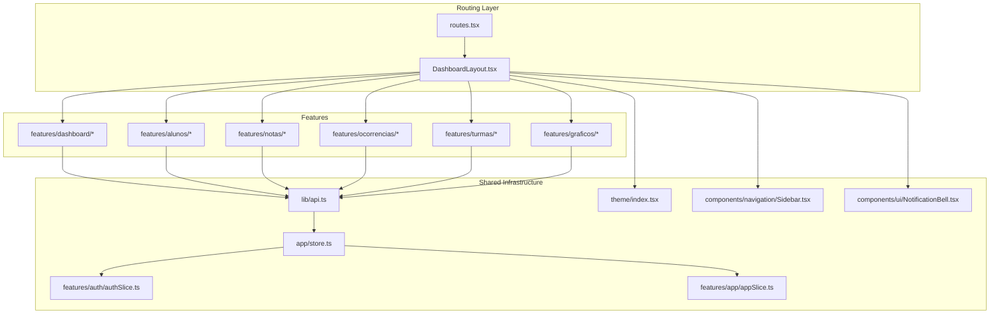
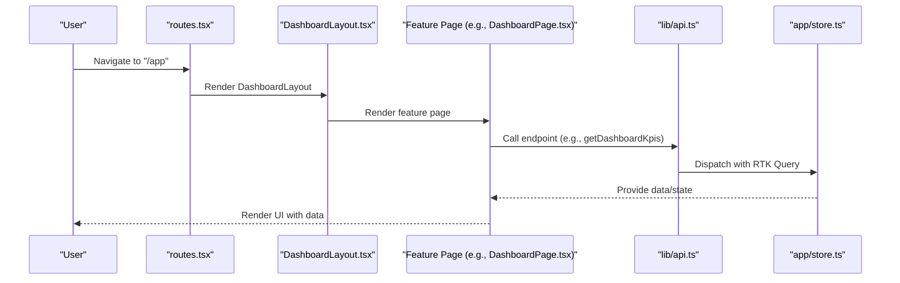
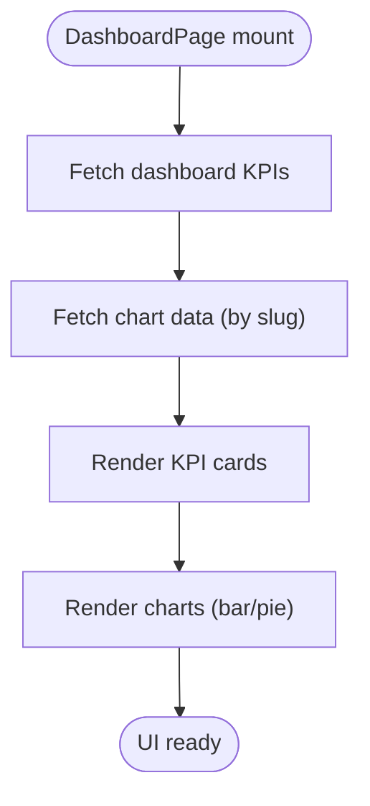
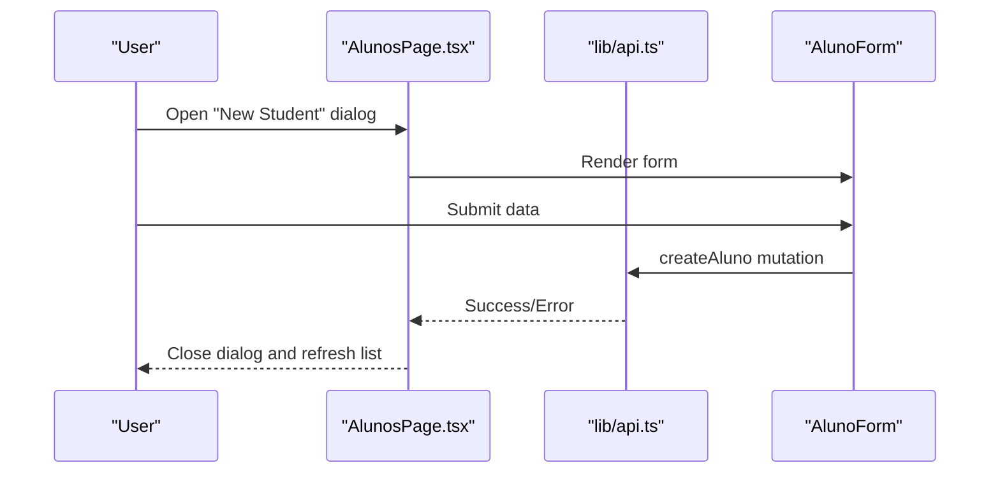
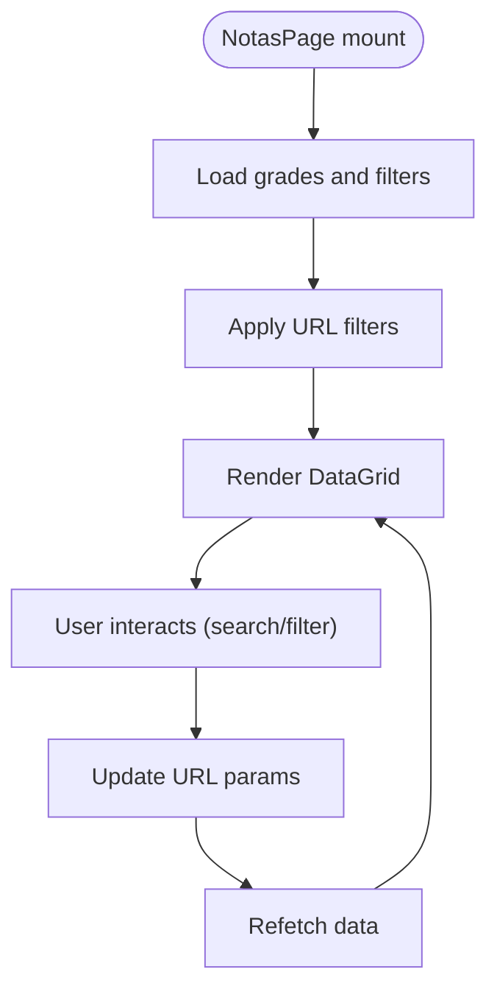
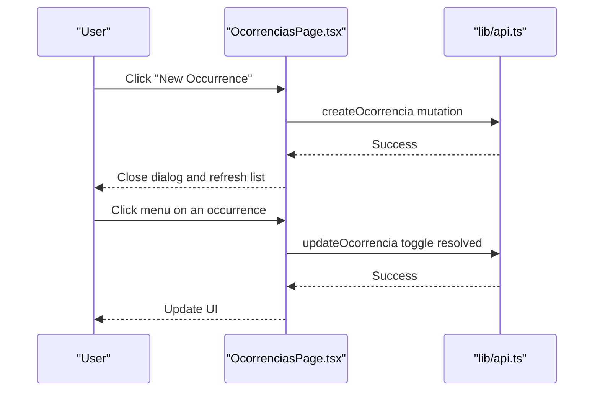
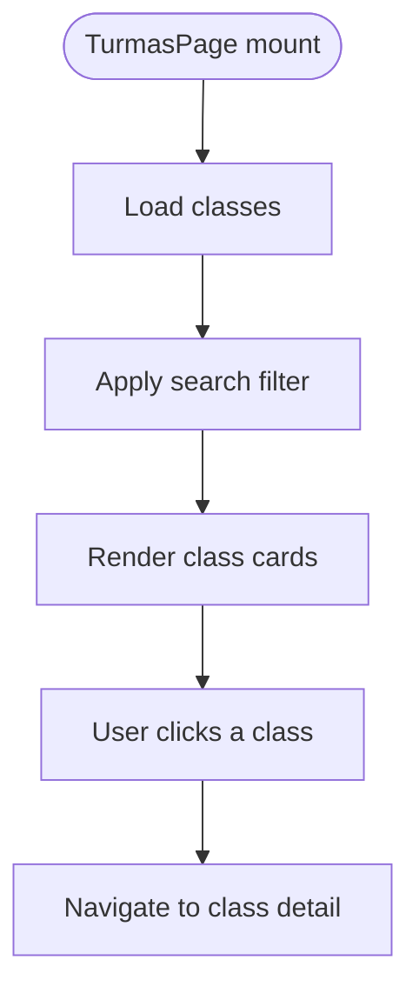
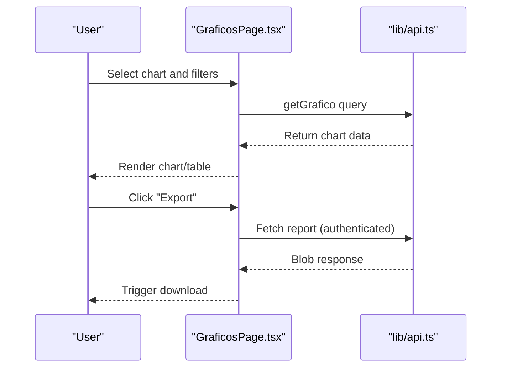
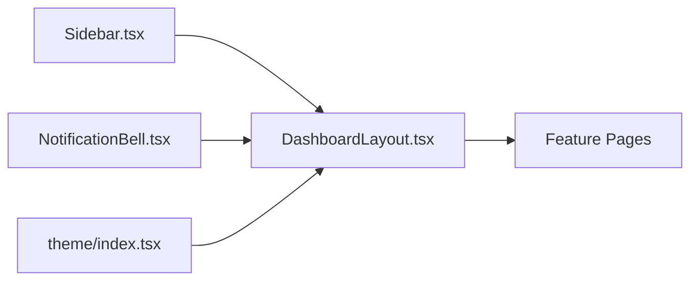
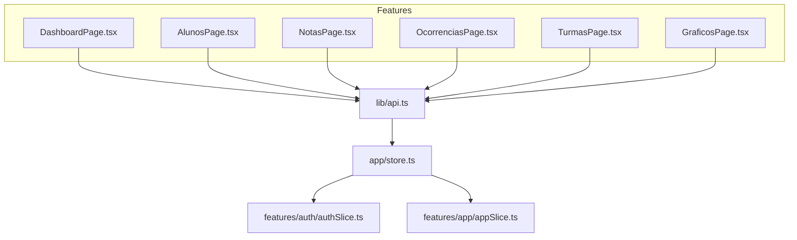

# Feature-Based Module Organization

<cite>
**Referenced Files in This Document**
- [routes.tsx](file://frontend/src/app/routes.tsx)
- [DashboardPage.tsx](file://frontend/src/features/dashboard/DashboardPage.tsx)
- [AlunosPage.tsx](file://frontend/src/features/alunos/AlunosPage.tsx)
- [NotasPage.tsx](file://frontend/src/features/notas/NotasPage.tsx)
- [OcorrenciasPage.tsx](file://frontend/src/features/ocorrencias/OcorrenciasPage.tsx)
- [TurmasPage.tsx](file://frontend/src/features/turmas/TurmasPage.tsx)
- [GraficosPage.tsx](file://frontend/src/features/graficos/GraficosPage.tsx)
- [api.ts](file://frontend/src/lib/api.ts)
- [store.ts](file://frontend/src/app/store.ts)
- [authSlice.ts](file://frontend/src/features/auth/authSlice.ts)
- [appSlice.ts](file://frontend/src/features/app/appSlice.ts)
- [DashboardLayout.tsx](file://frontend/src/layouts/DashboardLayout.tsx)
- [Sidebar.tsx](file://frontend/src/components/navigation/Sidebar.tsx)
- [NotificationBell.tsx](file://frontend/src/components/ui/NotificationBell.tsx)
- [index.tsx](file://frontend/src/theme/index.tsx)
</cite>

## Table of Contents
1. [Introduction](#introduction)
2. [Project Structure](#project-structure)
3. [Core Components](#core-components)
4. [Architecture Overview](#architecture-overview)
5. [Detailed Component Analysis](#detailed-component-analysis)
6. [Dependency Analysis](#dependency-analysis)
7. [Performance Considerations](#performance-considerations)
8. [Troubleshooting Guide](#troubleshooting-guide)
9. [Conclusion](#conclusion)

## Introduction
This document explains the feature-based module organization used in the frontend application. Features such as dashboard, student management, grade tracking, and disciplinary actions are structured as independent modules under the features directory. This approach promotes clear boundaries, maintainability, and scalability by grouping related UI components, data fetching logic, and routing under dedicated folders. It also enables team collaboration, reduces cross-cutting concerns, and simplifies testing and deployment of individual features.

## Project Structure
The frontend follows a feature-based organization under the src/features directory. Each feature encapsulates:
- Page components (feature pages)
- Shared components used within the feature
- Feature-specific slices for Redux state
- Optional configuration files (e.g., chart configurations)

Key characteristics:
- Feature isolation: Each feature manages its own state, UI, and data dependencies.
- Shared patterns: Common UI components and utilities are reused across features.
- Routing integration: Routes are centralized and map to feature pages.
- API integration: All features consume a single API client configured with RTK Query.

**Diagram sources**
- [routes.tsx:41-114](file://frontend/src/app/routes.tsx#L41-L114)
- [DashboardLayout.tsx:16-71](file://frontend/src/layouts/DashboardLayout.tsx#L16-L71)
- [api.ts:409-739](file://frontend/src/lib/api.ts#L409-L739)
- [store.ts:7-17](file://frontend/src/app/store.ts#L7-L17)
- [authSlice.ts:25-46](file://frontend/src/features/auth/authSlice.ts#L25-L46)
- [appSlice.ts:13-24](file://frontend/src/features/app/appSlice.ts#L13-L24)
- [Sidebar.tsx:39-73](file://frontend/src/components/navigation/Sidebar.tsx#L39-L73)
- [NotificationBell.tsx:29-104](file://frontend/src/components/ui/NotificationBell.tsx#L29-L104)
- [index.tsx:6-132](file://frontend/src/theme/index.tsx#L6-L132)

**Section sources**
- [routes.tsx:41-114](file://frontend/src/app/routes.tsx#L41-L114)
- [DashboardLayout.tsx:16-71](file://frontend/src/layouts/DashboardLayout.tsx#L16-L71)

## Core Components
This section highlights the core building blocks enabling feature-based organization:

- Centralized routing: Routes define feature pages and nested layout structure.
- Feature pages: Each feature exposes a main page component that orchestrates UI, state, and data.
- API client: A single RTK Query API client provides typed endpoints for all features.
- Global store: Redux store combines API reducer/middleware with feature slices.
- Shared UI: Navigation, theme, and notification components are shared across features.

Examples of feature boundaries:
- Dashboard feature: Provides overview metrics and charts.
- Student management feature: Lists students, filters/search, and forms.
- Grade tracking feature: Displays and filters grades in a grid.
- Disciplinary actions feature: Manages occurrence records with CRUD operations.
- Class management feature: Lists classes and performance metrics.
- Analytics feature: Renders interactive charts and exports.

**Section sources**
- [routes.tsx:41-114](file://frontend/src/app/routes.tsx#L41-L114)
- [DashboardPage.tsx:46-333](file://frontend/src/features/dashboard/DashboardPage.tsx#L46-L333)
- [AlunosPage.tsx:51-340](file://frontend/src/features/alunos/AlunosPage.tsx#L51-L340)
- [NotasPage.tsx:60-404](file://frontend/src/features/notas/NotasPage.tsx#L60-L404)
- [OcorrenciasPage.tsx:73-657](file://frontend/src/features/ocorrencias/OcorrenciasPage.tsx#L73-L657)
- [TurmasPage.tsx:49-253](file://frontend/src/features/turmas/TurmasPage.tsx#L49-L253)
- [GraficosPage.tsx:101-694](file://frontend/src/features/graficos/GraficosPage.tsx#L101-L694)
- [api.ts:409-739](file://frontend/src/lib/api.ts#L409-L739)
- [store.ts:7-17](file://frontend/src/app/store.ts#L7-L17)

## Architecture Overview
The feature-based architecture integrates routing, layout, shared infrastructure, and feature pages:

- Routing: Central router defines nested routes under the dashboard layout.
- Layout: DashboardLayout renders sidebar, top bar, outlet, and optional chat widget.
- Features: Each feature page consumes the API client and Redux store.
- Shared components: Sidebar adapts to user roles; NotificationBell aggregates communications.
- Theme: Central theme provider supplies consistent design tokens and components.

**Diagram sources**
- [routes.tsx:74-96](file://frontend/src/app/routes.tsx#L74-L96)
- [DashboardLayout.tsx:45-70](file://frontend/src/layouts/DashboardLayout.tsx#L45-L70)
- [DashboardPage.tsx:46-48](file://frontend/src/features/dashboard/DashboardPage.tsx#L46-L48)
- [api.ts:424-427](file://frontend/src/lib/api.ts#L424-L427)
- [store.ts:7-17](file://frontend/src/app/store.ts#L7-L17)

## Detailed Component Analysis

### Dashboard Feature
The dashboard feature aggregates KPIs and charts to provide an overview of academic performance.

Key aspects:
- Data fetching: Uses RTK Query endpoints for KPIs and charts.
- Charts: Renders bar and pie charts with responsive containers.
- Theming: Leverages theme tokens for consistent visuals.
- Error/loading states: Handles errors and empty states gracefully.

**Diagram sources**
- [DashboardPage.tsx:46-118](file://frontend/src/features/dashboard/DashboardPage.tsx#L46-L118)
- [DashboardPage.tsx:55-81](file://frontend/src/features/dashboard/DashboardPage.tsx#L55-L81)
- [api.ts:424-427](file://frontend/src/lib/api.ts#L424-L427)
- [api.ts:493-498](file://frontend/src/lib/api.ts#L493-L498)

**Section sources**
- [DashboardPage.tsx:46-333](file://frontend/src/features/dashboard/DashboardPage.tsx#L46-L333)
- [api.ts:409-739](file://frontend/src/lib/api.ts#L409-L739)

### Student Management Feature
The student management feature handles listing, filtering, and creating students.

Key aspects:
- Filtering: Supports search, shift, and class filters.
- Forms: Dialog-based form for creating students.
- Permissions: Conditionally renders actions based on user role.
- Loading/error states: Uses skeletons and alerts for UX.

**Diagram sources**
- [AlunosPage.tsx:69-78](file://frontend/src/features/alunos/AlunosPage.tsx#L69-L78)
- [AlunosPage.tsx:159-168](file://frontend/src/features/alunos/AlunosPage.tsx#L159-L168)
- [api.ts:664-670](file://frontend/src/lib/api.ts#L664-L670)

**Section sources**
- [AlunosPage.tsx:51-340](file://frontend/src/features/alunos/AlunosPage.tsx#L51-L340)
- [api.ts:664-670](file://frontend/src/lib/api.ts#L664-L670)

### Grade Tracking Feature
The grade tracking feature displays grades in a grid with advanced filtering and sorting.

Key aspects:
- Filtering: Supports search and multiple dropdown filters (class, subject, shift).
- Grid rendering: Uses Material UI DataGrid with custom cell renderers.
- Color coding: Visual indicators for pass/fail and performance ranges.
- Empty states: Provides guidance when no records match filters.

**Diagram sources**
- [NotasPage.tsx:60-90](file://frontend/src/features/notas/NotasPage.tsx#L60-L90)
- [NotasPage.tsx:96-102](file://frontend/src/features/notas/NotasPage.tsx#L96-L102)
- [NotasPage.tsx:366-399](file://frontend/src/features/notas/NotasPage.tsx#L366-L399)

**Section sources**
- [NotasPage.tsx:60-404](file://frontend/src/features/notas/NotasPage.tsx#L60-L404)
- [api.ts:503-521](file://frontend/src/lib/api.ts#L503-L521)

### Disciplinary Actions Feature
The disciplinary actions feature manages occurrences with CRUD operations and status updates.

Key aspects:
- Forms: Comprehensive dialog for creating/editing occurrences.
- Status management: Toggle resolved/unresolved state.
- Filtering: Search by student, type, or description.
- Role-based UI: Hides actions for students; shows controls for staff.

**Diagram sources**
- [OcorrenciasPage.tsx:137-164](file://frontend/src/features/ocorrencias/OcorrenciasPage.tsx#L137-L164)
- [OcorrenciasPage.tsx:204-211](file://frontend/src/features/ocorrencias/OcorrenciasPage.tsx#L204-L211)
- [api.ts:629-636](file://frontend/src/lib/api.ts#L629-L636)
- [api.ts:637-644](file://frontend/src/lib/api.ts#L637-L644)

**Section sources**
- [OcorrenciasPage.tsx:73-657](file://frontend/src/features/ocorrencias/OcorrenciasPage.tsx#L73-L657)
- [api.ts:622-651](file://frontend/src/lib/api.ts#L622-L651)

### Class Management Feature
The class management feature lists classes with performance indicators and search capabilities.

Key aspects:
- Search: Real-time filtering by class or shift.
- Progress bars: Visual performance indicators.
- Navigation: Clickable cards to class detail pages.

**Diagram sources**
- [TurmasPage.tsx:49-68](file://frontend/src/features/turmas/TurmasPage.tsx#L49-L68)
- [TurmasPage.tsx:70-77](file://frontend/src/features/turmas/TurmasPage.tsx#L70-L77)
- [TurmasPage.tsx:130-134](file://frontend/src/features/turmas/TurmasPage.tsx#L130-L134)

**Section sources**
- [TurmasPage.tsx:49-253](file://frontend/src/features/turmas/TurmasPage.tsx#L49-L253)
- [api.ts:460-471](file://frontend/src/lib/api.ts#L460-L471)

### Analytics Feature
The analytics feature renders multiple chart types with dynamic filters and export capabilities.

Key aspects:
- Chart selection: Choose among predefined chart slugs.
- Dynamic filters: Turno, série, turma, trimestre, disciplina.
- Export: Download reports as CSV/XLSX via authenticated fetch.
- Heatmaps: Specialized rendering for correlation matrices.

**Diagram sources**
- [GraficosPage.tsx:101-191](file://frontend/src/features/graficos/GraficosPage.tsx#L101-L191)
- [GraficosPage.tsx:124-158](file://frontend/src/features/graficos/GraficosPage.tsx#L124-L158)
- [api.ts:493-498](file://frontend/src/lib/api.ts#L493-L498)

**Section sources**
- [GraficosPage.tsx:101-694](file://frontend/src/features/graficos/GraficosPage.tsx#L101-L694)
- [api.ts:493-498](file://frontend/src/lib/api.ts#L493-L498)

### Shared Component Patterns
Shared components enable consistent navigation, notifications, and theming across features:

- Sidebar: Adapts menu items based on user role and permissions.
- NotificationBell: Aggregates unread notifications and navigates to the communications page.
- Theme: Centralized theme provider with tokens and component overrides.

**Diagram sources**
- [Sidebar.tsx:39-73](file://frontend/src/components/navigation/Sidebar.tsx#L39-L73)
- [NotificationBell.tsx:29-104](file://frontend/src/components/ui/NotificationBell.tsx#L29-L104)
- [index.tsx:6-132](file://frontend/src/theme/index.tsx#L6-L132)
- [DashboardLayout.tsx:45-70](file://frontend/src/layouts/DashboardLayout.tsx#L45-L70)

**Section sources**
- [Sidebar.tsx:39-195](file://frontend/src/components/navigation/Sidebar.tsx#L39-L195)
- [NotificationBell.tsx:29-244](file://frontend/src/components/ui/NotificationBell.tsx#L29-L244)
- [index.tsx:6-196](file://frontend/src/theme/index.tsx#L6-L196)

## Dependency Analysis
The feature-based organization minimizes coupling and maximizes cohesion:

- Feature-to-API coupling: Each feature depends on the shared API client for data.
- Feature-to-store coupling: Features use Redux slices for authentication and app-wide settings.
- Feature-to-layout coupling: All features render inside the dashboard layout.
- Cross-feature communication: Minimal; shared components (sidebar, notifications) coordinate indirectly.

**Diagram sources**
- [api.ts:409-739](file://frontend/src/lib/api.ts#L409-L739)
- [store.ts:7-17](file://frontend/src/app/store.ts#L7-L17)
- [authSlice.ts:25-46](file://frontend/src/features/auth/authSlice.ts#L25-L46)
- [appSlice.ts:13-24](file://frontend/src/features/app/appSlice.ts#L13-L24)

**Section sources**
- [api.ts:409-739](file://frontend/src/lib/api.ts#L409-L739)
- [store.ts:7-17](file://frontend/src/app/store.ts#L7-L17)
- [authSlice.ts:25-46](file://frontend/src/features/auth/authSlice.ts#L25-L46)
- [appSlice.ts:13-24](file://frontend/src/features/app/appSlice.ts#L13-L24)

## Performance Considerations
- Lazy loading: Routes are structured to support code-splitting; each feature page can be lazy-loaded by adjusting route definitions.
- Efficient data fetching: RTK Query caches responses and supports selective refetching; avoid unnecessary queries by leveraging provided tags and invalidations.
- Rendering optimization: Use memoization for derived data and avoid re-renders by passing stable references.
- Network efficiency: Sanitized parameters and minimal headers reduce payload sizes; leverage server-side filtering where possible.
- UI responsiveness: Skeletons and loading states improve perceived performance during data fetches.

## Troubleshooting Guide
Common issues and resolutions:

- Authentication errors: The API client automatically retries with a refresh token; if refresh fails, users are logged out. Verify tokens and refresh logic.
- Permission-based visibility: Some actions are hidden for students; ensure user roles are correctly set in the auth slice.
- Data inconsistencies: RTK Query tags invalidate related entities; confirm tag usage for mutations and queries.
- Theme mismatches: Central theme provider ensures consistent tokens; verify theme mode persistence and overrides.

**Section sources**
- [api.ts:363-407](file://frontend/src/lib/api.ts#L363-L407)
- [authSlice.ts:25-46](file://frontend/src/features/auth/authSlice.ts#L25-L46)
- [index.tsx:148-171](file://frontend/src/theme/index.tsx#L148-L171)

## Conclusion
The feature-based module organization delivers clear boundaries, shared patterns, and scalable architecture. Features encapsulate UI, state, and data logic while relying on a centralized API client and Redux store. This approach improves maintainability, enables team collaboration, and simplifies future enhancements. By following the established patterns—folder structure, shared components, API integration, and routing—you can confidently add new features and extend existing ones.