# Frontend Application Architecture

<cite>
**Referenced Files in This Document**
- [main.tsx](file://frontend/src/main.tsx)
- [store.ts](file://frontend/src/app/store.ts)
- [routes.tsx](file://frontend/src/app/routes.tsx)
- [hooks.ts](file://frontend/src/app/hooks.ts)
- [api.ts](file://frontend/src/lib/api.ts)
- [authSlice.ts](file://frontend/src/features/auth/authSlice.ts)
- [appSlice.ts](file://frontend/src/features/app/appSlice.ts)
- [DashboardLayout.tsx](file://frontend/src/layouts/DashboardLayout.tsx)
- [Sidebar.tsx](file://frontend/src/components/navigation/Sidebar.tsx)
- [index.tsx](file://frontend/src/theme/index.tsx)
- [tokens.ts](file://frontend/src/theme/tokens.ts)
- [AlunosPage.tsx](file://frontend/src/features/alunos/AlunosPage.tsx)
- [DashboardPage.tsx](file://frontend/src/features/dashboard/DashboardPage.tsx)
- [LoginPage.tsx](file://frontend/src/features/auth/LoginPage.tsx)
- [ChatWidget.tsx](file://frontend/src/features/ai-chat/ChatWidget.tsx)
- [package.json](file://frontend/package.json)
- [vite.config.ts](file://frontend/vite.config.ts)
</cite>

## Table of Contents
1. [Introduction](#introduction)
2. [Project Structure](#project-structure)
3. [Core Components](#core-components)
4. [Architecture Overview](#architecture-overview)
5. [Detailed Component Analysis](#detailed-component-analysis)
6. [Dependency Analysis](#dependency-analysis)
7. [Performance Considerations](#performance-considerations)
8. [Troubleshooting Guide](#troubleshooting-guide)
9. [Conclusion](#conclusion)

## Introduction
This document explains the frontend architecture for the React/MUI web application. It covers component organization, state management with Redux Toolkit, routing with React Router, and API integration via RTK Query. It also documents Material UI integration, the theme system, and responsive design patterns. The application follows a feature-based organization, with Redux slices encapsulating domain logic and RTK Query managing data fetching, caching, and synchronization.

## Project Structure
The frontend is organized around a feature-based structure under the features directory, with shared components, layouts, themes, and API integrations centralized in dedicated modules. The entry point initializes the Redux store, theme provider, routing, and Material UI baseline.

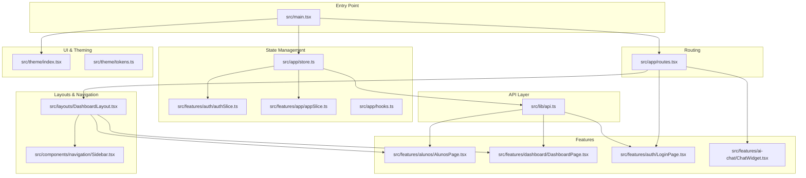

**Diagram sources**
- [main.tsx:1-28](file://frontend/src/main.tsx#L1-L28)
- [routes.tsx:1-115](file://frontend/src/app/routes.tsx#L1-L115)
- [store.ts:1-21](file://frontend/src/app/store.ts#L1-L21)
- [api.ts:1-790](file://frontend/src/lib/api.ts#L1-L790)
- [authSlice.ts:1-50](file://frontend/src/features/auth/authSlice.ts#L1-L50)
- [appSlice.ts:1-28](file://frontend/src/features/app/appSlice.ts#L1-L28)
- [DashboardLayout.tsx:1-73](file://frontend/src/layouts/DashboardLayout.tsx#L1-L73)
- [Sidebar.tsx:1-195](file://frontend/src/components/navigation/Sidebar.tsx#L1-L195)
- [index.tsx:1-196](file://frontend/src/theme/index.tsx#L1-L196)
- [tokens.ts:1-53](file://frontend/src/theme/tokens.ts#L1-L53)
- [AlunosPage.tsx:1-341](file://frontend/src/features/alunos/AlunosPage.tsx#L1-L341)
- [DashboardPage.tsx:1-334](file://frontend/src/features/dashboard/DashboardPage.tsx#L1-L334)
- [LoginPage.tsx:1-370](file://frontend/src/features/auth/LoginPage.tsx#L1-L370)
- [ChatWidget.tsx:1-328](file://frontend/src/features/ai-chat/ChatWidget.tsx#L1-L328)

**Section sources**
- [main.tsx:1-28](file://frontend/src/main.tsx#L1-L28)
- [routes.tsx:1-115](file://frontend/src/app/routes.tsx#L1-L115)
- [store.ts:1-21](file://frontend/src/app/store.ts#L1-L21)
- [api.ts:1-790](file://frontend/src/lib/api.ts#L1-L790)
- [index.tsx:1-196](file://frontend/src/theme/index.tsx#L1-L196)
- [tokens.ts:1-53](file://frontend/src/theme/tokens.ts#L1-L53)

## Core Components
- Entry point and providers: Initializes Redux store, theme provider, Material UI baseline, and router provider.
- Routing: Centralized router with loaders for redirects and protected routes.
- State management: Redux slices for authentication and application-wide settings; RTK Query for API integration.
- Layout and navigation: Dashboard layout with sidebar and top bar; responsive behavior and role-aware navigation.
- Feature components: Examples include students listing, dashboard KPIs and charts, login, and AI chat widget.

**Section sources**
- [main.tsx:1-28](file://frontend/src/main.tsx#L1-L28)
- [routes.tsx:29-39](file://frontend/src/app/routes.tsx#L29-L39)
- [store.ts:7-17](file://frontend/src/app/store.ts#L7-L17)
- [authSlice.ts:25-46](file://frontend/src/features/auth/authSlice.ts#L25-L46)
- [appSlice.ts:13-24](file://frontend/src/features/app/appSlice.ts#L13-L24)
- [DashboardLayout.tsx:16-71](file://frontend/src/layouts/DashboardLayout.tsx#L16-L71)
- [Sidebar.tsx:39-73](file://frontend/src/components/navigation/Sidebar.tsx#L39-L73)

## Architecture Overview
The frontend uses a layered architecture:
- Presentation layer: Feature components and layouts built with MUI.
- State layer: Redux slices manage domain state; RTK Query manages API state and caching.
- Data access layer: RTK Query endpoints encapsulate HTTP interactions and normalize responses.
- Infrastructure: Vite dev server with proxy configuration; Material UI theme provider.

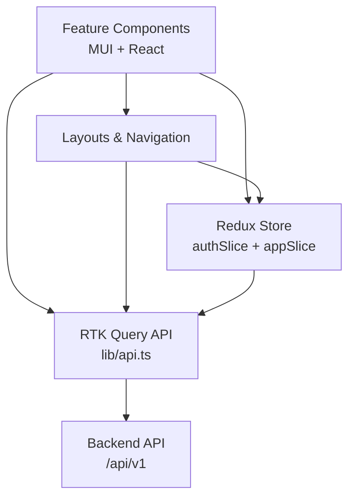

**Diagram sources**
- [main.tsx:11-20](file://frontend/src/main.tsx#L11-L20)
- [store.ts:3-17](file://frontend/src/app/store.ts#L3-L17)
- [api.ts:409-739](file://frontend/src/lib/api.ts#L409-L739)
- [routes.tsx:41-96](file://frontend/src/app/routes.tsx#L41-L96)

## Detailed Component Analysis

### Redux Store and Slices
The store combines reducers for authentication, application settings, and RTK Query’s API slice. It configures middleware to integrate RTK Query and disables serializable checks for non-serializable middleware.

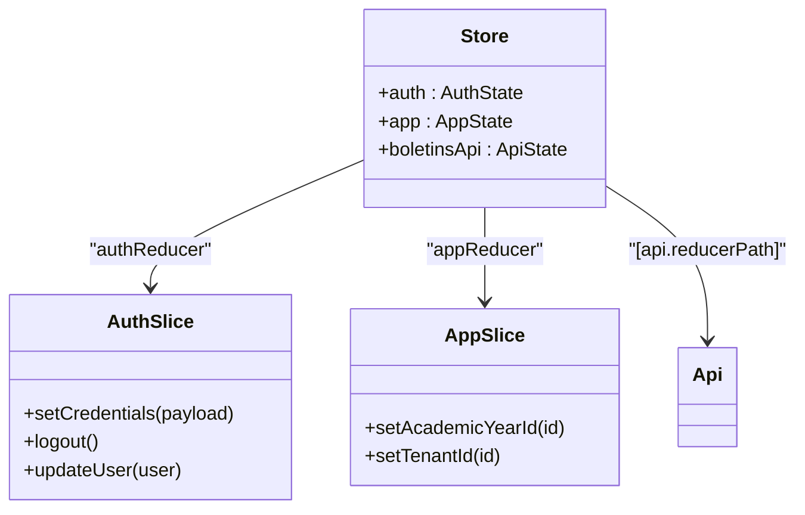

**Diagram sources**
- [store.ts:7-17](file://frontend/src/app/store.ts#L7-L17)
- [authSlice.ts:25-46](file://frontend/src/features/auth/authSlice.ts#L25-L46)
- [appSlice.ts:13-24](file://frontend/src/features/app/appSlice.ts#L13-L24)
- [api.ts:409-412](file://frontend/src/lib/api.ts#L409-L412)

**Section sources**
- [store.ts:1-21](file://frontend/src/app/store.ts#L1-L21)
- [authSlice.ts:1-50](file://frontend/src/features/auth/authSlice.ts#L1-L50)
- [appSlice.ts:1-28](file://frontend/src/features/app/appSlice.ts#L1-L28)

### Routing and Protected Access
The router defines nested routes under a dashboard layout, with a loader that enforces authentication and redirects users needing to change passwords. Public routes include login and password reset flows.

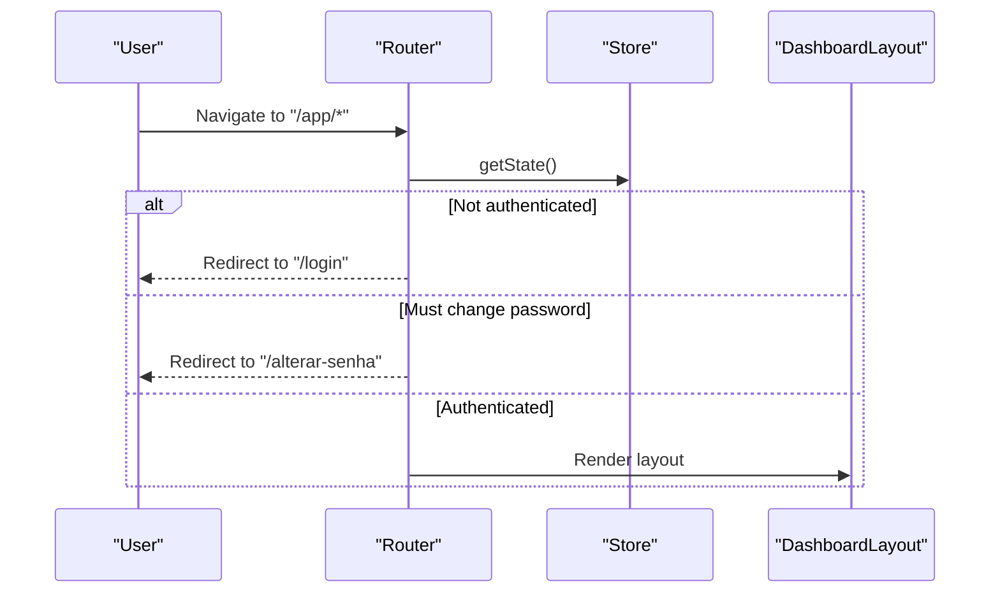

**Diagram sources**
- [routes.tsx:29-39](file://frontend/src/app/routes.tsx#L29-L39)
- [routes.tsx:74-96](file://frontend/src/app/routes.tsx#L74-L96)
- [DashboardLayout.tsx:16-44](file://frontend/src/layouts/DashboardLayout.tsx#L16-L44)

**Section sources**
- [routes.tsx:1-115](file://frontend/src/app/routes.tsx#L1-L115)
- [DashboardLayout.tsx:16-71](file://frontend/src/layouts/DashboardLayout.tsx#L16-L71)

### API Integration with RTK Query
RTK Query centralizes HTTP interactions, token injection, reauthentication, and caching. It exposes typed hooks for each endpoint and integrates with the Redux store via a dedicated reducer path and middleware.

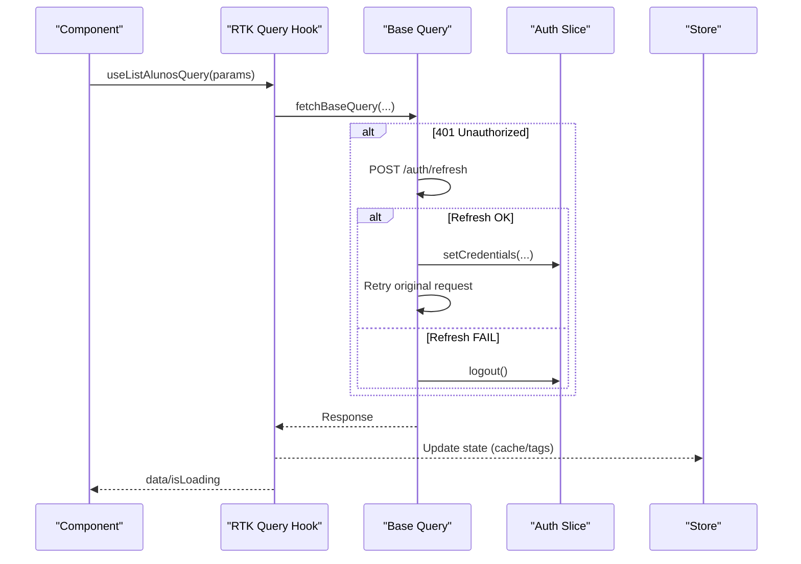

**Diagram sources**
- [api.ts:336-407](file://frontend/src/lib/api.ts#L336-L407)
- [api.ts:409-739](file://frontend/src/lib/api.ts#L409-L739)
- [authSlice.ts:28-44](file://frontend/src/features/auth/authSlice.ts#L28-L44)
- [store.ts:10-16](file://frontend/src/app/store.ts#L10-L16)

**Section sources**
- [api.ts:1-790](file://frontend/src/lib/api.ts#L1-L790)
- [store.ts:1-21](file://frontend/src/app/store.ts#L1-L21)

### Material UI Theme System
The theme provider builds a custom theme using design tokens, supports light/dark modes, persists user preference, and applies component overrides for MUI components.

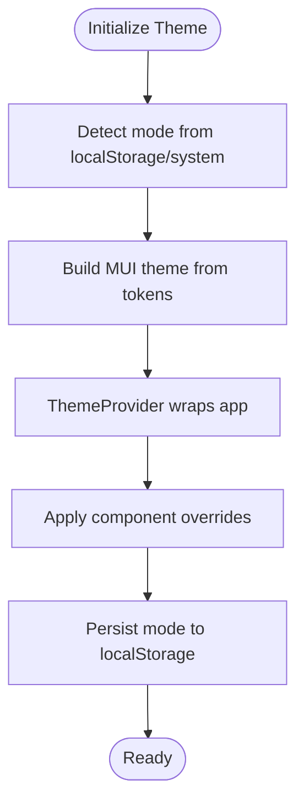

**Diagram sources**
- [index.tsx:6-132](file://frontend/src/theme/index.tsx#L6-L132)
- [index.tsx:146-174](file://frontend/src/theme/index.tsx#L146-L174)
- [tokens.ts:5-52](file://frontend/src/theme/tokens.ts#L5-L52)

**Section sources**
- [index.tsx:1-196](file://frontend/src/theme/index.tsx#L1-L196)
- [tokens.ts:1-53](file://frontend/src/theme/tokens.ts#L1-L53)

### Layout and Navigation
The dashboard layout renders sidebar and top bar, handles mobile drawer behavior, and enforces role-based routing. The sidebar adapts menu items based on user roles and permissions.

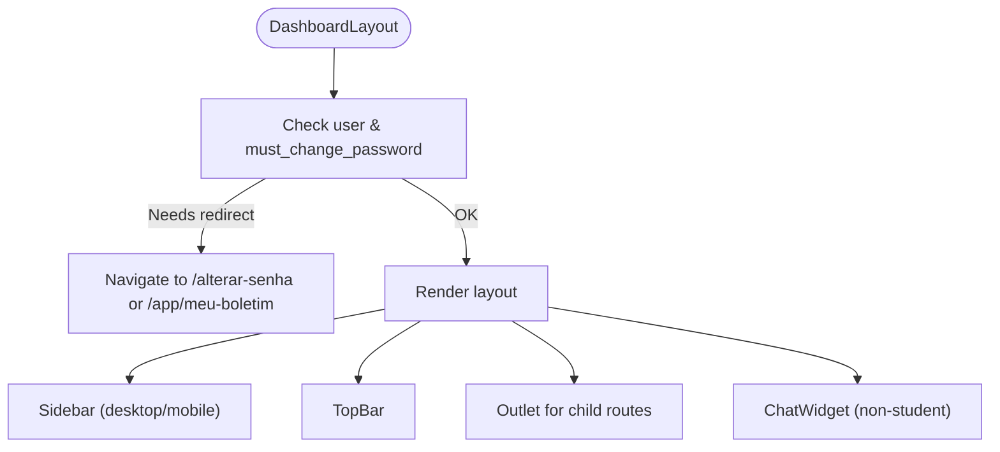

**Diagram sources**
- [DashboardLayout.tsx:16-71](file://frontend/src/layouts/DashboardLayout.tsx#L16-L71)
- [Sidebar.tsx:39-73](file://frontend/src/components/navigation/Sidebar.tsx#L39-L73)

**Section sources**
- [DashboardLayout.tsx:1-73](file://frontend/src/layouts/DashboardLayout.tsx#L1-L73)
- [Sidebar.tsx:1-195](file://frontend/src/components/navigation/Sidebar.tsx#L1-L195)

### Example Workflows

#### Component Composition Pattern
Feature components compose MUI primitives, local state, and RTK Query hooks. They compute derived data, handle loading/error states, and delegate persistence to Redux slices.

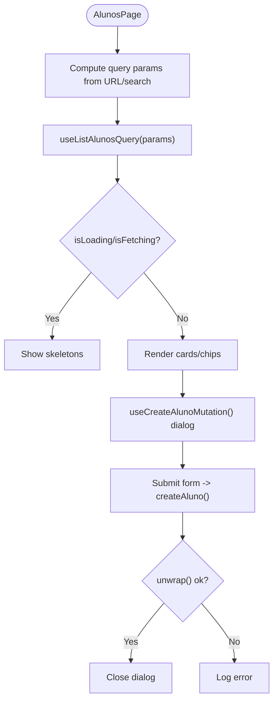

**Diagram sources**
- [AlunosPage.tsx:51-341](file://frontend/src/features/alunos/AlunosPage.tsx#L51-L341)
- [api.ts:664-686](file://frontend/src/lib/api.ts#L664-L686)

**Section sources**
- [AlunosPage.tsx:1-341](file://frontend/src/features/alunos/AlunosPage.tsx#L1-L341)

#### Authentication Flow
The login page selects tenant and role, authenticates via RTK Query, stores credentials in Redux, and navigates based on user profile.

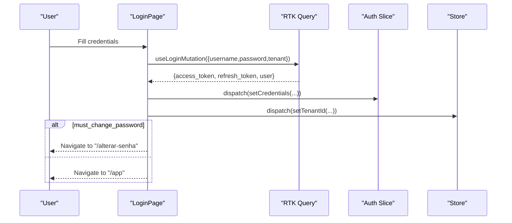

**Diagram sources**
- [LoginPage.tsx:31-127](file://frontend/src/features/auth/LoginPage.tsx#L31-L127)
- [api.ts:414-420](file://frontend/src/lib/api.ts#L414-L420)
- [authSlice.ts:28-44](file://frontend/src/features/auth/authSlice.ts#L28-L44)

**Section sources**
- [LoginPage.tsx:1-370](file://frontend/src/features/auth/LoginPage.tsx#L1-L370)

#### Dashboard Data Visualization
The dashboard fetches KPIs and charts, normalizes data, and renders responsive charts with tooltips and legends.

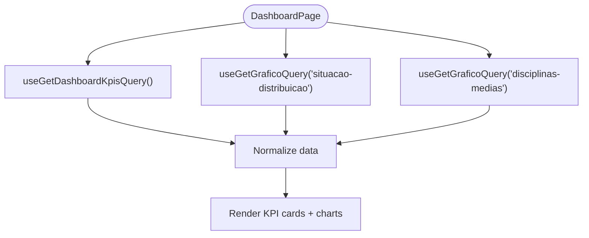

**Diagram sources**
- [DashboardPage.tsx:46-334](file://frontend/src/features/dashboard/DashboardPage.tsx#L46-L334)
- [api.ts:424-446](file://frontend/src/lib/api.ts#L424-L446)
- [api.ts:493-498](file://frontend/src/lib/api.ts#L493-L498)

**Section sources**
- [DashboardPage.tsx:1-334](file://frontend/src/features/dashboard/DashboardPage.tsx#L1-L334)

## Dependency Analysis
The frontend depends on React, Redux Toolkit, RTK Query, React Router, and Material UI. Vite provides the build toolchain and dev server with proxy configuration to the backend.

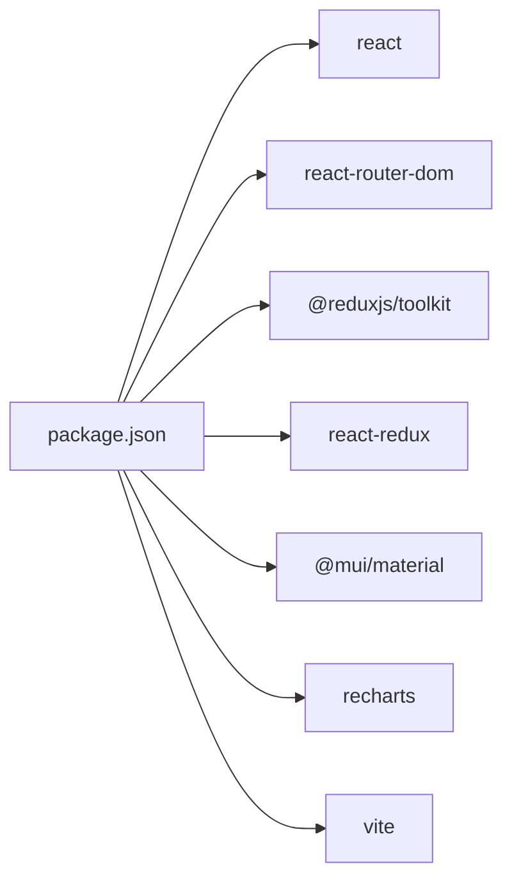

**Diagram sources**
- [package.json:12-31](file://frontend/package.json#L12-L31)

**Section sources**
- [package.json:1-48](file://frontend/package.json#L1-L48)
- [vite.config.ts:1-19](file://frontend/vite.config.ts#L1-L19)

## Performance Considerations
- Prefer RTK Query’s caching and invalidation to minimize redundant network calls and maintain consistency.
- Use selective refetch strategies (focus/mount) judiciously to balance freshness and performance.
- Keep component state minimal; rely on Redux for cross-component state and RTK Query for normalized data.
- Leverage MUI’s lazy-loaded components and avoid heavy computations in render paths.
- Use responsive props and breakpoints to optimize rendering on smaller screens.

## Troubleshooting Guide
Common issues and remedies:
- Authentication failures: Verify token presence and refresh flow; check unauthorized responses and automatic logout behavior.
- Network errors: Inspect base query configuration, header injection, and proxy settings.
- Theme inconsistencies: Confirm theme provider wrapping and mode persistence in localStorage.
- Routing redirects: Ensure auth state reflects must-change-password and role-based navigation.

**Section sources**
- [api.ts:336-407](file://frontend/src/lib/api.ts#L336-L407)
- [routes.tsx:29-39](file://frontend/src/app/routes.tsx#L29-L39)
- [index.tsx:146-174](file://frontend/src/theme/index.tsx#L146-L174)
- [vite.config.ts:6-14](file://frontend/vite.config.ts#L6-L14)

## Conclusion
The frontend architecture leverages feature-based organization, Redux slices for domain state, and RTK Query for robust API integration. The Material UI theme system ensures a consistent, responsive design with strong accessibility and performance characteristics. The router enforces secure, role-aware navigation, while the layout and navigation components provide a cohesive user experience across devices.