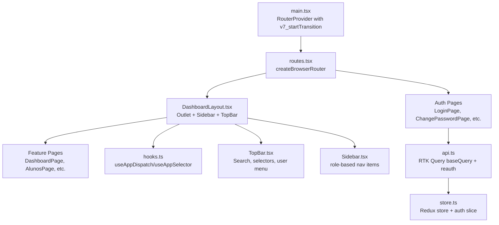
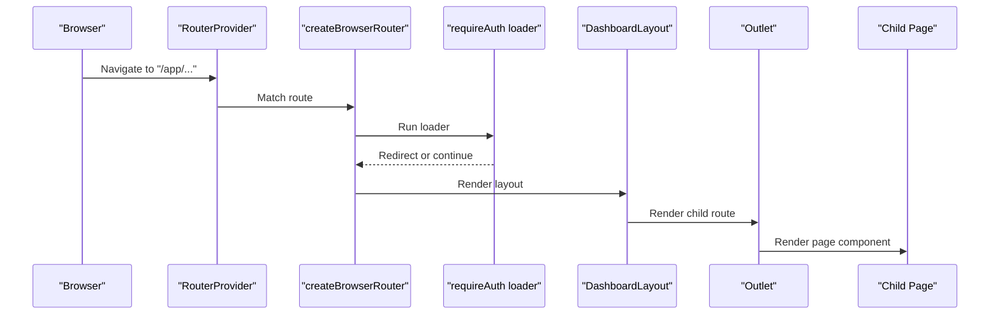
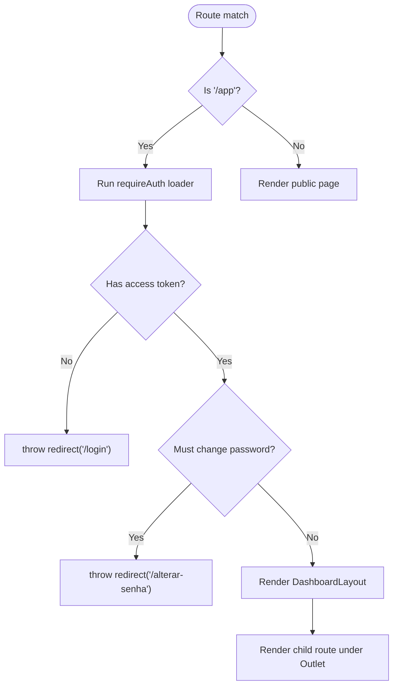
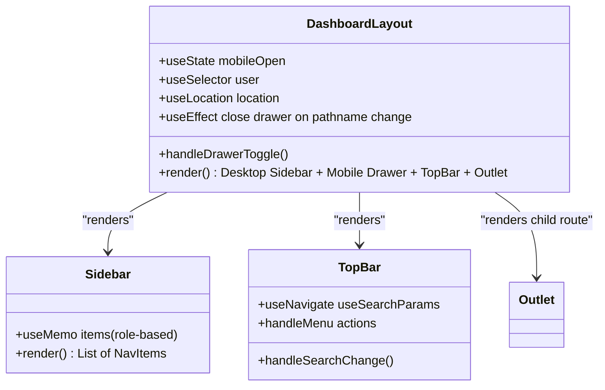
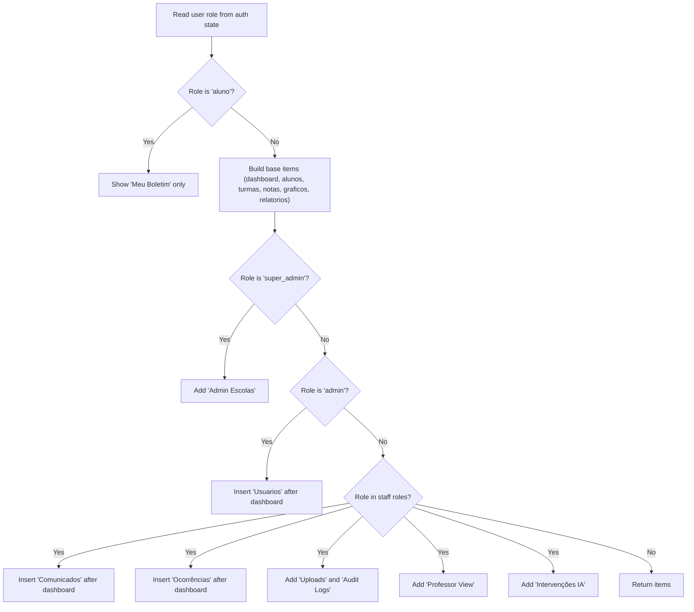
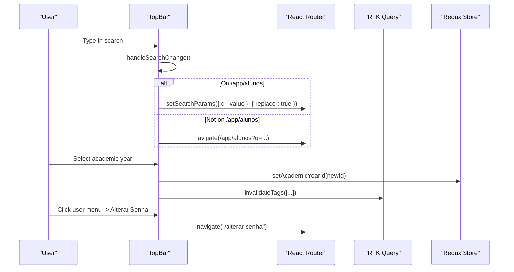
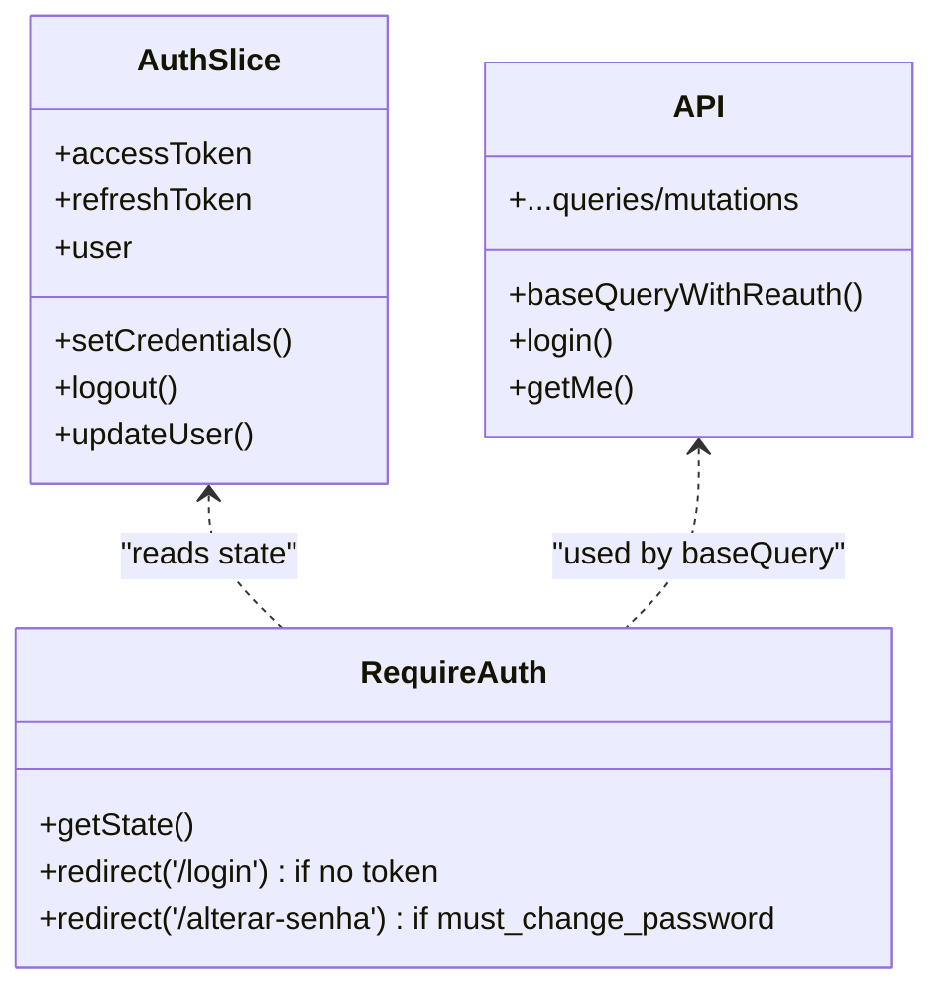
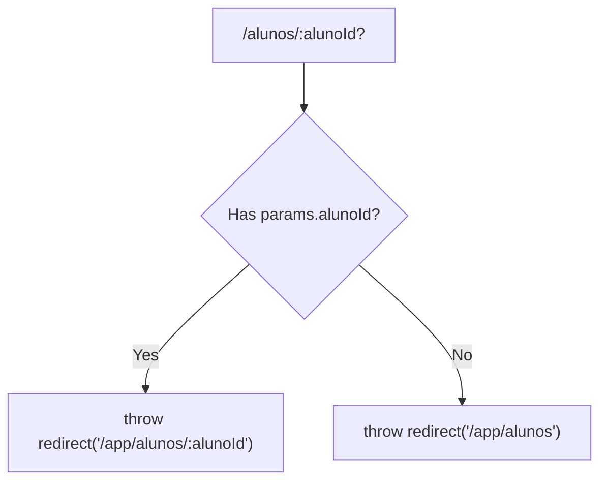
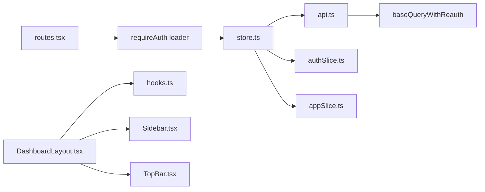

# Routing and Navigation

<cite>
**Referenced Files in This Document**
- [routes.tsx](file://frontend/src/app/routes.tsx)
- [main.tsx](file://frontend/src/main.tsx)
- [DashboardLayout.tsx](file://frontend/src/layouts/DashboardLayout.tsx)
- [Sidebar.tsx](file://frontend/src/components/navigation/Sidebar.tsx)
- [TopBar.tsx](file://frontend/src/components/navigation/TopBar.tsx)
- [authSlice.ts](file://frontend/src/features/auth/authSlice.ts)
- [hooks.ts](file://frontend/src/app/hooks.ts)
- [api.ts](file://frontend/src/lib/api.ts)
- [store.ts](file://frontend/src/app/store.ts)
- [DashboardPage.tsx](file://frontend/src/features/dashboard/DashboardPage.tsx)
- [AlunosPage.tsx](file://frontend/src/features/alunos/AlunosPage.tsx)
- [LoginPage.tsx](file://frontend/src/features/auth/LoginPage.tsx)
- [appSlice.ts](file://frontend/src/features/app/appSlice.ts)
</cite>

## Table of Contents
1. [Introduction](#introduction)
2. [Project Structure](#project-structure)
3. [Core Components](#core-components)
4. [Architecture Overview](#architecture-overview)
5. [Detailed Component Analysis](#detailed-component-analysis)
6. [Dependency Analysis](#dependency-analysis)
7. [Performance Considerations](#performance-considerations)
8. [Troubleshooting Guide](#troubleshooting-guide)
9. [Conclusion](#conclusion)
10. [Appendices](#appendices)

## Introduction
This document explains the React Router-based navigation system used in the frontend application. It covers route configuration, protected routes, layout composition, dashboard layout structure, sidebar navigation, and top bar components. It also demonstrates programmatic navigation, route parameters, query string handling, authentication guards, role-based routing, dynamic route generation, and guidelines for organizing route hierarchies and implementing smooth transitions between pages.

## Project Structure
The routing system centers around a single router definition that organizes public and authenticated routes, nested under a shared dashboard layout. Authentication state is managed via Redux, while navigation components (sidebar and top bar) are integrated into the dashboard layout.

**Diagram sources**
- [main.tsx:11-26](file://frontend/src/main.tsx#L11-L26)
- [routes.tsx:41-114](file://frontend/src/app/routes.tsx#L41-L114)
- [DashboardLayout.tsx:16-71](file://frontend/src/layouts/DashboardLayout.tsx#L16-L71)
- [api.ts:336-407](file://frontend/src/lib/api.ts#L336-L407)
- [store.ts:7-17](file://frontend/src/app/store.ts#L7-L17)
- [hooks.ts:1-7](file://frontend/src/app/hooks.ts#L1-L7)
- [TopBar.tsx:122-339](file://frontend/src/components/navigation/TopBar.tsx#L122-L339)
- [Sidebar.tsx:39-194](file://frontend/src/components/navigation/Sidebar.tsx#L39-L194)

**Section sources**
- [main.tsx:11-26](file://frontend/src/main.tsx#L11-L26)
- [routes.tsx:41-114](file://frontend/src/app/routes.tsx#L41-L114)

## Core Components
- Router provider with React Router v7 start transitions enabled for smoother page transitions.
- Route configuration with loaders for legacy URL redirects and nested routes under a dashboard layout.
- Protected route guard using a loader that checks authentication and temporary password requirement.
- Dashboard layout combining a persistent sidebar and top bar with an outlet for child routes.
- Role-aware navigation items generated dynamically in the sidebar based on user roles.
- Top bar with search, academic year selector, tenant selector (super admin), theme toggle, notifications, and user menu.

**Section sources**
- [main.tsx:16](file://frontend/src/main.tsx#L16)
- [routes.tsx:29-39](file://frontend/src/app/routes.tsx#L29-L39)
- [DashboardLayout.tsx:16-71](file://frontend/src/layouts/DashboardLayout.tsx#L16-L71)
- [Sidebar.tsx:39-73](file://frontend/src/components/navigation/Sidebar.tsx#L39-L73)
- [TopBar.tsx:122-339](file://frontend/src/components/navigation/TopBar.tsx#L122-L339)

## Architecture Overview
The routing architecture separates concerns:
- Public routes: landing, login, password reset flows.
- Authenticated routes: nested under the dashboard layout.
- Guarded access: a loader enforces authentication and temporary password policy.
- Dynamic navigation: sidebar adapts to user roles and permissions.
- Programmatic navigation: TopBar and LoginPage use navigate and setSearchParams.

**Diagram sources**
- [routes.tsx:41-96](file://frontend/src/app/routes.tsx#L41-L96)
- [routes.tsx:29-39](file://frontend/src/app/routes.tsx#L29-L39)
- [DashboardLayout.tsx:45-70](file://frontend/src/layouts/DashboardLayout.tsx#L45-L70)

## Detailed Component Analysis

### Route Configuration and Protected Routes
- Public routes include home, login, change password, forgot password, and reset password.
- The "/app" route is guarded by a loader that checks for an access token and blocks access if the user must change their password.
- Child routes under "/app" define the dashboard hierarchy (dashboard, students, classes, grades, charts, reports, uploads, users, audit logs, announcements, incidents, bulk AI interventions, personal transcript, and admin tenants).
- Legacy routes redirect to canonical "/app" paths using loaders that read route parameters and redirect accordingly.

**Diagram sources**
- [routes.tsx:41-96](file://frontend/src/app/routes.tsx#L41-L96)
- [routes.tsx:29-39](file://frontend/src/app/routes.tsx#L29-L39)

**Section sources**
- [routes.tsx:41-114](file://frontend/src/app/routes.tsx#L41-L114)
- [routes.tsx:29-39](file://frontend/src/app/routes.tsx#L29-L39)

### Dashboard Layout Composition
- The layout renders a desktop sidebar and a mobile drawer, a top bar, and an outlet for child routes.
- It manages mobile drawer state and closes it on route changes.
- It enforces role-based redirection: if the user must change password, it navigates to the change password page; if the user is a student, it redirects to the personal transcript page except when explicitly navigating there.

**Diagram sources**
- [DashboardLayout.tsx:16-71](file://frontend/src/layouts/DashboardLayout.tsx#L16-L71)
- [Sidebar.tsx:39-194](file://frontend/src/components/navigation/Sidebar.tsx#L39-L194)
- [TopBar.tsx:122-339](file://frontend/src/components/navigation/TopBar.tsx#L122-L339)

**Section sources**
- [DashboardLayout.tsx:16-71](file://frontend/src/layouts/DashboardLayout.tsx#L16-L71)

### Sidebar Navigation and Role-Based Routing
- The sidebar builds navigation items dynamically based on user role and permissions.
- Items include dashboard, students, classes, grades, charts, reports, users (admin), uploads (admin), audit logs (admin), teacher view, bulk AI interventions (admin/coordinator), announcements, and incidents.
- The sidebar uses NavLink to integrate with React Router and applies active styles.

**Diagram sources**
- [Sidebar.tsx:39-73](file://frontend/src/components/navigation/Sidebar.tsx#L39-L73)

**Section sources**
- [Sidebar.tsx:39-73](file://frontend/src/components/navigation/Sidebar.tsx#L39-L73)

### Top Bar Components and Programmatic Navigation
- The top bar provides:
  - Search input synchronized with query parameters on specific pages.
  - Academic year selector that updates Redux state and invalidates tags for cached data.
  - Tenant selector for super admins.
  - Theme toggle, notification bell, and user menu with actions (add photo, change password, logout).
- Programmatic navigation examples:
  - Using navigate to go to "/alterar-senha" from the user menu.
  - Using setSearchParams to update query parameters for search on "/app/alunos".
  - Using navigate to redirect to "/app/alunos?q=..." when leaving the search page.

**Diagram sources**
- [TopBar.tsx:122-145](file://frontend/src/components/navigation/TopBar.tsx#L122-L145)
- [TopBar.tsx:46-81](file://frontend/src/components/navigation/TopBar.tsx#L46-L81)
- [TopBar.tsx:98-103](file://frontend/src/components/navigation/TopBar.tsx#L98-L103)
- [TopBar.tsx:156-164](file://frontend/src/components/navigation/TopBar.tsx#L156-L164)

**Section sources**
- [TopBar.tsx:122-339](file://frontend/src/components/navigation/TopBar.tsx#L122-L339)

### Authentication Guards and State Management
- Authentication state is stored in Redux with access/refresh tokens and user profile.
- The base RTK Query query wrapper handles automatic re-authentication using a refresh endpoint and falls back to logout on failure.
- The requireAuth loader reads the Redux state to enforce authentication and temporary password policies.

**Diagram sources**
- [authSlice.ts:25-49](file://frontend/src/features/auth/authSlice.ts#L25-L49)
- [api.ts:336-407](file://frontend/src/lib/api.ts#L336-L407)
- [routes.tsx:29-39](file://frontend/src/app/routes.tsx#L29-L39)

**Section sources**
- [authSlice.ts:25-49](file://frontend/src/features/auth/authSlice.ts#L25-L49)
- [api.ts:336-407](file://frontend/src/lib/api.ts#L336-L407)
- [routes.tsx:29-39](file://frontend/src/app/routes.tsx#L29-L39)

### Dynamic Route Generation and Parameter Handling
- Legacy routes redirect to canonical paths using loaders that read route parameters and throw redirects.
- Example: "/alunos/:alunoId?" redirects to "/app/alunos/:alunoId" or "/app/alunos" depending on presence of the parameter.
- Query string handling is demonstrated in:
  - AlunosPage: uses useSearchParams to manage filters and pagination.
  - TopBar: updates query parameters for search and navigates programmatically when leaving the search page.

**Diagram sources**
- [routes.tsx:56-62](file://frontend/src/app/routes.tsx#L56-L62)

**Section sources**
- [routes.tsx:56-62](file://frontend/src/app/routes.tsx#L56-L62)
- [AlunosPage.tsx:51-62](file://frontend/src/features/alunos/AlunosPage.tsx#L51-L62)
- [TopBar.tsx:131-145](file://frontend/src/components/navigation/TopBar.tsx#L131-L145)

### Smooth Transitions Between Pages
- The RouterProvider is configured with future.v7_startTransition to enable React startTransition for route changes, improving perceived performance and reducing jank during navigation.

**Section sources**
- [main.tsx:16](file://frontend/src/main.tsx#L16)

## Dependency Analysis
The routing system integrates tightly with Redux and RTK Query:
- The store combines the API reducer and middleware with auth and app slices.
- The base query wrapper injects authorization headers and tenant/year context, and handles re-authentication.
- The requireAuth loader depends on Redux state to enforce access control.

**Diagram sources**
- [store.ts:7-17](file://frontend/src/app/store.ts#L7-L17)
- [api.ts:336-407](file://frontend/src/lib/api.ts#L336-L407)
- [routes.tsx:29-39](file://frontend/src/app/routes.tsx#L29-L39)
- [DashboardLayout.tsx:16-71](file://frontend/src/layouts/DashboardLayout.tsx#L16-L71)
- [hooks.ts:1-7](file://frontend/src/app/hooks.ts#L1-7)
- [Sidebar.tsx:39-194](file://frontend/src/components/navigation/Sidebar.tsx#L39-L194)
- [TopBar.tsx:122-339](file://frontend/src/components/navigation/TopBar.tsx#L122-L339)

**Section sources**
- [store.ts:7-17](file://frontend/src/app/store.ts#L7-L17)
- [api.ts:336-407](file://frontend/src/lib/api.ts#L336-L407)
- [routes.tsx:29-39](file://frontend/src/app/routes.tsx#L29-L39)

## Performance Considerations
- Use of startTransition in RouterProvider improves perceived performance for route changes.
- RTK Query caching and tag-based invalidation reduce redundant network requests and keep UI in sync with backend state.
- Memoization in sidebar and page components minimizes re-renders for large lists and charts.
- Avoid unnecessary deep equality checks by keeping state flat and using minimal selectors.

[No sources needed since this section provides general guidance]

## Troubleshooting Guide
Common issues and resolutions:
- Unauthorized access attempts: The requireAuth loader redirects to login; ensure the store has a valid access token.
- Temporary password enforcement: If must_change_password is true, the loader and layout redirect to the change password page.
- Role-based navigation missing: Verify the user role and permissions in the auth state; the sidebar computes items dynamically based on role.
- Search not updating query parameters: Confirm the current route is one of the supported search routes and that setSearchParams is used with replace to avoid history pollution.
- Academic year or tenant selection not applying: Ensure setAcademicYearId/setTenantId are dispatched and that invalidateTags is called for affected endpoints.

**Section sources**
- [routes.tsx:29-39](file://frontend/src/app/routes.tsx#L29-L39)
- [DashboardLayout.tsx:39-44](file://frontend/src/layouts/DashboardLayout.tsx#L39-L44)
- [Sidebar.tsx:39-73](file://frontend/src/components/navigation/Sidebar.tsx#L39-L73)
- [TopBar.tsx:131-145](file://frontend/src/components/navigation/TopBar.tsx#L131-L145)
- [api.ts:409-407](file://frontend/src/lib/api.ts#L409-L407)

## Conclusion
The routing system employs a clean separation between public and authenticated areas, with robust authentication guards and dynamic navigation tailored to user roles. The dashboard layout provides a cohesive UX with persistent navigation and contextual controls. Programmatic navigation, query string handling, and RTK Query integration ensure responsive and efficient interactions across the application.

[No sources needed since this section summarizes without analyzing specific files]

## Appendices

### Practical Examples Index
- Programmatic navigation:
  - [TopBar.tsx:156-164](file://frontend/src/components/navigation/TopBar.tsx#L156-L164)
  - [LoginPage.tsx:119-123](file://frontend/src/features/auth/LoginPage.tsx#L119-L123)
- Route parameters:
  - [routes.tsx:56-62](file://frontend/src/app/routes.tsx#L56-L62)
  - [routes.tsx:81](file://frontend/src/app/routes.tsx#L81)
- Query string handling:
  - [AlunosPage.tsx:51-62](file://frontend/src/features/alunos/AlunosPage.tsx#L51-L62)
  - [TopBar.tsx:131-145](file://frontend/src/components/navigation/TopBar.tsx#L131-L145)
- Authentication guard:
  - [routes.tsx:29-39](file://frontend/src/app/routes.tsx#L29-L39)
- Role-based routing:
  - [Sidebar.tsx:39-73](file://frontend/src/components/navigation/Sidebar.tsx#L39-L73)
- Dynamic route generation:
  - [routes.tsx:56-72](file://frontend/src/app/routes.tsx#L56-L72)