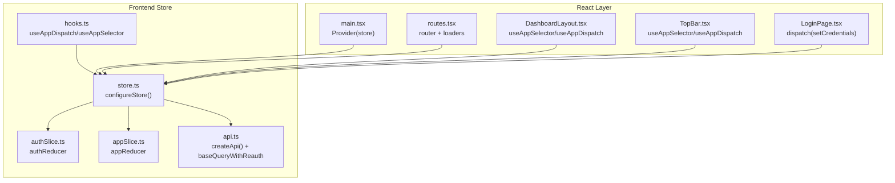
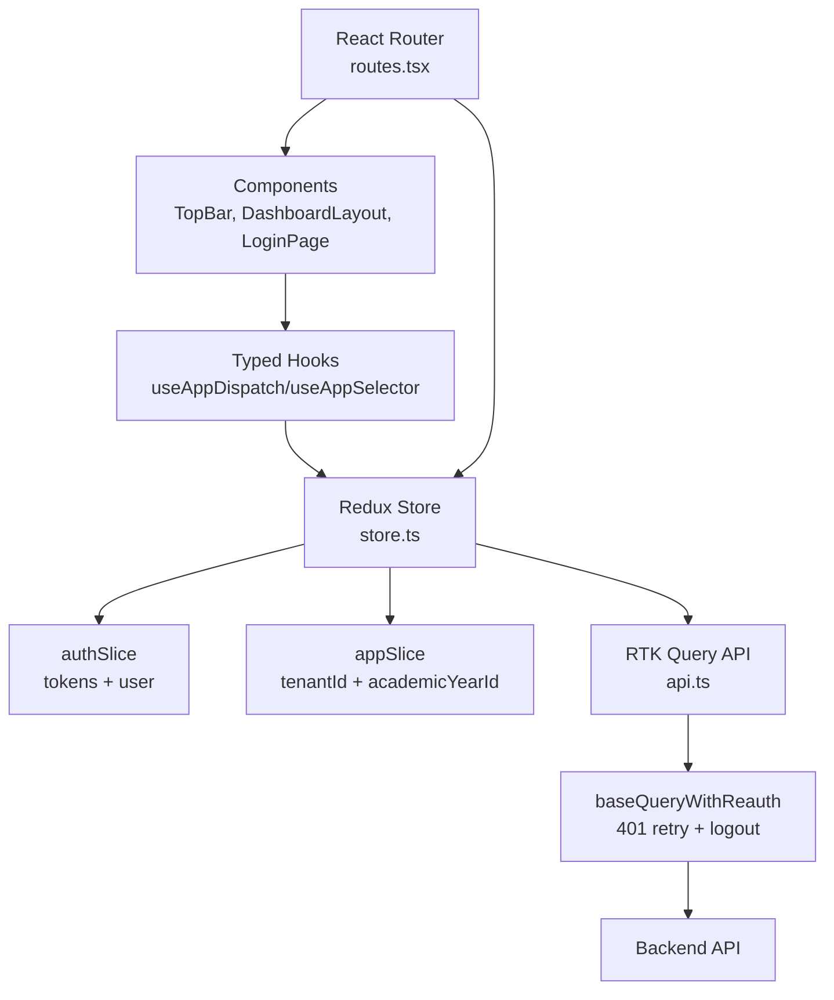
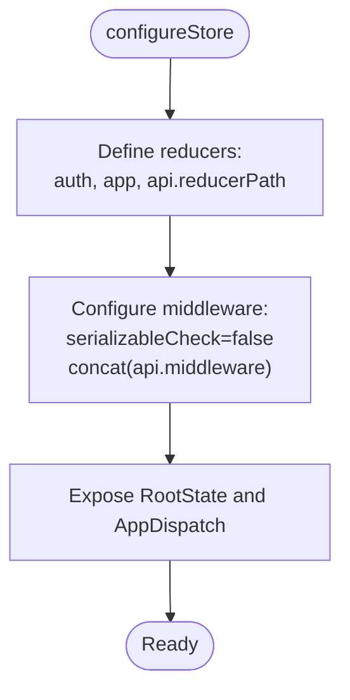
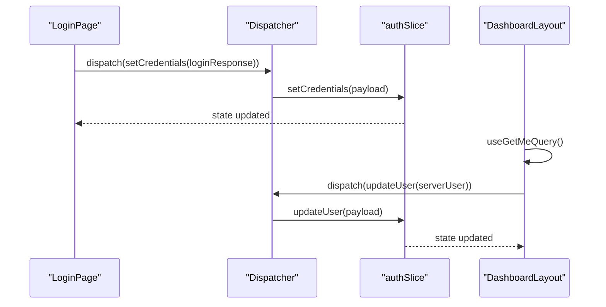
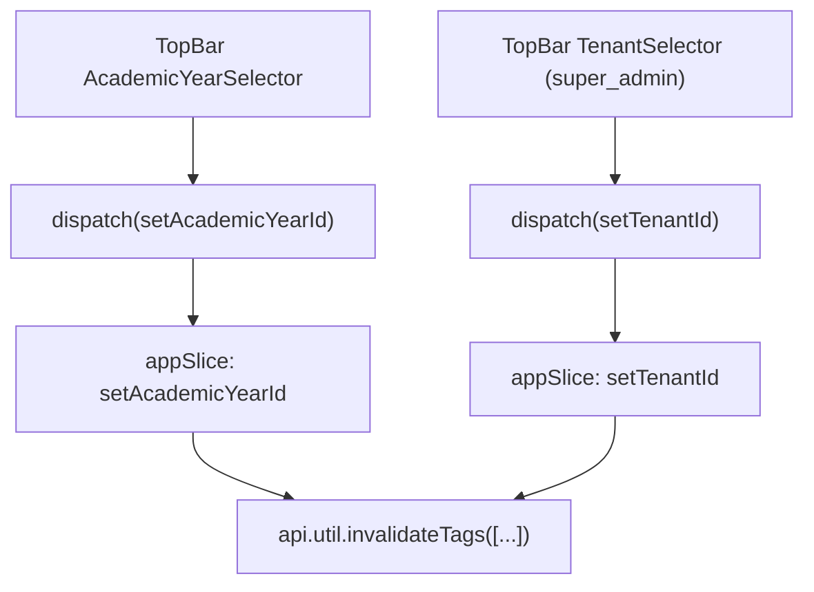
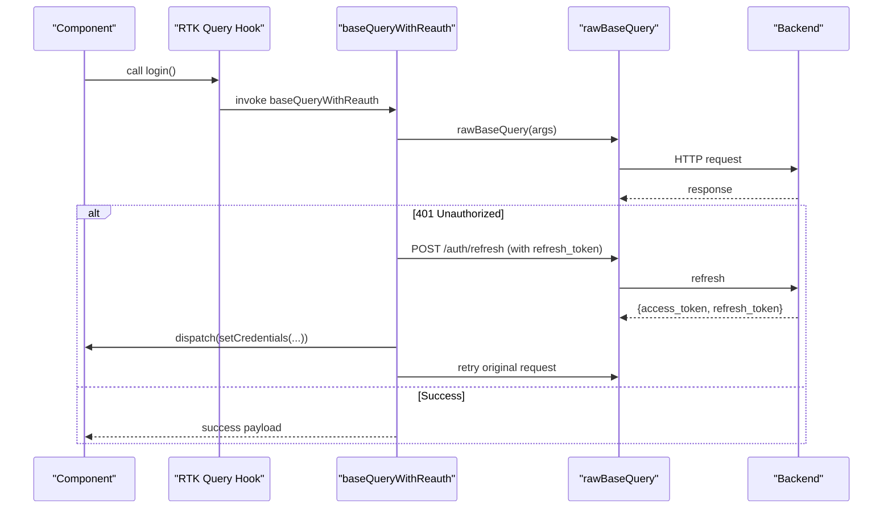
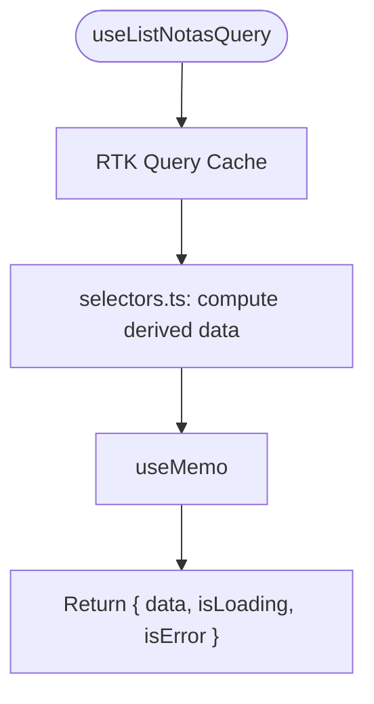
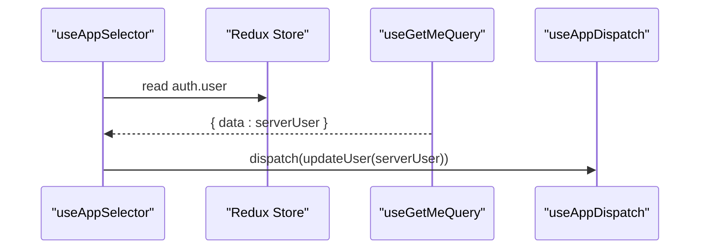
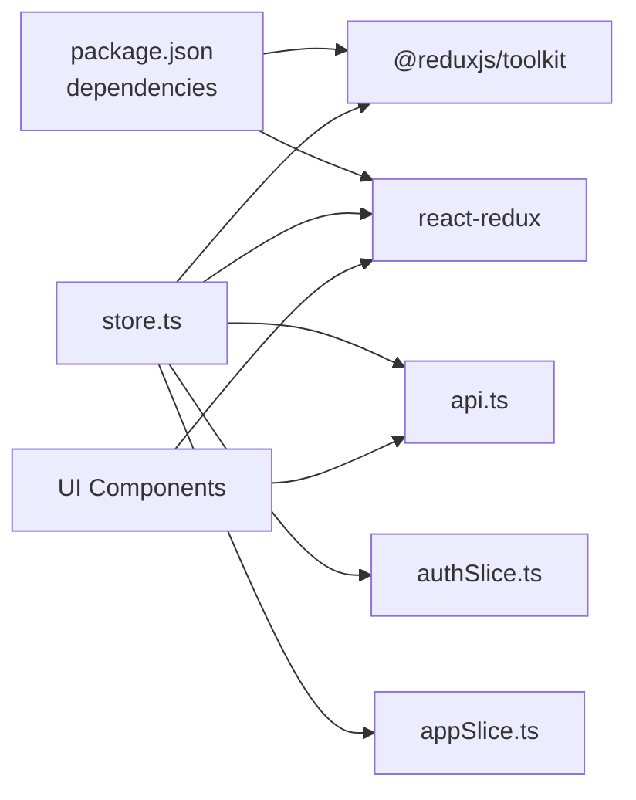

# State Management with Redux Toolkit

<cite>
**Referenced Files in This Document**
- [store.ts](file://frontend/src/app/store.ts)
- [hooks.ts](file://frontend/src/app/hooks.ts)
- [authSlice.ts](file://frontend/src/features/auth/authSlice.ts)
- [appSlice.ts](file://frontend/src/features/app/appSlice.ts)
- [api.ts](file://frontend/src/lib/api.ts)
- [main.tsx](file://frontend/src/main.tsx)
- [routes.tsx](file://frontend/src/app/routes.tsx)
- [DashboardLayout.tsx](file://frontend/src/layouts/DashboardLayout.tsx)
- [TopBar.tsx](file://frontend/src/components/navigation/TopBar.tsx)
- [LoginPage.tsx](file://frontend/src/features/auth/LoginPage.tsx)
- [selectors.ts](file://frontend/src/features/relatorios/selectors.ts)
- [config.tsx](file://frontend/src/features/relatorios/config.tsx)
- [package.json](file://frontend/package.json)
</cite>

## Table of Contents
1. [Introduction](#introduction)
2. [Project Structure](#project-structure)
3. [Core Components](#core-components)
4. [Architecture Overview](#architecture-overview)
5. [Detailed Component Analysis](#detailed-component-analysis)
6. [Dependency Analysis](#dependency-analysis)
7. [Performance Considerations](#performance-considerations)
8. [Troubleshooting Guide](#troubleshooting-guide)
9. [Conclusion](#conclusion)
10. [Appendices](#appendices)

## Introduction
This document explains the Redux Toolkit-based state management implementation in the frontend. It covers store configuration, slice creation patterns, action and reducer organization, authentication and global app state slices, and RTK Query data fetching patterns. It also provides practical examples of state updates, selector usage, async flows, state persistence considerations, middleware configuration, performance optimization techniques, and guidelines for organizing complex state logic while maintaining consistency across the application.

## Project Structure
The Redux implementation centers around a single store that combines:
- Feature slices for authentication and global app state
- RTK Query API slice for data fetching and caching
- Typed hooks for React-Redux integration

**Diagram sources**
- [store.ts:1-21](file://frontend/src/app/store.ts#L1-L21)
- [hooks.ts:1-7](file://frontend/src/app/hooks.ts#L1-L7)
- [authSlice.ts:1-50](file://frontend/src/features/auth/authSlice.ts#L1-L50)
- [appSlice.ts:1-28](file://frontend/src/features/app/appSlice.ts#L1-L28)
- [api.ts:409-790](file://frontend/src/lib/api.ts#L409-L790)
- [main.tsx:1-28](file://frontend/src/main.tsx#L1-L28)
- [routes.tsx:1-115](file://frontend/src/app/routes.tsx#L1-L115)
- [DashboardLayout.tsx:1-73](file://frontend/src/layouts/DashboardLayout.tsx#L1-L73)
- [TopBar.tsx:1-340](file://frontend/src/components/navigation/TopBar.tsx#L1-L340)
- [LoginPage.tsx:1-370](file://frontend/src/features/auth/LoginPage.tsx#L1-L370)

**Section sources**
- [store.ts:1-21](file://frontend/src/app/store.ts#L1-L21)
- [hooks.ts:1-7](file://frontend/src/app/hooks.ts#L1-L7)
- [main.tsx:1-28](file://frontend/src/main.tsx#L1-L28)
- [routes.tsx:1-115](file://frontend/src/app/routes.tsx#L1-L115)

## Core Components
- Store configuration: centralizes reducers and middleware, exposes typed RootState and AppDispatch
- Feature slices:
  - Authentication slice manages tokens and user profile
  - App slice manages multi-tenant and academic year scoping
- RTK Query API:
  - Centralized baseQuery with automatic token injection and retry-on-401 flow
  - Tag-based cache management for granular invalidation
- Typed hooks:
  - useAppDispatch and useAppSelector for type-safe Redux usage

Practical usage examples:
- Dispatching credentials after login and setting tenant ID
- Using selectors to derive report data from cached notes
- Updating user profile via a follow-up query and dispatch

**Section sources**
- [store.ts:1-21](file://frontend/src/app/store.ts#L1-L21)
- [authSlice.ts:1-50](file://frontend/src/features/auth/authSlice.ts#L1-L50)
- [appSlice.ts:1-28](file://frontend/src/features/app/appSlice.ts#L1-L28)
- [api.ts:336-407](file://frontend/src/lib/api.ts#L336-L407)
- [api.ts:409-790](file://frontend/src/lib/api.ts#L409-L790)
- [hooks.ts:1-7](file://frontend/src/app/hooks.ts#L1-L7)
- [LoginPage.tsx:106-127](file://frontend/src/features/auth/LoginPage.tsx#L106-L127)
- [DashboardLayout.tsx:21-28](file://frontend/src/layouts/DashboardLayout.tsx#L21-L28)
- [TopBar.tsx:46-81](file://frontend/src/components/navigation/TopBar.tsx#L46-L81)
- [TopBar.tsx:83-120](file://frontend/src/components/navigation/TopBar.tsx#L83-L120)
- [selectors.ts:38-164](file://frontend/src/features/relatorios/selectors.ts#L38-L164)

## Architecture Overview
The Redux architecture integrates tightly with React Router and RTK Query:
- Provider wraps the app to expose store to components
- Route loaders enforce authentication and redirect logic
- Components use typed hooks to read state and dispatch actions
- RTK Query endpoints encapsulate API calls with caching and tag invalidation

**Diagram sources**
- [main.tsx:11-19](file://frontend/src/main.tsx#L11-L19)
- [store.ts:7-17](file://frontend/src/app/store.ts#L7-L17)
- [authSlice.ts:25-46](file://frontend/src/features/auth/authSlice.ts#L25-L46)
- [appSlice.ts:13-24](file://frontend/src/features/app/appSlice.ts#L13-L24)
- [api.ts:359-407](file://frontend/src/lib/api.ts#L359-L407)
- [routes.tsx:29-39](file://frontend/src/app/routes.tsx#L29-L39)

## Detailed Component Analysis

### Store Configuration and Middleware
- Reducers:
  - auth: authentication state
  - app: tenant and academic year scoping
  - api.reducerPath: RTK Query reducer
- Middleware:
  - Serializability relaxed for non-serializable payloads (e.g., FormData)
  - RTK Query middleware appended to support caching and invalidation
- Types:
  - RootState and AppDispatch exported for typed hooks

**Diagram sources**
- [store.ts:7-17](file://frontend/src/app/store.ts#L7-L17)
- [store.ts:19-21](file://frontend/src/app/store.ts#L19-L21)

**Section sources**
- [store.ts:1-21](file://frontend/src/app/store.ts#L1-L21)
- [api.ts:409-412](file://frontend/src/lib/api.ts#L409-L412)

### Authentication Slice
- State shape:
  - accessToken, refreshToken, user profile
- Actions:
  - setCredentials: stores tokens and user
  - logout: clears tokens and user
  - updateUser: updates user profile from server
- Usage:
  - LoginPage dispatches setCredentials after successful login
  - DashboardLayout dispatches updateUser when server profile changes

**Diagram sources**
- [authSlice.ts:25-46](file://frontend/src/features/auth/authSlice.ts#L25-L46)
- [LoginPage.tsx:110-119](file://frontend/src/features/auth/LoginPage.tsx#L110-L119)
- [DashboardLayout.tsx:21-28](file://frontend/src/layouts/DashboardLayout.tsx#L21-L28)

**Section sources**
- [authSlice.ts:1-50](file://frontend/src/features/auth/authSlice.ts#L1-L50)
- [LoginPage.tsx:106-127](file://frontend/src/features/auth/LoginPage.tsx#L106-L127)
- [DashboardLayout.tsx:16-28](file://frontend/src/layouts/DashboardLayout.tsx#L16-L28)

### App Slice (Global Scope)
- State shape:
  - academicYearId, tenantId
- Actions:
  - setAcademicYearId, setTenantId
- Usage:
  - TopBar updates academic year and invalidates related tags
  - TopBar updates tenant for super admins and invalidates tags

**Diagram sources**
- [appSlice.ts:13-24](file://frontend/src/features/app/appSlice.ts#L13-L24)
- [TopBar.tsx:46-81](file://frontend/src/components/navigation/TopBar.tsx#L46-L81)
- [TopBar.tsx:83-120](file://frontend/src/components/navigation/TopBar.tsx#L83-L120)

**Section sources**
- [appSlice.ts:1-28](file://frontend/src/features/app/appSlice.ts#L1-L28)
- [TopBar.tsx:46-120](file://frontend/src/components/navigation/TopBar.tsx#L46-L120)

### RTK Query: API Setup and Base Behavior
- Base query:
  - fetchBaseQuery with dynamic headers (authorization, academic year, tenant)
  - baseQueryWithReauth handles 401 by refreshing tokens and retrying
- Endpoints:
  - Rich set of queries and mutations for entities (users, students, grades, reports, etc.)
  - Tag-based caching and invalidation for consistency
- Generated hooks:
  - useXxxQuery/useXxxMutation for each endpoint
  - api.util.invalidateTags for cache management

**Diagram sources**
- [api.ts:336-357](file://frontend/src/lib/api.ts#L336-L357)
- [api.ts:363-407](file://frontend/src/lib/api.ts#L363-L407)
- [api.ts:409-790](file://frontend/src/lib/api.ts#L409-L790)

**Section sources**
- [api.ts:336-407](file://frontend/src/lib/api.ts#L336-L407)
- [api.ts:409-790](file://frontend/src/lib/api.ts#L409-L790)

### Data Fetching Patterns and Derived State
- Direct queries/mutations:
  - LoginPage uses useLoginMutation and dispatches setCredentials
  - DashboardLayout uses useGetMeQuery and dispatches updateUser
- Derived selectors:
  - selectors.ts computes derived report data from cached notes
  - Uses useMemo to avoid recomputation and integrates loading states

**Diagram sources**
- [LoginPage.tsx:73-127](file://frontend/src/features/auth/LoginPage.tsx#L73-L127)
- [DashboardLayout.tsx:21-28](file://frontend/src/layouts/DashboardLayout.tsx#L21-L28)
- [selectors.ts:38-164](file://frontend/src/features/relatorios/selectors.ts#L38-L164)

**Section sources**
- [LoginPage.tsx:106-127](file://frontend/src/features/auth/LoginPage.tsx#L106-L127)
- [DashboardLayout.tsx:21-28](file://frontend/src/layouts/DashboardLayout.tsx#L21-L28)
- [selectors.ts:38-164](file://frontend/src/features/relatorios/selectors.ts#L38-L164)

### Selector Usage and Async Thunks
- Typed selectors:
  - useAppSelector reads from RootState
  - useAppDispatch dispatches actions and thunk results
- Async flows:
  - useGetMeQuery triggers a follow-up dispatch to updateUser
  - useLoginMutation unwraps and dispatches setCredentials
- Derived computations:
  - selectors.ts encapsulates report-specific transformations

**Diagram sources**
- [hooks.ts:1-7](file://frontend/src/app/hooks.ts#L1-L7)
- [DashboardLayout.tsx:18-28](file://frontend/src/layouts/DashboardLayout.tsx#L18-L28)

**Section sources**
- [hooks.ts:1-7](file://frontend/src/app/hooks.ts#L1-L7)
- [DashboardLayout.tsx:16-28](file://frontend/src/layouts/DashboardLayout.tsx#L16-L28)
- [LoginPage.tsx:106-127](file://frontend/src/features/auth/LoginPage.tsx#L106-L127)

### Practical Examples
- State updates after login:
  - Dispatch setCredentials with login response
  - Optionally dispatch setTenantId based on user’s tenant
- Selector usage:
  - Compute derived report data from cached notes
  - Return loading and error states alongside computed data
- Async thunks:
  - useGetMeQuery followed by updateUser dispatch
  - useLoginMutation unwrapped to handle success and error paths

**Section sources**
- [LoginPage.tsx:106-127](file://frontend/src/features/auth/LoginPage.tsx#L106-L127)
- [DashboardLayout.tsx:21-28](file://frontend/src/layouts/DashboardLayout.tsx#L21-L28)
- [selectors.ts:38-164](file://frontend/src/features/relatorios/selectors.ts#L38-L164)

## Dependency Analysis
- Runtime dependencies include @reduxjs/toolkit and react-redux
- Store depends on:
  - authSlice and appSlice reducers
  - RTK Query api reducer and middleware
- Components depend on:
  - Typed hooks for store access
  - RTK Query hooks for data
  - Route loaders for auth gating

**Diagram sources**
- [package.json:21-29](file://frontend/package.json#L21-L29)
- [store.ts:1-21](file://frontend/src/app/store.ts#L1-L21)
- [api.ts:409-412](file://frontend/src/lib/api.ts#L409-L412)
- [authSlice.ts:1-50](file://frontend/src/features/auth/authSlice.ts#L1-L50)
- [appSlice.ts:1-28](file://frontend/src/features/app/appSlice.ts#L1-L28)

**Section sources**
- [package.json:12-32](file://frontend/package.json#L12-L32)
- [store.ts:1-21](file://frontend/src/app/store.ts#L1-L21)

## Performance Considerations
- Prefer tag-based cache invalidation to minimize refetches
- Use keepUnusedDataFor strategically to balance memory and freshness
- Avoid unnecessary re-renders by using useMemo in derived selectors
- Keep payloads serializable; relax serializability only when necessary (e.g., FormData)
- Invalidate only affected tags when updating data to reduce network usage

[No sources needed since this section provides general guidance]

## Troubleshooting Guide
- Authentication loops:
  - Ensure route loaders check auth state and redirect appropriately
- 401 errors:
  - Verify baseQueryWithReauth logic and refresh endpoint availability
- Stale data after updates:
  - Confirm invalidation tags match endpoint providesTags
- Token propagation:
  - Check header injection logic for authorization, academic year, and tenant

**Section sources**
- [routes.tsx:29-39](file://frontend/src/app/routes.tsx#L29-L39)
- [api.ts:359-407](file://frontend/src/lib/api.ts#L359-L407)
- [api.ts:409-790](file://frontend/src/lib/api.ts#L409-L790)

## Conclusion
The Redux Toolkit implementation organizes state cleanly with feature slices for authentication and global scope, integrates tightly with RTK Query for robust data fetching and caching, and enforces type safety via custom hooks. The architecture supports secure, scalable state management with clear patterns for async flows, derived computations, and cache invalidation.

[No sources needed since this section summarizes without analyzing specific files]

## Appendices

### Appendix A: Store Composition and Middleware
- Reducer composition includes auth, app, and RTK Query
- Middleware concatenation enables caching and invalidation
- Exported types enable strongly-typed usage across components

**Section sources**
- [store.ts:7-17](file://frontend/src/app/store.ts#L7-L17)
- [store.ts:19-21](file://frontend/src/app/store.ts#L19-L21)

### Appendix B: Authentication and Global Scope Patterns
- Authentication slice centralizes JWT lifecycle
- App slice scopes requests to tenant and academic year
- Route loaders enforce auth and role-based redirects

**Section sources**
- [authSlice.ts:19-44](file://frontend/src/features/auth/authSlice.ts#L19-L44)
- [appSlice.ts:8-22](file://frontend/src/features/app/appSlice.ts#L8-L22)
- [routes.tsx:29-39](file://frontend/src/app/routes.tsx#L29-L39)

### Appendix C: RTK Query Endpoints and Tags
- Comprehensive endpoint coverage for CRUD and analytics
- Tag-based caching ensures consistency across views
- Automatic retry on 401 with token refresh

**Section sources**
- [api.ts:409-790](file://frontend/src/lib/api.ts#L409-L790)