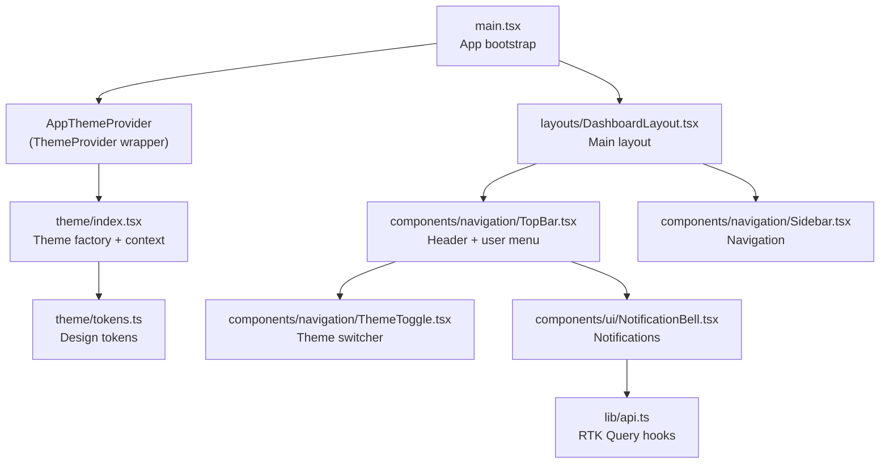
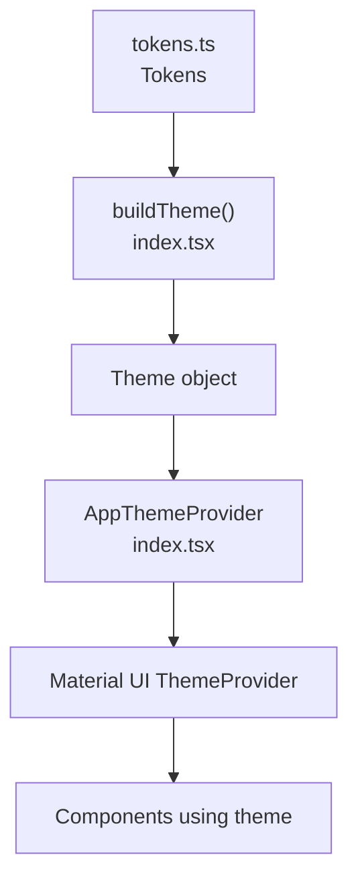
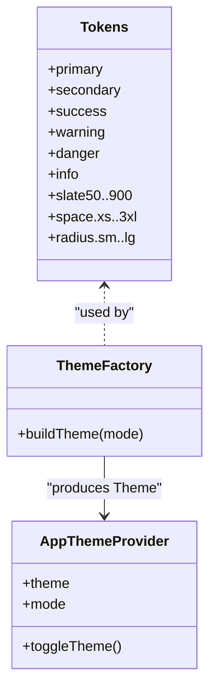
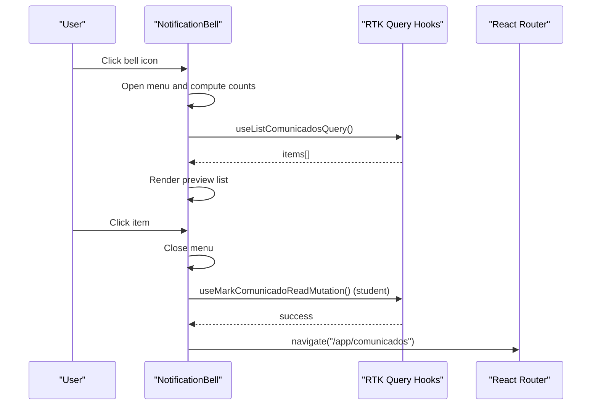
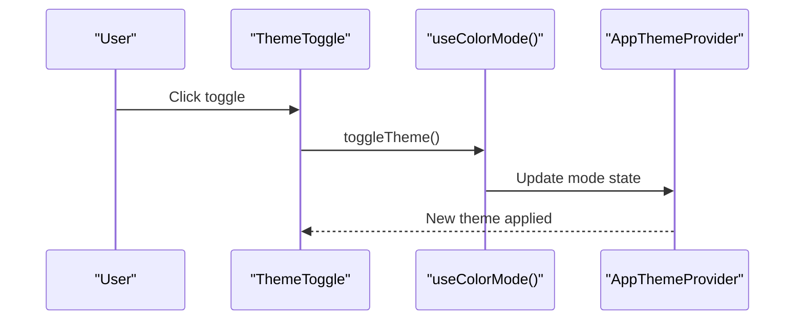
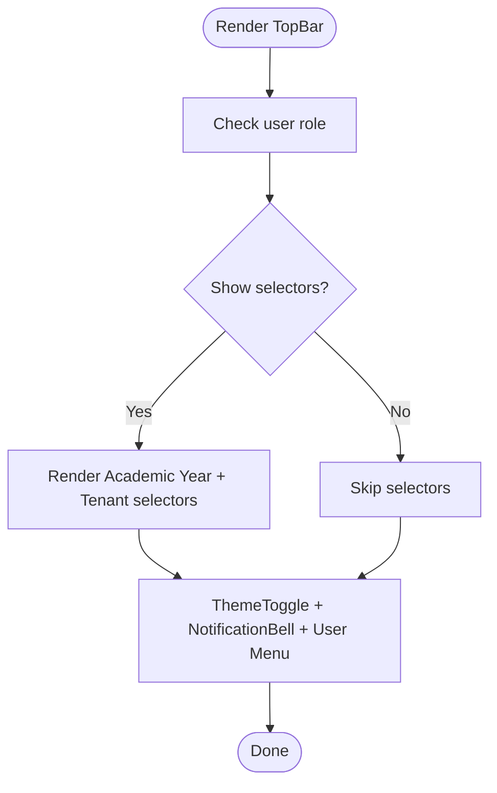
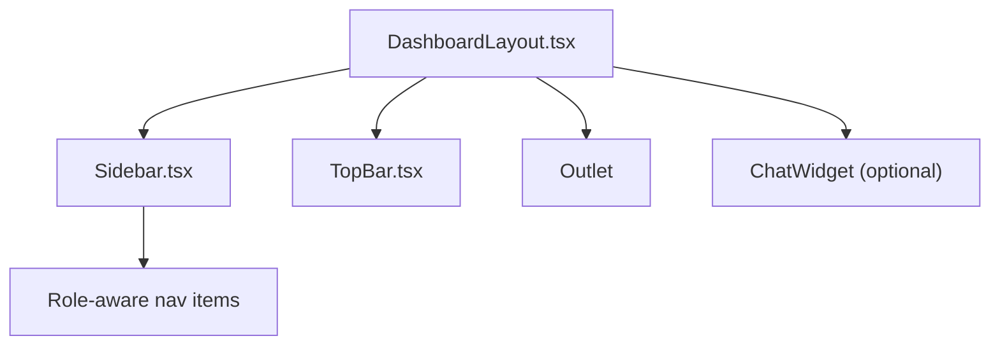
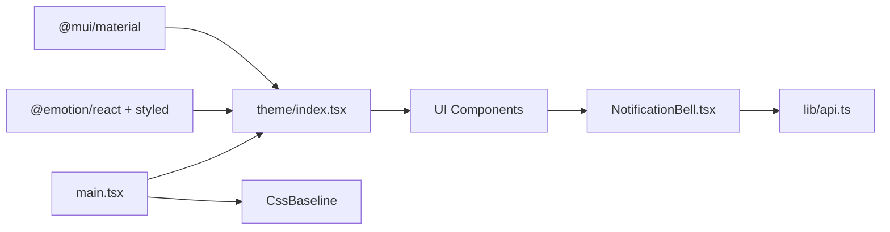

# UI Components and Material Design

<cite>
**Referenced Files in This Document**
- [main.tsx](file://frontend/src/main.tsx)
- [index.tsx](file://frontend/src/theme/index.tsx)
- [tokens.ts](file://frontend/src/theme/tokens.ts)
- [NotificationBell.tsx](file://frontend/src/components/ui/NotificationBell.tsx)
- [ThemeToggle.tsx](file://frontend/src/components/navigation/ThemeToggle.tsx)
- [TopBar.tsx](file://frontend/src/components/navigation/TopBar.tsx)
- [DashboardLayout.tsx](file://frontend/src/layouts/DashboardLayout.tsx)
- [Sidebar.tsx](file://frontend/src/components/navigation/Sidebar.tsx)
- [api.ts](file://frontend/src/lib/api.ts)
- [package.json](file://frontend/package.json)
- [vite.config.ts](file://frontend/vite.config.ts)
</cite>

## Table of Contents
1. [Introduction](#introduction)
2. [Project Structure](#project-structure)
3. [Core Components](#core-components)
4. [Architecture Overview](#architecture-overview)
5. [Detailed Component Analysis](#detailed-component-analysis)
6. [Dependency Analysis](#dependency-analysis)
7. [Performance Considerations](#performance-considerations)
8. [Troubleshooting Guide](#troubleshooting-guide)
9. [Conclusion](#conclusion)
10. [Appendices](#appendices)

## Introduction
This document explains the Material UI component library and custom UI elements used in the frontend. It documents the theme system built on Material UI v6, design tokens, component composition patterns, and the notification bell. It also covers the theme provider setup, responsive design principles, component customization, variant creation, accessibility, styling approaches, and guidelines for creating reusable components while maintaining visual coherence.

## Project Structure
The UI system centers around a Material UI theme provider, a set of design tokens, and reusable components organized under navigation and UI folders. The application bootstraps the theme provider at the root and composes top-level layouts with navigation and notifications.

**Diagram sources**
- [main.tsx:11-20](file://frontend/src/main.tsx#L11-L20)
- [index.tsx:184-194](file://frontend/src/theme/index.tsx#L184-L194)
- [tokens.ts:5-52](file://frontend/src/theme/tokens.ts#L5-L52)
- [DashboardLayout.tsx:16-71](file://frontend/src/layouts/DashboardLayout.tsx#L16-L71)
- [TopBar.tsx:122-339](file://frontend/src/components/navigation/TopBar.tsx#L122-L339)
- [ThemeToggle.tsx:6-29](file://frontend/src/components/navigation/ThemeToggle.tsx#L6-L29)
- [NotificationBell.tsx:29-244](file://frontend/src/components/ui/NotificationBell.tsx#L29-L244)
- [Sidebar.tsx:39-194](file://frontend/src/components/navigation/Sidebar.tsx#L39-L194)
- [api.ts:585-621](file://frontend/src/lib/api.ts#L585-L621)

**Section sources**
- [main.tsx:11-20](file://frontend/src/main.tsx#L11-L20)
- [DashboardLayout.tsx:16-71](file://frontend/src/layouts/DashboardLayout.tsx#L16-L71)
- [TopBar.tsx:122-339](file://frontend/src/components/navigation/TopBar.tsx#L122-L339)

## Core Components
- Theme system: A custom theme provider wraps Material UI’s ThemeProvider and exposes a context for theme mode, toggling, and persistence. It builds themes from design tokens and applies global component overrides.
- Design tokens: Centralized color, spacing, and radius tokens define brand and layout consistency.
- NotificationBell: A reusable bell icon with badge count, dropdown preview, and navigation to the communications page. It integrates with RTK Query for fetching and marking items as read.
- ThemeToggle: A small toggle button that switches between light and dark modes.
- TopBar: A responsive header containing search, academic year selector, tenant selector (for super admins), theme toggle, notification bell, and user menu.
- DashboardLayout: A layout that renders sidebar, mobile drawer, top bar, outlet, and optional chat widget.
- Sidebar: Navigation drawer/list with role-aware items and active state styling.

**Section sources**
- [index.tsx:6-132](file://frontend/src/theme/index.tsx#L6-L132)
- [tokens.ts:5-52](file://frontend/src/theme/tokens.ts#L5-L52)
- [NotificationBell.tsx:29-244](file://frontend/src/components/ui/NotificationBell.tsx#L29-L244)
- [ThemeToggle.tsx:6-29](file://frontend/src/components/navigation/ThemeToggle.tsx#L6-L29)
- [TopBar.tsx:122-339](file://frontend/src/components/navigation/TopBar.tsx#L122-L339)
- [DashboardLayout.tsx:16-71](file://frontend/src/layouts/DashboardLayout.tsx#L16-L71)
- [Sidebar.tsx:39-194](file://frontend/src/components/navigation/Sidebar.tsx#L39-L194)

## Architecture Overview
The theme system is composed of a theme factory that reads tokens, applies palette and typography scales, and sets component overrides. The provider exposes a context for mode and toggle, persists preferences to local storage, and supplies a theme to the app tree. Components consume the theme via Material UI primitives and styled props.

**Diagram sources**
- [tokens.ts:5-52](file://frontend/src/theme/tokens.ts#L5-L52)
- [index.tsx:6-132](file://frontend/src/theme/index.tsx#L6-L132)
- [index.tsx:184-194](file://frontend/src/theme/index.tsx#L184-L194)

**Section sources**
- [index.tsx:6-132](file://frontend/src/theme/index.tsx#L6-L132)
- [index.tsx:184-194](file://frontend/src/theme/index.tsx#L184-L194)

## Detailed Component Analysis

### Theme System and Design Tokens
- Palette and typography scales are derived from tokens to ensure consistent brand and readability.
- Shape rounding is intentionally sharp for a modern academic feel.
- Global component overrides are applied for buttons, cards, and text fields to align with brand identity.

**Diagram sources**
- [tokens.ts:5-52](file://frontend/src/theme/tokens.ts#L5-L52)
- [index.tsx:6-132](file://frontend/src/theme/index.tsx#L6-L132)
- [index.tsx:184-194](file://frontend/src/theme/index.tsx#L184-L194)

**Section sources**
- [tokens.ts:5-52](file://frontend/src/theme/tokens.ts#L5-L52)
- [index.tsx:6-132](file://frontend/src/theme/index.tsx#L6-L132)

### NotificationBell Component
- Responsibilities:
  - Compute unread count based on user role (students vs staff).
  - Render a bell icon with a badge and a dropdown menu showing recent communications.
  - Mark items as read for students upon selection.
  - Navigate to the communications page.
- Data and effects:
  - Uses RTK Query hooks to list communications and mark as read.
  - Memoizes unread count and preview list to avoid unnecessary re-renders.
  - Applies animations to the badge when there are unread items.

**Diagram sources**
- [NotificationBell.tsx:29-244](file://frontend/src/components/ui/NotificationBell.tsx#L29-L244)
- [api.ts:585-621](file://frontend/src/lib/api.ts#L585-L621)

**Section sources**
- [NotificationBell.tsx:29-244](file://frontend/src/components/ui/NotificationBell.tsx#L29-L244)
- [api.ts:585-621](file://frontend/src/lib/api.ts#L585-L621)

### ThemeToggle Component
- Integrates with the theme context to toggle between light and dark modes.
- Provides a tooltip with accessible labels.

**Diagram sources**
- [ThemeToggle.tsx:6-29](file://frontend/src/components/navigation/ThemeToggle.tsx#L6-L29)
- [index.tsx:176-182](file://frontend/src/theme/index.tsx#L176-L182)
- [index.tsx:184-194](file://frontend/src/theme/index.tsx#L184-L194)

**Section sources**
- [ThemeToggle.tsx:6-29](file://frontend/src/components/navigation/ThemeToggle.tsx#L6-L29)
- [index.tsx:176-182](file://frontend/src/theme/index.tsx#L176-L182)

### TopBar Composition
- Contains search input, academic year selector, tenant selector (super admin), theme toggle, notification bell, and user menu.
- Implements responsive behavior using Material UI sx breakpoints.
- Integrates avatar initials and role labels.

**Diagram sources**
- [TopBar.tsx:122-339](file://frontend/src/components/navigation/TopBar.tsx#L122-L339)

**Section sources**
- [TopBar.tsx:122-339](file://frontend/src/components/navigation/TopBar.tsx#L122-L339)

### DashboardLayout and Sidebar
- DashboardLayout manages mobile/desktop navigation, user routing checks, and outlet rendering.
- Sidebar adapts to mobile/desktop, renders role-aware navigation items, and highlights active routes.

**Diagram sources**
- [DashboardLayout.tsx:16-71](file://frontend/src/layouts/DashboardLayout.tsx#L16-L71)
- [Sidebar.tsx:39-194](file://frontend/src/components/navigation/Sidebar.tsx#L39-L194)
- [TopBar.tsx:122-339](file://frontend/src/components/navigation/TopBar.tsx#L122-L339)

**Section sources**
- [DashboardLayout.tsx:16-71](file://frontend/src/layouts/DashboardLayout.tsx#L16-L71)
- [Sidebar.tsx:39-194](file://frontend/src/components/navigation/Sidebar.tsx#L39-L194)

## Dependency Analysis
- The theme provider depends on Material UI ThemeProvider and consumes design tokens.
- Components depend on Material UI primitives and styled props for consistent styling.
- NotificationBell depends on RTK Query hooks for data fetching and navigation for routing.
- The application bootstraps the provider at the root and applies CssBaseline globally.

**Diagram sources**
- [package.json:12-31](file://frontend/package.json#L12-L31)
- [index.tsx:1-4](file://frontend/src/theme/index.tsx#L1-L4)
- [main.tsx:3](file://frontend/src/main.tsx#L3)
- [NotificationBell.tsx:11-27](file://frontend/src/components/ui/NotificationBell.tsx#L11-L27)
- [api.ts:1-2](file://frontend/src/lib/api.ts#L1-L2)

**Section sources**
- [package.json:12-31](file://frontend/package.json#L12-L31)
- [main.tsx:3](file://frontend/src/main.tsx#L3)
- [index.tsx:1-4](file://frontend/src/theme/index.tsx#L1-L4)

## Performance Considerations
- Memoization: NotificationBell memoizes unread count and preview list to reduce re-renders.
- Conditional rendering: TopBar hides selectors when not applicable to minimize DOM.
- Component overrides: Centralized overrides avoid per-instance style recomputation.
- Theme computation: The theme is memoized by mode to prevent unnecessary rebuilds.

[No sources needed since this section provides general guidance]

## Troubleshooting Guide
- Theme not applying:
  - Ensure the provider wraps the root and CssBaseline is included.
  - Verify local storage key and mode initialization logic.
- NotificationBell not updating:
  - Confirm RTK Query endpoints are reachable and tags invalidate as expected.
  - Check that mark-as-read mutation is called for students.
- Responsive layout issues:
  - Review sx breakpoints and drawer visibility logic in DashboardLayout and TopBar.

**Section sources**
- [main.tsx:11-20](file://frontend/src/main.tsx#L11-L20)
- [index.tsx:148-171](file://frontend/src/theme/index.tsx#L148-L171)
- [NotificationBell.tsx:59-65](file://frontend/src/components/ui/NotificationBell.tsx#L59-L65)
- [DashboardLayout.tsx:16-71](file://frontend/src/layouts/DashboardLayout.tsx#L16-L71)
- [TopBar.tsx:122-339](file://frontend/src/components/navigation/TopBar.tsx#L122-L339)

## Conclusion
The UI system leverages Material UI v6 with a custom theme provider and design tokens to enforce a cohesive, accessible, and responsive design. Components like NotificationBell, ThemeToggle, TopBar, Sidebar, and DashboardLayout demonstrate composition patterns that promote reuse and maintainability. By centralizing tokens and theme overrides, the system ensures consistent visuals across roles and devices.

[No sources needed since this section summarizes without analyzing specific files]

## Appendices

### Styling Approaches and CSS-in-JS
- Material UI sx prop: Used extensively for responsive styles and dynamic theming.
- Global component overrides: Applied in theme components to align brand identity.
- Emotion integration: Supported via @emotion/react and @emotion/styled for advanced styling needs.

**Section sources**
- [index.tsx:98-131](file://frontend/src/theme/index.tsx#L98-L131)
- [package.json:12-31](file://frontend/package.json#L12-L31)

### Accessibility Implementation
- Interactive elements use appropriate Material UI props and roles.
- Tooltips and icons include accessible labels.
- Keyboard navigation and focus indicators are preserved through Material UI components.

[No sources needed since this section provides general guidance]

### Responsive Design Principles
- Breakpoints and display logic are controlled via sx props and responsive display helpers.
- Mobile-first drawer behavior complements desktop navigation.
- Typography scales and spacing tokens adapt across device sizes.

**Section sources**
- [TopBar.tsx:214-229](file://frontend/src/components/navigation/TopBar.tsx#L214-L229)
- [DashboardLayout.tsx:51-62](file://frontend/src/layouts/DashboardLayout.tsx#L51-L62)
- [Sidebar.tsx:76-91](file://frontend/src/components/navigation/Sidebar.tsx#L76-L91)

### Creating Reusable Components and Maintaining Visual Coherence
- Use design tokens for colors, spacing, and radii.
- Prefer Material UI primitives with sx props for styling.
- Encapsulate data fetching with RTK Query hooks inside components.
- Keep component APIs minimal and consistent across similar elements.

[No sources needed since this section provides general guidance]