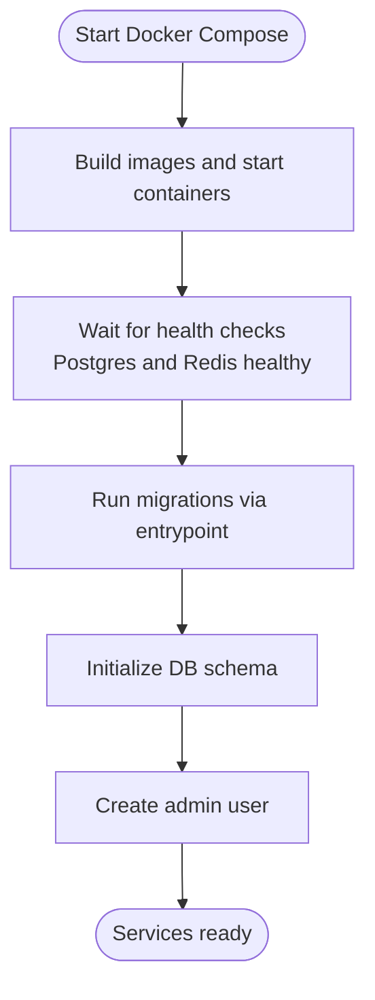
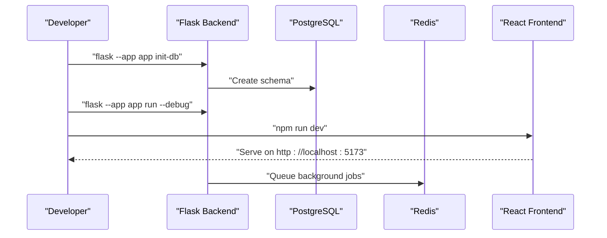
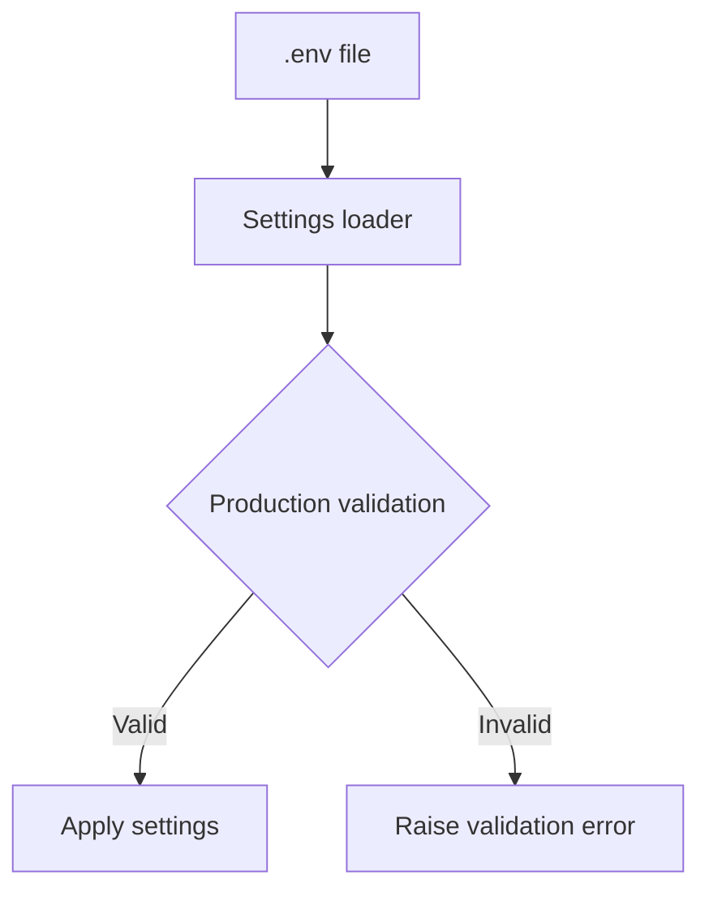
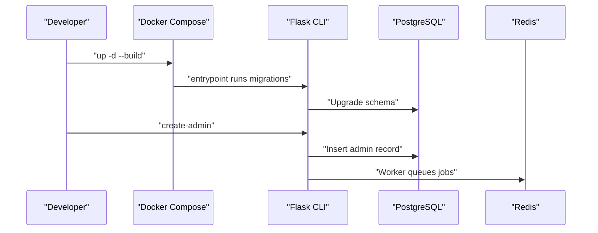
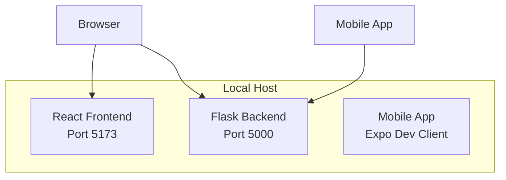
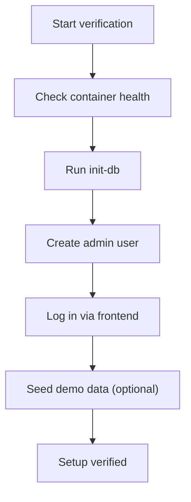

# Getting Started

<cite>
**Referenced Files in This Document**
- [README.md](file://README.md)
- [docker-compose.yml](file://docker-compose.yml)
- [backend/Dockerfile](file://backend/Dockerfile)
- [frontend/Dockerfile](file://frontend/Dockerfile)
- [backend/entrypoint.sh](file://backend/entrypoint.sh)
- [backend/pyproject.toml](file://backend/pyproject.toml)
- [backend/app/cli.py](file://backend/app/cli.py)
- [backend/app/core/config.py](file://backend/app/core/config.py)
- [backend/README.md](file://backend/README.md)
- [frontend/README.md](file://frontend/README.md)
- [mobile/package.json](file://mobile/package.json)
- [mobile/app.json](file://mobile/app.json)
</cite>

## Table of Contents
1. [Introduction](#introduction)
2. [Prerequisites](#prerequisites)
3. [Installation Methods](#installation-methods)
4. [Environment Configuration](#environment-configuration)
5. [Local Development Workflow](#local-development-workflow)
6. [Accessing Components](#accessing-components)
7. [Basic Usage Patterns](#basic-usage-patterns)
8. [Verification Steps](#verification-steps)
9. [Troubleshooting Guide](#troubleshooting-guide)
10. [Conclusion](#conclusion)

## Introduction
This guide helps you quickly set up and onboard to the ColaboraEdu platform. It covers prerequisites, installation via Docker (recommended for most users), manual setup for advanced developers, environment configuration, database initialization, and how to access the web, mobile, and backend components. You will also find practical verification steps and troubleshooting tips to resolve common setup issues.

## Prerequisites
Ensure your machine meets the minimum requirements before proceeding:
- Docker Engine 24+ and Docker Compose 2.20+ (preferred for local development)
- OR Python 3.12+, Node.js 18+, PostgreSQL 15+, Redis 7+ (manual setup)
- Git for cloning the repository

These requirements align with the technologies used across the backend (Flask), frontend (React/Vite), and infrastructure (PostgreSQL, Redis).

**Section sources**
- [README.md:88-92](file://README.md#L88-L92)

## Installation Methods
Choose one of the following installation approaches depending on your preference and environment.

### Option A: Docker-based Development (Recommended)
Use Docker Compose to spin up all services with a single command. This method ensures consistent environments and minimal setup overhead.

- Clone the repository and navigate to the project root.
- Start all services in detached mode with auto-build:
  - Command: docker-compose up -d --build
- Initialize the database and create the initial admin user:
  - Command: docker-compose exec backend flask --app app init-db
  - Command: docker-compose exec backend flask --app app create-admin
- Access the services:
  - Web frontend: http://localhost:5173
  - Backend API: http://localhost:5000

**Diagram sources**
- [docker-compose.yml:1-103](file://docker-compose.yml#L1-L103)
- [backend/entrypoint.sh:1-21](file://backend/entrypoint.sh#L1-L21)

**Section sources**
- [README.md:93-111](file://README.md#L93-L111)
- [docker-compose.yml:1-103](file://docker-compose.yml#L1-L103)
- [backend/entrypoint.sh:1-21](file://backend/entrypoint.sh#L1-L21)

### Option B: Manual Setup (Advanced Developers)
For granular control, set up each component manually using native tools.

- Backend (Flask):
  - Create and activate a Python virtual environment.
  - Install development dependencies from the backend project configuration.
  - Copy the environment template to .env and adjust variables.
  - Initialize the database and run the development server.
  - Commands: flask --app app init-db, flask --app app run --debug --host 0.0.0.0 --port 5000

- Frontend (React/Vite):
  - Install Node dependencies.
  - Start the development server on port 5173.
  - Configure the API base URL in .env to point to the backend.

- Background Worker (RQ):
  - Start the Redis-backed worker for background jobs.
  - Command: rq worker default --url redis://localhost:6379/0

**Diagram sources**
- [backend/README.md:11-21](file://backend/README.md#L11-L21)
- [frontend/README.md:5-22](file://frontend/README.md#L5-L22)

**Section sources**
- [README.md:112-133](file://README.md#L112-L133)
- [backend/README.md:11-21](file://backend/README.md#L11-L21)
- [frontend/README.md:5-22](file://frontend/README.md#L5-L22)

## Environment Configuration
Configure environment variables for both development and production. Copy the environment template to .env and fill in the required values.

- Copy the template:
  - Command: cp .env.example .env
- Required production variables include:
  - DOMAIN, SECRET_KEY, JWT_SECRET_KEY, POSTGRES_PASSWORD, REDIS_PASSWORD, SMTP_* settings, ACME_EMAIL

- Backend settings are loaded via a centralized configuration module that supports runtime validation and environment-specific overrides.

**Diagram sources**
- [backend/app/core/config.py:1-60](file://backend/app/core/config.py#L1-L60)

**Section sources**
- [README.md:136-159](file://README.md#L136-L159)
- [backend/app/core/config.py:1-60](file://backend/app/core/config.py#L1-L60)

## Local Development Workflow
Follow this step-by-step workflow to develop locally using Docker or manual setup.

- Docker workflow:
  - Start services: docker-compose up -d --build
  - Initialize DB and admin: docker-compose exec backend flask --app app init-db, docker-compose exec backend flask --app app create-admin
  - Observe logs: docker-compose logs -f backend
  - Seed demo data (optional): docker-compose exec backend flask --app app seed-demo

- Manual workflow:
  - Backend: python -m venv .venv && source .venv/bin/activate && pip install -e ".[dev]" && flask --app app init-db && flask --app app run --debug
  - Frontend: cd frontend && npm install && npm run dev
  - Worker: cd backend && source .venv/bin/activate && rq worker default --url redis://localhost:6379/0

**Diagram sources**
- [docker-compose.yml:1-103](file://docker-compose.yml#L1-L103)
- [backend/entrypoint.sh:1-21](file://backend/entrypoint.sh#L1-L21)
- [backend/app/cli.py:28-177](file://backend/app/cli.py#L28-L177)

**Section sources**
- [README.md:236-259](file://README.md#L236-L259)
- [backend/app/cli.py:28-177](file://backend/app/cli.py#L28-L177)

## Accessing Components
After starting the services, access the components at the following URLs:

- Web frontend: http://localhost:5173
- Backend API: http://localhost:5000
- Mobile app: Start the Expo dev client and connect to the backend URL configured in the mobile app configuration.

**Diagram sources**
- [docker-compose.yml:80-94](file://docker-compose.yml#L80-L94)
- [mobile/app.json:1-41](file://mobile/app.json#L1-L41)

**Section sources**
- [README.md:107-110](file://README.md#L107-L110)
- [mobile/app.json:1-41](file://mobile/app.json#L1-L41)

## Basic Usage Patterns
Once the environment is ready, use these common patterns during development:

- Authentication:
  - Log in using the admin account created during setup.
  - Use the documented authentication endpoints and JWT tokens.

- Data seeding:
  - Seed demo data for quick testing: docker-compose exec backend flask --app app seed-demo

- Background processing:
  - Ensure the Redis worker is running to process queued jobs.

- API base URL for frontend:
  - Configure VITE_API_BASE_URL in the frontend .env to match the backend address.

**Section sources**
- [README.md:170-192](file://README.md#L170-L192)
- [backend/app/cli.py:42-103](file://backend/app/cli.py#L42-L103)
- [frontend/README.md:13-22](file://frontend/README.md#L13-L22)

## Verification Steps
Confirm a successful setup using these verification steps:

- Containers health:
  - Verify Postgres and Redis are healthy per their health checks in the compose file.

- Database initialization:
  - Run the init-db command and confirm schema creation.
  - Optionally run seed-demo to populate sample data.

- Admin account:
  - Create the admin user and note the generated credentials.

- Service accessibility:
  - Open the frontend in a browser and ensure the login page loads.
  - Confirm the backend API responds to health checks.

**Diagram sources**
- [docker-compose.yml:14-18](file://docker-compose.yml#L14-L18)
- [docker-compose.yml:74-78](file://docker-compose.yml#L74-L78)
- [backend/app/cli.py:28-177](file://backend/app/cli.py#L28-L177)

**Section sources**
- [docker-compose.yml:14-18](file://docker-compose.yml#L14-L18)
- [docker-compose.yml:74-78](file://docker-compose.yml#L74-L78)
- [backend/app/cli.py:28-177](file://backend/app/cli.py#L28-L177)

## Troubleshooting Guide
Common issues and resolutions during setup:

- Docker Compose fails to start:
  - Ensure Docker Engine and Compose versions meet the prerequisites.
  - Rebuild images after making changes: docker-compose up -d --build

- Database migration errors:
  - The entrypoint attempts migrations automatically; if it fails, inspect logs and reinstall Flask-Migrate support as indicated in the entrypoint script.

- Frontend cannot reach the backend:
  - Set VITE_API_BASE_URL in the frontend .env to point to the backend address.
  - Confirm the backend is reachable on port 5000.

- Redis connectivity:
  - Verify Redis is healthy and the worker is running with the correct Redis URL.

- Production secrets validation:
  - Ensure SECRET_KEY and JWT_SECRET_KEY meet production requirements in the settings module.

**Section sources**
- [backend/entrypoint.sh:1-21](file://backend/entrypoint.sh#L1-L21)
- [frontend/README.md:13-22](file://frontend/README.md#L13-L22)
- [backend/app/core/config.py:44-51](file://backend/app/core/config.py#L44-L51)

## Conclusion
You now have the essentials to onboard quickly to ColaboraEdu. Use the Docker-based method for a streamlined experience, or opt for manual setup if you require deeper control. Follow the environment configuration, initialize the database, and verify access to the web, mobile, and backend components. For persistent issues, consult the troubleshooting section and leverage the documented CLI commands and environment variables.