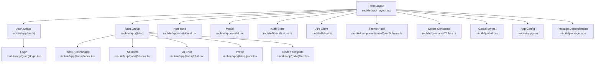
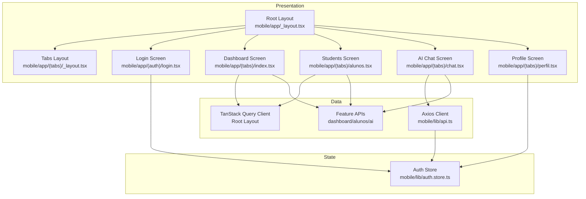
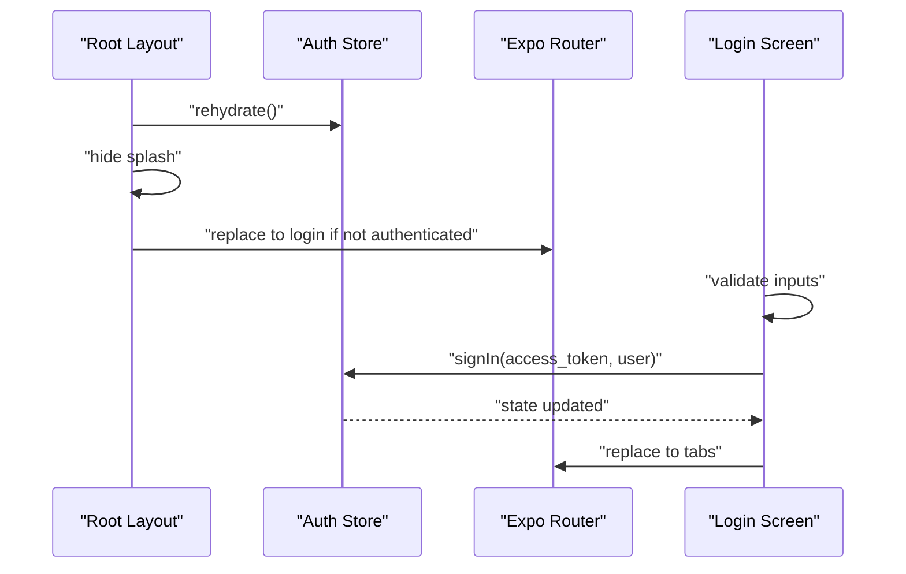
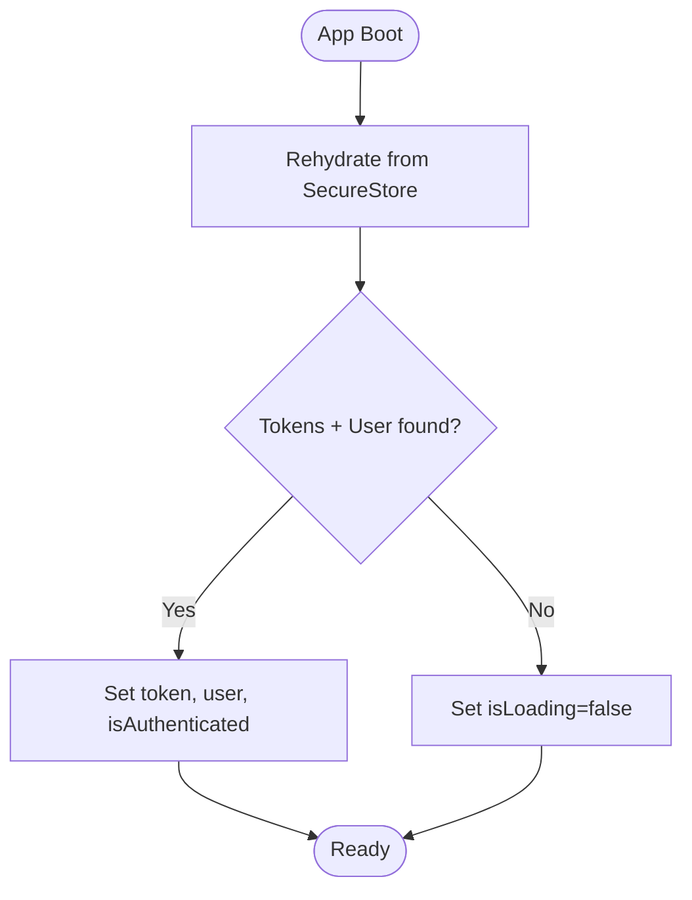
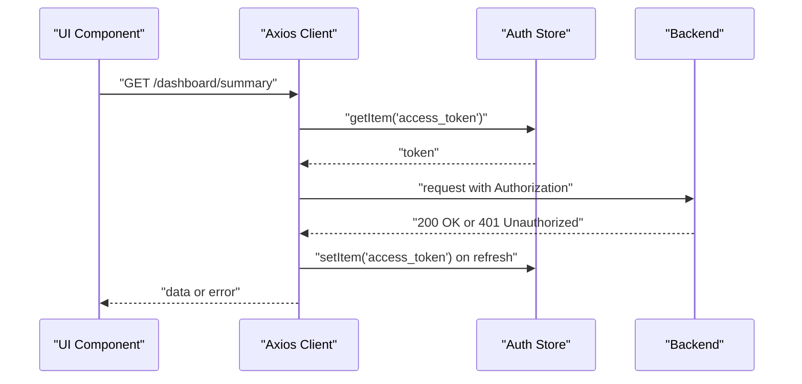
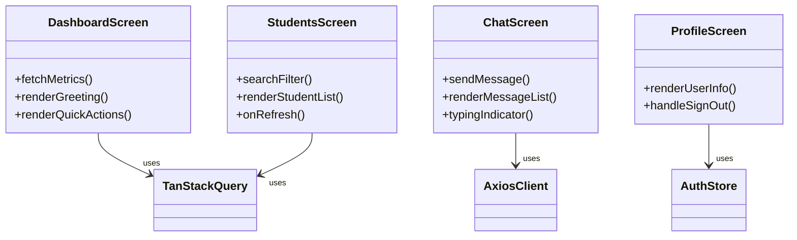
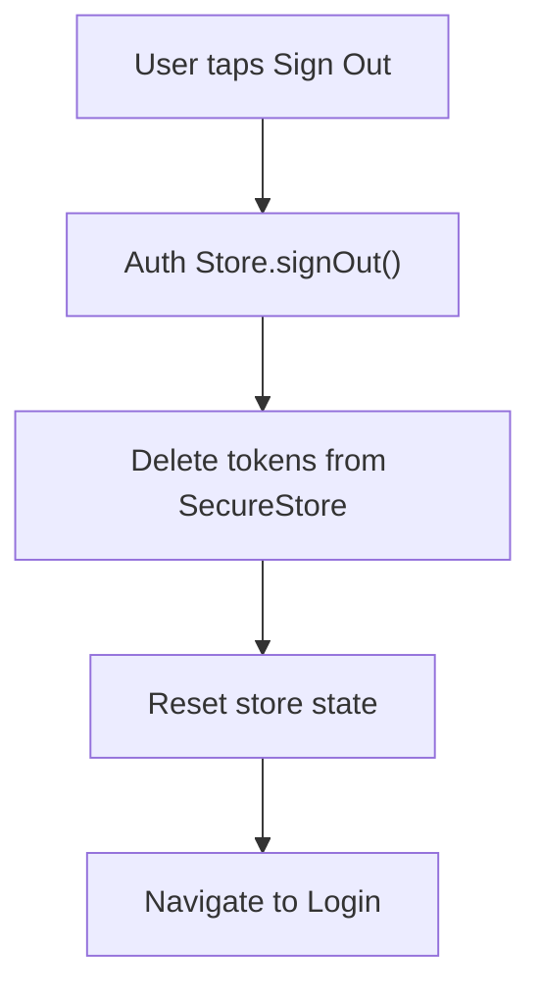
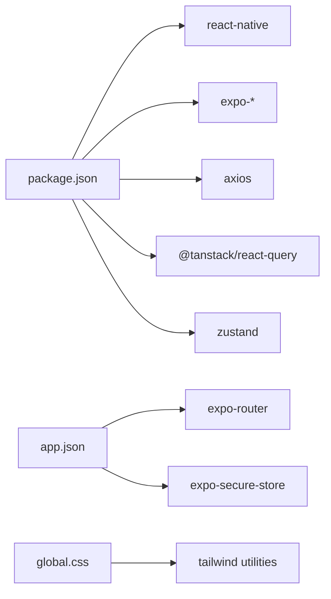

# Mobile Application

<cite>
**Referenced Files in This Document**
- [mobile/app/_layout.tsx](file://mobile/app/_layout.tsx)
- [mobile/app/(tabs)/_layout.tsx](file://mobile/app/(tabs)/_layout.tsx)
- [mobile/app/(auth)/login.tsx](file://mobile/app/(auth)/login.tsx)
- [mobile/app/(tabs)/index.tsx](file://mobile/app/(tabs)/index.tsx)
- [mobile/app/(tabs)/alunos.tsx](file://mobile/app/(tabs)/alunos.tsx)
- [mobile/app/(tabs)/chat.tsx](file://mobile/app/(tabs)/chat.tsx)
- [mobile/app/(tabs)/perfil.tsx](file://mobile/app/(tabs)/perfil.tsx)
- [mobile/app/(tabs)/two.tsx](file://mobile/app/(tabs)/two.tsx)
- [mobile/app/modal.tsx](file://mobile/app/modal.tsx)
- [mobile/app/+not-found.tsx](file://mobile/app/+not-found.tsx)
- [mobile/lib/auth.store.ts](file://mobile/lib/auth.store.ts)
- [mobile/lib/api.ts](file://mobile/lib/api.ts)
- [mobile/components/useColorScheme.ts](file://mobile/components/useColorScheme.ts)
- [mobile/constants/Colors.ts](file://mobile/constants/Colors.ts)
- [mobile/package.json](file://mobile/package.json)
- [mobile/app.json](file://mobile/app.json)
- [mobile/global.css](file://mobile/global.css)
</cite>

## Table of Contents
1. [Introduction](#introduction)
2. [Project Structure](#project-structure)
3. [Core Components](#core-components)
4. [Architecture Overview](#architecture-overview)
5. [Detailed Component Analysis](#detailed-component-analysis)
6. [Dependency Analysis](#dependency-analysis)
7. [Performance Considerations](#performance-considerations)
8. [Troubleshooting Guide](#troubleshooting-guide)
9. [Conclusion](#conclusion)

## Introduction
This document explains the mobile application built with React Native and Expo. It focuses on navigation using Expo Router, state management with Zustand, offline-aware API integration via Axios interceptors, and component architecture. It also covers authentication handling, data fetching patterns with TanStack Query, and practical examples for screen navigation, offline resilience, and API workflows tailored for mobile developers.

## Project Structure
The mobile app follows Expo Router’s file-based routing convention:
- Root layout orchestrates authentication guard, splash screen, theme provider, and TanStack Query provider.
- Tab-based navigation groups main features under a single tab bar.
- Authentication screens live under a dedicated group.
- API client and Zustand stores encapsulate networking and state.
- Shared UI utilities and theme constants support consistent styling.

**Diagram sources**
- [mobile/app/_layout.tsx:1-73](file://mobile/app/_layout.tsx#L1-L73)
- [mobile/app/(tabs)/_layout.tsx:1-114](file://mobile/app/(tabs)/_layout.tsx#L1-L114)
- [mobile/app/(auth)/login.tsx:1-247](file://mobile/app/(auth)/login.tsx#L1-L247)
- [mobile/app/(tabs)/index.tsx:1-181](file://mobile/app/(tabs)/index.tsx#L1-L181)
- [mobile/app/(tabs)/alunos.tsx:1-134](file://mobile/app/(tabs)/alunos.tsx#L1-L134)
- [mobile/app/(tabs)/chat.tsx:1-194](file://mobile/app/(tabs)/chat.tsx#L1-L194)
- [mobile/app/(tabs)/perfil.tsx:1-145](file://mobile/app/(tabs)/perfil.tsx#L1-L145)
- [mobile/app/(tabs)/two.tsx:1-32](file://mobile/app/(tabs)/two.tsx#L1-L32)
- [mobile/app/modal.tsx:1-36](file://mobile/app/modal.tsx#L1-L36)
- [mobile/app/+not-found.tsx:1-41](file://mobile/app/+not-found.tsx#L1-L41)
- [mobile/lib/auth.store.ts:1-65](file://mobile/lib/auth.store.ts#L1-L65)
- [mobile/lib/api.ts:1-108](file://mobile/lib/api.ts#L1-L108)
- [mobile/components/useColorScheme.ts:1-2](file://mobile/components/useColorScheme.ts#L1-L2)
- [mobile/constants/Colors.ts:1-20](file://mobile/constants/Colors.ts#L1-L20)
- [mobile/global.css:1-10](file://mobile/global.css#L1-L10)
- [mobile/app.json:1-41](file://mobile/app.json#L1-L41)
- [mobile/package.json:1-42](file://mobile/package.json#L1-L42)

**Section sources**
- [mobile/app/_layout.tsx:1-73](file://mobile/app/_layout.tsx#L1-L73)
- [mobile/app/(tabs)/_layout.tsx:1-114](file://mobile/app/(tabs)/_layout.tsx#L1-L114)
- [mobile/app/(auth)/login.tsx:1-247](file://mobile/app/(auth)/login.tsx#L1-L247)
- [mobile/app/(tabs)/index.tsx:1-181](file://mobile/app/(tabs)/index.tsx#L1-L181)
- [mobile/app/(tabs)/alunos.tsx:1-134](file://mobile/app/(tabs)/alunos.tsx#L1-L134)
- [mobile/app/(tabs)/chat.tsx:1-194](file://mobile/app/(tabs)/chat.tsx#L1-L194)
- [mobile/app/(tabs)/perfil.tsx:1-145](file://mobile/app/(tabs)/perfil.tsx#L1-L145)
- [mobile/app/(tabs)/two.tsx:1-32](file://mobile/app/(tabs)/two.tsx#L1-L32)
- [mobile/app/modal.tsx:1-36](file://mobile/app/modal.tsx#L1-L36)
- [mobile/app/+not-found.tsx:1-41](file://mobile/app/+not-found.tsx#L1-L41)
- [mobile/lib/auth.store.ts:1-65](file://mobile/lib/auth.store.ts#L1-L65)
- [mobile/lib/api.ts:1-108](file://mobile/lib/api.ts#L1-L108)
- [mobile/components/useColorScheme.ts:1-2](file://mobile/components/useColorScheme.ts#L1-L2)
- [mobile/constants/Colors.ts:1-20](file://mobile/constants/Colors.ts#L1-L20)
- [mobile/global.css:1-10](file://mobile/global.css#L1-L10)
- [mobile/app.json:1-41](file://mobile/app.json#L1-L41)
- [mobile/package.json:1-42](file://mobile/package.json#L1-L42)

## Core Components
- Navigation and Routing
  - Root layout initializes TanStack Query, theme provider, splash screen, and defines Stack screens for tabs and auth.
  - Tabs layout configures tab icons, active/inactive tint colors, and a sign-out action.
  - Authentication group contains the login screen with form validation and navigation after sign-in.
- State Management with Zustand
  - Auth store persists JWT and user data in SecureStore and exposes actions to sign in, sign out, and rehydrate on app start.
- API Integration Patterns
  - Centralized Axios client injects Authorization headers and handles automatic token refresh on 401 responses.
  - Feature APIs expose typed endpoints for dashboard, students, and AI chat.
- Offline Capabilities
  - TanStack Query manages caching and background refetching; the API client handles transient failures and token refresh.
- Component Architecture
  - Dashboard, Students, AI Chat, and Profile screens demonstrate consistent UI patterns, data fetching, and navigation.

**Section sources**
- [mobile/app/_layout.tsx:1-73](file://mobile/app/_layout.tsx#L1-L73)
- [mobile/app/(tabs)/_layout.tsx:1-114](file://mobile/app/(tabs)/_layout.tsx#L1-L114)
- [mobile/app/(auth)/login.tsx:1-247](file://mobile/app/(auth)/login.tsx#L1-L247)
- [mobile/lib/auth.store.ts:1-65](file://mobile/lib/auth.store.ts#L1-L65)
- [mobile/lib/api.ts:1-108](file://mobile/lib/api.ts#L1-L108)
- [mobile/app/(tabs)/index.tsx:1-181](file://mobile/app/(tabs)/index.tsx#L1-L181)
- [mobile/app/(tabs)/alunos.tsx:1-134](file://mobile/app/(tabs)/alunos.tsx#L1-L134)
- [mobile/app/(tabs)/chat.tsx:1-194](file://mobile/app/(tabs)/chat.tsx#L1-L194)
- [mobile/app/(tabs)/perfil.tsx:1-145](file://mobile/app/(tabs)/perfil.tsx#L1-L145)

## Architecture Overview
The mobile app uses a layered architecture:
- Presentation Layer: Expo Router screens and tab navigation.
- State Layer: Zustand stores for authentication state.
- Data Layer: TanStack Query for caching and refetching; Axios for HTTP requests with interceptors.
- Infrastructure Layer: Expo ecosystem integrations (SecureStore, Splash Screen, Navigation themes).

**Diagram sources**
- [mobile/app/_layout.tsx:1-73](file://mobile/app/_layout.tsx#L1-L73)
- [mobile/app/(tabs)/_layout.tsx:1-114](file://mobile/app/(tabs)/_layout.tsx#L1-L114)
- [mobile/app/(auth)/login.tsx:1-247](file://mobile/app/(auth)/login.tsx#L1-L247)
- [mobile/app/(tabs)/index.tsx:1-181](file://mobile/app/(tabs)/index.tsx#L1-L181)
- [mobile/app/(tabs)/alunos.tsx:1-134](file://mobile/app/(tabs)/alunos.tsx#L1-L134)
- [mobile/app/(tabs)/chat.tsx:1-194](file://mobile/app/(tabs)/chat.tsx#L1-L194)
- [mobile/app/(tabs)/perfil.tsx:1-145](file://mobile/app/(tabs)/perfil.tsx#L1-L145)
- [mobile/lib/auth.store.ts:1-65](file://mobile/lib/auth.store.ts#L1-L65)
- [mobile/lib/api.ts:1-108](file://mobile/lib/api.ts#L1-L108)

## Detailed Component Analysis

### Navigation and Routing
- Root layout
  - Initializes TanStack Query with a short stale time and retry policy.
  - Prevents splash screen auto-hide until authentication rehydration completes.
  - Routes to the login screen if not authenticated; otherwise renders tabs.
- Tabs layout
  - Defines four tabs: Dashboard, Students, AI Chat, and Profile.
  - Applies theme-aware tab styles and a sign-out handler.
- Authentication flow
  - Login screen validates inputs, calls the auth API, persists tokens via the auth store, and navigates to tabs.

**Diagram sources**
- [mobile/app/_layout.tsx:36-55](file://mobile/app/_layout.tsx#L36-L55)
- [mobile/lib/auth.store.ts:33-43](file://mobile/lib/auth.store.ts#L33-L43)
- [mobile/app/(auth)/login.tsx:24-43](file://mobile/app/(auth)/login.tsx#L24-L43)

**Section sources**
- [mobile/app/_layout.tsx:1-73](file://mobile/app/_layout.tsx#L1-L73)
- [mobile/app/(tabs)/_layout.tsx:1-114](file://mobile/app/(tabs)/_layout.tsx#L1-L114)
- [mobile/app/(auth)/login.tsx:1-247](file://mobile/app/(auth)/login.tsx#L1-L247)
- [mobile/lib/auth.store.ts:1-65](file://mobile/lib/auth.store.ts#L1-L65)

### State Management with Zustand
- Responsibilities
  - Persist and retrieve tokens and user data from SecureStore.
  - Provide sign-in, sign-out, and rehydrate actions.
- Behavior
  - On sign-in, writes tokens and user data; on sign-out, clears them.
  - On app boot, attempts to restore state from SecureStore.

**Diagram sources**
- [mobile/lib/auth.store.ts:45-63](file://mobile/lib/auth.store.ts#L45-L63)

**Section sources**
- [mobile/lib/auth.store.ts:1-65](file://mobile/lib/auth.store.ts#L1-L65)

### API Integration Patterns
- Centralized client
  - Base URL configured via environment variable with a sensible fallback.
  - Request interceptor attaches Authorization header from SecureStore.
  - Response interceptor handles 401 by attempting token refresh using refresh token.
- Feature APIs
  - Dashboard summary, student list/get, and AI chat endpoint exposed with typed responses.

**Diagram sources**
- [mobile/lib/api.ts:11-60](file://mobile/lib/api.ts#L11-L60)
- [mobile/lib/auth.store.ts:33-43](file://mobile/lib/auth.store.ts#L33-L43)

**Section sources**
- [mobile/lib/api.ts:1-108](file://mobile/lib/api.ts#L1-L108)

### Offline Capabilities
- TanStack Query
  - Caching with a short stale time enables near-instant UI updates and background refetching.
  - Pull-to-refresh patterns ensure users can manually refresh data.
- Token Refresh
  - Automatic refresh on 401 with SecureStore-backed tokens improves resilience during brief network issues.
- UI Feedback
  - Loading indicators and error containers guide users when data is unavailable.

**Section sources**
- [mobile/app/_layout.tsx:18-25](file://mobile/app/_layout.tsx#L18-L25)
- [mobile/app/(tabs)/index.tsx:38-42](file://mobile/app/(tabs)/index.tsx#L38-L42)
- [mobile/app/(tabs)/alunos.tsx:43-46](file://mobile/app/(tabs)/alunos.tsx#L43-L46)
- [mobile/lib/api.ts:31-60](file://mobile/lib/api.ts#L31-L60)

### Component Architecture
- Dashboard (Home)
  - Fetches summary metrics, displays greeting based on time, and shows quick-access items.
- Students
  - Lists students with search filtering, pull-to-refresh, and empty state handling.
- AI Chat
  - Implements a message list with typing indicators, input validation, and server-side AI responses.
- Profile
  - Displays user info and provides a sign-out action with confirmation.

**Diagram sources**
- [mobile/app/(tabs)/index.tsx:35-121](file://mobile/app/(tabs)/index.tsx#L35-L121)
- [mobile/app/(tabs)/alunos.tsx:40-92](file://mobile/app/(tabs)/alunos.tsx#L40-L92)
- [mobile/app/(tabs)/chat.tsx:24-127](file://mobile/app/(tabs)/chat.tsx#L24-L127)
- [mobile/app/(tabs)/perfil.tsx:17-84](file://mobile/app/(tabs)/perfil.tsx#L17-L84)

**Section sources**
- [mobile/app/(tabs)/index.tsx:1-181](file://mobile/app/(tabs)/index.tsx#L1-L181)
- [mobile/app/(tabs)/alunos.tsx:1-134](file://mobile/app/(tabs)/alunos.tsx#L1-L134)
- [mobile/app/(tabs)/chat.tsx:1-194](file://mobile/app/(tabs)/chat.tsx#L1-L194)
- [mobile/app/(tabs)/perfil.tsx:1-145](file://mobile/app/(tabs)/perfil.tsx#L1-L145)

### Authentication Handling
- Login
  - Validates inputs, calls auth API, persists tokens via Zustand store, and navigates to tabs.
- Logout
  - Clears SecureStore entries and resets state; navigates back to login.
- Rehydration
  - On app start, reads tokens and user data to restore session without manual login.

**Diagram sources**
- [mobile/app/(tabs)/perfil.tsx:21-33](file://mobile/app/(tabs)/perfil.tsx#L21-L33)
- [mobile/lib/auth.store.ts:39-43](file://mobile/lib/auth.store.ts#L39-L43)

**Section sources**
- [mobile/app/(auth)/login.tsx:1-247](file://mobile/app/(auth)/login.tsx#L1-L247)
- [mobile/app/(tabs)/perfil.tsx:1-145](file://mobile/app/(tabs)/perfil.tsx#L1-L145)
- [mobile/lib/auth.store.ts:1-65](file://mobile/lib/auth.store.ts#L1-L65)

### Data Synchronization Strategies
- TanStack Query
  - Enables caching, background refetching, and optimistic updates through query keys and refetch functions.
- Offline-first UX
  - Displays cached data immediately; shows loading/error states; supports manual refresh.
- Token refresh
  - Interceptor attempts refresh on 401, transparently updating Authorization header for subsequent requests.

**Section sources**
- [mobile/app/_layout.tsx:18-25](file://mobile/app/_layout.tsx#L18-L25)
- [mobile/lib/api.ts:31-60](file://mobile/lib/api.ts#L31-L60)

## Dependency Analysis
- Runtime dependencies include React Native, Expo ecosystem packages, Axios, TanStack Query, and Zustand.
- App configuration integrates Expo Router and SecureStore plugins.
- Global CSS integrates Tailwind utilities for consistent styling.

**Diagram sources**
- [mobile/package.json:11-33](file://mobile/package.json#L11-L33)
- [mobile/app.json:32-35](file://mobile/app.json#L32-L35)
- [mobile/global.css:1-3](file://mobile/global.css#L1-L3)

**Section sources**
- [mobile/package.json:1-42](file://mobile/package.json#L1-L42)
- [mobile/app.json:1-41](file://mobile/app.json#L1-L41)
- [mobile/global.css:1-10](file://mobile/global.css#L1-L10)

## Performance Considerations
- Prefer short stale times for frequently accessed data to keep UI responsive.
- Use FlatList for large lists to minimize rendering overhead.
- Debounce or throttle search inputs to avoid excessive network calls.
- Keep request timeouts reasonable to surface network issues promptly.
- Avoid unnecessary re-renders by selecting minimal slices from Zustand stores.

## Troubleshooting Guide
- Login fails silently
  - Verify environment variable for base URL and ensure backend auth endpoint accepts username field.
- 401 Unauthorized errors
  - Confirm refresh token exists and interceptor logic executes; check SecureStore persistence.
- Splash screen does not hide
  - Ensure rehydrate completes and authentication state resolves before hiding splash.
- Tab icons or theme mismatch
  - Confirm theme hook and tab bar styles align with current color scheme.

**Section sources**
- [mobile/lib/api.ts:8-17](file://mobile/lib/api.ts#L8-L17)
- [mobile/lib/api.ts:31-60](file://mobile/lib/api.ts#L31-L60)
- [mobile/app/_layout.tsx:48-55](file://mobile/app/_layout.tsx#L48-L55)
- [mobile/app/(tabs)/_layout.tsx:24-59](file://mobile/app/(tabs)/_layout.tsx#L24-L59)

## Conclusion
The mobile application leverages Expo Router for navigation, Zustand for lightweight state management, and TanStack Query with Axios interceptors for robust API integration. The architecture emphasizes offline-resilient UX, consistent theming, and modular screens. Following the patterns documented here ensures maintainable and scalable mobile development aligned with the existing codebase.