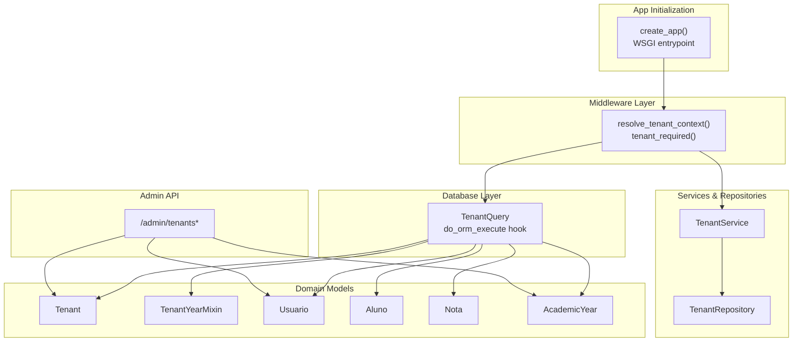
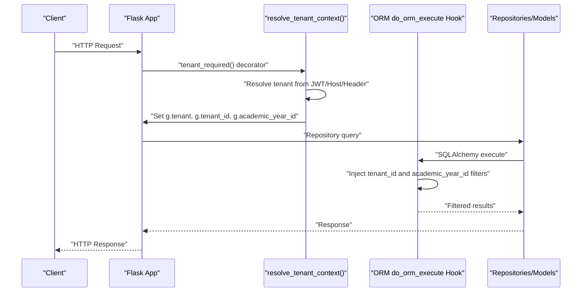
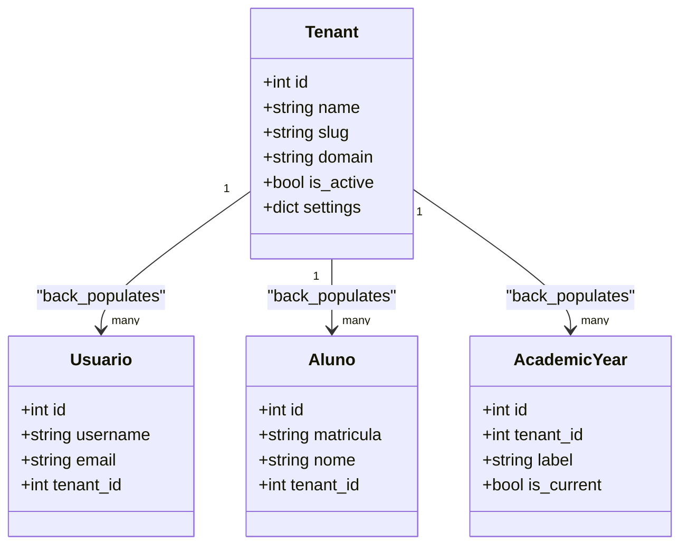
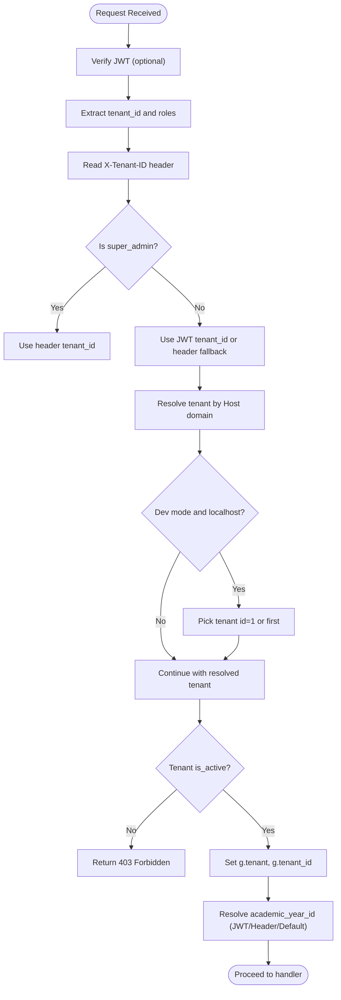
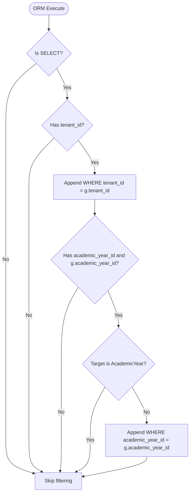
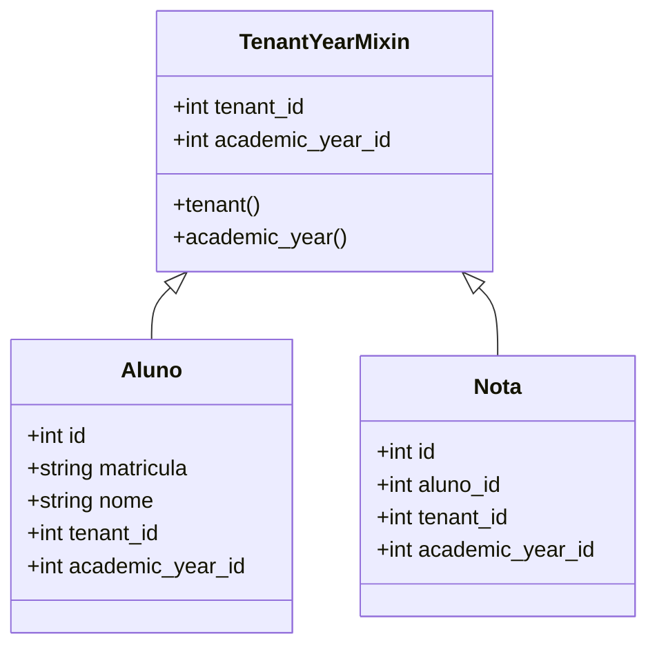
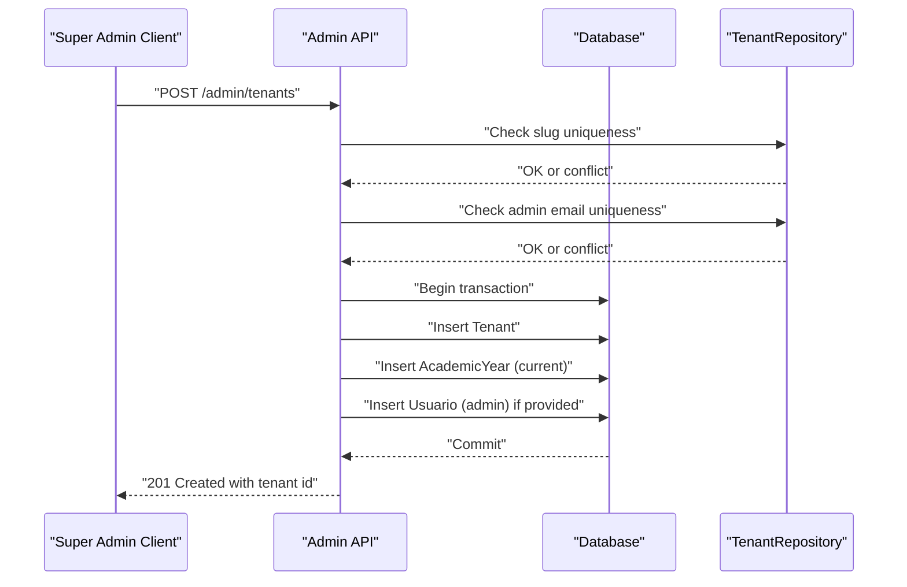
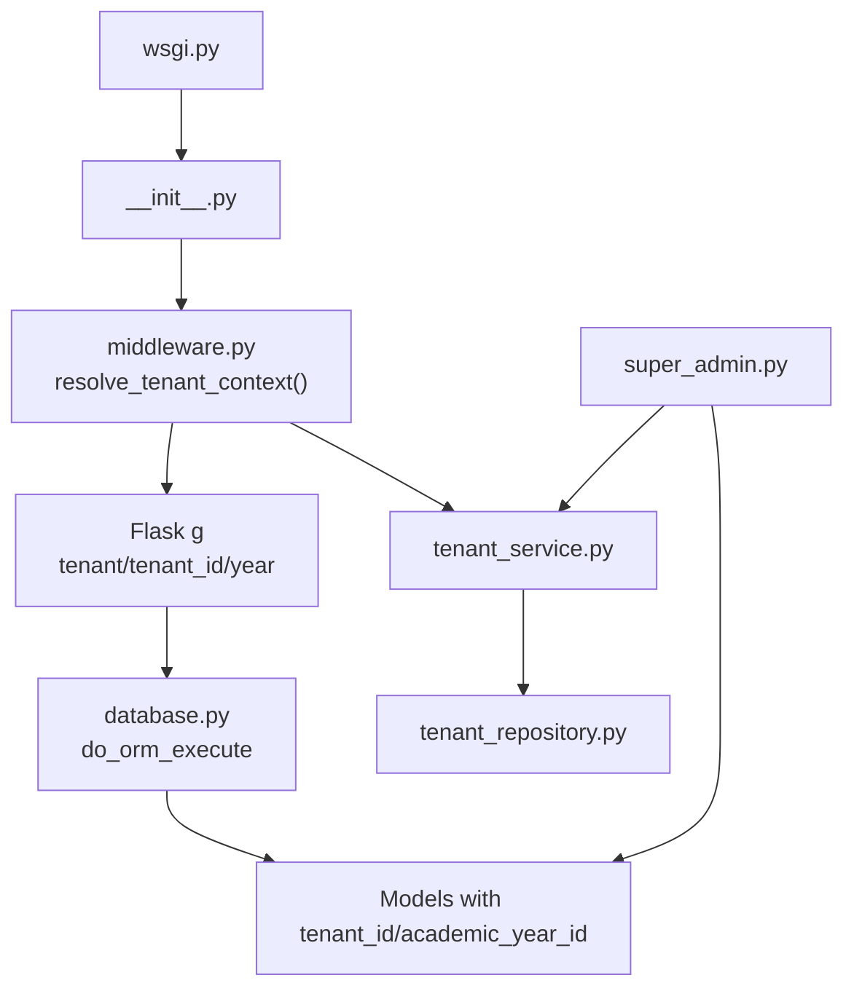

# Multi-Tenant Architecture

<cite>
**Referenced Files in This Document**
- [backend/app/core/middleware.py](file://backend/app/core/middleware.py)
- [backend/app/core/database.py](file://backend/app/core/database.py)
- [backend/app/models/tenant.py](file://backend/app/models/tenant.py)
- [backend/app/models/base_mixin.py](file://backend/app/models/base_mixin.py)
- [backend/app/models/usuario.py](file://backend/app/models/usuario.py)
- [backend/app/models/aluno.py](file://backend/app/models/aluno.py)
- [backend/app/models/nota.py](file://backend/app/models/nota.py)
- [backend/app/models/academic_year.py](file://backend/app/models/academic_year.py)
- [backend/app/services/tenant_service.py](file://backend/app/services/tenant_service.py)
- [backend/app/repositories/tenant_repository.py](file://backend/app/repositories/tenant_repository.py)
- [backend/app/api/v1/super_admin.py](file://backend/app/api/v1/super_admin.py)
- [backend/migrations/versions/a1b2c3d4e5f6_add_tenants.py](file://backend/migrations/versions/a1b2c3d4e5f6_add_tenants.py)
- [backend/app/__init__.py](file://backend/app/__init__.py)
- [backend/app/wsgi.py](file://backend/app/wsgi.py)
</cite>

## Table of Contents
1. [Introduction](#introduction)
2. [Project Structure](#project-structure)
3. [Core Components](#core-components)
4. [Architecture Overview](#architecture-overview)
5. [Detailed Component Analysis](#detailed-component-analysis)
6. [Dependency Analysis](#dependency-analysis)
7. [Performance Considerations](#performance-considerations)
8. [Troubleshooting Guide](#troubleshooting-guide)
9. [Conclusion](#conclusion)
10. [Appendices](#appendices)

## Introduction
This document explains the multi-tenant architecture implemented in the backend. It focuses on tenant isolation, database schema design with tenant-aware models, automatic filtering through ORM events, tenant switching, and security considerations for multi-school environments. The implementation leverages a tenant context resolved from JWT claims and Host headers, stores it in the Flask global context, and enforces automatic filtering of queries by tenant and academic year using an ORM event hook. The design ensures strong data segregation and supports safe tenant creation and administration via dedicated endpoints.

## Project Structure
The multi-tenant implementation spans several layers:
- Application factory and WSGI entrypoint initialize the app, JWT, CORS, and database migration support.
- Middleware resolves tenant context and academic year, storing them in the Flask global context.
- Database layer defines a base query class and an ORM event hook to automatically filter queries by tenant and academic year.
- Models define tenant-aware entities and a mixin to embed tenant and academic-year linkage.
- Services and repositories encapsulate tenant resolution and persistence.
- API endpoints under a super-admin blueprint manage tenant creation and related administrative actions.

**Diagram sources**
- [backend/app/__init__.py:15-87](file://backend/app/__init__.py#L15-L87)
- [backend/app/wsgi.py:1-5](file://backend/app/wsgi.py#L1-L5)
- [backend/app/core/middleware.py:6-125](file://backend/app/core/middleware.py#L6-L125)
- [backend/app/core/database.py:10-103](file://backend/app/core/database.py#L10-L103)
- [backend/app/models/tenant.py:7-22](file://backend/app/models/tenant.py#L7-L22)
- [backend/app/models/base_mixin.py:4-22](file://backend/app/models/base_mixin.py#L4-L22)
- [backend/app/models/usuario.py:8-30](file://backend/app/models/usuario.py#L8-L30)
- [backend/app/models/aluno.py:8-36](file://backend/app/models/aluno.py#L8-L36)
- [backend/app/models/nota.py:9-24](file://backend/app/models/nota.py#L9-L24)
- [backend/app/models/academic_year.py:6-16](file://backend/app/models/academic_year.py#L6-L16)
- [backend/app/services/tenant_service.py:7-29](file://backend/app/services/tenant_service.py#L7-L29)
- [backend/app/repositories/tenant_repository.py:8-21](file://backend/app/repositories/tenant_repository.py#L8-L21)
- [backend/app/api/v1/super_admin.py:8-166](file://backend/app/api/v1/super_admin.py#L8-L166)

**Section sources**
- [backend/app/__init__.py:15-87](file://backend/app/__init__.py#L15-L87)
- [backend/app/wsgi.py:1-5](file://backend/app/wsgi.py#L1-L5)
- [backend/app/core/middleware.py:6-125](file://backend/app/core/middleware.py#L6-L125)
- [backend/app/core/database.py:10-103](file://backend/app/core/database.py#L10-L103)

## Core Components
- Tenant model: central identity for schools with unique slug/domain, activation flag, and settings.
- Tenant context resolver: extracts tenant and academic year from JWT claims and Host/header, sets Flask global context.
- Automatic filtering: ORM event hook appends tenant_id and academic_year_id filters to SELECT statements.
- Tenant-aware models: inherit tenant and academic-year linkage via a shared mixin.
- Tenant service/repository: resolve tenant by domain/slug and expose public settings.
- Super-admin API: create tenants, set up initial academic year, and provision admin users.

**Section sources**
- [backend/app/models/tenant.py:7-22](file://backend/app/models/tenant.py#L7-L22)
- [backend/app/core/middleware.py:6-125](file://backend/app/core/middleware.py#L6-L125)
- [backend/app/core/database.py:10-103](file://backend/app/core/database.py#L10-L103)
- [backend/app/models/base_mixin.py:4-22](file://backend/app/models/base_mixin.py#L4-L22)
- [backend/app/services/tenant_service.py:7-29](file://backend/app/services/tenant_service.py#L7-L29)
- [backend/app/repositories/tenant_repository.py:8-21](file://backend/app/repositories/tenant_repository.py#L8-L21)
- [backend/app/api/v1/super_admin.py:8-166](file://backend/app/api/v1/super_admin.py#L8-L166)

## Architecture Overview
The system enforces tenant isolation by resolving the tenant context early in the request lifecycle and applying transparent query filtering. The middleware determines the tenant and academic year, while the ORM event hook ensures that all SELECT queries include tenant and academic-year constraints unless explicitly opted out.

**Diagram sources**
- [backend/app/core/middleware.py:6-125](file://backend/app/core/middleware.py#L6-L125)
- [backend/app/core/database.py:39-102](file://backend/app/core/database.py#L39-L102)

## Detailed Component Analysis

### Tenant Model and Schema
- The Tenant model defines the identity of a school with unique slug and optional domain, activation flag, and JSON settings.
- Migration adds the tenants table and foreign keys to usuarios and alunos, enabling tenant-aware relationships.

**Diagram sources**
- [backend/app/models/tenant.py:7-22](file://backend/app/models/tenant.py#L7-L22)
- [backend/app/models/usuario.py:8-30](file://backend/app/models/usuario.py#L8-L30)
- [backend/app/models/aluno.py:8-36](file://backend/app/models/aluno.py#L8-L36)
- [backend/app/models/academic_year.py:6-16](file://backend/app/models/academic_year.py#L6-L16)
- [backend/migrations/versions/a1b2c3d4e5f6_add_tenants.py:17-56](file://backend/migrations/versions/a1b2c3d4e5f6_add_tenants.py#L17-L56)

**Section sources**
- [backend/app/models/tenant.py:7-22](file://backend/app/models/tenant.py#L7-L22)
- [backend/migrations/versions/a1b2c3d4e5f6_add_tenants.py:17-56](file://backend/migrations/versions/a1b2c3d4e5f6_add_tenants.py#L17-L56)

### Tenant Context Resolution and Switching
- The resolver reads JWT claims for tenant_id and roles, then optionally accepts X-Tenant-ID from headers for super_admin context switching.
- Host header is used to resolve tenant by domain; a development fallback selects the first tenant for local environments.
- Academic year is prioritized from JWT, then header, otherwise defaults to the current academic year for the tenant.

**Diagram sources**
- [backend/app/core/middleware.py:6-125](file://backend/app/core/middleware.py#L6-L125)

**Section sources**
- [backend/app/core/middleware.py:6-125](file://backend/app/core/middleware.py#L6-L125)

### Automatic Filtering via ORM Events
- The ORM event hook inspects every SELECT statement and appends filters:
  - tenant_id equals the current tenant from Flask global context.
  - academic_year_id equals the current academic year when present and not querying the AcademicYear table itself.
- An opt-out option allows bypassing tenant filters for special operations.

**Diagram sources**
- [backend/app/core/database.py:39-102](file://backend/app/core/database.py#L39-L102)

**Section sources**
- [backend/app/core/database.py:39-102](file://backend/app/core/database.py#L39-L102)

### Tenant-Aware Models and Mixin
- TenantYearMixin adds tenant_id and academic_year_id fields to models, along with relationships to Tenant and AcademicYear.
- Models like Aluno and Nota inherit the mixin to gain tenant and academic-year linkage automatically.

**Diagram sources**
- [backend/app/models/base_mixin.py:4-22](file://backend/app/models/base_mixin.py#L4-L22)
- [backend/app/models/aluno.py:8-36](file://backend/app/models/aluno.py#L8-L36)
- [backend/app/models/nota.py:9-24](file://backend/app/models/nota.py#L9-L24)

**Section sources**
- [backend/app/models/base_mixin.py:4-22](file://backend/app/models/base_mixin.py#L4-L22)
- [backend/app/models/aluno.py:8-36](file://backend/app/models/aluno.py#L8-L36)
- [backend/app/models/nota.py:9-24](file://backend/app/models/nota.py#L9-L24)

### Tenant Creation and Administration
- Super-admin endpoints allow listing, creating, updating, and deleting tenants.
- Creation validates uniqueness of slug and admin email, creates the tenant, sets an initial academic year, and optionally provisions an admin user with a generated unique username.

**Diagram sources**
- [backend/app/api/v1/super_admin.py:41-111](file://backend/app/api/v1/super_admin.py#L41-L111)
- [backend/app/repositories/tenant_repository.py:12-21](file://backend/app/repositories/tenant_repository.py#L12-L21)

**Section sources**
- [backend/app/api/v1/super_admin.py:41-111](file://backend/app/api/v1/super_admin.py#L41-L111)
- [backend/app/repositories/tenant_repository.py:12-21](file://backend/app/repositories/tenant_repository.py#L12-L21)

### Cross-Tenant Security Patterns
- Tenant switching is restricted to super_admin via header-based context switching; regular users cannot switch tenants via headers.
- Queries are filtered by tenant and academic year by default; opt-out is available only for explicit internal use cases.
- Academic year filtering prevents unauthorized access across years unless explicitly allowed.

**Section sources**
- [backend/app/core/middleware.py:34-46](file://backend/app/core/middleware.py#L34-L46)
- [backend/app/core/database.py:61-101](file://backend/app/core/database.py#L61-L101)

## Dependency Analysis
The following diagram shows how components depend on each other to enforce multi-tenancy:

**Diagram sources**
- [backend/app/core/middleware.py:6-125](file://backend/app/core/middleware.py#L6-L125)
- [backend/app/core/database.py:39-102](file://backend/app/core/database.py#L39-L102)
- [backend/app/services/tenant_service.py:7-29](file://backend/app/services/tenant_service.py#L7-L29)
- [backend/app/repositories/tenant_repository.py:8-21](file://backend/app/repositories/tenant_repository.py#L8-L21)
- [backend/app/api/v1/super_admin.py:8-166](file://backend/app/api/v1/super_admin.py#L8-L166)
- [backend/app/__init__.py:15-87](file://backend/app/__init__.py#L15-L87)
- [backend/app/wsgi.py:1-5](file://backend/app/wsgi.py#L1-L5)

**Section sources**
- [backend/app/core/middleware.py:6-125](file://backend/app/core/middleware.py#L6-L125)
- [backend/app/core/database.py:39-102](file://backend/app/core/database.py#L39-L102)
- [backend/app/services/tenant_service.py:7-29](file://backend/app/services/tenant_service.py#L7-L29)
- [backend/app/repositories/tenant_repository.py:8-21](file://backend/app/repositories/tenant_repository.py#L8-L21)
- [backend/app/api/v1/super_admin.py:8-166](file://backend/app/api/v1/super_admin.py#L8-L166)
- [backend/app/__init__.py:15-87](file://backend/app/__init__.py#L15-L87)
- [backend/app/wsgi.py:1-5](file://backend/app/wsgi.py#L1-L5)

## Performance Considerations
- The ORM event hook applies filters to all SELECT statements; ensure indexes exist on tenant_id and academic_year_id for optimal performance.
- Prefer explicit joins and filters in complex queries to minimize unnecessary scans.
- Use opt-out only for controlled scenarios (e.g., reporting across tenants) and avoid broad use to prevent accidental cross-tenant data retrieval.
- Batch operations should still respect tenant boundaries; consider per-tenant transactions to maintain isolation.

## Troubleshooting Guide
- Tenant not identified or invalid: The resolver returns a 404 when no tenant matches JWT, header, or Host; verify JWT claims, header presence, and domain registration.
- Access disabled for institution: The resolver returns 403 if the tenant is inactive; activate the tenant in the admin panel.
- Academic year not set: If no academic year is found, g.academic_year_id is None; ensure an active academic year exists for the tenant.
- Cross-tenant data leakage: Confirm that tenant filtering is enabled and not bypassed unintentionally; verify that models include tenant_id and academic_year_id fields.
- Duplicate slug or admin email during tenant creation: The admin endpoint checks uniqueness and returns appropriate errors; adjust slug/admin email accordingly.

**Section sources**
- [backend/app/core/middleware.py:68-109](file://backend/app/core/middleware.py#L68-L109)
- [backend/app/api/v1/super_admin.py:48-68](file://backend/app/api/v1/super_admin.py#L48-L68)
- [backend/app/core/database.py:61-101](file://backend/app/core/database.py#L61-L101)

## Conclusion
The multi-tenant design integrates tenant context resolution, automatic query filtering, and tenant-aware models to achieve strong isolation across schools. The middleware establishes the tenant context, the ORM event hook enforces tenant and academic-year filters, and the super-admin endpoints provide secure tenant provisioning. Adhering to the documented patterns ensures robust data segregation and cross-tenant security in multi-school environments.

## Appendices

### Practical Examples

- Tenant creation flow
  - Endpoint: POST /admin/tenants
  - Behavior: Validates slug and admin email uniqueness, creates tenant, inserts an initial academic year, and optionally creates an admin user.
  - Reference: [backend/app/api/v1/super_admin.py:41-111](file://backend/app/api/v1/super_admin.py#L41-L111)

- Tenant switching
  - Mechanism: Super admins can switch tenants via X-Tenant-ID header; regular users are bound to the tenant in JWT claims.
  - Reference: [backend/app/core/middleware.py:34-46](file://backend/app/core/middleware.py#L34-L46)

- Data segregation
  - Enforcement: ORM event hook appends tenant_id and academic_year_id filters to SELECT statements.
  - Reference: [backend/app/core/database.py:39-102](file://backend/app/core/database.py#L39-L102)

- Cross-tenant security pattern
  - Principle: Only super_admin can context-switch via headers; academic year filtering prevents unauthorized access across years.
  - Reference: [backend/app/core/middleware.py:34-46](file://backend/app/core/middleware.py#L34-L46), [backend/app/core/database.py:95-101](file://backend/app/core/database.py#L95-L101)