# Architecture Overview

<cite>
**Referenced Files in This Document**
- [backend/app/__init__.py](file://backend/app/__init__.py)
- [backend/app/wsgi.py](file://backend/app/wsgi.py)
- [backend/app/api/__init__.py](file://backend/app/api/__init__.py)
- [backend/app/api/v1/__init__.py](file://backend/app/api/v1/__init__.py)
- [backend/app/api/v1/auth.py](file://backend/app/api/v1/auth.py)
- [backend/app/core/middleware.py](file://backend/app/core/middleware.py)
- [backend/app/core/database.py](file://backend/app/core/database.py)
- [backend/app/core/security.py](file://backend/app/core/security.py)
- [backend/app/core/config.py](file://backend/app/core/config.py)
- [backend/app/models/tenant.py](file://backend/app/models/tenant.py)
- [backend/app/repositories/base.py](file://backend/app/repositories/base.py)
- [backend/app/repositories/tenant_repository.py](file://backend/app/repositories/tenant_repository.py)
- [backend/app/services/accounts.py](file://backend/app/services/accounts.py)
- [docker-compose.yml](file://docker-compose.yml)
- [docker-compose.prod.yml](file://docker-compose.prod.yml)
- [frontend/src/lib/api.ts](file://frontend/src/lib/api.ts)
- [mobile/lib/api.ts](file://mobile/lib/api.ts)
</cite>

## Table of Contents
1. [Introduction](#introduction)
2. [Project Structure](#project-structure)
3. [Core Components](#core-components)
4. [Architecture Overview](#architecture-overview)
5. [Detailed Component Analysis](#detailed-component-analysis)
6. [Dependency Analysis](#dependency-analysis)
7. [Performance Considerations](#performance-considerations)
8. [Troubleshooting Guide](#troubleshooting-guide)
9. [Conclusion](#conclusion)
10. [Appendices](#appendices)

## Introduction
This document presents the architecture overview of ColaboraEdu, a multi-tenant SaaS platform for education. It explains how the system isolates data per institution, the layered architecture (presentation, business logic, data access, infrastructure), and the key patterns used: domain-driven design with Flask blueprints, repository pattern, service layer, and middleware-based tenant isolation. It also covers security (JWT authentication and RBAC), data flow, integration patterns, scalability, performance, and deployment topology.

## Project Structure
The repository follows a clear separation of concerns across backend, frontend, and mobile layers, with a strong emphasis on modularity and maintainability.

- Backend (Python/Flask): Application factory, API blueprints, core services, repositories, models, and infrastructure integrations.
- Frontend (React/Vite): Web client with routing, state, and API integration.
- Mobile (React Native Expo): Mobile client with routing and API integration.
- Infrastructure: Dockerized services, compose files for local and production environments.

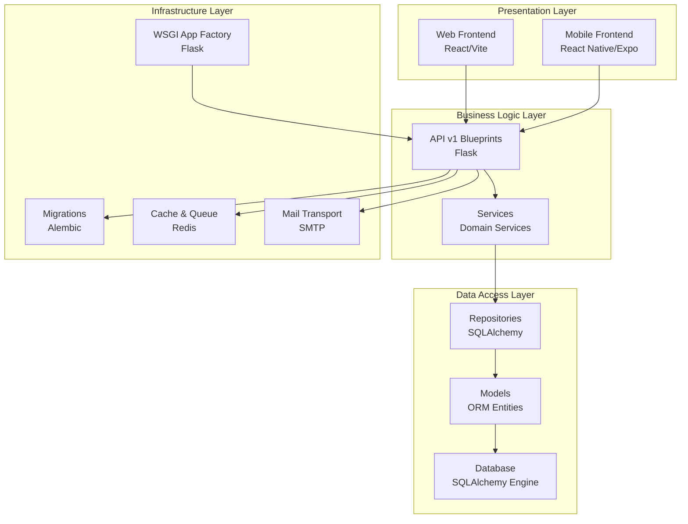

**Diagram sources**
- [backend/app/__init__.py:15-87](file://backend/app/__init__.py#L15-L87)
- [backend/app/wsgi.py:1-5](file://backend/app/wsgi.py#L1-L5)
- [backend/app/api/v1/__init__.py:1-39](file://backend/app/api/v1/__init__.py#L1-L39)
- [backend/app/core/database.py:106-130](file://backend/app/core/database.py#L106-L130)

**Section sources**
- [backend/app/__init__.py:15-87](file://backend/app/__init__.py#L15-L87)
- [backend/app/wsgi.py:1-5](file://backend/app/wsgi.py#L1-L5)
- [backend/app/api/__init__.py:7-9](file://backend/app/api/__init__.py#L7-L9)
- [backend/app/api/v1/__init__.py:1-39](file://backend/app/api/v1/__init__.py#L1-L39)

## Core Components
- Application factory and WSGI entrypoint: Creates and configures the Flask app, sets up CORS, JWT, rate limiting, security headers, and health endpoints.
- API blueprints: Versioned API with per-endpoint middleware for tenant resolution and public endpoint bypass.
- Middleware: Tenant and academic year resolution from JWT, headers, and host; stores context in Flask’s g.
- Database and ORM: SQLAlchemy engine, scoped sessions, tenant-aware query filtering via event listeners, and a base repository pattern.
- Security: JWT setup, password hashing, token blocklist with Redis, and RBAC via roles embedded in JWT claims.
- Services: Domain services orchestrating business logic, including account provisioning for students.
- Configuration: Pydantic-based settings with environment-specific validations.

**Section sources**
- [backend/app/__init__.py:15-87](file://backend/app/__init__.py#L15-L87)
- [backend/app/api/v1/__init__.py:8-22](file://backend/app/api/v1/__init__.py#L8-L22)
- [backend/app/core/middleware.py:6-125](file://backend/app/core/middleware.py#L6-L125)
- [backend/app/core/database.py:10-130](file://backend/app/core/database.py#L10-L130)
- [backend/app/core/security.py:1-62](file://backend/app/core/security.py#L1-L62)
- [backend/app/services/accounts.py:1-79](file://backend/app/services/accounts.py#L1-L79)
- [backend/app/core/config.py:9-60](file://backend/app/core/config.py#L9-L60)

## Architecture Overview
ColaboraEdu employs a multi-tenant SaaS architecture with strict data isolation per institution. The system resolves the tenant and academic year early in the request lifecycle and enforces tenant filters at the ORM level. Authentication is JWT-based with RBAC roles, and the platform integrates Redis for caching and rate limiting, and SMTP for notifications.

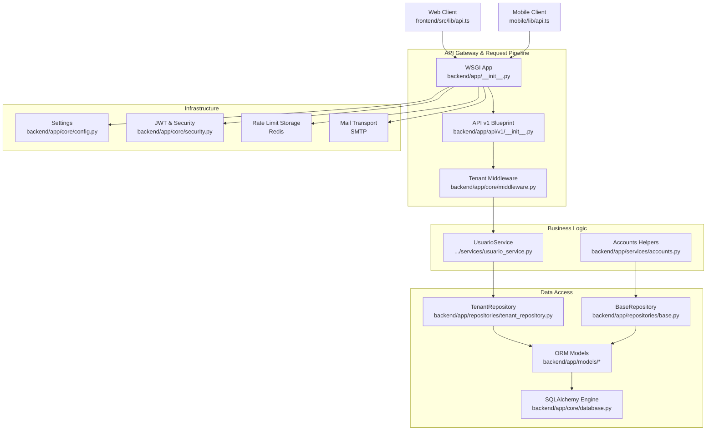

**Diagram sources**
- [backend/app/__init__.py:15-87](file://backend/app/__init__.py#L15-L87)
- [backend/app/api/v1/__init__.py:8-22](file://backend/app/api/v1/__init__.py#L8-L22)
- [backend/app/core/middleware.py:6-125](file://backend/app/core/middleware.py#L6-L125)
- [backend/app/repositories/base.py:7-41](file://backend/app/repositories/base.py#L7-L41)
- [backend/app/repositories/tenant_repository.py:8-21](file://backend/app/repositories/tenant_repository.py#L8-L21)
- [backend/app/core/database.py:106-130](file://backend/app/core/database.py#L106-L130)
- [backend/app/core/config.py:9-60](file://backend/app/core/config.py#L9-L60)
- [backend/app/core/security.py:1-62](file://backend/app/core/security.py#L1-L62)
- [frontend/src/lib/api.ts](file://frontend/src/lib/api.ts)
- [mobile/lib/api.ts](file://mobile/lib/api.ts)

## Detailed Component Analysis

### Multi-Tenant SaaS Architecture and Data Isolation
- Tenant resolution: The middleware extracts tenant context from JWT claims, optional headers (for super admin context switching), and host/domain, then stores tenant and academic year in Flask’s g.
- Academic year scoping: Academic year is resolved from JWT, header, or defaults to the current active year for the tenant.
- ORM-level tenant filtering: An SQLAlchemy event listener automatically appends tenant_id and academic_year_id filters to SELECT statements when a tenant is active, ensuring data isolation across institutions and academic years.
- Tenant model: Stores tenant metadata, domain mapping, and activation flag; cascades academic year management.

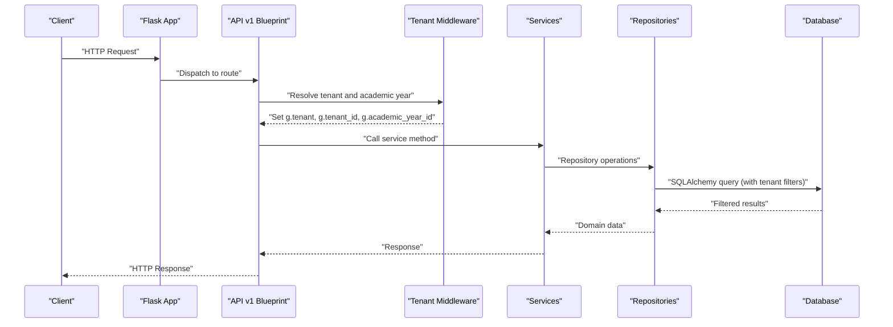

**Diagram sources**
- [backend/app/api/v1/__init__.py:8-22](file://backend/app/api/v1/__init__.py#L8-L22)
- [backend/app/core/middleware.py:6-125](file://backend/app/core/middleware.py#L6-L125)
- [backend/app/core/database.py:39-102](file://backend/app/core/database.py#L39-L102)

**Section sources**
- [backend/app/core/middleware.py:6-125](file://backend/app/core/middleware.py#L6-L125)
- [backend/app/core/database.py:10-130](file://backend/app/core/database.py#L10-L130)
- [backend/app/models/tenant.py:7-22](file://backend/app/models/tenant.py#L7-L22)

### Layered Architecture
- Presentation layer: Web and mobile clients consume REST endpoints exposed by the Flask API.
- Business logic layer: Services encapsulate domain logic and orchestrate repositories and external integrations.
- Data access layer: Repositories provide CRUD abstractions over SQLAlchemy models; a base repository supports generic operations.
- Infrastructure layer: Configuration, security (JWT/RBAC), caching/rate limiting, and migrations.

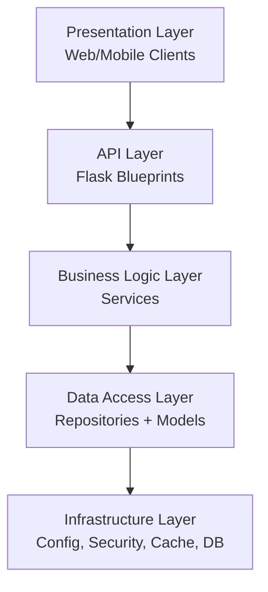

**Diagram sources**
- [backend/app/api/v1/__init__.py:1-39](file://backend/app/api/v1/__init__.py#L1-L39)
- [backend/app/repositories/base.py:7-41](file://backend/app/repositories/base.py#L7-L41)
- [backend/app/core/config.py:9-60](file://backend/app/core/config.py#L9-L60)
- [backend/app/core/security.py:1-62](file://backend/app/core/security.py#L1-L62)

**Section sources**
- [backend/app/api/v1/__init__.py:1-39](file://backend/app/api/v1/__init__.py#L1-L39)
- [backend/app/repositories/base.py:7-41](file://backend/app/repositories/base.py#L7-L41)
- [backend/app/core/config.py:9-60](file://backend/app/core/config.py#L9-L60)
- [backend/app/core/security.py:1-62](file://backend/app/core/security.py#L1-L62)

### Domain-Driven Design with Flask Blueprints
- Blueprints organize routes by feature and version, enabling modular APIs.
- Each blueprint registers routes and applies pre-request middleware for tenant resolution.
- Public endpoints (e.g., login, tenant listing) bypass tenant middleware to support onboarding and discovery.

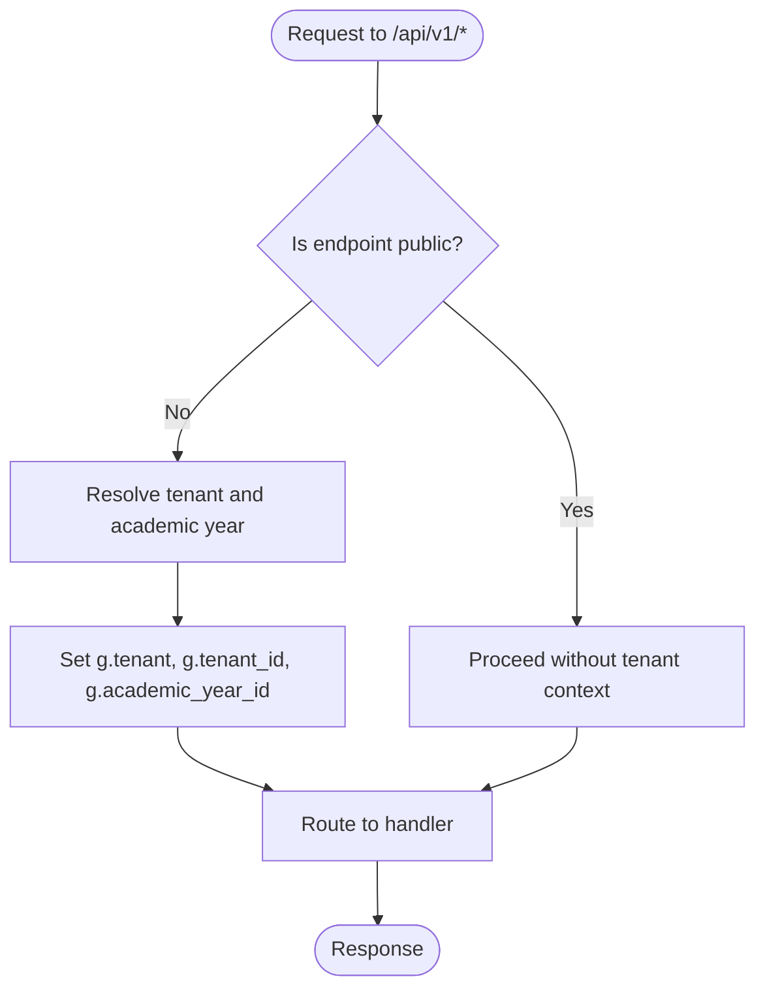

**Diagram sources**
- [backend/app/api/v1/__init__.py:8-22](file://backend/app/api/v1/__init__.py#L8-L22)

**Section sources**
- [backend/app/api/v1/__init__.py:8-22](file://backend/app/api/v1/__init__.py#L8-L22)

### Repository Pattern Implementation
- BaseRepository provides generic CRUD operations with a type variable to enforce model typing.
- TenantRepository specializes lookups by domain or slug, enabling flexible tenant resolution.

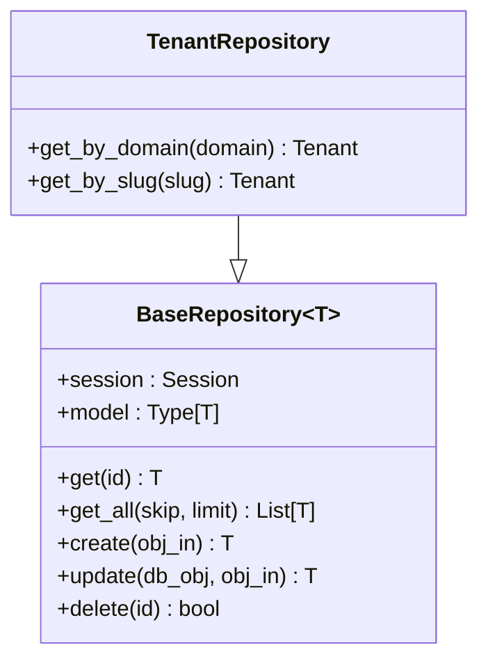

**Diagram sources**
- [backend/app/repositories/base.py:7-41](file://backend/app/repositories/base.py#L7-L41)
- [backend/app/repositories/tenant_repository.py:8-21](file://backend/app/repositories/tenant_repository.py#L8-L21)

**Section sources**
- [backend/app/repositories/base.py:7-41](file://backend/app/repositories/base.py#L7-L41)
- [backend/app/repositories/tenant_repository.py:8-21](file://backend/app/repositories/tenant_repository.py#L8-L21)

### Service Layer Architecture
- Services encapsulate business logic and coordinate repositories and external systems (e.g., mail, cache).
- Example: Account provisioning for students ensures a user account exists per student, linking credentials to the tenant and academic year context.

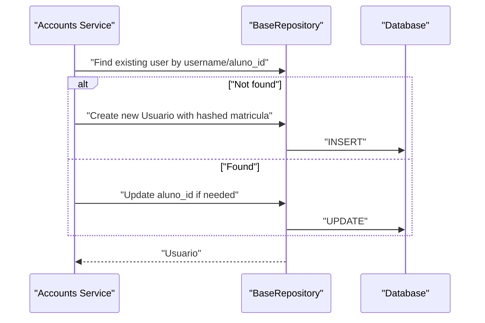

**Diagram sources**
- [backend/app/services/accounts.py:29-58](file://backend/app/services/accounts.py#L29-L58)
- [backend/app/repositories/base.py:19-32](file://backend/app/repositories/base.py#L19-L32)

**Section sources**
- [backend/app/services/accounts.py:1-79](file://backend/app/services/accounts.py#L1-L79)
- [backend/app/repositories/base.py:7-41](file://backend/app/repositories/base.py#L7-L41)

### Middleware-Based Tenant Isolation
- The middleware verifies JWT (optional for some endpoints), extracts tenant and academic year, validates tenant activation, and stores context in Flask’s g.
- It supports super admin context switching via headers while enforcing security gates.

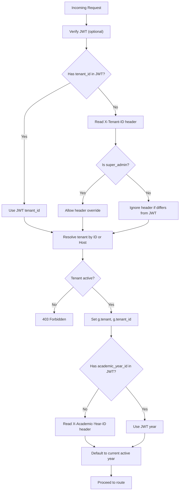

**Diagram sources**
- [backend/app/core/middleware.py:6-125](file://backend/app/core/middleware.py#L6-L125)

**Section sources**
- [backend/app/core/middleware.py:6-125](file://backend/app/core/middleware.py#L6-L125)

### Security Architecture: JWT Authentication and RBAC
- JWT setup: Secret keys, token generation with roles and optional claims (tenant_id, academic_year_id), refresh tokens, and blocklist via Redis.
- Token revocation: Closed-circuit behavior during Redis outages to prevent accepting revoked tokens.
- Password hashing: bcrypt via passlib.
- Rate limiting: Flask-Limiter integrated with Redis storage URI from settings.

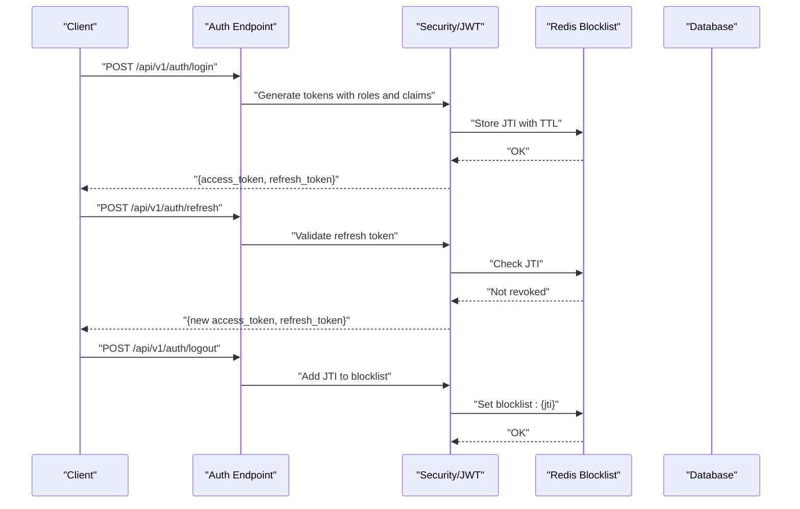

**Diagram sources**
- [backend/app/api/v1/auth.py:27-61](file://backend/app/api/v1/auth.py#L27-L61)
- [backend/app/core/security.py:23-62](file://backend/app/core/security.py#L23-L62)

**Section sources**
- [backend/app/api/v1/auth.py:27-61](file://backend/app/api/v1/auth.py#L27-L61)
- [backend/app/core/security.py:1-62](file://backend/app/core/security.py#L1-L62)

### Data Flow Between Components
- Requests enter via WSGI and Flask, then to API blueprints, followed by middleware for tenant resolution, then to services, repositories, and models, finally reaching the database with tenant filters applied.
- Responses traverse the reverse path, with security headers and CORS configured at the application factory.

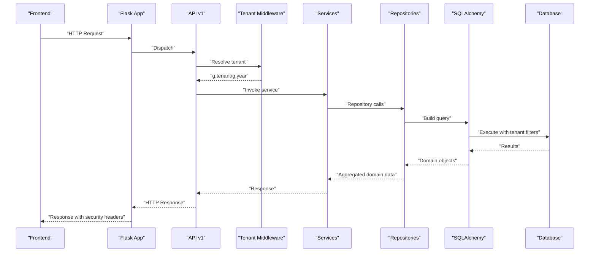

**Diagram sources**
- [backend/app/__init__.py:55-87](file://backend/app/__init__.py#L55-L87)
- [backend/app/api/v1/__init__.py:8-22](file://backend/app/api/v1/__init__.py#L8-L22)
- [backend/app/core/middleware.py:6-125](file://backend/app/core/middleware.py#L6-L125)
- [backend/app/core/database.py:39-102](file://backend/app/core/database.py#L39-L102)

**Section sources**
- [backend/app/__init__.py:55-87](file://backend/app/__init__.py#L55-L87)
- [backend/app/api/v1/__init__.py:8-22](file://backend/app/api/v1/__init__.py#L8-L22)
- [backend/app/core/database.py:39-102](file://backend/app/core/database.py#L39-L102)

### Integration Patterns
- Frontend and mobile clients communicate with the backend via REST endpoints; both use typed API clients to centralize HTTP configuration and error handling.
- Authentication endpoints manage login, refresh, logout, and password reset flows, integrating with Redis for temporary tokens and SMTP for email delivery.

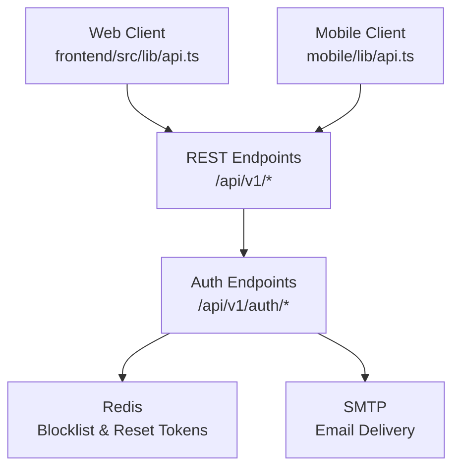

**Diagram sources**
- [frontend/src/lib/api.ts](file://frontend/src/lib/api.ts)
- [mobile/lib/api.ts](file://mobile/lib/api.ts)
- [backend/app/api/v1/auth.py:27-166](file://backend/app/api/v1/auth.py#L27-L166)

**Section sources**
- [frontend/src/lib/api.ts](file://frontend/src/lib/api.ts)
- [mobile/lib/api.ts](file://mobile/lib/api.ts)
- [backend/app/api/v1/auth.py:27-166](file://backend/app/api/v1/auth.py#L27-L166)

## Dependency Analysis
- Application factory depends on configuration, database initialization, security, blueprints, CLI registration, and error handlers.
- API blueprints depend on middleware for tenant resolution and on services for business logic.
- Repositories depend on SQLAlchemy sessions and models; tenant repository extends the base repository.
- Middleware depends on JWT parsing, tenant service, and database session scope.
- Security depends on Redis for token blocklist and on bcrypt for password hashing.

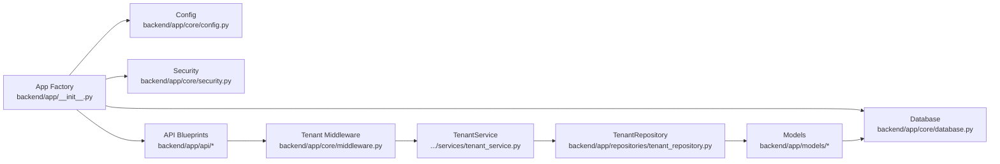

**Diagram sources**
- [backend/app/__init__.py:15-87](file://backend/app/__init__.py#L15-L87)
- [backend/app/api/v1/__init__.py:8-22](file://backend/app/api/v1/__init__.py#L8-L22)
- [backend/app/core/middleware.py:6-125](file://backend/app/core/middleware.py#L6-L125)
- [backend/app/repositories/tenant_repository.py:8-21](file://backend/app/repositories/tenant_repository.py#L8-L21)
- [backend/app/core/database.py:106-130](file://backend/app/core/database.py#L106-L130)

**Section sources**
- [backend/app/__init__.py:15-87](file://backend/app/__init__.py#L15-L87)
- [backend/app/api/v1/__init__.py:8-22](file://backend/app/api/v1/__init__.py#L8-L22)
- [backend/app/core/middleware.py:6-125](file://backend/app/core/middleware.py#L6-L125)
- [backend/app/repositories/tenant_repository.py:8-21](file://backend/app/repositories/tenant_repository.py#L8-L21)
- [backend/app/core/database.py:106-130](file://backend/app/core/database.py#L106-L130)

## Performance Considerations
- Tenant and academic year filtering at the ORM level prevents accidental cross-tenant reads and reduces application-level filtering overhead.
- Redis-backed rate limiting and token blocklist minimize repeated database checks and improve resilience under load.
- Caching and queue integrations (via Redis) are configured at the application factory; ensure proper sizing and monitoring in production.
- Use pagination and limits in repository get_all methods to control payload sizes.

[No sources needed since this section provides general guidance]

## Troubleshooting Guide
- Tenant not identified or invalid: Verify JWT presence and claims, ensure correct X-Tenant-ID header for super admins, and confirm tenant domain mapping.
- Access disabled for institution: Check tenant activation flag and ensure the tenant is active.
- Token revocation errors: Confirm Redis connectivity and that JTI is present in the blocklist; expect closed-circuit behavior during Redis outages.
- CORS or security headers issues: Review allowed origins and security headers set in the application factory.

**Section sources**
- [backend/app/core/middleware.py:68-72](file://backend/app/core/middleware.py#L68-L72)
- [backend/app/core/security.py:44-62](file://backend/app/core/security.py#L44-L62)
- [backend/app/__init__.py:58-67](file://backend/app/__init__.py#L58-L67)

## Conclusion
ColaboraEdu’s architecture combines Flask blueprints, a robust service layer, and a repository pattern to deliver a scalable, secure, and maintainable multi-tenant SaaS solution. Tenant and academic year scoping are enforced at the ORM level, while JWT-based authentication and RBAC provide strong access controls. The layered design, clear integration points, and infrastructure components enable efficient development and reliable operations.

[No sources needed since this section summarizes without analyzing specific files]

## Appendices

### Deployment Topology
- Local development and production deployments are orchestrated via Docker Compose files. These define services for the backend, database, Redis, and supporting infrastructure, enabling reproducible environments across teams and stages.

**Section sources**
- [docker-compose.yml](file=file://docker-compose.yml)
- [docker-compose.prod.yml](file=file://docker-compose.prod.yml)