# Features Overview

<cite>
**Referenced Files in This Document**
- [README.md](file://README.md)
- [ARCHITECTURE.md](file://docs/ARCHITECTURE.md)
- [API.md](file://docs/API.md)
- [backend/README.md](file://backend/README.md)
- [frontend/README.md](file://frontend/README.md)
- [backend/app/api/v1/dashboard.py](file://backend/app/api/v1/dashboard.py)
- [backend/app/api/v1/ai.py](file://backend/app/api/v1/ai.py)
- [backend/app/api/v1/comunicados.py](file://backend/app/api/v1/comunicados.py)
- [backend/app/api/v1/ocorrencias.py](file://backend/app/api/v1/ocorrencias.py)
- [backend/app/api/v1/relatorios.py](file://backend/app/api/v1/relatorios.py)
- [backend/app/api/v1/graficos.py](file://backend/app/api/v1/graficos.py)
- [backend/app/services/ai_predictor.py](file://backend/app/services/ai_predictor.py)
- [frontend/src/features/dashboard/DashboardPage.tsx](file://frontend/src/features/dashboard/DashboardPage.tsx)
- [frontend/src/features/alunos/MeuBoletimPage.tsx](file://frontend/src/features/alunos/MeuBoletimPage.tsx)
- [frontend/src/features/ai-chat/ChatWidget.tsx](file://frontend/src/features/ai-chat/ChatWidget.tsx)
- [mobile/app/(tabs)/index.tsx](file://mobile/app/(tabs)/index.tsx)
- [mobile/app/(tabs)/alunos.tsx](file://mobile/app/(tabs)/alunos.tsx)
</cite>

## Table of Contents
1. [Introduction](#introduction)
2. [Project Structure](#project-structure)
3. [Core Components](#core-components)
4. [Architecture Overview](#architecture-overview)
5. [Detailed Component Analysis](#detailed-component-analysis)
6. [Dependency Analysis](#dependency-analysis)
7. [Performance Considerations](#performance-considerations)
8. [Troubleshooting Guide](#troubleshooting-guide)
9. [Conclusion](#conclusion)

## Introduction
This document presents the complete feature suite of ColaboraEdu as a unified educational management ecosystem. It explains how interactive dashboards, academic management, student and class organization, disciplinary occurrence tracking, announcement portal, AI-powered interventions, advanced reporting, automated PDF ingestion, multi-tenancy, student portal, and mobile application work together. The goal is to help stakeholders understand both the user-facing benefits and administrative advantages, while highlighting competitive strengths over traditional school management systems.

## Project Structure
ColaboraEdu is organized as a modern, modular SaaS platform:
- Backend: Flask REST API with domain-focused blueprints, services layer, and SQLAlchemy models
- Frontend: React SPA with MUI, RTK Query, and Recharts for dashboards and analytics
- Mobile: React Native/Expo app for on-the-go access
- Infrastructure: Dockerized deployment with Traefik, PostgreSQL, Redis, and RQ workers

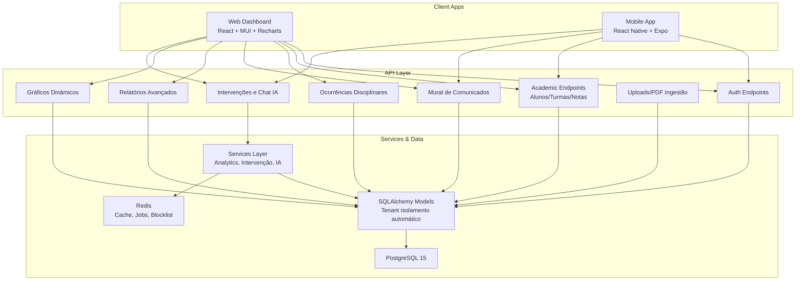

**Diagram sources**
- [ARCHITECTURE.md](file://docs/ARCHITECTURE.md)
- [API.md](file://docs/API.md)
- [frontend/README.md](file://frontend/README.md)
- [backend/README.md](file://backend/README.md)

**Section sources**
- [README.md](file://README.md)
- [ARCHITECTURE.md](file://docs/ARCHITECTURE.md)
- [API.md](file://docs/API.md)
- [frontend/README.md](file://frontend/README.md)
- [backend/README.md](file://backend/README.md)

## Core Components
Below are the platform’s major capabilities and how they integrate across the ecosystem.

- Interactive Dashboards
  - Real-time KPIs, distribution charts, and teacher dashboards
  - Paginated and filtered views for administrators and educators
  - Student portal provides personalized transcript and recent notices
- Academic Management System
  - Full lifecycle for students, classes, and grading (trimesters, totals, absences)
  - PDF bulletin generation and export
- Student and Class Organization
  - Student records with enrollment metadata and class grouping
  - Class-level analytics and teacher dashboards
- Disciplinary Occurrence Tracking
  - Structured logging of warnings, commendations, and suspensions with severity
  - Role-based permissions and author attribution
- Announcement Portal
  - Targeted messaging to entire school, classes, or individuals
  - Read receipts and pagination
- AI-Powered Interventions
  - Automated risk scoring and suggested actions
  - Natural language chat assistant for insights and reports
- Advanced Reporting Capabilities
  - Prebuilt reports: risk radar, top movers, efficiency comparison, attendance correlation
  - Export to CSV/XLSX
- Automated PDF Ingestion
  - Background processing of transcripts via upload queue
  - Upsert logic by registration number and academic year normalization
- Multi-Tenancy Architecture
  - Automatic tenant and academic-year filtering at the ORM level
  - Role-based access control and silent token refresh
- Student Portal
  - Personalized view of grades, occurrences, and notices
  - Secure PDF download of transcript
- Mobile Application
  - Dashboard summary, student list with search, and quick access to reports and chat

**Section sources**
- [README.md](file://README.md)
- [API.md](file://docs/API.md)
- [ARCHITECTURE.md](file://docs/ARCHITECTURE.md)
- [frontend/src/features/dashboard/DashboardPage.tsx](file://frontend/src/features/dashboard/DashboardPage.tsx)
- [frontend/src/features/alunos/MeuBoletimPage.tsx](file://frontend/src/features/alunos/MeuBoletimPage.tsx)
- [frontend/src/features/ai-chat/ChatWidget.tsx](file://frontend/src/features/ai-chat/ChatWidget.tsx)
- [mobile/app/(tabs)/index.tsx](file://mobile/app/(tabs)/index.tsx)
- [mobile/app/(tabs)/alunos.tsx](file://mobile/app/(tabs)/alunos.tsx)

## Architecture Overview
The platform enforces strict tenant and academic-year isolation automatically at the ORM level. Authentication uses JWT with silent refresh, and sensitive endpoints are rate-limited. Background jobs handle long-running tasks like PDF ingestion and notifications.

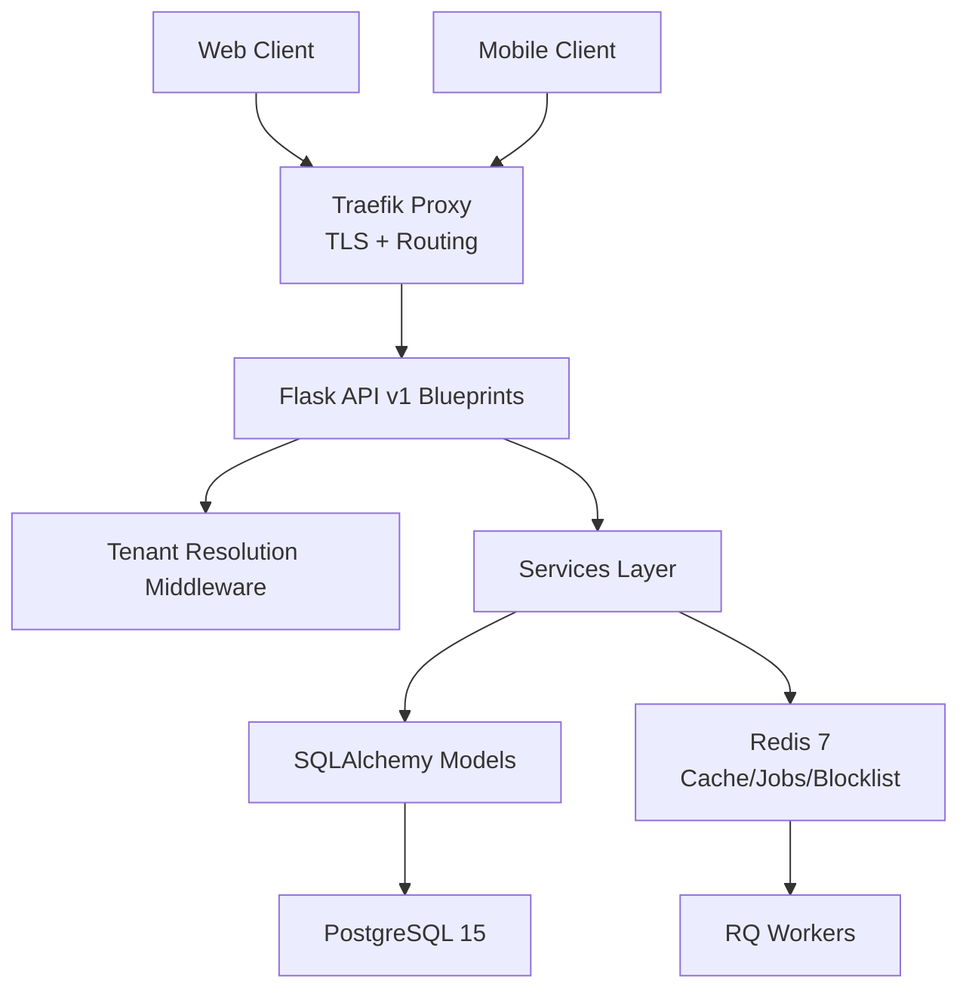

**Diagram sources**
- [ARCHITECTURE.md](file://docs/ARCHITECTURE.md)

**Section sources**
- [ARCHITECTURE.md](file://docs/ARCHITECTURE.md)

## Detailed Component Analysis

### Interactive Dashboards
- Purpose: Provide at-a-glance visibility for leadership and teachers
- Key features:
  - KPI cards (total students, active classes, overall average, at-risk count)
  - Distribution pie and top-discipline bar charts
  - Teacher dashboard with filters by query, shift, and class
- Data sources: Dashboard metrics and chart builders
- Benefits:
  - Administrators gain strategic insights
  - Teachers quickly identify struggling students and trends

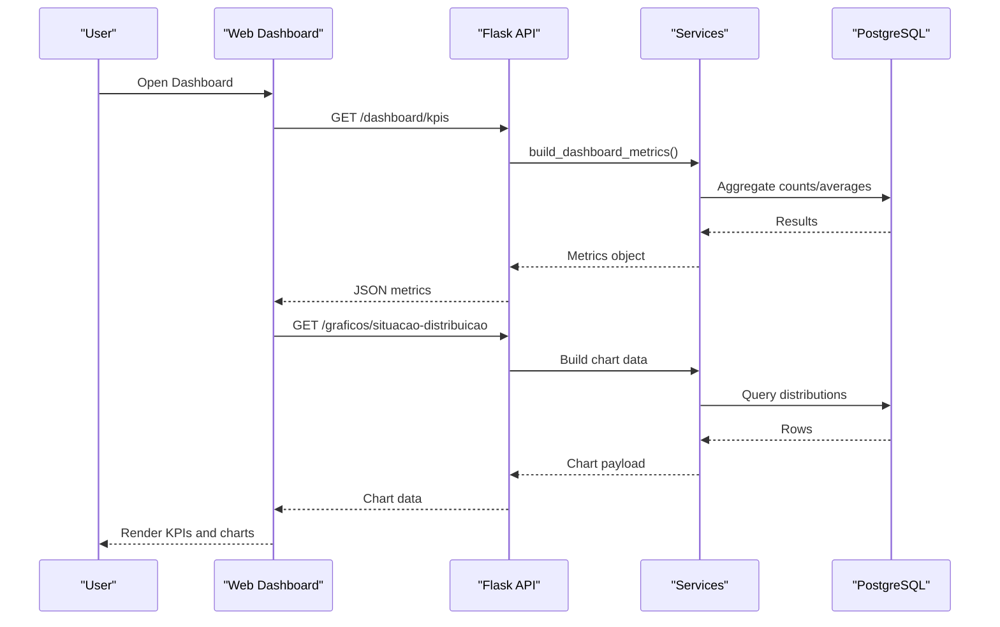

**Diagram sources**
- [backend/app/api/v1/dashboard.py](file://backend/app/api/v1/dashboard.py)
- [backend/app/api/v1/graficos.py](file://backend/app/api/v1/graficos.py)
- [frontend/src/features/dashboard/DashboardPage.tsx](file://frontend/src/features/dashboard/DashboardPage.tsx)

**Section sources**
- [backend/app/api/v1/dashboard.py](file://backend/app/api/v1/dashboard.py)
- [backend/app/api/v1/graficos.py](file://backend/app/api/v1/graficos.py)
- [frontend/src/features/dashboard/DashboardPage.tsx](file://frontend/src/features/dashboard/DashboardPage.tsx)

### Academic Management System
- Purpose: Complete lifecycle for managing students, classes, and grades
- Key features:
  - CRUD for students and classes
  - Trimester-based grading, absence tracking, and computed totals
  - Transcript PDF generation and download
- Benefits:
  - Streamlined record keeping
  - Automated computation reduces manual errors
  - PDF export supports offline sharing

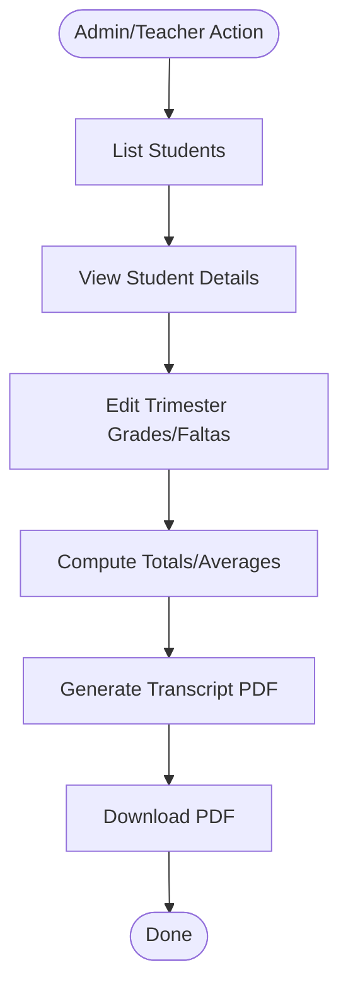

**Diagram sources**
- [API.md](file://docs/API.md)
- [frontend/src/features/alunos/MeuBoletimPage.tsx](file://frontend/src/features/alunos/MeuBoletimPage.tsx)

**Section sources**
- [API.md](file://docs/API.md)
- [frontend/src/features/alunos/MeuBoletimPage.tsx](file://frontend/src/features/alunos/MeuBoletimPage.tsx)

### Student and Class Organization
- Purpose: Organize and track students within classes and academic years
- Key features:
  - Class grouping stored as string fields derived from imported PDFs
  - Filtering by shift, grade, and class
- Benefits:
  - Cohort-based analytics
  - Efficient teacher planning and grading

**Section sources**
- [backend/app/api/v1/graficos.py](file://backend/app/api/v1/graficos.py)
- [backend/app/api/v1/relatorios.py](file://backend/app/api/v1/relatorios.py)

### Disciplinary Occurrence Tracking
- Purpose: Record and manage behavioral incidents with severity and actions
- Key features:
  - Create/update/delete occurrences with type/severity
  - Role-based authorization and author attribution
- Benefits:
  - Transparent tracking for administration
  - Evidence-based interventions

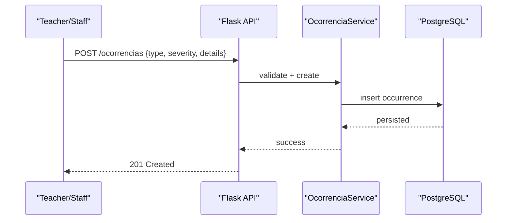

**Diagram sources**
- [backend/app/api/v1/ocorrencias.py](file://backend/app/api/v1/ocorrencias.py)

**Section sources**
- [backend/app/api/v1/ocorrencias.py](file://backend/app/api/v1/ocorrencias.py)

### Announcement Portal
- Purpose: Broadcast notices to the school, classes, or individuals
- Key features:
  - Targeted recipients, read receipts, and pagination
  - Staff can create/edit/delete; authors can only modify their own posts (with manager override)
- Benefits:
  - Efficient communication with reach control
  - Auditable delivery and read tracking

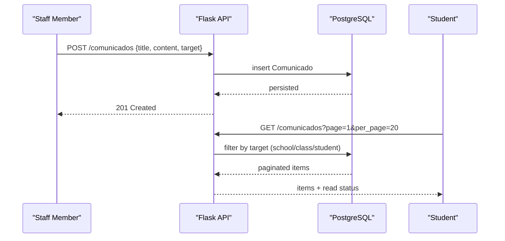

**Diagram sources**
- [backend/app/api/v1/comunicados.py](file://backend/app/api/v1/comunicados.py)

**Section sources**
- [backend/app/api/v1/comunicados.py](file://backend/app/api/v1/comunicados.py)

### AI-Powered Interventions
- Purpose: Proactively identify at-risk students and provide actionable insights
- Key features:
  - Risk scoring and suggested actions
  - Bulk analysis for high-risk lists
  - Natural language chat assistant for ad-hoc queries and visualizations
- Benefits:
  - Early intervention improves outcomes
  - Reduces workload by automating pattern detection

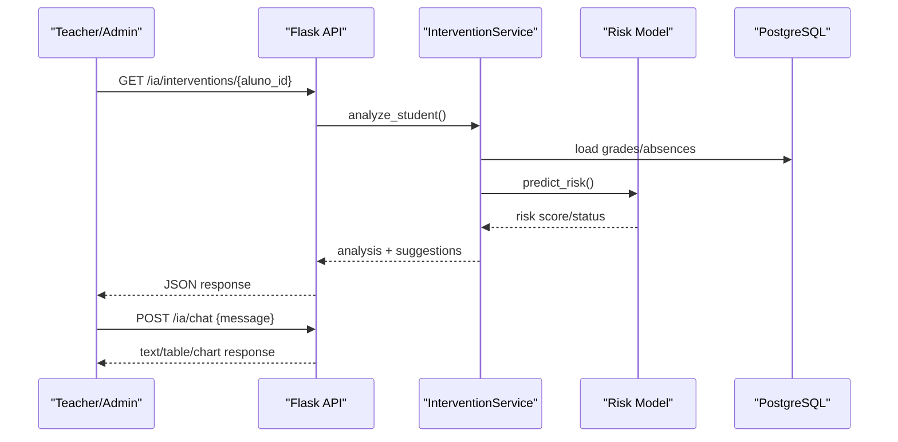

**Diagram sources**
- [backend/app/api/v1/ai.py](file://backend/app/api/v1/ai.py)
- [backend/app/services/ai_predictor.py](file://backend/app/services/ai_predictor.py)
- [frontend/src/features/ai-chat/ChatWidget.tsx](file://frontend/src/features/ai-chat/ChatWidget.tsx)

**Section sources**
- [backend/app/api/v1/ai.py](file://backend/app/api/v1/ai.py)
- [backend/app/services/ai_predictor.py](file://backend/app/services/ai_predictor.py)
- [frontend/src/features/ai-chat/ChatWidget.tsx](file://frontend/src/features/ai-chat/ChatWidget.tsx)

### Advanced Reporting Capabilities
- Purpose: Enable data-driven decisions with built-in and exportable reports
- Key features:
  - Reports: risk radar, top movers, efficiency comparison, attendance correlation, class radar
  - Filters by shift, grade, class, discipline
  - Export to CSV/XLSX
- Benefits:
  - Comprehensive analytics without manual spreadsheets
  - Shareable artifacts for stakeholders

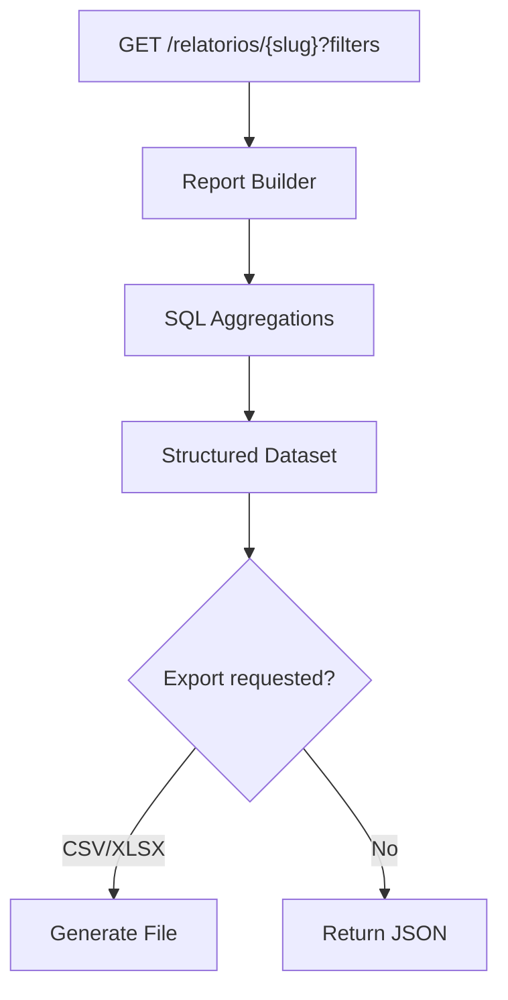

**Diagram sources**
- [backend/app/api/v1/relatorios.py](file://backend/app/api/v1/relatorios.py)

**Section sources**
- [backend/app/api/v1/relatorios.py](file://backend/app/api/v1/relatorios.py)

### Automated PDF Ingestion
- Purpose: Accelerate data entry by extracting grades from transcripts
- Key features:
  - Upload PDFs via REST endpoint
  - Background job processing with Redis/RQ
  - Upsert by registration number and normalize class names
- Benefits:
  - Dramatically reduces manual data entry
  - Consistent academic year handling

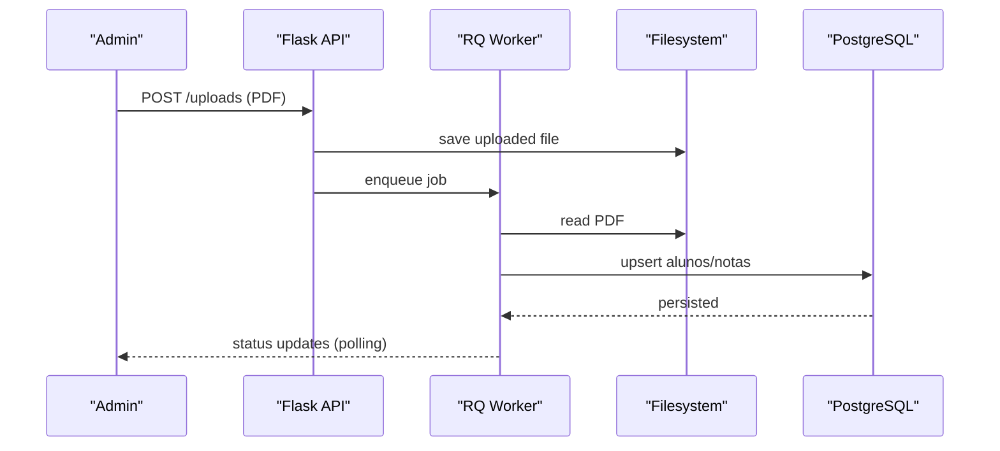

**Diagram sources**
- [API.md](file://docs/API.md)
- [ARCHITECTURE.md](file://docs/ARCHITECTURE.md)

**Section sources**
- [API.md](file://docs/API.md)
- [ARCHITECTURE.md](file://docs/ARCHITECTURE.md)

### Multi-Tenancy Architecture
- Purpose: Support multiple schools under a single installation with complete data isolation
- Key features:
  - Tenant resolution via JWT, headers, or host
  - Automatic tenant and academic-year filtering at ORM level
  - Role-based access control and silent refresh
- Benefits:
  - Cost-effective SaaS deployment
  - Strong data governance and compliance

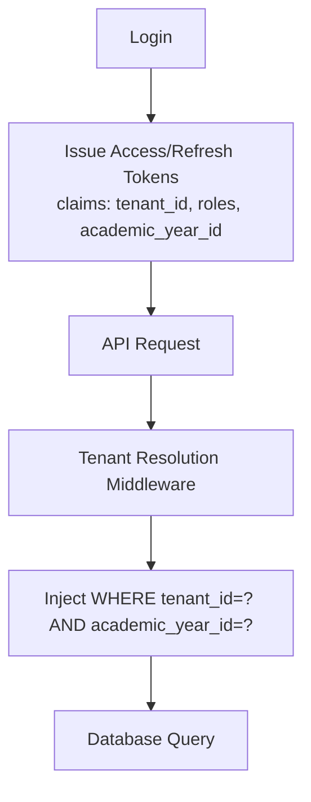

**Diagram sources**
- [ARCHITECTURE.md](file://docs/ARCHITECTURE.md)
- [API.md](file://docs/API.md)

**Section sources**
- [ARCHITECTURE.md](file://docs/ARCHITECTURE.md)
- [API.md](file://docs/API.md)

### Student Portal
- Purpose: Self-service for students and guardians
- Key features:
  - Personal transcript view
  - Recent notices and occurrence history
  - Secure PDF download of transcript
- Benefits:
  - Empowers learners with timely information
  - Reduces administrative overhead

**Section sources**
- [frontend/src/features/alunos/MeuBoletimPage.tsx](file://frontend/src/features/alunos/MeuBoletimPage.tsx)

### Mobile Application
- Purpose: On-the-go access to key functions
- Key features:
  - Dashboard summary cards
  - Student list with search and pull-to-refresh
  - Quick access to reports and AI chat
- Benefits:
  - Accessibility for staff and students
  - Faster decision-making in classrooms

**Section sources**
- [mobile/app/(tabs)/index.tsx](file://mobile/app/(tabs)/index.tsx)
- [mobile/app/(tabs)/alunos.tsx](file://mobile/app/(tabs)/alunos.tsx)

## Dependency Analysis
- Cohesion and Coupling
  - Domain blueprints isolate concerns (auth, academic, reports, AI)
  - Services encapsulate business logic and external integrations
  - Frontend components consume typed APIs and shared UI libraries
- External Dependencies
  - PostgreSQL for persistence, Redis for caching/jobs/blocklist, RQ for background tasks
  - Traefik for reverse proxy and TLS termination
- Multi-Tenancy
  - Tenant and academic-year enforced via middleware and ORM event listeners

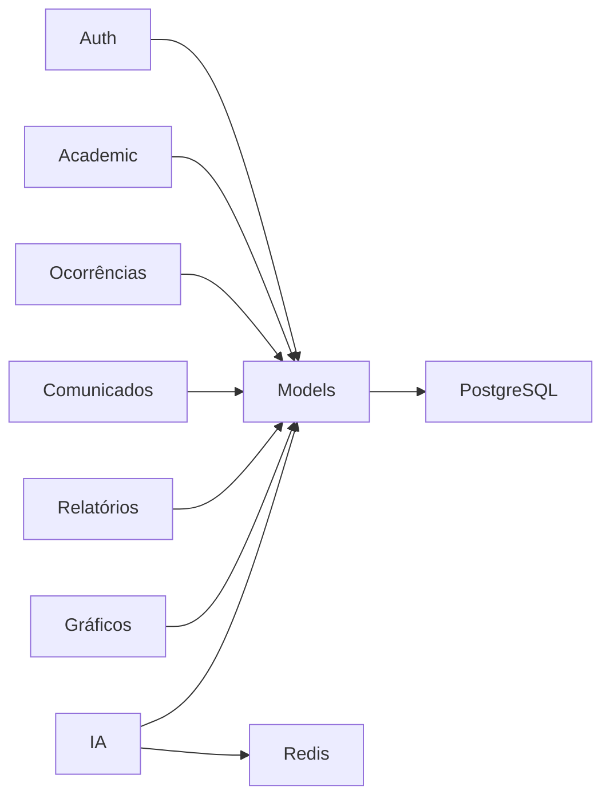

**Diagram sources**
- [ARCHITECTURE.md](file://docs/ARCHITECTURE.md)

**Section sources**
- [ARCHITECTURE.md](file://docs/ARCHITECTURE.md)

## Performance Considerations
- Frontend
  - Code splitting, intelligent caching, and tag-based invalidation reduce latency
- Backend
  - Pagination across list endpoints, Redis caching for heavy queries, connection pooling
- Scalability
  - Stateless backend behind a reverse proxy, horizontally scalable workers, read replicas for analytics

[No sources needed since this section provides general guidance]

## Troubleshooting Guide
- Authentication and Authorization
  - Verify JWT presence and roles; silent refresh handles token renewal
  - Use dedicated endpoints for password reset and logout
- Multi-Tenancy
  - Ensure tenant context is resolved; super-admin bypasses tenant filter
- PDF Ingestion
  - Confirm upload endpoint acceptance and background job progress
- Reports and Charts
  - Validate filters and export formats; check for empty datasets

**Section sources**
- [API.md](file://docs/API.md)
- [ARCHITECTURE.md](file://docs/ARCHITECTURE.md)

## Conclusion
ColaboraEdu delivers a cohesive, scalable, and secure educational management ecosystem. Its combination of interactive dashboards, AI-driven insights, automated ingestion, and multi-tenant architecture sets it apart from legacy systems by enabling proactive decision-making, reducing manual effort, and ensuring strong data governance across institutions.