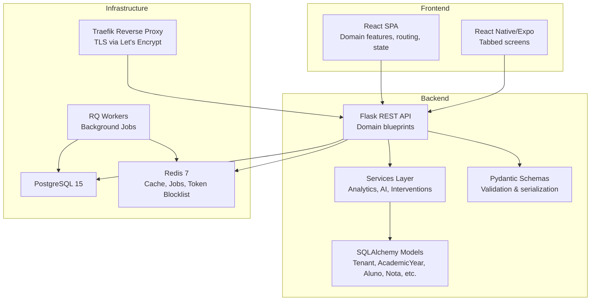
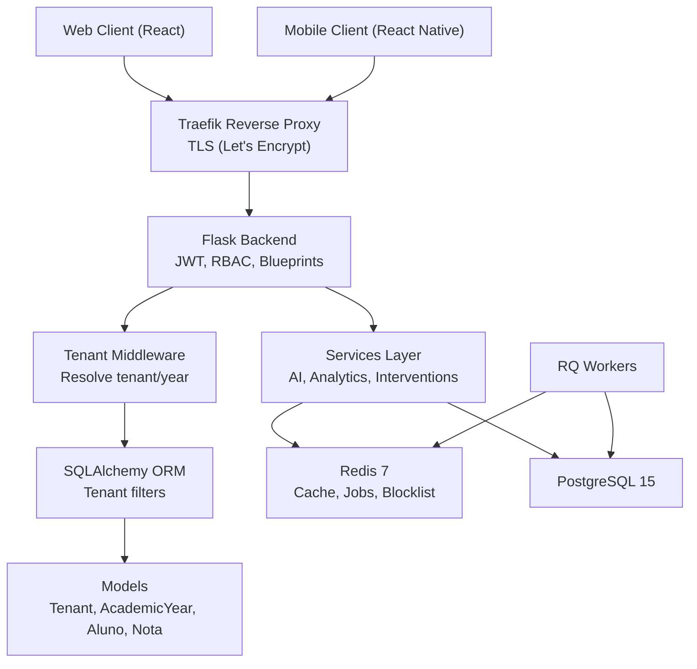
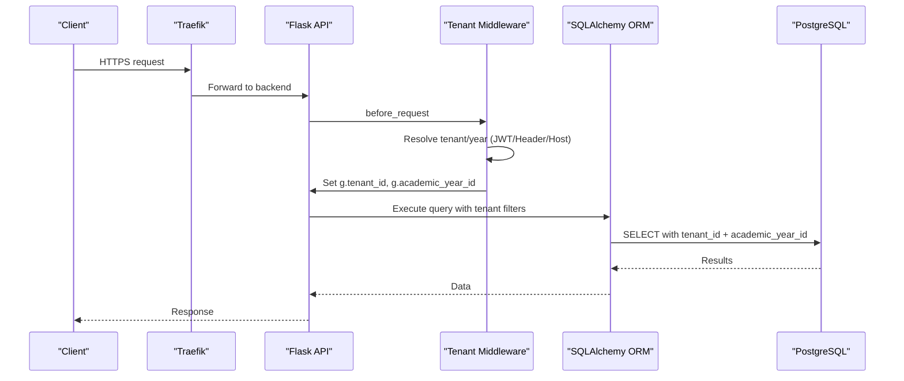
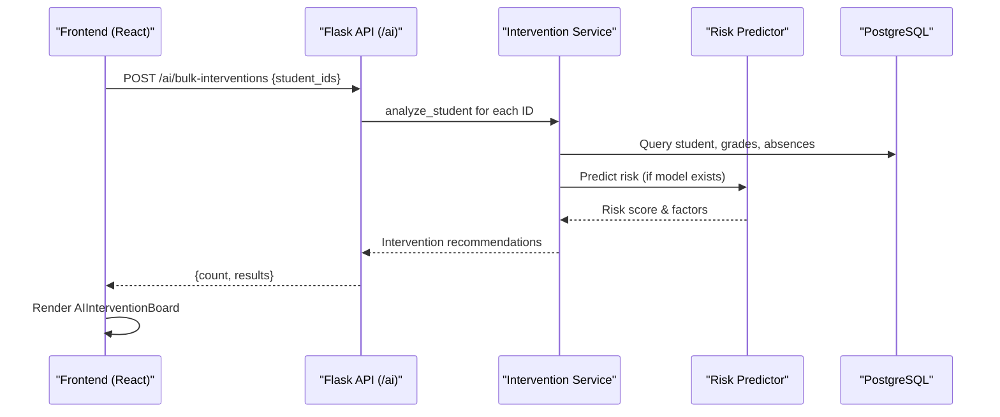
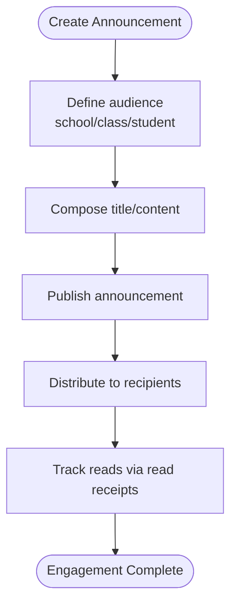
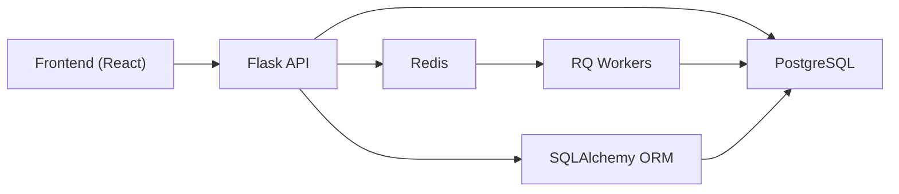

# Introduction

<cite>
**Referenced Files in This Document**
- [README.md](file://README.md)
- [docs/ARCHITECTURE.md](file://docs/ARCHITECTURE.md)
- [docs/API.md](file://docs/API.md)
- [backend/README.md](file://backend/README.md)
- [frontend/README.md](file://frontend/README.md)
- [docs/## Plano de Desenvolvimento — Plataforma.prompt.md](file://docs/## Plano de Desenvolvimento — Plataforma.prompt.md)
- [backend/app/core/middleware.py](file://backend/app/core/middleware.py)
- [backend/app/models/tenant.py](file://backend/app/models/tenant.py)
- [backend/app/api/v1/ai.py](file://backend/app/api/v1/ai.py)
- [backend/app/services/intervention_service.py](file://backend/app/services/intervention_service.py)
- [backend/app/services/ai_predictor.py](file://backend/app/services/ai_predictor.py)
- [frontend/src/features/dashboard/AIInterventionBoard.tsx](file://frontend/src/features/dashboard/AIInterventionBoard.tsx)
- [frontend/src/features/dashboard/BulkInterventionPage.tsx](file://frontend/src/features/dashboard/BulkInterventionPage.tsx)
</cite>

## Table of Contents
1. [Introduction](#introduction)
2. [Project Structure](#project-structure)
3. [Core Components](#core-components)
4. [Architecture Overview](#architecture-overview)
5. [Detailed Component Analysis](#detailed-component-analysis)
6. [Dependency Analysis](#dependency-analysis)
7. [Performance Considerations](#performance-considerations)
8. [Troubleshooting Guide](#troubleshooting-guide)
9. [Conclusion](#conclusion)

## Introduction
ColaboraEdu is a multi-tenant SaaS platform designed to modernize school administration by transforming traditional, paper-based workflows into digital, efficient, and data-driven processes. Its mission is to streamline academic management, enhance student outcomes through AI-powered insights, and improve communication among schools, teachers, students, and parents.

Key value propositions:
- Complete academic management: centralized control of students, classes, grades, reports, and attendance.
- AI-powered interventions: automated risk detection and actionable recommendations for at-risk students.
- Seamless communication: classroom and school-wide announcements, integrated with reading tracking.
- Multi-tenant architecture: secure isolation of data across institutions with flexible tenant resolution.
- Developer-friendly stack: modular backend, responsive frontend, and mobile access for broad stakeholder reach.

Practical examples:
- Teachers input grades and attendance; the system aggregates performance and flags students needing support.
- School leaders generate risk radar reports and teacher efficiency dashboards to guide strategic decisions.
- Parents receive timely announcements and can access their child’s report card and performance trends.
- Administrators manage users, configure academic years, and monitor audit logs for compliance.

These capabilities are grounded in a robust technical foundation that supports scalability, security, and maintainability.

**Section sources**
- [README.md:26-51](file://README.md#L26-L51)
- [docs/## Plano de Desenvolvimento — Plataforma.prompt.md:3-13](file://docs/## Plano de Desenvolvimento — Plataforma.prompt.md#L3-L13)

## Project Structure
The platform follows a clear separation of concerns across backend, frontend, and supporting documentation and infrastructure:

- Backend (Flask): REST API organized by domain-focused blueprints, layered services for business logic, SQLAlchemy models, and Pydantic schemas for validation.
- Frontend (React): SPA with domain-specific features, routing, state management, and UI components.
- Mobile (React Native/Expo): Tabbed interface for on-the-go access.
- Documentation: Architecture, API reference, deployment, roadmap, and development plans.
- Infrastructure: Dockerized development and production setups with Traefik reverse proxy and Let's Encrypt TLS.

**Diagram sources**
- [docs/ARCHITECTURE.md:139-217](file://docs/ARCHITECTURE.md#L139-L217)
- [docs/ARCHITECTURE.md:274-289](file://docs/ARCHITECTURE.md#L274-L289)

**Section sources**
- [README.md:195-232](file://README.md#L195-L232)
- [backend/README.md:29-37](file://backend/README.md#L29-L37)
- [frontend/README.md:23-31](file://frontend/README.md#L23-L31)
- [docs/ARCHITECTURE.md:74-70](file://docs/ARCHITECTURE.md#L74-L70)

## Core Components
- Multi-tenancy: Each institution is a tenant with unique slug and isolated data. Tenant resolution prioritizes JWT claims, optional headers for super-admin context switching, and host-based mapping. Automatic ORM filtering ensures tenant and academic-year boundaries are enforced.
- Academic management: Endpoints cover users, students, classes, grades, reports, charts, announcements, and audit logs. Pagination and search enable scalable data access.
- AI-powered insights: Automated risk prediction and pedagogical intervention generation surface actionable recommendations for students and classrooms.
- Communication: Announcement board with pagination, read receipts, and targeted distribution to school, classes, or individuals.
- Authentication and authorization: JWT with silent refresh, role-based access control (RBAC), rate limiting, and fail-closed token blocklist.

**Section sources**
- [docs/ARCHITECTURE.md:74-136](file://docs/ARCHITECTURE.md#L74-L136)
- [docs/API.md:25-161](file://docs/API.md#L25-L161)
- [docs/API.md:632-675](file://docs/API.md#L632-L675)
- [backend/app/core/middleware.py:6-109](file://backend/app/core/middleware.py#L6-L109)
- [backend/app/models/tenant.py:7-22](file://backend/app/models/tenant.py#L7-L22)

## Architecture Overview
The system is a multi-tenant SaaS with a clear separation between presentation and business logic. The frontend (web and mobile) communicates with the Flask backend over HTTPS, protected by JWT and RBAC. Background processing offloads heavy tasks like PDF ingestion to Redis/RQ workers. Data isolation is enforced at the ORM level and through tenant-aware middleware.

**Diagram sources**
- [docs/ARCHITECTURE.md:3-70](file://docs/ARCHITECTURE.md#L3-L70)
- [docs/ARCHITECTURE.md:169-205](file://docs/ARCHITECTURE.md#L169-L205)

**Section sources**
- [docs/ARCHITECTURE.md:3-70](file://docs/ARCHITECTURE.md#L3-L70)
- [docs/ARCHITECTURE.md:169-205](file://docs/ARCHITECTURE.md#L169-L205)

## Detailed Component Analysis

### Multi-Tenancy and Academic Management
- Tenant resolution: The middleware resolves tenant and academic year from JWT claims, optional headers, or host, with strict enforcement and fallbacks for development. It sets global tenant identifiers used by the ORM event listener to automatically filter queries.
- Academic management: The API exposes endpoints for users, students, classes, grades, reports, charts, announcements, and audit logs. Pagination and search parameters ensure efficient access to large datasets.

**Diagram sources**
- [backend/app/core/middleware.py:6-109](file://backend/app/core/middleware.py#L6-L109)
- [docs/ARCHITECTURE.md:91-99](file://docs/ARCHITECTURE.md#L91-L99)

**Section sources**
- [backend/app/core/middleware.py:6-109](file://backend/app/core/middleware.py#L6-L109)
- [docs/ARCHITECTURE.md:74-100](file://docs/ARCHITECTURE.md#L74-L100)
- [docs/API.md:263-341](file://docs/API.md#L263-L341)

### AI-Powered Interventions
- Intervention generation: The backend analyzes student performance across subjects and attendance to produce prioritized, type-specific recommendations (behavioral, academic, emergency, maintenance).
- Risk modeling: A trained scikit-learn model predicts failure risk based on aggregated grades and absences, returning a score and categorized risk level.
- Frontend integration: Bulk intervention generation allows educators to select students and receive AI-backed recommendations displayed in a responsive dashboard.

**Diagram sources**
- [backend/app/api/v1/ai.py:27-51](file://backend/app/api/v1/ai.py#L27-L51)
- [backend/app/services/intervention_service.py:27-124](file://backend/app/services/intervention_service.py#L27-L124)
- [backend/app/services/ai_predictor.py:68-120](file://backend/app/services/ai_predictor.py#L68-L120)
- [frontend/src/features/dashboard/AIInterventionBoard.tsx:25-156](file://frontend/src/features/dashboard/AIInterventionBoard.tsx#L25-L156)
- [frontend/src/features/dashboard/BulkInterventionPage.tsx:33-222](file://frontend/src/features/dashboard/BulkInterventionPage.tsx#L33-L222)

**Section sources**
- [backend/app/api/v1/ai.py:11-51](file://backend/app/api/v1/ai.py#L11-L51)
- [backend/app/services/intervention_service.py:8-128](file://backend/app/services/intervention_service.py#L8-L128)
- [backend/app/services/ai_predictor.py:1-120](file://backend/app/services/ai_predictor.py#L1-L120)
- [frontend/src/features/dashboard/AIInterventionBoard.tsx:1-157](file://frontend/src/features/dashboard/AIInterventionBoard.tsx#L1-L157)
- [frontend/src/features/dashboard/BulkInterventionPage.tsx:1-223](file://frontend/src/features/dashboard/BulkInterventionPage.tsx#L1-L223)

### Communication and Announcements
- Announcement lifecycle: Creation with targeted distribution (school, class, or individual), pagination, and read receipt tracking. Teachers can update or delete their own announcements; administrators have broader permissions.
- Parent and student engagement: Students and guardians access personalized portals to view announcements and report cards, improving transparency and involvement.

**Diagram sources**
- [docs/API.md:469-550](file://docs/API.md#L469-L550)

**Section sources**
- [docs/API.md:469-550](file://docs/API.md#L469-L550)

## Dependency Analysis
- Frontend depends on the backend REST API and uses RTK Query for caching and invalidation. Silent refresh handles token renewal transparently.
- Backend depends on PostgreSQL for persistence, Redis for caching and background jobs, and RQ workers for asynchronous tasks like PDF ingestion.
- Tenant resolution and ORM event listeners ensure data isolation across tenants and academic years without scattering filters across endpoints.

**Diagram sources**
- [docs/ARCHITECTURE.md:55-69](file://docs/ARCHITECTURE.md#L55-L69)
- [docs/ARCHITECTURE.md:169-205](file://docs/ARCHITECTURE.md#L169-L205)

**Section sources**
- [docs/ARCHITECTURE.md:55-69](file://docs/ARCHITECTURE.md#L55-L69)
- [docs/ARCHITECTURE.md:169-205](file://docs/ARCHITECTURE.md#L169-L205)

## Performance Considerations
- Frontend: Route-based code splitting, intelligent caching with RTK Query, and production sourcemaps disabled reduce load times.
- Backend: Connection pooling, pagination across lists, Redis caching for heavy report queries, and background jobs for long-running tasks (PDF ingestion, notifications) improve responsiveness.
- Scalability: Stateless backend instances behind Traefik, shared Redis queues for workers, and read replicas for reporting support horizontal scaling.

**Section sources**
- [docs/ARCHITECTURE.md:313-335](file://docs/ARCHITECTURE.md#L313-L335)

## Troubleshooting Guide
- Authentication issues: Verify JWT presence and validity; ensure silent refresh is functioning; check Redis availability for blocklist checks.
- Multi-tenancy errors: Confirm tenant resolution order (JWT claim, header, host); ensure tenant is active; validate academic year context.
- API errors: Review documented error codes and formats; check rate limits and RBAC permissions.
- PDF ingestion: Confirm upload endpoint acceptance, worker availability, and Redis connectivity; monitor job status via polling.

**Section sources**
- [docs/API.md:742-771](file://docs/API.md#L742-L771)
- [docs/ARCHITECTURE.md:293-310](file://docs/ARCHITECTURE.md#L293-L310)

## Conclusion
ColaboraEdu delivers a comprehensive, secure, and scalable SaaS solution for modern school administration. By combining multi-tenant architecture, robust academic management, AI-powered insights, and seamless communication tools, it enables schools to operate efficiently, make data-driven decisions, and improve student outcomes. The platform’s developer-friendly architecture and clear separation of concerns facilitate ongoing enhancements and reliable deployments.